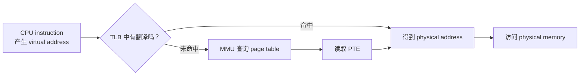

## page 翻译

```text
virtual address = VPN + page offset
physical address = PPN + page offset

翻译的时候替换页号，保持 page offset 不变。
也就是 VPN -> PPN

PTE: page table entry，就是页表中的条目
```



## MMU

Memory Management Unit

是处理器中的硬件，负责把 CPU 产生的虚拟地址翻译为物理地址。

## 观察

```text
initialized global = 0x5576a70a0010

5576a70a0000-5576a70a1000 rw-p 00003000 08:05 3289970                    /home/xgf/code/system-learning/cpp/week5/day1/address_space_layout
```

那这个是啥意思啊？就是这个 virtual address range 落在这一个伪文件？是什么意思？

### 回答

你的观察是对的，但这里要分清两个“文件”：

```text
/proc/<pid>/maps
```

是一个**伪文件**，作用是让我们**查看进程当前有哪些 virtual memory mappings。**

而这一行最后的：

```text
/home/xgf/code/system-learning/cpp/week5/day1/address_space_layout
```

不是伪文件，它是磁盘上真正的 ELF 可执行文件，也是这段 mapping 的 `backing file`，即“这段映射**最初**由哪个文件提供内容”。

具体意思是：

```text
5576a70a0000-5576a70a1000
    当前进程 virtual address space 中的一段半开区间：
    [0x5576a70a0000, 0x5576a70a1000)

rw-p
    r：可读
    w：可写
    -：不可执行
    p：private mapping，私有映射

00003000
    这段 mapping 的起点对应可执行文件 0x3000 的 file offset。

08:05
    backing file 所在设备的 major:minor device number。

3289970
    backing file 在该设备上的 inode number。

最后的 pathname
    说明这段 mapping 由 address_space_layout 这个可执行文件支持。
```

### **文件和 offset 只在物理页尚未准备好时充当数据来源：**

```
程序访问 VA
-> page table 暂时没有有效映射
-> page fault
-> kernel 查看：该 VA 的 backing file（数据来源） 和 file offset
-> 把对应文件内容放入某个 physical page
-> 建立 VA -> PA
-> 重新执行原指令
-> CPU 从 physical memory 读取

之后再次访问，通常直接：
VA -> PA -> physical memory
```


## 验收问题

### 问题 1

`std::cout << &value` 打印出的通常是什么地址？为什么它不能直接当作物理地址理解？

VA

因为这是当前的 process 看到的 address space，VA 要经过翻译才能得到 PA。

### 问题 2

两个进程都出现虚拟地址 `0x5000`，为什么它们仍然可以访问不同的数据？

因为生效的 page table 不同，最终能让他们得到不同的 PA。

### 问题 3

假设 page size 是 `4096 bytes`，地址翻译时 VPN 和 page offset 分别起什么作用？哪一部分会被翻译，哪一部分保持不变？

VPN 让其找到 PPN，就是 PA 所在的页的 number。

然后 page offset 能在这个页里面找到对应的数据。

VPN 被翻译，page offset 保持不变。

### 问题 4

分别用一句话说明：

```text
MMU
page table
PTE
TLB
```

的责任。

```text
MMU：位于处理器，负责把 VA 翻译成 PA
page table：负责把 VPN -> PPN
PTE：记录了 VPN -> PPN，以及相应一些状态信息
TLB：页表缓存，为了减少每次都去查 page table 的代价
```


### 问题 5

为什么 `TLB miss` 不等于 `page fault`？

TLB miss 只是意味着当前最近访问的 VPN 里没有出现当前查询的，后续可以去 MMU 查询 page table。所以不等价于 page fault。

### 问题 6

`/proc/<pid>/maps` 展示了什么？它没有直接展示什么？

让我们查看 process 当前有哪些 virtual memory mappings。

没有直接展示 PA。
