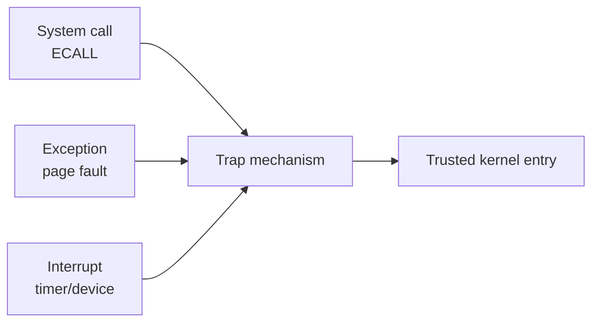
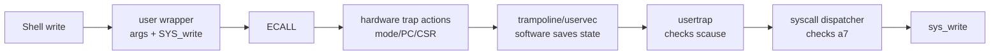

# Week5 Day2：跟着 xv6 Shell 的一次 `write`，看懂 Trap

> 今日定位：Week4 已经知道 user space 通过 system call 请求 kernel 服务；Week5 Day1 又补上了 user page table 与地址隔离。今天跟着 MIT 6.S081 Lec06 的真实讲课顺序，观察 xv6 Shell 执行一次 `write`：ECALL 前是什么状态，ECALL 后硬件改了什么，还有什么必须由 kernel 软件继续完成。

---

# Part 1：前情提要与必要术语

## 1. 从 Day1 接到今天

Day1 建立了：

```text
user process 使用 virtual address
-> MMU 根据当前 page table 翻译
-> PTE 决定映射和访问权限
```

因此 user program 面临两个限制：

```text
1. 普通 user page table 不会把所有 kernel code/data 开放给 user mode。
2. 普通函数调用不会把 CPU 从 user mode 提升到 supervisor mode。
```

但 `read()`、`write()`、`mmap()` 又必须让 kernel 代表进程完成受保护的工作。

今天的问题就是：

```text
user code 不能直接调用 kernel function，
system call 到底怎样受控地进入 kernel？
```

## 2. 先交代今天跟随的课程和例子

今天跟随：

- [MIT 6.S081 Lec06：Isolation & system call entry/exit](https://mit-public-courses-cn-translatio.gitbook.io/mit6-s081/lec06-isolation-and-system-call-entry-exit-robert)

课程使用的环境是：

```text
xv6：
    MIT 用于教学的简化 Unix-like operating system。

RISC-V：
    xv6 在这门课中运行的 instruction set architecture。

xv6 Shell：
    运行在 user mode 的用户程序。
```

`ISA`：Instruction Set Architecture，指令集架构。

课程从一个具体场景出发：

```c
write(2, "$ ", 2);
```

xv6 Shell 使用 `write` 输出提示符 `"$ "`。课程在 GDB 中跟踪这一次 system call，观察：

```text
6.1：为什么需要统一的 trap mechanism
6.2：write 从 user code 到 kernel 再返回的整体路径
6.3：执行 ECALL 之前，CPU 是什么状态
6.4：执行 ECALL 之后，哪些状态改变，哪些没有改变
```

所以正文会直接沿：

```text
6.1 -> 6.2 -> 6.3 -> 6.4
```

推进，不会先讲一套抽象定义，再在后面重新讲一次课程。

### 今日阅读范围

必读：

1. [6.1 Trap 机制](https://mit-public-courses-cn-translatio.gitbook.io/mit6-s081/lec06-isolation-and-system-call-entry-exit-robert/6.1-trap)
2. [6.2 Trap 代码执行流程](https://mit-public-courses-cn-translatio.gitbook.io/mit6-s081/lec06-isolation-and-system-call-entry-exit-robert/6.2-trap-dai-ma-zhi-xing-liu-cheng)
3. [6.3 ECALL 指令之前的状态](https://mit-public-courses-cn-translatio.gitbook.io/mit6-s081/lec06-isolation-and-system-call-entry-exit-robert/6.3-before-ecall)
4. [6.4 ECALL 指令之后的状态](https://mit-public-courses-cn-translatio.gitbook.io/mit6-s081/lec06-isolation-and-system-call-entry-exit-robert/6.4-ecall-zhi-ling-zhi-hou-de-zhuang-tai)

今天严格停止在 `6.4`。

```text
6.5 uservec
6.6 usertrap
6.7 usertrapret
6.8 userret
```

的具体实现留到 Day3。

建议顺序：

```text
先读完这份 daily 的 Part 1 和 Part 2
-> 再读课程网页 6.1~6.4
-> 做一次 Linux strace 对照
-> 自己画图并回答验收问题
```

## 3. 今天真正需要的术语

### 3.1 system call

`system call`：系统调用。

沿用已经建立的三层区分：

```text
system call interface：
    user space 请求 kernel 服务的规则。

system call invocation：
    当前发生的这一次具体请求。

kernel system call handler：
    kernel 中真正检查参数并完成请求的代码。
```

### 3.2 trap

`trap`：陷入、捕获。

当前可以理解为：

```text
CPU 因某个事件暂停原来的指令流，
记录必要信息，并把控制权转交给预先设置的可信入口。
```

trap 的常见来源：

```text
system call：
    用户程序主动执行特殊指令，请求 kernel 服务。

exception：
    当前指令同步引发的事件，例如 page fault、illegal instruction。

interrupt：
    timer 或 device 等当前指令流之外的异步事件。
```

因此：

```text
system call 是 trap 的一种来源；
trap 不是 system call 的别名。
```

### 3.3 synchronous 与 asynchronous

`synchronous`：同步。

事件与当前执行的具体指令直接相关。例如：

```text
ECALL exception
page fault
illegal instruction
```

`asynchronous`：异步。

事件不一定由当前这条指令导致。例如：

```text
timer interrupt
disk / network device interrupt
```

### 3.4 ECALL

`ECALL` 本身是硬件/指令集层面的东西。

`ECALL`：Environment Call，环境调用。

它是 RISC-V 的一条机器指令，用来向 execution environment 发出服务请求。

在今天的 xv6 场景中：

```text
user mode 执行 ECALL
-> 产生同步 exception
-> 通过 trap mechanism 进入 supervisor trap entry
```

ECALL 不是 `write`：

```text
ECALL：
    只负责产生一次受控 trap。

SYS_write：
    表示这次请求的 system call number。

sys_write：
    kernel 中实现 write 语义的 handler。
```

Linux/x86-64 通常使用名为 `syscall` 的机器指令完成类似进入。今天使用 `ECALL` 是因为课程环境是 xv6/RISC-V。

### 3.5 privilege mode

`privilege`：特权、权限等级。

今天涉及：

```text
U-mode：User mode
S-mode：Supervisor mode
```

进入 S-mode 后可以访问一些 user mode 不能使用的控制寄存器和页面，但普通内存访问仍然受当前 page table 约束。

### 3.6 CPU state

`state`：状态。

#### 先补一层硬件地基：CPU 在做什么

CPU：Central Processing Unit，中央处理器。

`instruction`：机器指令，CPU 能识别并执行的一项基本操作，例如加法、读内存或跳转。

从程序执行角度看，CPU 会不断重复：

```text
根据 PC 找到下一条 instruction
-> 读取并译码 instruction
-> 执行运算、访存或跳转
-> 更新 PC 和其他状态
```

CPU 不只会做加减法。它还必须记住“现在执行到哪里、临时数据是什么、当前拥有什么权限”。这些正在被 CPU 使用的信息，合起来就是当前的 **CPU state**。

#### register 到底是什么

`register`：寄存器。

可以先把它理解为：

```text
CPU 能直接读写的一小组、固定用途或通用用途的状态槽位
```

它们属于处理器对软件公开的 **architecture-visible state**，也就是指令能够观察和操作的处理器状态。它们不是磁盘文件，也不是普通 RAM 中的一段 C++ 对象。

| 对象 | 在当前层次怎样理解 | 例子 |
|---|---|---|
| RAM / memory | 容量较大的主存，普通 load/store 根据地址访问 | heap、stack、代码和数据页 |
| general-purpose register | CPU 直接参与运算、传参和保存临时值的通用寄存器 | `a0`、`a1`、`a7` |
| special register / CSR | CPU 用来控制或记录执行环境的特殊寄存器 | `stvec`、`sepc`、`scause` |

`load` 表示从 memory 读取数据到 register；`store` 表示把 register 中的数据写入 memory。普通程序访问内存，最终会落到这类机器指令上。

今天会反复出现的几个普通 CPU 状态：

```text
PC：Program Counter，下一条或当前相关 instruction 在哪里。

SP：Stack Pointer，当前执行流正在使用的 stack 位置。
    在 RISC-V 中，sp 是通用寄存器 x2 的约定名称。

a0/a1/a2：
    RISC-V 调用约定中的 argument registers。
    xv6 Shell 调用 write 时，它们保存 fd、buffer address、length。

a7：
    xv6 的 system call wrapper 用它保存 system call number。
```

#### 这里的 stack 是谁的，里面放什么

这里的 `stack` 是程序运行时使用的一段 memory，不是 `std::stack` 容器。

对于正在 user mode 运行的 xv6 Shell，当前使用的是：

```text
Shell 进程 virtual address space 中的 user stack
```

函数调用时，每一层函数通常需要一块临时工作区域，称为：

```text
stack frame：栈帧
```

栈帧中可能保存：

```text
函数的局部变量
暂时放不进 register 的值
需要在返回前恢复的 register
函数参数的补充数据
返回调用者所需的信息
```

具体哪些内容真正进入 stack，由 ABI、compiler 和优化结果决定，并不是每个 C++ 局部变量都一定放在 stack。

#### SP 实际保存什么

SP 本身只是一个 register，它保存一个 **virtual address**：

```text
SP 的数值
-> 指向当前 stack frame 使用到的位置
-> CPU 通过这个地址访问 stack memory
```

SP 不保存整块 stack 的内容，也不是一个“栈对象的编号”。

RISC-V 的 stack 通常向较小的地址增长。函数需要新的 stack frame 时，常见做法是减小 SP；函数返回、释放该 frame 时，再增大 SP：

```text
调用前 sp = 0x8000
函数预留 32 bytes
-> sp = 0x7fe0

函数返回并释放 32 bytes
-> sp = 0x8000
```

这里说的“栈顶”就是 SP 标记的当前活动边界，不是说它一定处于一张内存图的视觉最上方。

#### user stack 和 kernel stack 不是同一个 stack

xv6 中，同一个进程进入 kernel 处理 system call 时还会使用独立的 `kernel stack`：

```text
user stack：
    属于进程的 user virtual address space；
    Shell 在 U-mode 调用普通函数时使用。

kernel stack：
    kernel 为该进程准备的受保护 stack；
    kernel 处理该进程的 trap/system call 时使用。
```

在 Shell 执行 ECALL 之前，SP 指向 Shell 的 user stack。**ECALL 硬件不会自动把 SP 换成 kernel SP**，所以刚执行完 ECALL 时，SP 仍然是原来的 user SP。后续 trap entry 软件才会取得 kernel stack 的位置并切换过去；具体实现留到 Day3。

因此，“ECALL 后必须保存用户状态”不是一句抽象口号。kernel 之后若想让 Shell 继续运行，就必须保住 Shell 原先的 PC、SP 和通用寄存器等状态。

为了以后能继续执行用户程序，trap 前后至少要关心：

```text
PC：Program Counter，程序计数器
SP：Stack Pointer，栈指针
general-purpose registers：通用寄存器
privilege mode
当前 page table
trap cause
返回位置
interrupt status
```

### 3.7 CSR

`CSR`：Control and Status Register，控制与状态寄存器。

#### 为什么叫 Control and Status

RISC-V ISA 除了定义普通运算寄存器，还定义了一组用于控制处理器行为、记录处理器状态的特殊寄存器：

```text
Control：
    告诉 CPU 接下来应按什么规则工作。
    例如 stvec 告诉 CPU：发生 supervisor trap 后，从哪个地址开始执行。

Status：
    记录刚才发生了什么或 CPU 当前处于什么状态。
    例如 scause 记录 trap 原因，sepc 记录被打断位置。
```

“Control”和“Status”不是要求每个 CSR 只能属于其中一边。有些 CSR 既能影响后续行为，也能保存当前状态。

#### CSR 和普通变量有什么区别

```text
C++ variable：
    通常放在 register 或 memory 中，由程序通过普通指令使用。

CSR：
    是 RISC-V architecture 定义的特殊 CPU state。
    它没有普通虚拟地址，不能把它当成 char* 后解引用。
    软件需要使用专门的 CSR instruction 读写，并受 privilege 检查。
```

例如 kernel 可以使用 `csrr` / `csrw` 一类指令读写允许访问的 CSR；U-mode 不能随意修改 supervisor CSR。与此同时，ECALL 等事件发生时，硬件也会自动更新部分 CSR。

所以这里有两个不同的操作者：

```text
CPU hardware：
    trap 发生瞬间，自动写 sepc、scause、sstatus 等必要状态，
    并读取 stvec 决定下一条 supervisor instruction 在哪里。

kernel software：
    进入 trap entry 后，再读取这些 CSR 判断原因，
    并继续保存普通寄存器、准备 kernel stack/page table。
```

先看一个缩略图，正文第 8 节会逐项展开：

```text
ECALL 前：
    a0/a1/a2/a7 = write 参数和 system call number
    PC = ECALL instruction
    stvec = kernel 事先设置的 trap entry

CPU 执行 ECALL：
    写 sepc / scause / sstatus
    读 stvec
    改 privilege 和 PC

ECALL 刚结束：
    a0/a1/a2/a7 仍是原值
    SP 仍是 user SP
    satp 仍指向原来的 user page table
```

注意：`satp` 本身是 CSR，不代表 ECALL 一定会修改它。“是不是 CSR”和“这次硬件有没有改它”是两个不同问题。

今天只记“它解决什么问题”，不背 CSR 编号和 bit：

| CSR | 英文全称 | 解决的问题 |
|---|---|---|
| `stvec` | Supervisor Trap Vector Base Address | trap 后第一条 supervisor 指令去哪里 |
| `sepc` | Supervisor Exception Program Counter | user code 在哪里被打断或引发异常 |
| `scause` | Supervisor Cause | 为什么发生 trap，是 interrupt 还是 exception |
| `stval` | Supervisor Trap Value | 是否有 fault address 等补充信息 |
| `sstatus` | Supervisor Status | trap 前的 privilege / interrupt 状态等 |
| `sscratch` | Supervisor Scratch | 最早期入口怎样获得一个安全的工作位置 |
| `satp` | Supervisor Address Translation and Protection | 当前使用哪套地址翻译/page table root |

开头的 `s` 表示 supervisor。

### 3.8 wrapper、entry、handler、dispatcher

`wrapper`：包装函数。

它在 user space 准备 arguments、system call number，并执行特殊机器指令。

`entry`：入口。

trap 后最先执行的一小段可信代码。

`handler`：处理函数。

根据 trap 原因完成处理。

`dispatcher`：分派器。

根据 system call number 选择 `sys_write` 等具体 handler。

它们不是同一个阶段。

---

# Part 2：教程主体

# 教程开始：跟着 6.S081 的 xv6 Shell `write`，走到 ECALL 之后

## 4. 先看今天要跟踪的完整场景

xv6 Shell 想输出提示符：

```c
write(2, "$ ", 2);
```

从 Shell 看，这像一次普通 C 函数调用。

但它的完整第一层路径是：

```text
xv6 Shell user code
-> user-space write wrapper（usys.S）
-> wrapper 准备 arguments 和 SYS_write
-> ECALL
-> CPU 进入 trap entry
-> uservec
-> usertrap
-> syscall dispatcher
-> sys_write
-> usertrapret
-> userret
-> 回到 user write wrapper
-> 回到 Shell
```

今天不是一口气学习所有函数，而是用这条路线定位：

```text
6.1：为什么需要 trap
6.2：整条路径有哪些阶段
6.3：ECALL 前是什么状态
6.4：ECALL 后是什么状态
```

Day3 再进入 `uservec / usertrap / usertrapret / userret` 的内部细节。

## 5. 顺着 6.1：为什么普通函数调用不够

假设 user program 知道某个 kernel function 的地址，能否直接：

```text
call kernel_function
```

不行。

### 原因 1：普通 call 不提升 privilege

普通函数调用主要完成：

```text
保存返回位置
跳到目标函数地址
```

它不会把 CPU 从 U-mode 改为 S-mode。

### 原因 2：user page table 不开放普通 kernel mappings

即使用户猜到一个 kernel virtual address：

```text
知道地址数值
不等于
当前 privilege + page table 允许访问
```

Day1 学到的 page table 权限在这里真正参与隔离。

所以需要一条由硬件限定的入口：

```text
user code 只能通过规定事件产生 trap
CPU 只跳到 kernel 预先设置的 trusted entry
user code 不能自己选择任意 supervisor instruction address
```

在 RISC-V system call 场景中，这个规定事件就是 `ECALL`。

### Trap 为什么是 system call 的上位机制

课程 6.1 把三类事件放在一起：

```text
Shell 主动执行 ECALL：
    system call，引发同步 exception。

程序访问未映射页面：
    page fault exception。

timer 或 device 到来：
    interrupt。
```

它们来源不同，但都需要：

```text
暂停当前执行
记录停在哪里和为什么停下
进入可信 kernel entry
由 kernel 决定怎样处理
```

这套共同机制就是 trap。



## 6. 顺着 6.2：先认清整条代码路径

课程接着给出 Shell `write` 的完整路径：

```text
write wrapper
-> ECALL
-> uservec
-> usertrap
-> syscall
-> sys_write
-> usertrapret
-> userret
-> user code
```

各阶段当前只需要知道：

| 阶段 | 当前层次的责任 |
|---|---|
| `write wrapper` | 在 user space 准备参数和 system call number |
| `ECALL` | 产生受控 trap |
| `uservec` | 最早期 assembly entry，先接住 user state |
| `usertrap` | kernel C trap handler，判断 trap 原因 |
| `syscall` | 根据 system call number 分派 |
| `sys_write` | 实现具体 write 请求 |
| `usertrapret/userret` | 为返回 user mode 做准备，Day3 展开 |

这里最重要的分层是：

```text
ECALL 不会直接调用 sys_write。
```

ECALL 只把 CPU 送到统一 trap entry。进入 kernel 后，软件才根据 `scause` 判断事件类型，再根据 system call number 找到 `sys_write`。

## 7. 顺着 6.3：ECALL 之前是什么状态

现在课程通过 GDB 停在 Shell 的 `write wrapper` 中，下一条指令就是 ECALL。

wrapper 已经准备好：

```text
a0 = 2
    fd，也就是这次 write 使用的 file descriptor。

a1 = "$ " 的 user virtual address
    buffer pointer。

a2 = 2
    length。

a7 = SYS_write
    system call number。
```

此时 CPU 状态是：

| 状态 | ECALL 之前 |
|---|---|
| privilege mode | U-mode |
| PC | 指向 user wrapper 中的 ECALL |
| general-purpose registers | 保存 user state 和本次请求参数 |
| SP | 指向 user stack |
| `satp` | 当前 user page table |
| `stvec` | kernel 事先设置好的 supervisor trap entry |
| `sscratch` | kernel 事先准备给最早期 entry 使用 |

课程还观察 user page table：

```text
普通 user code/data mappings
guard page
高地址处的 trapframe mapping
高地址处的 trampoline mapping
```

trampoline 和 trapframe 没有设置 `PTE_U`，所以：

```text
它们存在于 user page table
不等于
U-mode user code 可以访问它们
```

这里先不要钻入其实现，只留下问题：

```text
ECALL 如果不自动切 page table，
CPU 进入 S-mode 后最初从哪里执行可信代码？
```

6.4 会回答。

### 参数仍然不可信

ECALL 前的 `a0/a1/a2/a7` 都来自 user program。

即使 trap entry 本身安全，kernel 仍必须检查：

```text
fd 是否有效
pointer 是否属于允许访问的 user address
length 是否合理
权限和资源状态是否满足
```

安全进入 kernel，不代表用户参数自动可信。

## 8. 顺着 6.4：执行 ECALL 后发生了什么

课程执行 ECALL 后，立刻用 GDB 对比状态。

最重要的不是背一串 CSR，而是分成：

```text
改变了什么
没有改变什么
```

### 8.1 硬件已经改变的状态

课程为了突出主线，强调三件关键事：

```text
1. privilege mode：U-mode -> S-mode
2. sepc：保存 user ECALL 的 PC
3. PC：改为 stvec 指向的 trap entry
```

结合 RISC-V supervisor trap 的完整第一层语义，还包括：

```text
scause：
    记录 Environment call from U-mode。

stval：
    记录异常补充值；ECALL 通常为 0。

sstatus：
    记录并更新 trap 前后的 privilege / interrupt 状态。
```

这里不是反驳课程，而是区分：

```text
课程重点强调的三项控制流变化
和
完整 trap metadata 中还会更新的 CSR
```

### 8.2 硬件没有自动改变的状态

ECALL 后：

```text
general-purpose registers 仍然是 user values
SP 仍然是 user stack pointer
satp 仍然指向 user page table
kernel stack 没有自动准备好
kernel page table 没有自动切换
sys_write 没有被自动选中
```

把 ECALL 前后放在一张表里：

| 状态 | ECALL 前 | 紧接 ECALL 后 |
|---|---|---|
| privilege | U-mode | S-mode |
| PC | user ECALL | `stvec` 指向的 entry |
| `sepc` | 不承担本次返回位置 | 保存 user ECALL PC |
| `scause` | 旧值 | Environment call from U-mode |
| `stval` | 旧值 | ECALL 通常为 0 |
| `sstatus` | 原 supervisor status | 记录/更新 trap 状态 |
| general registers | user values | 仍是 user values |
| SP | user stack | 仍是 user stack |
| `satp` | user page table | 仍是 user page table |

这一张表就是 Day2 的核心。

## 9. 为什么 ECALL 只完成这么少

ECALL 之后已经进入 S-mode，但 kernel C code 的运行环境还没有准备好。

software trap entry 仍要继续：

```text
保存 user general-purpose registers
找到并切换 kernel stack
按 xv6 设计切换 kernel page table
进入合适的 kernel C handler
根据 scause 判断 trap 来源
如果是 system call，再根据 a7 分派到 sys_write
```

RISC-V 把这些策略留给 OS 软件，原因包括：

```text
不同 OS 的 page table 设计不同
并非所有 OS 都需要切换 page table
不同入口可能想保存不同寄存器
某些快速路径可能不需要完整 kernel stack
```

所以正确记忆是：

```text
ECALL 只把 CPU 安全送到最早期可信入口；
它不会把整个 kernel C execution environment 一次准备完。
```

## 10. `sscratch` 和 trampoline 分别解决什么问题

这一节只回答 6.4 留下的两个问题，不提前逐行学 `uservec`。

### 10.1 所有通用寄存器都有 user data，最初用哪个寄存器工作

刚进入 trap entry 时：

```text
general-purpose registers 尚未保存
随便覆盖任何一个都可能破坏 user state
```

`sscratch` 给 supervisor 留出一个预先准备的位置。

xv6 最早期入口会利用 `csrrw`：

`csrrw`：Control and Status Register Read and Write。

它可以交换一个通用寄存器与 `sscratch`，从而：

```text
不丢失原 user value
同时获得一个可用于继续工作的寄存器
```

具体交换和保存顺序留到 Day3。

### 10.2 satp 没变，最初的 kernel instruction 在哪里

ECALL 不自动切换 `satp`，所以紧接 ECALL 后仍使用 user page table。

xv6 预先把 `trampoline page` 映射进每一个 user page table，并让：

```text
stvec -> trampoline entry
```

同时 trampoline PTE 不设置 `PTE_U`：

```text
U-mode：
    user code 无权执行。

ECALL 后的 S-mode：
    即使仍使用 user page table，也能执行其中的可信 trap entry。
```

因此 trampoline 不是突然出现的例外，而是：

```text
page table mapping + PTE privilege
```

在 trap 入口设计中的具体应用。

一句话：

```text
trampoline 保存寄存器、切换 page table、切换 kernel stack
一小段专门负责“从用户环境跳到内核环境”的过渡代码。
```


## 11. 把今天的路径连成一条线

现在重新从 Shell 的 `write` 走一次：

```text
1. xv6 Shell 在 U-mode 调用 write wrapper。
2. wrapper 把 fd/buffer/length 放入 a0/a1/a2，把 SYS_write 放入 a7。
3. wrapper 执行 ECALL。
4. CPU 记录 sepc/scause/stval/sstatus，切到 S-mode，PC 跳向 stvec。(ECALL 的行为)
5. general registers、SP、satp 此时仍是 user 状态。
6. CPU 在 trampoline 中执行最早期 trusted entry。
7. software entry 保存 user registers，准备 kernel stack/page table。
8. usertrap 根据 scause 判断这是 system call。
9. syscall dispatcher 根据 a7 找到 sys_write。
10. sys_write 完成请求。
11. 返回 user mode 的具体路径留到 Day3。
```



### 同一进程还是另一个进程

这条路径通常仍是：

```text
当前进程的同一条执行流，
从 user mode 进入 kernel mode，
由 kernel 代表当前进程处理请求。
```

区分：

```text
mode switch：
    同一执行流的 privilege mode 改变。

context switch：
    CPU 从一个执行流切换到另一个执行流。
```

system call 的 mode switch 不自动等于 process/context switch。kernel 后续可能调度别人，但那是另一件事。

### `sepc` 保存 ECALL 地址，返回时怎么办

`sepc` 保存的是 ECALL 指令的地址。

如果返回后仍从这里执行，就会再次 ECALL。因此 xv6 的软件 handler 确认这是 system call 后，会把保存的 user PC 调整到 ECALL 的下一条指令。

```text
hardware 保存发生 trap 的位置
software 决定处理后从哪里恢复
```

Day3 再看具体返回过程。

## 12. 用问题记住七个 CSR

不要先背缩写，先背它解决的问题：

```text
trap 后从哪里开始执行？
-> stvec

user code 停在哪里？
-> sepc

为什么发生 trap？
-> scause

有没有 fault address 等额外信息？
-> stval

trap 前是什么 privilege / interrupt 状态？
-> sstatus

最初不能覆盖通用寄存器时，从哪里获得安全工作位置？
-> sscratch

当前使用哪套 page table root？
-> satp
```

## 13. 最后再用 Linux `strace` 对照

到这里才从 xv6/RISC-V 回到你的 Ubuntu/Linux。

执行：

```bash
strace -e trace=write /bin/echo trap-day2
```

已验证的输出：

```text
write(1, "trap-day2\n", 10) = 10
trap-day2
+++ exited with 0 +++
```

这一行直接展示：

```text
write：
    system call name。

1：
    stdout fd。

"trap-day2\n"：
    user buffer 中的内容。

10：
    请求写入的 byte count。

= 10：
    kernel 返回成功写入 10 bytes。
```

它能证明：

```text
这个程序跨过了 Linux system call boundary；
可以观察 system call arguments 和 return value。
```

它不能直接展示：

```text
RISC-V 的 stvec / sepc / scause
xv6 的 uservec / usertrap
Linux x86-64 的 entry assembly
CPU privilege bit 的具体变化
```

原因是：

```text
课程环境：xv6 + RISC-V
实际观察：Linux + x86-64
```

共同机制相似，具体指令、CSR 和 kernel function 名字不同。

## 14. 读课程时每节抓什么

这一节不是再次讲教程，只给阅读抓手：

| 课程小节 | 阅读时只抓住 |
|---|---|
| `6.1` | trap 的三类来源，以及进入 kernel 前后需要准备哪些状态 |
| `6.2` | `write -> uservec -> usertrap -> syscall -> sys_write -> return` 的阶段划分 |
| `6.3` | ECALL 前的 PC、arguments、a7、user page table、trampoline/trapframe |
| `6.4` | ECALL 后 changed/unchanged 状态，尤其是 registers/SP/satp 没自动切换 |

今天可以略过：

```text
GDB 截图中的具体地址
PTE 每个 flag 的精确 bit
csrrw 的完整汇编顺序
uservec 保存 32 个寄存器的每一行
usertrapret/userret 的返回细节
```

---

# Part 3：收尾、验证与验收

## 15. 今日产出

目录：

```text
~/code/system-learning/cpp/week5/day2
```

今天是概念机制日，不要求新写 C++ 文件。

原周计划的 `syscall_trap_path.md` 直接合并进：

```text
day2_note.md
```

避免重复 summary。

note 只需要：

```text
1. 一张自己画的 syscall trap path。
2. 一张 ECALL 前后 changed/unchanged 状态表。
3. 一条 strace 输出和证据边界。
4. 真正卡住的问题。
5. 验收题答案。
```

## 16. 核心任务

### 任务 1：画一张主路径图

至少出现：

```text
xv6 Shell
write wrapper
arguments + SYS_write
ECALL
hardware trap actions
trampoline / uservec
usertrap
syscall dispatcher
sys_write
```

图中必须把：

```text
hardware 自动完成
software 继续完成
```

分开。

### 任务 2：写 ECALL 前后状态表

至少比较：

```text
privilege mode
PC / sepc
scause / stval / sstatus
general registers
SP
satp
```

### 任务 3：执行 strace

```bash
strace -e trace=write /bin/echo trap-day2
```

在 note 保留一条核心输出，并写明：

```text
它直接证明什么
它没有展示什么
```

## 17. 可选任务

任选一个 Week4 已有程序做一次 `strace`：

```bash
strace -f -e trace=openat,read,write,close,pipe,dup2,execve,wait4 ./你的旧程序
```

只选一个真正想观察的程序，不重复运行 Week4 全套。

RISC-V CSR 仍有疑问时，可定向查：

- [RISC-V Supervisor-Level ISA](https://docs.riscv.org/reference/isa/priv/supervisor.html)

不要求通读 specification。

## 18. 验收问题

### 问题 1

为什么普通函数调用不能让 user code 合法进入 kernel handler，而 ECALL 可以建立受控入口？

### 问题 2

为什么说 trap 是 system call 的上位机制？system call、exception、interrupt 分别怎样与 trap 关联？

### 问题 3

在 xv6 Shell 执行 ECALL 前，`a0/a1/a2/a7` 分别保存哪类信息？此时 privilege、SP 和 `satp` 是什么状态？

### 问题 4

执行 ECALL 后，硬件已经改变了什么？general registers、SP 和 `satp` 为什么仍需要 software entry 继续处理？

### 问题 5

ECALL 不自动切 page table，xv6 为什么仍能执行 trampoline？为什么 U-mode 又不能提前执行它？

### 问题 6

分别用一句话说明：

```text
stvec
sepc
scause
stval
sstatus
sscratch
satp
```

解决什么问题。

### 问题 7

一次 system call 的 mode switch 为什么不等于 context switch？`strace` 又能和不能证明什么？

## 19. 今日通过标准

### 核心通过条件

```text
能沿 xv6 Shell write 讲通 6.1~6.4
能区分 system call / exception / interrupt / trap
能解释普通 call 与 ECALL 的 privilege 差异
能区分 ECALL 后 changed / unchanged state
能区分 hardware 自动动作和 software entry 工作
能说出七个 CSR 的第一层责任
能解释 mode switch 不等于 context switch
完成一次 strace 对照
```

### 重点易错点

```text
不能把 ECALL 当作直接调用 sys_write
不能说 ECALL 自动保存所有 general registers
不能说 ECALL 自动切 kernel stack 和 page table
不能说 S-mode 可以无视 page table
不能把 trampoline “存在于 user page table”理解成 U-mode 可以访问
不能把 Linux strace 当成 xv6/RISC-V CSR 变化证据
```

### 工程增强项

```text
用 GDB 单步 xv6 ECALL
逐行阅读 uservec
研究 Linux x86-64 entry_SYSCALL_64
背完整 RISC-V CSR bit
```

全部后置，不作为 Day2 通过条件。

## 20. 今日一句话

```text
xv6 Shell 的 write wrapper 用 ECALL 产生 trap；
硬件只记录必要 trap 状态并跳到可信入口，
保存全部 user state、准备 kernel 环境和分派 sys_write 仍由软件完成。
```

下一天进入：

```text
uservec / usertrap 怎样真正接住 user state，
usertrapret / userret 又怎样安全返回 user code。
```

---

## 参考资料

- [MIT 6.S081 Lec06：Isolation & system call entry/exit](https://mit-public-courses-cn-translatio.gitbook.io/mit6-s081/lec06-isolation-and-system-call-entry-exit-robert)
- [RISC-V Supervisor-Level ISA](https://docs.riscv.org/reference/isa/priv/supervisor.html)
- [RISC-V Control and Status Registers](https://docs.riscv.org/reference/isa/priv/priv-csrs.html)
