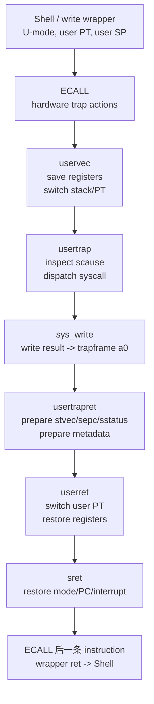

# Week5 Day3：kernel 做完工作后，Shell 怎样从原处继续？

> 今日定位：Day2 已经讲清 `write wrapper -> ECALL -> trap entry`，也知道 ECALL 不会自动保存 general registers、切换 stack 或切换 page table。今天继续沿 MIT 6.S081 Lec06 的真实顺序，跟着 `uservec -> usertrap -> usertrapret -> userret` 补全进入、处理、返回的闭环。

---

# Part 1：前情提要与必要术语

## 1. 从 Day2 的最后一个状态开始

Day2 已经建立：

```text
xv6 Shell 在 U-mode 执行 ECALL
-> CPU 切到 S-mode
-> sepc 保存 ECALL address
-> scause 记录 trap 原因
-> PC 跳到 stvec 指向的 uservec
```

但是紧接 ECALL 后：

```text
general-purpose registers 仍是 user values
SP 仍是 user stack pointer
satp 仍指向 user page table
kernel C environment 还没有准备好
```

今天从这个瞬间继续。

核心问题不是“kernel 怎样实现 write”，而是：

```text
kernel 怎样保存 Shell 的执行现场，
在 S-mode 完成 sys_write，
最后又让 Shell 从 ECALL 后面继续执行？
```

## 2. 今天跟随的课程和阅读顺序

今天继续学习：

- [MIT 6.S081 Lec06：Isolation & system call entry/exit](https://mit-public-courses-cn-translatio.gitbook.io/mit6-s081/lec06-isolation-and-system-call-entry-exit-robert)

必读范围：

1. [6.5 uservec 函数](https://mit-public-courses-cn-translatio.gitbook.io/mit6-s081/lec06-isolation-and-system-call-entry-exit-robert/6.5-uservec)
2. [6.6 usertrap 函数](https://mit-public-courses-cn-translatio.gitbook.io/mit6-s081/lec06-isolation-and-system-call-entry-exit-robert/6.6-usertrap)
3. [6.7 usertrapret 函数](https://mit-public-courses-cn-translatio.gitbook.io/mit6-s081/lec06-isolation-and-system-call-entry-exit-robert/6.7-usertrapret)
4. [6.8 userret 函数](https://mit-public-courses-cn-translatio.gitbook.io/mit6-s081/lec06-isolation-and-system-call-entry-exit-robert/6.8-userret)

正文直接按照：

```text
6.5 -> 6.6 -> 6.7 -> 6.8
```

推进，不在后面另建一条重复的课程讲解。

建议顺序：

```text
先读完 daily 的 Part 1 和 Part 2
-> 再按 6.5~6.8 阅读课程网页
-> 自己画 trap return loop
-> 回答验收题
```

今天停止在 Lec06 结束处。

```text
不进入 Lec08 page fault 细节
不做 traps lab
不逐行背 trampoline.S
```

中文课程页面对应授课时使用的 xv6 版本。当前官方仓库的少量字段、函数签名或 source line 可能变化；今天按四个 function 的职责和状态变化学习，不机械对照行号。

## 3. 今天真正需要的术语

### 3.1 trapframe

`trapframe`：trap frame，陷阱帧，也可以理解为“保存一次 trap 所需现场的结构”。

在 xv6 中，它是一块由 kernel 管理的 per-process memory：

```text
per-process：
    每个进程有自己的 trapframe。

memory：
    它不是一个 CPU register，而是一块内存。

用途：
    保存 user general-purpose registers、user PC，
    以及进入 kernel 时需要的少量 kernel metadata。
```

`frame` 在这里不是视频帧，而是一组被组织在一起的状态槽位。

### 3.2 execution context

`execution context`：执行上下文。

它表示让一条执行流以后能够继续运行所需的状态，例如：

```text
PC
SP
general-purpose registers
部分 CSR
page table identity
```

trapframe 保存的是当前进程 **user-side execution context 的重要部分**。

它不等于 scheduler 使用的全部 context，也不代表发生了 context switch。

### 3.3 `uservec`

`vec` 来自 `vector`，这里指 trap vector entry。

`uservec`：

```text
来自 user mode 的 trap 最先进入的 assembly entry。
```

它位于 trampoline page 中。

主要责任：

```text
保存 user registers
切换到 kernel stack
切换到 kernel page table
跳转到 usertrap
```

### 3.4 `usertrap`

`usertrap`：

```text
处理 user-origin trap 的 kernel C handler。
```

主要责任：

```text
保存 user PC
读取 scause，判断 trap 原因
如果是 system call，则分派并执行 handler
准备进入返回阶段
```

### 3.5 `usertrapret`

`ret` 来自 `return`。

`usertrapret`：

```text
在 kernel C 环境中，为返回 user mode 做准备。
```

它不会自己用普通 C `return` 回到 Shell，也不直接恢复全部 user registers。

### 3.6 `userret`

`userret`：

```text
位于 trampoline page 中的 assembly return path。
```

主要责任：

```text
切换回 user page table
恢复 user registers
执行 sret
```

### 3.7 `sret`

`sret`：Supervisor Return。

它是 RISC-V 的 privileged instruction，不是 C/C++ 的 `return`。

执行时会根据之前准备好的 CSR：

```text
恢复 privilege mode
把 sepc 写入 PC
恢复 interrupt-enable state
```

### 3.8 `hart`、`hartid` 和 `tp`

`hart`：Hardware Thread，RISC-V 中能够独立执行 instruction stream 的硬件执行单元。

当前可以近似理解为：

```text
一个 CPU core 上的硬件执行上下文
```

`hartid`：当前 hart 的编号。

xv6 kernel 约定用 `tp` register 保存当前 hartid，方便 kernel 找到“当前 CPU 正在运行哪个进程”。

### 3.9 `sfence.vma`

`sfence.vma`：Supervisor Memory-Management Fence。

今天只记它的实际作用：

```text
satp/page table 改变后，
让后续 virtual address translation
不要继续沿用旧 page table 的缓存结果。
```

它处理的是 address translation 的同步问题，不是普通 C++ memory fence，也不是简单的 CPU data cache flush。

### 3.10 general-purpose registers

`general-purpose registers` 是一个**硬件类别**，而 `working register` 是描述寄存器**当前用途**的普通说法。

**General-purpose registers**

全称：

```
General-Purpose Registers
通用寄存器
```

RISC-V 有一组整数通用寄存器 `x0 ~ x31`，ABI 又给它们取了更容易理解的名字：

| ABI 名称   | 主要约定用途                            |
| ---------- | --------------------------------------- |
| `zero`     | 永远为 0                                |
| `ra`       | Return Address，返回地址                |
| `sp`       | Stack Pointer，栈指针                   |
| `a0 ~ a7`  | Arguments，函数参数                     |
| `a0 ~ a1`  | 同时也保存函数返回值                    |
| `t0 ~ t6`  | Temporaries，临时值                     |
| `s0 ~ s11` | Saved Registers，需要跨函数调用保存的值 |

这些本质上都属于 general-purpose registers。

与它们不同的是 CSR：

```
sscratch
satp
sepc
scause
sstatus
stvec
```

这些属于：

```
Control and Status Registers
控制与状态寄存器
```

专门负责 privilege、trap、page table 等控制状态，不属于 general-purpose registers。

**Working register**

`working register` 不是 RISC-V 定义的一种寄存器类型，只是在说：

> 当前这段代码拿某个通用寄存器来临时干活。

例如进入 `uservec` 前：

```
a0 = write 的第一个参数 fd
```

交换后：

```
a0 = trapframe 地址
```

此时我们说 `a0` 成为了 working register，因为 `uservec` 正拿它作为指针访问 trapframe：

```
a0 这个寄存器的身份：general-purpose register
a0 的 ABI 常规职责：argument / return value register
a0 此刻的实际工作：保存 trapframe 地址
```

所以三者描述的是不同角度：

```
general-purpose register：它是什么类别
a0：它在 ABI 中叫什么、通常负责什么
working register：它在当前代码里正在干什么
```

类似于：

```
小明是学生             // 类别
小明是班长             // 约定身份
小明现在正在搬桌子     // 当前工作
```

在 `uservec` 中，`a0` 仍然是那个 `a0`，只是它当前不再保存 user 参数，而是临时充当定位 trapframe 的 working register。

### 3.11 今天各类状态属于谁

| 状态或对象 | 属于哪里 | 当前作用 |
|---|---|---|
| `a0~a7`、`sp`、`tp` | 当前 hart 的 general-purpose registers | 当前正在执行的代码直接使用 |
| `sepc/scause/sstatus/stvec/sscratch/satp` | 当前 hart 的 CSR | trap、privilege 和 address translation 状态 |
| trapframe | 当前 process 的 kernel-managed memory | 保存这个进程的 user state |
| user page table | 当前 process | 描述它的 user virtual address mappings |
| kernel stack | 当前 process 在 kernel 中使用的 stack | 运行 `usertrap/syscall` 等 kernel C code |
| trampoline page | kernel code page，同时做特殊映射 | page table 切换前后都能继续执行 |

这张表很重要：

```text
CSR 可能被下一次 trap 改写；
trapframe 属于具体 process，可以长期保存该进程的状态。
```

---

# Part 2：教程主体

# 教程开始：从 `uservec` 保存现场，到 `sret` 回到 Shell

## 4. 先看完整闭环，不先钻汇编

今天继续沿 Day2 的 xv6 Shell：

```c
write(2, "$ ", 2);
```

完整第一层路径：

```text
Shell / write wrapper
-> ECALL
-> hardware trap actions
-> uservec
-> usertrap
-> syscall
-> sys_write
-> usertrapret
-> userret
-> sret
-> write wrapper 的 ECALL 后一条 instruction
-> Shell
```

可以先把四个新阶段记成两组：

```text
进入方向：
    uservec -> usertrap

返回方向：
    usertrapret -> userret
```

职责对照：

| 阶段 | 语言层次 | 主要责任 |
|---|---|---|
| `uservec` | assembly | 保存现场，建立 kernel 执行环境 |
| `usertrap` | C | 判断原因，完成 system call |
| `usertrapret` | C | 准备返回所需 CSR 和 metadata |
| `userret` | assembly | 切 user page table，恢复现场，执行 `sret` |

## 5. 为什么不能直接让 `usertrap` 成为第一条 kernel C code

刚执行完 ECALL：

```text
CPU 已经在 S-mode
但 general-purpose registers 全是 user values
SP 仍指向 user stack
satp 仍指向 user page table
```

如果此时直接进入普通 C function：

```text
compiler 生成的 function prologue 可能立刻使用 SP
compiler 可以覆盖 a0、t0 等 registers
C function 需要可用的 kernel stack
C code 还可能访问 user page table 中不存在的 kernel data
```

`function prologue`：函数序言，是 compiler 在函数开头自动生成的准备代码，例如调整 stack、保存 register。

所以问题是：

```text
在让 compiler 接管之前，
必须先用一小段可精确控制的 assembly 保存 user state，
并准备 kernel stack/page table。
```

这就是 `uservec` 存在的原因。

## 6. 顺着 6.5：`uservec` 怎样接住 user state

### 和 trampoline 的关系

```text
用户程序
  |
  | ECALL
  v
硬件根据 stvec 跳转
  |
  v
trampoline 中的 uservec
  |
  | 保存寄存器、切换环境
  v
kernel/trap.c 中的 usertrap
  |
  v
syscall
```


### `uservec` 开始时的三个困难

```text
困难 1：
    不能随便覆盖 register，因为里面都是 user state。

困难 2：
    satp 仍是 user page table，普通 kernel mappings 还不可用。

困难 3：
    SP 仍是 user SP，kernel 不能信任或依赖 user stack。
```

### trapframe 为什么映射在 user page table 中

xv6 预先把当前进程的 trapframe page 映射进它的 user page table。

关系是：

```text
user page table 中的固定 virtual address
-> 映射到该进程自己的 trapframe physical page
```

但这个 PTE 不设置 `PTE_U`：

```text
U-mode user code：
    不能访问 trapframe。

ECALL 后的 S-mode entry code：
    仍使用这张 page table，但可以访问 trapframe。
```

所以：

```text
“存在于 user page table”
不等于
“user program 有权限访问”。
```

### 第一条关键动作：交换 `a0` 与 `sscratch`

```text
sscratch 是 CSR（Control and Status Register，控制与状态寄存器），不是普通的通用寄存器。它虽然保存着 trapframe 地址，但汇编代码不能像使用普通指针那样直接写。

所以我们需要让这个 trapframe virtual address 搞到 working register 里面，才能去访问。
```


进入 user space 前，kernel 已经让：

```text
sscratch = trapframe virtual address
```

Shell 调用 `write(2, "$ ", 2)` 时：

```text
a0 = 2
```

`uservec` 使用 `csrrw` 交换：

```text
交换前：
    a0 = 2
    sscratch = trapframe address

交换后：
    a0 = trapframe address
    sscratch = 2
```

效果：

```text
user a0 没有丢
uservec 得到了一个能定位 trapframe 的 working register
```

### 保存 general-purpose registers

```text
这一块就是为了保存原先 usermode 的相关信息，便于 return 的时候恢复。
```


接下来 assembly 使用一组 store instruction：

```text
trapframe->ra = user ra
trapframe->sp = user sp
trapframe->a1 = user a1
trapframe->a2 = user a2
...
```

`ra`：Return Address register，保存 ordinary function 返回 caller 所需的地址。

这里不要求背 30 多条 `sd` 指令。

只需理解：

```text
谁写：
    uservec assembly。

写到哪里：
    当前进程的 trapframe。

为什么写：
    后续 kernel C code 会自由使用这些 registers，
    返回时必须把 user state 恢复回来。
```

### 为什么不保存到 user stack

kernel 不能假设 user SP 一定可信：

```text
user stack 可能没有有效 mapping
user program 可能故意提供恶意 SP
不同 language runtime 的 stack 组织可能不同
kernel 不应依赖 user memory 保存关键恢复状态
```

trapframe 由 kernel 创建、拥有和管理，因此更可信。

### trapframe 不只保存 user registers

kernel 在返回 user mode 前，还会预先填入：

`metadata`：元数据，即描述或支撑其他数据怎样被使用的辅助信息。

```text
kernel_satp：
    进入 kernel 时应该切换到哪张 kernel page table。

kernel_sp：
    当前进程的 kernel stack top。

kernel_trap：
    usertrap function address。

kernel_hartid：
    当前 hart 的编号。
```

这些字段回答：

```text
uservec 保存完 user state 后，
到哪里找到 kernel execution environment？
```

### 建立 kernel execution environment

`uservec` 接着：

```text
从 trapframe 加载 kernel_sp -> sp
从 trapframe 加载 kernel_hartid -> tp
从 trapframe 加载 usertrap address -> temporary register
从 trapframe 加载 kernel_satp
写 satp，切到 kernel page table
执行 sfence.vma
跳转到 usertrap
```

职责级伪代码：

```text
uservec:
    swap a0, sscratch
    save user registers -> trapframe

    sp   = trapframe.kernel_sp
    tp   = trapframe.kernel_hartid
    next = trapframe.kernel_trap
    satp = trapframe.kernel_satp
    sfence.vma

    jump next
```

这不是可编译代码，也不要求背具体 register offset。

### 切 page table 时，为什么 instruction stream 不会断

`instruction stream`：CPU 根据 PC 连续执行的一串 instructions。

切换前：

```text
PC 位于 trampoline page
satp = user page table
```

切换后：

```text
PC 仍是同一个 trampoline virtual address
satp = kernel page table
```

xv6 让 trampoline page 在两张 page table 中：

```text
使用相同 virtual address
映射到相同 physical page
```

所以切换 `satp` 后，下一条 instruction 仍指向同一份 trampoline code。

这正是 `trampoline` 这个名字的直觉：

```text
代码在这块特殊页面上完成一次“弹跳”，
从 user address environment 过渡到 kernel environment。
```

### trapframe 与 sscratch

你的理解没错。关键区别是：

```
sscratch：保存“安全位置在哪里”
trapframe：那个真正的安全位置
```

`sscratch` 只是一个 CSR 寄存器，空间很小，只能放一个值。xv6 选择让它保存：

```
sscratch = 当前进程的 trapframe 地址
```

而 trapframe 才是一块真正的内存，里面保存：

```
user general registers
user PC
kernel page table
kernel stack
kernel trap handler 地址
hart id
```

**为什么需要地址**

刚发生 ECALL 时，所有通用寄存器里都装着 user state，不能随便覆盖：

```
a0 = user 参数
a1 = user 参数
sp = user stack pointer
其他 register 也可能有 user 数据
```

但 `uservec` 想保存这些寄存器，必须先知道：

```
trapframe 在哪里？
```

于是 kernel 在上一次返回 user mode 前，提前设置：

```
sscratch = trapframe 地址
```

发生 trap 后交换：

```
交换前：
    a0 = user a0
    sscratch = trapframe 地址

交换后：
    a0 = trapframe 地址
    sscratch = user a0
```

现在 `uservec` 就能用 `a0` 作为指针：

```
把 ra 保存到 a0 指向的 trapframe
把 sp 保存到 a0 指向的 trapframe
把 a1、a2……保存到 trapframe
最后把 sscratch 里的原 user a0 也保存进去
```

所以你说的“最早期入口获取一个安全位置”完全正确，只是更精确地说：

> `sscratch` 让入口代码找到安全位置，trapframe 才是实际保存 user state 的安全位置。

可以记成：

```
sscratch = 导航地址
trapframe = 状态仓库
```

而且这是 **xv6 的软件设计约定**，并不是 RISC-V 强制规定 `sscratch` 必须存 trapframe 地址。RISC-V 只提供这个 scratch CSR，具体往里面放什么由操作系统决定。

### `uservec` 前后状态表

| 状态 | 刚执行完 ECALL | `uservec` 完成后 |
|---|---|---|
| privilege | S-mode | S-mode |
| page table | user page table | kernel page table |
| SP | user SP | 当前进程 kernel SP |
| general registers | user values | user values 已保存，register 可供 kernel 使用 |
| user PC | 在 `sepc` | 即将复制到 trapframe |
| execution location | trampoline/uservec | 即将进入 kernel C `usertrap` |

## 7. 顺着 6.6：`usertrap` 怎样处理这次 trap

现在已经具备：

```text
S-mode
kernel page table
kernel stack
user registers 已保存到 trapframe
```

这时 compiler 才能安全执行普通 kernel C code。

### 为什么先把 `stvec` 改为 `kernelvec`

当前代码已经在 kernel 中执行。

如果此时发生 timer/device interrupt，下一次 trap 是：

```text
kernel-origin trap
```

它和 user-origin trap 的初始环境不同：

```text
已经使用 kernel page table
已经使用 kernel stack
register 保存策略也不同
```

因此 `usertrap` 先设置：

```text
stvec = kernelvec
```

让 kernel 中发生的新 trap 进入 kernel 专用入口。

### 为什么把 `sepc` 复制到 trapframe

`sepc` 是当前 hart 上的 CSR，不是当前 process 的永久存储。

kernel 处理 system call 时可能：

```text
发生 interrupt
sleep
被 scheduler 暂时切走
运行另一个 process
另一个 process 又发生 trap
```

新的 trap 会覆盖当前 hart 的 `sepc`。

所以 xv6 保存：

```text
p->trapframe->epc = sepc
```

关系变成：

```text
短期 CPU CSR sepc
-> 复制到
当前 process 的长期 trapframe.epc
```

这不是 context switch 本身，但它保证即使以后发生调度，当前进程的 user PC 也不会丢。

### 根据 `scause` 判断为什么进来

`usertrap` 读取 `scause`：

```text
Environment Call from U-mode：
    system call path。

device interrupt：
    interrupt path。

page fault / illegal instruction 等：
    exception path。
```

今天只继续跟踪 system call。

page fault 怎样修复或终止进程，留到 Day4。

### 为什么 system call path 要让 `epc += 4`

对这次 ECALL：

```text
sepc = ECALL instruction address
```

如果返回时 PC 仍是这个地址：

```text
Shell 会再次执行 ECALL
-> 再次 trap
-> 形成错误循环
```

xv6 的 ECALL instruction 占 4 bytes，因此 system call path 设置：

```text
p->trapframe->epc += 4
```

返回位置就变成 ECALL 后一条 instruction。

注意：

```text
不是每种 trap 都无脑把 PC 加 4。
```

例如 Day4 的 page fault 如果被修复，通常需要重新执行那条 faulting instruction。

### `syscall` 怎样获得 number 和 arguments

Day2 中 user register 已经保存到 trapframe：

```text
trapframe->a7 = SYS_write
trapframe->a0 = fd
trapframe->a1 = buffer address
trapframe->a2 = length
```

dispatcher 根据：

```text
trapframe->a7
```

选择 `sys_write`。

handler 再从 trapframe 对应槽位取得 arguments。

### 返回值为什么写回 `trapframe->a0`

RISC-V calling convention 使用 `a0` 保存 function return value。

但此时真正的 user `a0` register 还没有恢复，user state 存在 trapframe 中。

因此：

```text
trapframe->a0 = sys_write 的返回值
```

对于：

```c
write(2, "$ ", 2);
```

成功时返回值通常是 `2`。

之后 `userret` 会把 trapframe 中的新 `a0` 恢复到 CPU 的 `a0` register。Shell 就会像接收普通函数返回值一样看到它。

这一点很关键：

```text
trapframe 不是只保存旧状态；
kernel 也可以有意修改其中一部分，
决定 user program 返回后看到什么。
```

### 带着顺一遍

对，你记得 `a0` 和 `sscratch` 交换没有错。关键是：**交换只是临时中转，不是最终保存。**

先纠正一句容易误解的话：

> “真正的 user `a0` 还没有恢复”

更准确地说应该是：

> CPU 正在执行 kernel code，CPU 的 `a0` 已经被 kernel 当作工作寄存器使用；用户返回后应该看到的 `a0`，目前保存在 trapframe 中，尚未装回 CPU 的 `a0`。

硬件上并不存在两套独立的“user a0”和“kernel a0”，始终是同一个 CPU register。

**完整过程**

为了看清变化，换成更明显的例子：

```
write(1, "hello", 5);
```

进入 system call 前：

```
CPU a0 = 1                  // 第一个参数 fd
sscratch = trapframe 地址
```

`uservec` 第一次交换：

```
CPU a0 = trapframe 地址
sscratch = 1                // 原来的 user a0 暂存在这里
```

接下来，`uservec` 把 registers 保存进 trapframe。保存原始 `a0` 时，会把 `sscratch` 中的 `1` 写进去：

```
trapframe->a0 = 1
```

此后：

```
CPU a0
```

就可以被 kernel 随便用于 C 函数传参、返回值和临时计算了。用户原来的状态已经安全保存在 trapframe 中。

当 `sys_write` 成功写入 5 字节后，system call dispatcher 执行类似：

```
trapframe->a0 = sys_write 的返回值;  // 5
```

这里是**故意覆盖原来的参数 `fd=1`**。因为根据 calling convention：

```
调用前：a0 放第一个参数
返回后：a0 放函数返回值
```

用户已经不需要原来的 `fd=1` 了，返回后应该看到的是 `5`。

**返回时再反向交换**

`userret` 一开始：

```
CPU a0 = trapframe 地址
trapframe->a0 = 5
```

先把返回值放入 `sscratch`：

```
CPU a0 = trapframe 地址
sscratch = 5
```

再交换：

```
CPU a0 = 5
sscratch = trapframe 地址
```

执行 `sret` 后，Shell 看到：

```
write(...) 返回 5
```

所以完整轨迹是：

```
user CPU a0
    -> sscratch 临时中转
    -> trapframe->a0 长期保存
    -> kernel 改成 syscall 返回值
    -> sscratch 临时中转
    -> user CPU a0
```

**对应 Day3 标题**

进入方向主要看：

- [第一条关键动作：交换 a0 与 sscratch (line 394)](C:/Users/FxorG/Desktop/gpt_infra/week5/day3/day3.md:394)
- [保存 general-purpose registers (line 435)](C:/Users/FxorG/Desktop/gpt_infra/week5/day3/day3.md:435)

返回方向主要看：

- [userret 怎样恢复 Shell (line 921)](C:/Users/FxorG/Desktop/gpt_infra/week5/day3/day3.md:921)
- [a0 为什么最后单独处理 (line 981)](C:/Users/FxorG/Desktop/gpt_infra/week5/day3/day3.md:981)

你原来的 `write(2, "$ ", 2)` 有点巧：调用前 `a0=2`，返回值也恰好是 `2`，所以看起来像完全没变化。换成 `write(1, "hello", 5)` 就清楚很多。

### `usertrap` 的职责级伪代码

```text
usertrap:
    stvec = kernelvec

    p = current process
    p.trapframe.epc = sepc

    if scause means system call:
        p.trapframe.epc += 4
        enable interrupts at safe point
        result = dispatch using p.trapframe.a7
        p.trapframe.a0 = result
    else:
        handle interrupt or exception

    usertrapret()
```

不要求记 source line number，但要能解释每一步改变哪一份状态。

## 8. 顺着 6.7：`usertrapret` 怎样准备反向切换

`sys_write` 已经完成，现在要从：

```text
kernel C environment
```

回到：

```text
Shell user environment
```

这不是简单写一个 `return;`。

### 为什么返回前先关闭 interrupt

`usertrapret` 即将把：

```text
stvec = uservec
```

但此时 CPU 暂时还在 kernel 中。

如果这个过渡窗口发生 interrupt：

```text
kernel-origin interrupt
却跳到 user-origin trap entry
```

入口与当前环境不匹配，kernel 会出错。

所以 xv6 先关闭 interrupt，再修改返回路径需要的 CSR。

这是一段短暂的敏感过渡区：

```text
不是“kernel 永远关闭 interrupt”，
而是避免观察到一半是 kernel 配置、一半是 user-return 配置。
```

### 为下一次 user trap 重新准备 `stvec`

设置：

```text
stvec = trampoline 中的 uservec address
```

这样 Shell 返回 U-mode 后，下一次 ECALL、exception 或 interrupt 才会再次进入正确的 user-origin entry。

### 填好下一次进入 kernel 会使用的 metadata

`usertrapret` 在 trapframe 中写入：

```text
kernel_satp
kernel_sp
kernel_trap = usertrap address
kernel_hartid
```

这些不是“这次返回后 Shell 直接读取的数据”。

它们是：

```text
为下一次 user -> kernel trap 预先准备的数据。
```

这也回答 Day2 的问题：

```text
sscratch 和 trapframe 中的 kernel metadata
不是 ECALL 临时凭空生成的；
kernel 在上一次进入 user mode 前就准备好了。
```

### 准备 `sstatus`

`sret` 会读取 `sstatus` 中的控制位。

今天只需要两个：

```text
SPP：Supervisor Previous Privilege
    设为 0，告诉 sret 返回 U-mode。

SPIE：Supervisor Previous Interrupt Enable
    设为 1，让 sret 后 user mode 能响应 interrupt。
```

不用背 bit number。

### 准备 `sepc`

之前 `usertrap` 已经把正确返回位置保存到：

```text
p->trapframe->epc
```

现在写回：

```text
sepc = p->trapframe->epc
```

稍后 `sret` 会执行：

```text
PC = sepc
```

### 准备 user page table 并进入 `userret`

`usertrapret` 计算 user page table 对应的 `satp` value，并把两个参数交给 `userret`：

```text
a0 = trapframe virtual address
a1 = user satp value
```

然后跳到 trampoline page 中的 `userret` assembly。

注意此时：

```text
仍是 S-mode
仍使用 kernel page table
仍使用 kernel registers
```

真正的 page table/register 恢复在下一阶段。

## 9. 顺着 6.8：`userret` 怎样恢复 Shell

### trampoline 在进入跟返回时的作用

过程是：

```
当前 PC 位于 trampoline
当前使用 kernel page table
        |
        | 执行 csrw satp, user_satp
        v
PC 数值不变，下一条 PC 仍位于 trampoline
但地址翻译改用 user page table
```

由于两张 page table 都有：

```
相同的 trampoline virtual address
    -> 相同的 physical page
```

所以切换后：

```
下一条 trampoline instruction 的 virtual address
-> 通过新的 user page table
-> 仍找到同一块 physical memory
-> CPU 继续执行
```

---

对，你的“过道”理解非常准确。

```
uservec 和 userret 都是 trampoline page 里的一段汇编代码
```

trampoline 不是一个函数，而是一整页特殊的代码，其中主要包含：

```
trampoline page
├── uservec：user -> kernel 的入口过道
└── userret：kernel -> user 的返回过道
```

**为什么需要这个过道**

CPU 执行代码时，`PC` 保存的是下一条 instruction 的虚拟地址。page table 决定这个虚拟地址对应哪块物理内存。

假设 kernel 正在普通 kernel code 中执行：

```
PC = 某个普通 kernel virtual address
satp = kernel page table
```

如果它直接切换：

```
satp = user page table
```

下一条 instruction 仍然要从原来的 kernel virtual address 获取，但 user page table 通常没有这个 mapping：

```
user page table 找不到普通 kernel code
-> CPU 无法取得下一条 instruction
-> 出错
```

所以切 page table 时，CPU 必须先走到一个“两边都认识”的地方，这就是 trampoline。

**相同 mapping 是什么意思**

kernel page table 和每个 user page table 都有：

```
同一个 trampoline virtual address
    -> 同一个 trampoline physical page
```

例如只是帮助理解：

```
kernel page table:
    0xFFFF... -> trampoline physical page

user page table:
    0xFFFF... -> 同一个 trampoline physical page
```

因此 CPU 正在 trampoline 中执行时切换 `satp`：

```
切换前：
    PC = trampoline 中某条 instruction 的虚拟地址
    使用 kernel page table

切换后：
    PC 的数值没有变化
    使用 user page table
```

新的 user page table 仍然能把这个 PC 翻译到同一份 trampoline code，所以 CPU 可以继续执行下一条 instruction。

**进入与返回的对称关系**

进入 kernel：

```
user program
    -> ECALL
    -> uservec（trampoline，使用 user page table）
    -> 切换成 kernel page table
    -> 仍在 trampoline 中继续执行
    -> 跳到普通 kernel code：usertrap
```

返回 user：

```
普通 kernel code：usertrapret
    -> 跳到 userret（trampoline，使用 kernel page table）
    -> 切换成 user page table
    -> 仍在 trampoline 中继续执行
    -> 恢复 user registers
    -> sret
    -> user program
```

所以可以把它理解成：

```
user space <-- trampoline 过道 --> kernel space
```

但更精确一点：

> trampoline 是切换 page table 期间，两张 page table 都能访问的同一小段汇编代码。

它本身不会自动切换 page table；真正执行切换的是里面的 `uservec` 和 `userret`。

Day3 前面第一次正式介绍它是在术语部分的 `trampoline`，之后在“顺着 6.5：uservec 怎样接住 user state”中的“和 trampoline 的关系”再次使用。现在返回部分是在讲这座过道的反方向。

### 为什么返回也必须经过 trampoline

`userret` 要把：

```text
satp：kernel page table -> user page table
```

切换后，普通 kernel code address 将不再可用。

但 trampoline page 在两张 page table 中保持相同 mapping，因此：

```text
切换 satp 前在 trampoline
切换 satp 后仍在同一份 trampoline code
```

这和进入方向完全对称。

### 切换 user page table

职责级伪代码：

```text
satp = a1
sfence.vma
```

此后：

```text
address translation 使用 user page table
CPU 仍暂时处于 S-mode
PC 仍在 trampoline/userret
```

切 page table 和切 privilege 是两个不同动作。

### 恢复 user registers

`userret` 从 trapframe 加载：

```text
user ra
user sp
user a1/a2/...
其他 user general-purpose registers
```

恢复过程中 assembly 必须小心：

```text
一旦 register 被恢复为 user value，
就不能再把它当作 kernel temporary register 随便覆盖。
```

所以恢复顺序由 assembly 精确控制，不能用普通 C function 替代。

### `a0` 为什么最后单独处理

此时：

```text
CPU a0 = trapframe address
trapframe->a0 = sys_write return value
```

`userret` 先把 `trapframe->a0` 暂存到 `sscratch`，恢复其他 registers，最后再次交换：

```text
交换前：
    a0 = trapframe address
    sscratch = sys_write return value

交换后：
    a0 = sys_write return value
    sscratch = trapframe address
```

结果同时满足：

```text
Shell 能在 a0 看到 write 返回值
下一次 trap 时 sscratch 仍能提供 trapframe address
```

这就是 `a0 <-> sscratch` 在进入和返回两边形成的闭环。

### 最后一条 privileged instruction：`sret`

在执行 `sret` 前，kernel 已经准备好：

```text
sepc = ECALL 后一条 instruction address
sstatus.SPP = U-mode
sstatus.SPIE = enable interrupt after return
general-purpose registers = 要交还给 Shell 的 values
satp = user page table
SP = user SP
```

`sret` 完成：

```text
privilege：S-mode -> U-mode
PC：sepc -> PC
interrupt state：按 sstatus 恢复
```

随后 CPU 在 U-mode 执行 write wrapper 中 ECALL 后面的 instruction。

通常那里是 wrapper 的 `ret`，于是 wrapper 再返回 Shell。

### `return`、`ret`、`sret` 不要混在一起

| 名称 | 所在层次 | 作用 |
|---|---|---|
| C/C++ `return` | language statement | 从当前 function 返回，并产生返回值语义 |
| RISC-V `ret` | ordinary return pseudo-instruction | 根据 return address 回到 caller，不改变 privilege |
| RISC-V `sret` | supervisor privileged instruction | 根据 CSR 恢复 privilege、PC 和 interrupt state |

所以：

```text
usertrapret 名字里虽然有 ret，
真正完成 S-mode -> U-mode 的是 userret 最后的 sret。
```

## 10. 四个关键检查点

### 检查点 A：ECALL 刚结束

```text
mode = S
page table = user
SP = user SP
registers = user values
PC = uservec
```

### 检查点 B：`uservec` 即将跳到 `usertrap`

```text
mode = S
page table = kernel
SP = kernel SP
user registers = 已在 trapframe 保存
PC = 即将进入 usertrap
```

### 检查点 C：`usertrapret` 即将进入 `userret`

```text
mode = S
page table = kernel
SP = kernel SP
trapframe->a0 = syscall return value
sepc/sstatus/stvec = 已为返回准备
```

### 检查点 D：`sret` 刚完成

```text
mode = U
page table = user
SP = user SP
registers = 已恢复，a0 是 syscall return value
PC = ECALL 后一条 instruction
```

## 11. 把进入与返回画成镜像



镜像关系：

| 进入方向 | 返回方向 |
|---|---|
| user registers -> trapframe | trapframe -> user registers |
| user SP -> kernel SP | kernel SP -> user SP |
| user page table -> kernel page table | kernel page table -> user page table |
| `stvec` 决定 entry PC | `sepc` 决定 return PC |
| hardware 进入 S-mode | `sret` 返回 U-mode |

不是每一行都完全由相同 instruction 实现，但责任方向是对称的。

## 12. trapframe、user stack、kernel stack 不要混淆

| 对象 | 谁管理 | 保存什么 | 何时使用 |
|---|---|---|---|
| user stack | user process / language runtime | user function frames | U-mode 普通 function call |
| kernel stack | kernel | kernel C call frames | S-mode 处理该进程的 trap/syscall |
| trapframe | kernel，per-process | user registers 和 trap 边界 metadata | user/kernel 边界保存与恢复 |

一句话：

```text
stack 让当前一侧的 functions 正常调用；
trapframe 让跨越 user/kernel 边界后还能恢复原执行现场。
```

trapframe 不等于 kernel stack，也不等于一次 context switch。

## 13. 普通调用、system call、page fault、interrupt 对照

| 场景 | 怎样发生 | 是否 trap | 返回位置第一层规则 |
|---|---|---:|---|
| ordinary function call | ordinary call instruction | 否 | `ret` 根据 return address 回 caller |
| system call | user 主动执行 ECALL | 是，同步 exception | xv6 把 saved PC 加 4，跳过 ECALL |
| page fault | 当前 memory instruction 无法完成 | 是，同步 exception | 若 kernel 修复，通常重试原 instruction |
| device/timer interrupt | 外部设备或 timer 到来 | 是，异步 interrupt | 处理后继续被打断的 execution point |

今天只比较返回控制流。

```text
page fault 为什么能修复
COW 为什么需要重新执行 store
```

留到 Day4。

## 14. 今天最容易出现的错误理解

### 错误 1：ECALL 自动创建 trapframe

不对。

```text
trapframe 由 xv6 kernel 预先分配和映射；
uservec 软件把 registers 保存进去。
```

### 错误 2：进入 S-mode 后就能直接运行任意 kernel C code

不对。

```text
还缺 kernel stack、kernel page table 和安全保存的 user registers。
```

### 错误 3：trapframe 在 user page table，所以 user 能修改

不对。

```text
mapping 存在，但 PTE_U 没设置，U-mode 没有权限访问。
```

### 错误 4：切换 `satp` 后 PC 会自动变化

不对。

```text
satp 改变的是 virtual address translation 规则；
PC 中的 virtual address 数值不会因为写 satp 自动改成另一个值。
```

trampoline 的相同 mapping 保证这个 PC 在两张 page table 下都指向同一代码。

### 错误 5：`usertrapret()` 的普通 C return 会回到 Shell

不对。

```text
usertrapret 准备状态并进入 userret；
最终由 sret 改 privilege 和 PC。
```

### 错误 6：所有 trap 都把 `epc += 4`

不对。

```text
xv6 system call path 跳过已经执行过的 ECALL；
可修复 page fault 往往要重新执行 faulting instruction。
```

### 错误 7：发生 system call 就一定 context switch

不对。

```text
进入 kernel 是 mode switch；
只有 scheduler 改去运行另一个 process/thread 才是 context switch。
```

## 15. 读课程时每节抓什么

### 6.5 `uservec`

必须抓住：

```text
为什么不能直接进入 C
trapframe + sscratch 怎样解决“没有空闲 register”
怎样切 kernel SP 和 kernel page table
为什么切 page table 后 trampoline 仍可执行
```

不要求：

```text
背每条 sd/ld offset
背 32 个 register 的保存顺序
```

### 6.6 `usertrap`

必须抓住：

```text
为什么 stvec 改成 kernelvec
为什么 sepc 要复制进 per-process trapframe
为什么 syscall path epc += 4
a7 怎样分派，a0 怎样承载返回值
```

### 6.7 `usertrapret`

必须抓住：

```text
为什么过渡期先关闭 interrupt
为下一次 trap 预填哪些 metadata
怎样准备 sstatus、sepc 和 user satp
```

### 6.8 `userret`

必须抓住：

```text
先切 user page table，再恢复 registers
a0/sscratch 怎样完成反向交换
sret 最终恢复哪三类 CPU state
```

---

# Part 3：收尾、任务与验收

## 16. 今日产出

今天只创建：

```text
week5/day3/day3_note.md
```

原周计划中的：

```text
trap_return_path.md
```

并入 `day3_note.md`。

原因：

```text
完整闭环图、状态表和验收回答本来就是当天笔记内容，
拆成两个文件只会制造重复 work。
```

今天没有新增 C++ demo。

## 17. 核心任务

### 任务 1：自己画完整闭环

不能直接复制正文图。

至少包含：

```text
ECALL
uservec
usertrap
syscall/sys_write
usertrapret
userret
sret
Shell 继续执行
```

并标出：

```text
hardware
assembly software
kernel C software
```

各自负责哪一段。

### 任务 2：填写四个检查点

在 note 中自己填写：

| 检查点 | privilege | page table | SP | registers 保存在哪里 | PC/下一阶段 |
|---|---|---|---|---|---|
| ECALL 刚结束 |  |  |  |  |  |
| `uservec` 完成 |  |  |  |  |  |
| `usertrapret` 即将进入 `userret` |  |  |  |  |  |
| `sret` 刚完成 |  |  |  |  |  |

### 任务 3：追踪一次 `a0`

从：

```text
write(2, "$ ", 2)
```

开始，说明 `a0` 依次表示什么：

```text
进入 ECALL 前
第一次与 sscratch 交换后
保存到 trapframe 后
sys_write 返回后
userret 最后交换后
Shell 看到返回值时
```

### 任务 4：完成四类控制流对照

用自己的话比较：

```text
ordinary function call
system call
page fault
interrupt
```

只比较：

```text
怎样发生
是否经过 trap
返回时从哪里继续
```

## 18. 可选观察

如果想看 xv6 source，只定向看：

- [MIT xv6-riscv repository](https://github.com/mit-pdos/xv6-riscv)
- `kernel/trampoline.S`
- `kernel/trap.c`
- `kernel/proc.h` 中的 `struct trapframe`

观察顺序：

```text
先按 function name 找 uservec/userret/usertrap/usertrapret
-> 只给每个 function 写一句责任
-> 再回看 daily 的状态表
```

不要在今天：

```text
搭 xv6 编译环境
完成 traps lab
逐行抄汇编
研究所有 CSR bit
```

这些不是 Day3 通过条件。

## 19. 验收问题

### 问题 1

ECALL 已经把 CPU 切到 S-mode，为什么还不能直接进入普通 C function `usertrap`？

### 问题 2

trapframe、user stack、kernel stack 分别是谁管理、保存什么？为什么 xv6 不把 user registers 直接保存到 user stack？

### 问题 3

`uservec` 切换 `satp` 后，为什么 CPU 还能继续执行当前 instruction stream，而不会跳到错误代码？

### 问题 4

为什么 `usertrap` 要把 `sepc` 复制到当前进程的 trapframe？为什么 system call path 还要把保存的 PC 加 4？

### 问题 5

`usertrapret` 为什么要先关闭 interrupt，再把 `stvec` 改回 `uservec`？

### 问题 6

从进入到返回，`a0`、`sscratch` 和 `trapframe->a0` 的值怎样变化？Shell 最后为什么能在 `a0` 看到 `write` 的返回值？

### 问题 7

`sret` 与普通 `ret` 有什么区别？执行 `sret` 前，kernel 必须提前准备好哪些关键状态？

## 20. 今日通过标准

### 核心通过条件

```text
能按顺序讲通 uservec -> usertrap -> usertrapret -> userret
能解释 trapframe 为什么存在、属于谁、为什么不使用 user stack
能解释进入和返回时两次 page table 切换为什么不会中断 instruction stream
能区分 assembly entry/return 与 kernel C handler/preparation
能说清 sepc -> trapframe.epc -> sepc -> PC 的返回地址闭环
能说清 a0 argument -> syscall return value 的变化
能解释 sret 不是普通 function return
```

### 重点易错点

```text
不能说 ECALL 自动保存全部 registers
不能说 trapframe 属于 user program
不能说 usertrapret 的 C return 直接回到 Shell
不能说所有 trap 都执行 epc += 4
不能说写 satp 会自动改变 PC 数值
不能把 mode switch 当成 context switch
```

### 工程增强项

```text
逐行读 trampoline.S
用 GDB 单步 uservec/userret
自己编译运行 xv6
完成 MIT traps lab
研究完整 sstatus bit 变化
```

全部后置，不阻塞 Day3。

## 21. 今日一句话

```text
uservec 先把不可信 user execution environment 保存进 per-process trapframe，
再建立 kernel stack/page table 进入 usertrap；
kernel 完成请求后，usertrapret 和 userret 按相反方向准备并恢复 user state，
最后由 sret 根据 sepc/sstatus 回到 Shell 的 ECALL 后一条 instruction。
```

下一天进入：

```text
page fault 为什么不一定让程序崩溃，
kernel 怎样修复 fault 后重新执行同一条 user instruction。
```

---

## 参考资料

- [MIT 6.S081：6.5 uservec](https://mit-public-courses-cn-translatio.gitbook.io/mit6-s081/lec06-isolation-and-system-call-entry-exit-robert/6.5-uservec)
- [MIT 6.S081：6.6 usertrap](https://mit-public-courses-cn-translatio.gitbook.io/mit6-s081/lec06-isolation-and-system-call-entry-exit-robert/6.6-usertrap)
- [MIT 6.S081：6.7 usertrapret](https://mit-public-courses-cn-translatio.gitbook.io/mit6-s081/lec06-isolation-and-system-call-entry-exit-robert/6.7-usertrapret)
- [MIT 6.S081：6.8 userret](https://mit-public-courses-cn-translatio.gitbook.io/mit6-s081/lec06-isolation-and-system-call-entry-exit-robert/6.8-userret)
- [MIT xv6-riscv source](https://github.com/mit-pdos/xv6-riscv)
- [xv6 book, RISC-V edition](https://pdos.csail.mit.edu/6.S081/2024/xv6/book-riscv-rev4.pdf)
