核心，先抓住 mode,register,page table,stack... 这些的变化。

```text
1. xv6 shell 在 user mode 调用 write wrapper
2. wrapper 把 fd/buffer/length 放入 a0/a1/a2，把 SYS_write 放入 a7。注意，a0,a1,a2,a7 都是 working register，保存数值；当保存地址时，才能作为访存地址。
3. wrapper 执行 ECALL, ECALL 是 instruction，会触发 hardware trap actioins，会让 U-mode -> S-mode
4. 目前状态：S-mode, general-purpose registers 全是 user values, SP 仍然指向 user stack，satp 仍然指向 user page table

5. ECALL 后，硬件会根据 stvec（trap 后第一条 supervisor instruction 去哪里）跳转到 trampoline 里面的汇编代码 uservec。然后在 uservec 里会切换成 kernel page table，因为 trampoline 的 instruction 的 VA 在 user/kernel page table 里都有相同的 mapping 到同一个 PA，所以不会影响指令的执行。
6. uservec，交换 a0 与 sscratch。前：sscratch=trapframe VA,a0=fd。后 a0=trapframe VA,sscratch=fd。这样能让 uservec 能够像普通指针一样写 trapframe，便于后续保存信息。
7. uservec，把原先 general-purpose registers(通用寄存器) 的相关信息保存在 trapframe。sscratch 中的旧 user a0 -> trapframe->a0
8. 结束了 uservec：S-mode,kernel page table,kernel SP,general registers 里原先的 user values 已经保存到 trapframe，这些 registers 可以给 kernel 使用。

9. 进入 kernel C usertrap
10. 把 stvec 改为 kernelvec，为了在 kernel 里发生 trap 的时候，这是 kernel-origin trap，能让其跳到正确的 entry
11. 把 sepc 复制到 trapframe，让 sepc 从 CSR 到 memory，这样长期化 sepc。
12. 根据 scause 来判断什么原因进来
13. 让 epc+=4，也就是等回去后，返回位置变成 ECALL 的下一条 instruction，避免循环 ECALL。
14. dispatcher 根据 trapframe->a7（之前已经把 general-purpose registers 存到 trapframe 里了）选择 sys_write 这个 handler
15. trapframe->a0=sys_write 的返回值，因为此时原先存的 fd 已经没啥用了！

16. 进行 usertrapret 这一段 kernel C
17. 关闭 interrupt，防止后续出现 kernel-origin interrupt 却 trap 到 user-origin trap entry
18. 为下一次 user trap 准备 stvec，其实就是让 stvec=trampoline 中的 uservec address
19. 在 trapframe 里写入下一次进入 kernel 会使用的 metadata，比如 kernel_sp,kernel_satp
20. 准备 sepc，之前 usertrap(11.) 已经把 sepc 复制到 trapframe 了，现在写回，sepc=p->trapframe->epc
21 准备进入 userret

22. 进入 userret
23. userret 是 trampoline 中的一段汇编代码，通过这个过道，我们当前使用的是 kernel page table，然后可以切换成 user page table，并且你的下一条 PC 仍位于 trampoline，还是能通过 instruction 的 VA 在新的 user table 里找到正确的 PA，CPU 继续执行。
24. 恢复 user register，从 trapframe 里加载数据。

25. userret 一开始，CPU a0=trapframe 地址，trapframe->a0=sys_write 的返回值。
26. 让 sscratch=sys_write 的返回值
27. 交换，CPU a0=sys_write 的返回值，sscratch=trapframe 地址。这样也为后续再次 trap 进来提供了正确的 sscratch。

28. 最后一条 privileged instruction: sret，让 S-mode -> U-mode。让 PC=sepc，也就是从 user code 打断的地方接着执行，然后之前epc+=4，所以就是下一条 instruction。interrupt state 就按 sstatus 恢复。

29. 成功回到 U-mode shell
```

## 对应流程图

```mermaid
flowchart TD
    A["1~2. xv6 Shell 调用 write wrapper<br/>U-mode / user page table / user SP<br/>a0=fd, a1=buffer, a2=length, a7=SYS_write"]

    B["3. 执行 ECALL<br/>触发 synchronous exception"]

    C["4. hardware trap actions 完成<br/>mode: U -> S<br/>PC <- stvec<br/>sepc 保存 ECALL 地址<br/>registers、SP、satp 仍是 user 状态"]

    D["5. PC 到达 trampoline 中的 uservec<br/>此时仍使用 user page table"]

    E["6. 第一次交换 a0 与 sscratch<br/>a0=trapframe VA<br/>sscratch=原 user a0，也就是 fd"]

    F["7. 保存 user general-purpose registers<br/>sscratch 中的旧 user a0 -> trapframe->a0"]

    G["8. 建立 kernel execution environment<br/>SP <- trapframe.kernel_sp<br/>satp <- trapframe.kernel_satp<br/>切换到 kernel page table"]

    H["9~12. 进入 kernel C 的 usertrap<br/>stvec <- kernelvec<br/>trapframe->epc <- sepc<br/>根据 scause 判断 trap 原因"]

    I["13~15. system call path<br/>trapframe->epc += 4<br/>根据 trapframe->a7 分派 sys_write<br/>trapframe->a0 <- sys_write 返回值"]

    J["16~20. usertrapret 准备返回<br/>关闭 interrupt<br/>stvec <- uservec<br/>填写下一次 trap 所需 metadata<br/>sepc <- trapframe->epc"]

    K["21. 准备进入 userret<br/>a0=trapframe VA<br/>a1=user satp"]

    L["22~23. trampoline 中的 userret<br/>satp: kernel page table -> user page table<br/>PC 仍在两张 page table 共同映射的 trampoline"]

    M["24. 从 trapframe 恢复其他 user registers"]

    N["25~27. 最后恢复 user a0<br/>先让 sscratch=trapframe->a0<br/>再交换 a0 与 sscratch<br/>a0=sys_write 返回值<br/>sscratch=trapframe VA"]

    O["28. 执行 sret<br/>mode: S -> U<br/>PC <- sepc<br/>恢复 user interrupt state"]

    P["29. 回到 Shell<br/>从 ECALL 后一条 instruction 继续<br/>write wrapper 在 a0 中取得返回值"]

    A --> B --> C --> D --> E --> F --> G --> H --> I --> J --> K --> L --> M --> N --> O --> P
```


