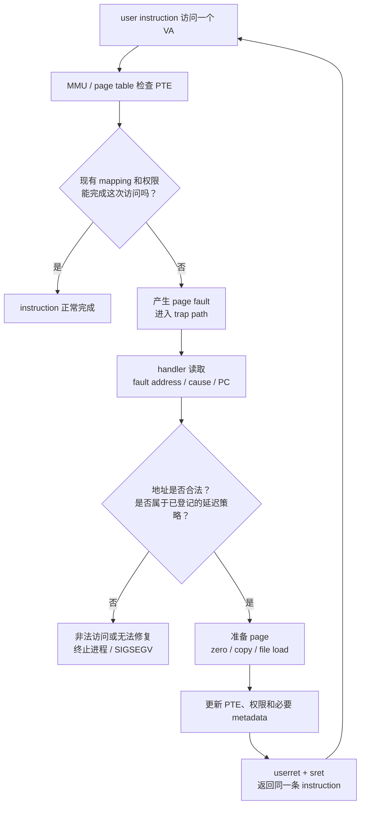
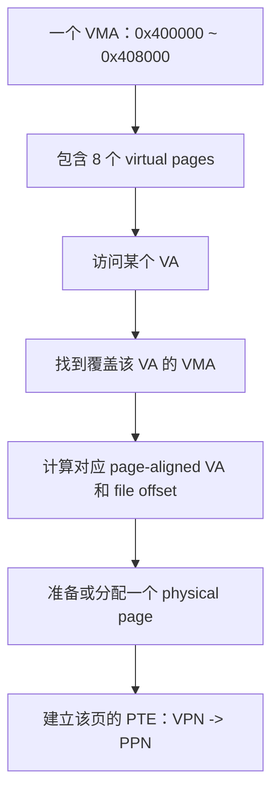
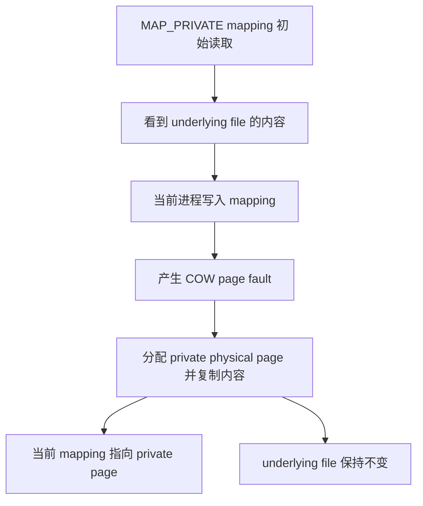

# Week5 Day4：Page fault 为什么不一定让程序崩溃？

> 今日定位：Day1 建立了 `VA -> page table -> PA`，Day2/Day3 已经把 trap 的进入和返回讲通。今天把两条线接起来：当一条 user instruction 暂时无法完成地址翻译或权限检查时，kernel 怎样判断这是非法访问，还是一个可以修复后重试的 page fault。  
> 今日课程：MIT 6.S081 Lec08 `8.1 -> 8.6`。  
> 今日实践：独立完成 `mmap_private_cow.cpp`，观察 `MAP_PRIVATE` 的写时复制结果。  
> 今日不是：重新背 `mmap` 参数、实现 xv6 lab、深入 Linux page cache/writeback。

---

# Part 1：前情提要与必要术语

## 1. 今天从这个问题出发

假设 user program 正在执行：

```cpp
data[0] = 'X';
```

CPU 用 `data` 中的 virtual address 查询当前 page table，却发现：

```text
情况 A：这个 virtual page 暂时还没有 physical page
情况 B：PTE 存在，但当前是 read-only，store 不被允许
情况 C：地址根本不属于进程
```

这三种情况在硬件眼里都可能表现为：

```text
当前 memory instruction 无法按现有 page table 完成。
```

于是产生 page fault。

但 kernel 看到 fault 后，可以得出完全不同的结论：

```text
情况 A：
    这是合法的 lazy allocation / demand paging。
    分配或载入 page，建立 mapping，然后重试。

情况 B：
    这可能是 COW。
    复制 page，更新 PTE，然后重试。

情况 C：
    这是非法访问。
    无法修复，终止进程；Linux 常表现为 SIGSEGV。
```

所以今天的核心不是：

```text
page fault 是什么错误？
```

而是：

```text
kernel 凭什么判断一个 page fault 能不能修复，
修复以后为什么可以重新执行原来的 instruction？
```

## 2. 用 Day3 的路径接住 page fault

Day3 的 system call 路径是：

```text
write wrapper
-> ECALL
-> hardware trap actions
-> uservec
-> usertrap
-> syscall/sys_write
-> usertrapret
-> userret
-> sret
-> ECALL 后一条 instruction
```

page fault 仍然使用同一套 trap 基础设施：

```text
faulting load/store/instruction
-> hardware trap actions
-> uservec
-> usertrap
-> page fault handler
-> 修复 page table
-> usertrapret
-> userret
-> sret
-> 重新执行 faulting instruction
```

最关键的差异：

| 场景 | `sepc` 保存什么 | handler 成功后的返回位置 |
|---|---|---|
| system call | ECALL 的地址 | xv6 将保存的 PC 加 `4`，跳到 ECALL 后一条 instruction |
| 可修复 page fault | faulting instruction 的地址 | 不跳过，返回同一条 instruction 重试 |

为什么不能把 page fault 的 `epc` 也加 `4`？

```text
因为那条 load/store 还没有成功完成。
如果直接跳过，程序会继续运行，但这次读写根本没有发生。
```

今天第一次把你 Day3 没写进 note 的控制流差异真正用起来。

## 3. 必要术语

| 术语 | 英文含义 | 今天的实际作用 |
|---|---|---|
| page fault | 页面错误异常 | 当前 instruction 无法按现有 PTE 完成地址翻译或权限检查 |
| faulting address | 触发 fault 的 virtual address | 告诉 kernel 哪个 virtual page 出了问题 |
| fault cause | fault 原因 | 区分 instruction/load/store fault 等 |
| faulting PC | 触发 fault 的 instruction address | 修复后决定从哪条 instruction 重试 |
| page fault handler | page fault 处理程序 | 检查合法性、修复 mapping 或决定终止 |
| eager allocation | 立即分配 | 申请 address range 时立刻分配 physical pages |
| lazy allocation | 延迟分配 | 先承诺 virtual range，首次访问时才分配 physical page |
| zero fill on demand | 按需零填充 | 多个逻辑零页先共享只读 zero page，写入时再分配 |
| copy on write | 写时复制，COW | 先共享 physical page，某一方写入时才复制 |
| demand paging | 请求分页、按需调页 | 首次访问时才从 executable/file 等来源装入 page |
| page eviction | 页面驱逐 | 内存不足时选择某个 physical page 腾出空间 |
| dirty page | 脏页 | 内容被写过，可能需要回写或保留 |
| accessed page | 被访问页 | 最近被读或写过，可辅助页面替换策略 |
| VMA | Virtual Memory Area | kernel 记录一段 virtual address range 的来源、权限和 flags |
| backing file | 后备文件、支撑文件 | 为 file-backed mapping 提供初始或重新载入内容 |

### 3.1 page fault 不等于 segmentation fault

这两个词经常被混用，但层级不同：

```text
page fault：
    CPU/OS 内部发生的一次 exception。

segmentation fault：
    kernel 判断 user access 无法合法修复后，
    向进程报告 SIGSEGV 时常见的用户态结果。
```

因此：

```text
COW 写入会产生 page fault，但正常程序不会因此崩溃。
非法野指针也可能产生 page fault，kernel 无法修复时才会 SIGSEGV。
```

### 3.2 minor fault 与 major fault

Linux 观察工具常出现：

```text
minor page fault：
    修复 mapping 时不需要等待磁盘 I/O。

major page fault：
    修复时需要从存储设备读取内容。
```

不要机械理解为：

```text
minor = 不重要
major = 程序错误
```

它们主要描述处理 fault 是否需要昂贵的 I/O。

### 3.3 metadata

你理解的方向对：

> metadata = “描述数据、资源或状态的信息”，不是主要内容本身。

例如你的 `Buffer`：

```
char* data_;      // 指向真正的数据内容
std::size_t len_; // 描述数据大小的 metadata
```

`len_` 不是字符内容，而是告诉程序：

```
这块数据有多长
```

文件也是一样：

```
文件内容：
    hello world

文件 metadata：
    文件大小
    权限
    owner
    inode number
    创建/修改时间
```

在虚拟内存里：

```
physical page 中的 bytes
    = 真正的数据

metadata
    = 告诉 kernel 这页应该是什么、来自哪里、允许怎么访问
```

例如：

```
p->sz
    进程合法虚拟地址范围的上界

VMA
    这一段 VA 的范围、权限、backing file、file offset

PTE
    VPN 对应哪个 PPN
    是否 valid
    是否 readable / writable / executable
    是否属于 COW

reference count
    一块 physical page 当前被多少个 mapping 引用
```

所以 page fault 时，kernel 不是看到一个 fault 就盲目分配页面，而是先查看 metadata：

```
发生 fault 的 VA
        |
        v
查找相关 metadata
        |
        v
它属于合法 heap 吗？
它属于某个 VMA 吗？
它来自哪个文件 offset？
它是不是 COW page？
允许当前的 read/write/execute 吗？
        |
        v
决定：
分配、清零、复制、从文件加载，或者拒绝访问
```

因此，Day4 里说：

```
metadata 先描述“这个 VA 应该是什么”
page fault 再在真正需要时让它 materialize
```

意思是：

```
metadata：
    先记录“0x4000 这段地址合法，
    应该可读写，
    但目前还没有 physical page”

真正数据：
    第一次访问后，
    才分配 physical page 并放入实际 bytes
```

一句话记忆：

> data 是“东西本身”，metadata 是“描述这个东西应该如何被理解和使用的信息”。

## 4. 今日课程范围和阅读顺序

课程入口：

- [Lec08 Page faults](https://mit-public-courses-cn-translatio.gitbook.io/mit6-s081/lec08-page-faults-frans)

按顺序阅读：

1. [8.1 Page Fault Basics](https://mit-public-courses-cn-translatio.gitbook.io/mit6-s081/lec08-page-faults-frans/8.1-page-fault-basics)
2. [8.2 Lazy page allocation](https://mit-public-courses-cn-translatio.gitbook.io/mit6-s081/lec08-page-faults-frans/8.2-lazy-page-allocation)
3. [8.3 Zero Fill On Demand](https://mit-public-courses-cn-translatio.gitbook.io/mit6-s081/lec08-page-faults-frans/8.3-zero-fill-on-demand)
4. [8.4 Copy On Write Fork](https://mit-public-courses-cn-translatio.gitbook.io/mit6-s081/lec08-page-faults-frans/8.4-copy-on-write-fork)
5. [8.5 Demand Paging](https://mit-public-courses-cn-translatio.gitbook.io/mit6-s081/lec08-page-faults-frans/8.5-demand-paging)
6. [8.6 Memory Mapped Files](https://mit-public-courses-cn-translatio.gitbook.io/mit6-s081/lec08-page-faults-frans/8.6-memory-mapped-files)

今天的精力分配：

```text
8.1：精读，抓住 page fault handler 需要的三个信息
8.2：理解 lazy allocation 的状态变化和合法性检查
8.3：抓住 read-only zero page -> 写 fault -> private zero page
8.4：精读，能完整手推 COW
8.5：理解 file-backed demand paging 与 page eviction 第一层
8.6：精读，把 mmap、VMA、file offset 和 page fault 连起来
```

今天停止在 `8.6`。

不要求：

```text
实现 xv6 lazy/COW/mmap lab
逐行抄 usertrap、kalloc、mappages、uvmunmap
背 RISC-V 所有 PTE bit
深入 swap、NUMA、multi-core TLB shootdown
深入 Linux page cache 和 writeback 时序
```

---

# Part 2：教程主体

## 5. 先建立所有机制共用的一条主线

今天六个小节虽然名字很多，但骨架只有一条：



kernel 不是看见 page fault 就盲目分配内存。

它必须先证明：

```text
这个 VA 属于当前进程的某个合法 virtual region
这次 access type 符合 region 的语义
这个 fault 确实由 lazy/COW/demand/mmap 等机制引起
有资源完成修复
```

## 6. 顺着 8.1：Page Fault Basics

### 6.1 课程先回到虚拟内存的两个价值

课程先强调：

```text
Isolation：
    每个进程有自己的 address space，彼此隔离。

Level of indirection：
	Level: 层
	indirection: 间接
	
	直接访问：
    program -> PA
    增加一层间接性：
    program -> VA -> page table mapping -> PA
    
    program 使用 VA，kernel 控制 VA 到 PA 的 mapping。
    
    这一层间接关系让 kernel 可以在程序不知道的情况下改变映射：
    同一个 VA 今天映射 PA 1
    之后可以映射 PA 2
    程序仍然使用原来的 VA
```

Day1 看到的 page table 不只是静态地址翻译表。

当 page fault handler 可以修改 PTE 后：

```text
virtual mapping 可以在程序运行过程中动态变化。
```

这正是 lazy、COW、demand paging 和 mmap 的共同基础。

### 6.2 handler 必须得到三个信息

RISC-V/xv6 中，课程抓住三个 CSR：

| 信息 | CSR | 示例 | handler 用它做什么 |
|---|---|---|---|
| faulting virtual address | `stval` | `0x4008` | 找出需要检查或修复的 virtual page |
| fault cause | `scause` | instruction/load/store page fault | 判断是执行、读取还是写入失败 |
| faulting instruction PC | `sepc` | 某条 store 的地址 | 修复后重新执行这条 instruction |

课程给出的 RISC-V page-fault cause 第一层：

```text
12：instruction page fault
13：load page fault
15：store/AMO page fault
```

今天不要求死背数字，但要知道：

```text
你的 page fault 来源于访问某个 VA，所以你要知道是哪一个。
“访问哪个 VA”
“进行什么类型的访问”
“哪条 instruction 触发”
```

是三个不同问题。

### 6.3 一个具体例子

假设：

```text
sepc   = 0x12a4
stval  = 0x4008
scause = store page fault
page size = 4096 = 0x1000
```

含义：

```text
地址 0x12a4 的 store instruction
尝试写 virtual address 0x4008，
但现有 PTE 无法允许这次写入。
```

要修的是哪一个 virtual page？

```text
page-aligned VA = 0x4000
```

因为：

```text
0x4008 位于 [0x4000, 0x5000) 这个 page 中。
```

handler 通常围绕 `0x4000` 建立或修改 page mapping，然后回到 `0x12a4` 重试。

对，你理解得基本正确。更精确地说：

> 要修复的是：**包含 faulting VA 的那个 virtual page 对应的 PTE / mapping**。

假设 page size 是 `4096 = 0x1000`：

```
faulting VA = 0x4008

virtual page 起点 = 0x4000
page offset       = 0x0008
VPN               = 0x4000 / 0x1000 = 4
```

因此：

```
VA 0x4008
= virtual page 0x4000
+ page offset 0x8
```

这里的 `page-aligned VA = 0x4000` 是**虚拟页的起始地址**，不是 VPN 本身。VPN 是页号 `4`。

CPU 查询的是 VPN 对应的 PTE：

```
VPN 4
  |
  v
PTE
  |
  v
PPN + permission flags
```

### 6.4 page fault 处理结果不只有两种

第一层可以分成：

```text
1. 修复成功：
   更新 PTE，重试 instruction。

2. 暂时不能立刻完成：
   可能需要等待 I/O，当前执行流先阻塞，后续再恢复。

3. 无法修复：
   地址非法、权限非法或资源耗尽，终止进程或报告错误。
```

今天重点是第 1 种。

## 7. 顺着 8.2：Lazy Page Allocation

### 7.1 eager allocation 的问题

xv6 原本的 `sbrk` 扩大 heap 时，会立刻：

```text
增加进程可用 address range
分配 physical pages
清零
建立 PTE mappings
```

这叫 eager allocation。

但 application 可能申请了很大的最大容量，实际只使用一小部分。

于是产生浪费：

```text
申请了 virtual range
不等于
真的需要同样数量的 physical pages。
```

### 7.2 lazy allocation 的状态变化

#### p->sz

`p->sz` 是 xv6 内核中 `struct proc` 里的一个字段，表示：

> 当前进程已经声明拥有的用户虚拟地址空间上界。

它通常可以理解为 heap 的“break”位置，也就是合法用户内存范围的末端。

例如：

```
p->sz = 0x8000
```

表示进程原本的逻辑地址范围大致到：

```
[0x0000, 0x8000)
```

调用：

```
sbrk(0x3000);
```

lazy allocation 下只做：

```
旧 p->sz = 0x8000
新 p->sz = 0xb000
```

于是进程被允许使用的新虚拟地址范围是：

```
[0x8000, 0xb000)
```

但此时并没有真正分配 RAM：

```
VPN 0x8 -> invalid PTE
VPN 0x9 -> invalid PTE
VPN 0xa -> invalid PTE
```

所以：

```
p->sz 增加了
VA 合法范围扩大了
但 VA -> PA 的实际 mapping 还不存在
```

之后用户访问：

```
*(char*)0x9008 = 'A';
```

流程是：

```
访问 VA 0x9008
    |
    v
PTE 无效，产生 page fault
    |
    v
kernel 检查：
0x9008 < p->sz ？
    |
    v
是，说明它属于合法但尚未物化的 lazy page
    |
    v
分配 physical page、清零、建立 PTE
    |
    v
重试原来的 store instruction
```

而如果访问：

```
*(char*)0xc000 = 'A';
```

由于：

```
0xc000 >= p->sz
```

它不属于进程已经声明的合法虚拟地址范围，kernel 就不会分配页面，而是判定为非法访问。

所以要区分：

```
p->sz：
    kernel 记录的“这部分 VA 允许属于进程”的边界

PTE：
    具体某个 virtual page 当前是否已经映射到 physical page

physical page：
    RAM 中实际分配出来的内存
```

一句话：

> `sbrk` 在 lazy allocation 中先扩大进程的“虚拟地址承诺范围”，真正访问某一页时，page fault handler 才把这页连接到实际 RAM。

#### 正文

lazy 方案把“承诺地址空间”和“提供 physical page”拆开：

lazy 就是需要用到的时候再去申请。

```text
调用 sbrk：
    只增加 p->sz
    p->sz 是 xv6 内核中 struct proc 里的一个字段，表示：
    当前进程已经声明拥有的用户虚拟地址空间上界。
    
    不分配 physical page
    不建立有效 PTE

第一次访问新 heap VA：
    MMU 发现无有效 mapping
    产生 page fault

handler：
    判断 VA 位于合法 heap range
    kernel 从物理内存申请一块 page
    把新分配的 physical page 中的每一个 byte 都设置为 0
    把 faulting VA 所在 page 映射进去，设置 PTE: VPN -> PPN
    设置 user/read/write 等权限

返回：
    重试原 load/store
```

图示：

```text
逻辑上拥有：
    heap [old_sz, new_sz)

物理上尚未分配：
    其中没有访问过的 pages

首次 touch 某一页：
    只为这一页 materialize 一个 physical page
```

`materialize`：使原本只有逻辑描述的 page 真正获得 physical storage。

### 7.3 合法 lazy fault 与野指针怎样区分

只看到 PTE invalid 不够。

handler 还要检查：

```text
fault VA 是否位于当前进程声明的 heap range
是否越过 p->sz
是否撞入不允许访问的区域
是否具备预期权限
physical page allocation 是否成功
```

所以：

```text
没有 mapping
不自动等于
应该为它分配 page。
```

### 7.4 为什么原来的 unmap 假设也要改变

eager 模型中：

```text
进程逻辑上拥有的每个 heap page
通常都有实际 mapping。
```

lazy 模型中：

```text
进程逻辑上拥有一段 range，
但其中一些 page 从未访问，所以没有 mapping。
```

因此释放整个 range 时遇到 unmapped hole，可能是正常状态。

这体现了一个很重要的工程原则：

```text
修改 allocation policy 后，
所有依赖“每个合法 VA 都已经 mapped”这一不变量的代码都要重新检查。
```

## 8. 顺着 8.3：Zero Fill On Demand

### 8.1 为什么程序需要很多逻辑零页

例如 BSS 区域：

```cpp
int counters[1024 * 1024];
```

未显式初始化的 static/global objects 按语言和 executable 约定初始为零。

逻辑上，进程需要看到大量内容为零的 pages。

朴素做法：

```text
为每个 virtual zero page 分配不同 physical page
把每个 physical page 清零
```

但在发生写入之前，这些 page 的内容完全相同。

### 8.2 共享一个 read-only zero page

zero-fill-on-demand 可以先建立：

```text
多个 virtual pages
-> 同一个全零 physical page
```

所有相关 PTE 暂时只读：

```text
读取：
    直接读共享 zero page，得到 0。

写入：
    因为 PTE read-only，产生 store page fault。
```

### 8.3 写入时怎样修复

```text
store zero-backed VA
-> store page fault
-> handler 识别这是 zero-fill region
-> 分配新的 private physical page
-> page 内容置零
-> 当前 virtual page 改为映射新 page
-> PTE 改为 writable
-> 重试原 store
```

为什么不用先复制共享 zero page？

```text
因为已知整页全是 0，直接把新 page 清零即可。
```

### 8.4 它与 COW 的关系

zero-fill-on-demand 可以看成一种特殊的 COW：

```text
共享来源：
    一个已知全零的 physical page。

发生写入：
    当前 virtual page 获得自己的 private copy。
```

不过这里的新 page 内容可以直接置零，不必从原 page 逐字节复制。

### 8.5 page fault 不是免费的

课程特别提醒：

```text
进入 trap
保存 registers
切换执行环境
运行 handler
修改 page table
返回 user mode
重试 instruction
```

都有开销。

lazy/COW 的价值不是“page fault 很便宜”，而是：

```text
避免大量最终根本用不到的分配、清零、复制或文件读取，
用少数实际发生的 fault 换取总体收益。
```

## 9. 顺着 8.4：Copy On Write Fork

### 9.1 fork 的浪费从哪里来

朴素 fork：

```text
为 child 分配一套新的 physical pages
复制 parent 的全部用户内存
```

但常见 Shell 路径是：

```text
fork
-> child 很快 exec
-> exec 丢弃 child 刚复制出来的旧 address space
```

很多复制可能立刻作废。

### 9.2 COW fork 的初始状态

fork 时不立即复制 page 内容：

```text
parent PTE ----\
                -> shared physical page
child PTE  ----/
```

为了保持进程隔离：

```text
parent 和 child 的对应 PTE 都暂时去掉 writable 权限
kernel 记录这是 COW page，而不是普通只读 page
physical page reference count 增加
```

为什么父进程也要只读？

```text
如果只把 child 设为只读，parent 仍可直接修改共享 physical page，
child 就会看到 parent 的写入，破坏 fork 后的地址空间隔离。
```

### 9.3 某一方写入时

假设 child 执行 store：

```text
1. store 检查到 read-only PTE，产生 page fault
2. handler 从 fault address 找到对应 virtual page
3. handler 确认这是 COW fault，不是普通非法写只读代码页
4. 分配新的 physical page
5. 把旧 page 的内容复制到新 page
6. child PTE 改为指向新 page，并恢复 writable
7. 旧 physical page reference count 减 1
8. 返回并重新执行原 store
```

结果：

```text
parent virtual page -> old physical page
child virtual page  -> new physical page
```

之后 child 的写入不会影响 parent。

parent 先写也完全一样：

```text
COW 不是“child 专用机制”，
而是谁先写，谁触发 private copy。
```

### 9.4 kernel 怎样区分 COW 与真正只读

下面两种写入都可能触发 store page fault：

```text
写 COW data page
写真正只读的 text/code page
```

处理结果却不同：

```text
COW：
    可以复制并恢复 writable。

真正只读：
    这是权限错误，不能偷偷变成 writable。
```

所以 kernel 必须保存额外 metadata，例如：

```text
PTE 中留给 supervisor software 的标志位
或 kernel 自己维护的 VMA/page metadata
```

只有确认是 COW，才能执行复制修复。

### 9.5 为什么需要 reference count

共享 physical page 可能同时被多个 PTE 指向。

如果 parent 退出就直接释放它：

```text
child PTE 仍然指向已释放 page
-> use-after-free / 数据破坏
```

因此需要：

```text
建立一个新引用：reference count + 1
解除一个 mapping：reference count - 1
reference count == 0：才能真正释放 physical page
```

这是 COW 的 ownership 问题。

你在 C++ 里学过：

```text
shared_ptr 用 reference count 管理 shared object lifetime
```

这里不是让你把 kernel page 当成 `shared_ptr`，而是说明共同原则：

```text
共享资源必须知道还有多少有效 owner/reference。
```

## 10. 顺着 8.5：Demand Paging 需求分页

### 10.1 exec 为什么不一定立即加载整个程序

朴素 exec：

```text
读取 executable 的 text/data
为它们分配全部 physical pages
建立 mappings
然后才开始执行
```

如果 executable 很大，但实际只执行其中一部分：

```text
提前读取全部内容会浪费启动时间、I/O 和 physical memory。
```

demand paging 可以先只建立逻辑描述：

```text
这段 VA 属于 executable 的 text
这段 VA 属于 executable 的 data
每一段 VA 的起点 对应 backing file 的哪个 offset
权限是什么

这样能帮助我们，去建立 VA -> PA，并且不需要一次性分配全部 physical pages
```

但暂时不为所有 page 建立 valid physical mappings。

### 10.2 第一条 instruction 也可能 fault

如果程序入口 page 尚未载入：

```text
CPU fetch 第一条 instruction
-> instruction page fault
```

handler：

```text
根据 fault VA 找到 executable region
根据 region metadata 计算 file offset
分配 physical page
从 executable 读取相应 page 内容
建立 PTE 和 execute/read 权限
返回并重新 fetch 同一条 instruction
```

#### 具体过程：

对，你理解得对。

instruction page fault 的意思是：

> CPU 想从 `PC` 指向的 virtual address 取 instruction，但当前 page table 无法完成这次“取指”。

可能原因包括：

```
1. PTE 不存在或 invalid
   VA 还没有映射到 physical page

2. PTE 存在，但没有 execute 权限
   例如这页是 data page，不能执行

3. 这页属于合法的 demand paging 区域，
   只是 executable 文件内容还没有装入 RAM
```

比如：

```
PC = 0x4000
```

CPU 想取：

```
memory[0x4000]
```

但发现：

```
VPN 4 -> invalid PTE
```

于是：

```
CPU fetch instruction
        |
        v
instruction page fault
        |
        v
kernel 根据 fault VA / sepc / scause 判断
        |
        v
从 executable backing file 读取对应 page
        |
        v
把对应文件内容放入某个 physical page
建立：
VPN 4 -> PPN 7
并设置 readable / executable / valid
        |
        v
返回用户态
        |
        v
重新 fetch PC = 0x4000
```

这里通常不会把 `sepc` 加 `4`，因为第一条 instruction 根本还没有成功取出来。修复后要重新执行同一次 instruction fetch。

还要注意：

```
instruction page fault：
    取指时发生的问题，常见 scause = 12

load page fault：
    读取普通数据时发生的问题，常见 scause = 13

store page fault：
    写入普通数据时发生的问题，常见 scause = 15
```

所以它不是说“第一条 instruction 的机器码一定坏了”，而是说：

```
CPU 还没能成功把这条 instruction 从它的 VA 取出来。
```

如果最后发现这段 VA 根本不属于合法 executable 区域，或者 PTE 明确禁止执行，kernel 就不能修复，最终会终止进程。

### 10.3 backing file 到底做什么

Day1 讨论过 backing file。今天再精确一次：

```text
backing file 提供 page 初始内容的来源，
并记录“这个 VA 对应文件的哪个 offset”。
```

它不代表 CPU 跳过 physical memory 直接访问磁盘文件：

```text
fault 修复完成后：

VA
-> current page table/PTE
-> physical page
-> CPU load/store/fetch
```

文件只是在 page 尚未驻留时，帮助 kernel 把正确内容放入 physical page。

### 10.4 physical memory 不够怎么办

课程把 demand paging 接到 page eviction：

```text
需要载入新 page
但没有 free physical page
-> 选择一个现有 page 驱逐
-> 必要时保存它的内容
-> 让它原来的 PTE invalid
-> 将腾出的 physical page 用于当前 fault
```

选择谁被驱逐，需要策略。

课程第一层提到：

```text
Accessed bit：
    page 最近是否被读或写，可帮助近似 LRU/clock。

Dirty bit：
    page 是否被写过；dirty page 通常比 clean page 更难驱逐，
    因为可能需要先回写。
```

今天只理解为什么需要这些信息。

不展开：

```text
完整 LRU
clock algorithm 实现
swap 格式
Linux reclaim 子系统
```

## 11. 顺着 8.6：Memory Mapped Files

### 11.0 VMA

对，你现在的理解已经对了。关键是区分：

```
VMA 数量
virtual page 数量
physical page 数量
```

它们不是一一对应的。

假设：

```
VMA：
    [0x400000, 0x408000)
    长度 0x8000 = 32 KB

page size = 4 KB
```

那么这个 VMA 覆盖：

```
0x400000 ~ 0x401fff  第 1 个 virtual page
0x402000 ~ 0x403fff  第 2 个 virtual page
0x404000 ~ 0x405fff  第 3 个 virtual page
...
一共 8 个 virtual pages
```

但内核只需要建立一个 VMA：

```
VMA：
    start = 0x400000
    end   = 0x408000
    backing file = program.bin
    file offset = 0
    permission = read/write
```

这一个 VMA 的 metadata 对整个区域都适用。

最开始可能是：

```
VMA 存在，但 PTE 都还没有建立：

VPN 0x400 -> invalid
VPN 0x401 -> invalid
VPN 0x402 -> invalid
...
```

然后访问：

```
VA = 0x401234
```

kernel 找到覆盖它的 VMA：

```
0x401234 位于 [0x400000, 0x408000)
```

于是：

```
page-aligned VA = 0x401000
file offset = VMA 起始 offset + (0x401000 - 0x400000)
```

然后只处理这一页：

```
分配或加载一个 physical page
建立：

VPN 0x401 -> PPN 某个 physical page
```

此时状态是：

```
VMA 仍然只有 1 个

已建立 PTE：
    0x401000 -> physical page

还没有建立 PTE：
    其他 7 个 virtual pages
```

以后访问：

```
VA = 0x406000
```

又会触发一次 page fault，然后再为 `0x406000` 对应的 virtual page 准备另一个 physical page。

所以关系是：

```
一个 VMA
    覆盖很多 virtual pages

一次 page fault
    通常只处理其中一个 virtual page

多个 page fault
    逐渐为这个 VMA 中实际访问到的页面建立 mapping
```

可以画成：



不过有一个小修正：

> page fault 时不一定总是“新建一个 physical page”。

例如：

```
lazy allocation：
    新分配并清零 physical page

demand paging：
    分配 physical page，然后从文件加载内容

COW：
    写入时新分配并复制

MAP_PRIVATE 读取：
    可能暂时共享 file-backed page
```

所以最准确的说法是：

> VMA 描述一整段虚拟地址区域；page fault 根据其中某个 faulting VA，逐页准备或建立对应的 mapping。一个 VMA 可以对应很多 virtual pages，也可能最终对应很多 physical pages，但这些页面不是一次由 VMA 全部创建的。

### 11.1 mmap 改变的是访问接口

普通文件访问：

```text
read/write system call
-> buffer
-> application 处理 buffer
```

memory-mapped file：

```text
文件的一段内容
-> 映射到进程的一段 VA range
-> application 使用普通 load/store 访问
```

这不表示文件真的被塞进某个“虚拟内存文件夹”。

它表示 kernel 建立了一段关系：

```text
virtual range
<-> file + file offset + protection + flags
```

### 11.2 mmap system call 返回后，所有 page 都进 RAM 了吗

通常不需要。

`VMA` 是：

```
Virtual Memory Area
```

中文可以理解为：

> 一段具有相同属性的连续虚拟地址区域。

kernel 可以先建立 VMA metadata：

```text
start/end VA
PROT_READ / PROT_WRITE
MAP_PRIVATE / MAP_SHARED
file reference
file offset

虚拟地址范围：[0x400000, 0x402000)
权限：          read + write
类型：          MAP_PRIVATE
backing file：  program.bin
file offset：   0
```

首次访问某个 mapped page 时：

```text
1. 现有 PTE 尚不能完成访问
2. 产生 page fault
3. handler 找到覆盖 fault VA 的 VMA
4. 根据 VA 与 VMA 起点的差值计算 file offset
5. 准备包含相应文件内容的 physical page
6. 建立 PTE
7. 重试原 instruction
```

真实 Linux 还可能涉及 page cache 和 readahead。

今天只抓：

```text
mmap 建立的是 mapping contract；
page fault 负责让具体 page 在需要时可访问。
```

### 11.3 `MAP_PRIVATE` 的 COW

对于可写的 `MAP_PRIVATE` mapping：

```text
读取：
    当前进程看到文件提供的初始内容。

写入：
    kernel 确保修改落到当前进程的 private page，
    当前 mapping 看到新值，
    underlying file 不因这次 private store 被修改。
```

概念路径：

```text
file-backed page
-> private mapping 尝试写入
-> COW-related page fault
-> 准备 private anonymous page
-> 保留旧内容并应用本次 store
-> 当前 PTE 指向 private page
-> backing file 保持原内容
```

如果某个 page 首次访问就是写入，kernel 的实际实现可以合并部分步骤。

你需要理解的是最终不变量：

```text
mapping 内的当前视图已经改变
file object 的内容仍保持不变
```

### 11.4 `MAP_SHARED` 与 `MAP_PRIVATE`

| 属性 | `MAP_PRIVATE` | `MAP_SHARED` |
|---|---|---|
| 初始内容 | 来自映射文件 | 来自映射文件 |
| 当前进程写入 | 形成 private 修改 | 修改 shared mapping |
| 其他进程是否应通过相同 shared mapping 看到 | 不应看到 private copy | 可以看到 shared page 的修改 |
| 是否用于本次实验 | 是 | 否，只作对照 |

今天不要深入：

```text
writeback 到磁盘的精确时机
msync 的全部语义
文件截断与 mapping 并发
page cache consistency
```

## 11.5 mmap MAP_PRIVATE,MAP_SHARED

`underlying file` 就是：

> `mmap` 背后的真实文件，也就是给 mapping 提供初始 bytes 的那个文件。

例如：

```
data.txt:
    A B C D
int fd = open("data.txt", O_RDWR);
void* p = mmap(..., fd, ...);
```

这里：

```
mapping       = 程序通过虚拟地址访问的内存区域
underlying file = data.txt，提供初始内容的真实文件
```

`MAP_PRIVATE` 和 `MAP_SHARED` 的区别，核心就在于：

> 通过 mapping 写入的数据，要不要和其他人、底层文件共享。

### `MAP_PRIVATE`

初始时：

```
data.txt: A B C D
mapping:  A B C D
```

第一次读取时，当前进程看到文件内容：

```
mapping[0] == 'A'
```

如果当前进程执行：

```
static_cast<char*>(p)[0] = 'X';
```

kernel 可能执行 COW：

```
原来的 file-backed page：
    A B C D

新分配的 private physical page：
    X B C D
```

之后：

```
当前 mapping：X B C D
data.txt：    A B C D
```

也就是说：

```
当前进程看到修改后的 private page
underlying file 仍保持原内容
```

这里的完整过程是：



所以 `MAP_PRIVATE` 不是说一开始就立刻复制整个文件，而是：

```
读取时可以共享文件内容
写入时才复制当前 page
```

这就是为什么叫 `copy-on-write`，即“写时复制”。

### `MAP_SHARED`

如果使用：

```
mmap(..., MAP_SHARED, fd, ...);
```

写入 mapping 后，语义是共享的：

```
data.txt / file-backed page
        ^
        |
多个 mapping 共享
```

例如：

```
进程 A 的 mapping：A B C D
进程 B 的 mapping：A B C D
underlying file：  A B C D
```

进程 A 执行：

```
mapping_a[0] = 'X';
```

那么其他共享同一文件区域的 mapping 可能看到：

```
进程 A：X B C D
进程 B：X B C D
```

并且修改最终可以写回 underlying file。实际落盘时机还涉及 dirty page、`msync` 和内核文件缓存，但你当前阶段先记住“共享修改可能反映到文件”即可。

对比一下：

| 行为                  | `MAP_PRIVATE`               | `MAP_SHARED`              |
| --------------------- | --------------------------- | ------------------------- |
| 初始读取              | 来自 underlying file        | 来自 underlying file      |
| 写入时                | 当前进程获得 private copy   | 修改共享内容              |
| 其他 mapping 是否看到 | 通常看不到                  | 通常可以看到              |
| 是否修改底层文件      | 不会因为 private store 修改 | 可以写回                  |
| 是否涉及 COW          | 写入时通常涉及              | 通常不按 private COW 处理 |

所以为什么要把 `MAP_PRIVATE` 单独讲？

因为 `mmap` 只解决了：

```
virtual address -> file-backed memory
```

但 `MAP_PRIVATE` 和 `MAP_SHARED` 决定了另一个关键问题：

```
写入 mapping 之后，修改属于谁？
```

一句话：

```
MAP_PRIVATE：
    读文件，写时复制，修改只属于当前 mapping，文件不变。

MAP_SHARED：
    读文件，写共享区域，其他共享 mapping 可见，文件可能被更新。
```

## 12. 五种机制放在一张表里

| 机制 | fault 前 kernel 已记录什么 | 当前 PTE 为什么不能完成访问 | handler 从哪里准备内容 | 修复后 |
|---|---|---|---|---|
| lazy allocation | 合法 heap range / `p->sz` | 还没有 physical page | 新分配并清零 | 当前 heap page 可读写 |
| zero fill on demand | 这是逻辑零页 | 多页共享 read-only zero page，store 不允许 | 新分配并清零 | 当前 page 获得 private writable page |
| COW fork | COW 标记、共享 page、引用计数 | parent/child PTE 暂时只读 | 复制原 physical page | 写入方获得 private writable copy |
| demand paging | executable region、file offset、权限 | page 尚未载入 | executable/backing file | 当前 page 驻留并可访问 |
| mmap | VMA、file、offset、prot、flags | page 尚未载入，或 private write 需 COW | mapped file 或 private copy | mapping 中对应 page 可访问 |

共同骨架：

```text
metadata 先描述“这个 VA 应该是什么”
page fault 再在真正需要时让它 materialize
```

差异主要是：

```text
内容来源不同
允许的 access type 不同
修复策略不同
失败边界不同
```

## 13. Linux/C++ 实践：`mmap_private_cow.cpp`

今天的代码由你独立完成。

### 13.1 程序目标

证明下面三件事同时成立：

```text
1. mapping 初始内容来自文件
2. 修改 MAP_PRIVATE mapping 后，当前进程看到新内容
3. 重新从 fd 读取文件，文件内容保持原样
```

这不是要求你证明 Linux 内部每条 page-fault path。

它证明的是：

```text
MAP_PRIVATE 对 application 暴露出的 COW 语义。
```

### 13.2 建议测试文件

先在终端创建：

```bash
printf 'hello-private-mmap\n' > cow_input.txt
```

检查：

```bash
wc -c cow_input.txt
od -An -t x1c cow_input.txt
```

`od`：Octal Dump，按指定格式查看文件的原始 bytes。这里使用十六进制和字符对照，确认换行等不可见 byte。

### 13.3 必须完成的程序步骤

只给需求，不给完整控制流代码：

```text
1. open cow_input.txt
2. fstat 得到文件长度，并拒绝 length == 0
3. 使用 PROT_READ | PROT_WRITE、MAP_PRIVATE 建立 mapping
4. 按明确长度输出 mapping 初始 bytes
5. 在 mapping 长度内修改至少一个 byte
6. 再次输出 mapping，确认当前视图改变
7. 使用 pread 或 lseek + read 从 fd 读取原文件
8. 确认文件 bytes 没有随 private mapping 改变
9. munmap
10. close fd；如果复用 Week4 的 UniqueFd，则由 RAII 完成 close
```

禁止：

```text
把 mapping 直接当作以 '\0' 结尾的 C string
访问 [mapping, mapping + length) 之外
用 MAP_SHARED 偷换实验
通过重新写回文件制造“验证成功”
只打印 mapping，不重新读取文件
```

### 13.4 必要接口速查

#### `open`

```cpp
#include <fcntl.h>

int open(const char* pathname, int flags);
```

本实验可使用：

```cpp
O_RDWR
```

返回：

```text
成功：新的 fd
失败：-1，并设置 errno
```

#### `fstat`

```cpp
#include <sys/stat.h>

int fstat(int fd, struct stat* statbuf);
```

使用：

```text
statbuf->st_size
```

得到文件 byte length。

#### `mmap`

```cpp
#include <sys/mman.h>

void* mmap(
    void* addr,
    std::size_t length,
    int prot,
    int flags,
    int fd,
    off_t offset
);
```

本实验关键参数：

```text
addr   = nullptr
length = 文件长度
prot   = PROT_READ | PROT_WRITE
flags  = MAP_PRIVATE
fd     = 已打开文件
offset = 0
```

失败返回：

```cpp
MAP_FAILED
```

`offset` 必须满足系统要求的 page alignment；本实验用 `0`，天然满足。

#### `pread`

```cpp
#include <unistd.h>

ssize_t pread(
    int fd,
    void* buffer,
    std::size_t count,
    off_t offset
);
```

作用：

```text
从明确 file offset 读取，
不会修改 fd 关联的 current file offset。
```

它可能 short read，因此读取整个文件时仍要按返回值循环。

#### `munmap`

```cpp
#include <sys/mman.h>

int munmap(void* addr, std::size_t length);
```

成功返回 `0`，失败返回 `-1`。

### 13.5 输出 bytes，不假设 `'\0'`

文件内容是 bytes：

```text
长度由 st_size 给出
不保证末尾有 '\0'
```

C++ 可以按明确长度输出：

```cpp
std::cout.write(static_cast<const char*>(mapping), length);
```

这行只用于说明接口语义，不是完整答案。

### 13.6 编译与运行

```bash
g++ -std=c++17 -Wall -Wextra -g mmap_private_cow.cpp -o mmap_private_cow
./mmap_private_cow
```

运行后再次检查文件：

```bash
cat cow_input.txt
od -An -t x1c cow_input.txt
```

### 13.7 建议错误用例

至少测试：

```text
cow_input.txt 不存在
空文件
正常非空文件
修改第 0 个 byte
如果修改最后一个 byte，确保 index == length - 1
```

不要求故意越界制造 SIGSEGV。

越界 access 是 undefined behavior / invalid memory access，不适合作为普通验收手段。

## 14. 观察 page fault 时，工具能证明到哪里

### 14.1 `strace`

可以观察：

```bash
strace -e trace=openat,mmap,munmap,pread64 ./mmap_private_cow
```

它能显示：

```text
程序发起了哪些相关 system calls
mmap 的参数与返回 VA
是否重新通过 pread64 读取文件
munmap 是否发生
```

它通常不能直接展示：

```text
每一次硬件 page fault
COW handler 复制了哪一个 physical page
具体 PTE 怎样修改
```

### 14.2 `/usr/bin/time -v`

可选观察：

```bash
/usr/bin/time -v ./mmap_private_cow
```

关注：

```text
Minor page faults
Major page faults
```

但不要期待某个固定数字。

原因包括：

```text
程序启动本身也会产生 faults
文件内容可能已经在 page cache
kernel 可能 readahead
一次运行样本很小
```

### 14.3 `perf stat`

可选：

```bash
perf stat -e page-faults,minor-faults,major-faults ./mmap_private_cow
```

如果 VM 或系统权限不允许使用 perf，不作为今天失败。

## 15. 今天最容易混淆的点

### 错误 1：page fault 就是程序崩溃

不对。

```text
page fault 是 exception；
能否修复由 kernel 根据 VA、cause、PC 和 metadata 决定。
```

### 错误 2：PTE invalid 就说明地址非法

不对。

```text
它可能是 lazy/demand page 尚未 materialize，
也可能是真的非法地址。
```

### 错误 3：修复 page fault 后跳到下一条 instruction

通常不对。

```text
失败的 load/store/fetch 尚未完成，
修复后要重试 faulting instruction。
```

### 错误 4：COW page 只让 child read-only

不对。

```text
共享期间 parent 和 child 都不能直接写共享 physical page。
```

### 错误 5：所有只读写 fault 都是 COW

不对。

```text
kernel 必须靠 COW/VMA metadata 区分合法 COW 与真正权限错误。
```

### 错误 6：mmap 返回后文件已经全部加载到 RAM

不一定。

```text
mmap 先建立 virtual range 与 file 的关系，
具体 pages 可以按需载入。
```

### 错误 7：MAP_PRIVATE 完全脱离 backing file

不对。

```text
初始内容仍来自 file；
private write 后，修改部分由 private page 承担。
```

### 错误 8：backing file 代替 page table

不对。

```text
CPU 真正执行 load/store/fetch 时仍使用 VA -> PTE -> physical page；
backing file 负责在 page 不驻留时提供内容来源。
```

### 错误 9：一次没有 major fault 就说明没有 demand paging

不对。

```text
内容可能已经在 page cache，修复不需要磁盘 I/O，
因此可能只记为 minor fault。
```

---

# Part 3：收尾、任务与验收

## 16. 今日产出

创建：

```text
week5/day4/mmap_private_cow.cpp
week5/day4/day4_note.md
```

原周计划中的：

```text
page_fault_cow_note.md
```

并入 `day4_note.md`，不创建内容重复的第三个文件。

## 17. 核心任务

### 任务 1：画统一 page-fault 修复图

必须包含：

```text
faulting instruction
stval / scause / sepc
uservec / usertrap
handler 判断是否合法
准备 physical page
更新 PTE
userret / sret
重试原 instruction
```

### 任务 2：手推一次 COW fork

至少画出三个时刻：

```text
fork 前
fork 后、尚未写入
child 或 parent 第一次写入后
```

每个时刻标出：

```text
parent PTE
child PTE
physical page
writable/COW 状态
reference count 第一层变化
```

### 任务 3：独立完成 `mmap_private_cow.cpp`

核心证据：

```text
mapping 初始内容 == 文件内容
mapping 修改后，当前视图改变
重新从 fd 读取，文件内容不变
编译零 warning
错误路径能给出明确失败
```

### 任务 4：完成机制对照表

在 note 中用自己的话比较：

```text
lazy allocation
zero fill on demand
COW fork
demand paging
MAP_PRIVATE mmap
```

只比较：

```text
fault 前记录了什么 metadata
page 内容从哪里来
什么 access 触发 fault
handler 怎样修复
```

## 18. 验收问题

### 问题 1

page fault handler 为什么同时需要 fault address、fault cause 和 faulting PC？它们分别回答什么问题？

### 问题 2

为什么 system call path 可以把 `epc` 加 `4`，而可修复 page fault 通常要保留原 PC？

### 问题 3

lazy allocation 中，一个 VA 没有 valid PTE 时，kernel 怎样区分“尚未分配的合法 heap page”和“野指针”？

### 问题 4

COW fork 后为什么 parent 和 child 的 PTE 都要暂时只读？某一方写入时，PTE、physical page 和 reference count 怎样变化？

### 问题 5

写一个 COW page 和写一个真正只读的 code page 都可能 store page fault。kernel 为什么不能对两者执行同一种修复？

### 问题 6

demand paging 中，backing file、VMA/PTE 和 physical page 分别承担什么责任？CPU 正常访问时会不会绕过 physical memory 直接读文件？

### 问题 7

`MAP_PRIVATE` mapping 修改后，为什么当前进程能看到新值，而重新读取原文件仍得到旧值？

## 19. 今日通过标准

### 核心通过

```text
能把 page fault 接到 Day3 的 trap 进入/返回路径
能解释 stval/scause/sepc 三类信息
能说明修复后为什么重试同一条 instruction
能完整手推 COW 的共享只读 -> fault -> copy -> remap -> retry
能区分 COW fault 与真正权限错误
能解释 lazy、zero-fill、demand paging、mmap 的共同骨架和内容来源差异
能用 mmap_private_cow.cpp 验证 MAP_PRIVATE 的 application-visible 语义
```

### 重点易错点

```text
不能把 page fault 与 SIGSEGV 画等号
不能看到 invalid PTE 就自动分配 page
不能给所有 page fault 执行 epc += 4
不能忘记 COW physical page 的 reference count
不能把 backing file 当成 CPU 地址翻译路径
不能把 file bytes 当作自动带 '\0' 的 C string
```

### 工程增强项

```text
运行 /usr/bin/time -v 或 perf stat
查看 /proc/<pid>/smaps 中 private/dirty 信息
阅读 xv6 lazy/COW/mmap lab specification
实现 xv6 page-fault handler
研究 Linux page cache/writeback/reclaim
```

全部后置，不阻塞 Day4。

## 20. 今日一句话

```text
page fault 把一次暂时无法完成的地址访问转换成受控 trap；
kernel 根据 fault VA、cause、PC 和预先记录的 region metadata，
决定拒绝访问，或准备 zero/copy/file-backed physical page 并更新 PTE；
修复成功后通过 userret/sret 回到同一条 instruction 重试，
于是 lazy allocation、zero fill、COW、demand paging 和 mmap
都能建立在同一套 page table + trap 机制上。
```

下一天进入：

```text
多个 CPU/thread 同时读写 shared state 时，
为什么正确的单线程代码会产生 race condition，
以及 lock 到底保护代码还是共享不变量。
```

---

## 参考资料

- [MIT 6.S081：8.1 Page Fault Basics](https://mit-public-courses-cn-translatio.gitbook.io/mit6-s081/lec08-page-faults-frans/8.1-page-fault-basics)
- [MIT 6.S081：8.2 Lazy page allocation](https://mit-public-courses-cn-translatio.gitbook.io/mit6-s081/lec08-page-faults-frans/8.2-lazy-page-allocation)
- [MIT 6.S081：8.3 Zero Fill On Demand](https://mit-public-courses-cn-translatio.gitbook.io/mit6-s081/lec08-page-faults-frans/8.3-zero-fill-on-demand)
- [MIT 6.S081：8.4 Copy On Write Fork](https://mit-public-courses-cn-translatio.gitbook.io/mit6-s081/lec08-page-faults-frans/8.4-copy-on-write-fork)
- [MIT 6.S081：8.5 Demand Paging](https://mit-public-courses-cn-translatio.gitbook.io/mit6-s081/lec08-page-faults-frans/8.5-demand-paging)
- [MIT 6.S081：8.6 Memory Mapped Files](https://mit-public-courses-cn-translatio.gitbook.io/mit6-s081/lec08-page-faults-frans/8.6-memory-mapped-files)
- [Linux `mmap(2)`](https://man7.org/linux/man-pages/man2/mmap.2.html)
- [Linux `getrusage(2)`](https://man7.org/linux/man-pages/man2/getrusage.2.html)
