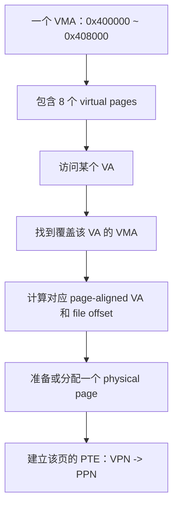

## 验收问题

### 问题 1

page fault handler 为什么同时需要 fault address、fault cause 和 faulting PC？它们分别回答什么问题？

fault address，告诉 handler 哪一个 VA 的翻译/权限检查失败

fault cause，告诉 handler 是怎么产生 page fault

faulting PC，告诉 handler 修复后重新执行这一条 Instruction

### 问题 2

为什么 system call path 可以把 `epc` 加 `4`，而可修复 page fault 通常要保留原 PC？

system call path 一般是执行 ECALL 发生 trap，那回来就执行下一条了，否则会循环 ECALL。

修复 page fault 需要重新执行原 instruction，因为其执行失败了。

### 问题 3

lazy allocation 中，一个 VA 没有 valid PTE 时，kernel 怎样区分“尚未分配的合法 heap page”和“野指针”？

根据 virtual address 是否在 heap range 里面；或者说利用 p->sz 去看。

### 问题 4

COW fork 后为什么 parent 和 child 的 PTE 都要暂时只读？某一方写入时，PTE、physical page 和 reference count 怎样变化？

为了让一方需要写的时候出发 page fault（权限不够）

比如 child 写入，那么会触发 page fault，然后会给 child 一个 private physical page，然后让 child 的 virtual page 指向这个，让旧的 physical page 的 reference count-1

### 问题 5

写一个 COW page 和写一个真正只读的 code page 都可能 store page fault。kernel 为什么不能对两者执行同一种修复？

COW 不是“没有预先分配 physical page”。fork 后已经存在一个 physical page，只是 parent/child 暂时共享它。kernel 根据 **COW metadata** 判断可以复制；真正只读的 code page 没有 COW 权限，写入属于非法访问。

### 问题 6

demand paging 中，backing file、VMA/PTE 和 physical page 分别承担什么责任？CPU 正常访问时会不会绕过 physical memory 直接读文件？

`VMA` 可以包含很多 virtual pages，不是“位于同一个 virtual page”。

```
backing file：提供 page 的初始文件 bytes
VMA：记录 VA range、权限、flags、file、file offset 等区域策略
PTE：记录单个 virtual page 当前映射到哪个 PPN及权限
physical page：存放 CPU 实际读取和写入的 bytes
```

CPU **不会绕过 physical memory 直接读取文件**。缺页时 kernel 先把文件内容读入 physical page、建立 PTE，然后 CPU 重试访问内存。


### 问题 7

`MAP_PRIVATE` mapping 修改后，为什么当前进程能看到新值，而重新读取原文件仍得到旧值？

因为 MAP_PRIVATE mapping 修改的话会触发 page fault，然后会分配一个 private physical page 给它，然后再更改 PTE 指向这个新分配的 page。这样再重新执行 instruction 就可以看得到新值了。

因为 underlying file 并没有改变。

## 总结

对，你已经抓住共同骨架了：

```
page fault
    |
    v
handler 根据 fault VA / fault cause 查询 metadata
    |
    v
判断这次 fault 是否属于某种合法的延迟策略
    |
    v
准备或创建 physical page
    |
    v
更新 PTE / mapping
    |
    v
返回用户态，重试原 instruction
```

但需要补一个重要细节：

> 不同机制查的 metadata 不完全一样，不一定都是“找到 VMA”。

### Lazy allocation

在 Linux 的抽象里，可以通过 VMA 判断：

```
这个 VA 是否属于合法的 heap 区域？
```

但在 xv6 的 lazy allocation 教学中，通常主要检查：

```
fault VA 是否小于 p->sz？
是否属于合法 heap 范围？
```

然后：

```
分配 physical page
-> 清零
-> 建立 PTE
-> 重试原 instruction
合法 heap range / p->sz
        |
        v
新 physical page（全部为 0）
```

### COW

COW 的关键 metadata 通常不是 VMA，而是：

```
PTE 是否只读
是否带有 COW 标记
physical page 的 reference count
```

`fork` 后：

```
parent PTE ----\
                -> 同一个 physical page
child PTE  ----/
```

同时 parent 和 child 的 PTE 都暂时设置为只读：

```
parent PTE：read-only + COW
child PTE：  read-only + COW
```

某一方写入：

```
store
-> write page fault
-> 发现这是 COW page
-> 分配 private physical page
-> 复制旧 page 内容
-> 只修改写入方的 PTE
-> 设置 writable
-> 重试原 store
```

结果：

```
parent -> old physical page
child  -> new private physical page
```

所以你说的“给它一个副本”是正确的。

### Demand paging

Demand paging 更接近你说的“找 VMA，然后准备页面”：

```
VMA：
    这段 VA 属于 executable/file-backed 区域
    对应哪个 backing file
    对应哪个 file offset
    有什么权限
```

访问尚未载入的页面：

```
instruction/load
-> page fault
-> 找到对应 VMA
-> 根据 VA 计算 file offset
-> 从 executable/backing file 读取内容
-> 放入 physical page
-> 建立 PTE
-> 重试原 instruction
```

它和 lazy allocation 的区别主要是页面内容来源：

```
lazy allocation：
    新 page + 清零

COW：
    新 page + 复制已有 physical page

demand paging：
    新 page + 从 executable/backing file 加载内容
```

所以最准确的总结是：

> page fault handler 先根据 fault VA 和 fault cause，查询对应的合法性与延迟策略 metadata；然后根据策略决定是清零、复制旧页，还是从文件加载，最后更新 PTE 并重试原 instruction。

你的整体理解已经对了，只要记住：

```
VMA 是一种 metadata，
但 COW 还需要 PTE 的 COW 标记和 physical page reference count；
xv6 lazy allocation 也常直接用 p->sz 判断 heap 合法范围。
```

### mmap

