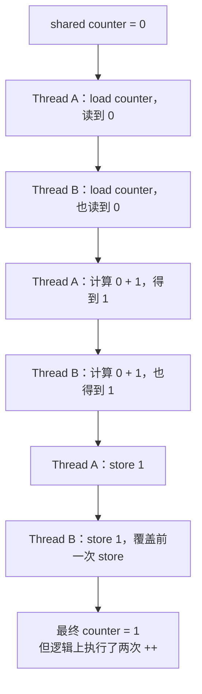
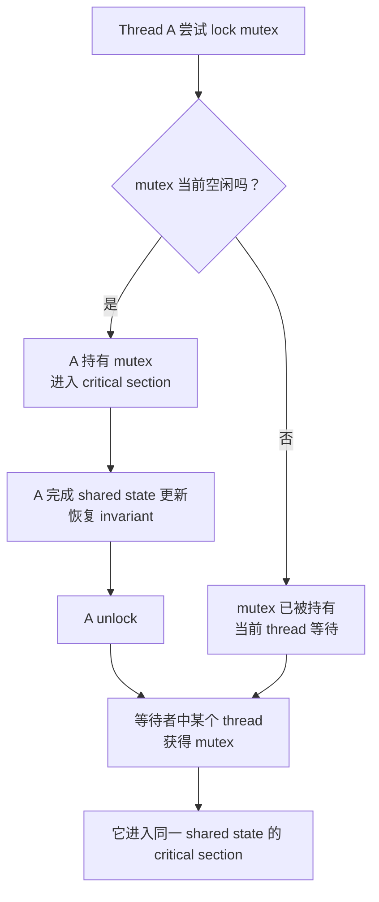
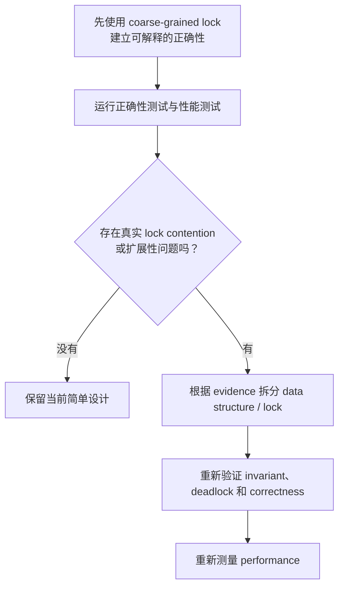
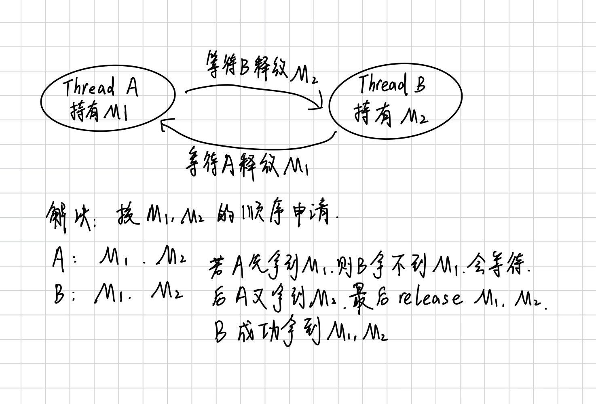

# Week5 Day5：`counter++` 只有一行，为什么多个执行流会算错？

> 今日定位：Day1~Day4 主要研究一个执行流怎样访问 memory、进入 kernel、处理 trap 和 page fault。今天第一次把视角扩展到：多个执行流同时访问同一份 shared state 时，为什么每个执行流单独看都合理，合在一起却会破坏结果。  
> 今日课程：MIT 6.S081 Lec10 `10.1 -> 10.5`。  
> 今日实践：独立完成 `race_counter.cpp` 和 `mutex_counter.cpp`，用 ThreadSanitizer 验证 data race，并用 `std::mutex + std::lock_guard` 修复。  
> 今日不是：完整学习 thread 的内部状态、实现 spinlock、学习复杂 C++ memory order、实现 BlockingQueue。

---

# Part 1：前情提要与必要术语

## 1. 今天从这个现象出发

假设有一个共享 counter：

```cpp
std::uint64_t counter = 0;
```

4 个执行流各自执行 1,000,000 次：

```cpp
++counter;
```

直觉上的 expected value：

```text
4 * 1,000,000 = 4,000,000
```

但程序可能出现：

```text
expected=4000000 actual=2478631
```

重新运行又可能变成：

```text
expected=4000000 actual=4000000
```

今天真正要回答的不是：

```text
怎样让输出碰巧变成 4000000？
```

而是：

```text
counter++ 在语言和执行层面包含什么步骤？
多个执行流怎样把这些步骤交错在一起？
mutex 到底保护哪一个 shared state / invariant？
为什么一次正确输出不能证明程序没有 data race？
```

## 2. 与前四天怎样连接

前四天你已经知道：

```text
一个 user instruction
-> 由 CPU 执行
-> 访问 virtual address
-> 可能正常完成，也可能 trap
```

今天增加：

```text
CPU0 可以运行一个执行流
CPU1 可以同时运行另一个执行流
两个执行流可能访问同一个 physical memory 中的 shared object
```

Day5 暂时把 thread 理解成：

```text
能够独立向前执行 instruction 的 execution flow
```

`thread` 的 PC、register、stack、process 共享关系和 scheduler，会在 Day6 正式展开。今天只使用创建执行流所需的最小 `std::thread` 接口。

## 3. 必要术语

| 术语 | 英文原意 | 今天的实际作用 |
|---|---|---|
| shared state | 共享状态 | 多个执行流都能访问、并可能共同修改的数据 |
| race condition | 竞态条件 | 程序结果依赖执行时序或交错顺序的逻辑问题 |
| data race | 数据竞争 | C++ 中多个执行流并发访问同一 memory location，至少一个写，且缺少同步；行为是 undefined behavior |
| read-modify-write | 读-改-写，RMW | 先读旧值、计算新值、再写回；`counter++` 逻辑上属于这一类 |
| atomic | 原子的、不可分割观察 | 其他参与者不会观察到操作的中间状态 |
| critical section | 临界区 | 访问某组 shared state、需要满足互斥或原子性要求的代码区间 |
| invariant | 不变量 | 在对外可观察的稳定状态下必须始终成立的约束 |
| mutex | mutual exclusion，互斥 | 同一时刻只允许一个执行流持有的同步对象 |
| lock | 锁定 / 获取锁 | 获得进入受保护状态操作区间的资格 |
| unlock | 解锁 / 释放锁 | 结束当前持有，让其他执行流有机会进入 |
| RAII lock management | 用对象生命周期管理锁 | 构造时持有，析构时自动释放，避免遗漏 `unlock` |
| deadlock | 死锁 | 多个执行流形成互相等待，谁也无法继续 |
| contention | 竞争、争用 | 多个执行流同时尝试获取同一把锁而产生等待 |
| coarse-grained lock | 粗粒度锁 / 大锁 | 一把锁覆盖较多状态和较大操作范围 |
| fine-grained lock | 细粒度锁 | 用多把锁拆分不同状态，提高并行度但增加设计复杂度 |
| ThreadSanitizer | Thread + Sanitizer，线程并发错误检测器，简称 TSan | 动态检测实际运行中出现的 data race 等并发问题 |

### 3.1 race condition 与 data race 不完全相同

今天会同时看到这两个词，但不要画等号。

`race condition` 更宽：

```text
程序正确性依赖“谁先发生”；
某个不希望出现的执行顺序会产生错误结果。
```

`data race` 是 C++ memory model 中更具体的条件：

```text
多个 thread 并发访问同一个 memory location
至少一个 access 是 write
access 之间没有满足要求的 synchronization
访问也不是正确的 atomic access
```

一旦 C++ 程序发生 data race：

```text
program behavior is undefined behavior，UB。
```

因此错误版 counter 不只是“可能少加几次”。

编译器不需要保证它只表现为 lost update；不同优化级别、CPU、运行次数可能表现不同。

### 3.2 `counter++` 不是语言保证的 atomic operation

`counter++` 写成一行，不代表 CPU 和其他 thread 会把它看成不可分割的一步。

逻辑上至少包含：

```text
load counter
add 1
store counter
```

实际 assembly 由 compiler、target ISA 和优化级别决定，今天不要求背具体指令。

当前必须记住：

```text
普通整数的 ++ 没有 C++ atomicity guarantee。
```

即使某台机器偶然生成一条看似完整的指令，也不能据此把普通共享变量当成线程安全。

### 3.3 invariant 不是“变量永远不变”

`invariant` 的字面意思是“不变量”，但它不是说变量值不能变化。

它表示：

```text
系统处于可被其他参与者观察的稳定状态时，
某个关系必须成立。
```

例如链表：

```text
head 指向第一个有效 node
每个 next 要么指向下一个有效 node，要么为 null
所有应该在链表中的 node 都能从 head 到达
```

修改链表的中间步骤可能暂时破坏这个 invariant。

锁的一个核心作用是：

```text
只有持锁者能看到并修改这个暂时不稳定的中间状态；
release lock 之前必须恢复 invariant。
```

## 4. 今日课程范围和停止位置

课程入口：

- [Lec10 Multiprocessors and locking](https://mit-public-courses-cn-translatio.gitbook.io/mit6-s081/lec10-multiprocessors-and-locking)

按顺序精读：

1. [10.1 为什么要使用锁？](https://mit-public-courses-cn-translatio.gitbook.io/mit6-s081/lec10-multiprocessors-and-locking/10.1-why-lock)
2. [10.2 锁如何避免 race condition？](https://mit-public-courses-cn-translatio.gitbook.io/mit6-s081/lec10-multiprocessors-and-locking/10.2-avoid-race-condition)
3. [10.3 什么时候使用锁？](https://mit-public-courses-cn-translatio.gitbook.io/mit6-s081/lec10-multiprocessors-and-locking/10.3-when-use-lock)
4. [10.4 锁的特性和死锁](https://mit-public-courses-cn-translatio.gitbook.io/mit6-s081/lec10-multiprocessors-and-locking/10.4-locks-properties-and-deadlock)
5. [10.5 锁与性能](https://mit-public-courses-cn-translatio.gitbook.io/mit6-s081/lec10-multiprocessors-and-locking/10.5-suo-yu-xing-neng)

今天听到这个程度：

```text
10.1：能解释多核为什么带来 shared kernel state 的并发访问
10.2：能手推 freelist lost update，并说明 acquire/release 的作用
10.3：能从 shared state 和 invariant 判断 lock scope
10.4：能画两把锁形成 circular wait 的最小 deadlock
10.5：知道先 coarse-grained 保正确，再根据 contention evidence 拆锁
```

今天停止：

```text
10.6 UART 只作为可选例子，不进入 driver 细节
10.7~10.8 spinlock implementation 不读
不背 amoswap / memory fence
不学习 std::atomic memory_order
不实现 lock-free structure
不实现 BlockingQueue / ThreadPool
```

---

# Part 2：教程主体

## 5. 教程开始：先手推一次 lost update

初始状态：

```text
counter = 0
```

Thread A 和 Thread B 都准备执行一次：

```cpp
++counter;
```

一种合法的底层交错可能是：



这里没有哪一个 thread 单独执行了错误的加法。

错误来自：

```text
两个 read-modify-write sequence 被交错，
第二次 store 使用了过期的 old value。
```

这叫：

```text
lost update：丢失更新。
```

### 5.1 为什么有时又能输出正确答案

另一次运行可能刚好是：

```text
Thread A 完整执行一次 ++
-> Thread B 再完整执行一次 ++
```

于是得到正确结果。

但这只能证明：

```text
这一次 execution schedule 没有暴露错误。
```

不能证明：

```text
程序的所有合法执行都正确。
```

并发 bug 经常具有：

```text
timing-dependent
intermittent
hard to reproduce
```

也就是依赖时序、间歇出现、难以稳定复现。

## 6. 顺着课程 10.1：为什么需要锁

课程不是先从 API 出发，而是先问：

```text
为什么 kernel 想同时使用多个 CPU？
```

原因是：

```text
多个 application 可以在多个 CPU 上运行
多个 system call 也可能同时进入 kernel
kernel 内有 proc、ticks、freelist、buffer cache 等 shared structures
```

于是出现矛盾：

```text
为了 performance，希望多个 CPU parallel execution
为了 correctness，共享状态更新又需要 coordination
lock 会让一部分执行重新 serialization
```

`serialization`：串行化。原本可能同时发生的操作，因为共同获取一把锁，只能一个接一个执行。

### 6.1 课程中的 `kfree / freelist`

#### 这个例子讲了啥

这里讲的是 xv6 的“内核物理页分配器”。

##### free physical page 是什么？

`physical page` 是物理内存中的一页，通常大小是 4096 字节。

`free physical page` 就是：

> 当前没有被内核或用户进程使用，可以以后分配出去的物理内存页。

例如：

```
物理内存：
[页 A：正在使用]
[页 B：空闲]
[页 C：正在使用]
[页 D：空闲]
```

页 B、页 D 就是 free physical pages。

##### `freelist` 是什么？

`freelist` 是 free list，也就是“空闲页链表”。

xv6 不会每次扫描整个物理内存来找空闲页，而是把空闲页串成链表：

```
freelist
   |
   v
[page A] -> [page B] -> [page C] -> nullptr
```

每个空闲页本身可以暂时存放一个 `next` 指针，用来指向下一个空闲页。

##### `kfree(page)` 是什么？

`kfree` 可以理解成：

> kernel free：把一页物理内存归还给内核分配器。

伪代码大概是：

```
void kfree(Page* page) {
    page->next = freelist;
    freelist = page;
}
```

也就是把新归还的页插入链表头部：

```
原来：

freelist -> A -> B

执行 kfree(C) 后：

freelist -> C -> A -> B
```

相反，`kalloc()` 会从链表头部取出一页：

```
freelist -> A -> B

kalloc() 返回 A 后：

freelist -> B
```

##### 为什么需要锁？

假设两个 CPU 同时执行 `kfree`：

```
原来：
freelist -> A
```

CPU 1 归还 `B`，CPU 2 归还 `C`。

如果没有锁，可能发生：

```
CPU 1: B->next = freelist     // B->next = A
CPU 2: C->next = freelist     // C->next = A

CPU 1: freelist = B
CPU 2: freelist = C
```

最后结果：

```
freelist -> C -> A
```

`B` 被丢了。

这就是 free page 丢失：它仍然存在于物理内存中，但已经不在 `freelist` 里，之后分配器找不到它了。

加锁后，过程变成：

```
CPU 1 获得锁
CPU 1 修改 freelist
CPU 1 释放锁

CPU 2 获得锁
CPU 2 修改 freelist
CPU 2 释放锁
```

于是链表更新不会互相覆盖。

##### 它和 `race_counter.cpp` 的共同点

`race_counter.cpp` 中是：

```
counter = counter + 1;
```

多个线程同时修改同一个 `counter`，导致更新丢失。

xv6 中是：

```
多个 CPU 同时修改 freelist
```

导致某些 page 从链表中丢失，甚至链表结构损坏。

共同本质就是：

```
shared mutable state
共享的、可修改状态

+
unsynchronized concurrent access
没有同步的并发访问
```

所以这段不是要求你现在掌握 xv6 分配器的所有实现细节，而是用 `freelist` 说明一个更真实的 race：

> 共享变量不一定是一个整数，也可能是一个链表；只要多个执行者同时修改它而没有协调，就可能出错。

#### 总结

xv6 用 `freelist` 保存 free physical pages。

`kfree(page)` 需要把 page 插入 freelist head。

课程暂时移除 `kmem.lock` 后，运行 xv6：

```text
系统一开始可能看起来正常
usertests 可能 panic
也可能只是悄悄丢失一些 free pages
```

这里很重要：

```text
race 不保证每次发生；
race 发生后也不保证只有一种错误表现。
```

这与今天的 `race_counter.cpp` 对应：

```text
xv6：多个 CPU 更新 shared freelist
C++：多个 thread 更新 shared counter
```

数据结构不同，共同问题是：

```text
shared mutable state + unsynchronized concurrent access
```

## 7. 顺着课程 10.2：锁怎样阻止 lost update

课程手推了两个 CPU 同时执行 `kfree`：

```text
初始 freelist head = H

CPU0：
    page0.next = H

CPU1：
    page1.next = H

CPU0：
    freelist = page0

CPU1：
    freelist = page1
```

最终：

```text
page0 无法再从 freelist head 到达
CPU0 的 update 丢失
```

加锁后，两个 CPU 必须这样进入：



### 7.1 mutex 机械上做什么，语义上保护什么

机械上：

```text
同一时刻最多一个执行流成功持有同一个 mutex。
```

语义上，程序员应该建立关联：

```text
这个 mutex 负责保护哪些 shared state？
这些 shared state 必须维持什么 invariant？
哪些访问路径都必须遵守同一规则？
```

因此更准确的话是：

```text
mutex 通过排斥持有者来序列化 critical section；
程序员用这把 mutex 保护某组 shared state 及其 invariant。
```

mutex 不会自动扫描程序并保护某个变量。

如果一条访问路径忘记获取同一把 mutex：

```text
那条路径仍然可能产生 data race。
```

### 7.2 critical section 不是 transaction rollback

课程用“原子地执行”帮助建立直觉。

当前要稍微精确一点：

```text
只要所有参与者都遵守同一 locking discipline，
其他参与者就不会在持锁者修改 shared state 时进入对应 critical section。
```

但 mutex 本身不会：

```text
在异常时自动回滚数据
把多条写入变成数据库 transaction
自动保证业务 invariant
```

持锁代码仍然必须自己在 unlock 前恢复正确状态。

### 7.3 big kernel lock 为什么简单但慢

假设整个 kernel 只有一把锁：

```text
所有 system call 进入 kernel
-> acquire big kernel lock
-> 完成工作
-> release
```

正确性相对容易推理，但：

```text
即使两个 system call 操作完全不同的数据，
它们也不能 parallel execution。
```

所以 xv6 和真实系统通常有多把锁。

但“多把锁”不是免费性能：

```text
lock ownership 更难设计
lock order 更难维护
deadlock 风险上升
模块边界更复杂
```

## 8. 顺着课程 10.3：什么时候使用锁

课程先给出一个保守规则：

```text
多个执行流访问 shared data，
并且至少一个执行流会修改它，
就先考虑用 lock 保护。
```

这条规则适合今天的第一层设计。

但课程马上指出它既可能太严格，也可能太宽松。

### 8.0 observer 想观察也需要拿到 lock

对，基本理解正确。

但更准确地说：

> 外部执行流如果也遵守同一套加锁规则，就不能在你的操作中间观察数据。

流程是：

```
rename:
    lock(d1)
    lock(d2)

    remove d1/x
    add d2/y

    unlock(d2)
    unlock(d1)
```

其他线程想查看 `d1` 或 `d2` 时，也必须先获取对应的锁：

```
observer:
    lock(d1)
    lock(d2)   // 此时会等待 rename 完成
    observe
    unlock
```

因此它最终只能看到两种稳定状态：

```
旧状态：d1/x 存在，d2/y 不存在
新状态：d1/x 不存在，d2/y 存在
```

而不会看到中间状态：

```
d1/x 不存在，d2/y 也不存在
```

不过有两个重要限制：

1. **锁不是让数据真正“消失”或不可见**，而是让遵守协议的线程暂时等待。
2. **所有访问者都必须遵守同一套锁协议**。如果某个线程不加锁直接读取，它仍然可能观察到中间状态。

另外，同时锁多个对象时通常要固定加锁顺序，例如永远先锁地址较小的目录，再锁地址较大的目录，否则可能出现死锁：

```
线程 A：持有 d1，等待 d2
线程 B：持有 d2，等待 d1
```

所以这段的核心就是：

> 为了保护一个跨对象的 invariant，锁必须覆盖整个操作；观察者也必须在同一把锁保护下观察。

### 8.1 为什么不能给“每个变量”自动配一把锁

课程使用 `rename`：

```text
d1/x -> d2/y
```

如果只按单个 directory object 自动加锁：

```text
lock d1
remove d1/x
unlock d1

lock d2
add d2/y
unlock d2
```

两个 critical sections 中间，其他执行流可能看到：

```text
x 已从 d1 消失
y 还没出现在 d2
```

于是“文件在整个 rename 过程中始终存在于某个目录”这个 invariant 被外部观察到破坏。

正确的 lock scope 需要覆盖整个 operation：

```text
lock d1 and d2
-> remove x
-> add y
-> invariant 恢复
-> unlock d1 and d2

这样外界想观察 d1 or d2 都要等到我这个 rename 结束 unlock 掉。
```

所以：

```text
锁保护的边界由 invariant 和 operation 决定，
不一定等于一个变量、一个 object 或一个 function。
```

### 8.2 一个实用的设计提问顺序

以后看到 shared state，先问：

```text
1. 哪些 execution flows 能访问它？
2. 哪些 access 会 write？
3. 稳定状态下必须满足什么 invariant？
4. 哪一步开始暂时破坏 invariant？
5. 哪一步完成后 invariant 才恢复？
6. 所有相关 access path 是否使用同一 synchronization rule？
```

critical section 通常至少要覆盖：

```text
第一次可能破坏 invariant 的操作
到
invariant 完全恢复
```

## 9. 顺着课程 10.4：锁的作用与 deadlock

课程总结锁的三个作用：

```text
1. 避免 lost update
2. 把多个操作组合成对其他参与者不可交错观察的 critical section
3. 维护 shared data structure invariant
```

随后进入锁带来的第一个大问题：

```text
deadlock
```

### 9.1 同一执行流重复获取 non-recursive mutex

`lock` 通常是对一个 `mutex` 执行加锁操作；`mutex` 是提供互斥能力的对象。

直觉上的错误流程：

```text
lock M
-> 尚未 unlock M
-> 再次 lock M
-> 第二次 lock 等待 M
-> 但 M 只有当前执行流继续运行到 unlock 才会释放
```

对于 C++ `std::mutex`，同一 thread 再次 `lock()` 自己已经持有的 mutex 不属于正确用法，不要把它当作普通可重入锁。

在这里的 `lock` 是一种 mutex lock，互斥锁，因为我们规定同一时刻只能有一个执行流拥有它。

今天不要写这个错误实验故意卡住终端。

### 9.2 两把锁形成 circular wait

经典场景：


两边都满足：

```text
继续执行前需要另一把锁
当前又不释放已经持有的锁
```

因此没有执行流能前进。

### 9.3 第一层避免方法：统一 lock ordering

给会同时获取的锁定义固定顺序：

```text
所有路径都必须先 Lock 1，再 Lock 2。
```

禁止出现：

```text
路径 A：Lock 1 -> Lock 2
路径 B：Lock 2 -> Lock 1
```

这样可以破坏 circular wait。

课程同时指出代价：

```text
调用一个 module 时，caller 可能必须知道 callee 会获取哪些锁；
lock order 会穿过 abstraction boundary；
系统模块化因此变难。
```

今天只掌握固定顺序，不展开完整 deadlock detection 或银行家算法。

### 9.4 为啥说模块化因此困难

这几句话是在说：锁的信息可能会“泄漏”到模块外部，破坏封装。

#### 单词含义

- `module`：模块，例如一个类、一个库、一个子系统。
- `caller`：调用者。调用函数的一方。
- `callee`：被调用者。被调用的函数或模块。
- `lock order`：加锁顺序，多个锁之间规定谁先加、谁后加。
- `abstraction boundary`：抽象边界，也就是模块对外暴露的接口和内部实现之间的边界。

例如：

```
module_a.do_work();
```

调用方是 `caller`：

```
main()
```

`module_a.do_work()` 是 `callee`。

#### 第一条是什么意思？

> 调用一个 module 时，caller 可能必须知道 callee 会获取哪些锁。

例如：

```
module_a.do_work();
```

表面上只是调用一个接口，但内部可能会：

```
lock(mutex_a);
lock(mutex_b);
```

如果调用者不知道这一点，就可能提前拿着 `mutex_b` 再调用：

```
lock(mutex_b);
module_a.do_work();  // 内部再尝试 lock(mutex_a), lock(mutex_b)
```

这可能造成死锁，或者重复加锁。

也就是说，模块虽然只暴露了：

```
do_work()
```

但调用者却不得不关心它内部的锁行为。

#### 第二条是什么意思？

> lock order 会穿过 abstraction boundary。

意思是，加锁顺序不再只属于某个模块内部，而是跨越了模块边界。

例如规定全系统必须：

```
先锁 mutex_a，再锁 mutex_b
```

但是：

```
main()                  // 模块外
    lock(mutex_a)
    module_b.do_work()   // 模块内又要 lock(mutex_b)
```

这里的“先锁 `mutex_a`，再锁 `mutex_b`”涉及调用者和被调用模块两边，所以锁顺序穿过了 abstraction boundary。

#### 第三条是什么意思？

> 系统模块化因此变难。

模块化本来希望做到：

```
调用者只需要知道接口怎么用，
不需要知道模块内部怎么实现。
```

但是如果调用者必须知道：

- 这个函数会拿哪些锁；
- 这些锁应该按什么顺序拿；
- 调用前自己能不能持有某把锁；

那么模块内部的实现细节就泄漏给调用者了。

于是模块之间产生了隐式依赖：

```
模块 A 的内部锁顺序
        ↓
影响模块 B 如何调用 A
```

这就降低了封装性，使系统更难独立修改和组合。

一句话总结：

> 锁的难点不只是“同一时刻谁能进入临界区”，还包括调用链上不同模块之间如何约定加锁顺序；一旦这个约定跨越模块边界，模块内部的锁实现就会影响外部调用者。

## 10. 顺着课程 10.5：锁与性能

锁让 critical section serialization。

性能问题通常来自：

```text
大量执行流争用同一把锁
critical section 太长
一把 coarse-grained lock 覆盖了互不相关的状态
持锁期间执行昂贵工作
```

但课程没有要求一开始就使用很多细锁。

它给出的工程顺序是：



这与你后面的 ThreadPool / Reactor 很相关：

```text
先做正确、简单、能解释的 synchronization；
再根据 benchmark / profiling 发现瓶颈；
最后才细化 lock granularity。
```

不能只因为：

```text
“fine-grained 听起来更高级”
```

就提前把状态拆得难以维护。

### 10.1 今天不要比较错误版和加锁版谁更快

`race_counter.cpp` 存在 UB。

因此：

```text
错误版耗时更短
```

不能成为一个有意义的性能结论。

今天错误版只承担一个职责：

```text
展示 unsynchronized shared access 的错误现象，
并让 TSan 找到 data race。
```

## 11. xv6 lock 与 C++ mutex 的对应边界

共同思想：

```text
共享状态可能被并发访问
critical section 需要 mutual exclusion
lock 与 shared invariant 建立设计关系
lock ordering 影响 deadlock
lock granularity 影响 parallelism
```

接口对应：

| xv6 课程表达 | 今天的 C++ 表达 |
|---|---|
| `acquire(&lock)` | 获取 mutex |
| `release(&lock)` | 释放 mutex |
| spinlock-protected critical section | `std::mutex` 保护的 critical section |
| `kmem.lock` 保护 freelist | `counter_mutex` 保护 shared counter |

但实现不能画等号：

```text
xv6 Lec10 后半段实现的是 kernel spinlock
std::mutex 是 C++ standard synchronization primitive
```

xv6 spinlock 涉及：

```text
busy waiting
interrupt state
hardware atomic instruction
memory ordering / fence
```

这些在 `10.7~10.8`，今天不展开。

## 12. 实践前的最小 C++ 接口

这里只给独立 API 语义，不给两个练习的完整控制流。

今天常用头文件：

```cpp
#include <cstdint>
#include <iostream>
#include <mutex>
#include <thread>
#include <vector>
```

### 12.1 `std::thread`

头文件：

```cpp
#include <thread>
```

最小形式：

```cpp
std::thread worker(callable);
```

创建成功后：

```text
新的 execution flow 开始执行 callable
创建它的 thread 继续向下执行
```

等待该 thread 完成：

```cpp
worker.join();
```

`join`：汇合。当前 thread 等待 `worker` 执行结束。

责任：

```text
每一个成功创建且仍 joinable 的 std::thread，
必须在 std::thread object 析构前 join 或 detach。
```

今天统一使用 `join`，不使用 `detach`。

如果 joinable 的 `std::thread` 直接析构，程序会调用 `std::terminate`。

### 12.2 lambda capture

你已经使用过 lambda。今天最常见的是引用捕获 shared object：

```cpp
[&counter] {
    // 这里可以访问外层 counter 本体
}
```

注意：

```text
能通过引用访问 shared object，
不等于已经 synchronization。
```

lambda capture 只决定如何访问对象，不提供 thread safety。

#### 不等于已经 synchronization 啥意思？

这里的 `synchronization` 是“同步”。

它指的是：

> 多个线程访问共享对象时，通过某种机制协调访问顺序，保证不会同时破坏数据，也保证修改结果能被其他线程正确看到。

`[&counter]` 只表示：

> lambda 不复制 `counter`，而是保存对外部 `counter` 的引用。

它没有自动加锁。

例如：

```
int counter = 0;

auto task = [&counter] {
    ++counter;
};
```

如果两个线程同时执行 `task()`，它们可能同时修改 `counter`，产生 data race：

```
线程 A：读取 counter
线程 B：读取 counter
线程 A：写回 counter + 1
线程 B：写回 counter + 1
```

最终可能只增加了一次。

需要额外的 synchronization：

```
std::mutex mutex;

auto task = [&counter, &mutex] {
    std::lock_guard<std::mutex> lock(mutex);
    ++counter;
};
```

这里：

- lambda capture：决定 lambda 如何访问 `counter`；
- `mutex`：协调多个线程访问 `counter` 的时机；
- `lock_guard`：保证同一时刻只有一个线程执行 `++counter`。

也可以使用原子变量：

```
std::atomic<int> counter{0};

auto task = [&counter] {
    ++counter;
};
```

所以核心区别是：

```
capture：我能不能访问这个对象，以及访问的是副本还是本体
synchronization：多个执行流如何安全、有序地访问共享对象
```

引用捕获让多个线程能够访问同一个对象，但它本身不会让访问变安全。

### 12.3 `std::mutex`

头文件：

```cpp
#include <mutex>
```

创建：

```cpp
std::mutex counter_mutex;
```

基础接口：

```cpp
counter_mutex.lock();
counter_mutex.unlock();
```

但今天不推荐手写成：

```cpp
lock();
// 多个 return / exception path
unlock();
```

因为任一路径漏掉 `unlock()`，其他 thread 都可能永远等待。

### 12.4 `std::lock_guard`

今天使用 RAII，构造的时候拿锁，析构的时候释放锁，锁就是我管理的资源：

```cpp
{
    std::lock_guard<std::mutex> guard(counter_mutex);
    // 当前 scope 持有 counter_mutex
}
// guard 析构，自动 unlock
```

`guard`：守卫。这个 object 的 lifetime 表示当前 scope 的 lock ownership。

具体来说，这行代码做了以下几件事：

1. 

   **构造 `lock_guard` 对象时自动调用 `counter_mutex.lock()`**

   也就是“拿锁”。如果此时有其他线程持有该互斥锁，当前线程会阻塞等待，直到获取到锁为止。

2. 

   **析构 `lock_guard` 对象时自动调用 `counter_mutex.unlock()`**

   当 `guard` 离开作用域（例如函数返回、异常抛出等），会自动释放锁，避免忘记解锁的问题。

它解决的是：

```text
如何可靠 release mutex
```

它不会自动决定：

```text
哪一段代码应该放进 critical section
mutex 应该保护哪些变量
invariant 是什么
```

### 12.5 `std::vector<std::thread>`

今天需要保存多个 thread object。

你已经熟悉 `std::vector`，只需知道它可以保存 move-only 的 `std::thread`：

```cpp
std::vector<std::thread> workers;
```

可以使用 `emplace_back` 直接在 vector 尾部创建 thread。

这里不提供完整循环；你需要自己决定：

```text
创建多少个 workers
每个 worker 执行多少次 increment
什么时候 join 所有 workers
```

## 13. 练习一：`race_counter.cpp`

这是一个受控错误实验。

### 13.1 需求

独立实现：

```text
1. 创建一个普通 shared integer counter，初始为 0
2. 设置 thread_count，例如 4
3. 设置 increments_per_thread，例如 1,000,000
4. 创建 thread_count 个 threads
5. 每个 thread 对同一 counter 执行 increments_per_thread 次 ++
6. join 所有 threads
7. 输出 expected 与 actual
```

类型建议：

```text
使用容量足够的整数类型；
确保 expected 的乘法不会先在较小类型中 overflow。
```

今天明确禁止把下面这些当成修复：

```text
volatile
sleep
降低 thread_count
只运行一次
发现 actual 恰好等于 expected 就宣布正确
```

`volatile` 不提供 C++ thread synchronization。

### 13.2 编译运行

```bash
g++ -std=c++17 -Wall -Wextra -g -pthread race_counter.cpp -o race_counter
./race_counter
```

多运行几次：

```bash
for i in {1..10}; do
    ./race_counter
done
```

观察时记录：

```text
是否每次 actual 都一样
是否可能偶尔等于 expected
是否出现比 lost update 更奇怪的表现
```

但 note 不需要抄 10 行相同输出，保留 2~3 个有代表性的结果即可。

### 13.3 使用 ThreadSanitizer

你的 Ubuntu 已经完成 GCC ThreadSanitizer 配置并实测：

```text
默认 g++：10.5
TSan 启动文件：/usr/lib/gcc/x86_64-linux-gnu/10/libtsan_preinit.o
错误版：能报告 WARNING: ThreadSanitizer: data race
mutex 版：输出正确，且不再报告该 data race
```

可以用下面两条命令检查当前环境：

```bash
g++ --version
g++ -print-file-name=libtsan_preinit.o
```

第二条应该输出一个完整路径，而不是只输出 `libtsan_preinit.o`。普通编译和 TSan 编译现在都统一使用 `g++`。

编译：

```bash
g++ -std=c++17 -Wall -Wextra -g \
    -fsanitize=thread -fno-omit-frame-pointer \
    -pthread race_counter.cpp -o race_counter_tsan
```

运行：

```bash
./race_counter_tsan
```

重点找：

```text
WARNING: ThreadSanitizer: data race
```

报告通常会给出：

```text
一个 thread 的 write stack
另一个 thread 的 conflicting access stack
memory location
threads 的创建位置
```

TSan 能证明：

```text
这次执行中，动态检测器观察到了 unsynchronized conflicting access。
```

TSan 不能证明：

```text
某次没有报告，就代表所有 execution schedules 都绝对正确。
```

## 14. 练习二：`mutex_counter.cpp`

### 14.1 需求

保留与错误版相同的：

```text
counter type
thread_count
increments_per_thread
expected calculation
output format
```

只改变 synchronization design：

```text
1. 为 shared counter 配置一把 mutex
2. 每次 read-modify-write counter 时，先持有该 mutex
3. 使用 std::lock_guard 管理 lock lifetime
4. 所有访问 shared counter 的路径遵守同一 locking rule
5. join 后再读取并输出 final counter
```

你需要在代码注释中写一句：

```text
counter_mutex protects counter.
Whenever the mutex is released, counter equals the number of completed protected increments;
after all workers are joined, counter equals expected.
```

不要只写：

```text
这里加锁。
```

### 14.2 critical section 边界

今天的最小正确 critical section 是：

```text
读取 counter
-> 计算 counter + 1
-> 写回 counter
```

锁必须覆盖完整 read-modify-write。

错误边界示例：

```text
只锁 read，unlock 后计算和 write
只锁 write，old value 在锁外读取
每个 thread 使用自己的 mutex
某些访问 counter 加锁，另一些不加锁
```

尤其注意：

```text
4 个 thread 各自拥有 4 把不同 mutex
```

不能保护同一个 counter。

所有竞争者必须协调同一个 mutex object。

### 14.3 编译与验证

```bash
g++ -std=c++17 -Wall -Wextra -g -pthread mutex_counter.cpp -o mutex_counter
./mutex_counter
```

重复运行：

```bash
for i in {1..10}; do
    ./mutex_counter
done
```

再运行 TSan：

```bash
g++ -std=c++17 -Wall -Wextra -g \
    -fsanitize=thread -fno-omit-frame-pointer \
    -pthread mutex_counter.cpp -o mutex_counter_tsan

./mutex_counter_tsan
```

预期：

```text
每次 actual == expected
TSan 不再报告 counter 的 data race
```

注意证据边界：

```text
结果相等 + TSan 无报告
是很有价值的工程证据，
但代码 review 仍要检查所有 access 是否遵守同一 mutex rule。
```

## 15. deadlock 手推任务

不要求写会永久卡住的程序。

在 `day5_note.md` 画一个最小状态图：

```text
Thread A 持有 M1，等待 M2
Thread B 持有 M2，等待 M1
```

然后写出：

```text
统一规定 M1 -> M2 的获取顺序，
如何让上述 circular wait 不再形成。
```

今天不要求：

```text
std::scoped_lock
std::lock
try_lock
timed_mutex
recursive_mutex
deadlock detector
```



## 16. 今天最容易混淆的点

### 错误 1：一行 C++ expression 就是 atomic

```text
source code 的行数不决定 atomicity。
```

### 错误 2：输出正确，所以没有 race

```text
一次 schedule 没暴露 bug，不代表其他 schedule 正确。
```

### 错误 3：data race 最坏只是少加几次

```text
C++ data race 是 UB，不能把表现限制为 lost update。
```

### 错误 4：mutex 保护“这几行代码”

```text
机械上 mutex 排斥持有者；
设计上它应关联 shared state 和 invariant。
没获取同一 mutex 的代码不会被自动保护。
```

### 错误 5：每个 thread 一把 mutex

```text
不同 mutex 之间没有 mutual exclusion。
访问同一 counter 的执行流必须协调同一个 mutex。
```

### 错误 6：只给 write 加锁

```text
read-modify-write 必须作为完整 critical section。
```

### 错误 7：锁越细越专业

```text
fine-grained lock 增加 lock ordering、deadlock 和 invariant 推理成本。
先正确，再根据 contention evidence 优化。
```

### 错误 8：用了 lock_guard 就绝对线程安全

```text
lock_guard 只保证 scope 结束时 unlock；
它不能替你选择正确的 mutex 和 critical section。
```

---

# Part 3：收尾、任务与验收

## 17. 今日产出

Ubuntu：

```text
~/code/system-learning/cpp/week5/day5/race_counter.cpp
~/code/system-learning/cpp/week5/day5/mutex_counter.cpp
```

Windows 笔记：

```text
C:\Users\FxorG\Desktop\gpt_infra\week5\day5\day5_note.md
```

周计划中的 `race_lock_note.md` 合并到 `day5_note.md`，避免重复写两份内容。

## 18. 今日核心任务

### 任务 1：手推 `counter++`

不用抄教程全文，只在 note 中写出一组：

```text
A load
B load
A store
B store
```

并解释为什么 final value 少一次 increment。

### 任务 2：完成错误实验

```text
race_counter.cpp
规定 warning 选项编译
至少运行多次
保留代表性输出
运行 TSan
```

### 任务 3：完成 mutex 修复

```text
mutex_counter.cpp
同一 workload
同一 mutex
lock_guard
完整 RMW critical section
重复运行
TSan 复验
```

### 任务 4：画 deadlock 与 lock order

使用 Mermaid 或简洁文本图即可，不写故意挂死的 demo。

## 19. 验收问题

### 问题 1

`counter++` 为什么不是一个有 C++ atomicity guarantee 的操作？请手推两个 thread 怎样得到 lost update。

### 问题 2

`race condition` 与 C++ `data race` 有什么区别？为什么错误版一次输出正确也不能证明程序正确？

### 问题 3

mutex 机械上做了什么？程序设计中它应该保护“代码”、一个变量，还是 shared state 的 invariant？

### 问题 4

为什么 critical section 必须覆盖完整 read-modify-write？只给 read 或 write 加锁会怎样？

### 问题 5

Thread A 按 `M1 -> M2` 获取锁，Thread B 按 `M2 -> M1` 获取锁，怎样形成 deadlock？固定 lock ordering 怎样破坏它？

### 问题 6

为什么工程上通常先从 coarse-grained lock 开始？什么 evidence 出现后，才值得拆成 fine-grained locks？

### 问题 7

TSan 报告 data race 能证明什么？一次运行没有报告又不能证明什么？

## 20. 今日通过标准

### 核心通过

```text
能把 counter++ 展开为 read-modify-write
能手推 lost update
明确 race_counter 的 data race 属于 C++ UB
能说明 mutex 关联 shared state / invariant
能用同一 mutex 和 lock_guard 修复完整 RMW
两份程序使用 -Wall -Wextra -g -pthread 零 warning
能画最小 two-lock deadlock
知道先 coarse-grained、测量后再拆锁
```

### 重点错误路径

```text
thread object 未 join 导致 std::terminate
每个 thread 使用不同 mutex
critical section 没覆盖完整 RMW
错误版偶然正确就停止验证
TSan 报告被忽略
```

### 工程增强项

```text
为 mapping / code line 保存完整 TSan 报告
比较不同 thread_count 的 contention
使用 local accumulation 减少 shared updates
研究 std::atomic counter
研究 spinlock / memory ordering
```

这些全部后置，不阻塞 Day5。

## 21. 今日一句话

```text
多个执行流访问 shared mutable state 时，
单个表达式可能被拆成会交错的 read-modify-write；
C++ data race 属于 UB。
mutex 通过 mutual exclusion 让遵守同一 locking rule 的执行流
不能同时进入对应 critical section，
而程序员真正要维护的是 shared state 的 invariant。
锁先为 correctness 服务，再根据 contention evidence 调整 granularity。
```

下一天进入：

```text
thread 到底保存哪些私有执行状态，
同一 process 中哪些资源由 threads 共享，
context switch 保存/恢复什么，
scheduler 怎样选择 runnable execution flow。
```

---

## 参考资料

- [MIT 6.S081 Lec10：Multiprocessors and locking](https://mit-public-courses-cn-translatio.gitbook.io/mit6-s081/lec10-multiprocessors-and-locking)
- [10.1 为什么要使用锁？](https://mit-public-courses-cn-translatio.gitbook.io/mit6-s081/lec10-multiprocessors-and-locking/10.1-why-lock)
- [10.2 锁如何避免 race condition？](https://mit-public-courses-cn-translatio.gitbook.io/mit6-s081/lec10-multiprocessors-and-locking/10.2-avoid-race-condition)
- [10.3 什么时候使用锁？](https://mit-public-courses-cn-translatio.gitbook.io/mit6-s081/lec10-multiprocessors-and-locking/10.3-when-use-lock)
- [10.4 锁的特性和死锁](https://mit-public-courses-cn-translatio.gitbook.io/mit6-s081/lec10-multiprocessors-and-locking/10.4-locks-properties-and-deadlock)
- [10.5 锁与性能](https://mit-public-courses-cn-translatio.gitbook.io/mit6-s081/lec10-multiprocessors-and-locking/10.5-suo-yu-xing-neng)
- [cppreference：`std::thread`](https://en.cppreference.com/w/cpp/thread/thread)
- [cppreference：`std::mutex`](https://en.cppreference.com/w/cpp/thread/mutex)
- [cppreference：`std::lock_guard`](https://en.cppreference.com/w/cpp/thread/lock_guard)
- [ThreadSanitizer C++ manual](https://github.com/google/sanitizers/wiki/threadsanitizercppmanual)
