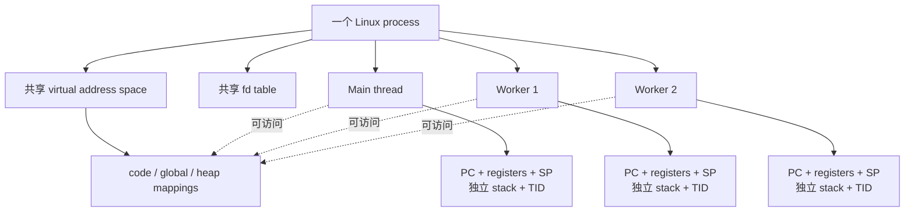
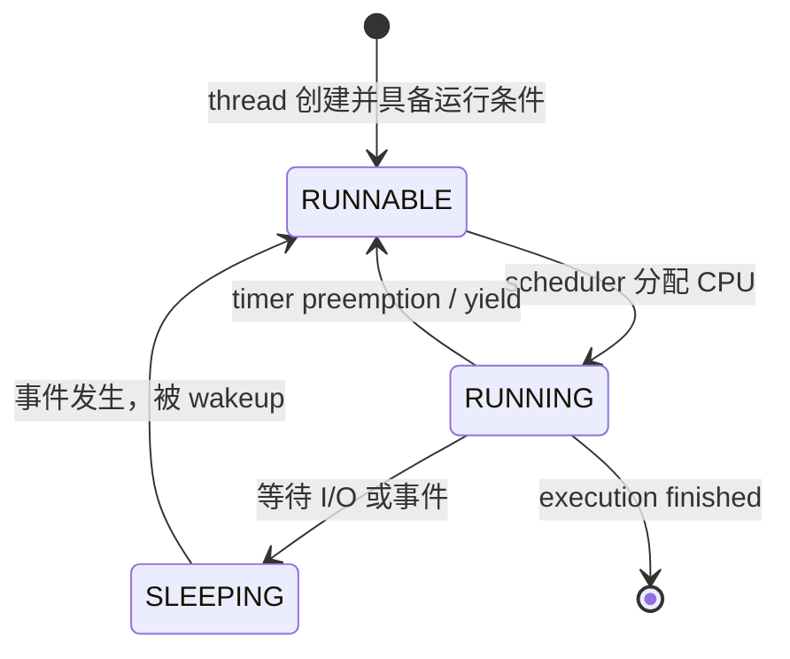
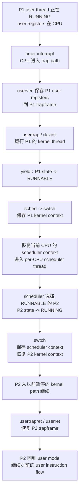

# Week5 Day6：CPU 只有几个，为什么很多 thread 都像在同时运行？

> 今日定位：Day5 已经回答“多个执行流同时访问 shared state 为什么需要 synchronization”。今天继续追问：这些执行流由谁管理？一个 thread 暂停时，什么状态必须留下？CPU 怎样从 Thread A 转去执行 Thread B？  
> 今日课程：MIT 6.S081 Lec09 `9.2` 的 interrupt 直觉；Lec11 `11.1 -> 11.5` 精读，`11.6 -> 11.9` 定向顺读。  
> 今日实践：独立完成 `thread_identity.cpp`，用 `ps -L` 和 `/proc/<pid>/task` 观察同一 process 中的 Linux threads。  
> 今日不是：实现 scheduler、比较 CFS/优先级算法、深入汇编、学习 condition variable、实现 ThreadPool。

---

# Part 1：前情提要与必要术语

## 1. 前情提要

Day5 中，你已经创建了四个 `std::thread`。

从 C++ 代码看，只需要：

```cpp
workers.emplace_back(task);
```

新的 execution flow 就出现了。

但操作系统必须回答更多问题：

```text
一台机器只有有限数量的 CPU cores，
为什么可以存在远多于 CPU 数量的 threads？

当前 thread 的下一条 instruction 在哪里？
它暂停后，local variables 为什么还在？
CPU 中的 registers 要交给下一个 thread 使用，
旧 register values 放到哪里？

一个永远不主动休息的 compute-bound thread，
为什么不能永久霸占 CPU？
```

今天从这些问题出发。

### 1.1 与 Day5 的直接连接

Day5 研究：

```text
多个 threads 同时运行时，
怎样保护 shared mutable state。
```

Day6 研究：

```text
多个 threads 为什么都有机会运行，
操作系统怎样暂停一个并恢复另一个。
```

两天不是两条独立主线：

```text
scheduler 可能在不同 CPU cores 上同时运行多个 threads
-> threads 可能真正 parallel access shared state
-> 需要 Day5 的 mutex / invariant
```

## 2. 最小硬件模型

你的计算机硬件基础目前还在补，所以先建立今天够用的模型。

### 2.1 CPU core 当前有什么

一个 CPU core 正在执行某个 thread 时，至少需要：

```text
PC：下一条或当前相关 instruction 在哪里
general-purpose registers：当前计算用到的 values / addresses
SP：当前 thread 的 stack pointer
privilege / interrupt 等少量 control state
```

这里的 registers 是 CPU core 内部的高速硬件状态。

同一个 CPU core 下一刻改去执行另一个 thread 时：

```text
同一组硬件 registers 要被新 thread 使用。
```

因此旧 thread 如果以后还要继续，就必须先把需要的 register values 保存到 memory。

### 2.2 memory 为什么不用整个复制

stack、heap、global objects 原本就在 memory 中。

暂停 thread 时：

```text
这些 memory bytes 不会因为 CPU 改去执行别人而自动消失。
```

真正会立刻被下一执行流覆盖使用的是：

```text
CPU core 当前的 registers。
```

所以 context switch 的核心不是：

```text
复制整个 process memory。
```

而是：

```text
保存旧 execution context 中必须保留的 CPU state
-> 恢复新 execution context 的 CPU state
-> 让 CPU 从新 thread 之前暂停的位置继续
```

## 3. 必要术语

| 术语 | 英文原意 | 今天的实际作用 |
|---|---|---|
| program | 程序 | 磁盘上的 executable/code 与静态内容，本身不是正在执行的实体 |
| process | 进程 | 正在运行的程序实例，也是 address space、fd 等资源的容器 |
| thread | 线程，原意是“线” | process 内一条独立向前执行的 control flow |
| execution flow | 执行流 | 一串按 PC 推进的 instructions |
| CPU core | CPU 核心 | 能独立执行 instruction 的硬件执行单元 |
| concurrency | 并发 | 多个任务在一段时间内都取得进展，可以靠交错完成 |
| parallelism | 并行 | 多个任务在同一时刻真的运行在不同 CPU cores 上 |
| scheduling | 调度 | 决定哪个 runnable execution flow 获得 CPU |
| scheduler | 调度器 | 执行调度决策与切换组织的内核代码/执行上下文 |
| context | 上下文 | 让某个 execution flow 以后能从原处继续所需的状态集合 |
| context switch | 上下文切换 | 保存旧执行流状态并恢复新执行流状态 |
| preemption | 抢占 | 当前执行流没有主动让出 CPU，内核仍取得控制并可切走它 |
| timer interrupt | 定时器中断 | timer hardware 周期性产生的异步事件，让 CPU 进入内核处理 |
| yield | 让出 | 当前执行流表示自己暂时不继续占用 CPU |
| runnable | 可运行 | 已具备运行条件，只差 scheduler 分配 CPU |
| running | 正在运行 | 当前确实占用某个 CPU core |
| sleeping / blocked | 睡眠 / 阻塞 | 正在等待事件，现在即使给 CPU 也无法继续 |
| PID | Process Identifier | process identifier，进程标识 |
| TID | Thread Identifier | thread identifier，线程标识 |

### 3.1 `context` 不要只翻译成“环境”

这里的 context 不是泛泛的“背景”。

它回答：

```text
如果现在暂停这条 execution flow，
以后至少恢复哪些状态，才能像没被暂停一样继续？
```

广义 thread execution context 可以包括：

```text
PC / registers / SP
thread stack
scheduling state
thread-local state
与地址空间、内核对象的关联
```

但 xv6 源码中的：

```c
struct context
```

是一个更窄的具体结构，只保存内核线程通过 `swtch` 切换时需要保存的 registers。

不要把“广义 context”和“xv6 的 `struct context`”完全画等号。

### 3.2 `swtch` 为什么少了一个 `i`

xv6 把切换函数命名为：

```text
swtch
```

因为：

```text
switch
```

已经是 C 语言 keyword。

`swtch` 没有什么额外的英文展开，只是为了避开关键字而采用的名字。

### 3.3 `RUNNABLE` 的拼写

xv6 源码状态名是：

```text
RUNNABLE
```

意思是：

```text
现在没有占用 CPU，但条件齐全，随时可以被 scheduler 选中。
```

中文课程部分段落里偶尔写成 `RUNABLE`；今天代码和笔记统一使用源码拼写 `RUNNABLE`。

## 4. 今日课程范围与停止位置

### 4.1 Lec09：只读 `9.2 Interrupt 硬件部分`

页面：

- [9.2 Interrupt 硬件部分](https://mit-public-courses-cn-translatio.gitbook.io/mit6-s081/lec09-interrupts/9.2-interrupt-handware)

精读到：

```text
interrupt 与 system call 的共同点
interrupt 的 asynchronous 特征
hardware 在 CPU 运行其他代码时可以独立产生事件
CPU 收到 interrupt 后进入 kernel 处理，再恢复原工作
```

PLIC 的 claim / complete 只建立第一层直觉：

```text
外部设备产生 interrupt
-> interrupt controller 路由给某个 CPU core
-> CPU/kernel 确认并处理
-> 完成后通知 controller
```

今天不要求：

```text
记 PLIC registers
读 UART driver
区分所有 external/software/timer interrupt 编号
```

注意课程边界：

```text
9.2 的主要例子是 external device interrupt；
Day6 借用的是 interrupt 的 asynchronous 性质。
真正推动今天 scheduling 主线的是 timer interrupt，
它在 Lec11 11.2 开始进入调度叙事。
```

### 4.2 Lec11：`11.1 -> 11.5` 必读

页面：

1. [11.1 线程概述](https://mit-public-courses-cn-translatio.gitbook.io/mit6-s081/lec11-thread-switching-robert/11.1-thread)
2. [11.2 xv6 线程调度](https://mit-public-courses-cn-translatio.gitbook.io/mit6-s081/lec11-thread-switching-robert/11.2-xian-cheng-diao-du)
3. [11.3 xv6 线程切换（一）](https://mit-public-courses-cn-translatio.gitbook.io/mit6-s081/lec11-thread-switching-robert/11.3-xv6-thread-switching-1)
4. [11.4 xv6 线程切换（二）](https://mit-public-courses-cn-translatio.gitbook.io/mit6-s081/lec11-thread-switching-robert/11.4-xv6-thread-switching-2)
5. [11.5 xv6 进程切换示例](https://mit-public-courses-cn-translatio.gitbook.io/mit6-s081/lec11-thread-switching-robert/11.5-xv6-thread-switching-code)

听到这个程度：

```text
11.1：
    能说出 thread 的 PC、registers、stack 三类基本执行状态
    能区分多核 parallel 与单核交错 scheduling
    知道 xv6 与 Linux user threads 的模型差异

11.2：
    能说出 thread switching 的三个挑战
    知道 timer interrupt 解决 compute-bound thread 不主动让出的问题
    能区分 RUNNING / RUNNABLE / SLEEPING

11.3：
    能区分 user state 保存到 trapframe
    与 kernel thread state 保存到 context

11.4：
    能画 P1 kernel thread -> per-CPU scheduler thread
    -> P2 kernel thread 的中间路径

11.5：
    能解释单核 spin 示例为什么仍能看到两个进程交替输出
    知道 timer interrupt 只是让内核取得控制，yield/scheduler 才组织切换
```

GDB 中的具体地址、源码行号和每个 register value 不背。

### 4.3 `11.6 -> 11.9` 定向顺读

今天只抓函数责任：

| 小节 | 只抓住这一件事 |
|---|---|
| `11.6 yield/sched` | `yield` 修改状态并准备让出；`sched` 检查切换前提并进入 `swtch` |
| `11.7 swtch` | 保存当前内核 context，恢复目标 context |
| `11.8 scheduler` | 扫描/选择 `RUNNABLE` process，切入其内核 thread |
| `11.9 first switch` | 新 thread 第一次运行前，需要预先构造可恢复的初始 context |

今天不要求：

```text
背 `switch.S`
背 callee-saved register 列表
解释新 process 第一次调度的每个初始化字段
实现 xv6 scheduler
```

---

# Part 2：教程主体

## 5. 教程开始：四个 workers 到底是什么

Day5 中：

```cpp
std::vector<std::thread> workers;
```

假设创建四个 workers。

从 Linux process 视角看：

```text
一个 process
├── main thread
├── worker thread 1
├── worker thread 2
├── worker thread 3
└── worker thread 4
```

它们不是五个独立 address spaces。

它们的关系更接近：

```text
共享一个资源容器，
但拥有五套独立的执行位置和 stack。
```

## 6. program、process、thread

### 6.1 program

磁盘上存在：

```text
./thread_identity
```

它是 program：

```text
instructions
static data
executable metadata
```

它没有“当前执行到哪一行”，因为它还没运行。

### 6.2 process

执行：

```bash
./thread_identity
```

kernel 创建运行实例。

process 至少关联：

```text
virtual address space
page tables / memory mappings
fd table
working directory
进程级身份和内核 bookkeeping
一个或多个 threads
```

所以当前可以把 process 记成：

> process 是资源容器，也是正在运行的 program instance；真正逐条执行 instructions 的是其中的 thread。

### 6.3 thread

每个 thread 都要能回答：

```text
我下一步执行哪里？
我当前 registers 是什么？
我的函数调用链和 local variables 在哪个 stack？
我现在是 RUNNING、RUNNABLE，还是等待事件？
```

因此 thread 是：

> 可以被 scheduler 独立安排到 CPU 上执行的一条 control flow。

### 6.4 Linux 与 xv6 的模型边界

xv6 课程模型：

```text
一个 user process
-> 一个 user thread
-> 进入 kernel 时有对应 kernel thread execution
```

Linux/C++ 实践：

```text
一个 user process
-> 可以有多个 user threads
-> 它们共享 process resources
-> Linux scheduler 可以分别调度这些 threads
```

共同思想是：

```text
每个可调度 execution flow 都需要独立 execution state。
```

不能把 xv6 的“一进程一个 user thread”直接套成 Linux 的限制。

## 7. 同一 process 的 threads：什么共享，什么私有

| 状态/资源 | 同一 process 内是否共享 | 属于谁 |
|---|---:|---|
| code/text mapping | 共享 | process address space |
| global objects | 共享 | process address space |
| heap objects | 共享地址空间；是否共同访问由程序决定 | process address space |
| file descriptor table | 共享 | process |
| current working directory | 共享 | process |
| virtual address space / mappings | 共享 | process |
| PC / registers | 不共享 | thread execution state |
| user stack | 每个 thread 独立 | thread |
| Linux TID | 每个 thread 不同 | thread |
| scheduling state | 每个 thread 独立 | schedulable thread |

### 7.1 “heap 共享”不等于每个 heap object 都自动共享使用

准确说法：

```text
所有 threads 使用同一个 virtual address space，
因此它们有能力访问其中的 global / heap memory。
```

但某个 heap object 是否真的被多个 threads 持有 pointer/reference，是程序设计决定的。

### 7.2 每个 thread 的 stack 为什么必须独立

假设两个 threads 同时调用：

```cpp
void work() {
    int local = 0;
}
```

如果它们共用同一个 stack：

```text
return address
function parameters
saved registers
local variable
```

就会互相覆盖。

所以每个 thread 需要自己的 stack，以及指向自己 stack 当前位置的 SP。

### 7.3 一张所有权图



## 8. concurrency 与 parallelism

### 8.1 单核也可以 concurrency

一个 CPU core 上：

```text
运行 A 一会
-> 保存 A
-> 运行 B 一会
-> 保存 B
-> 恢复 A
```

在一段时间内，A 和 B 都有进展。

这是 concurrency。

它们并没有在同一瞬间执行。

### 8.2 多核才可能 true parallelism

两个 CPU cores：

```text
CPU0 同时运行 A
CPU1 同时运行 B
```

这是 parallelism。

### 8.3 为什么两种情况都需要 scheduler

单核：

```text
scheduler 决定先运行谁、何时换人。
```

多核：

```text
scheduler 决定哪些 runnable threads 分配到哪些 CPU cores，
并仍需处理每个 core 上 threads 数量多于一个的情况。
```

## 9. 顺着 Lec09 9.2：interrupt 为什么是今天的入口

课程先用键盘和网卡说明：

```text
hardware 可以在 CPU 正在运行别的代码时独立工作。
事件发生后，hardware 请求 CPU/kernel 关注。
```

interrupt 与 system call 都可以进入统一的 trap 机制，但来源不同。

### 9.1 system call 是 synchronous

例如当前 thread 执行：

```cpp
::write(fd, buffer, size);
```

它自己走到对应 instruction 并发起 system call。

system call 与当前 thread 的工作直接相关。

### 9.2 timer interrupt 是 asynchronous

当前 thread 可能正在：

```text
计算圆周率
执行死循环
完全没有调用 system call
完全没有主动 yield
```

timer hardware 到点后仍可以产生 interrupt。

这个事件不是当前 user instruction 主动请求的，所以叫 asynchronous：

```text
不是由当前 instruction flow 在这个位置主动触发。
```

### 9.3 timer interrupt 不等于 scheduler

准确链条是：

```text
timer interrupt
-> CPU 进入 kernel interrupt/trap path
-> kernel 获得一次检查和决策机会
-> kernel 可能让当前 execution flow yield
-> scheduler 选择 runnable execution flow
-> context switch
```

timer hardware 不会自己：

```text
遍历 process table
选择 Thread B
复制 registers
恢复 Thread B
```

这些属于 kernel scheduling 和 context-switch mechanism。

## 10. 顺着 Lec11 11.1：thread 是可暂停、可恢复的串行执行单元

课程给出的 thread 第一层定义是：

```text
单个串行执行代码的单元。
```

它需要三类核心状态：

```text
Program Counter
registers
stack
```

### 10.1 PC

PC = Program Counter：

```text
标识 instruction execution 的当前位置/下一位置。
```

切回来时，如果不知道 PC：

```text
CPU 不知道应该从哪条 instruction 继续。
```

### 10.2 registers

registers 可能暂存：

```text
计算中的 integer value
object address
function parameter
return value
stack pointer
return address
```

如果直接运行下一个 thread 而不保存：

```text
下一个 thread 会把同一组 hardware registers 改成自己的值，
旧 thread 的中间计算状态就丢了。
```

### 10.3 stack

stack 已经在 memory 中，不需要每次整体复制。

但必须保存/恢复：

```text
SP：Stack Pointer
```

它告诉 CPU：

```text
当前 thread 的 stack 用到哪里，
函数调用链应该从哪一个 stack frame 继续。
```

## 11. 顺着 Lec11 11.2：scheduler 面对的三个问题

课程提出三个 challenge。

### 11.1 怎样切换

需要一个 mechanism：

```text
保存 A 的 execution state
恢复 B 的 execution state
```

这就是 context switch。

### 11.2 保存什么，放在哪里

当 thread 是 RUNNING：

```text
它的 active register state 正在 CPU core 的 hardware registers 中。
```

当 thread 变成 RUNNABLE：

```text
它暂时没有 CPU，
所以必须把以后继续执行所需状态保存在 kernel memory 中。
```

### 11.3 compute-bound thread 不主动让 CPU 怎么办

如果系统只依赖 thread 自愿 yield：

```text
while (true) {
    compute();
}
```

可能永久不让别人运行。

timer interrupt 让 kernel 能够 preempt：

```text
即使 user code 不合作，
kernel 仍可周期性重新取得 CPU control。
```

这叫 preemptive scheduling。

### 11.4 三种状态



Day6 重点：

```text
RUNNING <-> RUNNABLE
```

Day7 再展开：

```text
SLEEPING -> wakeup -> RUNNABLE
```

## 12. scheduler 与 context switch 不是一回事

### scheduler

回答：

```text
下一个运行谁？
```

这是 policy + bookkeeping：

```text
查看 runnable entities
维护状态
选择目标
```

### context switch

回答：

```text
决定运行 B 以后，CPU 怎样真的从 A 变成 B？
```

这是 mechanism：

```text
save A context
restore B context
```

一句话：

> scheduler 做选择，context switch 落实选择。

今天不比较：

```text
round-robin
CFS
priority scheduling
real-time scheduling
```

## 13. `trapframe` 与 `context` 为什么都有

这是 Day3 与 Day6 的关键连接。

### 13.1 trapframe 保存 user execution state

P1 在 user mode 运行时发生 timer interrupt：

```text
P1 user registers
-> 保存到 P1 trapframe
```

随后 CPU 进入：

```text
P1 对应的 kernel execution
```

此时运行的是 kernel C code，使用的是 P1 的 kernel stack。

### 13.2 context 保存 kernel thread switch state

kernel 决定让 P1 暂停并进入 scheduler：

```text
P1 kernel thread registers
-> 保存到 P1 context
```

然后恢复：

```text
当前 CPU core 的 scheduler context
```

所以有两层：

| 保存对象 | 保存哪一层 | 解决什么问题 |
|---|---|---|
| `trapframe` | user mode registers/state | 从 kernel 返回时恢复该 user execution |
| `context` | kernel thread 在 `swtch` 边界所需 registers | 在 kernel thread 与 scheduler thread 间暂停/恢复 |

### 13.3 为什么不能只说“保存 thread registers”

因为这句话会漏掉：

```text
当前保存的是 user registers，
还是已经进入 kernel 后的 kernel thread registers？
```

xv6 把两类状态明确分开，能让进入/退出 kernel 与 scheduler switching 的责任更清楚。

## 14. 顺着 11.3~11.4：P1 切到 P2 的完整路径



### 14.1 不是 P1 直接跳到 P2

xv6 的路径是：

```text
P1 kernel thread
-> 当前 CPU 的 scheduler thread
-> P2 kernel thread
```

每个 CPU core 有自己的 scheduler context/stack。

### 14.2 `swtch` 返回到“另一次调用”

这是课程中最反直觉的一点。

P2 很久以前也调用过 `swtch` 并暂停。

当 scheduler 恢复 P2 context 时：

```text
CPU 的 SP / RA 等变成 P2 当时保存的值
-> `swtch` 的 `ret` 使用 P2 的 return address
-> 返回 P2 当时调用 `swtch` 的那条 kernel call chain
```

所以不是：

```text
从 scheduler 的 `swtch` 正常返回 scheduler 下一行。
```

而可能是：

```text
恢复后从 P2 过去那次尚未返回的 `swtch` 调用继续。
```

今天理解现象即可，不背 assembly。

## 15. `p->lock`：Day5 为什么直接出现在 context switch 中

`yield` 做的不只是调用 `swtch`。

过程包含：

```text
P1 state：RUNNING -> RUNNABLE
保存 P1 kernel registers
停止使用 P1 kernel stack
让 scheduler 可以把 P1 交给某个 CPU 再次运行
```

这些步骤不能被另一 CPU 观察到一半。

危险状态例如：

```text
P1 已标为 RUNNABLE，
但旧 CPU 仍在 P1 kernel stack 上、context 还没保存完整。
```

如果另一个 CPU 的 scheduler 此时选中 P1：

```text
两个 CPU 可能同时把 P1 当成可运行对象，
甚至同时使用同一个 kernel stack。
```

因此 xv6 使用 `p->lock` 保护调度 invariant：

```text
当 process 对外可见为 RUNNABLE 时，
它必须已经具备被另一个 CPU 安全恢复的完整状态，
旧 CPU 也必须不再使用它的 kernel stack。
```

这个 lock ownership 会跨过 `swtch`：

```text
P1/yield 获取 p->lock
-> 切到 scheduler
-> scheduler 确认切换完成后释放 p->lock
```

这比 Day5 counter 更真实：

```text
mutex/spinlock 保护的不是一句赋值，
而是一组跨多步骤的 shared-state invariant。
```

今天只理解这个设计目的，不实现 xv6 lock handoff。

## 16. 顺着 11.5：单核 spin demo 证明了什么

课程创建两个 compute-bound processes。

它们：

```text
都进入长期循环
不会主动 sleep
不会主动 yield
```

并把 xv6 配成一个 CPU core。

输出仍在两个 process 之间交替：

```text
//////\\\\\\//////\\\\\\
```

这证明：

```text
不是两个 processes 在单核上 true parallel execution，
而是 timer interrupt 周期性让 kernel 取得控制，
scheduler 让它们交替获得 CPU。
```

### 16.1 timer interrupt 并非唯一切换原因

thread/process 也可能因为：

```text
等待 pipe data
等待 disk/network I/O
主动 yield
exit
```

进入 kernel 并让出 CPU。

因此不要形成错误记忆：

```text
每次 context switch 都必须先有 timer interrupt。
```

### 16.2 trap 不必然发生 context switch

一次 system call 或 interrupt 之后：

```text
kernel 完全可以继续返回原 thread。
```

所以：

```text
mode switch / trap entry
```

不等于：

```text
context switch to another thread。
```

## 17. context switch 到底保存什么

今天的第一层答案：

```text
保存足以让旧 execution flow 以后继续的 CPU state，
恢复目标 execution flow 之前保存的 CPU state。
```

xv6 `swtch` 具体只保存一组 kernel callee-saved registers，包括重要的：

```text
ra：return address
sp：stack pointer
其他 callee-saved registers
```

为什么不复制：

```text
stack bytes
heap bytes
global bytes
整个 executable
```

因为它们已经在 memory 中。

切换 `sp` 后，CPU 自然开始使用另一个 thread 的 stack。

### 17.1 process switch 与 same-process thread switch

不同 process：

```text
通常还涉及切换 address-space association/page table context。
```

同一 process 内 threads：

```text
共享 address space，
不需要因为换 thread 而复制 heap/global mappings。
```

现代 Linux 的具体优化、TLB/ASID/PCID 细节今天后置。

## 18. Linux 观察：PID、TID 与 `std::thread::id`

### 18.1 `getpid`

```cpp
#include <unistd.h>

const pid_t pid = ::getpid();
```

`getpid`：

```text
get process identifier
```

同一 process 中所有 threads 调用它，看到相同 process ID。

### 18.2 Linux TID

Ubuntu 中可用：

```cpp
#include <sys/syscall.h>
#include <unistd.h>

const long tid = ::syscall(SYS_gettid);
```

这里：

```text
SYS_gettid：Linux get-thread-ID system call 的编号常量
syscall(...)：按 system call number 调用内核接口的通用 wrapper
```

同一 process 内：

```text
PID 相同
每个 thread 的 Linux TID 不同
main thread 通常满足 TID == PID
```

### 18.3 `std::thread::id`

```cpp
#include <thread>

const std::thread::id cpp_id = std::this_thread::get_id();
```

它是：

```text
C++ standard library 提供的 thread identity value。
```

它适合 C++ 程序内部比较和打印，但不要假定它的数值等于 Linux TID。

## 19. 今日独立实践：`thread_identity.cpp`

这是观察实验，不是复杂算法题。仍由你独立组织完整控制流。

### 19.1 需求

程序创建：

```text
main thread
3 个 worker threads
一个 global object
一个由 main 创建、workers 都能看到的 heap object
每个 worker 自己的 local variable
```

每个 execution flow 输出：

```text
role：main / worker index
PID
Linux TID
std::thread::id
global object address
shared heap object address
当前 thread local variable address
```

保持进程存活约 `20~30` 秒，让另一个 terminal 有时间运行 `ps -L`。

最后：

```text
main join 所有 workers
程序正常退出
```

### 19.2 你应该预测什么

运行前先写预测：

| 观察项 | 预测 |
|---|---|
| PID | 所有 threads 相同 |
| Linux TID | 每个 thread 不同 |
| global address | 所有 threads 看到相同 virtual address |
| shared heap object address | 所有 threads 看到相同 virtual address |
| local variable address | 不同 threads 通常不同，位于各自 stack |

这里观察到的地址仍是：

```text
virtual address
```

不能从数值直接推断 physical address。

### 19.3 输出也需要一个小 invariant

多个 threads 同时使用 `std::cout` 时，一整行可能互相穿插。

你可以复用 Day5：

```text
一个 output mutex
保护“一条日志行应完整输出”的 invariant
```

注意它保护的是：

```text
输出格式完整性。
```

它不负责保护：

```text
只读的 PID/TID/address identity data。
```

### 19.4 允许查阅的最小接口

```text
std::thread
std::thread::join
std::this_thread::get_id
std::this_thread::sleep_for
std::mutex
std::lock_guard
getpid
syscall(SYS_gettid)
```

可能用到的 headers：

```cpp
#include <chrono>
#include <iostream>
#include <memory>
#include <mutex>
#include <sys/syscall.h>
#include <thread>
#include <unistd.h>
#include <vector>
```

这里不给完整 `main` 和 worker lambda。

## 20. 编译与 Linux 观察

### 20.1 编译

```bash
g++ -std=c++17 -Wall -Wextra -g -pthread \
    thread_identity.cpp -o thread_identity
```

要求：

```text
零 warning
所有成功创建的 threads 都被 join
输出行不互相撕裂
```

### 20.2 Terminal A

```bash
./thread_identity
```

记下程序输出的 PID。

### 20.3 Terminal B：`ps -L`

```bash
ps -L -p <PID> -o pid,tid,psr,stat,comm
```

字段：

| 字段 | 英文 | 含义 |
|---|---|---|
| `PID` | Process ID | 所属 process 的 ID |
| `TID` | Thread ID | 当前 Linux thread ID |
| `PSR` | Processor | 最近/当前观测到 thread 所在的 logical CPU 编号，是 snapshot |
| `STAT` | State | 此刻 thread 的状态摘要 |
| `COMMAND`/`COMM` | command name | task 名称 |

因为程序中的 workers 可能正在 `sleep_for`：

```text
STAT 很可能显示 S
```

这表示 sleeping，符合实验设计；Day7 再解释 sleep/wakeup 的内核状态变化。

不要把一次 `PSR` 输出理解为：

```text
这个 thread 永久绑定在该 CPU。
```

scheduler 可以迁移 thread。

### 20.4 `/proc/<pid>/task`

```bash
ls /proc/<PID>/task
```

该目录下每个数字子目录对应一个 TID：

```text
/proc/<PID>/task/<TID>
```

可以再看：

```bash
grep '^Threads:' /proc/<PID>/status
```

它给出该 process 当前 thread 数量。

预期：

```text
main + 3 workers = 4 threads
```

但观察必须发生在 workers 退出之前。

### 20.5 可选：`perf stat`

如果 Ubuntu 已安装并允许使用：

```bash
perf stat -e context-switches,cpu-migrations ./thread_identity
```

只观察：

```text
context-switches
cpu-migrations
```

今天不要根据这个很小的 sleep demo 做性能结论。

工具可能因 kernel permission 或未安装而失败；它是可选项，不阻塞 Day6。

## 21. 最容易混淆的点

### 错误 1：process 和 thread 都是“正在执行的程序”，所以差不多

```text
process 更强调资源容器/address space；
thread 更强调可独立调度的 execution flow。
```

### 错误 2：同一 process 的 threads 什么都共享

```text
它们共享 address space 和 process resources，
但 PC/registers/stack/TID/scheduling state 各自独立。
```

### 错误 3：单核不能运行多线程

```text
单核不能让多个 instructions 在同一时刻真正 parallel，
但可以通过 context switch 并发推进多个 threads。
```

### 错误 4：timer interrupt 就是 context switch

```text
timer interrupt 让 kernel 取得控制；
kernel 决定是否调度，context switch 才保存/恢复执行状态。
```

### 错误 5：发生 trap 就一定切到另一个 thread

```text
trap 处理完可以返回原 thread；
mode transition 与 thread context switch 不是同一件事。
```

### 错误 6：context switch 复制整个 stack/heap

```text
stack/heap 已在 memory；
核心是保存/恢复 CPU state，并切换到目标 stack pointer。
```

### 错误 7：scheduler 和 `swtch` 是同一个东西

```text
scheduler 选择谁运行；
swtch 执行底层 context save/restore。
```

### 错误 8：`std::thread::id` 就是 Linux TID

```text
它是 C++ library identity；
Linux TID 通过 Linux interface 查询，不能假设数值相同。
```

### 错误 9：`ps` 看到 PSR=2，thread 就绑定 CPU2

```text
ps 展示的是观察时刻的信息；
没有设置 affinity 时，scheduler 可以迁移 thread。
```

---

# Part 3：收尾、任务与验收

## 22. 今日产出

Ubuntu：

```text
~/code/system-learning/cpp/week5/day6/thread_identity.cpp
```

Windows：

```text
C:\Users\FxorG\Desktop\gpt_infra\week5\day6\day6_note.md
```

周计划中的 `scheduler_context_switch_note.md` 合并进 `day6_note.md`，避免重复 work。

## 23. 今日核心任务

### 任务 1：完成课程阅读

```text
Lec09 9.2：抓 asynchronous interrupt
Lec11 11.1~11.5：精读主线
Lec11 11.6~11.9：只抓 yield/sched/swtch/scheduler 的责任
```

### 任务 2：画完整切换图

独立画出：

```text
P1 user
-> timer interrupt
-> P1 trapframe
-> P1 kernel thread
-> P1 context
-> CPU scheduler context
-> P2 context
-> P2 kernel thread
-> P2 trapframe
-> P2 user
```

图旁边注明：

```text
trapframe 保存什么
context 保存什么
scheduler 在哪里选择 P2
```

### 任务 3：完成 `thread_identity.cpp`

必须观察：

```text
相同 PID
不同 Linux TID
相同 global/heap virtual address
不同 thread-local stack address
```

### 任务 4：使用 Linux 工具

必须：

```text
ps -L
/proc/<pid>/task
```

可选：

```text
/proc/<pid>/status
perf stat
```

## 24. `day6_note.md` 最小内容

不用抄教程，只保留：

```text
1. 一张 process shared resources / thread-private state 表
2. 一张 xv6 P1 -> scheduler -> P2 流程图
3. thread_identity 的预测与实际输出对照
4. ps -L 与 /proc/<pid>/task 的代表性结果
5. 验收问题回答
6. 真实疑问
```

## 25. 验收问题

### 问题 1

program、process、thread 分别是什么？为什么说 process 更像资源容器，而 thread 更像 execution flow？

### 问题 2

同一 process 内的 threads 共享什么？至少列出四项。每个 thread 私有或独立的执行状态又有哪些？

### 问题 3

为什么同一 process 的 workers 得到相同 PID、不同 TID？为什么它们看到相同 global/heap virtual address，却看到不同 local variable address？

### 问题 4

timer interrupt 在 preemptive scheduling 中负责什么？它为什么不是 scheduler 本身？

### 问题 5

从 P1 user mode 被 timer interrupt 打断，到 P2 user mode 恢复，按顺序说出主路径。`trapframe` 与 xv6 `context` 分别保存哪一层状态？

### 问题 6

context switch 为什么不需要复制整个 stack、heap 和 globals？切换 `SP` 有什么意义？

### 问题 7

scheduler 与 context switch 分别解决什么问题？一次 trap 为什么不一定导致 thread context switch？

### 问题 8

xv6 为什么要让 `p->lock` 覆盖 `RUNNING -> RUNNABLE`、保存 context、停止使用旧 kernel stack 这一整段状态变化？

## 26. 今日通过标准

### 核心通过

```text
能区分 program / process / thread
能列出 thread-private execution state 和 process-shared resources
能区分 concurrency 与 parallelism
能解释 timer interrupt 如何让 kernel 重新取得 CPU
能区分 scheduler decision 与 context-switch mechanism
能区分 trapframe 与 xv6 context
能完整画 P1 -> scheduler -> P2
能解释 context switch 不复制整个 process memory
thread_identity 零 warning、正常 join
ps -L 与 /proc observations 和代码输出一致
```

### 非阻塞增强

```text
观察 cpu migrations
查看各 TID 的 /proc/<pid>/task/<tid>/status
阅读 swtch assembly
研究 Linux CFS
研究 CPU affinity
```

这些全部后置。

## 27. 今日一句话

```text
thread 是可被独立调度的一条 execution flow；
RUNNING 时，它的 active CPU state 在某个 CPU core 的 registers 中，
暂停时，kernel 保存足以恢复它的 context。
timer interrupt 给 kernel 抢回控制权的机会，
scheduler 决定下一个 runnable execution flow，
context switch 保存旧状态、恢复新状态。
stack/heap/global bytes 本来就在 memory 中，不需要整份复制。
```

下一天进入：

```text
一个 thread 等待 pipe data、task 或其他 event 时，
为什么不应该一直占着 CPU；
sleep/wakeup 如何改变状态；
condition_variable 为什么必须和 mutex + predicate 配合。
```

---

## 参考资料

- [MIT 6.S081 Lec09 Interrupts](https://mit-public-courses-cn-translatio.gitbook.io/mit6-s081/lec09-interrupts)
- [9.2 Interrupt 硬件部分](https://mit-public-courses-cn-translatio.gitbook.io/mit6-s081/lec09-interrupts/9.2-interrupt-handware)
- [MIT 6.S081 Lec11 Thread switching](https://mit-public-courses-cn-translatio.gitbook.io/mit6-s081/lec11-thread-switching-robert)
- [11.1 线程概述](https://mit-public-courses-cn-translatio.gitbook.io/mit6-s081/lec11-thread-switching-robert/11.1-thread)
- [11.2 xv6 线程调度](https://mit-public-courses-cn-translatio.gitbook.io/mit6-s081/lec11-thread-switching-robert/11.2-xian-cheng-diao-du)
- [11.3 xv6 线程切换（一）](https://mit-public-courses-cn-translatio.gitbook.io/mit6-s081/lec11-thread-switching-robert/11.3-xv6-thread-switching-1)
- [11.4 xv6 线程切换（二）](https://mit-public-courses-cn-translatio.gitbook.io/mit6-s081/lec11-thread-switching-robert/11.4-xv6-thread-switching-2)
- [11.5 xv6 进程切换示例](https://mit-public-courses-cn-translatio.gitbook.io/mit6-s081/lec11-thread-switching-robert/11.5-xv6-thread-switching-code)
- [11.6 yield/sched](https://mit-public-courses-cn-translatio.gitbook.io/mit6-s081/lec11-thread-switching-robert/11.6-yield-and-sched)
- [11.7 swtch](https://mit-public-courses-cn-translatio.gitbook.io/mit6-s081/lec11-thread-switching-robert/11.7-xv6-switch-function)
- [11.8 scheduler](https://mit-public-courses-cn-translatio.gitbook.io/mit6-s081/lec11-thread-switching-robert/11.8-xv6-scheduler-function)
- [11.9 first switch](https://mit-public-courses-cn-translatio.gitbook.io/mit6-s081/lec11-thread-switching-robert/11.9-xv6-call-switch-function-first-time)

