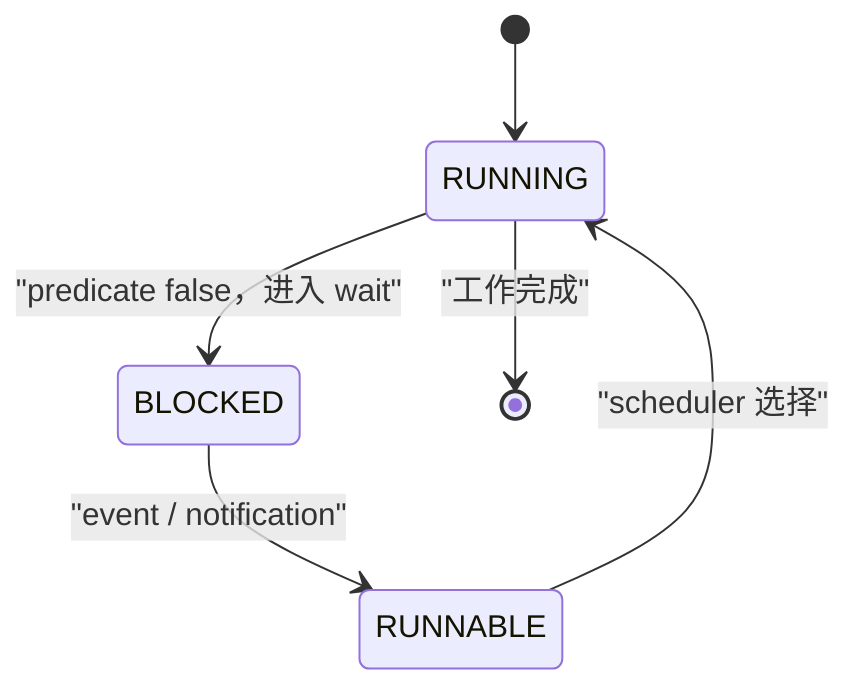
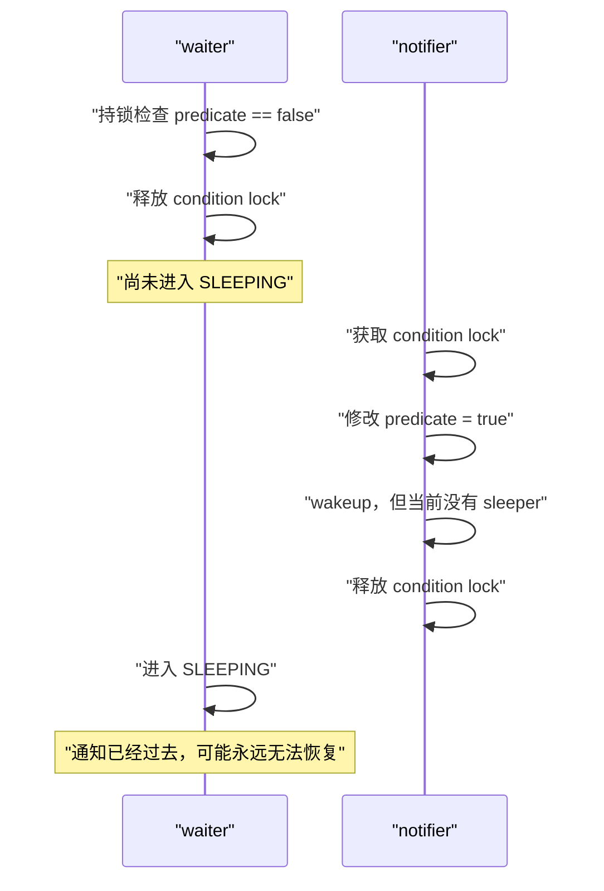
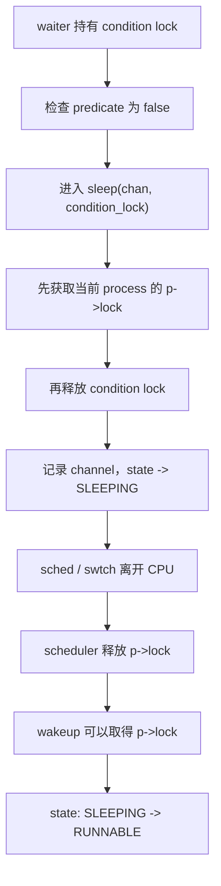

# Week5 Day7：没有数据时，reader 为什么应该睡眠，而不是一直循环？

> 今日定位：Week5 出口日。  
> 今日主线：`blocking -> sleep/wakeup -> lost wakeup -> condition_variable`。  
> 今日课程：MIT 6.S081 Lec13 `13.1~13.5`。  
> 今日实践：独立完成 `blocking_wakeup.cpp`，不提前实现完整 `BlockingQueue`。  
> 默认编译：`g++ -std=c++17 -Wall -Wextra -g -pthread`。

---

# Part 1：前情提要与必要术语

## 1. 前情提要

Day5 解决了：

```text
多个 threads 同时访问 shared state 时，
怎样使用 mutex 保护 invariant。
```

Day6 解决了：

```text
一个 thread 暂时不运行时，
怎样保存 context、交给 scheduler，
以后再恢复执行。
```

但是还有一个问题：

```text
如果 thread 现在根本没有工作可做，
它应该怎样等待？
```

例如 Week4 已经见过的 pipe：

```text
reader 调用 read
-> pipe buffer 当前为空
-> reader 需要等 writer 写入数据
```

reader 可以不断检查 pipe：

```text
有数据了吗？
没有。
有数据了吗？
没有。
有数据了吗？
没有。
```

这种做法会持续占用 CPU。

今天要建立的是另一条路径：

```text
条件暂时不满足
-> 当前 thread 阻塞并让出 CPU
-> 其他 execution flow 改变 shared state
-> 唤醒等待者
-> 等待者重新参与调度
-> 再次检查条件
```

Day5 的 mutex、Day6 的 scheduler/context switch，会在今天合到一起。

---

## 2. 今日真正要回答的问题

```text
1. blocking 和 busy waiting 有什么区别？
2. 一个 blocked thread 为什么不持续占用 CPU？
3. notify 已经发生，waiter 却随后永远睡下去，怎么可能？
4. 为什么“检查条件”和“进入等待”之间不能留下窗口？
5. 为什么 condition_variable 必须和 mutex、predicate 一起使用？
6. 为什么被 notify 后仍然必须重新检查 predicate？
7. xv6 sleep/wakeup 与 C++ condition_variable 的共同思想是什么？
```

今天不是背 API。核心是理解这一条 invariant：

> 对 predicate 的检查、修改，以及 waiter 进入等待的过程，必须由同一套同步关系连接起来，不能留下 lost-wakeup 窗口。

---

## 3. 必要术语

| 英文 | 中文 | 今天的实际作用 |
|---|---|---|
| block / blocking | 阻塞 | execution flow 暂时不能继续，等待某个条件或事件 |
| busy waiting | 忙等 | thread 一直循环检查条件，持续消耗 CPU |
| coordination | 协作 / 协调 | 不同 execution flows 围绕某个事件安排等待与继续 |
| condition | 条件 | 当前能否继续执行所依赖的 shared-state 事实 |
| predicate | 谓词 / 条件判断 | 读取 shared state 后得到 `true/false` 的判断 |
| condition variable | 条件变量 | 让 thread 等待 predicate 变化的同步对象 |
| notification | 通知 | 提醒等待者“shared state 可能变化了” |
| sleep channel | 睡眠通道 | xv6 用来匹配 sleep 与 wakeup 的标识 |
| lost wakeup | 丢失唤醒 | wakeup 发生时 waiter 尚未真正睡眠，之后 waiter 永久睡下去 |
| spurious wakeup | 虚假唤醒 | 没有对应业务条件成立，wait 也可能返回 |
| runnable | 可运行 | 已具备运行资格，等待 scheduler 分配 CPU |

### 3.1 `condition variable` 不是保存条件的变量

这个名字非常容易误导。

真正的 condition 通常保存在普通 shared state 中：

```text
ready == true
queue 不为空
pipe 中有数据
任务已经完成
程序正在关闭
```

`std::condition_variable` 本身不保存这些业务事实。

它更像：

```text
等待者集合 + 等待/通知机制
```

所以：

```text
predicate 才是事实
condition_variable 只是等待这个事实变化的工具
```

### 3.2 `predicate`

`predicate` 的英文原意是“可以判断真假的命题”。

在 C++ 中，它通常是一个返回 `bool` 的 callable object：

```text
ready 是否为 true？
buffer 是否非空？
任务队列是否非空，或者系统是否准备退出？
```

predicate 必须在保护相关 shared state 的 mutex 下检查。

### 3.3 `sleep` 不只表示“睡几秒”

你已经使用过：

```cpp
std::this_thread::sleep_for(...)
```

这是等待 timer 到期。

今天 xv6 的 `sleep` 和 C++ `condition_variable::wait` 更一般：

```text
等待某个事件或 shared-state condition 发生
```

两者都可能让 thread 暂时不占用 CPU，但唤醒原因不同：

```text
sleep_for：时间到期
condition_variable::wait：notification / spurious wakeup
xv6 sleep：对应 channel 上发生 wakeup
```

### 3.4 `lost wakeup` 与 `spurious wakeup` 不一样

```text
lost wakeup：
应该被看到的通知发生得太早，
waiter 随后进入等待，可能永远等下去。

spurious wakeup：
wait 返回了，但业务 predicate 并没有成立。
```

正确程序必须同时应对两者：

```text
用 shared predicate 保存事实
用同一 mutex 保护 predicate
wait 醒来后重新检查 predicate
```

### 3.5 spurious wakeup

`spurious` 意思是“虚假的、无明确原因的”。

线程在没有对应 `notify`、条件也没有真正成立的情况下，`wait()` 仍然返回，底层可能让其返回了！这才叫：

```
spurious wakeup
虚假唤醒
```

### 3.6 channel

`channel` 表示这个 execution flow 正在哪个“等候室”里等待。存储等候室编号。

---

## 4. 今日课程范围、顺序与停止位置

今天阅读：

1. [13.1 线程切换过程中锁的限制](https://mit-public-courses-cn-translatio.gitbook.io/mit6-s081/lec13-sleep-and-wakeup-robert/13.1-lock-limitation-during-thread-switching)
2. [13.2 Sleep&Wakeup 接口](https://mit-public-courses-cn-translatio.gitbook.io/mit6-s081/lec13-sleep-and-wakeup-robert/13.2-sleep-wakeup)
3. [13.3 Lost wakeup](https://mit-public-courses-cn-translatio.gitbook.io/mit6-s081/lec13-sleep-and-wakeup-robert/13.3-lost-wakeup)
4. [13.4 如何避免 Lost wakeup](https://mit-public-courses-cn-translatio.gitbook.io/mit6-s081/lec13-sleep-and-wakeup-robert/13.4-avoid-lock-wakeup)
5. [13.5 Pipe 中的 sleep 和 wakeup](https://mit-public-courses-cn-translatio.gitbook.io/mit6-s081/lec13-sleep-and-wakeup-robert/13.5-sleep-and-wakeup-in-pipe)

建议顺序：

```text
先读本教程第 5~11 节，建立完整因果链
-> 再按 13.1~13.5 顺序阅读课程
-> 每读一节，对照本教程对应小节
-> 最后独立完成 blocking_wakeup.cpp
```

今天停止：

```text
13.6 exit
13.7 wait
13.8 kill
```

这些进程生命周期实现以后再读，不在 Week5 出口日扩展。

---

# Part 2：教程主体

## 5. 教程开始：pipe 为空时，reader 应该怎么办？

假设：

```text
reader 想从 pipe 读取
pipe 当前为空
writer 可能一秒后写入，也可能很久以后才写入
```

reader 此刻没有办法完成读取。

### 5.1 方案一：busy waiting

reader 可以不断运行：

```text
lock
检查 pipe 是否非空
unlock
继续循环
```

问题是：

```text
条件没有成立
但 reader 仍然被 scheduler 安排运行
仍然执行 instruction
仍然消耗 CPU time
```

如果事件极快就会发生，短暂 spin 可能合理。

但 pipe、disk、network、child exit 等等待时间可能很长，持续 busy waiting 会浪费 CPU。

### 5.2 方案二：blocking

更合理的状态变化是：



注意：

```text
BLOCKED -> RUNNABLE
```

不等于：

```text
BLOCKED -> 立刻占有 CPU
```

唤醒只表示：

```text
这个 execution flow 重新具备运行资格
```

最终什么时候运行，仍由 scheduler 决定。

### 5.3 block 的是谁？

同一 process 中：

```text
一个 worker blocked
```

不代表：

```text
整个 process 的所有 threads 都停止
```

其他 threads 仍可运行，并且正是它们或外部 interrupt 改变了 waiter 所等待的状态。

---

## 6. 顺着课程 `13.1`：为什么 sleep 仍然受 context-switch 锁规则限制？

`13.1` 先复习 Day6，因为 sleep 最后也需要切换 execution flow。

### 6.1 第一条限制：切换期间持有 `p->lock`

一个 xv6 process 的 kernel thread 准备离开 CPU 时：

```text
获取 p->lock
-> 修改 process state
-> sched
-> swtch 到 per-CPU scheduler
-> scheduler 确认旧 kernel stack 已经停止使用
-> scheduler 释放 p->lock
```

这样可以防止另一个 CPU 的 scheduler 看到：

```text
p->state 已经可以运行
```

却没有看到：

```text
旧 CPU 仍在使用 p 的 kernel stack
```

否则两个 CPU 可能同时使用同一个 kernel stack。

### 6.2 第二条限制：切换时不能带着其他 spinlock 离开

课程给出的单核死锁可以概括为：

```text
P1 持有设备锁 L
-> P1 swtch 离开 CPU，但没有释放 L
-> scheduler 运行 P2
-> P2 尝试 acquire L
-> P2 一直 spin
-> P1 得不到 CPU，无法释放 L
```

此时：

```text
P2 等 P1 release
P1 等 scheduler 再次运行自己
但 CPU 被 P2 的 spin 占住
```

形成 deadlock。

所以 xv6 的 `sched()` 会检查：

```text
切换时必须持有 p->lock
不能还持有其他不允许跨切换保存的锁
```

### 6.3 和今天的连接

waiter 在等待期间必须允许 producer 或 interrupt handler 获取 condition lock。

但 waiter 进入 `SLEEPING` 状态又必须受 `p->lock` 保护。

于是 `sleep` 需要完成一次很谨慎的锁交接：

```text
condition lock
-> p->lock
```

这就是 `13.4` 的核心。

---

## 7. 顺着课程 `13.2`：sleep/wakeup 解决什么问题？

### 7.0 sleep wakeup

不是 scheduler 主动决定谁 `sleep`、谁 `wakeup`。

更准确地说：

```
sleep：由当前执行流自己调用
wakeup：由让等待条件发生变化的内核代码调用
scheduler：只负责选择 RUNNABLE 的执行流运行
```

**谁调用 sleep**

例如 pipe reader 发现 pipe 为空：

```
while (pipe_is_empty) {
    sleep(channel, &pipe_lock);
}
```

这是 reader 当前正在执行的内核代码调用 `sleep()`。

`sleep()` 大致会：

```
记录自己等待的 channel
把自己的状态改成 SLEEPING
调用 sched()
切换到 scheduler
```

也就是：

```
reader
  |
  | 发现条件不成立
  v
sleep(channel)
  |
  | state = SLEEPING
  v
sched()
  |
  v
scheduler
```

**谁调用 wakeup**

让条件发生变化的一方调用 `wakeup()`。

例如 pipe writer 写入数据：

```
write_data_to_pipe();
wakeup(channel);
```

或者磁盘完成 I/O 后：

```
磁盘产生中断
    |
    v
内核中断处理程序运行
    |
    v
wakeup(channel)
```

`wakeup()` 大致会：

```
找到 state == SLEEPING
并且 chan == channel 的执行流
    |
    v
把状态改成 RUNNABLE
```

它只是让执行流**有资格被调度**，不代表马上运行。

**scheduler 做什么**

scheduler 不负责调用一般意义上的 `wakeup()`，它只不断寻找：

```
p->state == RUNNABLE
```

然后选择一个执行：

```
wakeup
  |
  | SLEEPING -> RUNNABLE
  v
等待 scheduler 选择
  |
  v
RUNNING
```

因此完整分工是：

```
等待者：
检查 condition -> sleep -> SLEEPING

事件产生者：
改变 condition -> wakeup -> RUNNABLE

scheduler：
从 RUNNABLE 中选择一个 -> RUNNING
```

一句话记忆：

> `sleep/wakeup` 管理“现在能不能运行”，scheduler 管理“下一刻让谁运行”。

课程先列出三类等待：

```text
pipe reader 等待 pipe 非空
disk reader 等待设备完成 I/O
parent 等待 child exit
```

这些等待都有共同结构：

```text
当前 execution flow 无法让 condition 变成 true
必须等待另一个 execution flow 或 hardware event
```

### 7.1 UART 例子

课程使用 UART 输出说明：

```text
uartwrite 发送一个字符
-> UART hardware 需要时间
-> 当前还不能发送下一个字符
-> uartwrite sleep

UART 完成发送
-> hardware interrupt
-> uartintr 更新 tx_done
-> wakeup
-> uartwrite 以后恢复并尝试发送下一个字符
```

这里有三个不同角色：

| 角色 | 责任 |
|---|---|
| `tx_done` | 保存“UART 是否完成”的 shared-state 事实 |
| sleep channel | 标识 waiter 等待的是哪类事件 |
| `sleep/wakeup` | 让 waiter 离开 CPU，并在事件后重新变为 runnable |

### 7.2 channel 不是消息内容

xv6 的 channel 只用于匹配：

```text
谁在等待这个 channel？
这次 wakeup 要唤醒哪些 waiter？
```

它不会：

```text
保存 UART 字符
保存 pipe 数据
保证 condition 已经成立
把数据直接传给 waiter
```

真正的数据和 condition 仍在受锁保护的内核对象中。

---

## 8. 顺着课程 `13.3`：lost wakeup 到底丢在哪里？

lost wakeup 不是“wakeup 函数没有被调用”。

恰恰相反：

```text
wakeup 已经调用了，
但调用时还没有 waiter 处于可被唤醒的状态。
```

### 8.1 错误时间线

假设 waiter 使用一个错误的 `broken_sleep`：



危险窗口是：

```text
waiter 释放 condition lock
到
waiter 真正成为 SLEEPING
```

notifier 恰好在窗口内完成：

```text
修改 condition
调用 wakeup
```

这次 wakeup 没有“欠条”，不会自动留给未来才开始等待的 thread。

### 8.2 为什么只加锁还不够？

如果 waiter 一直持有 condition lock 睡眠：

```text
notifier 无法获取锁
-> notifier 无法修改 predicate
-> notifier 无法让 condition 成立
-> waiter 永远无法醒来
```

如果 waiter 在 sleep 前先普通地释放锁：

```text
释放锁
-> 真正睡眠
```

中间又出现 lost-wakeup 窗口。

所以我们需要的不是简单的：

```text
加锁
或者
解锁
```

而是：

> 让“释放 condition lock”和“把自己登记为等待者/进入阻塞”形成不可被 notifier 插入的同步关系。

---

## 9. 顺着课程 `13.4`：xv6 怎样消除窗口？

xv6 的接口包含：

```c
sleep(chan, lk)
```

其中：

```text
chan：sleep channel
lk：保护 predicate/shared state 的 condition lock
```

调用者检查 predicate 时已经持有 `lk`。

### 9.1 锁交接

`sleep` 的关键顺序是：



关键不是“两把锁永远一起持有”。

关键是整个过程中至少有一把锁挡住 notifier：

```text
检查 predicate 时：condition lock 挡住 notifier
释放 condition lock 前：先获得 p->lock
释放 condition lock 后：p->lock 挡住 wakeup 检查 process state
state 已经变成 SLEEPING 后：scheduler 才释放 p->lock
```

所以 notifier 不可能钻进：

```text
predicate 已检查为 false
但 waiter 还没有进入 SLEEPING
```

这个窗口。

### 9.2 醒来后为什么重新获得 condition lock？

这句话说的是 `sleep(channel, lock)` 对锁的处理过程。

先解释两个词：

```
condition lock：保护等待条件及相关共享数据的锁
predicate：判断条件是否成立的布尔表达式
```

例如 pipe reader 的 predicate 是：

```
pi->nread != pi->nwrite
```

意思是 pipe 中存在可以读取的数据。保护 `nread`、`nwrite` 和 pipe buffer 的锁，就是这里的 `condition lock`。

**为什么睡眠时要释放锁**

reader 进入 `sleep` 前持有 pipe lock：

```
acquire(&pi->lock);

while (pi->nread == pi->nwrite) {
    sleep(&pi->nread, &pi->lock);
}
```

如果 reader 睡着后仍然持有 `pi->lock`：

```
reader 持有 pipe lock 并睡眠
    |
    v
writer 想获得 pipe lock 写入数据
    |
    v
writer 拿不到锁
    |
    v
永远无法写入，也无法唤醒 reader
```

所以 `sleep()` 必须在睡眠前释放它。

**醒来后为什么重新获得锁**

完整流程是：

```
reader 持有 pi->lock
    |
    v
检查发现 pipe 为空
    |
    v
sleep(channel, &pi->lock)
    |
    +--> 设置自己为 SLEEPING
    +--> 释放 pi->lock
    +--> 调用 sched() 切走
    |
writer 获得 pi->lock
    |
    +--> 写入数据
    +--> wakeup(channel)
    +--> 释放 pi->lock
    |
reader 将来被 scheduler 恢复
    |
    v
sleep() 重新获得 pi->lock
    |
    v
sleep() 返回
    |
    v
reader 在锁保护下重新检查 pipe
```

注意，不是 scheduler 帮它拿锁，而是 execution flow 被恢复后，从之前暂停的 `sleep()` 里面继续执行；`sleep()` 在返回调用者之前执行：

```
acquire(&pi->lock);
```

**为什么醒来还要重新检查**

醒来后，拿到锁，重新检查 shared data

`wakeup` 只代表：

> 你等待的条件可能发生变化了，回来检查一下。

它不保证条件现在仍然成立。例如两个 reader 同时被唤醒：

```
writer 写入一个字符
    |
    v
reader A 和 reader B 都被唤醒
    |
    v
A 先获得锁，读取唯一的字符
    |
    v
B 后获得锁，此时 pipe 又空了
```

所以 B 必须重新检查：

```
while (pi->nread == pi->nwrite) {
    sleep(&pi->nread, &pi->lock);
}
```

而不能醒来后直接读。

整段话可以浓缩成：

> 睡眠时释放 condition lock，让其他执行流有机会改变 condition；醒来时重新获取锁，确保自己能安全地重新检查 condition。

---

## 10. 顺着课程 `13.5`：pipe 为什么必须循环检查？

现在回到 Week4 的 pipe。

xv6 `piperead` 等待的 predicate 可以写成：

```text
pipe 中存在尚未读取的数据
```

课程中使用计数关系表示：

```text
pi->nwrite > pi->nread
```

保护这个 predicate 的 condition lock 是：

```text
pi->lock
```

### 10.1 空 pipe 的路径

```text
piperead 持有 pi->lock
-> 检查 pipe 为空
-> sleep(channel, &pi->lock)
-> reader 阻塞

pipewrite 获取 pi->lock
-> 写入数据
-> 更新 pipe state
-> wakeup(channel)
-> reader 变为 RUNNABLE
```

### 10.2 为什么醒来后还要检查？

假设：

```text
两个 readers 都在等待
writer 只写入一个 byte
wakeup 唤醒两个 readers
```

可能发生：

```text
Reader A 先获得 pi->lock
-> 读走唯一 byte
-> pipe 再次为空
-> 释放 pi->lock

Reader B 后获得 pi->lock
-> 它确实被唤醒过
-> 但它需要的数据已被 Reader A 消耗
-> predicate 仍为 false
-> Reader B 必须继续 sleep
```

所以：

> wakeup 只说明“condition 可能发生变化”，不保证当前 thread 获得锁时 predicate 仍然为 true。

这也是为什么 wait 必须由循环或 predicate overload 包住。

### 10.3 连接 Week4 的阻塞 `read`

Week4 你看到的是用户态现象：

```text
read(pipe_read_fd, ...)
-> 没有数据时卡住
-> writer 写数据后 read 返回
```

今天补上内核机制：

```text
read system call
-> kernel piperead
-> predicate false
-> 当前 kernel execution flow sleep/sched
-> writer 改变 pipe state 并 wakeup
-> reader RUNNABLE
-> scheduler 恢复 reader
-> 重新检查 predicate
-> copy data 并从 read 返回 user mode
```

---

## 11. 映射到 C++ `std::condition_variable`

xv6 和 C++ 接口不同，但共同问题相同：

```text
怎样在等待 shared-state predicate 时释放 CPU，
同时避免检查 predicate 与进入等待之间丢失通知？
```

### 11.1 对照表

| xv6 | C++ | 共同含义 |
|---|---|---|
| condition lock | `std::mutex` | 保护 predicate 对应的 shared state |
| sleep channel | `std::condition_variable` object | 把同类 waiter 与 notification 联系起来 |
| `sleep(chan, lk)` | `cv.wait(lock, predicate)` | predicate 不成立时阻塞 |
| `wakeup(chan)` | `notify_one/notify_all` | 让 waiter 重新具备继续检查的机会 |
| `SLEEPING -> RUNNABLE` | blocked waiter 被唤醒 | 重新参与 scheduling |

不要把它理解成完全相同的源码实现。

```text
xv6：教学内核中的 sleep channel + process state
C++：标准库接口，底层通常借助 OS synchronization primitive
```

今天只比较机制，不深入 Linux futex。

### 11.2 为什么需要 `std::unique_lock`？

最小接口：

```cpp
#include <condition_variable>
#include <mutex>

std::mutex mutex;
std::condition_variable cv;

std::unique_lock<std::mutex> lock(mutex);
cv.wait(lock, predicate);
```

`unique_lock` 不是“唯一的一把 mutex”。

这里的 `unique` 表示：

```text
这个 lock object 在当前时刻独占管理 mutex ownership，
并且 ownership 可以在对象生命周期内 lock/unlock。
```

`wait` 必须：

```text
暂时 unlock mutex
-> 阻塞当前 thread
-> 醒来后重新 lock mutex
-> 再返回调用者
```

`std::lock_guard` 不提供这种可控的 unlock/relock 能力，所以不能传给 `std::condition_variable::wait`。

### 11.2.1 std::unique_lock 是啥？

你这里混淆的是：

```
mutex：锁对象本身
unique_lock：管理“当前线程是否持有这把锁”的对象
```

仅仅定义一个 mutex：

```
std::mutex mutex;
```

只是创建了一把锁，并不代表当前线程已经把它锁住。

这就像：

```
mutex       = 一把门锁
unique_lock = 当前拿钥匙并负责开关门的人
```

这行：

```
std::unique_lock<std::mutex> lock(mutex);
```

构造 `lock` 时会调用：

```
mutex.lock();
```

离开作用域时会自动调用：

```
mutex.unlock();
```

所以它是一个 **RAII** 锁管理器。

------

`cv` 是 `condition_variable`，即**条件变量**：

```
std::condition_variable cv;
```

这句：

```
cv.wait(lock, predicate);
```

大致等价于：

```
while (!predicate()) {
    cv.wait(lock);
}
```

完整行为是：

```
当前线程已经通过 unique_lock 持有 mutex
    |
    v
检查 predicate
    |
    +--> true：直接继续执行
    |
    +--> false：
            释放 mutex
            当前线程进入睡眠
            等待 notify
                |
                v
            被唤醒
            重新获得 mutex
            再次检查 predicate
```

为什么等待时必须释放 mutex？

假设 consumer 等待队列非空：

```
std::mutex mutex;
std::condition_variable cv;
std::queue<int> queue;
```

consumer：

```
std::unique_lock<std::mutex> lock(mutex);

cv.wait(lock, [&queue] {
    return !queue.empty();
});

int value = queue.front();
queue.pop();
```

producer：

```
{
    std::lock_guard<std::mutex> lock(mutex);
    queue.push(10);
}

cv.notify_one();
```

如果 consumer 睡眠时不释放 mutex：

```
consumer 持有 mutex 并睡眠
    |
producer 想拿 mutex 向 queue 写数据
    |
producer 拿不到 mutex
    |
queue 永远不会变成非空
```

因此 `cv.wait()` 必须能够：

```
释放 mutex
睡眠
醒来后重新获得 mutex
```

这也是它要求传入 `std::unique_lock`，而不是普通 `std::lock_guard` 的原因。`unique_lock` 支持显式 `lock()` 和 `unlock()`，条件变量可以控制它的锁状态。

可以把它和刚才 xv6 的模型对应起来：

```
std::mutex                 = condition lock
predicate                  = 等待条件
std::condition_variable cv = 等待者匹配/通知机制
cv.wait                    = 释放锁、sleep、醒来后重新拿锁
cv.notify_one/all          = wakeup
```

一句话记忆：

> `mutex` 保护共享数据，`unique_lock` 管理当前线程对 mutex 的持有状态，`cv.wait` 在条件不成立时临时释放锁并睡眠，醒来后重新拿锁检查条件。

### 11.3 `wait(lock, predicate)` 做了什么？

你现在可以把：

```cpp
cv.wait(lock, predicate);
```

理解为语义上的：

```text
while predicate == false:
    原子地释放 mutex 并进入等待
    醒来后重新获得 mutex

predicate == true 时才返回调用者
```

这里的“原子”不是说整个 wait 期间一直持有 mutex。

而是：

```text
释放 mutex
和
登记/进入 condition-variable wait
```

之间不会留下一个可导致 lost wakeup 的普通代码窗口。

### 11.3.1 为什么 xv6 前面有两把锁，C++ 这里只看到一把？

因为前面讲的是两个不同层次。

xv6 `sleep(chan, lk)` 的实现需要：

```text
condition lock lk：
    保护业务 predicate，例如 pipe 是否非空，比如 pipe lock

p->lock：
    保护 struct proc 中的 channel、state 和切换期间的 kernel stack invariant
```

xv6 必须在内核源码中亲自完成：

```text
持有 condition lock 检查 predicate
-> 获取 p->lock
-> 释放 condition lock
-> state = SLEEPING
-> sched / swtch
```

所以你能直接看到两把锁的交接。

C++ 调用者只需要提供一把保护业务 predicate 的 mutex：

```text
std::mutex mutex
```

`std::condition_variable::wait` 的标准接口负责：

```text
原子地释放这把 mutex 并进入 condition-variable wait
-> 被唤醒后重新获取这把 mutex
-> 再返回调用者

因为释放 mutex 跟 进入 wait 是这个 atomic 的，所以不存在 notifier 在这个时间 wakeup 但是 wakup 不到的情况！因为中间没有窗口可供 notifier 插入。
```

condition variable 和操作系统需要怎样维护 waiter、怎样阻塞 thread，是标准库/OS 实现内部的责任。内部不一定真的存在一把可以对应命名为 `p->lock` 的 mutex，今天不能凭接口假设具体实现。

从 C++ 调用者角度，不会出现普通窗口：

```text
waiter 持有 mutex 检查 predicate
-> predicate 为 false
-> waiter 调用 wait
-> wait 原子地完成 unlock + 进入等待
-> producer 才能获得 mutex 并修改 predicate
-> producer notify
```

所以：

```text
xv6 的两把锁：
    是教学内核实现 sleep/wakeup 时显式完成的锁交接

C++ 的一把用户 mutex：
    保护业务 predicate

condition_variable 的 wait contract：
    替调用者保证 unlock + wait 之间没有普通 lost-wakeup 窗口
```

不要记成：

```text
避免 lost wakeup 永远必须由业务代码手写两把 mutex
```

### 11.4 producer 应该怎样发布状态？

正确关系是：

```text
获取保护 predicate 的同一 mutex
-> 修改 shared state，使 predicate 可能变成 true
-> 释放 mutex
-> notify_one 或 notify_all
```

通知可以在释放 mutex 前或后调用；今天推荐修改状态后先释放锁再通知，避免刚唤醒的 waiter 立刻又阻塞在同一 mutex 上。

但是必须记住：

```text
正确性的核心是 shared predicate 在同一 mutex 下修改和检查，
不是 notify 调用本身替你保存了状态。
```

### 11.5 notification 没有业务记忆

如果：

```text
producer 只调用 notify_one
但没有修改任何 predicate
```

waiter 即使醒来，也会重新检查并继续等待。

如果 producer 在线程开始 wait 前已经：

```text
在 mutex 下把 ready 设置为 true
然后 notify
```

即使那次 notify 当时没有 waiter，后来运行的 waiter 也会看到：

```text
ready == true
```

并且根本不进入等待。

所以真正记住事件的是：

```text
ready / queue contents / closed 等 shared state
```

不是 `condition_variable`。

### 11.6 `notify_one` 与 `notify_all`

```text
notify_one：唤醒一个等待者参与竞争
notify_all：让所有等待者重新参与竞争
```

它们都不保证：

```text
被唤醒者立刻运行
被唤醒者一定最先拿到 mutex
predicate 对每个被唤醒者都成立
```

---

## 12. 四个必须会手推的时间线

### 12.1 waiter 先到

```text
waiter 获取 mutex
-> predicate false
-> wait 原子释放 mutex 并阻塞
-> producer 获取 mutex，修改 predicate
-> producer notify
-> waiter 被唤醒、重新获取 mutex
-> predicate true
-> wait 返回
```

### 12.2 producer 先到

```text
producer 获取 mutex
-> predicate = true
-> notify 时可能还没有 waiter
-> waiter 之后获取 mutex
-> 检查 predicate == true
-> 不进入 wait
```

这不是 lost wakeup，因为业务状态已经被 predicate 保存。

### 12.3 notify 了，但没有修改 predicate

```text
waiter 被唤醒
-> 重新获取 mutex
-> predicate 仍然 false
-> 继续等待
```

notification 不是数据，也不是 condition 本身。

### 12.4 多个 waiter 被唤醒

```text
多个 waiters 变为 runnable
-> 只有一个先拿到 mutex
-> 它可能消耗掉唯一资源
-> 后续 waiter 拿到 mutex
-> predicate 已经再次为 false
-> 继续等待
```

---

## 13. 最容易混淆的点

### 错误 1：blocked thread 还在不断检查 condition

不是。

busy-wait thread 才会持续执行检查。

blocked thread 暂时不运行，等待被唤醒后重新进入 runnable 状态。

### 错误 2：notify 就是把数据发给 waiter

不是。

数据存放在 shared state 中；notify 只是提醒 waiter 重新检查。

### 错误 3：被 notify 就代表 predicate 一定成立

不代表。

可能是 spurious wakeup，也可能 condition 已被别的 waiter 消耗。

### 错误 4：先检查，再普通 unlock，再调用 wait 就行

这会在：

```text
unlock
和
真正 wait
```

之间留下 lost-wakeup 窗口。

### 错误 5：condition_variable 可以代替 mutex

不可以。

mutex 保护 shared predicate；condition_variable 管理等待和通知。两者责任不同。

### 错误 6：wait 返回时 mutex 仍然是释放状态

不是。

`wait` 返回调用者前已经重新获得 `unique_lock` 管理的 mutex。

### 错误 7：notify_one 让 thread 立刻 RUNNING

不是。

它最多让 waiter 重新具备参与调度和竞争 mutex 的机会。

### 错误 8：sleep/wakeup 与 sleep_for 是同一个机制

不是。

前者围绕事件/predicate 协调，后者围绕 timer 到期。

---

# Part 3：收尾、独立实践与验收

## 14. 今日独立实践：`blocking_wakeup.cpp`

这是小型组合练习，不提供完整 thread function、完整锁顺序或参考实现。

### 14.1 问题背景

实现一个最小的一次性数据发布：

```text
一个 worker 等待数据 ready
main thread 负责产生一个 value
worker 在没有数据时必须阻塞，不能 busy wait
数据发布后 worker 被唤醒，读取 value，然后退出
main 最后 join worker
```

### 14.2 必须存在的 shared state

至少包含：

```text
一个 value
一个表示 value 是否 ready 的 bool predicate
一个 mutex
一个 condition_variable
```

你自己决定：

```text
它们放在 main 的局部作用域
还是放进一个简单 struct
```

今天不要求封装成 class。

### 14.3 核心行为要求

```text
worker 通过 condition_variable wait，不写轮询循环
predicate 的所有读写由同一 mutex 保护
producer 先更新 shared state，再 notification
worker 醒来后以 predicate 为准，不以“收到通知”为准
main 对 worker 正常 join
程序零 warning
```

不要为了凑工程复杂度增加：

```text
完整 BlockingQueue
多个 producer/consumer
atomic
semaphore
future/promise
graceful shutdown protocol
```

### 14.4 允许查阅的最小接口

```cpp
std::thread
std::thread::join

std::mutex
std::unique_lock<std::mutex>
std::lock_guard<std::mutex>

std::condition_variable
cv.wait(lock, predicate)
cv.notify_one()
cv.notify_all()

std::this_thread::sleep_for
```

需要的 headers：

```cpp
#include <chrono>
#include <condition_variable>
#include <iostream>
#include <mutex>
#include <thread>
```

### 14.5 必做测试

#### 测试 1：waiter 明显先到

让 producer 延迟约一秒再发布数据。

观察：

```text
worker 没有刷屏
等待期间 CPU 没有被一个轮询循环持续占用
producer 发布后 worker 正常完成
```

#### 测试 2：producer 尽可能早地发布

去掉人为延迟，多运行几次。

即使 producer 在 worker 真正 wait 前完成发布，程序也不能挂住：

```text
worker 应通过 predicate 看到数据已经 ready
```

#### 测试 3：重复运行

使用测试 2 的无延迟版本：

```bash
for i in $(seq 1 100); do
    timeout 3s ./blocking_wakeup >/dev/null || exit 1
done
```

命令含义：

```text
seq 1 100：产生 1 到 100
timeout 3s：单次运行超过 3 秒就判失败
>/dev/null：本测试只关心是否完成，不保留正常输出
|| exit 1：任意一次失败就停止
```

如果测试通过，最后一条命令退出状态应为 `0`。

### 14.6 可选 Linux 观察

在 producer 延迟较长的版本中：

```bash
./blocking_wakeup &
pid=$!
ps -L -p "$pid" -o pid,tid,psr,stat,comm
wait "$pid"
```

重点只观察：

```text
process 中存在 main + worker
等待期间 worker 不需要 busy loop
STAT 可能显示 sleeping 类状态
被唤醒后程序正常退出
```

`STAT` 是采样瞬间状态，不把一次 `S` 当成完整机制证明。

---

## 15. Week5 总机制图

在 `week5_note.md` 中独立画一张 Mermaid `flowchart`。

必须包含这些节点：

```text
user instruction
trap
trapframe
kernel
page table / PTE
page fault handler
mutex / invariant
timer interrupt
context
scheduler
SLEEPING/BLOCKED
RUNNABLE
wakeup/notify
predicate
```

图必须表达至少四条关系：

```text
1. VA translation 或 page fault 怎样进入内核处理
2. user state 与 kernel context 分别保存在哪里
3. timer interrupt 怎样给 scheduler 重新取得控制权的机会
4. predicate false 的 execution flow 怎样 sleep，并在 event 后恢复
```

不要追求把所有名词塞成一条直线。先区分：

```text
memory translation 路径
trap 路径
scheduling 路径
coordination 路径
```

再画它们的连接点。

---

## 16. 编译

```bash
g++ -std=c++17 -Wall -Wextra -g -pthread \
    blocking_wakeup.cpp -o blocking_wakeup
```

普通运行：

```bash
./blocking_wakeup
echo $?
```

核心要求：

```text
零 warning
不 hang
不 busy wait
value 正确
所有 threads 正常 join
```

---

## 17. `week5_note.md` 最小内容

只记录今天真正新增和 Week5 出口需要保留的内容：

```text
1. blocking 与 busy waiting 的区别
2. RUNNING -> BLOCKED -> RUNNABLE -> RUNNING 状态图
3. lost wakeup 的错误时间线
4. xv6 condition lock -> p->lock 的锁交接
5. xv6 sleep/wakeup 与 C++ condition_variable 对照
6. blocking_wakeup.cpp 的预测、实际结果与测试证据
7. Week5 总机制图
8. 验收问题答案
```

已经在 Day1~Day6 note 中证明过的内容，不要求重新抄写。

---

## 18. 验收问题

### 问题 1

busy waiting 与 blocking 分别是什么？为什么长期等待 pipe、disk 或 network event 时通常不应 busy wait？

### 问题 2

一个 blocked thread 被 notify/wakeup 后，为什么通常先进入 `RUNNABLE`，而不是立刻变成 `RUNNING`？

### 问题 3

请手推一次 lost wakeup：从 waiter 检查 predicate 为 false 开始，到 notifier 的通知被错过，再到 waiter 永久睡下去。

### 问题 4

为什么 predicate 的检查和修改必须由同一 mutex 保护？`wait` 为什么必须把“释放 mutex”和“进入等待”连接成一个不可插入普通 notifier 的过程？

### 问题 5

为什么 `condition_variable::wait` 使用 `unique_lock`，而不是你 Day5 常用的 `lock_guard`？

### 问题 6

为什么 wait 被唤醒后还要重新检查 predicate？至少给出两个原因。

### 问题 7

`notify_one` 做了什么？它不保证什么？为什么说 notification 不是数据，也不保存业务事实？

### 问题 8

在 xv6 `sleep(chan, lk)` 中，为什么不能一直持有 condition lock 睡眠？为什么又不能先普通释放 condition lock、稍后再进入 SLEEPING？`p->lock` 在中间解决了什么问题？

---

## 19. 今日通过标准

### 核心通过

```text
完成 Lec13 13.1~13.5，并能沿课程顺序讲清楚
能解释 blocking 为什么不持续占用 CPU
能完整手推 lost wakeup
能解释 predicate + mutex + wait 的关系
能解释 notification 不等于 condition 成立
能解释醒来后为什么重新检查 predicate
独立完成 blocking_wakeup.cpp
规定参数零 warning，两个时序测试和重复测试通过
完成 Week5 总机制图
```

### 非阻塞增强

```text
使用 ps -L 观察 blocked worker
了解 condition_variable 底层可能使用 futex
比较 notify_one 与 notify_all 的性能
扩展成多个 producer/consumer
```

非阻塞增强没有完成，不影响 Day7 和 Week5 核心验收。

---

## 20. 今天不要扩展

```text
不读 Lec13 13.6~13.8
不实现完整 BlockingQueue
不实现 ThreadPool
不深入 futex 源码
不深入 semaphore
不进入 lock-free
不学习复杂 atomic memory order
```

这些内容会在后续并发与线程池阶段展开。

---

## 21. 今日一句话

> mutex 保护 predicate，wait 在 predicate 不成立时原子地释放锁并阻塞，notify 只提醒 waiter 重新检查；真正避免 lost wakeup 的，是 shared state、mutex 与等待过程共同建立的同步关系。

---

## 22. 下一步

Day7 通过后：

```text
Week5 OS 第一轮出口验收
-> 根据总规划生成 Week6
-> 继续沿 Linux / OS 主线推进
```

不会因为今天接触了 `condition_variable`，就提前跳到完整线程池。

---

## 参考资料

- [MIT 6.S081 Lec13 Sleep & Wake up](https://mit-public-courses-cn-translatio.gitbook.io/mit6-s081/lec13-sleep-and-wakeup-robert)
- [13.1 线程切换过程中锁的限制](https://mit-public-courses-cn-translatio.gitbook.io/mit6-s081/lec13-sleep-and-wakeup-robert/13.1-lock-limitation-during-thread-switching)
- [13.2 Sleep&Wakeup 接口](https://mit-public-courses-cn-translatio.gitbook.io/mit6-s081/lec13-sleep-and-wakeup-robert/13.2-sleep-wakeup)
- [13.3 Lost wakeup](https://mit-public-courses-cn-translatio.gitbook.io/mit6-s081/lec13-sleep-and-wakeup-robert/13.3-lost-wakeup)
- [13.4 如何避免 Lost wakeup](https://mit-public-courses-cn-translatio.gitbook.io/mit6-s081/lec13-sleep-and-wakeup-robert/13.4-avoid-lock-wakeup)
- [13.5 Pipe 中的 sleep 和 wakeup](https://mit-public-courses-cn-translatio.gitbook.io/mit6-s081/lec13-sleep-and-wakeup-robert/13.5-sleep-and-wakeup-in-pipe)
- [cppreference: std::condition_variable](https://en.cppreference.com/w/cpp/thread/condition_variable)
