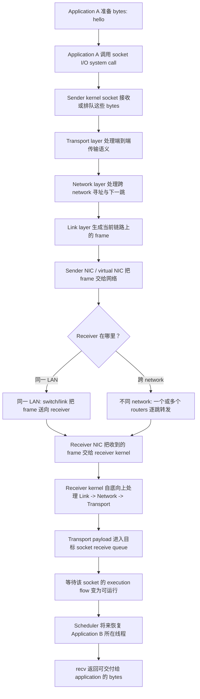
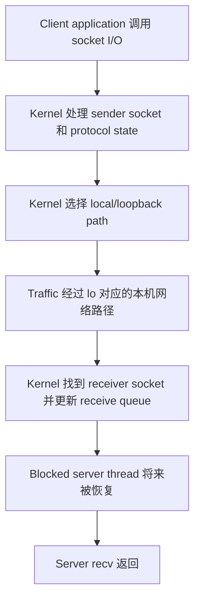
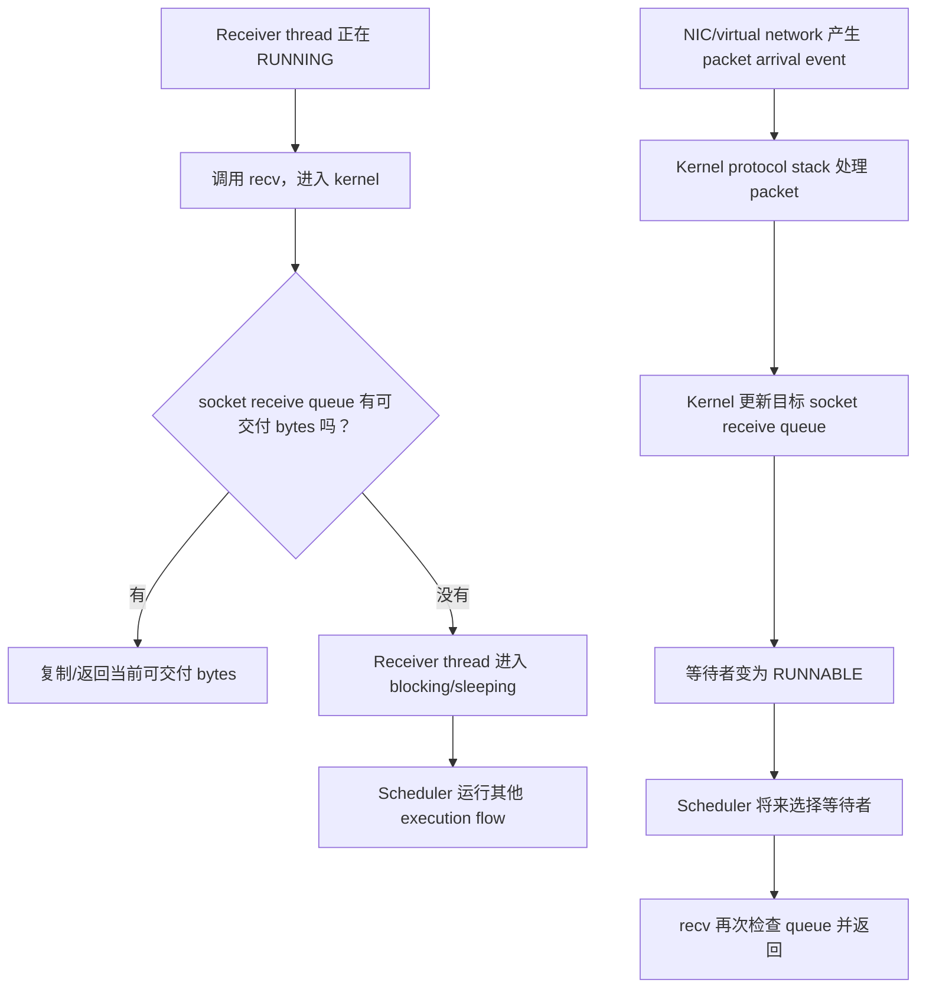
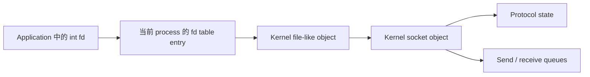

# Week6 Day1：从“send 出去”到另一端“recv 返回”

> 今日定位：网络原理第一轮的入口。  
> 今日类型：概念机制日 + Linux 最小观察。  
> 今日核心问题：一个应用程序交给 kernel 的 bytes，怎样跨过本机、网络和对端 kernel，最后让另一个应用程序的 `recv` 返回？  
> 今日不写 C++ demo。现有 Linux 工具已经足以观察今天的新对象，不为了产出数量制造重复代码。

---

# Part 1：前情提要与必要术语

## 1. 从 Week5 接到 Week6

Week5 已经建立：

```text
application 调用 system call
-> control flow 进入 kernel
-> kernel 访问或等待某个资源
-> 条件暂时不满足时，当前 execution flow 可以 blocking/sleeping
-> 条件将来满足后，execution flow 先变为 RUNNABLE
-> scheduler 将来选择它
-> system call 返回，application 继续
```

当时常用的 kernel resource 是：

```text
普通文件
pipe
process/thread state
```

Week6 增加一种新的 kernel resource：

```text
socket
```

因此今天不是把 Week5 推倒重来，而是把旧模型延伸：

```text
process 中的 fd
-> kernel socket object
-> protocol state / send queue / receive queue
-> local network stack
-> network
-> peer network stack
-> peer socket receive queue
-> peer application
```

今天只建立这条总路径。`socket()`、`bind()`、`listen()`、`accept()` 和 `connect()` 的参数与代码从 Day3、Day4 开始学习。

---

## 2. 今日场景

先假设通信所需的地址和连接已经准备好：

```text
Application A 调用 send，提交 bytes "hello"
Application B 正阻塞在 recv，等待 bytes
```

问题不是：

```text
send 和 recv 怎么调用？
```

而是：

```text
send 接收 bytes 以后，谁接手？
bytes 在每一层以什么形式存在？
谁决定下一步交给哪里？
远端 kernel 收到后放在哪里？
为什么 blocked receiver 将来能够继续？
```

Day2 再回答地址、route、MAC、IP 和 port；Day4、Day5 再回答 TCP API 与收发边界。

---

## 3. 必要术语

### 3.1 network

`network`：网络。

在当前上下文中，它是一组相互连接、能够交换信息的 nodes，以及连接这些 nodes 的通信路径和规则。

计算机网络中的 nodes 可以包括：

```text
host
router
switch
```

它不只是“一根网线”，也不只是“互联网”。

记忆：

```text
network = nodes + links + communication rules
```

### 3.2 host

`host`：主机。

当前可以把它理解为运行 application 和 operating system、参与网络通信的计算机。

例如：

```text
你的 Ubuntu 虚拟机是一台 host
运行 HTTP server 的服务器也是一台 host
```

`host` 不是 application。一个 host 上可以同时运行许多 applications。

### 3.3 LAN

`LAN = Local Area Network`：局域网。

它连接一个相对局部范围内的 hosts，例如同一间实验室、宿舍、家庭或组织中的一段网络。

LAN 不等于“只能有一根线”。它可以通过：

```text
Ethernet switch
Wi-Fi access point
virtual network
```

把 hosts 连接起来。

### 3.4 packet

`packet`：网络包。

今天把它作为“网络中传递的一块结构化数据”的通用称呼。它通常包含：

```text
protocol metadata
+ payload
```

更精确的名字取决于所在层：

```text
TCP segment
UDP datagram
IP packet / IP datagram
Ethernet frame
```

所以 `packet` 不是永远对应一个固定 C++ struct，也不保证对应 application 的一次 `send`。

### 3.5 protocol

`protocol`：协议。

协议是一组通信规则，规定参与者怎样解释收到的 bits/bytes，例如：

```text
哪些 bytes 是 header
header 中各字段表示什么
payload 从哪里开始
收到特定信息后下一步做什么
```

它不是某一个函数，也不只是一个数据格式；协议通常同时包含 message format 和 behavior rules。

### 3.6 layer

`layer`：层。

网络系统把不同责任分成多层。上层使用下层提供的 service，而不需要知道下层全部实现细节。

当前使用四层模型：

```text
Application
Transport
Network
Link
```

这里的“层”是职责和协议边界，不意味着每一层一定由一个独立 process 或 thread 运行。

### 3.7 protocol stack

`protocol stack`：协议栈。

`stack` 在这里表示多层 protocol 按层次组合，不是 C++ function call stack，也不是 thread stack。

Linux kernel 中的 networking code 共同实现了多层协议处理，所以通常称为 network protocol stack。

记忆：

```text
protocol stack = 按层协作的一组网络协议实现
```

### 3.8 encapsulation / decapsulation

`encapsulation`：封装。

发送方向上，下层把上层交来的内容视为 payload，并添加本层需要的 metadata/header。

`decapsulation`：解封装。

接收方向上，本层检查并处理自己的 metadata/header，再把 payload 交给上层。

它们不代表 application data 被“加密”了；封装和加密不是同一个概念。

### 3.9 NIC

`NIC = Network Interface Controller`：网络接口控制器。

有时也会看到 `Network Interface Card`，因为它过去常是一张独立网卡。当前更准确地把 NIC 理解为负责主机与网络链路交换 frame 的硬件或虚拟设备。

你的 Ubuntu 是虚拟机，`ens33` 是 guest OS 看见的 network interface，背后通常对应 virtual NIC，而不是 Ubuntu 直接控制宿主机的物理网卡。

### 3.10 switch

`switch`：交换机。

当前只需要知道：它连接同一 LAN 中的 devices，并帮助 link-layer frame 到达相应端口。

它不等于 router。switch 的精确转发依据留到 Day2 的 Ethernet 层。

### 3.11 router / routing

`router`：路由器。

它连接不同 networks，并根据 network-layer address 等信息决定 packet 的下一跳。

`routing`：路由或选路。

在当前上下文中，它表示为 packet 选择后续路径并逐跳转发的过程。

router 不一定一次就把 packet 直接送到最终 host；远距离通信通常会经过多个 routers。

### 3.12 loopback

`loopback`：回环。

它表示把本机产生的 network traffic 交回本机 network stack。IPv4 中最常见的 loopback address 是：

```text
127.0.0.1
```

Linux 中通常由 `lo` 这个 software network interface 承担。

loopback 不是“完全绕过 kernel 直接复制 application memory”。application 仍使用 socket/system call，kernel 仍处理本机网络路径；只是 traffic 通常不离开主机，也不经过物理 NIC、switch 或 router。

### 3.13 socket

`socket`：套接字。

当前把它理解为 operating system 提供的网络通信 endpoint abstraction。application 通常通过一个 fd 访问 kernel 中的 socket state 和 queues。

第一层关系：

```text
fd number
-> process fd table entry
-> kernel file/socket-related object
-> protocol state and queues
```

socket 不等于 fd number：

```text
fd 是当前 process 使用的整数入口
socket 是 kernel 中被这个入口引用的网络通信对象
```

socket 也不总等于一条 TCP connection。UDP socket、listening socket 和 connected socket 的具体区别后面再学。

### 3.14 frame

你的直觉基本对：`frame` 在这里确实可以理解成一个**有固定结构、装着信息的框**，中文叫“帧”。

但它不是 software framework，而是 **Link Layer（链路层）在一段链路上传输的数据单位**。

以 Ethernet frame 为例：

```
[ 目标 MAC | 来源 MAC | 类型 | payload | 校验信息 ]
```

其中 payload 里面通常装的是整个 IP packet：

```
Ethernet frame
┌────────────────────────────────────────────┐
│ Ethernet header                            │
│   ┌────────────────────────────────────┐   │
│   │ IP packet                          │   │
│   │   ┌────────────────────────────┐   │   │
│   │   │ TCP segment / UDP datagram │   │   │
│   │   │   application bytes        │   │   │
│   │   └────────────────────────────┘   │   │
│   └────────────────────────────────────┘   │
│ Ethernet trailer                          │
└────────────────────────────────────────────┘
```

它和 `packet` 的核心区别是层级：

```
frame：Link Layer 的传输单位，例如 Ethernet frame
packet：通常指 Network Layer 的 IP packet，也常被泛指为网络包
```

而且 frame 通常只负责**当前一跳**：

```
Host A -> Router：使用一份 Ethernet frame
Router -> Router：重新生成下一跳的 frame
Router -> Host B：再生成另一份 frame
```

每一跳的来源/目标 MAC 可能改变，而里面承载的 IP packet 仍然朝最终目标 IP 前进。

一句话记忆：

```
frame 是链路层当前一跳使用的“结构化运输外壳”，里面通常装着 IP packet。
```

### 3.15 Ethernet

**Annotation 1**

不完全等同。准确说：

```
LAN（Local Area Network）：
一种局部范围的网络

Ethernet（以太网）：
构建有线 LAN 时常用的链路层技术和协议
```

关系类似：

```
局域网是“网络范围/组织形式”
以太网是“实现这种局域网的一种技术”
```

LAN 还可以使用其他技术，例如：

```
有线 LAN：常使用 Ethernet
无线 LAN：常使用 Wi-Fi
虚拟机 LAN：可以使用 virtual switch
```

Ethernet frame 通常只在当前局域链路或二层网络内传递。跨越 router 后，旧 Ethernet frame 会被移除，router 为下一段链路重新封装新的 frame。

所以可以先记：

```s
以太网常用于构建局域网，但以太网不等于局域网。
```

### 3.16 peer

`peer`：通信对端、另一端。

### 3.17 blocking/sleeping

```
blocking：execution flow 当前没办法继续向下执行，必须等待某个条件或事件。
sleeping 表示“kernel 当前把这个 execution flow 放在等待状态”；

receive queue 为空
-> recv 无法继续，因此 blocking
-> kernel 把 thread 放入 sleeping/waiting 状态
-> thread 不再占用 CPU
```

---

# Part 2：教程主体

## 4. 教程开始：`send("hello")` 之后，谁接手

今天用一条完整路径先看全局：



这是一张责任图，不是说每个方框都对应一个独立 thread，也不是说每层之间一定完整复制一次内存。

先压缩成一句：

```text
sender application 把 bytes 交给 sender kernel
-> sender protocol stack 逐层封装并发出
-> network 把 packet/frame 逐跳送到 receiver
-> receiver protocol stack 逐层解封装并找到目标 socket
-> bytes 进入 receive queue
-> blocked receiver 将来被恢复
-> recv 返回
```

下面按这条路径拆解。

---

## 5. 第一步：application 交出的只是 bytes

假设 Application A 有：

```text
hello
```

在 application memory 中，它只是若干 bytes。

application 调用 `send` 时，第一件真正发生的事不是“远端已经收到了”，而是：

```text
Application A 发起 system call
-> kernel 检查 fd、memory range、socket state 等
-> kernel 接收本次调用提交的 bytes，或把它们加入后续发送路径
-> send 按当前调用结果返回
```

必须分开三件事：

```text
1. application 把 bytes 交给 local kernel
2. local kernel/network 把数据送向 peer
3. peer application 的 recv 真正取得 bytes
```

`send` 成功不自动证明第 3 步已经完成。

今天不深入 `send` 的精确返回值；Day5 会专门处理 partial send。

---

## 6. 第二步：为什么要分层

如果 application 必须自己完成：

```text
识别网卡
控制交换机
选择 router
处理跨 network address
处理丢失、顺序或分段
理解每一种物理链路
```

每个 application 都会与硬件和网络拓扑强耦合。

分层把问题拆开：

| Layer | 当前主要问题 | 典型 protocol/example | 今天不负责什么 |
|---|---|---|---|
| Application | bytes 对业务表示什么 | HTTP、DNS | 不直接控制 router |
| Transport | 两端 applications 怎样获得传输服务 | TCP、UDP | 不决定每一跳的物理设备 |
| Network | packet 怎样跨 networks 到达目标 host | IP | 不解释 HTTP request |
| Link | frame 怎样完成当前 link/下一跳交付 | Ethernet、Wi-Fi | 不负责完整互联网路径 |

发送方向：

```text
Application
-> Transport
-> Network
-> Link
```

接收方向：

```text
Link
-> Network
-> Transport
-> Application
```

分层的价值不是“层越多越高级”，而是：

```text
每层处理一组相对稳定的责任
上层依赖下层 service
下层不必理解上层业务语义
某一层实现可以在接口保持稳定时替换
```

例如 application 可以使用 socket API 发送数据，而不需要知道当前 host 最终通过 Ethernet cable、Wi-Fi 还是虚拟网络离开。

---

## 7. 第三步：封装不是把同一名字反复套娃

用 `hello` 建立概念图：

```text
Application data:
    [ hello ]

Transport layer:
    [ transport header | hello ]

Network layer:
    [ IP header | transport header | hello ]

Link layer:
    [ link header | IP header | transport header | hello | link trailer ]
```

从某层向下看：

```text
本层添加的 header = 本层控制信息
上层交来的全部内容 = 本层 payload
```

接收方执行相反方向：

```text
Link layer 检查/移除 link metadata
-> Network layer 检查/移除 IP metadata
-> Transport layer 检查/处理 transport metadata
-> Application 得到可交付的 bytes
```

这就是 encapsulation 与 decapsulation。

### 7.1 不同层的数据名称

当前记到这个程度：

| 所在层 | 常见名称 | 中文 | 当前含义 |
|---|---|---|---|
| Application | data / message | 数据 / 消息 | application 自己定义的业务数据 |
| TCP transport | segment | TCP 报文段 | TCP header 加上这一段 payload |
| UDP transport | datagram | UDP 数据报| UDP 保留的一条 datagram |
| IP network | packet / datagram | IP 分组 / IP 数据报 / IP 包 | IP header 加上 transport 内容 |
| Ethernet link | frame | 以太网帧 | Ethernet 在当前 LAN/link 上传递的单位 |

日常交流中很多人会把它们统称为 packet。只要讨论具体机制时能指出所在层，就不必为了名词争论。

### 7.2 一个必须提前避免的误解

不能推出：

```text
application send 一次
= 一个 TCP segment
= 一个 IP packet
= 一个 Ethernet frame
= receiver recv 一次
```

实际系统可以分段、合并、重传或按不同大小交付。今天只建立层次；TCP byte stream 的收发边界在 Day5 处理。

---

## 8. 顺着 MIT 6.S081 Lec21.1：先看网络拓扑，再看 packet

课程页面：

[MIT 6.S081 Lec21.1 计算机网络概述](https://mit-public-courses-cn-translatio.gitbook.io/mit6-s081/lec21-networking-robert/21.1-ji-suan-ji-wang-luo-gai-shu)

### 8.1 课程从什么问题开始

Lec21 的目标是讨论：

```text
Networking 与 operating system 的关系
OS 中 networking software 的大致结构
network driver 与后续 Receive Livelock 问题
```

但 Week6 Day1 只取第一步：网络拓扑和 packet path 的入口。

今天不要进入：

```text
xv6 network driver lab
DMA ring
Receive Livelock
```

### 8.2 相近 hosts 先组成一个 LAN

课程先画最简单的场景：

```text
Host A
Host B
Host C
```

它们通过某种 local network device 连接。底层设备可能是：

```text
cable
Ethernet switch
Wi-Fi device
virtual switch
```

课程强调：设计上层 networking software 时，很多底层差异会被协议和 interface abstraction 屏蔽。

所以 browser 和 HTTP server 关心的是：

```text
我怎样向 peer 发送 application data？
```

而不是：

```text
当前每一个电信号怎样编码？
交换机内部每个端口怎样工作？
```

### 8.3 为什么不能把全世界 hosts 都放进一个 LAN

直觉可以从 **broadcast（广播）** 入手。

假设一个 LAN 里有 3 台主机：

```
A、B、C
```

A 发出一条广播：

```
“局域网里的所有人都听一下”
```

那么：

```
A 发出 broadcast
-> B 收到并检查
-> C 收到并检查
```

即使这条广播最终只和 B 有关，C 也必须先接收、检查，然后判断“与我无关”。

当 LAN 里有 10,000 台主机时：

```
一台主机发送一条 broadcast
-> 其余大量主机都可能收到并处理
```

而且不是只有一台主机广播：

```
Host A 广播
Host B 广播
Host C 广播
...
```

主机数量增加后，问题包括：

```
广播流量越来越多
每台主机都要处理更多无关 packet
switch 需要学习和维护更多 MAC address
故障或异常广播影响范围更大
安全和管理更加困难
物理连接、端口数量和链路范围也有限
```

可以把它想象成一个群聊：

```
20 人群：
@所有人 的影响不大

100,000 人群：
每个人偶尔 @所有人
-> 所有人不断收到与自己无关的消息
```

因此大型网络会被拆成多个 LAN：

```
LAN A ─┐
LAN B ─┼─ Router ─ 其他 networks
LAN C ─┘
```

Router 会隔开 LAN 的广播范围。LAN A 中的普通 broadcast 通常不会被 Router 直接转发到 LAN B 和 LAN C。

还要注意一个边界：

```
不是 LAN 中的所有 packet 都会发给所有 hosts
```

现代 Ethernet switch 会定向转发普通 unicast frame；主要的扩张问题之一是 **broadcast domain 不能无限扩大**，再加上管理、故障范围和设备容量等限制。

一句话记忆：

```
单个 LAN 越大，一个局部广播或故障需要影响的主机就越多，所以大型网络要用 Router/VLAN 拆成多个较小的网络。
```

### 8.4 routers 把不同 networks 连接起来

课程使用类似：

```text
MIT LAN
Harvard LAN
Stanford LAN
```

的例子。

MIT 中某个 host 要和 Stanford 中某个 host 通信，路径可能是：

```text
MIT host
-> MIT local network
-> router
-> intermediate routers/networks
-> Stanford local network
-> Stanford host
```

router 收到 packet 后，要回答：

```text
这个 packet 的目标属于哪里？
下一步应该交给哪一条 path / next hop？
```

这就是 routing 问题的入口。

### 8.5 Lec21.1 在哪里停止

21.1 最后只建立：

```text
Ethernet 处理 LAN 范围的通信
Internet Protocol 处理 networks 之间的寻址与转发
packet 会在 hosts 和 routers 中被 software 处理
```

课程接下来才进入 packet structure 和 Ethernet。

所以今天阅读到页面结尾就停止。不要提前进入 `21.2 Ethernet`；那是 Day2。

### 8.6 课程内容与今天补充内容的边界

课程 21.1 直接建立：

```text
host
LAN
router
routing
Ethernet 与 IP 的第一层范围
```

今天教程为了让你能回答标题中的 `send -> recv`，额外补上：

```text
Application / Transport / Network / Link 四层责任
encapsulation / decapsulation
socket receive queue
Week5 blocking/scheduler 与 network event 的连接
Linux ip/ss 观察
```

不能把这些补充都冒充成 21.1 原文。

---

## 9. 三种路径必须分开

### 9.1 情况一：peer 就在同一 host

例如：

```text
client 连接 127.0.0.1 上的 server
```

路径可以压缩为：



保持精确：

```text
不会经过物理 NIC
不会经过外部 switch
不会经过外部 router
仍会进入 kernel networking path
仍然需要 socket state 和 protocol processing
```

### 9.2 情况二：peer 在同一 LAN

简化路径：

```text
sender application
-> sender kernel protocol stack
-> sender NIC
-> local link / switch
-> receiver NIC
-> receiver kernel protocol stack
-> receiver application
```

通常不需要 router 转发到另一个 network，但 link layer 仍要知道当前 frame 交给谁。Day2 会通过 MAC 和 ARP 解释。

### 9.3 情况三：peer 在另一个 network

简化路径：

```text
sender application
-> sender kernel
-> sender NIC
-> local network
-> local router/default gateway
-> zero or more intermediate routers
-> remote network
-> receiver NIC
-> receiver kernel
-> receiver application
```

必须注意：

```text
end-to-end 目标是 remote host/application
但 link-layer frame 每一跳只处理当前 link 的交付
router 负责在 networks 之间继续转发
```

Day2 再解释：

```text
MAC address
IP address
subnet/prefix 第一层
ARP
route 与 next hop
```

---

## 10. 接收端：data 与 wakeup 不是一回事

假设 Application B 已调用 `recv`，而 socket receive queue 当前为空。

Week5 的等待模型可以直接复用：

```text
Application B thread 调用 recv
-> kernel 检查目标 socket receive queue
-> 当前没有可交付 bytes
-> 当前 execution flow blocking/sleeping
-> scheduler 让其他 RUNNABLE execution flow 使用 CPU
```

之后 network event 到达：

```text
receiver NIC / virtual network 把 frame 交给 kernel
-> kernel network stack 处理 Link / Network / Transport
-> kernel 找到目标 socket
-> kernel 把可交付 data 放入 socket receive queue
-> 等待这个条件的 execution flow 获得被唤醒的机会
-> 它先变为 RUNNABLE
-> scheduler 将来选择它
-> recv 重新检查并从 queue 取得 bytes
-> recv 返回 Application B
```

用一张完整状态图连接 Week5：



这里三层对象仍然存在：

```text
data:
    socket receive queue 中可交付给 application 的 bytes

condition/predicate:
    receive queue 是否有可交付 bytes，或是否出现 EOF/error 等终止条件

wakeup/scheduling effect:
    让等待者有机会从 blocked/sleeping 走向 RUNNABLE
```

所以：

```text
packet arrival / queue update 才改变业务事实
wakeup 不替 socket 保存 bytes
scheduler 也不解析 application data
```

Linux 内核的具体等待队列、NIC interrupt/polling 和 driver path 今天不展开。当前只建立跨层责任。

---

## 11. socket fd 与 Week4 fd 模型怎样连接

普通文件曾使用：

```text
fd
-> process fd table entry
-> kernel file-related object
-> inode/file resource
```

socket 可以沿用相同的 application interface 风格：



这里的重点：

```text
fd number 仍然只属于当前 process 的入口编号
kernel 通过 fd 找到对应 socket resource
socket object 可以包含或关联 protocol state 和 queues
read/write/close 风格的 Unix I/O abstraction 因而可以扩展到网络
```

但 socket 与 regular file 的语义不完全相同：

```text
regular file 常有 persistent file content 和 file offset
socket 表示通信 endpoint，内容来自或流向 peer
socket 的可读/可写条件与 protocol state、queues 和 peer 行为有关
```

不能因为两者都使用 fd，就认为它们背后的 resource 完全相同。

---

## 12. Linux 观察一：当前 host 有哪些 network interfaces

### 12.1 命令

完整信息：

```bash
ip address
```

简洁信息：

```bash
ip -brief address
```

`ip address` 的官方用途是显示或管理附着在 network device 上的 IPv4/IPv6 protocol addresses。今天只做 show，不执行 add、delete 或 flush。

### 12.2 当前 Ubuntu 的实际输出

本教程生成时，Ubuntu `192.168.56.129` 的简洁输出为：

```text
lo       UNKNOWN  127.0.0.1/8 ::1/128
ens33    UP       192.168.56.129/24 fe80::.../64
```

输出会随环境变化，不要求逐字一致。

当前只读出：

```text
lo:
    loopback interface
    IPv4 127.0.0.1
    traffic 留在本机网络路径

ens33:
    Ubuntu VM 看见的 network interface
    状态 UP
    IPv4 192.168.56.129/24
    对虚拟机而言，它通常由 virtual NIC 支撑
```

`UNKNOWN` 不表示 `lo` 坏了。loopback 没有普通 physical link carrier，operational state 的表达与 Ethernet device 不同。

### 12.3 这条命令证明了什么

直接证据：

```text
kernel 当前有哪些 network interfaces
interfaces 配置了哪些 protocol addresses
interface 当前展示的状态
```

它没有直接展示：

```text
某个 packet 实际经过哪些 routers
socket receive queue 中有哪些 bytes
Ethernet/IP header 的具体内容
remote host 是否已经收到 application data
```

---

## 13. Linux 观察二：kernel 当前知道哪些 route

### 13.1 命令

```bash
ip route
```

`route` 在这里是 kernel routing table entry。`ip route` 显示 main routing table 中的 routes。

### 13.2 当前 Ubuntu 的代表性输出

```text
default via 192.168.56.2 dev ens33 proto dhcp metric 100
192.168.56.0/24 dev ens33 proto kernel scope link src 192.168.56.129 metric 100
```

当前只解释第一层：

```text
192.168.56.0/24 dev ens33:
    目标属于这个 local network prefix 时，可从 ens33 走向当前 link

default via 192.168.56.2 dev ens33:
    没有更具体 route 匹配时，使用 default route
    下一跳是 192.168.56.2
    从 ens33 发出
```

`via`：经过某个 next-hop address。  
`dev`：使用哪个 network device/interface。  
`src`：kernel 为该 route 倾向选择的 source address。  
`metric`：多个候选 routes 之间使用的度量信息之一。

Day1 不要求计算 `/24`，也不展开 longest-prefix match；Day2 再学。

### 13.3 这条命令证明了什么

直接证据：

```text
kernel main routing table 当前有哪些 entries
哪些 destination prefixes 关联到哪个 interface/next hop
```

它没有直接证明：

```text
某一个 live packet 已经发出
router 后面的完整互联网路径
目标 host 一定在线
packet 一定不会丢失
```

route 是 kernel 作出发送决策时使用的 state，不是 packet 的运行日志。

---

## 14. Linux 观察三：当前有哪些 TCP/UDP sockets

### 14.1 命令

```bash
ss -lntup
```

`ss`：Linux 用于查看 socket statistics/state 的工具。

选项：

```text
-l = listening
-n = numeric，不把 address/port 转成名称
-t = TCP
-u = UDP
-p = process information
```

普通用户可能看不到所有 process details；需要完整 process 信息时可以再使用：

```bash
sudo ss -lntup
```

### 14.2 当前 Ubuntu 中可以看到的代表

```text
tcp LISTEN ... 0.0.0.0:22 ...
tcp LISTEN ... 127.0.0.1:<port> ...
udp UNCONN ... 127.0.0.53:53 ...
```

今天只读出：

```text
0.0.0.0:22:
    某个 TCP listening socket 接受发往本机任意 IPv4 interface 的 port 22 traffic
    你的 SSH server 使用这个入口

127.0.0.1:<port>:
    只绑定在 IPv4 loopback
    外部 host 不能直接通过本机非-loopback address 使用这一 binding

127.0.0.53:53:
    本机 loopback 上的 DNS stub/resolver 相关 socket
    DNS 细节留到 Day3

UDP UNCONN:
    UDP 没有 TCP 那种 LISTEN/ESTABLISHED connection state
    UNCONN 不表示 socket 损坏
```

`port` 今天只理解为 transport layer 用来区分 host 内通信 endpoint/service 的数字。Day2、Day3 再精确展开。

### 14.3 `Recv-Q` 与 `Send-Q` 今天怎样看

只建立方向：

```text
Recv-Q:
    与当前 socket 尚未被 application 取走或尚待处理的接收状态有关

Send-Q:
    与尚待发送/确认或 listening backlog 等 socket 类型相关状态有关
```

这些列的精确含义会随 socket protocol 和 state 不同，不能把所有行机械解释成“还有多少 application bytes”。今天不据此猜内部细节。

### 14.4 这条命令证明了什么

直接证据：

```text
kernel 当前存在某些 TCP/UDP sockets
它们的 local address/port 和当前 state
权限允许时，它们属于哪个 process
```

它没有直接展示：

```text
application source code
完整 packet header
packet 经过的 routers
socket queue 中每个 byte 的内容
send 与 recv 之间的完整时间线
```

---

## 15. 把三个工具合起来

三个命令分别观察不同 state：

| 命令 | 观察的主要对象 | 不能替代什么 |
|---|---|---|
| `ip -brief address` | network interface 与 protocol address | 不显示 socket |
| `ip route` | kernel routing table | 不显示 live packet |
| `ss -lntup` | socket state | 不显示完整 route 或 packet path |

合起来可以形成：

```text
ens33 配置了 192.168.56.129
-> routing table 指示 local prefix 与 default gateway
-> ss 显示 applications/kernel services 当前创建的 sockets
```

但它们仍然只是 control state 的观察，不是抓包。

今天不使用 `tcpdump`，因为 Day1 不需要直接分析 frame/header；Day6 再选择性观察 TCP handshake。

---

## 16. 常见混淆

### 16.1 Internet 不等于 Web

`Internet` 是互联网络与相关协议体系。  
`Web` 是运行在网络之上的 application/service 体系，常使用 HTTP。

browser 和 HTTP server 是 applications，不是 Internet 本身。

### 16.2 host 不等于 application

```text
host:
    运行 OS 的主机

application:
    host 上运行的一个 program/process
```

一个 host 可以同时运行 SSH server、DNS resolver、browser 和自己的 TCP server。

### 16.3 switch 不等于 router

当前最小区别：

```text
switch:
    主要连接同一 LAN/link 中的 devices

router:
    连接不同 networks，参与 network-layer forwarding
```

具体 MAC/IP 依据明天解释。

### 16.4 packet 不等于 application message

application 定义自己的 message。protocol stack 可以把 bytes 分段、封装或重组。

所以不能通过“我 send 了一次”推断 network 上只有一个 packet。

### 16.5 layer 不等于独立 process

四层模型表达 responsibility boundary。实际 Linux kernel 中，多个协议处理步骤可能在同一 execution context 中通过函数调用继续，也可能涉及 queues、softirq 等机制。

Day1 不展开 Linux 内核执行上下文。

### 16.6 localhost 不等于跳过 networking

loopback traffic 通常不经过 physical NIC 和 external network，但仍由 local kernel networking path 处理。

所以：

```text
localhost 很快
```

不能推导成：

```text
localhost 完全没有 socket、protocol 或 kernel 工作
```

### 16.7 `send` 返回不等于 peer `recv` 已返回

`send` 首先描述 local call 的结果。远端交付还涉及：

```text
local protocol processing
network delivery
peer protocol processing
peer socket state
peer execution flow scheduling
```

精确 TCP 保证与 failure boundary 后续学习。

---

## 17. 今日压缩记忆

第一句话：

```text
网络把 hosts 和 networks 连接起来；LAN 负责局部连接，router 把多个 networks 连接成更大的互联网。
```

第二句话：

```text
application bytes 经 Transport -> Network -> Link 逐层封装发送，在 receiver 端反向解封装并进入目标 socket queue。
```

第三句话：

```text
receive queue 的 data 到达后，blocked receiver 只是先获得 RUNNABLE 的机会，仍要等 scheduler 恢复，recv 才能返回。
```

---

# Part 3：收尾、验证与验收

## 18. 今日学习顺序

按下面顺序完成：

```text
1. 先读本教程 Part 1 和 Part 2，建立主干
2. 阅读 MIT 6.S081 Lec21.1
3. 读到页面结尾“接下来介绍 packet 结构”就停止
4. 回到 Ubuntu 执行三个观察命令
5. 在 day1_note.md 画自己的完整流程图
6. 回答验收问题
```

课程阅读目标不是记住原文句子，而是确认你能沿课程顺序解释：

```text
相近 hosts -> LAN
单个 LAN 不能无限扩张
多个 LANs/networks -> routers
remote communication -> routing
LAN 第一层协议范围 -> Ethernet
跨 networks 第一层协议范围 -> IP
```

---

## 19. 必做观察

### 19.1 Interface

```bash
ip -brief address
```

在 note 中记录：

```text
哪个是 loopback interface
哪个是 Ubuntu 实际对外使用的 interface
两者各自的 IPv4 address
```

### 19.2 Route

```bash
ip route
```

在 note 中记录：

```text
local network prefix 对应哪个 dev
default route 的 next hop 是谁
```

不需要手算 subnet。

### 19.3 Socket

```bash
ss -lntup
```

选择两个代表：

```text
一个 TCP LISTEN socket
一个 UDP UNCONN socket
```

记录：

```text
Netid
State
Local Address:Port
它绑定 loopback、所有 local IPv4 interfaces，还是 IPv6
```

只保留代表例子，不机械抄完整输出。

---

## 20. Day1 note 要求

在：

```text
C:\Users\FxorG\Desktop\gpt_infra\week6\day1\day1_note.md
```

由你自己记录：

```text
1. 一张 send -> peer recv 的完整 flowchart
2. lo 与 ens33 的实际观察
3. local route 与 default route 的实际观察
4. 一个 TCP socket 和一个 UDP socket 的代表
5. 验收问题答案
6. 今天真正卡住的问题
```

流程图至少出现这些 actor/object：

```text
sender application
sender kernel socket
sender protocol stack
NIC / link / routers
receiver protocol stack
receiver socket receive queue
blocked receiver
scheduler
receiver application
```

不要照抄本教程的 Mermaid。需要按自己的理解重组。

---

## 21. 验收问题

### 问题 1

MIT 6.S081 Lec21.1 为什么先从多个 LAN 和 router 讲起？为什么不把全世界所有 hosts 放进一个巨大 LAN？

### 问题 2

Application、Transport、Network、Link 四层分别解决什么问题？为什么“层”不等于四个独立 processes？

### 问题 3

从 sender application 调用 `send` 开始，到 receiver application 的 `recv` 返回为止，按真实执行主体讲完整路径。

### 问题 4

receiver socket 暂时没有 data 时，`recv` 为什么可以阻塞而不持续 busy wait？packet 到达后，data、wakeup 和 scheduler 分别做什么？

### 问题 5

访问 `127.0.0.1` 时，哪些 external devices 通常不会经过？为什么又不能说它完全绕过 kernel networking？

### 问题 6

application message、TCP segment/UDP datagram、IP packet 和 Ethernet frame 分别属于哪一层？为什么一次 `send` 不能直接等同于一个 packet？

### 问题 7

`ip address`、`ip route`、`ss` 分别直接展示什么？各自不能证明什么？

---

## 22. 今日通过标准

核心通过：

```text
能解释 host、LAN、router、routing 的关系
能画出四层发送与接收方向
能解释 encapsulation / decapsulation
能区分 application data 与各层 packet/frame
能把 socket receive queue 接到 Week5 blocking/scheduler 模型
能解释 localhost 与 remote path 的不同
完成 ip address / ip route / ss 三组观察
验收问题能用自己的话回答
```

今天不会因为以下内容未完成而阻塞：

```text
没有写 C++ 网络程序
不会背 Ethernet/IP header
不会计算复杂 subnet
不会写 socket API
没有抓 tcpdump
没有学习 TCP handshake
没有阅读 Lec21.2 之后的内容
```

真正不通过的表现：

```text
只会说“send 后数据通过网络到对面”
无法指出 sender kernel、protocol layers、NIC/router、receiver queue 的责任
把 host、process、socket、fd 混成同一个对象
认为 loopback 完全不经过 kernel
把 wakeup 当成 socket data
把 ip/route/ss 输出当成实际 packet trace
```

---

## 23. 今天停止在哪里

今天到此为止：

```text
host / LAN / router / routing
四层网络模型
encapsulation / decapsulation
send -> network -> receive queue -> recv 的总路径
loopback、same-LAN、cross-network 三种路径
ip address / ip route / ss 第一层观察
```

明确后置：

```text
Day2:
    Ethernet、MAC、ARP、IP、prefix、route、next hop、network byte order

Day3:
    UDP、DNS、sendto/recvfrom

Day4:
    socket/bind/listen/accept 与 TCP server

Day5:
    connect、TCP byte stream、partial send/recv、EOF

Day6:
    handshake、close、TCP states、reliability

Day7:
    HTTP request framing 与 parser
```

---

## 24. 资料

- [MIT 6.S081 Lec21.1 计算机网络概述](https://mit-public-courses-cn-translatio.gitbook.io/mit6-s081/lec21-networking-robert/21.1-ji-suan-ji-wang-luo-gai-shu)
- [MIT 6.S081 2020 Course Schedule: Lec21 Networking](https://pdos.csail.mit.edu/6.S081/2020/schedule.html)
- [MIT 6.S081 Networking Slides](https://pdos.csail.mit.edu/6.S081/2019/lec/l-networking.pdf)
- [Linux `ip-address(8)` manual page](https://man7.org/linux/man-pages/man8/ip-address.8.html)
- [Linux `ip-route(8)` manual page](https://man7.org/linux/man-pages/man8/ip-route.8.html)
- [Linux `ss(8)` manual page](https://man7.org/linux/man-pages/man8/ss.8.html)
