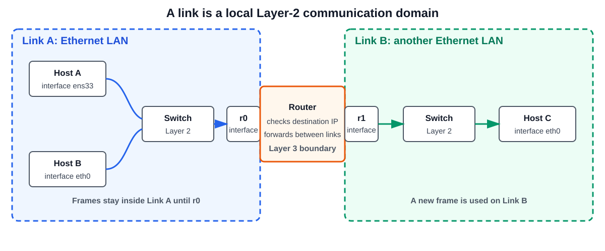
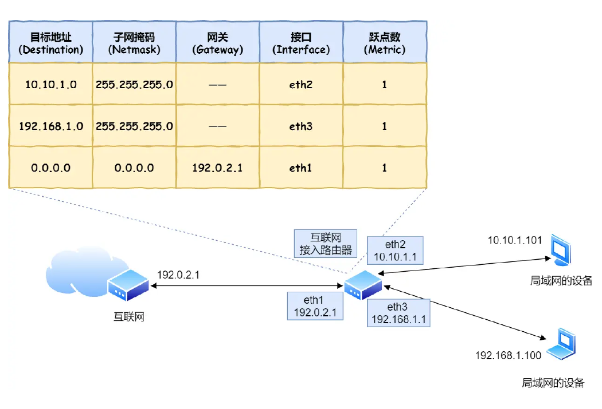
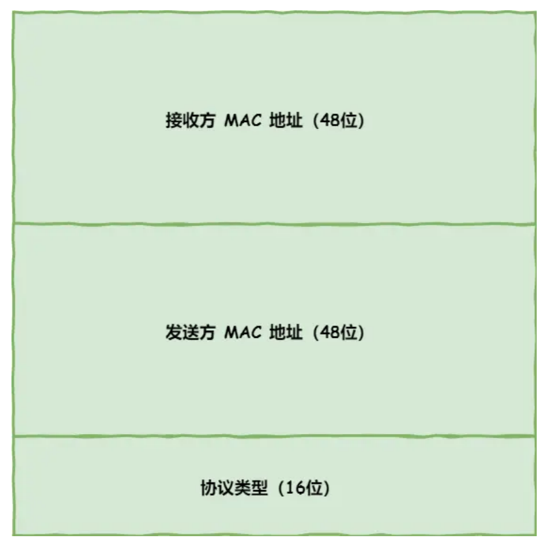
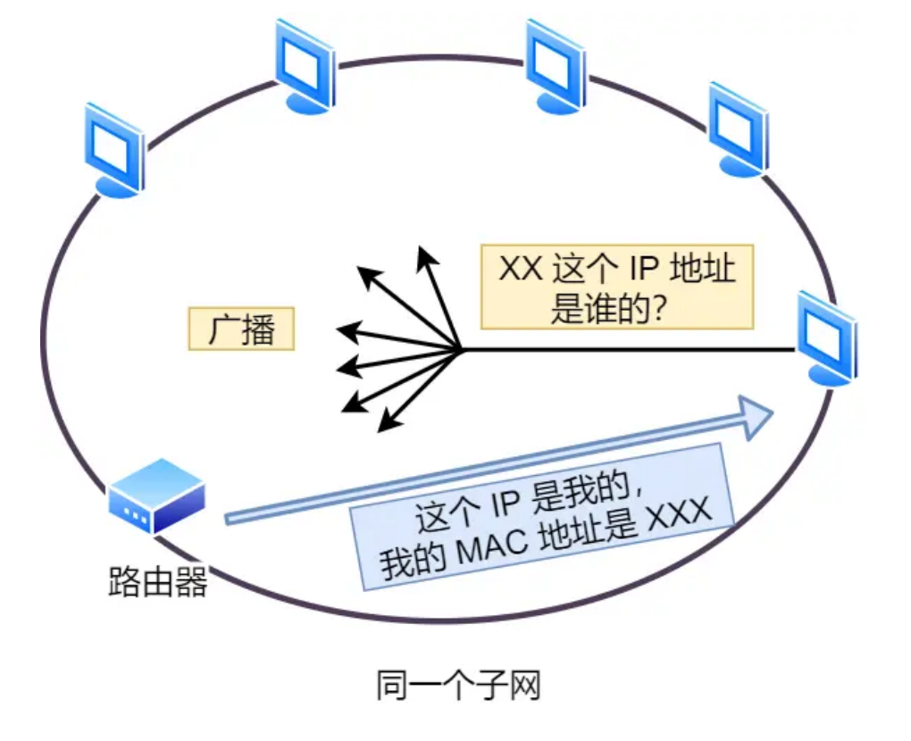
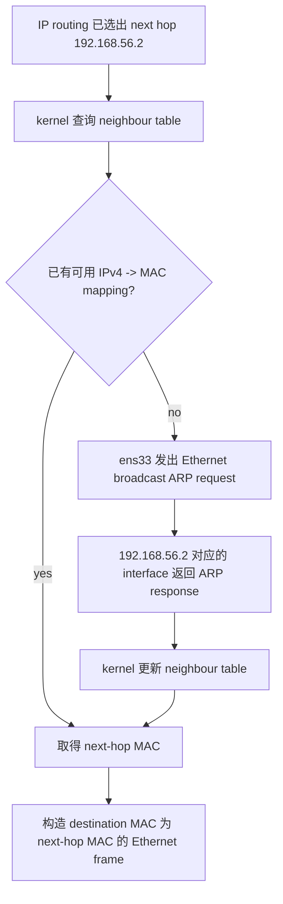
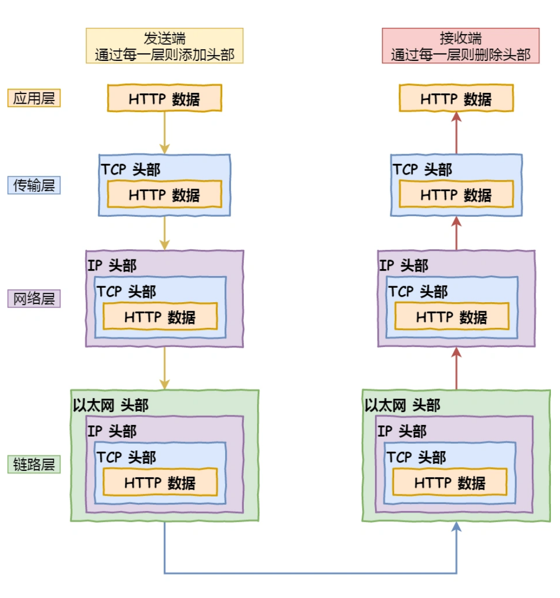
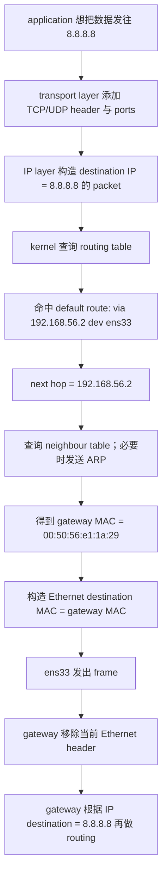
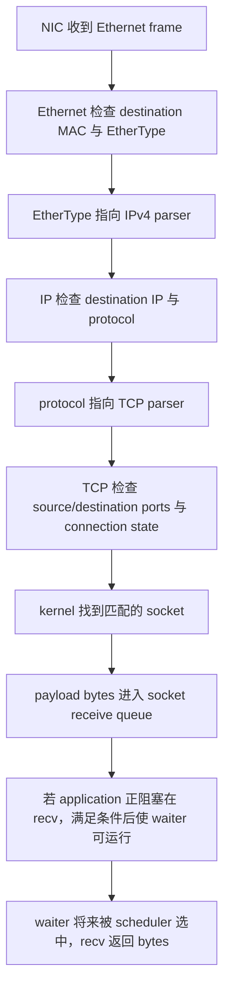

# Week6 Day2：地址不是一个东西，路由也不是“直接找到目标”

> 今日定位：Day1 已经建立 application -> transport -> network -> link 的端到端总图。今天不重复画一张抽象大图，而是追问一个更具体的问题：
>
> 今日类型：概念机制日 + 地址表示小练习 + Linux route/neighbour 观察。
>
> MIT 6.S081 范围：Lec21 `21.2 Ethernet`、`21.3 ARP`、`21.4 Internet`。
>
> ```text
> Ubuntu 已经知道 remote IPv4 address，
> 为什么真正发送 Ethernet frame 前，还需要另一个 MAC address？
> ```
>
> 今天沿着 MIT 6.S081 Lec21 的 `21.2 -> 21.3 -> 21.4` 顺序，建立：
>
> ```text
> Ethernet 当前链路交付
> -> ARP 查询下一跳 MAC
> -> IP routing 选择下一跳
> -> port 把到达主机的数据交给 transport endpoint
> -> network byte order 统一多字节整数的传输顺序
> ```
>
> 阅读顺序：
>
> ```text
> 先完成 Part 1 的术语对齐
> -> 顺着 Part 2 的 21.2 / 21.3 / 21.4 中文讲解建立因果链
> -> 再阅读课程原文对应三节
> -> 回来完成实际 route/neighbour 观察和 address_demo.cpp
> ```
>
> 课程听到以下程度即可：
>
> ```text
> 能解释 Ethernet frame 三个核心 header fields
> 能解释 ARP request/response 解决的问题
> 能解释 IP header 为什么跨 hops 保留，而 link-layer header 每跳重建
> 能把 nested headers 与 Day1 的 encapsulation/decapsulation 接起来
> ```
>
> 今天不背完整 Ethernet、ARP、IPv4 header，也不进入复杂 subnetting 或 router forwarding algorithm。

---

# Part 1：前情提要与必要术语

## 1. 从 Day1 接过来的已有认识

Day1 已经建立：

```text
sender application
-> socket system call
-> transport protocol
-> IP
-> link layer
-> network
-> peer link layer
-> peer IP
-> peer transport protocol
-> peer socket receive queue
-> peer application
```

也已经知道：

```text
发送方向逐层添加 header，称为 encapsulation
接收方向逐层检查并移除 header，称为 decapsulation
blocking recv 没有数据时，当前 execution flow 可以睡眠
数据进入 socket receive queue 后，kernel 才有条件唤醒 waiter
```

但这张总图仍留下了几个具体问题：

```text
1. link layer 到底怎样找到当前这一跳的接收者？
2. IP address 已经表示目标，为什么还需要 MAC address？
3. remote host 不在同一 LAN，ARP 到底查询谁？
4. packet 到达目标主机后，怎样继续找到正确的 socket？
5. 端口 8080 在内存和网络线路中为什么可能呈现不同 byte sequence？
```

今天只解决这些问题，不进入 TCP connection 和 server API。

---

## 2. 今天先抓住四种不同的“标识”

| 标识 | 当前层次的作用 | 作用范围 | 它不是什么 |
|---|---|---|---|
| MAC address | 标识当前 link 上 Ethernet frame 的 source/destination interface | 当前链路的一跳 | 不是跨互联网的完整路线 |
| IPv4 address | 标识 IP 网络中的 source/destination，并供 router 查路由 | 跨网络 | 不是进程编号 |
| port | 让 TCP/UDP 在一台 host 内找到 transport endpoint | 目标 host 的 transport layer | 不是 fd，也不能单独唯一表示一条 TCP connection |
| fd | 当前 process 访问某个 kernel object 的本地整数句柄 | 当前进程 | 不会作为网络地址发给远端 |

先压缩成一句：

```text
MAC 管当前一跳，IP 管跨网络目的地，port 管目标主机里的 transport endpoint，
fd 只管当前进程怎样访问本机 kernel object。
```

---

## 3. 必要术语

### 3.1 NIC

`NIC`：`Network Interface Card`，网络接口卡。

当前可以把它理解为：

```text
host 与某条网络链路之间的接口
```

Linux 中的 `ens33` 是一个 network interface。它有：

```text
link-layer address，也就是 MAC address
network-layer address，也就是本机配置的 IPv4/IPv6 address
```

它不一定真是一张独立插在主板上的物理卡。虚拟机中的虚拟网卡也会作为 NIC/interface 出现在操作系统里。

### 3.2 link

`link`：链路。

今天在 Ethernet / IP 的上下文里，把它理解为：

```text
一组处于同一个二层通信范围内的 interfaces；
它们不需要经过 IP router 转发，就能通过当前 link-layer protocol 互相交付 frame
```

这里的“直接”不是指两台 hosts 之间必须只有一根线。中间可以有 Ethernet switch；只要不需要 router 把 IP packet 从一个 network 转发到另一个 network，它们仍然可以属于同一个 link。



读图重点：

```text
Link A：
    Host A 的 ens33
    Host B 的 eth0
    router 的 r0
    这些 interfaces 可以在当前 link 内交换 Ethernet frames

Link B：
    router 的 r1
    Host C 的 eth0
    它们属于另一组二层通信范围
```

router 整台设备同时连接两个 links，但它的两个 interfaces 分别属于不同的 link。Host A 要把 IP packet 发给 Host C 时，需要经历：

```text
Link A：Host A -> router 的 r0
router：检查 IP destination，执行三层转发
Link B：router 的 r1 -> Host C
```

因此，你说的“与当前 host 有边相连的 nodes”可以作为第一层图论直觉，但要修正两点：

```text
1. 图中的点更适合看成 interface，而不是整台 host。
2. link 更像一个允许多个 interfaces 二层直达的局部区域，
   不一定只是两个 nodes 之间的一条 point-to-point edge。
```

在 point-to-point link 中，确实可以近似画成两个 interfaces 之间的一条边；在常见 Ethernet LAN 中，一个 link 往往包含多个 hosts、switch ports 和一个或多个 router interfaces。

最后压缩成一句：

> `link` 是一次 Ethernet frame 能在不经过 IP router 转发的情况下活动的局部二层范围，不是“整个互联网”，也不等于固定的一根网线。

### 3.3 hop

`hop`：一跳。

一次 hop 是：

```text
当前 interface
-> 当前 link
-> 下一个 host/router interface
```

remote host 可能需要经过多个 routers，因此会经历多跳。

### 3.4 Ethernet

`Ethernet`：以太网，一类 link-layer protocol。

它负责在当前 Ethernet link 上传输 `frame`，不负责为整个互联网计算路径。

### 3.5 frame

`frame`：帧。

它是 link layer 当前处理的数据单位。今天关注的 Ethernet frame 包含：

```text
destination MAC
source MAC
EtherType
payload
```

`frame` 不等于应用 message，也不等于 TCP byte stream。

### 3.6 MAC address

`MAC`：`Media Access Control`。

MAC address 是 link-layer address。常见 Ethernet MAC address 长 48 bits，也就是 6 bytes，例如：

```text
00:0c:29:4a:a3:3f
```

课程从网卡制造时分配地址的角度解释其来源。但在现代系统里，MAC address 可以被虚拟机生成、由软件修改或被设备随机化，因此不要死记为“永远不变的机器身份证”。

今天真正需要记住的是：

```text
它在当前 Ethernet link 上帮助交付 frame。
```

### 3.7 broadcast

`broadcast`：广播。

Ethernet broadcast MAC address 是：

```text
ff:ff:ff:ff:ff:ff
```

它表示当前 broadcast domain 中的 interfaces 都应接收这份 frame。ARP request 会使用这种方式询问当前链路上的所有节点。

广播不会自动穿过 router 扩散到整个互联网。

### 3.8 ARP

`ARP`：`Address Resolution Protocol`，地址解析协议。

IPv4 下它解决：

```text
我已经知道当前链路上 next-hop 的 IPv4 address，
但构造 Ethernet frame 还需要 MAC address。
这个 IPv4 address 对应哪个 MAC address？
```

ARP 不负责：

```text
选择 route
查询 port
查询远端所有 routers
保证数据可靠到达
```

IPv6 使用的是 Neighbor Discovery，不是 ARP；今天只处理 IPv4。

### 3.9 router、gateway 与 next hop

`router`：路由器，在不同 networks 之间转发 IP packets。

`gateway`：网关。在今天的主机场景里，通常指本机离开当前 local network 时首先交付 packet 的 router。

`next hop`：下一跳，是当前节点这次实际要交付给的相邻节点。

三者不能机械画等号：

```text
同网段目标：next hop 可以就是 destination host
跨网段目标：next hop 通常是 gateway/router
```

#### 3.9.1 router 到底“长什么样”

先看下面这张抽象网络图。中间的蓝色小盒子是 router，它有多个 interfaces：

```text
eth1 连接 Internet 一侧
eth2 连接 10.10.1.0/24
eth3 连接 192.168.1.0/24
```



> 图源：《图解网络》小林 Coding v4.0，第 43 页，截取了 router、interfaces、networks 与 routing table 的关系图。

读图时不要把“蓝色小盒子”当成 router 的定义。真实设备可能是：

```text
家用无线路由器：
    常见为带网口和天线的塑料盒子；
    往往同时集成 router、Ethernet switch、Wi-Fi access point 和 NAT 等功能。

企业或数据中心 router：
    可能是有很多 network ports 的机架式设备。

软件 router：
    一台拥有多个 network interfaces、启用 IP forwarding 并配置 routes 的 Linux host，
    也可以承担 router 的工作。
```

因此 router 由功能定义，不由外形定义：

```text
连接不同 networks
-> 接收一个 interface 上的 IP packet
-> 查询 routing table
-> 从另一个 interface 转发
```

### 3.10 route 与 routing table

`route`：到一组 destination addresses 的转发规则。

`routing table`：路由表，kernel 保存的一组 route entries。

它回答的是：

```text
对于这个 destination IP，
应该从哪个 interface 发出？
下一跳是谁？
```

它通常不保存“从这里到最终目标之间每一个 router 的完整名单”。

### 3.11 prefix 与 `/24`

`prefix`：前缀，表示一组具有共同高位 bits 的 IP addresses。

例如：

```text
192.168.56.0/24
```

`/24` 表示前 24 bits 是 network prefix。当前只需知道它覆盖：

```text
192.168.56.0 ~ 192.168.56.255
```

暂时不做复杂 subnetting 手算。

### 3.12 port

`port`：端口，是 TCP/UDP header 中的 16-bit number。

它帮助 transport layer 把到达本机的数据交给正确的 endpoint。范围是：

```text
0 ~ 65535
```

port 不是 process ID，也不是 fd。一个 transport endpoint 至少还要结合 protocol 和 local IP 等信息理解。

### 3.13 endpoint

`endpoint`：通信端点。

当前可以先把 IPv4 transport endpoint 写成：

```text
protocol + IP address + port
```

以后学习 TCP connection 时，还会使用 source/destination IP 和 source/destination port 描述一条具体连接。

### 3.14 byte order 与 endianness

`byte order`：字节顺序。

`endianness`：多字节整数的 bytes 在内存中按什么顺序排列。

例如 16-bit 数值：

```text
0x1f90
```

由两个 bytes 组成：

```text
0x1f 和 0x90
```

`big-endian`：高位 byte 在前。

```text
1f 90
```

`little-endian`：低位 byte 在前。

```text
90 1f
```

`network byte order` 规定为 big-endian。`host byte order` 则由当前 CPU/平台决定。

### 3.15 address family

`address family`：**地址族**，表示你准备处理哪一种地址体系/格式。

`inet_pton` 的第一个参数就是 address family：

```
int inet_pton(int af, const char* src, void* dst);
              ^^
```

常见值：

```
AF_INET：IPv4 address family
AF_INET6：IPv6 address family
AF_UNIX：本机 Unix domain socket address family
```

对于 `inet_pton`，主要使用前两个：

| `af`       | 输入格式           | 输出对象   | 大小     |
| ---------- | ------------------ | ---------- | -------- |
| `AF_INET`  | `"192.168.56.129"` | `in_addr`  | 4 bytes  |
| `AF_INET6` | `"2001:db8::1"`    | `in6_addr` | 16 bytes |

例如 IPv4：

```
in_addr address{};

int result =
    ::inet_pton(AF_INET, "192.168.56.129", &address);
```

这里 `AF_INET` 告诉它：

```
按照 IPv4 语法解析 src
成功后把结果写成 4-byte IPv4 address
```

IPv6 则是：

```
in6_addr address{};

int result =
    ::inet_pton(AF_INET6, "2001:db8::1", &address);
```

所以返回值的精确含义是：

```
1：
    按指定 address family 转换成功

0：
    src 不是指定 address family 的合法文本

-1：
    inet_pton 不支持传入的 address family
    同时设置 errno，通常是 EAFNOSUPPORT
```

注意 `0` 不只是“无效 IPv4”。例如：

```
in_addr address{};

inet_pton(AF_INET, "2001:db8::1", &address);
```

返回 `0`，因为这个字符串可能是合法 IPv6，但它不是合法 IPv4，而你指定的是：

```
AF_INET
```

如果错误地传入：

```
inet_pton(AF_UNIX, "...", &address);
```

则返回 `-1`，因为 `inet_pton` 不支持把 Unix domain socket 地址转换成网络二进制地址。

因此你的答案可以改得更精确：

```
1：转换成功
0：输入不是指定 address family 的合法地址文本
-1：指定的 address family 不受 inet_pton 支持，并设置 errno
```

一句话记忆：

> address family 告诉 API：“你现在要按 IPv4、IPv6，还是其他地址体系来解释这份地址。”

---

# Part 2：教程主体

## 4. 教程开始：一台真实 Ubuntu 要把 packet 发给谁

今天使用当前 Ubuntu 的实际环境作为贯穿例子：

```text
interface:       ens33
local MAC:       00:0c:29:4a:a3:3f
local IPv4:      192.168.56.129/24
local network:   192.168.56.0/24
default gateway: 192.168.56.2
```

考虑两个目标：

```text
目标 A：192.168.56.2
目标 B：8.8.8.8
```

根据 `/24`：

```text
192.168.56.2 属于 192.168.56.0/24，可以在当前 link 上直接到达
8.8.8.8 不属于 192.168.56.0/24，需要交给 default gateway
```

这里的“直接到达”只表示：

```text
不需要先让另一个 IP router 做三层转发
```

它并不表示应用数据跳过 kernel、Ethernet 或 NIC。

---

## 5. 顺着 MIT 6.S081 `21.2`：Ethernet 只处理当前 link

课程先从两个位于同一 local network 的 hosts 出发。

一个简化 Ethernet frame：

```text
+-----------------+------------+-----------+------------------+
| destination MAC | source MAC | EtherType | payload          |
+-----------------+------------+-----------+------------------+
| 6 bytes         | 6 bytes    | 2 bytes   | variable length  |
+-----------------+------------+-----------+------------------+
```

三个核心字段的职责：

```text
destination MAC：当前这一跳把 frame 交给哪个 interface
source MAC：当前这一跳是谁发送的
EtherType：payload 下一步交给哪个 protocol parser
```



> 图源：《图解网络》小林 Coding v4.0，第 35 页。图中“接收方 MAC”就是 destination MAC，“发送方 MAC”就是 source MAC，“协议类型”就是 EtherType。

这张图只画了 Ethernet header 的核心部分。真正的 frame 后面还有 payload；不要误以为这三个 fields 就是整份 frame。

常见 EtherType：

```text
0x0800：payload 是 IPv4 packet
0x0806：payload 是 ARP packet
```

硬件在线路上还会处理用于识别 frame 开始的 preamble/SFD，以及末尾用于错误检测的 FCS。课程指出这些部分通常不会作为普通 frame bytes 交给 kernel。

今天不背这些字段的完整 bit layout，只抓住：

```text
Ethernet header 只需要让当前 link 完成一跳交付，
并告诉接收方怎样解释 payload。
```

### 5.1 为什么 MAC address 不能单独完成互联网寻址

MAC address 没有为全球 routing 提供像 IP prefix 那样的层次结构。

如果 destination 在世界另一端，当前 host 不会知道并使用远端 NIC 的 MAC 来跨越所有 routers。当前 host 此刻只需要知道：

```text
下一跳 interface 的 MAC address
```

因此：

```text
Ethernet destination MAC 会随着 hop 改变
IP destination address 用来表示最终网络目的地
```

---

## 6. 顺着 MIT 6.S081 `21.3`：ARP 补上当前一跳的 MAC

### 6.1 ARP 为什么出现

假设 routing 已经决定：

```text
next-hop IPv4 = 192.168.56.2
outgoing interface = ens33
```

但是 Ethernet header 不能只写 IPv4 address，它还需要：

```text
destination MAC
```

于是 kernel 先检查 neighbour table。若没有可用 mapping，就发出 ARP request：

```text
谁拥有 IPv4 192.168.56.2？
请把你的 MAC address 告诉 192.168.56.129。
```

ARP request 的 Ethernet destination 是 broadcast：

```text
ff:ff:ff:ff:ff:ff
```

当前 link 上的 interfaces 都能收到 request，但只有拥有目标 IPv4 的 interface 应响应。response 告诉请求者：

```text
192.168.56.2 is at 00:50:56:e1:1a:29
```

kernel 可以把这个 mapping 暂存在 neighbour table 中，后续发送不必每次都重新 broadcast。



> 图源：《图解网络》小林 Coding v4.0，第 36 页。黑色箭头表示 ARP request 在同一 subnet 内广播，浅蓝箭头表示拥有目标 IP 的节点返回自己的 MAC。

读图时注意两个边界：

```text
“所有节点都收到 request”不等于所有节点都 reply
ARP broadcast 只在当前 link/subnet 内传播，不会一路广播到整个互联网
```

### 6.2 完整 ARP 因果链



注意完整顺序：

```text
先 routing，确定 next hop
-> 再 ARP，解析 next-hop IP 对应的 MAC
```

ARP 不替代 routing。

### 6.3 ARP packet 也被装在 Ethernet frame 里

课程强调 protocol headers 是嵌套的：

```text
Ethernet header
-> ARP payload
```

或者：

```text
Ethernet header
-> IP header
-> UDP header
-> application data
```

接收时方向相反：

```text
Ethernet parser 检查 EtherType
-> 交给 ARP 或 IP
-> IP parser 再检查 protocol
-> 交给 UDP 或 TCP
```

这正是 Day1 的 encapsulation / decapsulation 在具体协议上的表现。



> 图源：《图解网络》小林 Coding v4.0，第 46 页。左侧是 encapsulation，右侧是 decapsulation。

这张图使用 HTTP/TCP 作为示例，但今天只读它的结构：

```text
发送端不是把 HTTP data、TCP header、IP header、Ethernet header 分开发送
而是下一层把上一层的完整结果当成自己的 payload

接收端也不是一次性“扒开所有 header”
而是当前 layer 检查自己的 header，再根据 type/protocol field 交给上一层
```

---

## 7. 顺着 MIT 6.S081 `21.4`：IP header 跨越多个 networks

### 7.1 IP header 当前最重要的字段

课程展示了 IPv4 header，但今天只抓：

```text
source IP：最初发送者的 IPv4 address
destination IP：最终目的 host 的 IPv4 address
protocol：IP payload 应交给 TCP、UDP 等哪个上层 protocol
```

还需要认识两个第一层字段：

```text
TTL：Time To Live，每经过一个 router 会减少，避免 packet 在路由环中永远循环
header checksum：用于检测 IPv4 header 是否损坏
```

今天不背完整 IPv4 header。

### 7.2 Ethernet header 与 IP header 的作用范围不同

假设从：

```text
192.168.56.129
```

发送到：

```text
8.8.8.8
```

在本机发出的第一跳中：

```text
Ethernet source MAC      = ens33 的 MAC
Ethernet destination MAC = gateway 192.168.56.2 的 MAC
IP source                = 192.168.56.129
IP destination           = 8.8.8.8
```

这里最关键的是：

```text
Ethernet destination 是下一跳 gateway
IP destination 仍然是最终目标 8.8.8.8
```

gateway 收到后：

```text
1. 移除并检查当前 Ethernet header
2. 看到 frame payload 是 IPv4 packet
3. 检查 IP destination
4. 查询自己的 routing table
5. 选择新的 outgoing interface 和 next hop
6. 为下一条 link 构造新的 link-layer header
7. 继续转发 IP packet
```

因此课程说：

```text
IP header 具有跨网络意义
Ethernet header 只对当前 local link 有意义
```

精确补充：

```text
普通 routing 中 source/destination IP 通常保持不变，
但 router 会减少 TTL，并相应更新 IPv4 header checksum。
若路径中发生 NAT，IP address 还可能被转换；NAT 后续再学。
```

### 7.3 remote packet 的完整第一跳



### 7.4 routing table 不是完整导航路线

当前 Ubuntu 的两条关键 route：

```text
192.168.56.0/24 dev ens33
default via 192.168.56.2 dev ens33
```

可以先理解为：

```text
destination 属于 192.168.56.0/24
-> 直接把 destination 当作当前 link 的 next hop

其他 destination
-> 使用 default route
-> 把 192.168.56.2 当作 next hop
```

实际 routing 会选择匹配 destination 的最具体 prefix，这叫：

`longest-prefix match`：最长前缀匹配。

今天只需要会比较：

```text
192.168.56.0/24 比 default 0.0.0.0/0 更具体
```

不进入复杂 forwarding algorithms。

---

## 8. 两种发送场景必须分开

| 问题 | 同 link 目标 `192.168.56.2` | remote 目标 `8.8.8.8` |
|---|---|---|
| IP destination | `192.168.56.2` | `8.8.8.8` |
| 命中的 route | `192.168.56.0/24 dev ens33` | `default via 192.168.56.2 dev ens33` |
| next-hop IP | destination 本身 `192.168.56.2` | gateway `192.168.56.2` |
| ARP 查询谁 | `192.168.56.2` | `192.168.56.2` |
| 第一跳 Ethernet destination MAC | `192.168.56.2` 的 MAC | gateway `192.168.56.2` 的 MAC |

两列中 ARP target 恰好相同，是因为这个同 link 目标正好就是 gateway。

换一个同 link host，例如 `192.168.56.1`，ARP 查询的就会是 `192.168.56.1`。

最重要的结论：

```text
ARP 查询的是当前 link 上的 next hop，
不一定是 IP packet 的最终 destination。
```

---

## 9. port 在哪里接手

Ethernet 与 IP 只能把 packet 送到正确的 host/interface，还没有决定交给哪一个应用通信端点。

假设 IP payload 是 TCP segment：

```text
Ethernet EtherType = IPv4
IP protocol        = TCP
TCP destination port = 8080
```

接收链：



因此：

```text
port 位于 TCP/UDP header
fd 位于当前 process 的 fd table
socket 是本机 kernel object
```

网络上的 peer 不会看到你的本地 fd number。

### 9.1 为什么只说“port 找进程”不够精确

当前第一层可以说：

```text
port 帮助找到 transport endpoint
```

但不要死记：

```text
一个 port 永远唯一对应一个 process
```

因为实际匹配还涉及：

```text
TCP or UDP
local IP
local port
对 connected socket 而言还可能涉及 peer IP/port
socket binding rules
```

Day4 学 `bind/listen/accept` 时再展开。

---

## 10. network byte order：同一个数为什么会有不同 byte sequence

### 10.1 CPU 使用的是数值，网络传输的是 bytes

在 C++ 中：

```cpp
std::uint16_t port = 8080;
```

`8080` 是一个 16-bit 整数值。十六进制表示为：

```text
8080 decimal = 0x1f90
```

但内存和网络线路最终处理的是两个 bytes：

```text
0x1f
0x90
```

如果 sender 和 receiver 对先后顺序理解不同，同样两个 bytes 会被解释成不同数值。因此 Internet protocols 规定：

```text
network byte order = big-endian
```

### 10.2 `htons` 与 `ntohs`

名称拆解：

```text
htons = host to network short
ntohs = network to host short
```

这里的 `short` 表示 16-bit value，不是在说 C++ 源码中必须声明成 `short`。

接口：

```cpp
#include <arpa/inet.h>

std::uint16_t htons(std::uint16_t host_value);
std::uint16_t ntohs(std::uint16_t network_value);
```

使用关系：

```text
host-side port value 8080
-> htons
-> network representation
-> 放入 socket address / protocol field

network representation
-> ntohs
-> 当前 host 能自然使用的整数值 8080
```

最小使用例子：

```cpp
/*
目标：
    把 host-side port 转成 network representation，再转换回来。
验证：
    round trip 后仍然得到原来的 port 8080。
*/
#include <arpa/inet.h>
#include <cstdint>
#include <iostream>

int main() {
    const std::uint16_t host_port = 8080;

    const std::uint16_t network_port = ::htons(host_port);
    const std::uint16_t restored_port = ::ntohs(network_port);

    std::cout << "host port: " << host_port << '\n';
    std::cout << "restored port: " << restored_port << '\n';
    return 0;
}
```

编译运行：

```bash
g++ -std=c++17 -Wall -Wextra -g port_byte_order_minimal.cpp -o port_byte_order_minimal
./port_byte_order_minimal
```

预期输出：

```text
host port: 8080
restored port: 8080
```

调用关系：

```text
htons(host_port)：
    输入是当前 host 自然使用的 16-bit value；
    返回值是准备写进 network field 的 16-bit representation。

ntohs(network_port)：
    输入是从 network field 读取的 16-bit representation；
    返回值是当前 host 可以自然使用和打印的数值。
```

这两个 API 不通过特殊返回值报告失败，因为它们只是对固定宽度整数进行 byte-order conversion。不要把 `network_port` 的十进制打印结果当成 network bytes；要观察 bytes，需要查看它的 object representation。

在 little-endian host 的内存里，经过 `htons(8080)` 后观察 bytes，应看到：

```text
1f 90
```

不要只打印转换后的整数并根据十进制外观判断对错。今天要观察的是它在内存中的 byte sequence。

### 10.2.1 为啥需要 htons

```text
所以就是 8080 对应的是 0x1f90，但是目前低位 是90，然后网络那边要求要反过来，也就是要求低位是 1f，所以我需要的是 0x901f 才能满足这个需求。然后 htons 就是这个作用
```


关键区别是：

```
0x1f90 是“数值的写法”
1f 90 是“内存/网络中的 byte 顺序”
```

这两个不是一回事。

假设当前 CPU 是 little-endian：

```
std::uint16_t host_port = 8080;
```

`host_port` 的数值是：

```
十进制：8080
十六进制：0x1f90
```

但它在内存里的两个 bytes 是：

```
90 1f
```

因为 little-endian 把低位 byte 放在前面。

如果你这样打印：

```
std::cout << std::hex << host_port;
```

输出确实是：

```
1f90
```

但 `std::hex` 只是改变**终端显示格式**，不会改变内存中的 bytes：

```
打印结果：1f90
内存 bytes：90 1f
```

而网络要求 big-endian：

```
网络 bytes：1f 90
```

所以需要：

```
const std::uint16_t network_port = ::htons(host_port);
```

在 little-endian 机器上，转换后的情况是：

```
network_port 作为本机整数打印：0x901f
network_port 在内存中的 bytes：1f 90
```

看起来打印值反而“变怪了”，但它的内存 bytes 正好满足网络协议。

完整对比：

| 对象               | 作为整数打印 | 内存中的 bytes |
| ------------------ | ------------ | -------------- |
| `host_port`        | `0x1f90`     | `90 1f`        |
| `htons(host_port)` | `0x901f`     | `1f 90`        |

因此给 socket address 填端口时要写：

```
sockaddr_in address{};
address.sin_port = ::htons(8080);
```

因为 kernel 读取 `sin_port` 时，需要看到：

```
1f 90
```

而不是看你在终端上能不能打印出 `"1f90"`。

一句话压缩：

> `std::hex` 只改变数字怎么显示；`htons` 改变的是这个 16-bit object 的 byte representation，使其可以按网络规定发送。

如果你只是想在终端显示 `8080` 的十六进制，当然不需要 `htons`：

```
std::cout << std::hex << 8080;  // 只为了显示
```

只有准备把数值放进网络协议字段时，才需要 `htons`。

### 10.3 `htonl` 与 `ntohl`

名称中的 `l` 来自 `long`，这组接口处理 32-bit value：

```cpp
std::uint32_t htonl(std::uint32_t host_value);
std::uint32_t ntohl(std::uint32_t network_value);
```

它们的调用形式与 `htons/ntohs` 相同，只是 value width 从 16-bit 变成 32-bit：

```cpp
const std::uint32_t host_value = 0x01020304U;
const std::uint32_t network_value = ::htonl(host_value);
const std::uint32_t restored_value = ::ntohl(network_value);
```

这是简单的同族接口，不再复制一份完整 demo。今天练习只要求 16-bit port，因此重点是 `htons/ntohs`。

---

## 11. IPv4 text 与 network binary form

### 11.1 为什么 `"192.168.56.129"` 不能直接塞进 IP header

这个写法：

```text
"192.168.56.129"
```

是给人阅读的 text presentation。它包含字符：

```text
'1' '9' '2' '.' '1' '6' '8' ...
```

IPv4 protocol field 需要的是 32-bit binary address：

```text
c0 a8 38 81
```

因此需要转换，而不是直接复制字符串。

### 11.2 `inet_pton`

`inet_pton`：Internet address `presentation to network`。

作用：

```text
human-readable text
-> network binary form
```

接口：

```cpp
#include <arpa/inet.h>
#include <cstdint>

int inet_pton(int af, const char* src, void* dst);
```

参数：

```text
af：address family；IPv4 使用 AF_INET
src：输入 text，例如 "192.168.56.129"
dst：输出 binary address 的内存位置
```

返回值必须区分：

```text
1：转换成功
0：src 不是合法的该地址族文本
-1：af 不受支持，并设置 errno
```

最小使用例子：

```cpp
/*
目标：
    把一段 IPv4 text 转换为 in_addr 中的 network binary form。
验证：
    程序根据 inet_pton 的三类返回值打印结果。
*/
#include <arpa/inet.h>
#include <cstdio>
#include <iostream>

int main() {
    const char* text = "192.168.56.129";
    in_addr address{};  // output object：转换成功后，binary IPv4 写到这里

    const int result = ::inet_pton(AF_INET, text, &address);

    if (result == 1) {
        std::cout << "conversion succeeded\n";
        return 0;
    }

    if (result == 0) {
        std::cerr << "invalid IPv4 text\n";
        return 1;
    }

    std::perror("inet_pton");
    return 1;
}
```

编译运行：

```bash
g++ -std=c++17 -Wall -Wextra -g inet_pton_minimal.cpp -o inet_pton_minimal
./inet_pton_minimal
```

预期输出：

```text
conversion succeeded
```

把这次调用拆开看：

```text
AF_INET：
    告诉 inet_pton 按 IPv4 语法解析。

text：
    指向输入的、以 '\0' 结尾的 C string。

address：
    调用前是 value-initialized 的 in_addr object；
    调用成功后保存 4-byte IPv4 network binary form。

&address：
    把 output object 的地址交给 inet_pton；
    void* 只让接口可以接收不同 address-family 对应的 output type。

result：
    先判断 result，确认成功后才能把 address 当成有效转换结果使用。
```

这个例子只证明“怎样正确调用一次 `inet_pton`”。它没有把 binary address 转回文字，也没有替你完成后面的 `address_demo.cpp`。

`inet_pton` 不做 DNS name resolution。输入 `"example.com"` 不会替你查询 DNS。

### 11.3 `in_addr`

`in_addr`：IPv4 address 的 binary structure。

常见使用：

```cpp
in_addr address{};
```

`inet_pton(AF_INET, text, &address)` 会把 binary IPv4 address 写入它。其 `s_addr` 字段按 network byte order 保存地址。

今天不手工拼 `s_addr`。

### 11.4 `inet_ntop`

`inet_ntop`：Internet address `network to presentation`。

作用：

```text
network binary form
-> human-readable text
```

接口：

```cpp
const char* inet_ntop(
    int af,
    const void* src,
    char* dst,
    socklen_t size
);
```

IPv4 output buffer 使用：

```cpp
char text[INET_ADDRSTRLEN]{};
```

返回值：

```text
成功：返回 dst
失败：返回 nullptr，并设置 errno
```

最小使用例子：

```cpp
/*
目标：
    把已经按 network byte order 保存的 4-byte IPv4 address 转成 text。
验证：
    inet_ntop 成功后输出 "192.168.56.129"。
*/
#include <arpa/inet.h>
#include <cstdio>
#include <iostream>

int main() {
    in_addr address{};
    address.s_addr = ::htonl(0xc0a83881U);  // 192.168.56.129

    char text[INET_ADDRSTRLEN]{};
    const char* result =
        ::inet_ntop(AF_INET, &address, text, sizeof(text));

    if (result == nullptr) {
        std::perror("inet_ntop");
        return 1;
    }

    std::cout << text << '\n';
    return 0;
}
```

编译运行：

```bash
g++ -std=c++17 -Wall -Wextra -g inet_ntop_minimal.cpp -o inet_ntop_minimal
./inet_ntop_minimal
```

预期输出：

```text
192.168.56.129
```

把调用参数拆开看：

```text
AF_INET：
    按 IPv4 address 解释 src。

&address：
    指向已有的 4-byte IPv4 network binary form；
    inet_ntop 只读取这个 source object。

text：
    output buffer；成功后保存以 '\0' 结尾的 IPv4 text。

sizeof(text)：
    告诉 inet_ntop output buffer 的实际容量。

result：
    成功时指向 text，失败时为 nullptr。
```

这里直接给 `address.s_addr` 准备固定输入，只是为了隔离演示单个 `inet_ntop`。业务代码通常不会手工把四段 IPv4 拼成 `0xc0a83881U`；应根据输入来源使用 `inet_pton`、socket API 或已有的 `in_addr`。

完整 round trip：

```text
"192.168.56.129"
-> inet_pton
-> c0 a8 38 81
-> inet_ntop
-> "192.168.56.129"
```

### 11.5 怎么查看每个 byte

**怎样直接读取 object representation**

C++17 允许通过 `unsigned char*` 观察任意对象的实际 bytes：

```
const auto* bytes =
    reinterpret_cast<const unsigned char*>(&address);

for (std::size_t i = 0; i < sizeof(address); ++i) {
    std::cout << std::hex
              << std::setw(2)
              << std::setfill('0')
              << static_cast<unsigned int>(bytes[i])
              << ' ';
}
```

如果：

```
in_addr address{};
inet_pton(AF_INET, "192.168.56.129", &address);
```

那么通常输出：

```
c0 a8 38 81
```

这不是某个网络 API，而是 C++ 提供的合法 object-representation 观察方式。

---

## 12. Linux 实际观察：每个命令究竟在看什么

以下命令都只读，不修改网络配置。

### 12.1 查看 interface 与 MAC

```bash
ip -brief link
```

重点找：

```text
ens33
UP
00:0c:29:4a:a3:3f
```

这里观察的是：

```text
network interface
link state
link-layer address
```

### 12.2 查看 IPv4 address 与 prefix

```bash
ip -4 -brief addr
```

重点找：

```text
ens33
192.168.56.129/24
```

这里观察的是配置在 interface 上的 network-layer address，不是 MAC。

### 12.3 查看 routing table

```bash
ip route
```

重点解释两行：

```text
default via 192.168.56.2 dev ens33
192.168.56.0/24 dev ens33 src 192.168.56.129
```

不要只复制输出。用自己的话回答：

```text
哪个 prefix 表示 local network？
哪个 address 是 default gateway？
remote destination 会从哪个 interface 发出？
```

### 12.3.1 ip route 怎么看

先把每一行看成一条规则：

```
如果 destination IP 匹配这个 prefix
-> 下一跳交给谁
-> 从哪个 interface 发出
-> 使用哪个 source IP
```

通用格式大致是：

```
destination-prefix [via next-hop] dev interface
                   [proto 来源] [scope 范围]
                   [src source-IP] [metric 优先级]
```

**第一行**

```
default via 192.168.56.2 dev ens33 proto dhcp metric 100
```

逐段拆开：

```
default
```

等价于：

```
0.0.0.0/0
```

它可以匹配所有 IPv4 destination，但优先级最低，通常作为“其他更具体规则都匹配不到时”的兜底规则。

```
via 192.168.56.2
```

表示 next hop 是：

```
192.168.56.2
```

也就是 default gateway。注意，它不是最终 destination，而是当前主机首先把 packet 交给的 router interface。

```
dev ens33
```

表示从 `ens33` 这个 network interface 发出。

```
proto dhcp
```

这里的 `proto` 表示这条 route 的**来源**，不是 TCP、UDP 那种 protocol：

```
这条 route 由 DHCP 配置得到
metric 100
```

表示这条 route 的 cost/优先级。存在多个同样具体的候选 route 时，通常 metric 越小越优先。

整行翻译：

> 如果没有更加具体的 route 能匹配 destination，就从 `ens33` 发出，把 packet 先交给 gateway `192.168.56.2`。这条规则由 DHCP 提供，metric 是 100。

例如访问：

```
8.8.8.8
```

它不匹配后面的两个具体 prefix，所以使用：

```
destination IP = 8.8.8.8
next-hop IP    = 192.168.56.2
outgoing dev   = ens33
source IP      = 通常选择 ens33 上的 192.168.56.129
```

**第二行**

```
169.254.0.0/16 dev ens33 scope link metric 1000
169.254.0.0/16
```

表示匹配：

```
169.254.0.0 ~ 169.254.255.255
```

这是 IPv4 的 **link-local address range**，用于当前局部链路，通常不经过 router 转发。

```
dev ens33
```

匹配这个 prefix 的 packet 从 `ens33` 发出。

这里没有：

```
via ...
```

表示不需要先交给 gateway。目标被认为可以在当前 link 上直接到达。

```
scope link
```

表示这条 route 的有效范围是当前 link。kernel 会把目标当作当前链路上的 neighbour。

```
metric 1000
```

这条 route 的 metric 是 1000。

整行翻译：

> 如果 destination 属于 `169.254.0.0/16`，就把它看作 `ens33` 当前链路上的目标，不经过 gateway，直接尝试在链路上交付。

**第三行**

```
192.168.56.0/24 dev ens33 proto kernel scope link src 192.168.56.129 metric 100
192.168.56.0/24
```

表示你的 local network，覆盖：

```
192.168.56.0 ~ 192.168.56.255
dev ens33
```

从 `ens33` 发出。

同样没有 `via`，所以不经过 gateway，目标在当前 link 上直接到达。

例如发送给：

```
192.168.56.23
```

kernel 会尝试得到：

```
192.168.56.23 -> 对应 MAC address
```

然后直接构造 Ethernet frame。

```
proto kernel
```

表示这条 route 是 kernel 根据 interface 的地址配置自动产生的。

因为 `ens33` 配置了：

```
192.168.56.129/24
```

kernel 就知道它直接连接着：

```
192.168.56.0/24
scope link
```

表示目标可以在当前 link 上直接到达，不需要 router 做三层转发。

```
src 192.168.56.129
```

表示使用这条 route 时，kernel 推荐选择：

```
192.168.56.129
```

作为 source IP。

```
metric 100
```

表示 metric 是 100。

整行翻译：

> `192.168.56.0/24` 是通过 `ens33` 直接连接的 local network。这条规则由 kernel 自动生成；发送时优先使用 `192.168.56.129` 作为 source IP，不经过 gateway。

**如何选择**

假设发送给 `192.168.56.23`：

```
default          能匹配，prefix length = 0
192.168.56.0/24  也能匹配，prefix length = 24
```

kernel 先使用 **longest prefix match**，即最长前缀匹配：

```
/24 比 /0 更具体
```

所以选择第三行，而不是 default route。

发送给 `8.8.8.8`：

```
不匹配 192.168.56.0/24
不匹配 169.254.0.0/16
匹配 default
```

所以选择第一行。

压缩起来：

```
192.168.56.x
-> ens33 直接交付
-> 不经过 gateway
-> source IP 选择 192.168.56.129

169.254.x.x
-> ens33 当前 link 直接交付
-> 不经过 gateway

其他 destination
-> ens33 发出
-> 先交给 gateway 192.168.56.2
```

最重要的是：

> 先用 destination IP 做最长前缀匹配；`dev` 决定从哪个 interface 发出，`via` 决定第一跳交给哪个 gateway，`src` 是建议使用的 source IP。

### 12.3.2 local network

你观察得很准确：**这两条都是 on-link route，都不需要经过 gateway。**

但“哪个 prefix 表示 local network”中的 `local network` 通常特指你当前配置的正常 LAN，因此答案仍然是：

```
192.168.56.0/24
```

原因是 `ens33` 配置了：

```
192.168.56.129/24
```

所以 kernel 自动推出：

```
所在 network = 192.168.56.0/24
```

对应路由中也明确写了：

```
192.168.56.0/24
dev ens33
proto kernel
scope link
src 192.168.56.129
```

而：

```
169.254.0.0/16
```

是一个特殊的 **IPv4 link-local prefix**。它也表示：

```
匹配 169.254.x.x
-> 从 ens33 直接尝试交付
-> 不经过 gateway
```

但它不是由你的：

```
192.168.56.129/24
```

推导出来的正常 LAN prefix。

因此分两种问法：

```
问：当前 ens33 所在的正常 local network 是哪个？
答：192.168.56.0/24

问：routing table 中哪些 prefix 被认为是 on-link、无需 gateway？
答：169.254.0.0/16 和 192.168.56.0/24
```

可以整理为：

| Prefix            | 是否经过 gateway | 含义                           |
| ----------------- | ---------------- | ------------------------------ |
| `192.168.56.0/24` | 否               | `ens33` 当前真正配置所在的 LAN |
| `169.254.0.0/16`  | 否               | 特殊 IPv4 link-local 地址范围  |
| `default`         | 是               | 其他目标交给 `192.168.56.2`    |

所以你的推理“它俩都不经过 gateway”完全正确，只是：

> **on-link prefix 不一定就是题目中所说的那个正常 local network prefix。**

### 12.4 让 kernel 只做一次 route lookup

```bash
ip route get 192.168.56.2
ip route get 8.8.8.8
```

`ip route get` 会让 kernel 解析给定 destination 的输出 route，但不会真的发送 packet。

比较：

```text
192.168.56.2：直接 dev ens33
8.8.8.8：via 192.168.56.2 dev ens33
```

### 12.5 查看 neighbour table

```bash
ip neigh
```

`neighbour`：邻居，表示与当前 host 共享 link 的另一个 network endpoint。

IPv4 neighbour table 也就是常说的 ARP table。它保存类似：

```text
protocol address -> link-layer address
192.168.56.2 -> 00:50:56:e1:1a:29
```

你可能看到的状态：

```text
REACHABLE：近期已确认 neighbour 可达
STALE：已有 mapping，但近期没有重新确认
FAILED：最近一次 neighbour resolution 失败
```

这些是 kernel 邻居可达性状态，不代表 `ip neigh` 自己在持续发送应用数据。

### 12.6 产生一次同 link 通信，再观察 neighbour

先预测：

```text
ping gateway 时，IP destination 和 next-hop IP 分别是谁？
如果 neighbour mapping 已存在，是否一定还能看到新的 ARP broadcast？
```

再执行：

```bash
ping -c 1 192.168.56.2
ip neigh show 192.168.56.2
```

若 cache 中已经有可用 mapping，kernel 可以直接复用，因此不能仅凭“没看到新 ARP”断言 ARP 没有参与这一机制。

今天不要求清空 neighbour table，也不要求抓完整 packet。

---

## 13. 把 Day1 总路径具体化

以一个应用向 remote endpoint `8.8.8.8:8080` 发送 transport data 为例：

```text
application
    |
    | 提供 bytes 和 remote endpoint 8.8.8.8:8080
    v
transport layer
    |
    | 写入 destination port = 8080
    | 16-bit port 使用 network byte order
    v
IP layer
    |
    | 写入 destination IP = 8.8.8.8
    v
routing lookup
    |
    | 命中 default route
    | next hop = 192.168.56.2
    | outgoing interface = ens33
    v
neighbour lookup / ARP
    |
    | 解析 192.168.56.2 对应的 MAC
    v
Ethernet
    |
    | destination MAC = gateway MAC
    | EtherType = IPv4
    v
ens33 / current link
    |
    v
gateway
    |
    | 移除当前 Ethernet header
    | 根据 IP destination 继续 routing
    v
next hop ...
```

一句压缩：

```text
IP destination 决定 packet 最终想去哪里；
routing 决定当前应该交给谁；
ARP 把这个 next-hop IPv4 解析成当前链路需要的 MAC；
port 在 packet 到达目标 host 后继续定位 transport endpoint。
```

---

## 14. 容易混淆的边界

### 14.1 “已知 remote IP，所以 Ethernet destination 就是 remote MAC”

错误。

remote host 不在当前 link 时，第一跳 Ethernet destination 通常是 gateway MAC。

### 14.2 “ARP 根据任意 remote IP 查询其 MAC”

错误。

ARP 在当前 IPv4 link 上解析 next-hop IPv4。跨网目标通常解析 gateway，而不是最终 host。

### 14.3 “routing table 保存全部路径”

错误。

本机主要根据 destination 选择当前 next hop 和 outgoing interface。后续 router 再独立决定下一跳。

### 14.4 “IP address 已经能找到具体进程”

错误。

IP 先定位 host/network interface。TCP/UDP 还要使用 port 和其他 endpoint/connection information 找 socket。

### 14.5 “port 就是 fd”

错误。

port 是协议字段；fd 是当前 process 的本地整数句柄。不同进程可以各自拥有数值相同的 fd。

### 14.6 “MAC 永久唯一且永远不变”

不准确。

传统 Ethernet address 有制造商分配规则，但虚拟机、软件配置和地址随机化都可能产生或改变 MAC。今天只依赖它在当前 link 上的交付作用。

### 14.7 “`htons` 把数字转换成网络字符串”

错误。

它转换 16-bit integer representation 的 byte order，不生成文本。

### 14.8 “`inet_pton` 会查询 domain name”

错误。

它只解析 IPv4/IPv6 address text。DNS 与 `getaddrinfo` 放到 Day3。

---

# Part 3：收尾、验证与验收

## 15. 今日独立练习：`address_demo.cpp`

今天的代码不实现协议栈，只验证应用程序与 socket API 即将使用的两种 representation：

```text
IPv4 text <-> network binary form
host byte order <-> network byte order
```

### 15.1 功能需求

独立实现：

```text
1. 选择 IPv4 text："192.168.56.129"
2. 使用 inet_pton 转换到 in_addr
3. 以十六进制逐 byte 输出这 4 bytes
4. 使用 inet_ntop 转回 IPv4 text
5. 选择 host port 8080
6. 使用 htons 转成 network representation
7. 输出转换后对象在内存中的两个 bytes
8. 使用 ntohs 转回 host value
9. 检查 round trip 后仍然是 8080
10. 额外测试一个 invalid IPv4 text，并正确区分 inet_pton 返回 0
```

### 15.2 允许直接查阅的最小接口

```cpp
#include <arpa/inet.h>

int inet_pton(int af, const char* src, void* dst);

const char* inet_ntop(
    int af,
    const void* src,
    char* dst,
    socklen_t size
);

std::uint16_t htons(std::uint16_t host_value);
std::uint16_t ntohs(std::uint16_t network_value);
```

可使用：

```text
AF_INET
in_addr
INET_ADDRSTRLEN
std::uint16_t
std::uint8_t / unsigned char
std::hex
std::setw
std::setfill
```

为了观察 object representation，可以通过指向 `unsigned char` 的 pointer 逐 byte 读取对象。今天只读 bytes，不通过这个 pointer 修改原对象。

### 15.3 接口检查要求

```text
inet_pton == 1：success
inet_pton == 0：invalid address text
inet_pton == -1：unsupported address family / errno path
inet_ntop == nullptr：failure
```

不要写成：

```text
if (inet_pton(...) < 0)
```

然后遗漏返回 `0` 的 invalid-input path。

### 15.4 预期输出形态

具体排版由你决定，但至少能观察：

```text
IPv4 input:       192.168.56.129
IPv4 bytes:       c0 a8 38 81
IPv4 round trip:  192.168.56.129
host port:        8080
network bytes:    1f 90
port round trip:  8080
invalid IPv4:     rejected
```

不要把某个 little-endian host 上 `htons` 后直接打印出的十进制整数，当成 network byte order 的定义。判断时看 byte sequence 和 round trip。

### 15.5 编译与运行

```bash
g++ -std=c++17 -Wall -Wextra -g address_demo.cpp -o address_demo
./address_demo
```

通过要求：

```text
零 warning
所有 API 返回值都被检查
IPv4 text round trip 正确
port round trip 正确
invalid IPv4 不进入 success path
没有动态资源泄漏，也不需要为了练 RAII 强行 new
```

---

## 16. Linux 观察任务

按顺序完成：

```bash
ip -brief link
ip -4 -brief addr
ip route
ip route get 192.168.56.2
ip route get 8.8.8.8
ip neigh
ping -c 1 192.168.56.2
ip neigh show 192.168.56.2
```

note 不要求机械复制全部输出，只保留能证明推理的代表性行：

```text
ens33 的 MAC 与 IPv4/prefix
local network route
default route
remote route lookup 中的 via/dev/src
gateway 的 IPv4 -> MAC neighbour entry
```

每一行证据后写一句：

```text
这行证明了什么？
```

---

## 17. `day2_note.md` 建议结构

```text
1. 今日最重要的新结论
2. 用当前 Ubuntu 地址画 remote packet 第一跳流程
3. 同 link destination 与 remote destination 的对比
4. address_demo.cpp 的设计和运行结果
5. Linux 代表性观察证据
6. 卡住的问题与修正
7. 验收问题答案
```

流程图只需要画一次真正有信息增量的版本，不重复 Day1 的完整抽象分层图。

---

## 18. 今日验收问题

1. `192.168.56.129/24` 发往 `192.168.56.1` 时，IP destination、next-hop IP 和 ARP target 分别是谁？
2. 同一 host 发往 `8.8.8.8` 时，为什么第一跳 Ethernet destination MAC 不是 `8.8.8.8` 所在机器的 MAC？
3. routing lookup 与 ARP lookup 的先后顺序是什么？各自回答什么问题？
4. 一个 router 转发普通 IPv4 packet 时，Ethernet header 与 IP header 分别怎样处理？哪些 IP header 字段可能改变？
5. MAC address、IPv4 address、port、socket object 和 fd 各自属于什么范围，分别解决什么问题？
6. `192.168.56.0/24 dev ens33` 与 `default via 192.168.56.2 dev ens33` 分别会匹配什么 destination？
7. `htons` 的英文来源、输入、输出和用途分别是什么？它是否产生字符串？
8. `inet_pton` 返回 `1`、`0`、`-1` 分别表示什么？
9. 一个 Ethernet frame 到达目标 NIC 后，kernel 如何逐层找到 socket receive queue？
10. 如果 `ip neigh` 已经存在 gateway 的 `REACHABLE` entry，再次发送 packet 时为什么可能看不到新的 ARP request？

---

## 19. 今日通过标准

核心通过：

```text
能分清 MAC、IP、port、socket 和 fd
能解释 route 先选择 next hop，ARP 再解析 next-hop MAC
能分别推导同 link 与 remote destination 的第一跳
能说明 router 每一跳重建 link-layer header
能把 port 接回目标 host 的 socket receive queue
address_demo.cpp 规定参数零 warning，并正确检查转换结果
能解释自己的 ip route / ip neigh 代表性输出
验收问题核心因果链正确
```

今天不要求：

```text
背完整 Ethernet/ARP/IPv4 header
复杂 subnetting 和二进制掩码计算
实现 ARP、routing 或 IP protocol
清空 neighbour cache 强行捕获一次 ARP
深入 switch forwarding table
深入 NAT、VLAN、IPv6 Neighbor Discovery
开始 socket/bind/listen/accept
```

---

## 20. 今日收尾

最后用自己的话补全：

```text
当 application 要把数据发给 remote IPv4 endpoint 时，
transport layer 用 ______ 标识目标 transport endpoint；
IP header 保留最终的 ______；
kernel 先查询 ______ 选择 outgoing interface 和 next hop；
再通过 neighbour table / ______ 得到当前链路需要的 next-hop MAC；
Ethernet frame 只负责当前这一 ______；
router 收到后会为下一条 link 构造新的 ______ header。
```

今天最重要的一句话：

> 发送 remote IPv4 packet 时，最终目标写在 IP header 里；当前真正交给谁由 route 决定，而 ARP 只负责把这个 next-hop IPv4 解析成当前链路需要的 MAC。

---

## 参考资料

- [MIT 6.S081 Lec21.2：二层网络 Ethernet](https://mit-public-courses-cn-translatio.gitbook.io/mit6-s081/lec21-networking-robert/21.2-er-ceng-wang-luo-ethernet)
- [MIT 6.S081 Lec21.3：二/三层地址转换 ARP](https://mit-public-courses-cn-translatio.gitbook.io/mit6-s081/lec21-networking-robert/21.3-er-san-ceng-di-zhi-zhuan-huan-arp)
- [MIT 6.S081 Lec21.4：三层网络 Internet](https://mit-public-courses-cn-translatio.gitbook.io/mit6-s081/lec21-networking-robert/21.4-san-ceng-wang-luo-internet)
- [Linux `inet_pton(3)` manual](https://www.man7.org/linux/man-pages/man3/inet_pton.3.html)
- [Linux `inet_ntop(3)` manual](https://www.man7.org/linux/man-pages/man3/inet_ntop.3.html)
- [Linux `byteorder(3)` manual](https://www.man7.org/linux/man-pages/man3/byteorder.3.html)
- [Linux `ip-route(8)` manual](https://man7.org/linux/man-pages/man8/ip-route.8.html)
- [Linux `ip-neighbour(8)` manual](https://www.man7.org/linux/man-pages/man8/ip-neighbour.8.html)
