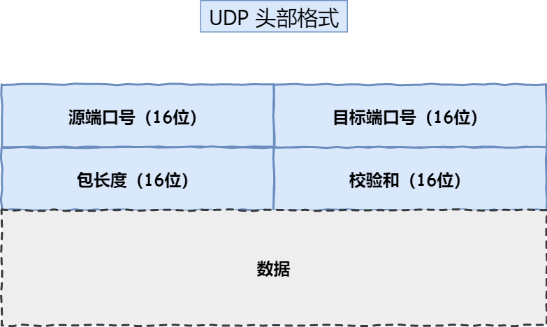
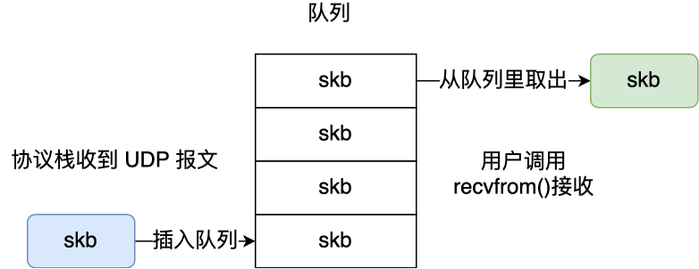
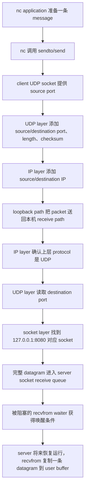
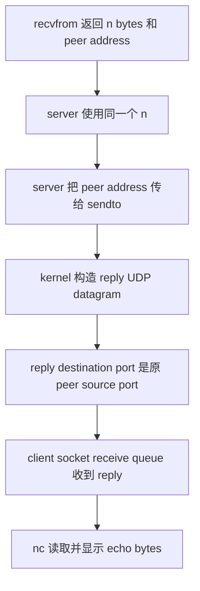
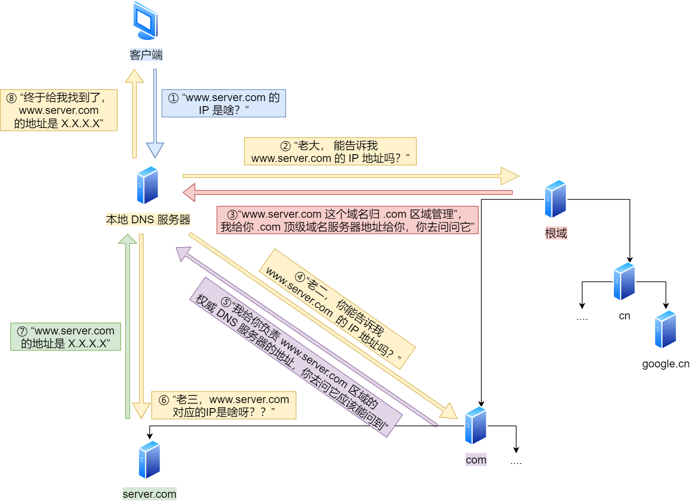

# Week6 Day3：UDP 没有连接，为什么仍然能把数据送到对端

> 今日定位：Day2 已经解决 `route -> next hop -> ARP -> MAC`，也知道 packet 到达目标 host 后还需要 port。今天继续追问：
>
> ```text
> IP 只把 packet 送到目标 host，
> kernel 怎样根据 UDP destination port 找到 application？
>
> UDP 没有 TCP connection 和 handshake，
> sender 又怎样说明“这一条 datagram 要发给谁”？
> ```
>
> 今日类型：机制理解 + Linux API + 独立实现。
>
> MIT 6.S081 范围：Lec21 `21.5 四层网络：UDP`、`21.6 网络协议栈`。
>
> 今日唯一主项目：`udp_echo_server.cpp`。
>
> 今天不提供完整 server 实现。教程会解释每个 API 的独立职责和最小调用方式，最后由你自己组织完整控制流。

---

# Part 1：前情提要与必要术语

## 1. 从 Day2 接过来的路径

Day2 已经建立：

```text
application data
-> transport layer
-> IP packet
-> route lookup 选择 next hop
-> ARP 获得当前 link 上 next-hop MAC
-> Ethernet frame
-> 一跳一跳到达 destination host
```

并且已经区分：

```text
MAC address：当前 Ethernet link 内交付 frame
IP address：跨 networks 找到 destination host/interface
port：在目标 host 内找到 transport endpoint
fd：当前 process 访问本机 kernel object 的整数句柄
```

今天从最后两项继续：

```text
destination port
-> kernel 中对应的 UDP socket
-> socket receive queue
-> 当前 process 持有的 socket fd
-> recvfrom 把一条 datagram 复制到 user buffer
```

---

## 2. 今天先回答三个容易混在一起的问题

### 2.1 host、process 和 socket 分别是什么

```text
host：
    一台运行 operating system 的主机。

process：
    host 上运行的一个用户程序实例。

socket：
    kernel 中用于网络通信的对象。
    process 通过 fd 访问它。
```

一个 process 可以持有多个 socket fds，一台 host 上也可以同时运行很多网络 applications。

### 2.2 IP address、port 和 fd 分别在哪里有效

```text
IPv4 address：
    出现在 IP header 中；
    网络中的其他 hosts/routers 能看到并使用它。

UDP port：
    出现在 UDP header 中；
    destination host 的 UDP layer 用它选择 socket。

fd：
    只在当前 process 的 fd table 中有意义；
    不会被写进 UDP header 发到网络上。
```

例如本机程序得到：

```text
fd = 3
```

这不表示“UDP port 3”。它只表示当前 process 用编号 `3` 访问某个 kernel socket object。

### 2.3 “无连接”不等于“没有通信对象”

UDP 的 `connectionless` 是：

```text
发送普通 datagram 前，不要求先完成 TCP 那样的 handshake；
kernel 也不为每个 peer 维护 TCP 那套可靠传输状态。
```

它不是：

```text
不知道目标 IP
不知道目标 port
不需要 socket
不需要 kernel receive queue
数据一定能到
```

使用 `sendto` 时，每一条 datagram 都可以直接携带自己的 destination socket address。

---

## 3. 必要术语

### 3.1 UDP

`UDP`：`User Datagram Protocol`，用户数据报协议。

拆开理解：

```text
User：
    为上层 application 提供服务。

Datagram：
    一条有边界的独立 message。

Protocol：
    通信双方共同遵守的格式与规则。
```

UDP 提供的是：

```text
connectionless
message-oriented
best-effort
```

`best-effort`：尽力而为。UDP 会尝试交付 datagram，但协议本身不保证：

```text
一定到达
只到达一次
按发送顺序到达
丢失后自动重传
```

### 3.2 datagram

`datagram`：数据报。

今天把它理解为：

```text
UDP 交付的一条有明确边界的 message。
```

假设 sender 分别调用两次：

```text
sendto(..., "abc", 3, ...)
sendto(..., "hello", 5, ...)
```

如果两条 datagrams 都成功到达，receiver 不会把它们当成一个连续的 8-byte stream。它看到的是两个独立队列元素：

```text
datagram 1：3 bytes
datagram 2：5 bytes
```

至于哪条先到、是否都到，UDP 不保证。

### 3.3 message boundary

`boundary`：边界。

`message boundary` 表示 kernel 仍然知道：

```text
这一批 bytes 属于第一条 message
下一批 bytes 属于第二条 message
```

这与后面 TCP 的 byte stream 是关键区别。TCP 会保留 byte order，但不保留 application 的每次 `send` 边界。

### 3.4 endpoint

`endpoint`：通信端点。

今天在 IPv4 + UDP 下，可以先把 local endpoint 理解为：

```text
protocol + local IPv4 address + local port
```

例如：

```text
UDP + 127.0.0.1 + 8080
```

它表示：

```text
本机 loopback address 上 UDP port 8080 对应的接收入口。
```

`endpoint` 不是 fd。fd 是某个 process 访问 kernel socket object 的本地编号。

### 3.5 socket

`socket` 原义是插座、接口。

在今天的 Linux 编程语境里，它是：

```text
kernel 中保存网络通信状态、地址信息和收发队列的对象；
application 通过 socket fd 调用 bind/recvfrom/sendto/close。
```

不要把以下三个词画等号：

```text
socket object：kernel object
socket address：IP address + port 的内存表示
socket fd：当前 process 访问 socket object 的整数编号
```

### 3.6 socket address

`socket address`：套接字地址。

IPv4 下，它把：

```text
address family
IPv4 address
port
```

组织在一个 `sockaddr_in` object 中，供 `bind`、`sendto` 等 API 使用。

### 3.7 bind

`bind`：绑定。

今天它表示：

```text
把一个 local socket address 绑定给 socket object。
```

也就是让 kernel 建立类似下面的关系：

```text
UDP + 127.0.0.1:8080
-> 这个 socket object
-> 它的 receive queue
```

### 3.8 demultiplex

`demultiplex`，常缩写为 `demux`：分用。

`multiplex` 是把多路数据汇合，`demultiplex` 是收到后再区分应该交给谁。

今天的 UDP demultiplex 可以先理解为：

```text
kernel 读取 UDP destination port
-> 查找匹配的 local UDP socket
-> 把 datagram 放入该 socket 的 receive queue
```

### 3.9 receive queue

`receive queue`：接收队列。

它属于 kernel socket object，不在你的 local `char buffer[]` 里。

```text
packet 已到达 host
-> UDP layer 找到 socket
-> datagram 进入 socket receive queue
-> application 之后调用 recvfrom
-> kernel 才复制一条 datagram 到 user buffer
```

### 3.10 peer

`peer`：通信对端。

对于 UDP server，一次 `recvfrom` 不只返回 payload，还可以通过输出参数告诉你：

```text
这条 datagram 来自哪个 source IPv4 address 和 source port
```

server 随后可把这个地址交给 `sendto`，将 echo 发回原 peer。

### 3.11 DNS

`DNS`：`Domain Name System`，域名系统。

它解决：

```text
application 知道 example.com，
但 network layer 真正需要 IP address。
怎样把 domain name 解析成一个或多个可用地址？
```

DNS 不是“互联网通讯录里只有一张表”。它由多层 servers、cache 和 resolver 共同工作。

### 3.12 resolver

`resolve`：解析、求出结果。

`resolver`：执行名称解析的一方。

今天区分：

```text
stub resolver：
    application/libc 一侧的轻量入口；
    接受 domain name，向系统配置的解析服务发起请求。

recursive resolver：
    通常也称 local DNS server；
    负责查 cache，必要时继续询问其他 DNS servers。
```

“local DNS server”不一定运行在当前电脑上。它可能由家庭 router、校园网、运营商或公共 DNS 服务提供。

### 3.13 root、TLD、authoritative

```text
root DNS server：
    DNS 层级查询的根入口；
    通常告诉 resolver 应继续询问哪个 TLD server。

TLD：
    Top-Level Domain，顶级域；
    例如 .com、.org、.cn。

authoritative DNS server：
    权威 DNS server；
    保存某个 domain 的权威记录，是答案的原始负责方。
```

root 和 TLD server 通常不是直接返回最终 host IP，而是提供下一步应该问谁的信息。

---

# Part 2：教程主体

# 教程开始

## 4. 从问题出发：IP 已经到了目标 host，接下来交给谁

目标 host 可能同时运行：

```text
DNS server
game server
log collector
你今天写的 UDP echo server
```

IP header 的 destination address 只能说明：

```text
packet 应该到达哪台 host/interface
```

它没有说明：

```text
应该交给这台 host 上哪个 UDP socket
```

所以 transport layer 需要 port。

完整定位链先压缩为：

```text
destination MAC
-> 当前 link 上哪个 interface 接收 frame

destination IP
-> 哪个 host/interface 是最终网络层目的地

IP protocol = UDP
-> 交给 kernel 的 UDP module

UDP destination port
-> 交给哪个 UDP socket receive queue

socket fd
-> 当前 application 怎样访问那个 socket object
```

---

## 5. 顺着 MIT 6.S081 `21.5`：UDP header 为什么需要 port

### 5.1 UDP header 的四个核心字段



> 图源：《图解网络》小林 Coding v4.0，第 237 页。读图重点：UDP header 固定为 8 bytes，每个字段 16 bits。

```text
source port：
    sender 的 UDP port；
    reply 可以把它作为 destination port。

destination port：
    receiver kernel 用来 demultiplex 到目标 socket。

length：
    UDP header + UDP payload 的总长度。

checksum：
    用来检测 header/payload 是否在传输中损坏。
```

`checksum` 只负责检测，不负责：

```text
自动重传
恢复丢失
重新排序
去除重复
```

MIT 课程里展示的 xv6 networking lab 简化实现没有生成 UDP checksum。你今天写的是 Linux userspace 程序，UDP header 由 Linux kernel protocol stack 构造，不需要自己手填。

### 5.2 DNS 是 source port / destination port 的具体例子

一次传统 DNS query 可以先这样理解：

```text
client application
-> local UDP source port：kernel 选择的临时 port，例如 53001
-> DNS server destination port：53
```

DNS server 回复时：

```text
source port：53
destination port：53001
```

于是 client host 的 UDP layer 能根据 `53001` 找回发起查询的 socket。

端口不是“某个程序永远固定的编号”。常见 server 往往绑定 well-known port；client 通常使用 kernel 分配的 ephemeral port。

`ephemeral`：短暂的、临时的。

### 5.3 UDP 没有 handshake，为什么仍然知道发给谁

因为 `sendto` 每次调用都提供 destination socket address：

```text
payload bytes
destination IPv4 address
destination UDP port
```

所以不需要先建立 TCP connection 才知道目标。

流程是：

```text
application 调用 sendto
-> 参数里给出 destination IP + port
-> kernel 添加 UDP header
-> kernel 添加 IP header
-> route/link layer 继续完成交付
```

UDP 的 `connectionless` 省略的是 handshake 和 per-connection reliable transport state，不是省略 destination。

---

## 6. UDP 为什么保留 datagram boundary

看接收队列：



> 图源：《图解网络》小林 Coding v4.0，第 463 页。图中的 `skb` 是 Linux kernel 中表示 network packet buffer 的结构；今天只需把每个方块看成一条独立 datagram。

假设 receive queue 里依次有：

```text
[3-byte datagram]
[5-byte datagram]
```

那么普通 blocking `recvfrom`：

```text
第一次调用：只取一条 datagram
第二次调用：再取下一条 datagram
```

它不会像 TCP byte stream 那样把两条 message 自动拼成 8 bytes 一次返回。

### 6.1 user buffer 比 datagram 大

例如 datagram 是 5 bytes，buffer 是 1024 bytes：

```text
recvfrom 返回 5
只有前 5 bytes 是这次收到的数据
后面的 bytes 不能当成本次 message
```

所以处理收到的数据时必须使用返回值 `n`，不能直接假设 buffer 是 C string。

### 6.2 user buffer 比 datagram 小

例如 datagram 是 100 bytes，buffer 只有 16 bytes：

```text
recvfrom 最多复制 16 bytes
这条 datagram 剩余部分会被截断并丢弃
下一次 recvfrom 不会从第 17 byte 接着读
```

这再次说明 UDP 是 datagram，不是可连续读取的 file stream。

### 6.3 `recvfrom` 返回 0 不表示 UDP EOF

UDP 允许 zero-length datagram。

因此：

```text
recvfrom 返回 0
-> 收到了一条 payload length 为 0 的 datagram
```

这与 TCP 中 `recv` 返回 0 表示 peer orderly shutdown 的语义不同。

---

## 7. 顺着 MIT 6.S081 `21.6`：socket layer 把 fd、port 和 queue 接起来

MIT 课程给出的典型组织是：

```text
application
    |
socket layer
    |
UDP / TCP
    |
IP / ARP
    |
network interface / driver
```

今天只学到 socket layer，不进入 `21.7 Ring Buffer`、NIC driver、DMA 或 receive livelock。

### 7.1 socket layer 的职责

当前层次可以理解为：

```text
1. 维护 application 可访问的 socket object。
2. 把 local address/port 与 socket 联系起来。
3. 为 socket 维护 receive queue。
4. 在 queue 暂时为空时支持 blocking receive。
5. queue 有数据后让 recvfrom 取走一条 datagram。
```

### 7.2 UDP layer 的职责

收到 IP payload 后，UDP module：

```text
检查 UDP header
-> 读取 destination port
-> 找到匹配的 socket
-> 保留 datagram boundary
-> 把 payload 交给 socket receive queue
```

UDP module 不负责：

```text
route lookup
ARP 查询 MAC
TCP handshake
丢包重传
把两条 datagrams 合并成 stream
```

### 7.3 fd 与 port 的关系不是一一对应的整数相等

例如：

```text
process 中 fd = 3
socket local port = 8080
```

kernel 中概念上是：

```text
process fd table[3]
-> UDP socket object
-> local endpoint 127.0.0.1:8080
-> receive queue
```

`3` 和 `8080` 数值没有任何必须相等的关系。

---

## 8. 一条 UDP echo 的完整发送与接收因果链

今天在 loopback 上测试：

```text
client peer：nc -u
server：你的 udp_echo_server
address：127.0.0.1
```

`loopback` 表示 packet 在本机协议栈中回环，不经过物理 Ethernet link，所以这次实验不会触发真实的 router forwarding 或 ARP。

### 8.1 client 发给 server



### 8.2 server echo 回 client



最重要的数据依赖是：

```text
recvfrom 返回的 n
-> 决定 echo 多少 bytes

recvfrom 填写的 peer address + peer length
-> 决定 sendto 把 reply 发给谁
```

不要使用：

```cpp
std::strlen(buffer)
```

因为 UDP payload 是 bytes，不保证含 `'\0'`，也允许中间出现 `'\0'`。

---

## 9. `recvfrom` 没数据时为什么会阻塞

把 Week5 的 blocking/sleep/wakeup 接进来：

```text
server execution flow 调用 recvfrom
    |
    v
system call 进入 kernel
    |
    v
检查 socket receive queue
    |
    +--> queue 非空：
    |       复制一条 datagram 到 user buffer
    |       返回 byte count
    |
    +--> queue 为空：
            当前 execution flow 进入等待
            scheduler 可以运行其他 execution flow
            |
            v
        packet 将来进入 network stack
            |
            v
        UDP layer 找到目标 socket
            |
            v
        datagram 加入 receive queue
            |
            v
        kernel 使 waiter 具备 RUNNABLE 条件
            |
            v
        scheduler 将来重新选择它
            |
            v
        recvfrom 从 queue 取出一条 datagram并返回
```

这里必须区分：

```text
wakeup condition 出现
!=
recvfrom 立刻在 CPU 上运行
```

它仍然要等待 scheduler 安排。

---

## 10. IPv4 socket address：`sockaddr_in`

头文件：

```cpp
#include <arpa/inet.h>
#include <netinet/in.h>
```

常见字段：

```cpp
struct sockaddr_in {
    sa_family_t    sin_family; // AF_INET
    in_port_t      sin_port;   // port，network byte order
    struct in_addr sin_addr;   // IPv4 address
};
```

这不是完整 ABI 定义，只是今天需要认识的字段。

### 10.1 最小使用例子

```cpp
sockaddr_in local_address{};
local_address.sin_family = AF_INET;
local_address.sin_port = ::htons(8080);

const int conversion_result =
    ::inet_pton(AF_INET, "127.0.0.1", &local_address.sin_addr);
if (conversion_result != 1) {
    // 1 表示转换成功；0 表示文本不是合法 IPv4；-1 表示 address family 等错误。
}
```

这里：

```text
{}：
    先把 structure 清零，避免未初始化字段。

AF_INET：
    Address Family Internet，表示 IPv4。

htons：
    host to network short，把 16-bit port 转成 network byte order。

inet_pton：
    presentation to network，把 IPv4 text 转成 binary address。
```

`inet_pton` 与 `htons` 已在 Day2 学过，今天只把结果放进完整 socket address。

### 10.2 为什么 API 参数常写成 `sockaddr*`

socket API 需要支持：

```text
IPv4
IPv6
Unix domain socket
其他 address families
```

所以接口使用通用的：

```cpp
const sockaddr*
```

而你实际准备的是 IPv4 专用：

```cpp
sockaddr_in
```

调用时需要明确告诉 compiler：

```cpp
reinterpret_cast<const sockaddr*>(&local_address)
```

这个 cast 不会转换 address 内容，只是让通用 socket API 从同一块内存按通用地址指针接收。

---

## 11. API 1：`socket`

### 11.0.0 socket 到底干了啥！必读重点！！为我们做好了一层一层加 header 等等一些繁琐过程

对，整体理解是对的，而且你已经抓到 **socket API 帮 application 隔离协议栈细节** 这个核心了。不过有两个地方稍微修正一下。

你写：

```cpp
int fd = ::socket(AF_INET, SOCK_DGRAM, 0);
```

含义是：

```text
AF_INET
-> 使用 IPv4 address family

SOCK_DGRAM
-> 需要 datagram semantics

protocol = 0
-> 让 kernel 根据前两个参数选择默认 protocol
-> AF_INET + SOCK_DGRAM 对应 UDP
```

所以，真正决定“这是 UDP socket”的主要信息是：

```text
AF_INET + SOCK_DGRAM
```

`protocol = 0` 表示“不再手动指定，使用默认匹配项”，不是说 `0` 本身就代表 UDP。你也可以显式写：

```cpp
::socket(AF_INET, SOCK_DGRAM, IPPROTO_UDP);
```

两者在这里效果相同。

之后的理解也基本正确：

```text
application
-> 通过 fd 操作 kernel socket object
-> kernel socket layer 接收 application 的参数和数据
-> UDP layer 添加 UDP header
-> IP layer 添加 IP header
-> link layer/driver 处理更下层的封装与发送
```

例如：

```cpp
::sendto(fd, data, length, 0, destination, destination_length);
```

application 只提供：

```text
要发送的 payload bytes
payload length
destination IP address
destination port
```

kernel 根据 socket object 和 `sendto` 参数完成：

```text
application payload
-> 添加 UDP header
-> 添加 IP header
-> route lookup
-> 必要时解析 next-hop link-layer address
-> 添加当前 link 所需的 header
-> 交给 network interface
```

接收方向反过来：

```text
network interface 收到 frame
-> kernel 检查并移除 link-layer header
-> IP layer 检查并移除 IP header
-> UDP layer 检查 UDP header
-> 根据 destination port 找到 socket
-> payload 进入 socket receive queue
-> recvfrom 复制一条 datagram 到 application buffer
```

但更准确地说：

它更像 application 与 kernel network stack 之间的接口对象：

```text
socket object 保存：
    使用哪个 address family / transport protocol
    local address 和 port
    receive/send queue
    socket options
    blocking 等待状态等

真正添加和解析 headers：
    由 kernel 中 UDP、IP、link layer/driver 等不同模块分别完成
```

因此可以把你现在的理解压缩成：

> application 通过 socket fd 和 system calls 描述“发什么、发给谁”；kernel 根据 socket object 的配置，调用 UDP、IP 和更下层协议模块完成逐层封装、路由与发送。接收时 kernel 逐层解析，并把最终 payload 放入对应 socket 的 receive queue。

这也正是 socket API 的价值：你不用自己手写 UDP/IP/Ethernet headers 和网卡驱动，就能使用操作系统已经实现好的网络协议栈。

### 11.0.1 我们为什么需要 socket？UDP 整条路径是什么样？
你感觉对了：Day2 那张图是**泛化的 transport path**，故意没指定 TCP 还是 UDP。

```text
application
-> transport layer
-> IP
-> route
-> ARP
-> Ethernet
```

其中 `transport layer` 可以替换成：

```text
UDP layer
```

也可以替换成：

```text
TCP layer
```

不过“application 提供 bytes 和 remote endpoint”这种写法，确实更接近 UDP 的 `sendto()`。如果是 TCP，remote endpoint 通常在之前调用 `connect()` 时已经保存到 socket object 中，之后 `send()` 主要提供 bytes。

**UDP 和 Socket 的区别**

先抓住：

```text
socket：application 使用 kernel network stack 的接口和 kernel object
UDP：transport layer 的一种 protocol
```

UDP 本身定义：

```text
UDP header 格式
source port
destination port
length
checksum
datagram boundary
不保证可靠、有序和唯一到达
```

socket object 则负责保存：

```text
这个 socket 使用 UDP
local IP 和 local port
必要时保存 default peer
receive queue
blocking waiter
socket options
```

所以 UDP 不是 socket，socket 也不是 UDP header。

**完整 UDP 发送路径**

假设：

```cpp
sendto(fd, data, length, 0, destination, destination_length);
```

完整路径是：

```text
application
    |
    | 调用 sendto
    | 提供 payload bytes
    | 提供 destination = 8.8.8.8:8080
    v
socket system call
    |
    | 通过 fd 找到 kernel UDP socket object
    | 确认 AF_INET + SOCK_DGRAM -> IPv4 + UDP
    |
    | 如果尚未绑定 local port：
    | kernel 自动选择 ephemeral source port
    v
UDP layer
    |
    | 添加 UDP header：
    | source port
    | destination port = 8080
    | length
    | checksum
    v
IP layer
    |
    | 添加 IP header：
    | source IP
    | destination IP = 8.8.8.8
    | protocol = 17，表示 UDP
    v
routing lookup
    |
    | next hop = gateway
    | outgoing interface = ens33
    v
ARP / neighbour lookup
    |
    | 查询 gateway IP 对应的 MAC
    v
Ethernet
    |
    | 添加当前这一跳的 Ethernet header
    v
ens33
    |
    v
network
```

最终在线路上传输的嵌套结构是：

```text
Ethernet header
    IP header
        UDP header
            application payload
```

**完整 UDP 接收路径**

对端收到后反过来：

```text
network interface 收到 Ethernet frame
    |
    v
Ethernet layer 检查并移除 Ethernet header
    |
    v
IP layer 检查 destination IP
    |
    | IP protocol = 17
    v
交给 UDP layer
    |
    | 检查 UDP header
    | 读取 destination port
    v
socket layer 查找匹配的 UDP socket
    |
    v
完整 datagram 进入 socket receive queue
    |
    v
application 调用 recvfrom
    |
    v
kernel 把一条 datagram 复制到 user buffer
```

**“不通过 socket 的 UDP”是什么**

如果暂时把 socket 拿掉，只观察 UDP protocol 本身，它就是：

```text
发送端：
payload
-> UDP module 添加 8-byte UDP header
-> 形成 UDP datagram
-> 交给 IP layer

接收端：
IP layer 交来 UDP datagram
-> UDP module检查 header
-> 根据 destination port 判断应该交给谁
-> 取出 payload
```

但是普通 userspace application 必须有某种 kernel interface，才能：

```text
告诉 kernel 发什么
告诉 kernel 发给谁
接收属于自己的 datagram
```

Linux 给 application 使用的标准接口就是 socket API。没有 socket，UDP protocol 仍然可以作为内核协议存在，但普通 application 就没有方便的入口和 receive queue 来使用它。

一句话总结：

> UDP 规定“datagram 怎么封装、怎么用 port 找接收方”；socket 负责把 application 与 kernel 中的 UDP protocol stack 接起来。

### 11.1 英文与用途

`socket`：创建一个 communication endpoint 对应的 kernel socket object，并返回 fd。

头文件与接口：

```cpp
#include <sys/socket.h>

int socket(int domain, int type, int protocol);
```

### 11.2 参数

```text
domain：
    address family；
    今天使用 AF_INET，也就是 IPv4。

type：
    communication semantics；
    今天使用 SOCK_DGRAM，也就是 datagram socket。

protocol：
    具体 protocol；
    传 0 表示让 kernel 根据 AF_INET + SOCK_DGRAM 选择默认 protocol，
    在这里就是 UDP。
```

### 11.3 返回值、状态与 ownership

```text
成功：
    返回非负 socket fd。

失败：
    返回 -1，并设置 errno。

成功后的 ownership：
    当前 process 持有这个 fd；
    必须最终 close，今天继续交给 UniqueFd 做 RAII。
```

刚创建后的 UDP socket 已经是 kernel object，但还没有绑定你指定的 local address/port。

### 11.4 最小调用例子

```cpp
const int raw_socket_fd = ::socket(AF_INET, SOCK_DGRAM, 0);
if (raw_socket_fd == -1) {
    std::perror("socket");
    return 1;
}

// 真实项目中立即交给 UniqueFd，保证所有 return paths 都会 close。
UniqueFd socket_fd(raw_socket_fd);
```

---

## 12. API 2：`bind`

### 12.1 英文与用途

`bind`：把 local socket address 绑定到 socket object。

接口：

```cpp
#include <sys/socket.h>

int bind(int sockfd, const struct sockaddr* addr, socklen_t addrlen);
```

### 12.2 参数

```text
sockfd：
    socket() 返回的 fd。

addr：
    指向 local socket address。

addrlen：
    address object 实际占用的 bytes；
    IPv4 下传 sizeof(sockaddr_in object)。
```

### 12.3 返回值和常见错误

```text
成功：
    返回 0。

失败：
    返回 -1，并设置 errno。
```

今天最常见：

```text
EADDRINUSE：
    Address already in use；
    requested local address/port 已被占用。

EADDRNOTAVAIL：
    Address not available；
    尝试绑定的 local address 不属于当前 host。

EACCES：
    Permission denied；
    例如普通用户尝试绑定受限制的 privileged port。
```

### 12.4 最小调用例子

假设 `socket_fd` 已有效，`local_address` 已按上一节初始化：

```cpp
const int bind_result =
    ::bind(socket_fd.get(),
           reinterpret_cast<const sockaddr*>(&local_address),
           sizeof(local_address));

if (bind_result == -1) {
    std::perror("bind");
    return 1;
}
```

成功后，kernel 才能把发往该 local endpoint 的 datagram 分给这个 socket。

---

## 13. API 3：`recvfrom`

### 13.1 英文与用途

`recvfrom`：`receive from`，接收一条 datagram，并可取得 sender/peer address。

接口：

```cpp
#include <sys/socket.h>

ssize_t recvfrom(int sockfd,
                 void* buf,
                 size_t len,
                 int flags,
                 struct sockaddr* src_addr,
                 socklen_t* addrlen);
```

### 13.2 参数

```text
sockfd：
    UDP socket fd。

buf：
    user buffer 起点。

len：
    user buffer capacity。

flags：
    今天传 0，使用普通 blocking behavior。

src_addr：
    output parameter；
    kernel 把 sender address 写到这里。

addrlen：
    value-result parameter；
    调用前由 application 写入 src_addr buffer capacity；
    返回后由 kernel 写入实际 address length。
```

`value-result parameter` 表示它既是输入也是输出。

### 13.3 为什么 `peer_length` 必须先初始化

```cpp
sockaddr_in peer_address{};
socklen_t peer_length = sizeof(peer_address);
```

调用前：

```text
peer_length 告诉 kernel：
peer_address 这块输出内存最多有多少 bytes。
```

调用后：

```text
peer_length 告诉 application：
kernel 实际写入的 address 有多少 bytes。
```

### 13.4 返回值与 datagram 状态

```text
> 0：
    成功复制的 payload byte count。

= 0：
    收到 zero-length UDP datagram，不是 EOF。

= -1：
    失败，errno 说明原因。
```

blocking socket 的 receive queue 为空时，调用可以阻塞。

### 13.5 最小调用例子

```cpp
char buffer[1024]{};
sockaddr_in peer_address{};
socklen_t peer_length = sizeof(peer_address);

const ssize_t received =
    ::recvfrom(socket_fd.get(),
               buffer,
               sizeof(buffer),
               0,
               reinterpret_cast<sockaddr*>(&peer_address),
               &peer_length);

if (received == -1) {
    std::perror("recvfrom");
    return 1;
}

// 使用 received，而不是 strlen(buffer)。
std::cout.write(buffer, received);
std::cout << '\n';
```

---

## 14. API 4：`sendto`

### 14.1 英文与用途

`sendto`：send to a destination address，把一条 datagram 发给指定 peer。

接口：

```cpp
#include <sys/socket.h>

ssize_t sendto(int sockfd,
               const void* buf,
               size_t len,
               int flags,
               const struct sockaddr* dest_addr,
               socklen_t addrlen);
```

### 14.2 参数

```text
sockfd：
    UDP socket fd。

buf：
    要发送的 user buffer 起点。

len：
    本条 datagram 的 payload byte count。

flags：
    今天传 0。

dest_addr：
    destination IPv4 address + UDP port。

addrlen：
    destination address object 的 byte size。
```

### 14.3 返回值和保证边界

```text
成功：
    返回本地 kernel 接受的 payload byte count。

失败：
    返回 -1，并设置 errno。
```

对于 UDP datagram，kernel 不能像 TCP stream 那样把一个过大的应用 message 当成若干次 partial send 让你继续补。过大时可能得到：

```text
EMSGSIZE：
    Message too long。
```

即使 `sendto` 返回了 `len`，也只说明：

```text
local kernel 接受了这条 datagram 的发送请求
```

不保证：

```text
peer application 已经收到
packet 没有在路上丢失
peer 已经调用 recvfrom
```

### 14.4 最小调用例子

假设 `peer_address` 和 `peer_length` 来自刚才成功的 `recvfrom`：

```cpp
const ssize_t sent =
    ::sendto(socket_fd.get(),
             buffer,
             static_cast<std::size_t>(received),
             0,
             reinterpret_cast<const sockaddr*>(&peer_address),
             peer_length);

if (sent == -1) {
    std::perror("sendto");
    return 1;
}

if (sent != received) {
    std::cerr << "unexpected UDP send length\n";
    return 1;
}
```

这里必须复用：

```text
received：
    原 datagram 实际收到多少 payload bytes。

peer_address：
    原 datagram 从哪里来。
```

---

## 15. 四个 API 组合后，各自只负责哪一步

```text
socket
-> 创建 UDP socket object，得到 fd

bind
-> 指定 server 的 local endpoint

recvfrom
-> 从 receive queue 取一条 datagram
-> 得到 payload byte count 和 peer address

sendto
-> 把同一批 bytes 发回指定 peer
```

UDP server 不需要：

```text
listen
accept
TCP handshake
connected socket per client
```

这些属于后面 TCP server 的新结构。

---

## 16. DNS：domain name 怎样变成 IP address

### 16.0 stub resolver

`stub` 原意是“残段、简化的小部件”。

所以 **stub resolver** 可以翻译成：

```text
简化版域名解析器
```

它通常位于你的 application 或系统 C library 这一侧，只负责：

```text
1. 接收 application 的域名解析请求
2. 把问题交给 configured recursive DNS resolver
3. 等待并把结果返回 application
```

例如程序调用：

```cpp
getaddrinfo("example.com", ...);
```

可以粗略理解为：

```text
application
-> libc 中的 stub resolver
-> 本机配置的 recursive resolver
-> 必要时查询 root / TLD / authoritative DNS
-> stub resolver 收到最终结果
-> application 获得 IP address
```

之所以叫 `stub`，是因为它只完成很小一部分工作。它一般**不会自己从 root DNS 开始一路查到底**，繁重的递归查询工作交给 recursive resolver。

一句话记忆：

> `stub resolver` 是 application 身边的“DNS 查询转交入口”，负责提问和接收答案，不负责跑完整查询链。

### 16.1 application 一般不自己构造 DNS packet

常见 C/C++ application 会调用 libc 提供的 resolver interface，例如：

```text
getaddrinfo
```

它不是直接的 Linux system call。它可能按照系统 name service configuration：

```text
检查 /etc/hosts
使用本机/系统 cache
向配置的 DNS resolver 查询
返回一个或多个 socket addresses
```

所以不要机械理解为：

```text
每次 getaddrinfo 都一定从 root DNS server 开始问
```

### 16.2 DNS 参与者



> 图源：《图解网络》小林 Coding v4.0，第 22 页。读图重点：client 通常只把问题交给 local/recursive resolver；后续 root -> TLD -> authoritative 的工作主要由 resolver 完成，并且 cache 可能让流程提前结束。

没有 cache 命中时，第一层逻辑链是：

```text
application/stub resolver
    |
    v
recursive resolver，也就是常说的 local DNS server（才会去递归跑这个查询）
    |
    +--> 问 root：
    |       .com 应该继续问谁？
    |
    +--> 问 .com TLD server：
    |       example.com 的 authoritative server 是谁？
    |
    +--> 问 authoritative server：
    |       example.com 的 A record 是什么？
    |
    v
recursive resolver cache 结果
    |
    v
把 IPv4 answer 返回 application
```

这里：

```text
A record：
    Address record，把 domain name 映射到 IPv4 address。

AAAA record：
    把 domain name 映射到 IPv6 address。

TTL：
    Time To Live，记录可被 cache 多久的时间信息。
```

今天只要求认识 `A`、`AAAA` 与 cache，不背其他 record types。

### 16.3 DNS 与 UDP 的关系

传统 DNS query 经常使用：

```text
UDP destination port 53
```

但不能说：

```text
DNS 永远只使用 UDP
```

某些响应、重试或其他场景会使用 TCP；DoT、DoH 等也是其他传输方式。今天只建立“常见普通 DNS query 可承载在 UDP datagram 中”的第一层关系。

---

## 17. API 5：`getaddrinfo`

这一节用于看懂正常 application 怎样获得 socket address，不要求你今天再写一个完整 DNS client。

### 17.0 这里的都是去调用 library 里的函数

这里的 `library` 指的是提供 `getaddrinfo()` 的 **C 标准运行库实现**。在你的 Ubuntu 上通常就是：

```text
glibc：GNU C Library
```

`getaddrinfo()` 不是 system call，而是 glibc 提供的 library function：

```text
你的 C++ application
-> 调用 glibc 的 getaddrinfo()
-> glibc 根据 /etc/nsswitch.conf 等配置查找地址
-> 可能读取 /etc/hosts
-> 也可能通过 DNS 查询
-> glibc 在 user space 中申请一组 addrinfo objects
-> 把 linked list 的头指针写入 result
```

所以这句话：

```text
成功时得到 library 分配的 addrinfo linked list
```

具体意思是：

> `getaddrinfo()` 所属的 glibc 在内部申请了内存，构造出 `addrinfo` 链表，然后让 `result` 指向它。

因此这块内存不是你通过 `new` 申请的，不能写：

```cpp
delete result;       // 错误
std::free(result);   // 错误
```

必须使用同一个 library 配套提供的释放函数：

```cpp
::freeaddrinfo(result);
```

完整的 ownership 流程是：

```text
application 声明 result = nullptr
-> glibc 的 getaddrinfo 分配链表
-> result 指向链表头
-> application 读取结果
-> application 调用 freeaddrinfo
-> glibc 释放整条链表
```

一句话记忆：

> 这里的 `library` 就是提供 `getaddrinfo()` 的 glibc；谁提供专用的申请接口，就用谁配套的释放接口。

### 17.1 名字与接口

`getaddrinfo`：`get address information`，根据 host/domain 与 service 条件取得一组可用于 socket API 的 addresses。

头文件：

```cpp
#include <netdb.h>

int getaddrinfo(const char* node,
                const char* service,
                const struct addrinfo* hints,
                struct addrinfo** result);

void freeaddrinfo(struct addrinfo* result);

const char* gai_strerror(int error_code);
```

### 17.2 参数

```text
node：
    host/domain name，例如 "example.com"。

service：
    service name 或 port text，例如 "53"；
    不需要 port 时可以传 nullptr。

hints：
    application 的筛选条件，例如只要 IPv4 + UDP。

result：
    output parameter；
    成功时得到 library 分配的 addrinfo linked list。
    它是这个库给你返回的结果，所以后续 free 的时候也是要调用对应的库函数。
```

### 17.3 返回值、错误和 ownership

```text
成功：
    返回 0。

失败：
    返回非 0 的 EAI_* error code。
```

`getaddrinfo` 的错误不能直接按普通 system call 使用 `perror`。应当：

```cpp
std::cerr << ::gai_strerror(error_code) << '\n';
```

ownership：

```text
getaddrinfo 成功
-> result 指向 library 分配的 linked list
-> application 用完必须 freeaddrinfo(result)
```

### 17.4 最小使用例子

下面只是 API 用法演示，不是今日主项目：

```cpp
#include <arpa/inet.h>
#include <cstdio>
#include <iostream>
#include <netdb.h>
#include <netinet/in.h>
#include <sys/socket.h>

/*
目标：
    让 libc resolver 把 example.com 解析为适合 IPv4 UDP socket 的 address。
验证：
    程序打印 getaddrinfo 返回列表中的第一个 IPv4 address。
*/
int main() {
    addrinfo hints{};
    hints.ai_family = AF_INET;       // 只观察 IPv4。
    hints.ai_socktype = SOCK_DGRAM;  // 只要适合 UDP socket 的 address。

    addrinfo* result = nullptr;
    const int error =
        ::getaddrinfo("example.com", "53", &hints, &result);

    if (error != 0) {
        std::cerr << "getaddrinfo: "
                  << ::gai_strerror(error)
                  << '\n';
        return 1;
    }

    // result 可能有多个 nodes；这里只观察第一个 IPv4 address。
    const auto* ipv4_address =
        reinterpret_cast<const sockaddr_in*>(result->ai_addr);

    char address_text[INET_ADDRSTRLEN]{};
    if (::inet_ntop(AF_INET,
                    &ipv4_address->sin_addr,
                    address_text,
                    sizeof(address_text)) == nullptr) {
        std::perror("inet_ntop");
        ::freeaddrinfo(result);
        return 1;
    }

    std::cout << address_text << '\n';
    ::freeaddrinfo(result);
    return 0;
}
```

编译：

```bash
g++ -std=c++17 -Wall -Wextra -g dns_lookup_demo.cpp -o dns_lookup_demo
```

这个 example 的重点不是记 linked list，而是看清：

```text
domain name
-> resolver
-> one or more sockaddr results
-> application 后续交给 socket API
```

---

## 18. 使用 `dig` 观察 DNS，而不是手写 DNS packet

`dig`：`Domain Information Groper`，DNS 查询工具。

运行：

```bash
dig example.com A
```

今天只观察：

```text
QUESTION SECTION：
    你问了哪个 domain、哪类 record。

ANSWER SECTION：
    resolver 返回了什么 address，TTL 是多少。

SERVER：
    这次命令实际询问了哪个 configured DNS server。

Query time：
    这次查询耗时。
```

再执行一次相同命令：

```bash
dig example.com A
```

如果时间变短，可以怀疑 cache 起作用，但不要只凭一次 timing 就断言 cache 一定命中；网络与 resolver 状态也会影响时间。

可以查看系统当前配置的 DNS server：

```bash
cat /etc/resolv.conf
```

如果系统使用 `systemd-resolved`，`/etc/resolv.conf` 中可能看到 loopback stub address，例如 `127.0.0.53`。这表示本机先询问 local stub service，不代表公网 authoritative DNS server 就运行在本机。

---

## 19. 今天最容易犯的错误

### 19.1 把 fd 当成 port

错误：

```text
socket() 返回 3，所以 server port 是 3。
```

正确：

```text
3 是当前 process 的 fd；
port 来自 sockaddr_in.sin_port，并由 bind 建立 local endpoint。
```

### 19.2 把 UDP “无连接”理解成“不需要地址”

错误：

```text
UDP 没连接，所以 sendto 不用告诉 kernel 发给谁。
```

正确：

```text
sendto 每一条 datagram 都给出 destination address。
```

### 19.3 对接收 buffer 使用 `strlen`

错误：

```cpp
::sendto(fd, buffer, std::strlen(buffer), ...);
```

收到的是 bytes，里面可能有 `'\0'`，结尾也不保证有 `'\0'`。

正确的数据长度来自：

```text
recvfrom return value
```

### 19.4 忘记初始化 `peer_length`

错误：

```cpp
socklen_t peer_length;
::recvfrom(..., &peer_length);
```

正确：

```cpp
socklen_t peer_length = sizeof(peer_address);
```

因为调用前它是 output buffer capacity。

### 19.5 认为 `sendto` 成功等于 peer 收到

`sendto` 成功只说明 local kernel 接受了 datagram。UDP 没有给 application 一个可靠到达承诺。

### 19.6 把 `recvfrom == 0` 当成 EOF

UDP 的 `0` 表示 zero-length datagram。今天不要套用普通 file/TCP 的 EOF 解释。

### 19.7 buffer 太小后期待下次接着读

UDP datagram 被截断后，剩余部分不会留给下一次 `recvfrom`。

### 19.8 loopback 实验中期待看到 ARP

`127.0.0.1` 留在本机 loopback path：

```text
不会经过物理 router
不会为了远端 host 查询 ARP
```

本实验验证的是：

```text
socket -> UDP -> IP -> loopback -> UDP -> socket queue
```

---

# Part 3：收尾、练习、测试与验收

## 20. 今日主项目：独立实现 `udp_echo_server.cpp`

### 20.1 功能需求

程序只处理一条 datagram，然后正常退出：

```text
1. 创建 IPv4 UDP socket。
2. 使用 RAII 管理成功创建的 socket fd。
3. 绑定到 127.0.0.1:8080。
4. 打印 server 已准备好。
5. blocking recvfrom 等待一条 datagram。
6. 记录实际 byte count 和 peer address。
7. 使用 sendto 把完全相同的 bytes 发回同一个 peer。
8. 检查所有需要检查的返回值。
9. 正常退出，由 RAII close socket fd。
```

今天不要加入：

```text
TCP listen/accept/connect
threads
condition_variable
epoll
non-blocking mode
自定义 application protocol
手写 DNS parser
```

### 20.2 数据契约

至少使用：

```text
receive buffer capacity >= 1024 bytes
实际发送长度 = recvfrom return value
peer_length 调用前正确初始化
server bind address = 127.0.0.1
server port = 8080 或你明确记录的另一个非特权 port
```

server 不得：

```text
假设 payload 是 null-terminated string
使用 strlen 决定 echo length
忽略 socket/bind/recvfrom/sendto failure
泄漏 socket fd
```

### 20.3 注释要求

文件顶部写清：

```text
程序目标
怎样运行 server
怎样使用 nc -u 测试
```

自定义 function 若存在，要解释职责。

关键 system call 附近说明：

```text
socket 创建什么
bind 建立什么 local association
recvfrom 的 peer address 是 output
sendto 为什么复用 received byte count
```

不要把每行 C++ 翻译成注释。

---

## 21. 编译

```bash
g++ -std=c++17 -Wall -Wextra -g udp_echo_server.cpp -o udp_echo_server
```

本日必须做到：

```text
0 compilation errors
0 warnings
```

---

## 22. 测试顺序

### 22.1 先启动 server

Terminal A：

```bash
./udp_echo_server
```

此时如果停在 `recvfrom`，这是预期现象：socket receive queue 暂时为空。

### 22.2 在 server 阻塞时观察 bound socket

Terminal B：

```bash
ss -lunp | grep ':8080'
```

选项：

```text
-l：只看 listening/bound server-style sockets
-u：UDP
-n：直接显示 numeric address/port
-p：显示 process information；权限不足时信息可能不完整
```

UDP 不存在 TCP 的 `LISTEN` state。这里 `-l` 的工具语义是显示当前等待接收 datagram 的 unconnected UDP sockets。

你应能建立：

```text
127.0.0.1:8080
-> UDP socket
-> 当前 udp_echo_server process
```

### 22.3 发送普通 text datagram

Terminal B：

```bash
printf 'hello udp' | nc -u -w 1 127.0.0.1 8080
```

预期：

```text
client 收到 hello udp
server 的 recvfrom 返回 9
server echo 9 bytes
server 正常退出
```

`nc`：`netcat`，用于创建简单网络 peer。

```text
-u：
    使用 UDP。

-w 1：
    设置 1-second timeout，避免 UDP client 无限等待。
```

### 22.4 验证 payload 中的 `'\0'`

重新启动 server，再运行：

```bash
printf 'A\000B' |
nc -u -w 1 127.0.0.1 8080 |
od -An -tx1
```

预期 byte sequence：

```text
41 00 42
```

这证明：

```text
UDP payload 是 bytes
recvfrom return value 才是长度
中间的 '\0' 不应截断 echo
```

### 22.5 再换一条不同长度 datagram

重新启动 server：

```bash
printf '0123456789abcdef' | nc -u -w 1 127.0.0.1 8080
```

确认 echo byte count 与输入一致。

### 22.6 用 `strace` 观察 system call 边界

```bash
strace -e trace=socket,bind,recvfrom,sendto,close ./udp_echo_server
```

另一个 terminal 使用 `nc -u` 发送一条 datagram。

只记录关键因果：

```text
socket 返回哪个 fd
bind 使用哪个 local address/port
recvfrom 什么时候返回、返回多少 bytes
sendto 发送多少 bytes
close 哪个 fd
```

不要求复制整份 trace。

---

## 23. DNS 观察任务

运行：

```bash
dig example.com A
```

在 note 中记录：

```text
query name
record type
ANSWER SECTION 中的一条 IPv4 address
SERVER
Query time
```

然后回答：

```text
1. 你的 application 直接询问的是 root server，还是 configured resolver？
2. 第二次查询更快时，为什么只能说“可能 cache 命中”？
3. DNS answer 最终怎样成为后续 socket API 可使用的 address？
```

不要求抓 packet，也不要求手写 DNS query。

---

## 24. 推荐的 `day3_note.md` 结构

只记录今天真正新增的内容：

```markdown
# Week6 Day3 Note

## 1. 我理解的 UDP 完整路径

## 2. fd、port、socket object、socket address 的区别

## 3. recvfrom 阻塞与 receive queue

## 4. datagram boundary 实验

## 5. DNS 查询参与者与 dig 观察

## 6. 错误实验与修正

## 7. 验收问题
```

如果某段已经能独立讲清，不需要为了篇幅重复抄教程。

---

## 25. 验收问题

### 问题 1

UDP 没有 TCP handshake，为什么 `sendto` 仍然知道把 datagram 发给谁？

### 问题 2

假设：

```text
fd = 3
local port = 8080
```

分别解释 `3` 和 `8080` 在哪里有效，它们如何通过 kernel socket object 联系起来。

### 问题 3

sender 连续发送：

```text
3-byte datagram
5-byte datagram
```

如果两条都到达，receiver 的一次普通 `recvfrom` 会不会自动返回 8 bytes？为什么？

### 问题 4

`recvfrom` 阻塞时，等待的 condition 是什么？packet 到达后，哪些明确主体依次做了什么？

### 问题 5

为什么 echo 必须使用 `recvfrom` 的返回值作为 `sendto` length，而不能使用 `strlen(buffer)`？

### 问题 6

`sendto` 返回 payload length，能否证明 peer application 已收到？为什么？

### 问题 7

解释：

```text
stub resolver
recursive resolver
root DNS server
TLD DNS server
authoritative DNS server
```

它们在一次没有 cache 命中的查询中分别做什么？

### 问题 8

为什么 `dig example.com A` 的 `SERVER` 通常不是 root server？

### 问题 9

今天在 `127.0.0.1` 上完成 UDP echo，为什么通常观察不到 Day2 的 ARP 和 router forwarding？

### 问题 10

UDP `recvfrom` 返回 `0` 表示什么？为什么不能套用 TCP EOF 的解释？

---

## 26. 今日通过标准

满足以下条件即可进入 Day4：

```text
1. udp_echo_server.cpp 使用指定编译参数 0 warnings。
2. socket fd 使用 RAII 管理。
3. server 正确 bind loopback + chosen port。
4. recvfrom 正确初始化 peer_length，并检查返回值。
5. sendto 使用 received byte count 和原 peer address。
6. text 与包含 '\0' 的 payload 都能原样 echo。
7. 能用 ss 解释 bound UDP endpoint。
8. 能把 recvfrom blocking 与 socket receive queue 串起来。
9. 能解释 UDP datagram boundary 与后续 TCP byte stream 的区别。
10. 能讲出 DNS 的主要参与者、cache 与最终 IP answer。
```

今天最后压缩成两条：

```text
UDP 没有 connection handshake，但每条 datagram 都有明确 destination；
kernel 用 destination port 把它放入匹配 socket 的 receive queue。

DNS 先把 domain name 解析成 address；
socket API 再拿这个 address 做真正的网络通信。
```

---

## 27. 今日资料

MIT 6.S081：

- [21.5 四层网络：UDP](https://mit-public-courses-cn-translatio.gitbook.io/mit6-s081/lec21-networking-robert/21.5-si-ceng-wang-luo-udp)
- [21.6 网络协议栈](https://mit-public-courses-cn-translatio.gitbook.io/mit6-s081/lec21-networking-robert/21.6-wang-lu-xie-yi-zhan-network-stack)

Linux manual：

- [socket(2)](https://man7.org/linux/man-pages/man2/socket.2.html)
- [bind(2)](https://man7.org/linux/man-pages/man2/bind.2.html)
- [recvfrom(2)](https://man7.org/linux/man-pages/man2/recv.2.html)
- [sendto(2)](https://man7.org/linux/man-pages/man2/send.2.html)
- [udp(7)](https://man7.org/linux/man-pages/man7/udp.7.html)
- [getaddrinfo(3)](https://man7.org/linux/man-pages/man3/getaddrinfo.3.html)

辅助图示：

- 《图解网络》小林 Coding v4.0，第 22、237、463 页。
