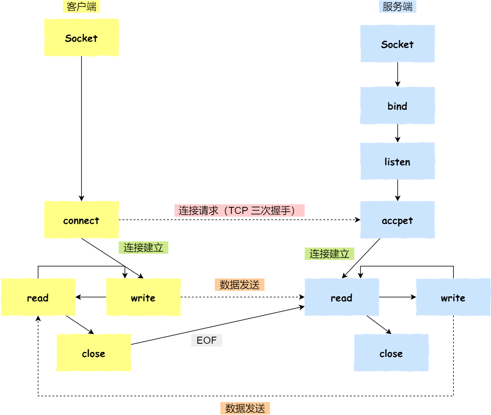
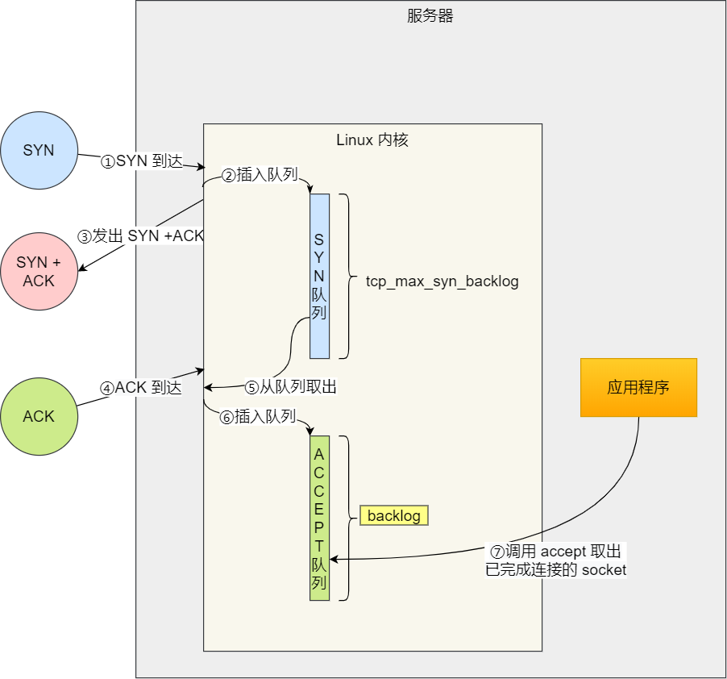
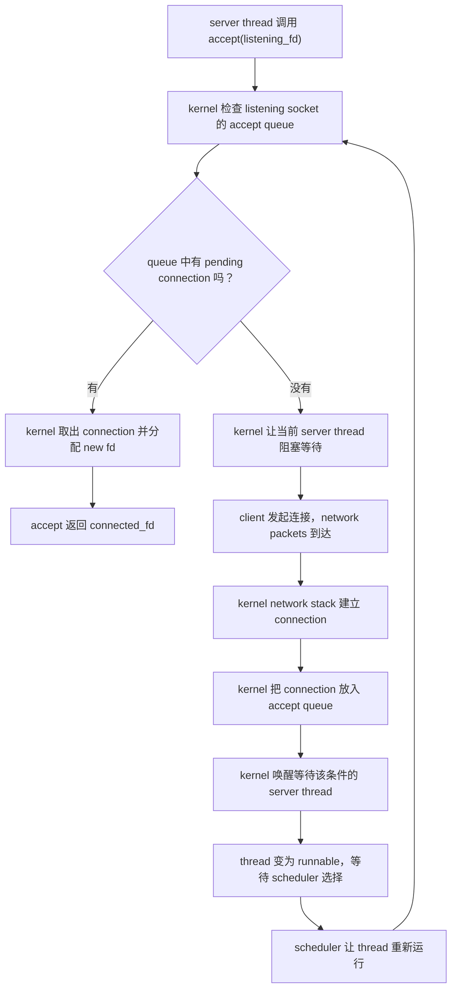

# Week6 Day4：一个 TCP server 为什么必须同时拥有两类 socket

> 今日主线：TCP server、listening socket、connected socket、`listen`、`accept`、blocking。
>
> 今日类型：机制理解 + Linux API + 独立实现。
>
> 今日产出：`tcp_echo_server_v1.cpp`。
>
> 默认编译：`g++ -std=c++17 -Wall -Wextra -g`。

今天不增加新的 MIT 6.S081 阅读任务。我们把 Week5 已经学过的：

```text
system call
-> kernel 检查条件
-> 条件暂时不成立时让 execution flow 睡眠
-> event 到来后唤醒
-> scheduler 将它重新运行
-> system call 返回
```

放进一个真实 Linux TCP server 的 `accept` / `recv` 场景中。

今天只实现：

```text
一个 server
-> accept 一个 client
-> recv 一批 bytes
-> send 一次 echo
-> 结束
```

今天暂时不实现：

```text
永久 accept loop
并发处理多个 clients
完整处理 TCP byte stream 的 message boundary
循环处理 partial send
epoll / Reactor
```

这些边界会从 Day5 开始继续推进。

---

# Part 1：前情提要与必要术语

## 1. 从 Day3 接过来的已有认识

Day3 的 UDP server 已经建立了下面这条关系：

```text
process 中的 fd
-> kernel socket object
-> local IP address + local port
-> receive queue
```

调用：

```cpp
recvfrom(socket_fd, ...);
```

而 receive queue 暂时为空时，调用者可能阻塞。

今天 TCP 仍然沿用这套基本边界：

```text
application 持有 fd
fd 引用 kernel socket object
network event 先改变 kernel 中的 socket state / queue
阻塞的 system call 再因此有机会返回
```

但 TCP 比 UDP 多出一个关键对象：

```text
connection
```

于是，一个 TCP server 不再只有一种 socket role。

---

## 2. 今天从这个问题出发

假设 server 在 `127.0.0.1:18080` 等待 clients。

如果只允许它拥有一个 socket object，那么这个 object 到底应该表示：

```text
A. 稳定存在的 127.0.0.1:18080 服务入口

还是

B. 与某一个具体 client 建立的 connection
```

这两个角色不能混成一个。

原因不只是“Linux API 就这么规定”，而是它们描述的状态本来就不同：

| 维度 | listening socket | connected socket |
|---|---|---|
| 中文 | 监听 socket | 已连接 socket |
| 表示什么 | 一个稳定的服务入口 | 与一个具体 peer 的 connection |
| local endpoint | 有，例如 `127.0.0.1:18080` | 有，例如 `127.0.0.1:18080` |
| peer endpoint | 没有固定的单一 peer | 有，例如 `127.0.0.1:53001` |
| 主要 queue | 等待 application 接走的 connections | receive/send bytes queues |
| 主要 API | `accept` | `recv` / `send` |
| 数量关系 | 通常一个服务入口一个 | 每个已接入 client 一个 |
| 生命周期 | server 提供服务期间稳定存在 | 跟随具体 connection |

一句话先压住：

> listening socket 负责“接客入口”；connected socket 负责“和这一位 client 通信”。

---

## 3. 必要术语

### 3.1 TCP

`TCP`：`Transmission Control Protocol`，传输控制协议。

当前阶段先抓住四个性质：

```text
connection-oriented：传输数据前先建立 connection
reliable：协议负责确认、重传等可靠性机制
ordered：application 按顺序得到 bytes
full-duplex：connection 两端都能发送，也都能接收
```

今天不展开 TCP 怎样用 sequence number、ACK、window 实现这些性质，相关协议机制留到 Day6。

---

### 3.2 connection

`connection`：连接。

它不是一根真实电线，也不只是“两边记住了对方 IP”。

当前可以把 TCP connection 理解为：

```text
两端 kernel 为同一条通信关系维护的一组状态
```

其中会包括：

```text
local / peer address and port
TCP state
send / receive queues
sequence / acknowledgement 等协议状态
```

今天主要看前四项，不深入协议字段。

---

### 3.3 stream 与 byte stream

`stream`：流。

TCP 使用 `SOCK_STREAM`，application 看到的是连续的 `byte stream`：字节流。

这表示 TCP 不保留 application 每次 `send` 的边界：

```text
client: send("abc", 3)
client: send("def", 3)

server 可能看到：
recv -> "abcdef"
```

也可能看到：

```text
recv -> "ab"
recv -> "cdef"
```

今天只用很短数据完成一次收发，先认识接口与两类 socket。如何在 byte stream 上恢复 application message boundary，是 Day5 主线。

---

### 3.4 endpoint 与 peer

`endpoint`：通信端点，当前写成：

```text
IP address + port
```

`peer`：通信对端。

例如 server 接受一个 client 后：

```text
local endpoint = 127.0.0.1:18080
peer endpoint  = 127.0.0.1:53001
```

这里 `53001` 只是示例。client 通常由 kernel 选择临时端口。

---

### 3.5 4-tuple

`tuple`：有顺序的一组值。

TCP connection 常用下面的 `4-tuple` 标识：

```text
(source IP, source port, destination IP, destination port)
```

站在 server 的 connected socket 视角，也可以写成：

```text
(local IP, local port, peer IP, peer port)
```

因此，多个 clients 可以同时连接同一个 server port：

```text
(127.0.0.1, 18080, 127.0.0.1, 53001)
(127.0.0.1, 18080, 127.0.0.1, 53002)
```

server 的 local port 相同，但完整 4-tuple 不同，所以是两个不同 connections。

---

### 3.6 passive open 与 active open

`passive`：被动的。

`active`：主动的。

server 调用 `listen`，准备被动接收 connection requests，这条路线常称 `passive open`。

client 调用 `connect`，主动发起 connection establishment，这条路线常称 `active open`。

今天只写 server，client 由 `nc` 代替。

---

### 3.7 pending connection 与 accept queue

`pending`：等待处理的、尚未被 application 接走的。

当 kernel 已经为某个 client 建好 connection，但 server application 还没调用 `accept` 把它取走时，它处于 `pending connection` 状态。

这些 connections 会等待在 listening socket 相关的 queue 中。今天称它为：

```text
accept queue
```

`accept` 在这里是“接收 / 接纳一个 connection”，不是接收 payload bytes。

---

### 3.8 backlog

`backlog`：积压、待处理事项。

在今天的 Linux TCP server 语境中，`listen` 的 `backlog` 参数用于指定 pending connections queue 的长度上限；kernel 还会按系统上限进行限制。

它不是：

```text
server 一生最多能服务多少 clients
server 创建多少 threads
一个 connection 最多收多少 bytes
```

---

### 3.9 blocking

`blocking`：阻塞。

blocking system call 暂时不能完成时，当前 execution flow 不继续执行下一行，而是等待条件发生变化。

今天有两个典型条件：

```text
accept：等待 accept queue 非空
recv：等待 connected socket 有 bytes，或 peer 的发送方向关闭，或发生错误
```

阻塞不等于 CPU 一直在函数里空转。

---

# Part 2：教程主体

# 教程开始

## 4. 先看完整地图，但今天只走 server 右边



> 图源：《图解网络》小林 Coding v4.0，第 295 页。读图重点：server 先形成 `socket -> bind -> listen` 的监听入口；`accept` 成功后得到用于 `read/write` 的另一个 socket。图中的三次握手只作为“kernel 建立 connection”的占位，具体 packet 流程留到 Day6。

把右半边压缩成今天的 server 路线：

```text
socket
-> setsockopt（配置 restart 行为）
-> bind（确定 local endpoint）
-> listen（变成 listening socket）
-> accept（取出一个 pending connection，返回新 fd）
-> recv / send（只操作 connected socket）
-> close
```

这里最重要的不是背函数名，而是每一步改变了谁的什么状态。

---

## 5. `accept` 前后，process 到底持有哪些对象

### 5.1 `listen` 完成后

假设 `socket` 返回 `3`：

```text
server process fd table

fd 3
  |
  v
listening socket object
  local endpoint: 127.0.0.1:18080
  state: LISTEN
  accept queue: []
```

这里还没有任何固定 peer。

所以：

```text
fd 3 不是“client A 的 connection”
fd 3 是“127.0.0.1:18080 这个服务入口”
```

---

### 5.2 一个 client connection 已建立，但 application 还没接走

kernel 中可能变成：

```text
fd 3 -> listening socket
          accept queue:
          [ connection to client A ]
```

注意执行主体：

```text
network stack 建立并保存 connection
application 尚未得到这个 connection 的 fd
```

---

### 5.3 `accept` 返回后

假设 `accept` 返回 `4`：

```text
server process fd table

fd 3 -> listening socket
        local: 127.0.0.1:18080
        role: 接受后续 connections

fd 4 -> connected socket for client A
        local: 127.0.0.1:18080
        peer:  127.0.0.1:53001
        role: recv/send bytes with client A
```

`accept` 没有把 fd 3 变成 fd 4。

它做的是：

```text
从 fd 3 所代表的监听入口取出一个 connection
-> 为 application 安装一个新的 fd
-> 新 fd 引用该 connected socket
-> fd 3 和 listening socket 保持存在
```

因此未来才能继续：

```text
fd 3 accept client B
fd 4 service client A
```

今天 server 接受一次后就退出，但对象分工从第一版就必须正确。

---

## 6. 为什么 listening socket 不能顺手拿来通信

一个 listening socket 只有稳定的 local endpoint，没有一个唯一 peer：

```text
127.0.0.1:18080
```

但此时可能同时出现：

```text
client A: 127.0.0.1:53001
client B: 127.0.0.1:53002
client C: 127.0.0.1:53003
```

如果你对 listening socket 说“发送这些 bytes”，kernel 还缺一个答案：

```text
发给哪个 connection？
```

connected socket 则已经带着唯一 peer 和 connection state，所以 `recv/send` 有明确对象。

反过来也一样：connected socket 已经属于某个具体 connection，不承担接纳其他 clients 的职责。

在 Linux 上，把 API 用错对象通常会失败；但今天更重要的是先理解对象模型，不靠背错误码记忆。

---

## 7. API 1：`socket`，先创建 TCP socket object

### 7.1 英文与用途

`socket`：原意是插口；在这里是 application 访问 kernel networking object 的接口。

头文件与签名：

```cpp
#include <sys/socket.h>

int socket(int domain, int type, int protocol);
```

今天调用：

```cpp
socket(AF_INET, SOCK_STREAM, 0)
```

### 7.2 参数

```text
domain = AF_INET
    IPv4 address family

type = SOCK_STREAM
    ordered byte-stream socket；通常由 TCP 提供

protocol = 0
    让 kernel 按 domain + type 选择默认 protocol
```

Day3 的差别只有 `type`：

```text
Day3 UDP: SOCK_DGRAM
Day4 TCP: SOCK_STREAM
```

但这一个差别会引出 connection、listen、accept 和 byte stream。

### 7.3 返回值、状态与 ownership

```text
成功：返回 >= 0 的 fd
失败：返回 -1，并设置 errno
```

成功后：

```text
kernel 创建一个尚未 bind、尚未 listen、尚未 connected 的 socket object
process fd table 增加一个 fd 对它的引用
application 拥有关闭这个 fd 的责任
```

### 7.4 独立最小例子

```cpp
const int raw_fd = ::socket(AF_INET, SOCK_STREAM, 0);
if (raw_fd == -1) {
    std::perror("socket");
    return 1;
}

UniqueFd socket_fd(raw_fd);
```

这个片段只说明怎样创建并接管 ownership，不是完整 server。

---

## 8. API 2：`setsockopt`，给 socket 设置 option

### 8.1 英文与用途

`setsockopt`：`set socket option`，设置 socket 选项。

头文件与签名：

```cpp
#include <sys/socket.h>

int setsockopt(
    int socket_fd,
    int level,
    int option_name,
    const void* option_value,
    socklen_t option_length
);
```

它是通用配置入口，不只服务 TCP。

### 8.2 今天使用的 option：`SO_REUSEADDR`

拆词：

```text
SO      = socket option
REUSE   = reuse，重新使用
ADDR    = address，地址
```

今天把它理解为：

> 在满足 kernel 规则的情况下，放宽 `bind` 对 local address 重用的限制，使 server 重启时更少因旧连接状态而无法重新绑定。

它不表示：

```text
允许两个仍在运行的 listening servers 随意占用完全相同的 address/port
让 TCP 变可靠
自动重试 bind
允许忽略 bind 的错误
```

必须仍然检查 `setsockopt` 和 `bind` 的返回值。

### 8.3 参数

今天的调用关系：

```text
socket_fd    = 要配置的 socket fd
level        = SOL_SOCKET，socket layer 的通用 option
option_name  = SO_REUSEADDR
option_value = 指向 int enable 的 pointer
option_length= sizeof(enable)
```

### 8.4 返回值与状态

```text
成功：0，socket option 被设置
失败：-1，errno 描述原因
```

它不创建新 fd，也不转移 ownership。

今天应在 `bind` 前设置，因为这个 option 影响后续 local address validation。

### 8.5 独立最小例子

```cpp
const int enable = 1;
if (::setsockopt(
        socket_fd.get(),
        SOL_SOCKET,
        SO_REUSEADDR,
        &enable,
        sizeof(enable)) == -1) {
    std::perror("setsockopt");
    return 1;
}
```

这里 `option_value` 是 `const void*`，因此可以传任何 option 对应的数据地址；`option_name` 决定 kernel 怎样解释这些 bytes。

---

## 9. `bind`：把稳定的 local endpoint 交给 socket

Day3 已经完整使用过 `bind`，今天只复习它在 TCP server 中改变的状态。

```cpp
#include <sys/socket.h>

int bind(
    int socket_fd,
    const sockaddr* address,
    socklen_t address_length
);
```

成功前：

```text
TCP socket object 没有 application 明确指定的 local endpoint
```

成功后：

```text
socket object
-> local IP = 127.0.0.1
-> local port = 18080
```

今日仍只 bind loopback：

```text
127.0.0.1:18080
```

这样只有本机能够访问，先把变量控制在 application 与 local kernel 内。

### 9.1 独立最小例子

假设 `local_address` 已按 Day3 的方式填好：

```cpp
if (::bind(
        socket_fd.get(),
        reinterpret_cast<const sockaddr*>(&local_address),
        sizeof(local_address)) == -1) {
    std::perror("bind");
    return 1;
}
```

常见失败方向：

```text
EADDRINUSE
    address already in use；该 local address/port 按当前规则不能绑定

EACCES
    permission denied；没有权限使用该地址
```

不要只写“bind 失败”，要结合 `perror` 观察 `errno` 对应原因。

---

## 10. API 3：`listen`，让 socket 变成被动监听入口

### 10.1 英文与用途

`listen`：监听。

头文件与签名：

```cpp
#include <sys/socket.h>

int listen(int socket_fd, int backlog);
```

它的核心状态变化是：

```text
bound TCP socket
-> passive listening socket
```

从此它的职责是接收 connection requests，并为 application 保留 pending connections。

### 10.2 参数

```text
socket_fd
    要进入 LISTEN state 的 TCP socket fd

backlog
    kernel pending connection queue 的请求长度上限
```

例如：

```cpp
constexpr int kBacklog = 8;
```

今天选 `8` 只是一个小实验值，不是性能调优结论。

在现代 Linux 中，kernel 还会使用 `net.core.somaxconn` 限制有效上限。因此不能简单理解成 kernel 无条件精确创建长度为 `backlog` 的数组。

### 10.3 返回值与状态

```text
成功：0，socket 成为 listening socket
失败：-1，errno 描述原因
```

`listen`：

```text
不返回新 fd
不接受某一个具体 client
不接收 payload bytes
```

### 10.4 独立最小例子

```cpp
constexpr int kBacklog = 8;

if (::listen(socket_fd.get(), kBacklog) == -1) {
    std::perror("listen");
    return 1;
}
```

成功后应把这个 object 叫作：

```text
listening socket
```

而不是含糊地叫“那个 socket”。

---

## 11. `backlog` 与 accept queue：今天只读图的右下部分



> 图源：《图解网络》小林 Coding v4.0，第 296 页。今日读图重点只有绿色 `ACCEPT queue`、`backlog` 与 application 调用 `accept` 的箭头。左侧 `SYN queue` 和三次握手状态会在 Day6 专门学习，今天不要求记忆。

把今天需要的部分压缩成：

```text
kernel 已经建立一个 connection
-> 放入 listening socket 的 accept queue
-> application 调用 accept
-> kernel 从 queue 取出一个 connection
-> 为 application 返回 connected socket fd
```

一个非常重要的边界：

> `accept` 不是亲自发送 TCP handshake packets 的函数。

application 调用 `accept` 后可以阻塞等待；真正的 network packets 和 TCP state transitions 由 kernel network stack 处理。connection 准备好并排进 queue 后，`accept` 才能取出它。

因此，即使 application 暂时没有及时调用 `accept`，kernel 仍可能先完成若干 connections，并把它们暂存在 queue 中，直到 queue 达到限制。

---

## 12. API 4：`accept`，从监听入口取出一个 connection

### 12.1 英文与用途

`accept`：接受、接纳。

头文件与签名：

```cpp
#include <sys/socket.h>

int accept(
    int listening_fd,
    sockaddr* peer_address,
    socklen_t* peer_address_length
);
```

它的输入对象与输出对象不同：

```text
input：listening socket fd
output：new connected socket fd
```

### 12.2 参数

```text
listening_fd
    已成功 listen 的 socket fd

peer_address
    output parameter；kernel 把 peer address 写入这里

peer_address_length
    value-result parameter
    调用前：application 写入 buffer capacity
    返回后：kernel 写入实际 address length
```

如果暂时不需要 peer address，可以传：

```cpp
::accept(listening_fd, nullptr, nullptr)
```

今天建议接收 peer address，因为它能直接证明 connected socket 对应的是哪一个 client。

### 12.3 返回值、状态与 ownership

```text
成功：返回一个新的 connected socket fd
失败：返回 -1，并设置 errno
```

成功后：

```text
accept queue 少一个 connection
process fd table 多一个 fd
new fd 引用 connected socket
listening fd 仍然有效，原 listening socket 不受影响
application 获得关闭 new fd 的责任
```

因此 raw fd 一返回，就应尽快交给 `UniqueFd`。

### 12.4 `peer_address_length` 为什么先写后读

```cpp
sockaddr_in peer_address{};
socklen_t peer_length = sizeof(peer_address);
```

调用前的 `peer_length` 告诉 kernel：

```text
application 提供的 address buffer 有多大
```

调用返回后，它告诉 application：

```text
kernel 实际写入 / 返回的 address 长度是多少
```

这与 Day3 `recvfrom` 的 address output 参数模式相同。

### 12.5 独立最小例子

```cpp
sockaddr_in peer_address{};
socklen_t peer_length = sizeof(peer_address);

const int raw_connected_fd = ::accept(
    listening_fd.get(),
    reinterpret_cast<sockaddr*>(&peer_address),
    &peer_length
);

if (raw_connected_fd == -1) {
    std::perror("accept");
    return 1;
}

UniqueFd connected_fd(raw_connected_fd);
```

此处必须保留两个不同名字：

```text
listening_fd
connected_fd
```

不要都叫 `socket_fd`，否则对象角色会在代码里重新混起来。

---

## 13. accept queue 为空时，`accept` 为什么会阻塞

下面把执行主体、条件、状态变化和恢复位置完整串起来。



压缩成文本：

```text
server thread 调用 accept
-> kernel 发现 accept queue 为空
-> server thread 阻塞
-> client 发起 connection
-> kernel network stack 建立 connection
-> connection 进入 accept queue
-> 等待者被唤醒为 runnable
-> scheduler 将它重新运行
-> kernel 再确认条件并取出 connection
-> accept 返回 new connected fd
```

和 Week5 的联系：

```text
accept queue 非空
```

就是 `accept` 当前等待的 condition。

network event 改变 kernel state 后，等待者才有继续完成 system call 的条件。

注意：

```text
wake up != 立刻获得 CPU
wake up != accept 已经在 user mode 返回
```

它至少还要等 scheduler 让该 thread 运行，并由 kernel 完成剩余工作。

---

## 14. API 5：`recv`，从 connected socket 读取 bytes

### 14.1 英文与用途

`recv`：`receive` 的缩写，接收。

头文件与签名：

```cpp
#include <sys/socket.h>

ssize_t recv(
    int connected_fd,
    void* buffer,
    size_t capacity,
    int flags
);
```

### 14.2 参数

```text
connected_fd
    已连接 socket fd，不是 listening fd

buffer
    output buffer；kernel 将收到的 bytes 复制到这里

capacity
    buffer 最多能接收多少 bytes

flags
    今天使用 0，不启用额外行为
```

### 14.3 返回值与状态

```text
> 0
    本次实际读取的 byte count

== 0
    peer 已 orderly shutdown 它的发送方向，并且之前排队的 bytes 已读完

== -1
    调用失败，errno 描述原因
```

`recv == 0` 不表示：

```text
buffer 第一个 byte 恰好是 '\0'
收到了一条 zero-length UDP datagram
```

TCP 的 `0` 表示 stream 的 EOF 条件；这和 Day3 UDP 不同。

### 14.4 blocking 条件

对 blocking connected socket：

```text
没有 bytes
并且 peer 的发送方向仍然打开
并且没有 terminal error
```

此时 `recv` 可以阻塞。

完整路径与 `accept` 相似，只是等待对象不同：

```text
accept 等 listening socket 的 pending connection
recv 等 connected socket 的 bytes / EOF / error
```

### 14.5 独立最小例子

```cpp
std::array<char, 1024> buffer{};

const ssize_t received = ::recv(
    connected_fd.get(),
    buffer.data(),
    buffer.size(),
    0
);

if (received == -1) {
    std::perror("recv");
    return 1;
}

if (received == 0) {
    std::cout << "peer closed its sending side\n";
    return 0;
}
```

后续处理必须使用 `received`，不要对 receive buffer 使用 `strlen`。

---

## 15. API 6：`send`，向 connected socket 提交 bytes

### 15.1 英文与用途

`send`：发送。

头文件与签名：

```cpp
#include <sys/socket.h>

ssize_t send(
    int connected_fd,
    const void* buffer,
    size_t length,
    int flags
);
```

### 15.2 参数

```text
connected_fd
    已连接 socket fd

buffer
    要提交的 bytes 起始地址

length
    请求提交的 byte count

flags
    今天使用 0
```

它不需要像 UDP `sendto` 那样每次再传 peer address，因为 connected socket 已经保存唯一 peer。

### 15.3 返回值与保证边界

```text
>= 0
    本次成功提交的 byte count

== -1
    调用失败，errno 描述原因
```

关键边界：

```text
send 返回成功
!= peer application 已经 recv 到这些 bytes
```

它只表示 local kernel 接受了相应 bytes 进入后续发送流程。

而且 TCP 是 byte stream：

```text
send 可能只处理请求长度的一部分
```

完整程序必须循环到全部 bytes 被提交；这是 Day5 的 `send_all` 主线。

今天 v1 只调用一次 `send`，但必须检查：

```text
sent == received
```

如果不相等，要明确报告“v1 遇到 partial send”，不能假装 echo 完整成功。

### 15.4 独立最小例子

假设 `received > 0`：

```cpp
const ssize_t sent = ::send(
    connected_fd.get(),
    buffer.data(),
    static_cast<std::size_t>(received),
    0
);

if (sent == -1) {
    std::perror("send");
    return 1;
}

if (sent != received) {
    std::cerr << "partial send in v1\n";
    return 1;
}
```

这是刻意暴露 v1 边界，不是最终工程写法。

---

## 16. 六个 API 组合后，各自只负责哪一步

| API | 操作对象 | 状态变化 / 结果 | 是否产生新 fd |
|---|---|---|---:|
| `socket` | kernel networking subsystem | 创建 fresh TCP socket object | 是 |
| `setsockopt` | fresh/bound socket | 设置 socket option | 否 |
| `bind` | TCP socket | 指定 local endpoint | 否 |
| `listen` | bound TCP socket | 变成 listening socket | 否 |
| `accept` | listening socket | 取出 pending connection | 是 |
| `recv` | connected socket | 从 byte stream 取出当前可读 bytes | 否 |
| `send` | connected socket | 向 byte stream 提交 bytes | 否 |

对象链：

```text
socket
-> fresh socket fd

bind + listen
-> 同一个 fd 现在引用 listening socket

accept(listening fd)
-> listening fd 保留
-> 另返回 connected fd

recv/send(connected fd)
-> 与一个具体 peer 通信
```

---

## 17. 两个 fd 的 ownership 与关闭顺序

今天 server 同时拥有：

```text
listening_fd
connected_fd
```

它们是两个独立 resources，必须分别释放。

推荐继续使用你已经掌握的 `UniqueFd`：

```text
raw listening fd -> 立刻交给 UniqueFd listening_fd
raw connected fd -> accept 成功后立刻交给 UniqueFd connected_fd
```

如果 `recv` 或 `send` 中途失败，stack unwinding / normal scope exit 都会分别关闭两个 fd。

今天不重复重写 `UniqueFd`。可以把已通过的 `unique_fd.hpp` 放到同目录，然后使用：

```cpp
#include "unique_fd.hpp"
```

不要写 Windows 或 Ubuntu 上某台机器的 absolute include path。

生命周期可以画成：

```text
main scope starts
  |
  +-- listening_fd owns fd 3
  |
  +-- accept succeeds
       |
       +-- connected_fd owns fd 4
       |
       +-- recv/send
       |
       +-- connected_fd leaves scope -> close fd 4
  |
  +-- listening_fd leaves scope -> close fd 3
```

今天 server 只处理一个 client，所以两个对象都在 `main` 结束时释放即可。

---

## 18. 今日最容易混淆的边界

### 18.1 `listen` 不是“不断调用 accept”

`listen` 只改变 socket role 并建立 kernel 监听状态。

它不执行 application-level loop。

---

### 18.2 `accept` 不是接收 client payload

```text
accept 接收的是 connection
recv 接收的是 bytes
```

---

### 18.3 `accept` 不把 listening fd 改成 connected fd

```text
listening fd remains
accept returns another fd
```

---

### 18.4 `backlog` 不是最大总连接数

它描述 pending connection queue 的上限语义，不统计已经被 application `accept` 取走并正在服务的全部 connections。

---

### 18.5 TCP 一次 `send` 不对应一次 `recv`

今天只为 v1 做一次短数据实验。

如果观察到拆分或合并，不是 TCP 坏了，而是 application 错把 byte stream 当成 datagram。

---

### 18.6 `recv == 0` 不是读取到了字符 `\0`

```text
byte '\0'：payload 中一个数值为 0 的 byte，仍计入 received count
recv return 0：TCP stream 到达 EOF condition
```

---

### 18.7 `SO_REUSEADDR` 不是无条件抢占 port

仍在运行的 listening server 已占用相同 local endpoint 时，新 server 的 `bind` 通常仍会失败。

---

### 18.8 server 没启动时，TCP client 与 UDP client 的直觉不同

TCP client 要建立 connection。如果目标 local endpoint 没有 listener，`connect` 通常会失败并报告 `Connection refused`。

UDP `sendto` 没有同样的 connection establishment 前置步骤，因此 application 当次发送成功不代表 server 存在。

---

# Part 3：收尾、练习、测试与验收

## 19. 今日主项目：独立实现 `tcp_echo_server_v1.cpp`

教程到这里已经给完所需 API，但没有把它们拼成完整 server。

你的任务是自己组织控制流。

### 19.1 功能需求

实现一个 blocking、single-client、single-batch TCP echo server：

```text
1. 创建 IPv4 TCP socket
2. 设置 SO_REUSEADDR
3. bind 到 127.0.0.1:18080
4. listen，backlog 使用 8
5. 输出一行 ready 信息
6. accept 一个 client，并保存 peer address
7. 打印 peer IP 和 peer port
8. recv 最多 1024 bytes
9. 如果 recv > 0，只调用一次 send echo 回去
10. 检查 sent 是否等于 received
11. server 处理完这一个 client 后结束
```

不要增加永久 loop。这不是遗漏，而是今天的边界。

---

### 19.2 对象命名要求

代码中必须能一眼区分：

```text
listening_fd
connected_fd
local_address
peer_address
peer_length
```

不允许把两个 fd 都叫：

```text
socket_fd
```

因为今天的核心就是对象角色不同。

---

### 19.3 error handling 契约

下面每个 API 都必须检查返回值：

```text
socket
setsockopt
inet_pton
bind
listen
accept
inet_ntop（如果用它打印 peer IP）
recv
send
```

失败时：

```text
perror / 清楚的 error message
-> return non-zero
```

特殊分支：

```text
recv == 0
-> 打印 peer closed its sending side
-> 不调用 send
-> 正常结束
```

```text
0 < sent < received
-> 打印 partial send in v1
-> return non-zero
```

今天不要求实现：

```text
EINTR retry loop
SIGPIPE policy
send_all
```

但不能忽略返回值。

---

### 19.4 ownership 契约

必须保证：

```text
listening fd 恰好关闭一次
connected fd 恰好关闭一次
任一中途 return 都不泄漏已经成功取得的 fd
```

推荐复用 `UniqueFd`，不要为了今天再写一遍 RAII class。

---

### 19.5 data contract

今天 server 不把 receive buffer 当 C string。

打印或 echo 数据时使用：

```text
recv 返回的实际 byte count
```

不得使用：

```cpp
std::strlen(buffer.data())
```

也不要手动补 `\0` 后再决定 echo 长度。

---

### 19.6 注释要求

文件顶部简短写清：

```text
这个程序实现什么
如何编译
如何使用 nc 验证
这是 single-client / single-batch v1
```

在关键位置说明：

```text
SO_REUSEADDR 为什么在 bind 前
listen 后原 fd 的 role
accept 为什么产生另一个 fd
recv == 0 的含义
为什么检查 sent == received
```

不要写这种空注释：

```cpp
// Call accept.
// Receive data.
```

---

## 20. 编译

在 Ubuntu 的 `week6/day4` 目录：

```bash
g++ -std=c++17 -Wall -Wextra -g tcp_echo_server_v1.cpp -o tcp_echo_server_v1
```

通过标准：

```text
编译成功
0 warnings
```

如果复用 `unique_fd.hpp`，确保它位于当前目录并使用 project-relative include：

```cpp
#include "unique_fd.hpp"
```

---

## 21. 测试顺序

### 21.1 server 不存在时先连接

确认 18080 当前没有 listener：

```bash
nc -vz 127.0.0.1 18080
```

预期：

```text
connection failed / Connection refused
```

记录：

```text
TCP client 为什么能在发送 payload 前发现当前没有 listener？
```

今天答案只需到：TCP 先建立 connection。

---

### 21.2 启动 server 并观察 LISTEN

终端 A：

```bash
./tcp_echo_server_v1
```

它应打印 ready，然后阻塞在 `accept`。

终端 B：

```bash
ss -lntp | grep ':18080'
```

你应能找到：

```text
LISTEN
127.0.0.1:18080
```

此时回答：

```text
process 中哪个 fd 对应这个 LISTEN entry？
它为什么还没有唯一 peer？
```

---

### 21.3 让 `accept` 返回，但暂时不发送 bytes

终端 B：

```bash
nc 127.0.0.1 18080
```

先不要输入内容。

此时：

```text
client connection 建立
accept 返回 connected fd
server 随后阻塞在 recv
```

终端 C：

```bash
ss -ntp | grep ':18080'
```

应能观察到 connection 的 `ESTAB` 状态。

然后在终端 B 输入：

```text
hello tcp
```

按 Enter。

预期看到 echo，随后 v1 server 结束。

注意：终端输入会包含 newline，因此收到的 bytes 通常包括 `\n`。

---

### 21.4 一条命令做短数据验证

重新启动 server 后，在另一个终端：

```bash
printf 'T' | nc -q 1 127.0.0.1 18080
```

预期 stdout：

```text
T
```

这里没有 newline；terminal prompt 可能紧跟在 `T` 后面，那不是额外 payload。

今天只用一个 byte 降低实验变量，但不能由此推导 TCP 保留 send boundary。

---

### 21.5 观察两个 blocking points

使用 `strace` 启动 server：

```bash
strace -e trace=network,close ./tcp_echo_server_v1
```

观察两个阶段：

```text
阶段 A：还没有 client
-> accept(...) 暂时不能返回

阶段 B：client 已连接但没有输入
-> accept 返回 new fd
-> recv(...) 暂时不能返回
```

完成后在 note 中写出：

```text
accept 等什么 condition
recv 等什么 condition
哪个 fd 出现在 accept
哪个 fd 出现在 recv/send
```

在当前 Ubuntu/glibc 环境中，你可能看到：

```text
source code 调用 recv
strace 显示 recvfrom

source code 调用 send
strace 显示 sendto
```

这不是程序偷偷改变了 API 语义。`recv` / `send` 是 application 调用的 library wrapper；在 Linux 上，wrapper 可以借用更通用的底层 system call 完成工作。

今天观察重点是：

```text
accept 使用 listening fd
recvfrom/sendto 的底层记录使用 connected fd
return value 与实际 byte count 一致
```

---

### 21.6 client 连接后直接关闭发送方向

重新启动 server：

```bash
./tcp_echo_server_v1
```

另一个终端把已经处于 EOF 的 stdin 交给 `nc`：

```bash
nc -q 1 127.0.0.1 18080 < /dev/null
```

预期 server 最终观察：

```text
recv == 0
```

并走“peer closed its sending side”分支，不调用 `send`。

`/dev/null` 在读取时立即返回 EOF，所以 `nc` 建立 connection 后不会提供 payload，并关闭自己的发送方向。`-q 1` 表示 stdin EOF 后等待 1 秒再退出。

不同 `nc` implementation 的 option 可能不同；当前 Ubuntu 已验证上述 OpenBSD `nc` 写法可用。核心验收仍是代码正确区分 `recv > 0 / == 0 / == -1`。

---

## 22. 推荐的 `day4_note.md` 结构

不需要复制教程，只记录你的因果链、实验与问题。

```markdown
# Week6 Day4 Note

## 1. 为什么 TCP server 需要两类 socket

## 2. socket -> bind -> listen -> accept 的状态变化

## 3. accept blocking 的完整因果链

## 4. listening_fd 与 connected_fd 的实验观察

## 5. recv 返回值与 send v1 边界

## 6. 错误实验与修正

## 7. 验收问题
```

如果今天某一部分已经能稳定讲清楚，可以只写压缩版，不做重复抄写。

---

## 23. 验收问题

### 问题 1

为什么 `accept` 成功后必须返回一个新的 fd，而不能把 listening fd 直接改成 connected fd？

回答时至少从下面三个角度解释：

```text
role
lifetime
one listener vs many connections
```

### 问题 2

依次说明下面四步分别改变了什么：

```text
socket
bind
listen
accept
```

其中哪些会产生新 fd？

### 问题 3

当 server 阻塞在 `accept` 时：

```text
谁调用 accept？
kernel 检查哪个 condition？
谁改变这个 condition？
server thread 被唤醒后是否一定立刻运行？
```

请串成完整因果链。

### 问题 4

`backlog = 8` 是否表示：

```text
server 一生最多接受 8 个 clients？
server 最多只能同时有 8 个 connected sockets？
```

如果都不是，它限制的是什么？

### 问题 5

下面两个调用分别应该使用哪个 fd，为什么？

```cpp
::accept(?, ...);
::recv(?, ...);
```

### 问题 6

TCP `recv` 的三个返回值区间分别表示什么？

特别解释：

```text
recv == 0
```

为什么不是“读取到了字符 `\0`”？

### 问题 7

为什么 `send` 返回正数，也不能说明 peer application 已经处理了这些 bytes？

为什么 v1 仍要检查：

```cpp
sent == received
```

### 问题 8

`SO_REUSEADDR` 今天解决哪类问题？它为什么不等于“允许两个 active servers 随意监听同一 endpoint”？

### 问题 9

下面两个 connections 能否同时存在？为什么？

```text
(127.0.0.1, 18080, 127.0.0.1, 53001)
(127.0.0.1, 18080, 127.0.0.1, 53002)
```

### 问题 10

用不超过 12 行文本画出一条完整路径：

```text
client 发起 connection
-> accept 返回
-> client 发送 bytes
-> recv 返回
-> server echo
```

每一步必须写明是 client application、server application 还是 kernel 在做。

---

## 24. 今日通过标准

满足下面条件即可进入 Day5：

```text
[ ] 能解释为什么有 listening socket 与 connected socket
[ ] 能解释 socket / bind / listen / accept 各自只负责什么
[ ] 不再把 accept 理解成接收 payload
[ ] 能完整串出 accept blocking -> wakeup -> scheduled -> return
[ ] 知道 backlog 限制 pending connection queue，不是总 client 数
[ ] 能区分 recv > 0、recv == 0、recv == -1
[ ] 知道 TCP 是 byte stream，今天的一次 recv/send 只是 v1 边界
[ ] tcp_echo_server_v1.cpp 编译 0 warnings
[ ] server absent、LISTEN、ESTAB、echo 四个观察完成
[ ] listening fd 与 connected fd 都恰好释放一次
[ ] 验收问题能用自己的话回答
```

---

## 25. 今日压缩记忆

```text
socket 创建 TCP socket object
bind 指定 stable local endpoint
listen 把它变成 listening socket
kernel 把已建立但未被 application 接走的 connection 放进 accept queue
accept 从 queue 取出一个 connection，并返回新的 connected fd
listening fd 继续负责入口
connected fd 只负责与一个 peer recv/send
accept queue 为空时 accept 阻塞
connected receive queue 无 bytes 且 peer 未关闭时 recv 阻塞
```

最核心的一句：

> TCP server 不是“拿一个 socket 做完所有事”，而是用一个长期 listening socket 接受 connections，再为每个具体 connection 使用独立 connected socket。

---

## 26. 今日资料

官方接口语义：

- Linux manual page：`socket(2)`、`setsockopt(2)`、`bind(2)`、`listen(2)`、`accept(2)`、`recv(2)`、`send(2)`、`tcp(7)`。
- 《图解网络》小林 Coding v4.0，第 295、296 页。

阅读边界：

```text
今天读 socket API sequence
今天读 listening socket / connected socket
今天读 accept queue 与 backlog 第一层
Day5 再处理 TCP byte stream 和 partial I/O
Day6 再处理三次握手、状态与 packet-level 因果链
```
