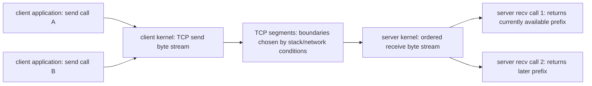
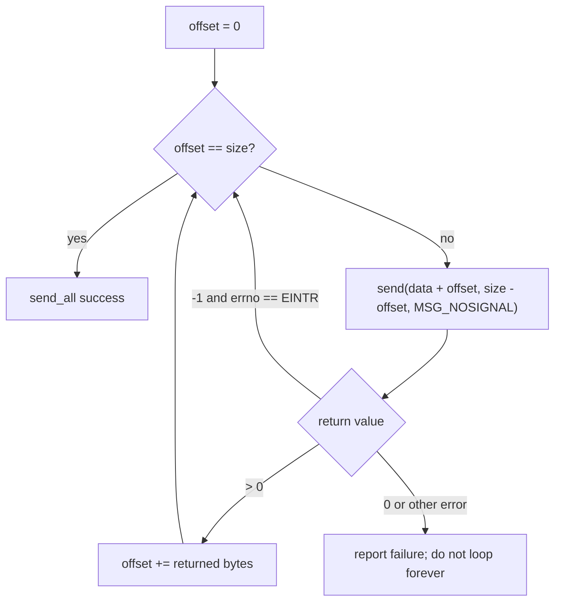
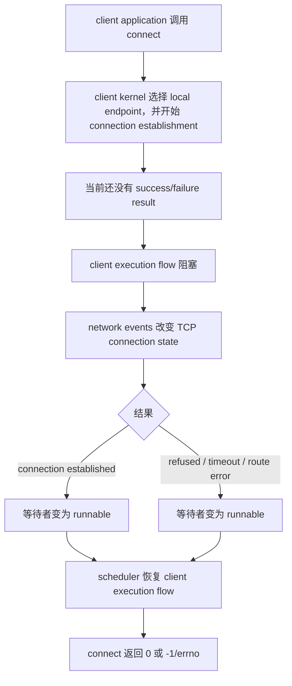
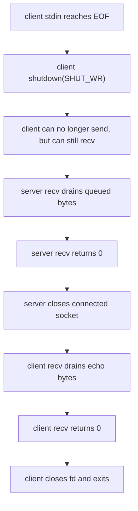
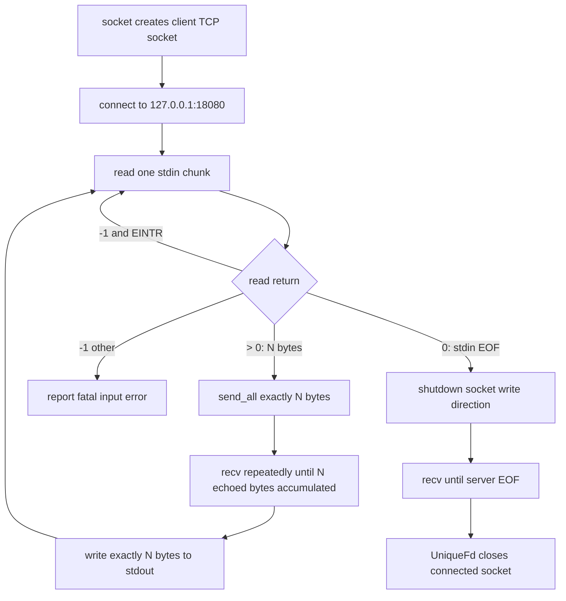
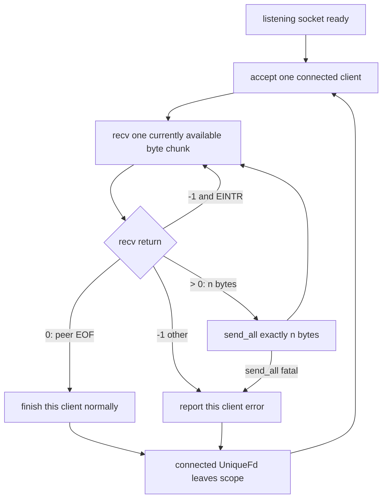

# Week6 Day5：TCP 是 byte stream，所以正确性必须由返回值和 protocol 决定

> 今日主线：TCP client、`connect`、byte stream、partial I/O、`EINTR`、EOF、half-close。
>
> 今日类型：机制理解 + 独立实现 + 错误路径验证。
>
> 今日产出：`tcp_client.cpp`，并把 Day4 的 v1 server 升级为 `tcp_echo_server.cpp`。
>
> 默认编译：`g++ -std=c++17 -Wall -Wextra -g`。

今天不新增 MIT 6.S081 阅读范围。

我们只复用已经建立的两条主线：

```text
Week4：read/write 的 ssize_t 返回值决定真实进度
Week5：blocking system call 条件不满足时，execution flow 睡眠等待
Week6 Day4：listening socket 接 connection，connected socket 收发 bytes
```

今天把 Day4 的“单连接、一次 `recv`、一次 `send`”升级为：

```text
client 能主动 connect
server 能顺序处理多个 clients
每个 connection 能循环收发任意长度的 byte stream
所有进度都由实际 return value 推进
EINTR 可以重试
EOF 与 error 分开
```

今天仍然不进入：

```text
nonblocking socket
select / poll / epoll
concurrent clients
Reactor
TCP 三次握手 packet 细节
HTTP message parsing
```

---

# Part 1：前情提要与必要术语

## 1. 从 Day4 接过来的对象关系

开始 Day5 前，应该已经见过两类 fd：

```text
listening_fd
    -> listening socket
    -> 负责 accept connections

connected_fd
    -> connected socket
    -> 负责 recv/send bytes with one peer
```

Day4 的 v1 故意只做：

```text
accept once
recv once
send once
exit
```

这能看清对象角色，但还不是可复用的 echo service。

Day5 不重新讲 `socket/bind/listen/accept` 的基础签名，只修复 v1 的三个边界：

```text
1. client 还没有自己实现 connect
2. 一次 send/recv 不能代表完整 stream
3. peer EOF 后 server 还不能回到 accept 下一个 client
```

---

## 2. 今天从一个错误假设出发

client application 连续调用：

```cpp
send(fd, "Hi.", 3, ...);
send(fd, "I am Xiaolin", 12, ...);
```

server 是否一定看到：

```text
recv #1 -> "Hi."
recv #2 -> "I am Xiaolin"
```

答案是：不保证。

TCP 向 application 提供的是：

```text
ordered byte stream
```

而不是：

```text
send-call message queue
```

因此正确程序不能根据“我调用了几次 `send`”猜测“对面会调用几次 `recv`”。

---

## 3. 必要术语

### 3.1 TCP client

`client`：客户端，主动向某个 server endpoint 发起 connection 的 application role。

今天的 client 路线是：

```text
socket
-> connect
-> send/recv
-> shutdown/close
```

server 与 client 是角色，不是固定机器类型。同一台 Ubuntu 上也可以同时运行 client process 和 server process。

---

### 3.2 byte stream

`byte stream`：字节流。

TCP 保证 application 最终按顺序读取 bytes，但不替 application 保留每次 `send` 的边界。

可以先想成一条编号的 bytes 序列：

```text
offset: 0 1 2 3 4 5 6 7 ...
byte:   H i . I   a m   ...
```

`recv` 每次只是从当前可用的前缀取走一段。

---

### 3.3 partial I/O

`partial`：部分的。

`I/O`：`Input/Output`，输入/输出。

`partial I/O` 表示一次调用只完成请求的一部分。

例如：

```text
请求 send 1000 bytes
return 320
```

这 320 bytes 已经成功推进；剩下 680 bytes 仍由 application 负责。

---

### 3.4 short read

`short read`：短读，读取结果小于请求 capacity。

例如：

```text
recv capacity = 1024
recv return   = 37
```

这通常不是错误，只表示这次取到 37 bytes。

尤其对 TCP，`recv` 不会为了填满 1024 bytes 才返回。当前 receive queue 有多少可返回 bytes，会影响本次结果。

---

### 3.5 offset 与 progress

`offset`：偏移量。

`progress`：已完成进度。

当目标是发送 `size` bytes 时，需要维护：

```text
0 <= offset <= size
```

循环 invariant：

```text
data[0, offset) 已成功提交
data[offset, size) 仍待发送
```

每次只有 `send` 的正返回值才能增加 offset。

---

### 3.6 EINTR

`EINTR`：`Interrupted system call`，系统调用被 signal 中断。

它是 `errno` 的一个值。

当前理解：

```text
execution flow 正在 blocking system call
-> process 收到并处理某个 signal
-> system call 没有完成当前传输
-> wrapper 向 application 返回 -1
-> errno == EINTR
```

部分 Linux system calls 可能因 signal handler 的配置自动重启，但代码仍必须能正确处理真正暴露出来的 `EINTR`。

---

### 3.7 transient error 与 fatal error

`transient`：暂时的。

`fatal`：当前 operation 无法按原方式继续的。

今天的 blocking I/O policy：

```text
errno == EINTR
    -> transient，重新尝试当前尚未完成的 operation

其他 errno
    -> 当前 connection 的 fatal error，报告并结束该 connection/program
```

未来进入 nonblocking I/O 后，`EAGAIN/EWOULDBLOCK` 会成为另一类正常状态；今天暂不处理。

---

### 3.8 EOF

`EOF`：`End Of File`，传统名称是文件结束。

在 TCP stream 上：

```text
recv(..., capacity > 0, ...) == 0
```

表示 peer 已经 orderly shutdown 它的发送方向，并且之前到达的 bytes 已读完。

EOF 不是 error，也不是 payload 中的 `\0`。

---

### 3.9 full-duplex 与 half-close

`full-duplex`：全双工，两个方向可以独立传输：

```text
client -> server
server -> client
```

`half-close`：半关闭，只关闭其中一个方向。

今天 client 发送完 stdin 后会：

```text
shutdown(SHUT_WR)
```

意思是：

```text
client 不再发送
但 client 仍然可以继续 recv server 的 echo 和 EOF
```

---

### 3.10 SIGPIPE 与 EPIPE

`SIGPIPE`：写入已失去 reader/peer 的 stream 时，kernel 可能发送给 process 的 signal。

`EPIPE`：`Broken pipe` 对应的 errno。

如果不做处理，`SIGPIPE` 的默认行为可能直接终止 process，使你的 error branch 根本没有机会运行。

今天使用 Linux/POSIX socket flag：

```text
MSG_NOSIGNAL
```

让 `send` 不产生 `SIGPIPE`，而是通过 `-1 / EPIPE` 把错误交给代码处理。

---

### 3.11 application protocol 与 framing

`protocol`：协议，通信双方共同遵守的规则。

`framing`：在 byte stream 上确定一条 application message 的范围。

TCP 只交付 ordered bytes。下面这些边界必须由 application protocol 自己定义：

```text
fixed length
delimiter
length prefix
EOF
```

今天的 echo pair 使用一个受控 contract：

```text
client 本轮发送 N bytes
server 原样 echo
client 累计收到 N bytes，才认为本轮 echo 完成
```

这里的 `N` 来自 application 自己的计数，不是 TCP 自动保存了 `send` boundary。

---

# Part 2：教程主体

# 教程开始

## 4. TCP 为什么不能保存两次 `send` 的 message boundary

发送方 application 想发送两条消息：

```text
message A = "Hi."
message B = "I am Xiaolin"
```

下面三张图展示 transport 可能怎样组织这些 bytes。

### 4.1 两条 application messages 出现在同一个 TCP segment


### 4.2 第二条 message 被切开


### 4.3 第一条 message 自己也可能被切开


> 图源：《图解网络》小林 Coding v4.0，第 464 页。读图重点：application message boundary 不约束 TCP 怎样分组。更进一步，receiver 的 `recv` boundary 也不等于图中的 TCP segment boundary；ordinary `recv` 只看到 kernel 提供的当前 byte-stream 前缀。

不要记成：

```text
TCP 有时会“出 bug 粘包”
```

更准确的表述是：

```text
TCP 从来没有承诺保存 application message boundary
```

所谓“粘包/拆包问题”，本质是 application 在 byte stream 上缺少或错误实现 framing。

---

## 5. 从 `send` 到 `recv` 的真实对象链



完整主体关系：

```text
client application 调用 send
-> bytes 从 user buffer 复制/提交到 client kernel send path
-> send 返回 local progress
-> kernel 根据 TCP state、buffer、window 等条件发送 segments
-> server kernel 按顺序放入 connected socket receive stream
-> server application 的 recv 每次取当前可用前缀
```

三个不能画等号的边界：

```text
send call boundary
!= TCP segment boundary
!= recv call boundary
```

---

## 6. `send` 成功到底承诺了什么

假设：

```cpp
const ssize_t n = ::send(fd, data, size, MSG_NOSIGNAL);
```

返回结果：

| 返回值 | 当前含义 | application 动作 |
|---:|---|---|
| `n > 0` | 本次成功提交 `n` bytes | offset 增加 `n` |
| `n == 0` | 对正长度请求没有产生进度 | 防止死循环，按失败处理 |
| `n == -1 && errno == EINTR` | 本次未传输 bytes，被 signal 中断 | 重试剩余范围 |
| `n == -1 && errno != EINTR` | fatal error | 报告并结束当前 operation |

重要边界：

```text
send return n > 0
```

只说明 local kernel 接受了 `n` bytes 进入发送流程，不说明：

```text
peer kernel 已收到
peer application 已 recv
peer application 已处理
```

---

## 7. `send_all` 不是“多调用几次”，而是维护一个 invariant

目标：把 `data[0, size)` 全部提交。

必须维护：

```text
offset 初始为 0
循环期间 data[0, offset) 已经成功
下一次只允许发送 data + offset 开始的 size - offset bytes
完成条件 offset == size
```

状态图：



错误写法的核心问题：

```cpp
send(fd, data, size, ...);
return true;
```

它忽略了真实 progress。

另一种错误：

```text
第一次成功 320 bytes
第二次又从 data[0] 开始发送 1000 bytes
```

这会重复发送已经成功的前 320 bytes。

今天你要自己实现 helper body，教程不提供可直接复制的完整函数。

---

## 8. `recv` 的 capacity 不是“必须返回的长度”

调用：

```cpp
const ssize_t n = ::recv(fd, buffer, capacity, 0);
```

`capacity` 的意思是：

```text
最多允许 kernel 写入多少 bytes
```

而不是：

```text
请等待，直到凑满这么多 bytes
```

返回结果：

| 返回值 | 当前含义 | application 动作 |
|---:|---|---|
| `n > 0` | 本次获得 `n` bytes | 只处理 `[0, n)` |
| `n == 0` | TCP orderly EOF | 结束该接收方向 |
| `n == -1 && errno == EINTR` | 没有 data 可用前被 signal 中断 | 重试 |
| `n == -1 && errno != EINTR` | fatal error | 报告并结束当前 connection |

永远不要：

```text
recv 返回 37
却处理整个 1024-byte buffer
```

也不要用：

```cpp
std::strlen(buffer)
```

TCP 不自动附加 `\0`，payload 也可能包含嵌入的 `\0`。

---

## 9. “收一批”与“收满 N bytes”是两个不同的 helper contract

### 9.1 server 的 contract：收一批当前可用 bytes

echo server 不需要知道 message boundary。

它可以：

```text
recv 得到 n > 0
-> send_all 恰好 echo 这 n bytes
-> 再次 recv
```

server 每次 recv 的 chunk size 只是内部处理批次，不是 application message。

### 9.2 client 的 contract：累计收到本轮预期的 N bytes

client 每次从 stdin 读到 `N` bytes，并规定 server 会原样 echo。

因此 client 可以维护：

```text
received_total 初始为 0
while received_total < N:
    recv 剩余容量
    正返回值增加 received_total
```

如果累计满 `N`，本轮 echo 完成。

如果累计满之前遇到 EOF：

```text
peer closed before completing echo
```

这是 application protocol failure，不是成功 EOF。

同样，教程只给 contract 和 invariant，`recv_exact` 的函数接口与 body 由你设计。

---

## 10. 为什么 `MSG_WAITALL` 不能替你解决 framing

`MSG_WAITALL` 可以请求 `recv` 尽量等待填满给定长度，但它仍可能因为：

```text
signal
error
disconnect
```

提前返回较短结果。

更根本的是，它不知道 application message 应该多长。

```text
没有 protocol length
-> 你连 WAITALL 应等待多少都不知道
```

因此今天仍然练显式 loop 和 progress，而不是用一个 flag 掩盖问题。

---

## 11. `EINTR` 为什么只能在 `return == -1` 时检查

错误模式：

```text
调用 send/recv
-> 不看 return value
-> 直接读取 errno
```

`errno` 不是每次成功调用后自动清零的 global status。

正确判断顺序：

```text
1. 先读取 system call return value
2. 只有 return == -1，才解释 errno
3. errno == EINTR，重试尚未完成的 operation
4. 其他 errno，按当前 policy 处理
```

如果 return value 是正数：

```text
这次已经产生 progress
```

即使 `errno` 内还残留旧值，也不能推翻正返回值。

最小判断片段：

```cpp
if (result == -1 && errno == EINTR) {
    continue;
}
```

这不是完整 loop，只展示判断顺序。

---

## 12. 哪些地方今天重试 EINTR，哪些地方不盲目重试

今天明确要求对下面这些 blocking operations 处理可见的 `EINTR`：

```text
accept
read(STDIN_FILENO, ...)
send
recv
```

它们的当前 helper/loop 都有明确的“尚未完成当前 progress”状态。

### 12.1 `connect` 是一个特殊边界

`connect` 返回 `-1` 后，portable application 应把该 socket 的 state 视为 unspecified。

所以今天不要写：

```text
connect 返回 EINTR
-> 在同一个 fd 上无脑 while(connect)
```

Day5 的简单 blocking client policy：

```text
connect 失败
-> perror
-> 让 UniqueFd 关闭该 fd
-> client 非零退出
```

如果未来要自动重连，就重新创建 socket，并把“创建 + connect”作为一次完整 attempt。nonblocking connect 的 `EINPROGRESS + poll + SO_ERROR` 留到后续网络阶段。

---

## 13. API 1：`connect`，让原 socket 进入一个具体 connection

### 13.1 英文与用途

`connect`：连接。

头文件与签名：

```cpp
#include <sys/socket.h>

int connect(
    int socket_fd,
    const sockaddr* peer_address,
    socklen_t peer_address_length
);
```

对 `SOCK_STREAM` IPv4 socket，它尝试与指定 server endpoint 建立 connection。

### 13.2 参数

```text
socket_fd
    client 已创建的 TCP socket fd

peer_address
    server socket address，例如 127.0.0.1:18080

peer_address_length
    address object 的 byte size
```

### 13.3 返回值、state 与 ownership

```text
成功：0
失败：-1，并设置 errno
```

成功后：

```text
原来的 socket fd 仍然是同一个 fd
原 kernel socket object 进入 connected state
socket 保存 local endpoint、peer endpoint 和 TCP state
```

`connect` 不像 server 的 `accept`：

```text
connect 不返回新 fd
accept 返回新 connected fd
```

client 没有显式 `bind` 时，kernel 通常会在 `connect` 过程中选择合适的 local IP 和 ephemeral port。

常见错误：

```text
ECONNREFUSED
    target endpoint 当前没有 listener

ENETUNREACH
    没有可达 network route

ETIMEDOUT
    connection attempt 超时
```

### 13.4 独立最小例子

假设 `server_address` 已使用 Day3 熟悉的 `sockaddr_in + inet_pton + htons` 填好：

```cpp
if (::connect(
        socket_fd.get(),
        reinterpret_cast<const sockaddr*>(&server_address),
        sizeof(server_address)) == -1) {
    std::perror("connect");
    return 1;
}
```

这个片段只演示 API 用法，不是完整 `tcp_client.cpp`。

---

## 14. blocking `connect` 的完整第一层因果链

今天不提前讲 SYN/ACK packet 细节，只看 application、kernel state 与 scheduler。



注意：

```text
blocking connect
```

不是 CPU 在 user function 里不断轮询。

它和 `accept/recv` 一样，可以在 condition 尚未决议时让当前 execution flow 睡眠。

三次握手具体怎样改变 state，Day6 再展开。

---

## 15. API 2：`shutdown`，只关闭 full-duplex connection 的一个方向

### 15.1 英文与用途

`shutdown`：关闭、停止。

头文件与签名：

```cpp
#include <sys/socket.h>

int shutdown(int socket_fd, int how);
```

它改变 connection direction，不释放 fd ownership。

### 15.2 `how` 参数

```text
SHUT_RD
    禁止后续 receive

SHUT_WR
    禁止后续 transmit

SHUT_RDWR
    两个方向都禁止
```

今天只使用：

```text
SHUT_WR
```

### 15.3 返回值与状态

```text
成功：0
失败：-1，并设置 errno
```

成功执行 `shutdown(fd, SHUT_WR)` 后：

```text
local application 不能再 send
之前已经提交的 bytes 仍按 TCP 流程发送
peer 在读完这些 bytes 后，最终 recv 到 EOF
local application 仍可 recv peer 发来的 bytes
fd 仍然有效，最终仍需要 close / RAII 释放
```

### 15.4 独立最小例子

```cpp
if (::shutdown(socket_fd.get(), SHUT_WR) == -1) {
    std::perror("shutdown");
    return 1;
}
```

不要在它后面继续调用 `send`。

---

## 16. `shutdown(SHUT_WR)` 与 `close` 不是同一个动作

| 操作 | local send | local recv | fd ownership |
|---|---|---|---|
| `shutdown(fd, SHUT_WR)` | 禁止后续发送 | 仍可接收 | fd 仍被当前 object 持有 |
| `close(fd)` / `UniqueFd` 析构 | 释放该 fd reference | 不能再通过该 fd 调用 | fd ownership 结束 |

今天 client 的目标是：

```text
stdin EOF
-> 告诉 server：client -> server 方向没有更多 bytes
-> 但仍要接完 server -> client 方向的 echo
```

因此需要 half-close，而不是立刻 `close`。

---

## 17. 为什么没有 half-close 时，echo pair 容易互相等待

设想：

```text
client：发送完后等待 server EOF
server：循环 recv，等待 client EOF 后才 close
```

如果 client 既不 `shutdown(SHUT_WR)` 也不 `close`：

```text
client 等 server close
server 等 client EOF
```

双方都没有新的 state change，程序会卡住。

正确链：



这里的 EOF 是 communication state，不是额外传输一个字符。

---

## 18. `MSG_NOSIGNAL`：让 broken connection 变成可处理的 return value

`send` 的第四个参数是 flags。

今天使用：

```cpp
MSG_NOSIGNAL
```

最小例子：

```cpp
const ssize_t sent = ::send(
    connected_fd,
    data,
    remaining,
    MSG_NOSIGNAL
);
```

如果 peer 已经关闭相关 stream：

```text
不产生终止 process 的 SIGPIPE
send 仍返回 -1
errno 可能是 EPIPE
```

这使 server 能：

```text
记录当前 client error
关闭当前 connected fd
继续 accept 下一个 client
```

它不是让 broken connection 恢复，也不是自动重发。

---

## 19. binary-safe stdout：不要把 echo 当 C string

client stdout 必须能保留：

```text
newline
embedded NUL
任意 binary byte
```

可使用：

```cpp
std::cout.write(data, byte_count);
```

`write` 在这里是 `std::ostream` member function，不是 `::write` system call。

最小例子：

```cpp
std::cout.write(buffer.data(), received_count);
if (!std::cout) {
    std::cerr << "stdout write failed\n";
    return 1;
}
```

它按显式长度输出，不会在中间 `\0` 停止。

诊断信息必须写到：

```text
stderr / std::cerr
```

不要污染 stdout，否则 `cmp input.bin output.bin` 会失败。

---

## 20. 今日 client 的完整因果链

今天采用“每个 stdin chunk 发送后，累计收满等量 echo”的受控设计。



为什么这不是“TCP 保存了 stdin chunk boundary”？

因为 client 自己记录了 `N`：

```text
send_all 可能调用 send 多次
server 可能调用 recv 多次
server 可能调用 send 多次
client 可能调用 recv 多次
```

最后只用：

```text
accumulated byte count == N
```

判断本轮完成。

---

## 21. 今日 server 的完整因果链

Day5 server 是 sequential multi-client server：顺序处理多个 clients，不并发。



这里有两个 loop：

```text
outer loop：accept next client
inner loop：recv/echo current client until EOF/error
```

对象 scope 应与 loop 对齐：

```text
listening_fd 位于 outer loop 外，长期存在
connected_fd 位于每次 outer iteration 内，只属于当前 client
```

---

## 22. sequential server 的真实能力边界

server 能处理多个 clients，不等于并发处理。

如果 client A 连接后一直不发数据：

```text
server 阻塞在 recv(client A)
client B 可能完成 TCP connection 并等待在 accept queue
server application 暂时不会 accept client B
```

因此今天实现的是：

```text
one client at a time
```

不是：

```text
one client in the server's entire lifetime
```

多线程、nonblocking 和 I/O multiplexing 后续再解决并发。

---

## 23. error policy 必须按资源层级写清楚

### 23.1 listening socket setup failure

```text
socket / setsockopt / bind / listen failed
-> server 无法提供服务
-> report and exit process
```

### 23.2 accept failure

```text
errno == EINTR
-> retry accept

other error
-> today's simple policy: report and exit server
```

### 23.3 connected client I/O failure

```text
recv/send fatal for client A
-> report
-> close only client A connected fd
-> keep listening fd
-> continue accept client B
```

不要因为一个 client reset 就销毁整个 server listening socket。

### 23.4 client connect failure

```text
report
-> close client socket through RAII
-> exit non-zero
```

---

## 24. 今日最容易犯的错误

### 24.1 把 buffer capacity 当实际 byte count

```text
recv return n
-> 只允许处理 n bytes
```

### 24.2 partial send 后没有移动 pointer

下一次必须从：

```text
data + offset
```

开始。

### 24.3 `errno` 不等于 0 就认为成功调用失败

只有 `return == -1` 时解释当前 errno。

### 24.4 把 EOF 放进 error branch

```text
recv == 0：normal protocol state
recv == -1：error path
```

### 24.5 stdin EOF 后立刻 close

这样可能让 client 无法继续接收还在 server -> client 方向上的 echo。

今天使用 `shutdown(SHUT_WR)`。

### 24.6 在 shutdown write 后再次 send

这是违反 local connection state 的 operation。

### 24.7 server client error 后退出整个 process

connected fd 与 listening fd 是不同 resource。当前 client 失败不必销毁服务入口。

### 24.8 使用 `std::cout << buffer.data()`

它把数据当 C string，不能可靠处理无结尾 NUL 或 embedded NUL。

### 24.9 把一次大输入得到多次 recv 当成异常

这是 byte stream API 的正常结果。

### 24.10 为了“修复粘包”给每个 recv 后补 `\0`

补 NUL 只能帮助某些 text functions，不会创造 protocol message boundary。

---

# Part 3：收尾、练习、测试与验收

## 25. 产出一：独立实现 `tcp_client.cpp`

教程不会提供完整 client code。按下面 contract 自己组织。

### 25.1 固定 endpoint

今天固定：

```text
server IPv4 = 127.0.0.1
server port = 18080
```

不增加 command-line port parser，避免把注意力从 byte stream 移开。

### 25.2 resource 与 connection setup

要求：

```text
socket(AF_INET, SOCK_STREAM, 0)
raw fd 立即交给 UniqueFd
构造 sockaddr_in
inet_pton 转换 127.0.0.1
htons 转换 18080
connect
```

所有 API 检查返回值。

### 25.3 stdin -> socket -> stdout contract

选择一个固定 buffer，例如 1024 bytes。

循环：

```text
read stdin

> 0：
    send_all 本批 N bytes
    recv_exact 累计得到 N bytes echo
    使用显式 length 输出到 stdout

== 0：
    stdin EOF
    shutdown(SHUT_WR)
    继续 recv，直到 server EOF

== -1 and EINTR：
    retry read

== -1 other：
    report and exit non-zero
```

### 25.4 helper contract

至少需要两个清楚的 responsibilities：

```text
send_all(fd, data, size)
    成功：size bytes 全部提交
    失败：输出/返回足以让 caller 结束当前 operation
    EINTR：retry
    flags：MSG_NOSIGNAL

recv_exact(fd, buffer, expected)
    成功：累计 exactly expected bytes
    EOF before expected：protocol failure
    EINTR：retry
    other error：failure
```

函数名可以不同，但 contract 不能含糊。

### 25.5 output discipline

```text
stdout：只放 echo payload
stderr：diagnostic / perror / progress log
```

这样 binary test 才能使用 `cmp`。

### 25.6 connect failure

server 不存在时：

```text
connect returns -1
client prints error to stderr
client exits non-zero
stdout remains empty
```

---

## 26. 产出二：升级为 `tcp_echo_server.cpp`

不要覆盖 Day4 v1。新建文件，保留两个版本用于对比。

### 26.1 保留 Day4 setup

继续使用：

```text
socket
SO_REUSEADDR
bind 127.0.0.1:18080
listen backlog 8
UniqueFd
```

### 26.2 outer accept loop

要求：

```text
accept EINTR -> retry
accept other error -> report and exit server
accept success -> raw connected fd immediately enters UniqueFd
```

### 26.3 inner recv/echo loop

要求：

```text
recv > 0
    -> log chunk size to stderr
    -> send_all exactly returned byte count

recv == 0
    -> log normal client EOF
    -> leave inner loop

recv == -1 and EINTR
    -> retry recv

recv == -1 other
    -> log client error
    -> leave inner loop
```

`send_all` fatal error 也只结束当前 client。

### 26.4 scope requirement

connected `UniqueFd` 必须在 outer loop 的单次 iteration 内。

离开当前 iteration 时：

```text
connected fd closed exactly once
listening fd remains open
next accept can continue
```

### 26.5 server termination

server 会持续 accept，正常测试后使用：

```text
Ctrl-C
```

结束。

今天不要求 signal handler 或 graceful shutdown framework。

---

## 27. 文件顶部注释要求

两个 `.cpp` 文件顶部都要写清：

```text
program purpose
compile command
run command
data flow
current limitations
```

`tcp_client.cpp` 要明确：

```text
stdin -> TCP -> echo -> stdout
fixed target 127.0.0.1:18080
binary-safe
```

`tcp_echo_server.cpp` 要明确：

```text
sequential multi-client
one client at a time
loop recv and send_all
Ctrl-C to stop
```

关键 helper 前说明 contract，不写逐行翻译式注释。

---

## 28. 编译

```bash
g++ -std=c++17 -Wall -Wextra -g tcp_echo_server.cpp -o tcp_echo_server
g++ -std=c++17 -Wall -Wextra -g tcp_client.cpp -o tcp_client
```

通过标准：

```text
两个文件都编译成功
0 warnings
```

不需要 `-pthread`。

---

## 29. 测试顺序

### 29.1 server 不存在

不要先启动 server：

```bash
./tcp_client < /dev/null
echo $?
```

预期：

```text
stderr 出现 connect failure，例如 Connection refused
exit status non-zero
stdout empty
```

解释：blocking `connect` 得到了 failure result，不是 application payload 的 recv error。

---

### 29.2 启动 server

终端 A：

```bash
./tcp_echo_server
```

终端 B：

```bash
ss -lntp | grep ':18080'
```

确认 listening socket 存在。

---

### 29.3 empty input

```bash
./tcp_client < /dev/null > empty.out
echo $?
wc -c empty.out
```

预期：

```text
client exit 0
empty.out size 0
server 观察到 client EOF
server 回到 accept，而不是退出
```

---

### 29.4 short text 与 newline

```bash
printf 'hello tcp\n' > short.in
./tcp_client < short.in > short.out
cmp short.in short.out
echo $?
```

预期 `cmp` exit 0。

不要只“肉眼看差不多”。

---

### 29.5 embedded NUL

```bash
printf 'A\0B\n' > nul.in
./tcp_client < nul.in > nul.out
cmp nul.in nul.out
od -An -t x1 nul.out
```

预期 bytes：

```text
41 00 42 0a
```

这验证了代码没有把 payload 当 C string。

---

### 29.6 明显大于单次 buffer 的 binary input

```bash
head -c 131072 /dev/urandom > large.in
./tcp_client < large.in > large.out
cmp large.in large.out
echo $?
wc -c large.in large.out
```

预期：

```text
cmp exit 0
两个文件都是 131072 bytes
server stderr 出现多次 recv chunk log
```

这证明程序没有假设一次 `recv` 得到完整 input。

它不保证你一定观察到真实 partial `send`；helper 的 loop 是为了满足 API contract，而不是等故障出现才补。

---

### 29.7 sequential clients

保持同一个 server 运行，连续执行：

```bash
printf 'client one\n' | ./tcp_client
printf 'client two\n' | ./tcp_client
printf 'client three\n' | ./tcp_client
```

三个 clients 都应获得正确 echo。

server process 与 listening fd 不应在第一个 client EOF 后消失。

---

### 29.8 保持 connection，观察 ephemeral port 与 ESTAB

终端 B：

```bash
{ printf 'hold connection\n'; sleep 20; } | ./tcp_client
```

client 完成本批 echo 后，会再次等待 stdin；`sleep` 期间 pipe 尚未 EOF，所以 connection 保持。

终端 C：

```bash
ss -ntp | grep ':18080'
```

记录：

```text
client local ephemeral port
server local port 18080
两端 ESTAB entries
```

20 秒后 stdin EOF，client half-close 并正常结束。

---

### 29.9 使用 strace 观察 connect、send/recv 与 shutdown

```bash
printf 'trace me\n' > trace.in
strace -o client.trace -e trace=network,read,write \
    ./tcp_client < trace.in > trace.out
```

查看：

```bash
grep -E 'socket|connect|sendto|recvfrom|shutdown|close' client.trace
```

当前 Ubuntu/glibc 可能把 source-level `send/recv` 显示成底层 `sendto/recvfrom`。判断对象时看 fd、参数和 return value。

---

### 29.10 用 strace fault injection 验证 EINTR retry

自然运行不一定遇到 `EINTR`。`strace` 可以人为让第一次底层 `sendto` 返回 `EINTR`：

```bash
printf 'retry works\n' > eintr.in
strace -o eintr.trace \
    -e trace=sendto \
    --inject=sendto:error=EINTR:when=1 \
    ./tcp_client < eintr.in > eintr.out
```

然后：

```bash
cmp eintr.in eintr.out
grep sendto eintr.trace
```

预期：

```text
第一次 sendto -> -1 EINTR
后续 retry -> positive progress
cmp exit 0
```

这个实验是 syscall fault injection，不等于真的向 process 发送并处理了一个 signal；它只精确覆盖你的 `return == -1 && errno == EINTR` 分支。

如果本机较旧的 `strace` 不支持 `--inject`，记录版本并跳过该项，不为工具版本阻塞 Day5。当前课程验证环境会先实际测试这条命令。

---

## 30. 不稳定现象不要当通过条件

下面现象不能要求每次都观察到：

```text
两次 send 恰好被一次 recv 合并
一次 send 恰好被几次 recv 拆开
send 恰好真实返回 partial count
```

这些结果受到 timing、buffer size、scheduler 和 TCP stack 状态影响。

今日稳定证据是：

```text
代码只按 return value 推进
large binary round trip 经 cmp 完全一致
人为 EINTR 后仍能重试成功
EOF 后 connection 正常结束
server 能继续处理下一个 client
```

---

## 31. 推荐的 `day5_note.md` 结构

```markdown
# Week6 Day5 Note

## 1. 为什么 send boundary、segment boundary、recv boundary 不相等

## 2. send_all 的 invariant

## 3. recv 返回值与 recv_exact contract

## 4. connect blocking 的因果链

## 5. shutdown(SHUT_WR) 与 EOF

## 6. empty / NUL / large / sequential client 测试

## 7. EINTR fault injection

## 8. 错误实验与修正

## 9. 验收问题
```

已经理解的 Day4 API 不重复抄写。只记录今天新增的 byte stream、progress、half-close 和真实实验。

---

## 32. 验收问题

### 问题 1

为什么：

```text
client send twice
```

不能推出：

```text
server recv twice
```

请区分 send call boundary、TCP segment boundary 和 recv call boundary。

### 问题 2

`send_all` 当前 invariant 是什么？

如果第一次请求 1000 bytes，只返回 320，下一次 pointer 与 length 应该是什么？

### 问题 3

为什么 `recv(fd, buffer, 1024, 0)` 返回 37 不表示错误？

application 允许处理 buffer 的哪一段？

### 问题 4

分别解释：

```text
recv > 0
recv == 0
recv == -1 && errno == EINTR
recv == -1 && errno != EINTR
```

### 问题 5

为什么只能在 return value 为 `-1` 时解释 `errno`？

### 问题 6

`connect` 成功后为什么没有得到一个新 fd？它和 server 的 `accept` 有什么对象差异？

### 问题 7

client 没有显式 `bind`，`connect` 后 local IP/port 从哪里来？`ss` 中哪个 port 是 ephemeral port？

### 问题 8

为什么 stdin EOF 后 client 使用：

```cpp
shutdown(fd, SHUT_WR)
```

而不是立刻 `close(fd)`？

### 问题 9

`shutdown(SHUT_WR)` 后，下面哪些还允许？为什么？

```text
send
recv
close
```

### 问题 10

`MSG_NOSIGNAL` 改变了什么？它是否修复了 broken connection？

### 问题 11

server 为什么应该在 client A 出现 `EPIPE/ECONNRESET` 后关闭 connected fd，却保留 listening fd？

### 问题 12

画出完整链：

```text
stdin EOF
-> client half-close
-> server recv 0
-> server close connected socket
-> client recv 0
```

每一步写明 application 还是 kernel 在改变状态。

### 问题 13

为什么 large binary `cmp` 通过，比“终端上看起来 echo 正确”更有证明力？

### 问题 14

为什么 `strace --inject=...EINTR` 能验证 retry branch，却不能证明真实 signal handler 的完整行为？

---

## 33. 今日通过标准

```text
[ ] 能解释 TCP 是 ordered byte stream，但不保留 application message boundary
[ ] 不假设一次 send 等于一次 recv
[ ] send_all 使用 offset/remaining，并按正返回值推进
[ ] read/recv/accept 对 EINTR 有 retry policy
[ ] connect 失败不会在同一个不明状态 fd 上盲目循环
[ ] recv > 0 / == 0 / == -1 分支清楚
[ ] 使用 MSG_NOSIGNAL，使 EPIPE 可由代码处理
[ ] client stdin EOF 后使用 shutdown(SHUT_WR)，仍继续 recv
[ ] server 有 outer accept loop 与 inner recv loop
[ ] connected client error 不销毁 listening socket
[ ] stdout 只含 payload，embedded NUL 不丢失
[ ] tcp_client.cpp 规定参数 0 warnings
[ ] tcp_echo_server.cpp 规定参数 0 warnings
[ ] empty / short / NUL / 128 KiB / sequential clients 测试通过
[ ] large binary input/output cmp 一致
[ ] 能解释 EINTR fault-injection 结果
[ ] 验收问题能用自己的因果链回答
```

---

## 34. 今日压缩记忆

```text
connect 让 client 的原 socket 进入 connected state，不返回新 fd
TCP 交付 ordered bytes，不交付 send-call messages
send 正返回值只代表 local progress
partial send 用 offset + remaining 循环补完
recv 正返回值只代表本次 chunk
recv 0 是 peer write-direction EOF
return -1 后才检查 errno
EINTR retry，其他 error 按当前 policy 结束 operation
MSG_NOSIGNAL 把 broken stream 暴露为 EPIPE，而不是 SIGPIPE 终止 process
shutdown(SHUT_WR) 停止发送但保留接收能力
server outer accept，inner recv/echo
application protocol 自己定义 message boundary
```

最核心的一句：

> TCP 只保证 byte stream；完整发送、完整接收和消息边界，必须由 application 根据 return value 与 protocol 自己完成。

---

## 35. 今日资料

Linux official manual pages：

- `connect(2)`：<https://man7.org/linux/man-pages/man2/connect.2.html>
- `send(2)`：<https://man7.org/linux/man-pages/man2/send.2.html>
- `recv(2)`：<https://man7.org/linux/man-pages/man2/recv.2.html>
- `shutdown(2)`：<https://man7.org/linux/man-pages/man2/shutdown.2.html>
- `accept(2)`：<https://man7.org/linux/man-pages/man2/accept.2.html>
- `read(2)`：<https://man7.org/linux/man-pages/man2/read.2.html>
- `strace(1)`：<https://man7.org/linux/man-pages/man1/strace.1.html>

图解资料：

- 《图解网络》小林 Coding v4.0，第 463~465 页；教程使用第 464 页三张 TCP byte-stream grouping 图。

阅读边界：

```l'ptext
今天学 application-visible byte stream 与 robust blocking I/O
Day6 再学 handshake、close states、retransmission、flow/congestion control
Day7 再把 framing 落到 HTTP request text
```
