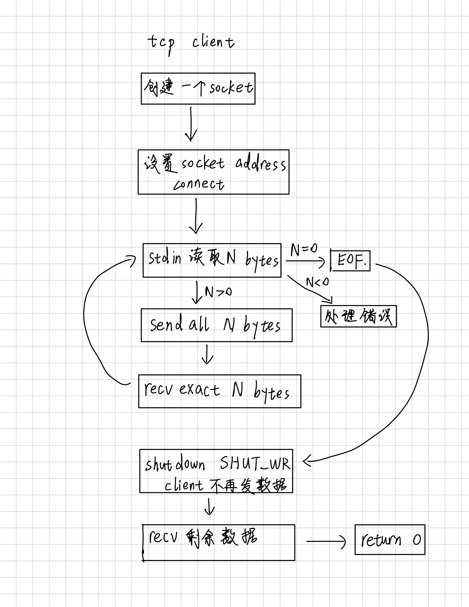
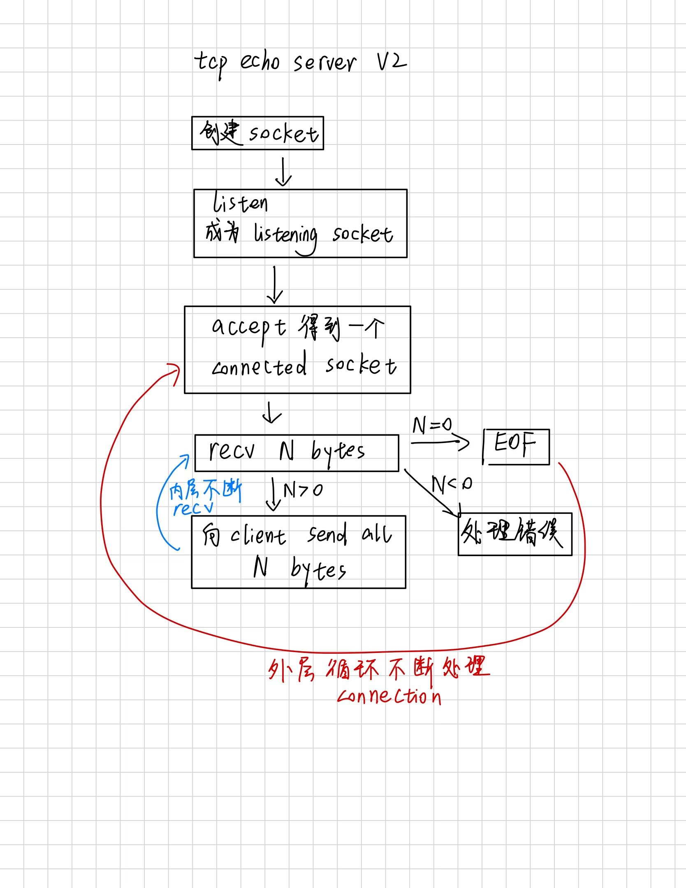

## EINTR,MSG_NOSIGNAL

这段是在说：你的 `send_all` 没有正确处理 `send` 失败的几种情况。

`send_all` 的目标是：

```text
把 size 个字节全部发送出去
```

但一次 `send` 不一定完成全部工作：

```cpp
ssize_t n = send(fd, data + offset, size - offset, flags);
```

需要区分：

```text
n > 0
    成功发送 n 个字节
    offset += n
    继续发送剩余数据

n == -1 且 errno == EINTR
    系统调用被信号暂时打断
    不代表网络坏了
    原地重试，offset 不变

n == -1 且是其他错误
    真正失败，例如 EPIPE
    返回失败

n == 0
    没有进展
    不能无限循环，应该当作失败处理
```

`EINTR` 的全称是 **Interrupted system call**，即“系统调用被中断”。

例如：

```text
第一次 send
    -> 被信号打断
    -> 返回 -1
    -> errno == EINTR
```

这时数据通常还没有发送成功，所以应该重新执行同一次 `send`。你的代码如果把所有 `-1` 都直接当作致命错误，就会提前退出。

`MSG_NOSIGNAL` 解决的是另一个问题：

```text
对方已经关闭连接
    -> 你继续 send
    -> Linux 可能产生 SIGPIPE
    -> 默认行为是直接杀死进程
```

加上：

```cpp
send(fd, data, size, MSG_NOSIGNAL);
```

可以让它不要直接杀死进程，而是返回：

```text
-1
errno == EPIPE
```

这样程序就能自己处理错误。

那段 fault injection 是人为制造 EINTR：

```text
第一次底层 sendto 被强制返回 EINTR
```

你的程序当时的实际行为是：

```text
sendto -> -1 EINTR
client 认为发送失败
client exit = 1
没有得到完整 echo
output = 0 bytes
cmp 失败
```

所以这不是“理论上可能有风险”，而是测试已经证明：你的 `send_all` 遇到 `EINTR` 时确实没有 retry，验收因此不通过。

修复后的正确流程应该是：

```text
send 返回 EINTR
    |
    v
不增加 offset
    |
    v
重新 send 同一段剩余数据
    |
    v
最终发送完成
    |
    v
client 正常接收 echo，cmp 通过
```

一句话记忆：

> `EINTR` 是“这次系统调用没完成，再试一次”，不是“网络发送失败”。

## EINTR 的例子

注释 1 可以。举一个最典型的例子：线程正在阻塞等待网络数据。

```text
client 调用 recv()
    |
    v
当前没有数据，线程睡眠等待
    |
    v
另一个进程发送 SIGUSR1
    |
    v
内核唤醒线程，执行 SIGUSR1 的处理函数
    |
    v
recv() 返回 -1
errno == EINTR
```

例如：

```cpp
void handle_signal(int) {
    // 只表示“信号到达了”
}

int main() {
    struct sigaction sa {};
    sa.sa_handler = handle_signal;
    sigemptyset(&sa.sa_mask);
    sigaction(SIGUSR1, &sa, nullptr);

    char buffer[1024];

    // 假设 fd 当前没有数据，这里会阻塞
    ssize_t n = recv(fd, buffer, sizeof(buffer), 0);

    if (n == -1 && errno == EINTR) {
        // recv 不是网络失败，只是被信号打断
        // 应该重新调用 recv
    }
}
```

另一个终端可以发送信号：

```bash
kill -USR1 <进程号>
```

于是原本阻塞中的 `recv` 被打断。

这里的关键是：

```text
EINTR 不表示：
    连接断开
    对方关闭
    数据损坏

EINTR 表示：
    这次系统调用还没完成
    期间有信号到达
    调用者可以重新尝试
```

在 `send` 中也类似。假设发送缓冲区满了，`send` 正在等待空间：

```text
send()
    |
    v
发送缓冲区满，线程阻塞
    |
    v
信号到达
    |
    v
send 返回 -1，errno == EINTR
```

此时 `send_all` 应该重新发送原来还没有发送的那部分数据。

补充一点：如果按 `Ctrl+C` 产生 `SIGINT`，默认行为是直接终止进程，所以你可能看不到 `EINTR`。只有安装了信号处理函数，并且系统调用没有被自动重启时，才会观察到 `-1/EINTR`。

Day5 中的：

```bash
strace --inject=sendto:error=EINTR:when=1
```

不是实际发送信号，而是让第一次 `sendto` 强制表现得像“被信号打断”，用来测试你的 `send_all` 有没有 retry。

## vscode tab

有，但你这个需求根本不需要插件，VS Code 自带就能处理。

选中这些多了一个缩进的行，然后按：

```
Shift + Tab
```

或者：

```
Ctrl + [
```

就会让所有选中行整体减少一级缩进。VS Code 官方把这个操作叫 `Outdent Line`。

## echo $?

这两行是在测试 `tcp_client` 的退出状态：

```bash
./tcp_client < /dev/null
echo $?
```

第一行：

```bash
./tcp_client < /dev/null
```

含义是：

- `./tcp_client`：运行当前目录下的 `tcp_client`
- `< /dev/null`：把 `tcp_client` 的标准输入重定向到 `/dev/null`
- `/dev/null`：Linux 的“空设备”，从里面读取时会立刻得到 EOF

所以这相当于：

```text
启动 client
-> stdin 立即 EOF
-> client 不需要等待用户输入
-> 测试 stdin EOF 后的处理逻辑
```

第二行：

```bash
echo $?
```

`$?` 是 shell 保存的“上一条命令的退出状态”。

```text
0       表示上一条命令成功
非 0    表示上一条命令失败
```

例如：

```bash
./tcp_client < /dev/null
echo $?
```

如果 server 没启动：

```text
stderr: Connection refused
1
```

这里的 `1` 表示 `connect` 失败，client 非正常退出。

如果 server 正常启动，并且正确处理空输入：

```text
0
```

表示：

```text
client 连接成功
-> stdin 立即 EOF
-> shutdown(SHUT_WR)
-> 正常完成关闭流程
-> 成功退出
```

注意 `$?` 只记录紧挨着的上一条命令，所以要马上执行：

```bash
./tcp_client < /dev/null
echo $?
```

不要中间再执行其他命令。

## wc

`wc` 是 Linux 的统计工具，缩写是 **word count**，可以统计文件的行数、单词数和字节数。

这里：

```bash
wc -c empty.out
```

其中：

```text
wc       统计文件内容
-c       count bytes，统计字节数
empty.out 要统计的文件
```

例如：

```text
0 empty.out
```

表示 `empty.out` 中有 `0` 个字节。

结合完整命令：

```bash
./tcp_client < /dev/null > empty.out
echo $?
wc -c empty.out
```

含义是：

```text
stdin 立刻 EOF
    |
    v
client 不读取任何输入
    |
    v
stdout 重定向到 empty.out
    |
    v
检查退出码
    |
    v
检查 empty.out 的字节数
```

预期：

```text
0
0 empty.out
```

第一个 `0` 是 `tcp_client` 成功退出；第二个 `0` 是输出文件确实没有任何 payload。

也可以这样写：

```bash
wc -c < empty.out
```

输出通常只有：

```text
0
```

因为文件名没有作为参数传给 `wc`，所以它不会打印文件名。

## 断点

断点可以理解成：

> 程序运行到某一行时，先暂停下来，让你检查当时的变量、调用栈和执行位置。

你之前用 `cout` 是把状态“打印出来”；断点是让程序停住，你可以现场观察状态，还能一步一步继续执行。

### 最基本用法

确保编译时带调试信息：

```bash
g++ -std=c++17 -Wall -Wextra -g your_file.cpp -o your_program
```

`-g` 很重要，它让 `gdb` 知道源代码和机器指令之间的对应关系。

然后在 VS Code 中：

1. 打开 `.cpp` 文件。
2. 点击某一行左侧的空白区域，会出现红点。
3. 按 `F5` 启动调试。
4. 程序运行到红点所在行时暂停。

常用快捷键：

```text
F5           继续运行到下一个断点
F9           添加/取消断点
F10          单步执行，但不进入函数
F11          单步进入函数
Shift + F11  从当前函数返回
Shift + F5   停止调试
```

暂停后，你可以在左侧 Debug 面板观察：

```text
Variables    当前变量
Watch        你主动关注的表达式
Call Stack   当前函数是被谁调用的
```

也可以把鼠标放到变量上查看值。

### 用你的 `send_all` 举例

假设代码大概是：

```cpp
while (offset < size) {
    ssize_t sent = send(fd, data + offset, size - offset, flags);
    offset += sent;
}
```

你可以在 `send` 那一行打断点。暂停后观察：

```text
offset
size
size - offset
sent
errno
```

然后按 `F10` 执行一行，看看：

```text
send 实际发送了多少？
offset 有没有正确增加？
剩余长度有没有变小？
```

如果你想观察 `EINTR` 分支，可以在这里打条件断点：

```cpp
if (errno == EINTR) {
    // retry
}
```

右键断点，选择条件断点，填写：

```text
errno == EINTR
```

这样只有满足条件时才暂停。

### 断点和 `cout` 的区别

`cout`：

```cpp
std::cout << offset << '\n';
```

适合长期记录运行过程，但会：

- 修改代码；
- 改变程序输出；
- 影响时序；
- 可能污染测试结果。

断点：

- 不需要插入打印语句；
- 可以同时观察多个变量；
- 可以查看调用栈；
- 可以控制程序执行到哪一步；
- 可以进入函数内部检查过程。

对于网络程序尤其方便，因为你可以暂停在：

```text
connect
send
recv
shutdown
accept
```

附近，观察 fd、返回值、`errno` 和当前状态。

### 一个重要提醒

断点会暂停程序，所以它不适合观察所有问题。

例如：

- 多线程竞态；
- TCP 超时；
- 依赖精确时序的问题；
- client/server 互相等待的问题。

这类问题加断点后，时序可能改变。此时可以使用 VS Code 的 `Logpoint`：它像 `cout` 一样记录变量，但不需要修改源代码。

你现在最适合的调试方式是：

```text
先用断点观察控制流
-> 再用 Watch 观察关键变量
-> 用 F10/F11 单步确认因果关系
-> 最后用 F5 继续运行
```

对 Day5 的代码，可以先在 `send_all`、`recv_exact`、`shutdown(SHUT_WR)` 和 `accept` 这些位置打断点。

## 流程图



