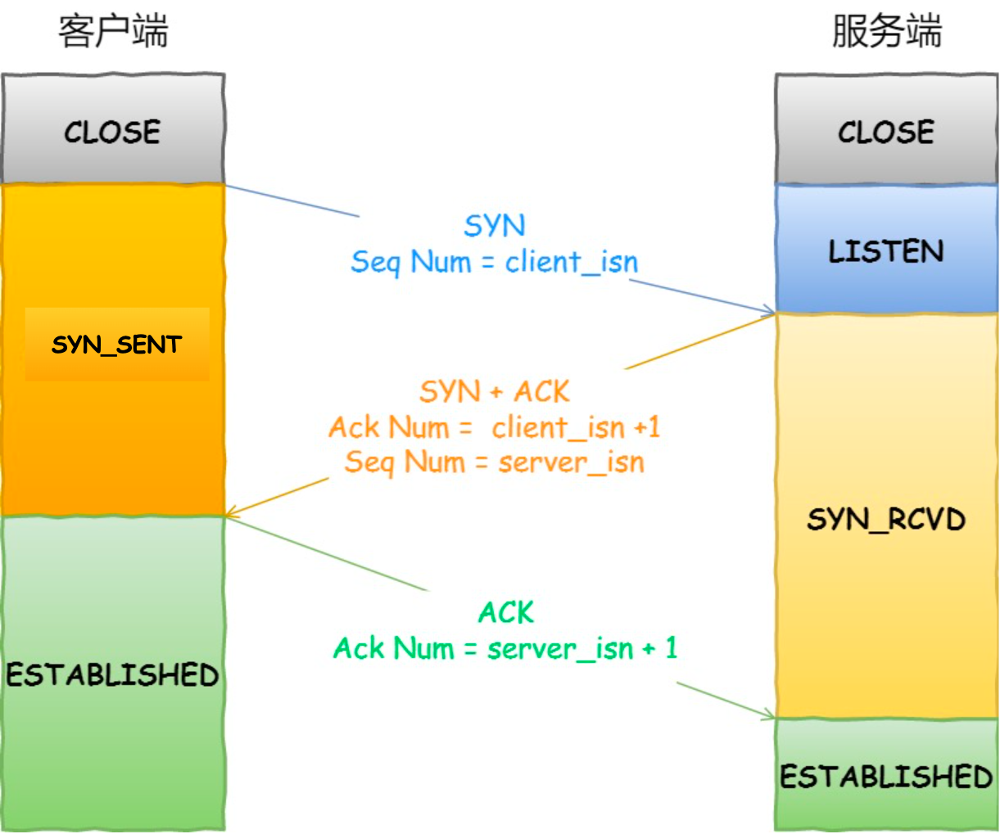
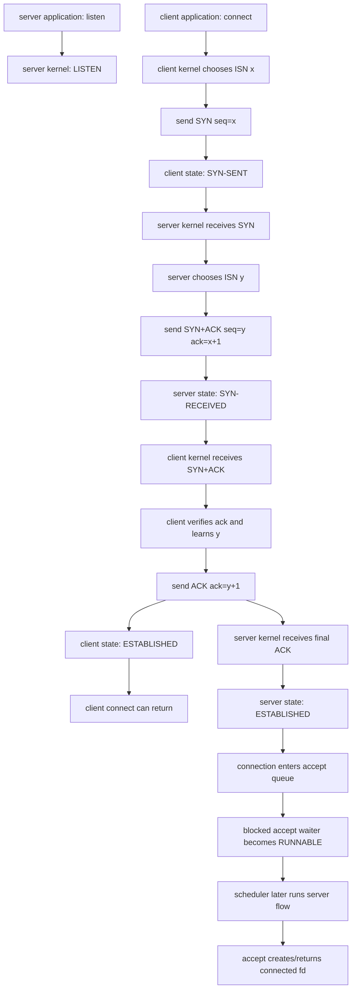
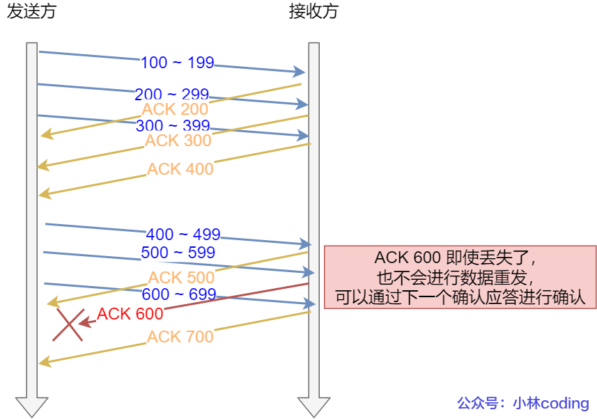
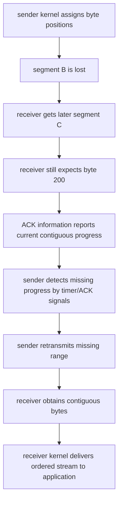
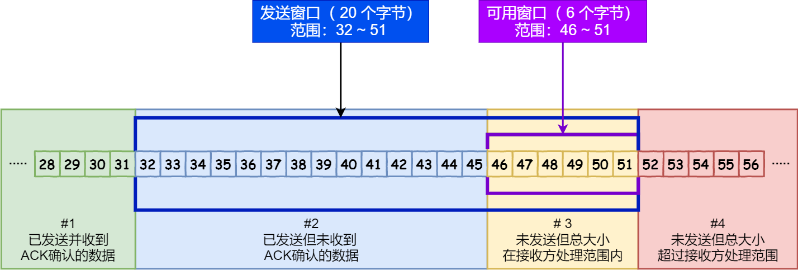
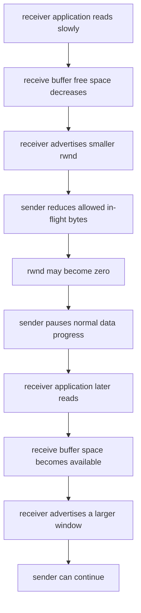
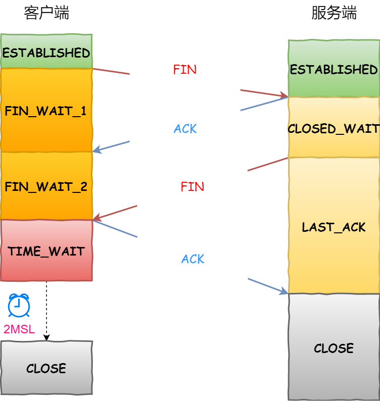
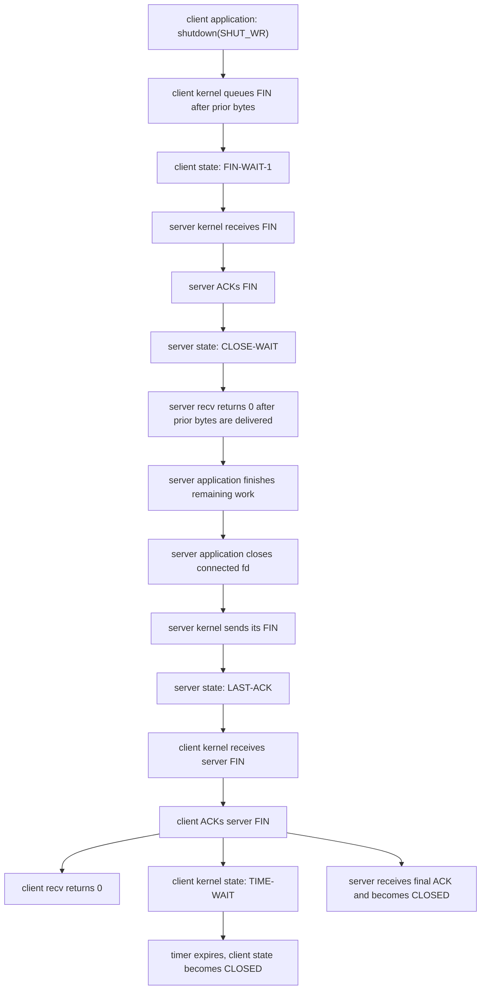

# Week6 Day6：`connect` 和 `close` 背后，kernel 为什么维护一串 TCP states

> 今日主线：三次握手、sequence/ACK/retransmission、滑动窗口、full-duplex close、TIME-WAIT、CLOSE-WAIT、flow control 与 congestion control。
>
> 今日类型：机制理解 + Linux 状态观察，不重写 client/server。
>
> 今日产出：复用 Day5 的 `tcp_client.cpp` 与 `tcp_echo_server.cpp`，完成一份连接生命周期观察记录。
>
> 默认编译：`g++ -std=c++17 -Wall -Wextra -g`。

今天不新增 MIT 6.S081 阅读范围。

学习前置：

```text
先完成并验收 Week6 Day5
-> 已有能循环收发、处理 EOF 的 tcp_client.cpp
-> 已有能顺序处理 clients 的 tcp_echo_server.cpp
-> 再进行 Day6 状态观察
```

这份 Day6 教程可以提前阅读，但不能因为它已经生成，就把尚未完成的 Day5 记为通过。

今天不再重复：

```text
socket / bind / listen / accept / connect 的基础签名
send_all / recv_exact 的实现
partial I/O、EINTR、EOF 的分支写法
TCP 不保存 application message boundary
```

今天新增的是：

```text
application 调用 connect / shutdown / close
-> kernel TCP state machine 怎样发送 control segments
-> 两端怎样交换 sequence number 与 acknowledgment
-> 为什么 ss 会看到 SYN-SENT / ESTAB / FIN-WAIT / TIME-WAIT / CLOSE-WAIT
-> reliable、flow control、congestion control 分别依靠什么 state
```

今天仍然不进入：

```text
完整 TCP header bit layout
复杂 sequence number 手算
精确 RTT estimator 与 RTO 公式
SACK、Nagle、delayed ACK 深入
Reno / CUBIC / BBR 算法细节
SYN flood 调优
nonblocking socket、epoll、Reactor
```

---

# Part 1：前情提要与必要术语

## 1. 从 Day5 接过来的 application 视角

Day5 中，application 看到的是：

```text
client: connect -> send/recv -> shutdown/close
server: accept  -> recv/send -> close connected fd
```

这些函数返回时，application 得到一个结果；但 network 上发生的不是“函数名飞到另一台机器”。

更完整的对象链是：

```text
application function call
-> system call / library wrapper
-> local kernel TCP implementation
-> local TCP state and buffers
-> TCP segment
-> peer kernel TCP implementation
-> peer TCP state and buffers
-> peer application-visible result
```

Day6 研究中间这段 kernel protocol state。

---

## 2. 今天从一个问题出发

下面只是一个 C++ function call：

```cpp
::connect(socket_fd, address, address_length);
```

为什么执行期间却可能出现：

```text
SYN-SENT
SYN-RECEIVED
ESTABLISHED
```

类似地：

```cpp
::shutdown(socket_fd, SHUT_WR);
```

为什么随后可能出现：

```text
FIN-WAIT-1
FIN-WAIT-2
TIME-WAIT
```

答案的核心是：

> TCP connection 不只是一个 fd。两台 host 的 kernel 都要维护这条 byte stream 的 sequence、acknowledgment、window、buffer、timer 和 connection state。

---

## 3. 必要术语

### 3.1 TCP state machine

`state machine`：状态机。

它表示：

```text
当前处于哪个 state
收到什么 event / segment
执行什么 action
转移到哪个 next state
```

例如：

```text
LISTEN
收到合法 SYN
-> 记录 peer 信息和 initial sequence number
-> 发 SYN+ACK
-> SYN-RECEIVED
```

状态名不是 application 自己随意写的字符串，而是 TCP implementation 对 connection 当前阶段的描述。

### 3.2 TCB

`TCB`：Transmission Control Block，传输控制块。

当前把它理解为 kernel 为一条 TCP connection 维护的 protocol state 集合：

```text
local / peer endpoint
send / receive sequence state
send / receive buffers
window state
retransmission timers
current TCP state
```

它不是 C++ object，也不是 fd table entry。fd 只是 application 访问 kernel socket 的 handle；TCP protocol state 位于 kernel 中。

### 3.3 TCP segment

`segment`：报文段。

TCP 把 byte stream 的一部分和 TCP header 组合成 segment。segment 可能携带：

```text
payload bytes
sequence number
acknowledgment number
flags
window advertisement
```

segment boundary 仍然不是 application message boundary。

### 3.4 control flags

`control flag`：TCP header 中表示控制意义的 bit。

今天只认识四个：

```text
SYN：synchronize，建立 connection 时同步 sequence space
ACK：acknowledgment，确认字段有效
FIN：finish，本方向不会再发送新的 bytes
RST：reset，异常中止或拒绝 connection
```

不能把 `ACK` 只翻译成“回复”。更准确的是：它确认某个 byte sequence range 已被 TCP 接收。

### 3.5 sequence number

`sequence number`：序列号，常缩写为 `seq`。

TCP 是 byte stream，因此 sequence number 主要标识：

```text
这个 segment 中第一个 payload byte
位于本方向 byte stream 的什么位置
```

例如：

```text
seq = 1000, length = 100
```

当前可理解为携带位置：

```text
[1000, 1100)
```

### 3.6 ISN

`ISN`：Initial Sequence Number，初始序列号。

连接建立时，client 和 server 各自选择自己的 ISN：

```text
client sequence space starts from client_isn
server sequence space starts from server_isn
```

两个方向有各自独立的 sequence space，不共用一个全局计数器。

### 3.7 acknowledgment number

`acknowledgment number`：确认号，常缩写为 `ack`。

核心读法：

```text
ack = N
-> 我已经连续收到 N 之前的 bytes/control position
-> 我下一步期待的是 N
```

这通常是 cumulative acknowledgment：累计确认。

### 3.8 active open 与 passive open

```text
active open：主动发起连接建立，常见于 client 的 connect
passive open：等待连接请求，常见于 server 的 listen
```

`active` 和 `passive` 描述本次动作方向，不等于永久的“client 身份”和“server 身份”。

### 3.9 RTT、RTO 与 retransmission

`RTT`：Round-Trip Time，往返时间。

```text
segment 从 sender 到 receiver
再让 acknowledgment 回到 sender
所经历的往返时间
```

`RTO`：Retransmission Timeout，重传超时时间。

`retransmission`：重传。sender 判断某些 bytes 没有得到确认时，再发送对应数据。

今天不计算 RTO，只记住：

```text
sender 不能永远把“没有 ACK”当成成功
kernel 使用 timer 和 ACK information 决定是否重传或最终报错
```

### 3.10 full-duplex 与 half-close

`full-duplex`：全双工。一个 TCP connection 同时包含两个独立方向：

```text
A -> B byte stream
B -> A byte stream
```

`half-close`：半关闭。一个方向已经结束，另一个方向仍可继续。

Day5 的：

```cpp
::shutdown(fd, SHUT_WR);
```

就是关闭本机发送方向，但保留接收方向。

### 3.11 active close 与 passive close

```text
active close：先发送 FIN 的一方主动开始关闭
passive close：先收到 peer FIN 的一方被动进入关闭流程
```

同一台 server 既可能 active close，也可能 passive close；取决于哪一方先关闭，不由“server/client”名称永久决定。

### 3.12 MSL

`MSL`：Maximum Segment Lifetime，报文段最大生存时间。

TCP 的 TIME-WAIT 通常按 `2 * MSL` 建立等待边界。今天不推导 Linux 内核常量，只理解它要覆盖旧 segment 和最后 ACK 的重传场景。

### 3.13 TIME-WAIT 与 CLOSE-WAIT

```text
TIME-WAIT：
    通常出现在 active closer 完成最后 ACK 后
    kernel 暂时保留 connection state

CLOSE-WAIT：
    本机 kernel 已收到 peer FIN
    本机 application 还没有关闭自己的方向/socket
```

名字中的 `WAIT` 等待对象完全不同：

```text
TIME-WAIT  -> 等 protocol timer
CLOSE-WAIT -> 等 local application close
```

### 3.14 sliding window、rwnd 与 cwnd

`sliding window`：滑动窗口。允许 sender 在未逐段等待 ACK 的情况下，让多个 bytes/segments 同时处于 in-flight 状态。

```text
rwnd：receiver window，接收窗口
      receiver 通告自己还有多少接收能力

cwnd：congestion window，拥塞窗口
      sender 根据 network condition 维护的发送限制
```

第一层关系：

```text
effective sending allowance 受 min(rwnd, cwnd) 限制
```

---

# Part 2：教程主体

# 教程开始

## 4. TCP connection 到底存在在哪里

一条 TCP connection 不是 network 中漂浮的实体，也不是只存在 client 的一个 object。

连接建立后，两端 kernel 各自维护 local state：

```text
client application
    |
    v fd
client kernel socket / TCP state
    |
    | TCP segments
    v
server kernel socket / TCP state
    ^
    | fd
server application
```

两端通过 segments 让这些 state 保持足够同步，但它们不是共享内存：

```text
client kernel cannot directly read server TCB
server kernel cannot directly read client TCB
```

只能根据收到的 SYN、ACK、FIN、payload 和 timer 更新自己的 state。

---

## 5. 三次握手：双方交换并确认两个 sequence spaces



图源：《图解网络》小林 Coding v4.0，第 241 页，TCP 篇 4.1.2.1。

读图只抓四件事：

```text
1. client 有自己的 client_isn
2. server 有自己的 server_isn
3. SYN 会占用一个 sequence position
4. 两边最终都要确认自己收到了对方的 ISN
```

假设：

```text
client_isn = x
server_isn = y
```

三次交换：

```text
1. client -> server：SYN, seq=x
2. server -> client：SYN+ACK, seq=y, ack=x+1
3. client -> server：ACK, ack=y+1
```

---

## 6. 从 `connect` 到 `accept` 返回的完整因果链



这里有三个不同的主体：

```text
client application：调用 connect，等待结果
client/server kernel：真正维护 TCP state 并发送/接收 control segments
server application：调用 accept，从 completed connection queue 取得 connected fd
```

不能说：

```text
accept 执行三次握手
```

更准确的是：

```text
kernel TCP path 完成握手
-> connection 进入 accept queue
-> accept 才能把它交给 application
```

---

## 7. 为什么不是两次握手

连接建立需要完成两件双向确认：

```text
A 把自己的 ISN 告诉 B，并知道 B 已确认
B 把自己的 ISN 告诉 A，并知道 A 已确认
```

如果只有：

```text
A -> B：SYN x
B -> A：SYN+ACK y, ack=x+1
```

B 还不知道最后这条 SYN+ACK 是否到达 A，也不知道 A 是否真的接受了 `y` 这个 sequence space。

第三次 ACK 给 B 提供确认：

```text
A 已收到 B 的 SYN
A 下一步期待 y+1
```

因此不能把三次握手只背成“确认双方能收能发”。更完整的核心是：

> 双方交换各自的 ISN，并让每一方都得到对方对自己 sequence space 的确认。

---

## 8. 为什么通常不需要四次握手

逻辑上需要四个动作：

```text
A sends SYN x
B ACKs x
B sends SYN y
A ACKs y
```

但中间两个动作可以合并：

```text
B sends SYN y + ACK x+1
```

所以成为三个 segments，而不是为了神秘数字“强行规定三次”。

---

## 9. SYN 和 FIN 为什么会让序号加一

SYN 与 FIN 不携带普通 application payload 时，仍各自占用一个 sequence position。

所以：

```text
SYN seq=x
-> peer ack=x+1
```

以及：

```text
FIN seq=n
-> peer ack=n+1
```

纯 ACK 如果没有 payload，也没有 SYN/FIN，通常不消耗新的 sequence position。

今天不要求复杂手算，只要能读出：

```text
ack 表示 next expected position
```

---

## 10. 连接建立后，sequence number 开始标记 byte stream 位置

假设 sender 已进入数据阶段，当前发送：

```text
seq=100, length=100
```

它覆盖：

```text
[100, 200)
```

receiver 连续收到后，可以回复：

```text
ack=200
```

意思不是“我收到了编号 200 的 byte”，而是：

```text
200 之前已经连续收到
下一步期待 200
```

这和 C++ 左闭右开 range 的直觉很像。

---

## 11. cumulative ACK：确认号可以覆盖前面连续范围



图源：《图解网络》小林 Coding v4.0，第 316 页，TCP 篇 4.2.2。

图中：

```text
ACK 600 丢失
但之后 ACK 700 到达
```

如果 `ACK 700` 表示 700 之前的 bytes 都已连续收到，那么它也覆盖了 `ACK 600` 想表达的范围。

因此 TCP 通常不是为每一个 application `send` 保存独立确认；确认围绕 byte sequence progress。

---

## 12. 丢失一个 segment 时，可靠有序交付怎样形成

假设：

```text
segment A: [100, 200) 到达
segment B: [200, 300) 丢失
segment C: [300, 400) 到达
```

receiver 此时仍缺 `[200, 300)`。

第一层因果链：



涉及的机制分工：

```text
checksum：发现 segment 在传输中损坏
sequence number：知道 bytes 属于哪里
ACK：告诉 sender 连续接收进度
retransmission：补回缺失数据
receive reassembly：按 sequence position 重组
duplicate handling：重复到达不重复交付给 byte stream
```

---

## 13. TCP “reliable” 的边界

TCP reliable 当前表示：

```text
在 connection 成功维持的前提下
向 application 提供有序、无重复的 byte stream
对可恢复的丢失执行重传
最终无法继续时向 application 暴露 error/EOF，而不是假装成功
```

它不表示：

```text
send 返回就说明 peer application 已经处理
peer 已把数据写入磁盘
网络永远不会断
kernel 会无限重试直到宇宙结束
application protocol 一定正确
```

所以 Day5 的 return-value discipline 仍然成立：

```text
TCP protocol reliability
!= application transaction success
```

---

## 14. 为什么不能每发一段就停下来等 ACK

如果 sender 使用 stop-and-wait：

```text
send one segment
-> wait one RTT
-> receive ACK
-> send next segment
```

RTT 稍大时，大部分时间都浪费在等待，network path 没有被充分利用。

sliding window 允许：

```text
在允许范围内连续发送多个 segments
这些 bytes 可以同时处于 in-flight
ACK 推进后 window 向前滑动
新的 byte positions 变得可发送
```

---

## 15. 发送方 sliding window 的四个区域



图源：《图解网络》小林 Coding v4.0，第 317 页，TCP 篇 4.2.2。

从左到右：

```text
#1 已发送并已确认
#2 已发送但尚未确认
#3 尚未发送，但目前允许发送
#4 尚未发送，且当前 window 不允许发送
```

两个 progress position：

```text
SND.UNA：send unacknowledged，最早尚未确认的位置
SND.NXT：send next，下一步准备发送的位置
```

不要求背完整公式，只保留 invariant：

```text
SND.UNA 之前已经确认
SND.UNA 到 SND.NXT 已发送但仍可能需要保留以便重传
ACK 前进后，window 才能向右滑动并释放新的发送空间
```

---

## 16. flow control：保护 receiver

`flow control`：流量控制。

问题场景：

```text
sender 很快
receiver application 很慢
receiver kernel receive buffer 逐渐被填满
```

receiver 在 TCP header 中通告 `rwnd`：

```text
我当前还能接收多少 bytes
```

完整因果链：



这和 Day5 的 blocking `send` 可以连起来：

```text
network/peer progress 慢
-> local send buffer 逐渐填满
-> application send 可能阻塞等待可用空间
```

但 application `send` 的一次返回值仍只表示 local progress，不直接等于 peer processing。

---

## 17. congestion control：保护 shared network

`congestion control`：拥塞控制。

它处理的是另一类问题：

```text
receiver buffer 可能很空
但中间 routers / links / queues 已经拥堵
```

sender 维护 `cwnd`：congestion window。

第一层因果链：

```text
sender 根据 ACK/loss/RTT 等 network signals
-> 调整 cwnd
-> 限制在途数据量
-> 避免继续向已经拥堵的 network 注入过多 traffic
```

今天只建立职责，不背算法：

```text
slow start / congestion avoidance / recovery
```

这些名字知道即可，具体增长、减小规则留到后续性能网络阶段。

---

## 18. flow control 与 congestion control 对照

| 问题 | flow control | congestion control |
|---|---|---|
| 中文 | 流量控制 | 拥塞控制 |
| 主要保护对象 | receiver buffer / receiver processing ability | shared network path |
| 主要限制量 | `rwnd` | `cwnd` |
| 谁提供核心信息 | receiver 通告 window | sender 根据 network signals 估计 |
| 慢的对象 | peer application / receive side | routers、links、queues、network path |

sender 真实可用发送范围不能只看一个窗口：

```text
effective window <= min(rwnd, cwnd)
```

记忆方式：

```text
rwnd：别把接收方撑爆
cwnd：别把网络堵爆
```

---

## 19. full-duplex 为什么让关闭通常需要两个 FIN

一个 connection 有两个独立方向：

```text
client -> server
server -> client
```

client 发送 FIN，只表达：

```text
client -> server 方向不会再有新的 bytes
```

它不自动表达：

```text
server -> client 方向也必须立刻结束
```

所以 server 收到 client FIN 后可以：

```text
ACK client FIN
继续把剩余 response bytes 发给 client
等 local application 也完成发送
再发送自己的 FIN
```

这正是 Day5 half-close 的 protocol 对应。

---

## 20. 正常关闭的 states



图源：《图解网络》小林 Coding v4.0，第 266 页，TCP 篇 4.1.3.1。

图中 client 先关闭，因此：

```text
client = active closer
server = passive closer
```

client states：

```text
ESTABLISHED
-> FIN-WAIT-1
-> FIN-WAIT-2
-> TIME-WAIT
-> CLOSED
```

server states：

```text
ESTABLISHED
-> CLOSE-WAIT
-> LAST-ACK
-> CLOSED
```

图中写成四个 segments 是常见正常路径；ACK 与 FIN 在某些时机可以合并，所以实际抓包不保证永远恰好四条。

---

## 21. 从 `shutdown(SHUT_WR)` 到两端 EOF 的完整因果链



注意：

```text
application close/shutdown 是 cause
FIN/ACK 由 kernel TCP implementation 发送
recv == 0 是 peer write-direction FIN 对 application 的 EOF 表现
```

---

## 22. CLOSE-WAIT 到底在等谁

server 收到 peer FIN 后：

```text
server kernel ACKs FIN
server connection enters CLOSE-WAIT
server application eventually observes recv == 0
```

此时 server 的发送方向可能仍然开放，所以它仍可能发送剩余 bytes。

CLOSE-WAIT 的退出条件不是“再等一个 network packet”作为核心，而是：

```text
local application close/shutdown its remaining direction
-> local kernel can send FIN
-> CLOSE-WAIT -> LAST-ACK
```

如果大量 connection 长时间停在 CLOSE-WAIT，通常应该先查：

```text
application 是否漏 close
异常路径是否跳过 ownership cleanup
某个 execution flow 是否卡住，迟迟没有结束 connected socket lifetime
```

这就是 RAII 对 network server 的实际价值：connected `UniqueFd` 离开 scope 时，会自动触发 close。

---

## 23. TIME-WAIT 为什么 fd 没了，state 还可能存在

active closer application 已经可以：

```text
close fd
process 继续运行，甚至已经退出
```

但 local kernel 仍可能保留 TIME-WAIT state。

因此：

```text
fd lifetime
!= TCP protocol state lifetime
```

TIME-WAIT 的两个第一层目的：

```text
1. 如果最后 ACK 丢失，peer 重传 FIN 时还能再次 ACK
2. 让旧 connection 的延迟 segments 有时间从 network 中消失，避免污染相同 four-tuple 的后续 connection
```

TIME-WAIT 通常说明：

```text
本机是 active closer，并完成了最后 ACK
```

但真实系统可能存在 simultaneous close、RST、ACK/FIN 合并等路径，不要仅凭“client/server 身份”猜哪边一定 TIME-WAIT。

---

## 24. FIN 与 RST 的第一层区别

```text
FIN：orderly close，正常结束一个发送方向
RST：reset，立即中止/拒绝当前 connection state
```

FIN 路径会让 receiver 在先前 bytes 交付完后观察到 EOF。

RST 路径常让 application 看到：

```text
ECONNRESET
EPIPE / SIGPIPE
connection refused 等相关错误
```

具体 error 取决于发生时机和调用方向。今天不实现 abortive close，也不设置 `SO_LINGER`。

---

## 25. application action 与常见 state 对照

| application/kernel event | 本机可能出现的 state |
|---|---|
| server `listen` 成功 | `LISTEN` |
| client 发出 SYN，等待 SYN+ACK | `SYN-SENT` |
| server 已回 SYN+ACK，等待最终 ACK | `SYN-RECEIVED` |
| 两边可正常传输 | `ESTABLISHED` |
| 本机先发 FIN，等待 ACK/peer FIN | `FIN-WAIT-1/2` |
| 本机收到 peer FIN，等待 local close | `CLOSE-WAIT` |
| passive closer 已发 FIN，等 ACK | `LAST-ACK` |
| active closer 发完最后 ACK，等 timer | `TIME-WAIT` |

这些是主要路径，不要求背下完整 TCP state transition diagram。

---

# Part 3：观察、记录与验收

## 26. 今日不新写项目

今天复用 Day5：

```text
tcp_echo_server.cpp
tcp_client.cpp
```

如果 Day5 尚未完成：

```text
不要为了提前做 Day6 而复制教程答案
先完成 Day5 的 client/server 和 robust I/O 验收
```

Day6 的价值是解释已经能运行的 connection，而不是再造一套代码。

---

## 27. 工具 1：`ss` 查看 socket state

`ss`：socket statistics，查看 Linux socket statistics。

今天常用命令：

```bash
ss -tanp '( sport = :18080 or dport = :18080 )'
```

选项：

```text
-t：TCP sockets
-a：all，包括 LISTEN 与 non-listening
-n：numeric，不把 address/port 解析成名字
-p：显示 process information，权限不足时可能看不全
```

过滤条件：

```text
sport：source/local port filter
dport：destination/peer port filter
```

单独看状态：

```bash
ss -tan state time-wait '( sport = :18080 or dport = :18080 )'
ss -tanp state close-wait '( sport = :18080 or dport = :18080 )'
```

---

## 28. 观察 1：LISTEN 与 ESTABLISHED

终端 A：

```bash
./tcp_echo_server
```

终端 B：保持 client stdin 20 秒不 EOF：

```bash
{ printf 'state demo\n'; sleep 20; } | ./tcp_client > hold.out
```

终端 C：

```bash
ss -tanp '( sport = :18080 or dport = :18080 )'
```

记录：

```text
server listening entry：LISTEN，local port 18080
client connection entry：ESTAB，local ephemeral port -> 18080
server connected entry：ESTAB，18080 -> client ephemeral port
listener fd 与 connected fd 是否不同
```

解释：

```text
LISTEN entry 负责未来 connections
两条 ESTAB 输出是同一 connection 在两端 host/local socket 视角下的记录
```

因为 client 和 server 都在同一个 host 的 loopback 上，所以 `ss` 能同时看到两端。

---

## 29. 工具 2：`tcpdump` 观察 control segments

`tcpdump`：dump traffic，抓取并打印 network packets。

先确认接口：

```bash
tcpdump -D
```

loopback 实验使用：

```bash
sudo tcpdump -i lo -nn -tttt 'tcp port 18080'
```

参数：

```text
-i lo：抓 loopback interface
-nn：不解析 hostname 和 service name，保留 numeric IP/port
-tttt：打印较完整时间
'tcp port 18080'：capture filter，只看目标 TCP port
```

当前输出中的 flags：

```text
[S]   -> SYN
[S.]  -> SYN + ACK，`.` 表示 ACK
[.]   -> ACK
[P.]  -> PSH + ACK，通常携带 payload
[F.]  -> FIN + ACK
[R]   -> RST
```

其他字段：

```text
seq：sequence range
ack：next expected sequence position
win：advertised receive window
length：本 segment payload bytes
```

默认相对 sequence number 更容易读。若明确想看 absolute sequence number，可以运行：

```bash
sudo tcpdump -i lo -nn -tttt -S 'tcp port 18080'
```

不要因为 tcpdump 显示 `seq 1:12`，就误以为真实 ISN 永远从 0 或 1 开始；工具默认会把数值相对化，方便观察 progress。

---

## 30. 观察 2：抓握手、payload 与关闭

终端 C 先启动：

```bash
sudo tcpdump -i lo -nn -tttt 'tcp port 18080'
```

然后启动 server，并运行一次短 client：

```bash
printf 'trace tcp\n' | ./tcp_client > trace.out
```

抓包中寻找：

```text
SYN
SYN+ACK
ACK
payload segments / ACKs
FIN / ACK
peer FIN / final ACK
```

回答：

```text
哪三个 segments 建立 connection
client/server 的 SYN 各自被哪个 ack 确认
payload length 与 sequence progress 怎样对应
哪一方先发送 FIN
实际关闭是 3 个还是 4 个 visible segments，为什么都可能合理
```

今天不要求分析 checksum、TCP options 或每一个 window-scale 数值。

---

## 31. 观察 3：TIME-WAIT

让 client 正常结束后立即执行：

```bash
ss -tan state time-wait '( sport = :18080 or dport = :18080 )'
```

如果看到 TIME-WAIT，记录 four-tuple，并判断：

```text
哪一端先 shutdown/close sending direction
哪一端发送最后 ACK
为什么 process/fd 可能已经结束，kernel state 仍存在
```

如果没抓到，不把它当代码失败。状态可能因为关闭方向、时机或环境差异出现在另一端、持续时间不同，或者观察窗口太短。

核心是根据 packet/state 因果链判断，不是强求每次截图完全相同。

---

## 32. 观察 4：受控制造 CLOSE-WAIT

不要污染正式 Day5 server。复制一份 probe：

```bash
cp tcp_echo_server.cpp tcp_echo_server_close_wait_probe.cpp
```

只在 `recv == 0`、connected `UniqueFd` 离开 scope 之前临时加入：

```cpp
std::cerr << "delay connected socket close for observation\n";
::sleep(20);
```

`sleep` 声明来自：

```cpp
#include <unistd.h>
```

这不是业务修法，只是把原本很短的 CLOSE-WAIT 人为拉长。

编译：

```bash
g++ -std=c++17 -Wall -Wextra -g \
    tcp_echo_server_close_wait_probe.cpp \
    -o tcp_echo_server_close_wait_probe
```

终端 A：

```bash
./tcp_echo_server_close_wait_probe
```

终端 B：让 client stdin 立即 EOF，并放到 background：

```bash
./tcp_client < /dev/null > close_wait_client.out &
client_pid=$!
```

终端 C 在 20 秒内：

```bash
ss -tanp '( sport = :18080 or dport = :18080 )'
```

预期因果链：

```text
client shutdown(SHUT_WR)
-> client kernel sends FIN
-> server kernel ACKs FIN and enters CLOSE-WAIT
-> server recv returns 0
-> probe application sleeps before closing connected fd
-> server remains CLOSE-WAIT during delay
-> client may remain FIN-WAIT-2, waiting for server FIN
-> sleep ends, connected UniqueFd later closes
-> server sends FIN
-> close sequence completes
```

20 秒后：

```bash
wait "$client_pid"
```

server 仍在 outer accept loop 时，用 `Ctrl-C` 结束 probe。

不要把 `sleep(20)` 留在正式 server。

---

## 33. 观察 5：用 `ss -ti` 看 TCP internal summary

保持 ESTABLISHED connection 时：

```bash
ss -tinp '( sport = :18080 or dport = :18080 )'
```

不同 kernel/version 输出不同，可能看到：

```text
rtt / rto
cwnd
bytes_sent / bytes_acked
retrans
```

今天只做字段对应：

```text
rtt：往返时间 estimate
rto：重传 timeout estimate
cwnd：congestion window state
bytes_acked：已确认 progress 的统计
retrans：重传相关统计
```

不要比较 loopback 的具体数值，也不要把一次 `cwnd` snapshot 当成性能结论。

---

## 34. 哪些现象不能当固定契约

不要把下面现象写成“TCP 一定如此”：

```text
关闭一定恰好抓到四个 packets
每个 payload segment 都立即得到一个独立 ACK
TIME-WAIT 一定在 client
TIME-WAIT 每次都能被同一条 ss 命令及时看到
ISN 一定是 0 或 1
cwnd 初始值在所有 kernel 上完全相同
一次 send 一定对应一个 tcpdump payload line
```

稳定机制与不稳定表现要分开：

```text
稳定：两个 sequence spaces、ACK progress、两个关闭方向、state responsibilities
不稳定：packet 合并、ACK timing、具体 timer/value、抓包显示方式
```

---

## 35. 推荐的 `day6_note.md` 结构

不需要复制教程，只记录新增机制、真实观察与自己的因果链：

```markdown
# Week6 Day6 Note

## 1. 三次握手怎样交换并确认两个 ISN

## 2. connect、kernel handshake、accept 的主体关系

## 3. sequence / cumulative ACK / retransmission

## 4. sliding window 与 rwnd/cwnd

## 5. active close / passive close 的状态链

## 6. TIME-WAIT 与 CLOSE-WAIT 分别在等谁

## 7. ss / tcpdump 的实际观察

## 8. 验收问题
```

你已经能稳定讲清的 Day4/Day5 API 不需要重新抄一遍。

---

## 36. 验收问题

### 问题 1

从 `client connect` 开始，到 `server accept` 返回 connected fd 为止，按主体串出完整流程。必须区分：

```text
client application
client kernel
server kernel
server application
```

### 问题 2

为什么三次握手不能只记成“确认双方能收能发”？两个 ISN 分别怎样被对方确认？

### 问题 3

解释：

```text
seq = 1000, length = 100
ack = 1100
```

这些数字描述 byte stream 的什么范围？

### 问题 4

为什么后到的累计 `ACK 700` 可能覆盖丢失的 `ACK 600`？ACK 确认的是 application message 还是 continuous byte progress？

### 问题 5

TCP reliable 为什么仍然不能证明：

```text
send 返回后 peer application 已处理数据
```

### 问题 6

分别说明 `rwnd` 与 `cwnd` 保护谁、由谁维护/提供信息。为什么有效发送范围要同时受两者限制？

### 问题 7

peer 发送 FIN 后，本机进入 CLOSE-WAIT。此时：

```text
本机还能不能 send？
recv 最终为什么返回 0？
CLOSE-WAIT 怎样才能进入 LAST-ACK？
```

### 问题 8

TIME-WAIT 为什么可以在 fd 已 close、process 甚至已经退出后继续存在？它主要防哪两类问题？

### 问题 9

画出：

```text
client shutdown(SHUT_WR)
-> server recv 0
-> server delayed close
-> CLOSE-WAIT / FIN-WAIT-2
-> server close
-> TIME-WAIT
```

每一步写明 application action、kernel action 和 state owner。

### 问题 10

tcpdump 看到 `[S] [S.] [.] [F.] [.]` 时，每个 flag 是什么？为什么实际正常关闭不一定永远显示成教科书式四个独立 packets？

---

## 37. 今日通过标准

核心通过条件：

```text
[ ] 能说明 connection state 位于两端 kernel，不等于 fd
[ ] 能串出 SYN -> SYN+ACK -> ACK 与主要 state transitions
[ ] 能解释两个 ISN 怎样被交换和确认
[ ] 知道 SYN/FIN 消耗一个 sequence position
[ ] 能用 byte range 解释 seq、length 和 cumulative ACK
[ ] 知道 sequence/ACK/retransmission/reassembly 如何形成可靠有序 stream
[ ] 不把 TCP reliable 等同于 peer application 已处理
[ ] 能解释 sliding window 为什么比 stop-and-wait 有效
[ ] 能区分 rwnd 与 cwnd、flow control 与 congestion control
[ ] 能从 full-duplex 解释两个 FIN 与 half-close
[ ] 能区分 active close 与 passive close
[ ] 能解释 TIME-WAIT 与 CLOSE-WAIT 分别等待什么
[ ] 能说明 recv == 0 与 peer FIN 的关系
[ ] 能使用 ss 识别 LISTEN / ESTAB / TIME-WAIT / CLOSE-WAIT
[ ] 能读 tcpdump 的 SYN/ACK/FIN 与基本 seq/ack/length
[ ] 验收问题能用自己的因果链回答
```

观察增强项，不阻塞通过：

```text
精确抓到 TIME-WAIT screenshot
精确抓到四个独立 close packets
记录 ss -ti 每个统计字段
分析 absolute ISN
```

---

## 38. 今日压缩记忆

```text
TCP connection = 两端 kernel 持有的 protocol state
connect 触发 active open，kernel 发送 SYN
三次握手交换并确认 client/server 两个 ISN
accept 不执行握手；kernel 完成握手后 accept 才取走 completed connection
seq 标识 byte stream position，ack 表示 next expected position
cumulative ACK 可以一次确认连续的前缀范围
retransmission 补丢失，reassembly 按序交付
sliding window 允许多个 bytes/segments 同时在途
rwnd 保护 receiver，cwnd 保护 network
effective sending allowance 受 min(rwnd, cwnd) 限制
TCP full-duplex 有两个独立发送方向
FIN 只关闭一个方向，所以正常关闭通常有两个 FIN
CLOSE-WAIT 等 local application close
TIME-WAIT 等 protocol timer，并处理 delayed segment / retransmitted FIN
fd lifetime 不等于 TCP state lifetime
```

最核心的一句：

> TCP 的可靠 byte stream 来自两端 kernel 共同维护的 sequence、ACK、window、timer 和 state；application 只通过 socket API 驱动并观察这套机制。

---

## 39. 今日资料

标准与 Linux official documentation：

- RFC 9293, Transmission Control Protocol：<https://www.rfc-editor.org/rfc/rfc9293.html>
- Linux `tcp(7)`：<https://man7.org/linux/man-pages/man7/tcp.7.html>
- Linux `ss(8)`：<https://man7.org/linux/man-pages/man8/ss.8.html>
- Linux `tcpdump(8)`：<https://man7.org/linux/man-pages/man8/tcpdump.8.html>

图解资料：

- 《图解网络》小林 Coding v4.0，第 241 页：TCP three-way handshake。
- 《图解网络》小林 Coding v4.0，第 266 页：normal close states。
- 《图解网络》小林 Coding v4.0，第 316 页：cumulative ACK。
- 《图解网络》小林 Coding v4.0，第 317 页：sender sliding window。

阅读边界：

```text
今天掌握 handshake / close / reliability / flow-vs-congestion 的第一层机制
不背完整 state diagram，不学具体 congestion-control algorithm
Day7 把 TCP byte stream 与 HTTP message boundary 接起来
```
