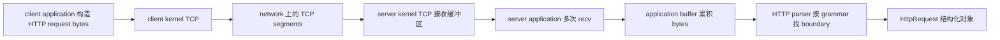
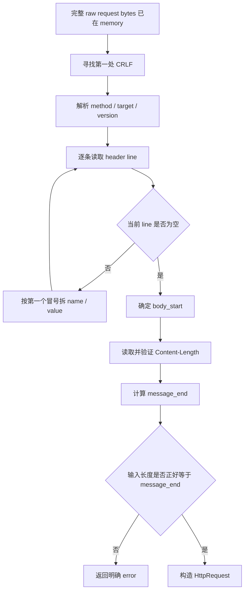
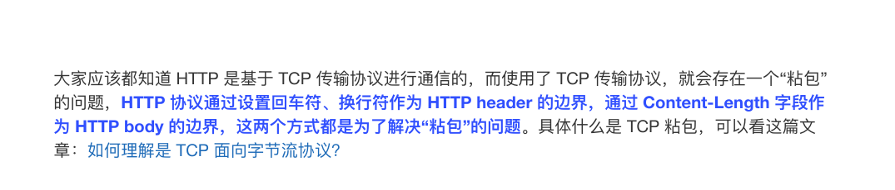
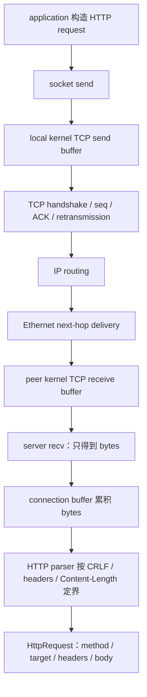

# Week6 Day7：TCP 只交付 bytes，HTTP/1.1 怎样找出一条完整 request

> 今日主线：HTTP/1.1 request line、header fields、空行、`Content-Length` 与 message boundary。
>
> 今日类型：协议机制理解 + 原始报文观察 + 独立 parser 练习 + Week6 收束。
>
> 今日产出：`http_request_parser.cpp` 与 `day7_note.md`。
>
> 默认编译：`g++ -std=c++17 -Wall -Wextra -g`。

今天不新增 MIT 6.S081 阅读范围。

学习前置：

```text
Week6 Day5
-> 已理解 TCP 是 ordered byte stream
-> 一次 send 不对应一次 recv
-> application 必须自己定义 message boundary

Week6 Day6
-> 已理解 connection establishment、reliable delivery 与 close states
-> 这些机制保证 bytes 怎样到达
-> 但仍没有说明“哪一段 bytes 算一条 application message”
```

今天只解决一个问题：

```text
server 从 TCP 收到一串 bytes 后，
怎样按 HTTP/1.1 的规则确定一条 request 在哪里结束？
```

今天仍然不进入：

```text
incremental socket parser
同时维护多个 requests 的 connection buffer
chunked transfer coding
完整 URI grammar
HTTP response parser
HTTP server
TLS / HTTPS
HTTP/2 / HTTP/3
nonblocking socket / select / poll / epoll / Reactor
```

今天的 parser 有一个明确前提：

```text
输入是已经完整收进 std::string 的“一条 HTTP/1.1 request”
```

因此今天研究的是：

```text
memory 中的 bytes -> HTTP structure
```

不是：

```text
socket 上什么时候继续 recv -> 怎样保存半条 request
```

---

# Part 1：前情提要与必要术语

## 1. 从 Day5 的 byte stream 接过来

假设 client 连续发送两条 application messages：

```text
message A = "hello"
message B = "world"
```

server 的 `recv` 可能得到：

```text
recv #1 -> "hell"
recv #2 -> "oworld"
```

也可能得到：

```text
recv #1 -> "helloworld"
```

TCP 保证的是：

```text
只要 connection 正常、数据最终成功交付，
application 读取到的 bytes 保持有序。
```

TCP 不保证的是：

```text
send boundary == recv boundary
```

所以 HTTP 不能说：

```text
一次 recv 返回了多少，就把多少当作一条 request。
```

HTTP 必须在 byte stream 内部写入自己的结构和长度信息。

---

## 2. 今天从一个具体 request 出发

先看一条完整 request。为了让不可见字符可见，下面把回车和换行写成转义形式：

```text
POST /echo HTTP/1.1\r\n
Host: 127.0.0.1:18081\r\n
Content-Type: text/plain\r\n
Content-Length: 5\r\n
\r\n
hello
```

不要先背字段。先只观察三段：

```text
POST /echo HTTP/1.1\r\n       <- request line
若干 header lines\r\n           <- metadata
\r\nhello                       <- empty line + 5-byte body
```

这条 request 的边界由两种规则共同确定：

```text
header section 的结束：第一个 \r\n\r\n
body 的结束：body_start + Content-Length
```

这就是今天要亲手实现的主线。

---

## 3. 必要术语

### 3.1 HTTP

`HTTP`：Hypertext Transfer Protocol，超文本传输协议。

今天不要把“超文本”理解成只能传 HTML。当前层次更重要的是：

```text
HTTP 是 application-layer protocol。
它规定 client 和 server 怎样组织 request / response bytes。
```

TCP 负责可靠、有序地交付 bytes；HTTP 负责解释这些 bytes 表达什么。

---

### 3.2 request 与 response

`request`：请求。

```text
client -> server
表达“我要对哪个 target 做什么”
```

`response`：响应。

```text
server -> client
表达处理结果、metadata 和可选 body
```

今天只实现 request parser，但会短暂对照 response，避免把两种 start-line 混在一起。

---

### 3.3 framing

`framing` 来自 `frame`，这里指 message framing：消息定界规则。

它回答：

```text
一条 message 从哪里开始？
每个部分在哪里结束？
整条 message 在哪里结束？
```

今天的 framing 不是 Ethernet frame，也不是给 TCP segment 加边界。

它是 HTTP 在 TCP byte stream 之上定义的 application message boundary。

---

### 3.4 octet 与 byte

RFC 常用 `octet` 表示一个 8-bit unit。

在今天的 Linux/C++ 环境中，可以先把它理解成一个 byte：

```text
Content-Length: 5
-> body 有 5 个 bytes
```

它不是“5 个汉字”，也不是“5 个屏幕字符”。

---

### 3.5 CR、LF 与 CRLF

```text
CR：Carriage Return，回车，byte value 13，C/C++ 写作 '\r'
LF：Line Feed，换行，byte value 10，C/C++ 写作 '\n'
CRLF：先 CR 后 LF，也就是 "\r\n"
```

HTTP/1.1 的标准 line ending 是 CRLF。

因此：

```text
request line 结束：\r\n
一条 header line 结束：\r\n
header section 结束：\r\n\r\n
```

今天的受控 parser 严格要求 CRLF，不把只有 `\n` 的输入当作合法 HTTP/1.1 request。

---

### 3.6 SP

`SP`：space，一个普通空格 byte。

request line 的标准形状是：

```text
METHOD SP request-target SP HTTP-version CRLF
```

例如：

```text
GET /users?id=7 HTTP/1.1\r\n
```

其中两个可见空格就是两个 `SP`。

---

### 3.7 start-line 与 request-line

`start-line`：HTTP message 的第一行。

request 的 start-line 叫 `request-line`：

```text
GET /hello HTTP/1.1
```

它由三部分组成：

```text
method          = GET
request-target  = /hello
HTTP-version    = HTTP/1.1
```

response 的 start-line 叫 `status-line`：

```text
HTTP/1.1 200 OK
```

所以 request parser 不能把 response status-line 当 request-line 解析。

---

### 3.8 method

`method`：请求方法，表达 client 希望 server 对 target 执行的语义。

今天只需要认识：

```text
GET  -> 获取资源表示
POST -> 把 body 交给目标资源处理
```

parser 的职责首先是把 method 文本提取出来；业务代码之后才决定是否支持它。

---

### 3.9 request-target

`request-target`：当前 request 想操作的目标。

例如：

```text
/echo
/users?id=7
```

今天把它保留为原始 `std::string`，不展开 URL percent-encoding、query parameter 等 grammar。

---

### 3.10 header field

`header field`：header 字段。

基本形状：

```text
field-name ":" optional-whitespace field-value
```

例如：

```text
Content-Length: 5
```

其中：

```text
field-name  = Content-Length
field-value = 5
```

header field 携带的是 message metadata，不是 body 本身。

---

### 3.10.1 metadata

`metadata` 就是“描述数据的数据”，中文通常翻译成“元数据”。

在 HTTP 里：

```text
body：真正要传的内容
metadata：帮助双方理解、处理这些内容的信息
```

例如：

```http
Content-Length: 5

hello
```

这里：

```text
hello            -> body，真正的数据
Content-Length: 5 -> metadata，说明 body 有 5 个字节
```

它不属于 `hello` 这个内容本身，但接收方需要靠它知道该读多少 body。

再看几个常见 header field：

```http
Content-Type: application/json
```

表示 body 应按 JSON 理解。

```http
Host: example.com
```

表示客户端想访问哪个主机。

```http
Connection: close
```

表示这次响应后连接是否应关闭。

所以可以压缩记成：

```text
body：我传了什么
header metadata：这份内容是什么、怎么读、从哪来、要怎么处理
```

`Content-Length: 5` 不是业务正文的一部分，而是 HTTP message 的“说明书”中的一项。

---

### 3.11 OWS

`OWS`：Optional Whitespace，可选空白。

当前范围只处理：

```text
SP   -> 普通空格
HTAB -> horizontal tab，水平制表符，'\t'
```

例如下面 value 都应解析为 `5`：

```text
Content-Length:5
Content-Length: 5
Content-Length:\t5\t
```

但 field-name 与冒号之间不允许空白：

```text
Content-Length : 5
               ^ reject
```

---

### 3.12 body

`body`：message body，请求携带的实际 payload。

它可以是文本，也可以是任意 bytes：

```text
JSON
图片
压缩数据
包含 '\0' 的 binary data
```

因此 body 不能用 C string 的 `strlen` 决定长度。

---

### 3.13 Content-Length

`Content-Length`：内容长度字段。

在今天的受控范围中，它表示：

```text
紧跟在 header section 后面的 body 有多少 bytes
```

例如：

```text
Content-Length: 5\r\n
\r\n
hello
```

body 正好是 5 bytes。

---

### 3.14 parser、malformed 与 incomplete

`parser`：解析器。它把 raw bytes 按 grammar 转换成结构化对象。

`malformed`：格式错误。输入已经违反 grammar，例如 header 没有冒号。

`incomplete`：尚不完整。输入前缀可能合法，但 bytes 还没收齐，例如 `Content-Length: 5` 却只收到 `hel`。

生产环境的 incremental parser 要区分：

```text
complete / incomplete / malformed
```

今天输入声明为完整的一条 request，所以：

```text
body 不足 -> 显式 error
```

不要在 parser 内继续 `recv`。

---

# Part 2：教程主体

# 教程开始

## 4. 先建立 HTTP 与 TCP 的职责边界

一条 HTTP request 从 client 到 server 的对象链是：



这里有两层不同的“完整”：

```text
TCP 层：bytes 有序、可靠地交给 application
HTTP 层：按 HTTP grammar 识别出一条完整 request
```

TCP 不理解：

```text
GET
Host
Content-Length
header/body
```

HTTP parser 也不负责：

```text
重传
ACK
拥塞控制
TIME-WAIT
```

两层合作，但职责不能混在一起。

---

## 5. RFC 给出的 request 骨架

RFC 是 `Request for Comments`，直译是“征求意见稿”。

RFC 可以理解成“互联网各方约定通信格式和行为的正式说明书”。

HTTP/1.1 message 的简化骨架是：

```text
start-line CRLF
zero or more field-line CRLF
CRLF
optional message-body
```

request 的 start-line 是：

```text
method SP request-target SP HTTP-version
```

压成一个完整结构：

```text
METHOD SP request-target SP HTTP-version CRLF
field-name ":" OWS field-value OWS CRLF
field-name ":" OWS field-value OWS CRLF
...
CRLF
[message-body]
```

今天参考的正式规范：

- [RFC 9112: HTTP/1.1](https://www.rfc-editor.org/rfc/rfc9112.html)
- [RFC 9110: HTTP Semantics](https://www.rfc-editor.org/rfc/rfc9110.html)

你不需要通读 RFC。今天只需要用它校准 request line、field line 和 message body length。

---

## 6. 先完整走一遍正常解析主线

继续使用这条输入：

```text
POST /echo HTTP/1.1\r\n
Host: 127.0.0.1:18081\r\n
Content-Type: text/plain\r\n
Content-Length: 5\r\n
\r\n
hello
```

parser 的正常路径按下面顺序推进。

### 6.1 找第一处 CRLF

第一处 `\r\n` 之前是 request-line：

```text
POST /echo HTTP/1.1
```

parser 从中取出：

```text
method  = POST
target  = /echo
version = HTTP/1.1
```

### 6.2 从下一 byte 开始逐行解析 headers

每次寻找下一处 `\r\n`，得到一条 header line：

```text
Host: 127.0.0.1:18081
Content-Type: text/plain
Content-Length: 5
```

每条非空 header line 都按第一个冒号拆成：

```text
name
value
```

### 6.3 遇到空行，header section 结束

当当前 line 的长度为 0，说明遇到了：

```text
\r\n\r\n
```

第二个 CRLF 结束最后一条 header；后一个 CRLF 表示空行。

空行之后的第一个 byte，就是 `body_start`。

### 6.4 根据 headers 决定 body length

当前 request 有：

```text
Content-Length: 5
```

因此：

```text
body_length = 5
message_end = body_start + 5
message 就是整条消息，包括 header and body
```

### 6.4.1 左闭右开

对，`message_end` 是开区间的 end，也就是“整条 message 后面的第一个位置”。

这里完整范围应写成：

```text
message = [message_start, message_end)
body    = [body_start, message_end)
```

假设：

```text
body_start = 100
Content-Length = 5
```

那么：

```text
message_end = 100 + 5 = 105
```

body 实际占用的下标是：

```text
[100, 101, 102, 103, 104]
```

所以：

```text
body length = message_end - body_start
            = 105 - 100
            = 5
```

`105` 不属于 body；它指向 body 最后一个字节后面的位置。

这和你刚才看到的 `from_chars` 是同一个半开区间习惯：

```cpp
[text.data(), text.data() + text.size())
```

因此当前受控 parser 的完整条件是：

```text
raw 中唯一的一条 message 范围为 [0, message_end)
raw.size() == message_end
```

如果 `raw.size() > message_end`，那么多出的 bytes 位于：

```text
[message_end, raw.size())
```

它们不属于当前这条 request。

### 6.5 验证输入长度

今天的函数声明“输入正好是一条 request”，所以要求：

```text
raw.size() == message_end
```

三种结果：

```text
raw.size() < message_end  -> body 不足，error
raw.size() == message_end -> 一条完整 request，success
raw.size() > message_end  -> 有 trailing bytes，当前受控 parser 拒绝
```

生产 server 可以把多出的 bytes 留给下一条 request；那属于后续 incremental parsing，不在今天偷偷实现。

### 6.6 构造结构化结果

成功后，application 得到的不是一坨 raw text，而是：

```text
HttpRequest
    method  = "POST"
    target  = "/echo"
    version = "HTTP/1.1"
    headers = ...
    body    = 5 bytes: "hello"
```

完整流程：



这张图就是今天的主干。后面的规则都只是给这条主干补边界。

---

## 7. 为什么 header 用 CRLF，而 body 不能只找 CRLF

header 是 line-oriented structure：

```text
每一行以 CRLF 结束
空行结束整个 header section
```

但 body 是任意 bytes。它完全可以包含：

```text
\r
\n
\r\n
\r\n\r\n
\0
```

所以不能写：

```text
在 body 中继续寻找 \r\n\r\n 作为 request 结束
```

那会把 body 内容误认成 protocol delimiter。

正确关系是：

```text
CRLF / CRLFCRLF -> 定位 request-line 与 header section
Content-Length   -> 定位当前受控范围的 body end
```

本地《图解网络》也把这两层边界放在一起说明：



图中使用了常见说法“解决 TCP 粘包”。今天保留更精确的模型：

```text
TCP 没有丢失 HTTP message boundary；
TCP 从一开始就不提供 application message boundary。
HTTP 用自己的 grammar 把 byte stream 重新划分成 messages。
```

---

## 8. request-line 的受控解析规则

今天不实现完整 RFC token 与 URI grammar，但必须把当前 contract 写清楚。

一条合法 request-line 必须满足：

```text
1. 以 CRLF 结束
2. CRLF 前恰好有三个非空部分
3. 三部分由两个单独的 SP 分隔
4. version 必须等于 HTTP/1.1
```

成功例子：

```text
GET / HTTP/1.1\r\n
POST /echo HTTP/1.1\r\n
GET /users?id=7 HTTP/1.1\r\n
```

错误例子：

```text
GET /\r\n                     <- 缺 version
GET  / HTTP/1.1\r\n          <- 多一个 SP，当前 strict scope 拒绝
GET\t/ HTTP/1.1\r\n           <- TAB 不能代替这里的 SP
GET / HTTP/2\r\n              <- 今天只接受 HTTP/1.1
```

这里要分清：

```text
parser 成功解析 method
!=
server 业务一定支持这个 method
```

例如 parser 可以成功读出 `DELETE`，但业务层可以之后返回 method not allowed。

---

## 9. header line 为什么只按第一个冒号拆

考虑：

```text
X-Trace: node-a:8080
```

如果按所有冒号切开，会错误得到三个 pieces。

header grammar 的结构是：

```text
第一个冒号分隔 field-name 和 field-value
后续冒号可以属于 value
```

因此：

```text
name  = "X-Trace"
value = "node-a:8080"
```

今天每条 header line 至少验证：

```text
存在冒号
冒号不是第一个字符，name 非空
name 末尾没有 SP / HTAB，也就是冒号前不能有 whitespace
value 两端的 OWS 可以去掉
```

下面应拒绝：

```text
BrokenHeader
: value
Content-Length : 5
```

---

## 10. header name 为什么不能大小写敏感

HTTP field name 是 case-insensitive：大小写不敏感。

下面表达同一个字段名：

```text
Content-Length
content-length
CONTENT-LENGTH
```

因此 parser 查找 `Content-Length` 时，不能只做普通大小写敏感比较。

今天可以选择一种方式：

```text
方式 A：保存 header 时把 name 统一转成 lowercase
方式 B：保留原文，但查找时做 ASCII case-insensitive compare
```

推荐保存为：

```cpp
struct Header {
    std::string name;
    std::string value;
};

std::vector<Header> headers;
```

而不是一开始就用 `std::map` 覆盖同名字段，因为原始 HTTP 中可能出现重复 field names。今天至少对重复 `Content-Length` 显式报错，不要静默保留最后一个。

---

## 11. Content-Length 的完整受控规则

今天只接受十进制非负整数：

```text
Content-Length: 0
Content-Length: 5
Content-Length: 1024
```

下面都要拒绝：

```text
Content-Length: -1
Content-Length: +5
Content-Length: 5x
Content-Length:
Content-Length: 999999999999999999999999999999
```

解析数字时必须同时验证：

```text
1. 至少消费一个 digit
2. 所有 characters 都被消费
3. 没有 overflow
4. 转换后的长度不会使 body_start + length 溢出
```

### 11.1 没有 Content-Length 怎么办

在今天的 request scope 中：

```text
没有 Transfer-Encoding
也没有 Content-Length
-> request body length = 0
```

因此：

```text
GET / HTTP/1.1\r\n
Host: example.com\r\n
\r\n
```

空行之后 request 就结束。

不要通过“等对端 close”判断 HTTP/1.1 request body 结束。一个 TCP connection 可以承载后续 requests。

### 11.2 Transfer-Encoding 怎么办

`Transfer-Encoding` 是另一套 body framing 机制，最常见的是 chunked coding。

今天不实现它，所以规则必须明确：

```text
只要出现 Transfer-Encoding -> 返回 unsupported/error
Transfer-Encoding 与 Content-Length 同时出现 -> 必须拒绝
```

不要假装没看到 `Transfer-Encoding`，否则 parser 可能把 boundary 算错。

---

## 12. Content-Length 数的是 bytes，不是 C string 长度

下面的 body 有 3 bytes：

```text
'A' '\0' 'B'
```

它对应：

```text
Content-Length: 3
```

如果错误地调用 `strlen(body.c_str())`，结果只会看到第一个 `\0` 前面的 1 byte。

`std::string` 本身可以保存 embedded NUL：

```cpp
const std::string body("A\0B", 3);

std::cout << body.size() << '\n';  // 3
```

第二个构造参数明确告诉 `std::string` 要复制 3 bytes，所以中间的 `\0` 不会截断对象。

parser 复制 body 时要使用已经计算出的 byte count，不要重新猜长度。

---

## 13. API：std::from_chars 只负责转换，不替你完成验证

`std::from_chars`：from characters，把一段 character range 转换成数字。

头文件：

```cpp
#include <charconv>
```

整数重载的核心形状：

```cpp
std::from_chars(first, last, value);
```

参数：

```text
first：输入范围起点
last：输入范围终点，不包含 last
value：成功时写入解析结果
```

返回对象中今天关心两个成员：

```text
ptr：转换停止的位置
ec：error code
```

独立最小例子：

```cpp
#include <charconv>
#include <iostream>
#include <string>
#include <system_error>

int main() {
    const std::string text = "123";
    std::size_t value = 0;

    const auto result = std::from_chars(
        text.data(),
        text.data() + text.size(),
        value);

    const bool ok =
        result.ec == std::errc{} &&
        result.ptr == text.data() + text.size();

    std::cout << ok << ' ' << value << '\n';
    return 0;
}
```

为什么还要检查 `ptr == end`？

```text
输入 "5x"
-> from_chars 可以先成功读出 5
-> ptr 停在 x
-> 如果不检查 ptr，就会错误接受整段 value
```

为什么推荐它而不是 `std::stoull`？

```text
from_chars 不跳过未声明的 whitespace
不依赖 locale
不会通过 exception 报普通转换错误
能明确告诉你停止位置
```

今天只把它当一个“严格十进制数字转换器”，不要把 parser 主线塞进这个 API 例子。

---

## 13.1 为什么上面的例子用了 .data()，与 .begin() 有什么不同

`text.data()` 是取得 `std::string` 内部字符存储区的起始地址。

这里：

```cpp
const std::string text = "123";
```

可以先把它想成：

```text
地址:      p       p+1     p+2
内容:      '1'     '2'     '3'
```

那么：

```cpp
text.data()               // p，指向 '1'
text.data() + text.size() // p + 3，指向 '3' 后面的 one-past-the-end 位置
```

所以传给 `from_chars` 的是半开区间：

```text
[text.data(), text.data() + text.size())
```

也就是恰好这三个字符：

```text
'1' '2' '3'
```

不包含结尾位置。

`from_chars` 的整数版本接口大致是：

```cpp
std::from_chars(const char* first,
                const char* last,
                T& value);
```

它要求的是两个 `const char*`，因此这里用 `.data()` 最合适。

`.begin()` 则是“容器/字符串迭代器范围”的起点：

```cpp
text.begin()  // 指向第一个字符的 iterator
text.end()    // 指向末尾后一位的 iterator
```

它们表达的范围同样是：

```text
[text.begin(), text.end())
```

区别主要在类型和适用接口：

| 写法 | 得到什么 | 常用于 |
|---|---|---|
| `text.data()` | `const char*` 指针 | 需要字符地址或 C 风格连续内存的 API |
| `text.begin()` | `std::string::const_iterator` 迭代器 | STL 算法、遍历 |

例如 STL 算法通常接受迭代器：

```cpp
std::sort(text.begin(), text.end());
```

而 `from_chars` 明确要字符指针，所以写：

```cpp
std::from_chars(
    text.data(),
    text.data() + text.size(),
    value);
```

不要把 `data() + size()` 理解成“字符串结尾的 `'\0'`”。`from_chars` 只按你给它的 `[first, last)` 范围读取，它不依赖 `'\0'`，也不会越过 `last`。这正是它适合 parser 的原因：你可以让它只解析一段明确边界的 bytes。

---

## 14. recv 的切分方式为什么不影响 HTTP boundary

同一条 request 可能被 `recv` 切成：

```text
recv #1 -> "POST /echo HTTP/1.1\r\nHost: examp"
recv #2 -> "le.com\r\nContent-Length: 5\r\n\r\nhe"
recv #3 -> "llo"
```

也可能一次得到：

```text
recv #1 -> 整条 request
```

甚至生产环境中一次 `recv` 可能得到：

```text
request A 的全部 + request B 的前半部分
```

HTTP boundary 仍由同一套规则决定：

```text
request-line CRLF
headers CRLFCRLF
body_start + body_length
```

因此生产系统通常分两层：

```text
socket reader / collector
    -> 反复 recv，把 bytes 放入 connection buffer
    -> 处理 partial read、EINTR、EOF

HTTP parser
    -> 检查 buffer 中是否已有完整 request
    -> complete：给出结构和 consumed byte count
    -> incomplete：等待更多 bytes
    -> malformed：拒绝 request
```

今天为了聚焦 framing，只实现第二层的简化版：

```text
输入已经是正好一条完整 request
-> success 或 explicit error
```

---

## 15. request 与 response 的结构对照

request：

```text
POST /echo HTTP/1.1\r\n
Host: example.com\r\n
Content-Length: 5\r\n
\r\n
hello
```

response：

```text
HTTP/1.1 200 OK\r\n
Content-Length: 2\r\n
\r\n
OK
```

共同点：

```text
start-line
headers
empty line
optional body
```

不同点：

```text
request start-line  -> method target version
response start-line -> version status-code reason-phrase
```

所以今天实现的 `http_request_parser.cpp` 不应该顺手号称能解析 response。

---

## 16. malformed request 为什么必须显式失败

假设 parser 遇到：

```text
Content-Length: 5x
```

如果它偷偷当成 5，可能把后面的 bytes 错误划给下一条 request。

再假设输入同时出现：

```text
Transfer-Encoding: chunked
Content-Length: 5
```

如果不同组件选择不同的 framing rule，就可能对 request boundary 产生不同理解。

因此 parser 的底线不是“尽量猜出来”，而是：

```text
合法 -> 按唯一规则解析
不支持 -> 明确拒绝
格式冲突 -> 明确拒绝
```

系统代码里，拒绝不确定输入通常比宽松猜测更可解释。

---

## 17. 今日 parser 的数据与 ownership

推荐的结构只是数据形状，不是完整答案：

```cpp
struct Header {
    std::string name;
    std::string value;
};

struct HttpRequest {
    std::string method;
    std::string target;
    std::string version;
    std::vector<Header> headers;
    std::string body;
};
```

这里使用 owning `std::string`：

```text
parse success 后，HttpRequest 独立拥有 method/target/header/body
raw input 之后被销毁，不会让 request 中出现 dangling view
```

今天不强迫使用 `std::string_view`。它可以减少复制，但会带来 input lifetime contract，不是今天的核心。

函数接口可以采用：

```cpp
bool parse_http_request(
    const std::string& raw,
    HttpRequest& request,
    std::string& error_message);
```

契约：

```text
return true
-> request 保存解析结果
-> error_message 为空

return false
-> error_message 明确说明失败位置或原因
-> 不得越界访问
```

你也可以设计自己的显式 result type；只要 success 与 error 不靠猜。

---

## 18. parser 需要维护的几个位置

实现时可以给这些位置起有意义的名字：

```text
line_begin
line_end
header_end
body_begin
message_end
```

每次使用 index 前都问：

```text
find 是否返回 npos？
加法是否可能 overflow？
index 是否仍在 raw.size() 范围内？
substr 的长度是否来自已验证的边界？
```

今天不要求“最短代码”。要求边界能解释、错误能定位。

复杂度目标：

```text
时间：O(n) 到 O(n * 少量 header 数) 均可接受
额外空间：结构化结果所需空间
```

不要为了追求所谓零复制，先把 lifetime 和边界写乱。

---

## 19. 用 curl 和 nc 看到真实 request bytes

这组命令已经按当前 Ubuntu 的 OpenBSD `nc` 与 `curl` 版本验证。

### 19.1 Terminal A：监听并保存 request

```bash
printf 'HTTP/1.1 200 OK\r\nContent-Length: 2\r\nConnection: close\r\n\r\nOK' \
  | nc -N -l 18081 > raw_request.bin
```

各部分作用：

```text
printf ...
-> 准备一条最小 HTTP response

nc -l 18081
-> listen on local TCP port 18081

-N
-> stdin 到 EOF 后，对 network socket 执行 write-side shutdown

> raw_request.bin
-> 把 curl 发来的 request bytes 保存到文件
```

这个 terminal 会等待 connection，暂时不返回是正常的。

### 19.2 Terminal B：发送带 5-byte body 的 request

```bash
curl --http1.1 --data-binary 'hello' \
  http://127.0.0.1:18081/echo
```

参数：

```text
--http1.1
-> 明确使用 HTTP/1.1

--data-binary 'hello'
-> 发送原样 5-byte body
-> curl 会生成 POST request，并设置 Content-Length
```

预期 response：

```text
OK
```

### 19.3 让 CRLF 可见

Terminal A 返回后执行：

```bash
sed -n 'l' raw_request.bin
```

`sed -n 'l'` 会把不可见字符以可见形式显示。当前环境中应看到类似：

```text
POST /echo HTTP/1.1\r$
Host: 127.0.0.1:18081\r$
User-Agent: curl/7.68.0\r$
Accept: */*\r$
Content-Length: 5\r$
Content-Type: application/x-www-form-urlencoded\r$
\r$
hello$
```

这里：

```text
\r$ 表示 line 末尾有 CR，随后文件中的 LF 结束这一行
连续两个 \r$ 对应 header section 后面的 empty line
hello 是 Content-Length 指定的 5-byte body
```

header 顺序和 `curl` version 可能不同；不要把顺序当 protocol contract。

---

## 20. 把 Week6 的完整路径串起来

Week6 到今天形成了第一条端到端主线：



现在应该能说清：

```text
Ethernet 解决本 link 的 frame delivery
IP 解决跨网络寻址与 routing
TCP 提供 connection-oriented ordered byte stream
HTTP 在 byte stream 上定义 request/response grammar 和 message boundary
```

---

# Part 3：收尾、练习、测试与验收

## 21. 今日产出：`http_request_parser.cpp`

### 21.1 这个 `.cpp` 到底是干什么的

它是一个离线 HTTP/1.1 request parser 练习程序。

程序输入：

```text
main 中准备的 std::string
内容是“一条已经完整收进 memory 的 HTTP/1.1 request”
```

程序工作：

```text
解析 request-line
解析 headers
找到 empty line
根据 Content-Length 验证并提取 body
```

程序输出：

```text
success：打印 method / target / version / headers / body byte count
failure：打印明确 error message
```

成功标准：

```text
合法 input 得到正确结构
非法 input 明确失败
包含 '\0' 的 body 不被截断
不存在 out-of-bounds access
规定编译选项零 warning
```

它不是：

```text
socket server
recv loop
incremental parser
chunked decoder
完整 RFC implementation
```

先把这个职责写在源文件顶部注释里，再开始设计函数。

---

## 22. 核心通过条件

你的 parser 必须完成：

```text
1. 解析 method / target / HTTP-version
2. version 只接受 HTTP/1.1
3. 逐条解析 headers，直到 empty line
4. header 按第一个冒号拆分
5. 去掉 value 两端 OWS
6. Content-Length name 大小写不敏感
7. Content-Length 是严格十进制、无 overflow
8. 无 Content-Length 时，当前 request body length 为 0
9. 有 Content-Length 时，body bytes 必须正好足够
10. 出现 Transfer-Encoding 时显式拒绝
11. malformed input 返回明确错误
12. 所有 index / length 操作不越界
```

今天输入只允许正好一条 request，所以 trailing bytes 也应报错。

---

## 23. 重点错误路径

下面这些与今天新机制直接相关，必须测试：

```text
找不到 request-line CRLF
request-line 不足三个部分
HTTP version 不支持
找不到 header/body empty line
header line 没有冒号
field-name 为空
冒号前有 whitespace
Content-Length 非数字或 overflow
重复 Content-Length
body 比 Content-Length 短
body 比 Content-Length 长
出现 Transfer-Encoding
```

不要求今天实现：

```text
完整 method token character validation
完整 request-target validation
所有 RFC header combination
chunked body
多 request pipeline
```

---

## 24. 固定测试矩阵

### 24.1 GET，没有 body

```text
GET /hello?name=x HTTP/1.1\r\n
Host: example.com\r\n
\r\n
```

预期：

```text
success
method = GET
target = /hello?name=x
body size = 0
```

### 24.2 POST，5-byte body

```text
POST /echo HTTP/1.1\r\n
Host: example.com\r\n
Content-Length: 5\r\n
\r\n
hello
```

预期：success，body size 为 5。

### 24.3 header value 中还有冒号

```text
GET / HTTP/1.1\r\n
Host: example.com\r\n
X-Trace: node-a:8080\r\n
\r\n
```

预期：`X-Trace` 的 value 是完整的 `node-a:8080`。

### 24.4 mixed-case Content-Length

```text
POST /echo HTTP/1.1\r\n
Host: example.com\r\n
content-length: 5\r\n
\r\n
hello
```

预期：success。

### 24.5 body 中包含 NUL

构造 3-byte body：

```cpp
const std::string body("A\0B", 3);
```

request 使用：

```text
Content-Length: 3
```

预期：success，`request.body.size() == 3`。

不要用普通 stream 输出判断中间 byte；至少打印 size，并逐 byte 验证。

### 24.6 只有 LF

```text
GET / HTTP/1.1\n
Host: example.com\n
\n
```

预期：failure。

### 24.7 header 没有冒号

```text
GET / HTTP/1.1\r\n
Host example.com\r\n
\r\n
```

预期：failure。

### 24.8 非法 Content-Length

```text
Content-Length: 5x
```

预期：failure，不能偷偷接受前面的 `5`。

### 24.9 short body

```text
POST /echo HTTP/1.1\r\n
Host: example.com\r\n
Content-Length: 5\r\n
\r\n
hel
```

预期：failure。

### 24.10 unsupported framing

```text
POST /echo HTTP/1.1\r\n
Host: example.com\r\n
Transfer-Encoding: chunked\r\n
\r\n
0\r\n
\r\n
```

预期：failure，明确说明当前 parser 不支持 `Transfer-Encoding`。

---

## 25. 推荐但不阻塞的增强测试

核心测试通过后再考虑：

```text
empty field-value
value 前后包含 SP / HTAB
duplicate Content-Length
Content-Length overflow
request line 中多余 SP
body 后附带 trailing bytes
输入总长度上限
header count 上限
```

不要为了这些增强项卡住主线。

---

## 26. 编译与运行

```bash
g++ -std=c++17 -Wall -Wextra -g \
  http_request_parser.cpp -o http_request_parser

./http_request_parser
```

通过后可选运行 sanitizers：

```bash
g++ -std=c++17 -Wall -Wextra -g \
  -fsanitize=address,undefined \
  -fno-omit-frame-pointer \
  http_request_parser.cpp -o http_request_parser_san

./http_request_parser_san
```

sanitizer 是额外证据，不替代你对 index、length 和 ownership 的解释。

---

## 27. 今天怎样避免重复 work

今天不要求重写：

```text
TCP client
TCP echo server
send_all
recv loop
socket RAII wrapper
```

它们在 Day4~Day6 已经证明过。

今天唯一新的代码能力是：

```text
把 application protocol grammar 变成可验证的 parser boundaries
```

`curl + nc` 只用于看真实报文，不要求再封装成项目。

---

## 28. 验收问题

请写进 `day7_note.md`，按自己的话回答。

### 问题 1

为什么一次 `recv` 返回不能作为一条 HTTP request 的结束标志？

### 问题 2

给定一条普通 HTTP/1.1 POST request，从第一个 byte 开始，parser 按什么顺序找到 request-line、headers、body start 和 message end？

### 问题 3

`\r\n`、`\r\n\r\n` 与 `Content-Length` 分别确定什么边界？为什么不能在 body 中继续寻找 `\r\n\r\n`？

### 问题 4

`Content-Length: 5` 中的 5 是 character count 还是 byte count？body 中包含 `\0` 时为什么不能用 `strlen`？

### 问题 5

为什么 `std::from_chars` 解析 `5x` 时，仅检查 `ec` 可能还不够？

### 问题 6

为什么今天遇到 `Transfer-Encoding` 要拒绝，而不是忽略后继续按 `Content-Length` 解析？

### 问题 7

`incomplete request` 与 `malformed request` 有什么区别？今天为什么把 body 不足直接作为 error？

### 问题 8

请从 application 构造 request 开始，串到 server 得到 `HttpRequest` 对象，说明 Ethernet、IP、TCP 与 HTTP 分别负责什么。

---

## 29. 推荐的 `day7_note.md` 结构

```markdown
# Week6 Day7 Note

## 1. TCP byte stream 与 HTTP framing

## 2. 一条 request 的完整解析流程

## 3. CRLF / empty line / Content-Length 的边界分工

## 4. parser 数据结构与 ownership

## 5. 我遇到的 malformed input 与原因

## 6. curl + nc 原始报文观察

## 7. 测试结果

## 8. 验收问题
```

不需要把教程原文重新复制一遍。优先记录：

```text
你真正写出的边界规则
你代码中最容易错的 index
失败测试暴露了什么
你怎样证明 binary-safe
```

---

## 30. Week6 出口标准

完成 Day7 后，应能独立解释：

```text
1. host / interface / link / router 的关系
2. Ethernet / ARP / IP / route / port 的第一层职责
3. UDP 与 TCP 的 transport model 差异
4. listening socket 与 connected socket 的角色
5. partial I/O、EINTR、EOF 与 half-close
6. TCP handshake、sequence/ACK、close states
7. HTTP 为什么必须在 TCP byte stream 上自己 framing
8. request-line / headers / empty line / body 的完整解析链
```

代码侧至少已经有：

```text
address_demo.cpp
udp_echo_server.cpp
tcp_echo_server_v1.cpp
tcp_client.cpp
tcp_echo_server.cpp
http_request_parser.cpp
```

这些代码不要求已经是高性能 server，但应该逐渐体现：

```text
边界明确
错误分支明确
ownership 明确
测试可重复
输出可解释
```

---

## 31. 今日压缩记忆

第一句：

```text
TCP 只提供 ordered byte stream，不保存 HTTP request boundary。
```

第二句：

```text
HTTP/1.1 先用 CRLF 组织 start-line 和 headers，
再用 empty line 找到 body start，用 framing metadata 决定 body end。
```

第三句：

```text
今天的受控 request parser：
无 Content-Length 则 body 为 0；有 Content-Length 则按 byte count 严格验证；
遇到 Transfer-Encoding 明确拒绝。
```

第四句：

```text
recv 怎样切块是 transport observation，
HTTP grammar 怎样定界才是 application correctness。
```
