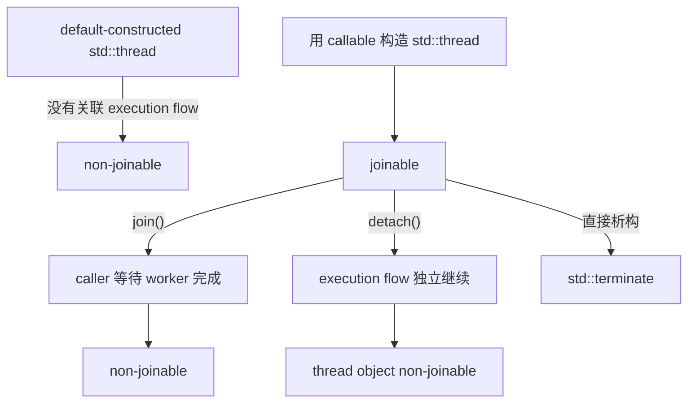
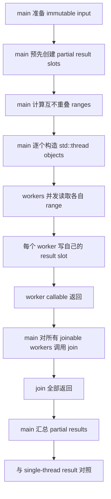

# Week7 Day1：`std::thread` 启动以后，谁拥有它的结束责任

> 今日主线：thread object、execution flow、joinable state、`join` / `detach`、argument ownership、result ownership。
>
> 今日类型：已有线程基础上的 C++ 生命周期深化 + 独立练习。
>
> 今日产出：`parallel_sum.cpp` 与 `day1_note.md`。
>
> 默认编译：`g++ -std=c++17 -Wall -Wextra -g -pthread`。

这份教程按用户要求提前生成。只有 Week6 Day7 正式验收、Week7 开始后再学习；提前生成不代表前置进度已经通过。

今天不新增 MIT 6.S081 阅读。Week5 已经完成 thread、scheduler 和 context switch 主线，今天研究的是 C++ object lifecycle。

今天不重复：

```text
创建两个 threads 打印 hello
打印 PID / TID / stack address
重新解释 context switch
重新做 shared counter data race
```

今天从一个更工程的问题出发：

```text
main 创建 worker 后准备离开 scope，
谁保证 worker 已结束、结果已完成、资源还能安全访问？
```

---

# Part 1：前情提要与必要术语

## 1. 从 Week5 接过来的基础

Week5 已经知道：

```text
同一 process 内可以有多个 threads
每个 thread 有自己的 registers、stack 和执行位置
threads 共享 process address space 中的 global / heap objects
scheduler 决定 runnable thread 何时真正获得 CPU
```

但 C++ 代码还需要回答另一层问题：

```text
哪个 C++ object 代表这个 thread？
object 离开 scope 时，execution flow 可能处于什么状态？
谁等待它结束？
它使用的 references 和 result storage 活得够久吗？
```

这就是今天的增量。

---

## 2. 必要术语

### 2.1 `std::thread` object

`std::thread` 是 C++ standard library 中用于表示和管理一个 thread of execution 的 object。

需要区分：

```text
std::thread object
-> 位于某个 C++ scope 中，有自己的 constructor/destructor 和 move semantics

thread of execution
-> 真正执行 callable 的执行流，由 OS/runtime 调度
```

它们有关联，但不是“同一个东西”。

---

### 2.2 task

`task`：任务，也就是“需要执行的一份工作”。

例如：

```text
计算 values[0, 1000) 的和
```

task 是业务工作；thread 是执行 task 的 execution resource。

一个 thread 可以将来执行多个 tasks，Week8 ThreadPool 就会利用这一点。今天仍是一条 thread 执行一个 range task。

---

### 2.3 joinable

`joinable`：可被 join。

当前可以记成：

```text
这个 std::thread object 仍关联着一个尚未由该 object 完成 join/detach 处理的 execution flow
```

注意：

```text
joinable == true
```

不等于 worker 此刻一定仍在 CPU 上运行。worker 即使已经执行完 callable，只要尚未 `join()` 或 `detach()`，thread object 仍可能是 joinable。

---

### 2.4 join

`join`：连接、汇合。

在 `std::thread` 中：

```text
caller 等待目标 thread 完成
-> 建立完成同步关系
-> std::thread object 变为 non-joinable
```

`join()` 不是终止 worker，也不是让两个 threads 合并成一个 thread。

---

### 2.5 detach

`detach`：分离。

它解除 `std::thread` object 与 execution flow 的 join 管理关系，使 object 变为 non-joinable，execution flow 可以继续独立运行。

`detach()` 不是：

```text
停止 worker
自动保证 references 仍有效
自动保存 result
自动传播 exception
```

系统项目默认不用 detach，因为它让 ownership、shutdown 和 lifetime 更难解释。

---

### 2.6 callable

`callable`：可调用对象。

包括：

```text
普通函数
lambda
function object
```

`std::thread` 启动后会在新的 execution flow 中调用它。

---

### 2.7 ownership

`ownership`：所有权或责任归属。

今天有三种 ownership：

```text
thread lifecycle ownership：谁负责 join
work ownership：每个 worker 负责哪个 range
result ownership：每个 worker 可以写哪个 result slot
```

并发代码如果只说“大家一起算”，而不说清这三类责任，很容易出现 race 或 lifetime bug。

---

### 2.8 partition

`partition`：划分。

今天把一个 input range 划成互不重叠的 subranges：

```text
[0, n)
-> [0, a) + [a, b) + [b, n)
```

正确 partition 必须满足：

```text
没有 overlap
没有 gap
覆盖完整 input
```

---

# Part 2：教程主体

# 教程开始

## 3. 一个危险但常见的写法

考虑：

```cpp
void start_work() {
    std::thread worker(do_work);
}
```

`start_work()` 返回时，local `worker` 开始析构。

此时有两个不同对象：

```text
C++ std::thread object：马上离开 scope
execution flow：可能仍在运行，也可能已经完成 callable
```

如果 `worker` 仍然 joinable，`std::thread` destructor 会调用 `std::terminate()`。

标准库不选择“自动 detach”，因为那可能让 execution flow 继续访问已经死亡的 local objects；也不选择“自动 join”，因为 destructor 可能意外阻塞很久。

所以 C++ 把决定权交给 programmer：

```text
join
或
detach
```

但必须在 joinable object 析构前明确处理。

---

### 3.1 为什么 joinable thread object 不能直接析构？
对。更准确地说：会让**整个进程**进入 `std::terminate()`，所以 main thread 当然也会被终止，进程里的其他线程也都会一起结束。

不是只终止某个 worker，也不是只让 `main` 自己退出，而是类似：

```text
某个 joinable std::thread object 析构
-> 调用 std::terminate()
-> 默认通常调用 std::abort()
-> 整个进程结束
-> main thread、worker threads 全部没了
```

所以它是在惩罚“线程所有权没有被明确处理”，而不是尝试回收那个已经结束的 execution flow。

---

## 4. `std::thread` 的状态主线



真正需要记住的是：

```text
只要 object 仍 joinable，就不能让它直接析构。
```

---

## 5. API：构造 `std::thread`

头文件：

```cpp
#include <thread>
```

概念接口：

```cpp
std::thread worker(callable, arguments...);
```

它做两件事：

```text
1. 在 thread object 内保存 callable 和 arguments 所需的对象
2. 启动新的 execution flow，调用保存的 callable
```

独立最小例子：

```cpp
void work(int id) {
    // This code runs in the worker execution flow.
}

std::thread worker(work, 7);
worker.join();
```

`7` 会作为普通 argument 被保存，不要求 main 中原来的临时值继续存在。

构造可能失败并抛出 `std::system_error`，例如 system 无法再创建 thread。`parallel_sum` 必须保证：即使创建到一半失败，前面已经成功创建的 joinable workers 也会被 join，不能在 stack unwinding 时直接析构。

---

## 6.0 decay 是啥意思？thread 内默认保存一份副本

`decay` 可以理解成：**把传进来的类型“变成适合按值保存的普通类型”**。

`std::thread` 创建时，默认不会一直保存你传入变量的引用；它会先对参数做 `std::decay`，然后把结果复制或移动到线程内部。

也就是 thread  内部默认保存一份独立的副本。

最常见的变化：

```cpp
int&        -> int
const int&  -> int
const int  -> int
int[10]     -> int*
函数类型     -> 函数指针
```

例如：

```cpp
void change(int& x) {
    x = 100;
}

int main() {
    int value = 1;
    std::thread worker(change, value);
    worker.join();
}
```

这里 `value` 会 decay 成 `int`，线程内部保存的是它的一份副本。可 `change` 需要 `int&`，它不能绑定到这个临时调用过程中的右值，所以通常会编译失败。

你要明确传原对象的引用：

```cpp
std::thread worker(change, std::ref(value));
```

`std::ref(value)` 本身是一个可按值保存的 `reference_wrapper<int>`；等线程真正调用 `change` 时，它会还原成 `value` 的 `int&`。

再看一个容易误解的例子：

```cpp
void print(const std::string& text);

std::string message = "hello";
std::thread worker(print, message);
```

能编译，但线程里 `text` 引用的是 `message` 的内部副本，不是原来的 `message`。因为 `message` decay 后按值复制进了 `std::thread`。

压缩记忆：

```text
std::thread(f, arg)
-> decay(arg)
-> 在线程对象内部保存副本或移动后的对象
-> 线程开始时用内部保存的对象调用 f

想保留“原对象引用”
-> std::ref(arg)
```

## 6. thread arguments 默认不是“直接引用原变量”

考虑：

```cpp
void increment(int& value);

int number = 0;
std::thread worker(increment, number);
```

直觉上可能以为 `number` 被按引用传入；但 `std::thread` 默认会把 arguments 以 decay 后的 value 形式保存。

如果 callable 确实要求引用语义，应显式写：

```cpp
std::thread worker(increment, std::ref(number));
```

头文件：

```cpp
#include <functional>
```

`std::ref(number)` 表示：

```text
不要把 number 当普通 value argument 保存；
调用时保留对原 object 的 reference semantics。
```

但它不延长 `number` 生命周期，也不提供 synchronization。

因此必须同时满足：

```text
number 活得比 worker 久
如果多个 threads 访问 number，另行满足 race-free contract
```

---

## 7. move-only argument 怎样交给 worker

如果 argument 是 move-only object，例如 `std::unique_ptr<int>`：

```cpp
void consume(std::unique_ptr<int> value);

auto value = std::make_unique<int>(42);
std::thread worker(consume, std::move(value));
worker.join();
```

这里的 ownership 变化：

```text
main 的 unique_ptr
-> std::move 转移到 thread 内部保存的 argument
-> worker callable 接管
```

启动后，main 中的 `value` 为空是正常 moved-from state。

今天的 `parallel_sum.cpp` 不要求使用 `unique_ptr`；这个例子只建立 thread argument 的 ownership 直觉。

---

## 8. API：`joinable()`

接口：

```cpp
bool joinable() const noexcept;
```

返回：

```text
true：thread object 当前关联一个需要 join/detach 处理的 execution flow
false：没有这种关联
```

常见状态：

```text
default construction -> false
成功用 callable 构造 -> true
join 之后 -> false
detach 之后 -> false
moved-from thread object -> false
```

它不是“worker 此刻是否正在执行”的查询 API。

---

## 9. API：`join()`

接口：

```cpp
void join();
```

作用：

```text
caller 阻塞等待 worker execution flow 完成
-> join 返回
-> thread object 变成 non-joinable
```

调用约束：

```text
只能对 joinable object 调用
不能 join 自己
同一个 object 不能 join 两次
```

`join()` 还是一个 synchronization point。

对于今天的结果读取：

```text
worker 在结束前写入自己的 partial result
-> main 对该 worker join 返回
-> main 再读取 result
```

main 不需要为了这次“join 后读取”再加 mutex。

---

## 10. API：`detach()` 为什么今天只讲不用

接口：

```cpp
void detach();
```

调用后：

```text
std::thread object non-joinable
execution flow 继续独立运行
```

危险场景：

```cpp
void unsafe() {
    int local = 42;
    std::thread worker(use_reference, std::ref(local));
    worker.detach();
}
```

`unsafe()` 返回后 `local` 死亡，但 detached worker 可能仍访问它，形成 dangling reference 和 undefined behavior。

即使 callable 不引用 local object，detached thread 仍让这些问题变难：

```text
process shutdown 时它是否结束？
错误怎样反馈？
result 放在哪里？
如何测试它不再访问 service object？
```

因此 Week7~Week8 项目默认：

```text
不使用 detach
owner 显式 shutdown 并 join workers
```

---

## 11. worker exception 不会自动传回 main

如果 exception 逃出 thread callable 顶层，程序会调用 `std::terminate()`。

下面不是有效的异常传播方式：

```text
worker throw
-> main 的 try/catch 自动接住
```

两条 execution flows 有各自的 call stack。

今天的练习使用不会主动抛异常的 sum task。Week8 学 `future / packaged_task` 时再正式处理 result/exception channel。

---

### 11.1 try catch 怎么capture 创建 thread 时的 except

`try/catch` 要包住 `std::thread` 的构造，也就是包住这一句：

```cpp
workers.emplace_back(use, i);
```

因为创建 OS thread 失败时，`std::thread` 构造函数会抛异常，常见类型是 `std::system_error`。而且创建到一半失败时，前面已经创建成功的线程还在运行，必须先 `join()` 它们。

```cpp
#include <exception>
#include <iostream>
#include <thread>
#include <vector>

void use(std::size_t id);

int run(std::size_t worker_count) {
    std::vector<std::thread> workers;

    try {
        workers.reserve(worker_count);

        for (std::size_t i = 0; i < worker_count; ++i) {
            workers.emplace_back(use, i);
        }
    } catch (...) {
        // 只要前面已经成功创建了一部分，就负责回收它们。
        for (std::thread& worker : workers) {
            if (worker.joinable()) {
                worker.join();
            }
        }
        throw;  // 清理完成，再把原异常交给上层
    }

    for (std::thread& worker : workers) {
        worker.join();
    }

    return 0;
}

int main() {
    try {
        return run(4);
    } catch (const std::exception& error) {
        std::cerr << "create worker failed: " << error.what() << '\n';
        return 1;
    }
}
```

流程是：

```text
创建第 0、1 个 thread 成功
-> 创建第 2 个时抛异常
-> 内层 catch join 已成功的 0、1
-> throw 把原异常继续抛出
-> main catch 打印错误并退出
```

`catch (...)` 这里是刻意的：不管是 `std::system_error`、内存分配失败，还是复制 callable/argument 时抛出的其他异常，都必须先回收已创建的线程。

注意，这只能捕获“**创建线程时**”的异常。若异常发生在线程函数内部：

```cpp
void use(std::size_t id) {
    throw std::runtime_error("failed");
}
```

外层创建线程的 `try/catch` 捕不到；线程内没有捕获时，程序会 `std::terminate()`。这个属于另一条“线程内异常如何传回主线程”的问题。

---

### 11.2 throw 后函数剩余部分不会被执行

对，`throw;` 之后，`run()` 里 catch 后面的正常 `join()` 循环不会执行。它不是 `return`，而是**重新抛出当前异常**，控制流会跳到外层能匹配它的 `catch`。注释 1

```text
emplace_back 创建第 3 个线程失败
-> 跳进内层 catch
-> join 已成功创建的前几个线程
-> throw;
-> 离开 run()
-> 跳到 main 的 catch
-> 打印错误、return 1
```

所以那段代码故意把“异常路径的 join”放在内层 catch：

```cpp
catch (...) {
    for (std::thread& worker : workers) {
        if (worker.joinable()) {
            worker.join();
        }
    }
    throw;
}
```

而 catch 外面的：

```cpp
for (std::thread& worker : workers) {
    worker.join();
}
```

只负责**所有线程都创建成功**的正常路径。

若 `throw;` 往外抛后一直找不到匹配的 `catch`，程序最终会因未捕获异常而调用 `std::terminate()`；也不会回头执行 `run()` 剩余部分。

## 12. `parallel_sum` 为什么不需要 shared counter

错误直觉：

```text
所有 workers 都把结果累加到同一个 shared total
```

那会立刻需要 mutex 或 atomic，而且把今天的 lifecycle 问题和 Day2/Day6 混在一起。

今天采用 ownership 分离：

```text
worker 0 -> input range 0 -> partial_results[0]
worker 1 -> input range 1 -> partial_results[1]
worker 2 -> input range 2 -> partial_results[2]
main     -> join all -> sum partial_results
```

只要：

```text
input 只读
每个 worker 写不同 result element
vector 在启动 workers 前完成 size allocation
worker 运行期间不 resize vector
main 在 join 后读取
```

就不需要 mutex。

这里体现一个重要并发设计原则：

```text
能通过 ownership partition 避免 shared writes 时，先避免共享；
不要看到 threads 就立刻加一把全局锁。
```

---

## 13. range partition 怎样不重不漏

假设：

```text
n = values.size()
w = actual worker count
```

需要得到 `w` 个半开区间：

```text
[begin_0, end_0)
[begin_1, end_1)
...
[begin_w-1, end_w-1)
```

必须验证：

```text
begin_0 == 0
end_i == begin_(i+1)
end_(w-1) == n
每个 begin_i <= end_i
```

当 `n` 不能整除 `w` 时，可以让前几个 workers 多处理一个 element，或让最后一个 worker 接剩余部分。选择哪一种不重要，重要的是 contract 可验证。

边界：

```text
empty input -> sum = 0，不创建无意义 workers也可以
requested workers = 0 -> 明确修正为 1 或报错，不能除以 0
workers > n -> clamp 到 n，避免大量 empty tasks
```

---

### 13.1 用一组具体数字检查 range

假设输入共有 `10` 个 elements，实际使用 `3` 个 workers。若采用“前面的 workers 多拿一个”策略：

```text
n = 10
w = 3
base = n / w = 3
remainder = n % w = 1
```

得到：

```text
worker 0 -> [0, 4)  -> 4 elements
worker 1 -> [4, 7)  -> 3 elements
worker 2 -> [7, 10) -> 3 elements
```

不要只看每段长度，还要沿边界检查：

```text
第一段从 0 开始
4 == 下一段 begin
7 == 下一段 begin
最后一段在 10 结束
4 + 3 + 3 == 10
```

因此没有 overlap，也没有 gap。若 `n = 3, requested_workers = 10`，先把实际 worker count 限制为 `3`，就会得到三个长度为 `1` 的 range；这比创建七个 empty tasks 更容易解释和测试。

边界计算本身在 main 中完成。worker 不应该一边运行一边争抢“下一段从哪里开始”，否则 Day1 又会被迫引入 shared counter 与 synchronization。

---

### 13.2 thread object 与 execution flow 的具体时间线

下面只跟踪一个 worker：

```text
T0: main 中还没有 std::thread object
T1: 构造 worker，系统创建新的 execution flow
T2: worker.joinable() == true
T3: main 与 worker 都可能运行，先后顺序不保证
T4: worker 写入 partial_results[0]
T5: worker callable return，execution flow 已经结束
T6: 此时 std::thread object 仍可能 joinable
T7: main 调用 worker.join()
T8: join 返回，worker.joinable() == false
T9: worker object 可以安全析构
```

最容易误解的是 `T5 -> T6`：

```text
execution flow 已结束
!=
thread object 已经被 join
```

`joinable()` 查询的是 thread object 是否还关联着一份需要处理的 thread ownership，不是 worker 此刻是否仍占用 CPU。即使 callable 早已返回，只要还没有 `join()` 或 `detach()`，对象仍可能是 joinable。

再看 result visibility：

```text
partial_results[0] 初始为 0
worker 写入 55
worker return
main 的 join() 返回
main 读取 55
```

这里 main 在 `join()` 返回以后读取，worker 完成前的 writes 对 main 可见。不要把顺序改成“main 先读，再 join”；后者不仅可能读到旧值，也没有遵守今天的 result ownership contract。

---

### 13.3 `std::thread` 不能 copy，但可以 move

thread object 表示一份独占的结束责任，因此：

```text
copy construction：禁止
copy assignment：禁止
move construction：允许
move assignment：有严格前提
```

独立最小例子：

```cpp
std::thread first(work, 1);
std::thread second = std::move(first);

// first no longer owns the thread association.
std::cout << first.joinable() << '\n';
std::cout << second.joinable() << '\n';

second.join();
```

ownership 变化是：

```text
first owns join responsibility
-> move
second owns join responsibility
first becomes non-joinable
```

这也是 `std::vector<std::thread>` 能工作的原因。vector 扩容时不能 copy thread objects，而会 move 它们；被移动后的旧对象不再承担 join 责任，新位置中的对象继续承担。

但有一个危险边界：不要把一个 joinable thread move-assign 到另一个仍然 joinable 的 thread object 上。旧目标关联的 thread 没有先被处理，这会导致程序终止。当前练习采用 `emplace_back(...)` 创建 workers，并在最后逐个 `join()`，不需要手写 thread move assignment。

如果要减少 vector 扩容，也可以在启动前：

```cpp
workers.reserve(actual_worker_count);
```

`reserve` 不是 correctness 必需条件；它只是提前准备 storage。真正的 correctness 条件仍是：vector 中每个 joinable object 最终都有明确的 `join()`。

---

### 13.4 lambda capture 也有 lifetime contract

这段代码看起来很短：

```cpp
for (std::size_t i = 0; i < worker_count; ++i) {
    workers.emplace_back([&] {
        use(i);
    });
}
```

但 `[&]` 让所有 workers 引用同一个 loop variable `i`。worker 真正执行 `use(i)` 时，main 可能已经修改了 `i`，甚至 loop 已结束。于是多个 workers 可能看到同一个最终值，并且还可能产生 data race 或 dangling reference。

若每个 task 需要自己的 index，应当让该值进入 task 自己的 stored state，例如 capture `i` by value。与此同时，大型只读 input 可以按 reference capture，但必须满足：

```text
input object 活得比所有 workers 久
workers 只读 input
main 不在 workers 运行期间 resize 或销毁 input
```

所以不能把“按值 capture 总安全”“按引用 capture 总危险”当口诀。真正要问的是：

```text
这个 task 保存的是 value 还是 reference？
reference 指向谁？
owner 何时销毁它？
是否存在并发写？
```

### 13.4.1 这里的 lamda 的按引用捕获
`[&]` 是 lambda 的 capture list，意思是：

```cpp
[&] {
    use(i);
}
```

这个 lambda 用到外层局部变量时，默认都按**引用**捕获。

所以这里的 `i` 不是复制一份给每个线程，而是所有线程都引用同一个循环变量 `i`。这很危险：

```cpp
for (...) {
    workers.emplace_back([&] {
        use(i);
    });
}
```

线程什么时候真正执行不可预测。它可能看到 `i == 0`、`1`，也可能循环已经结束，看见最终的 `worker_count`；循环结束后 `i` 的生命周期也结束，线程再访问它就是悬空引用，属于未定义行为。

这里应写成按值捕获：

```cpp
workers.emplace_back([i] {
    use(i);
});
```

每轮循环都会把当前 `i` 复制进该 lambda，线程各自拥有自己的编号。

你对 `emplace_back` 的理解是对的。它先在 `workers` 这个 `vector<std::thread>` 的尾部原地构造一个 `std::thread`，再把参数转交给 `std::thread` 的构造函数。

因此如果 `use` 是普通函数：

```cpp
void use(std::size_t id);
```

那么完全可以直接写：

```cpp
workers.emplace_back(use, i);
```

等价思路是：

```cpp
std::thread worker(use, i);
workers.emplace_back(std::move(worker));
```

但前者少一次中间对象构造，更自然。

这里 `std::thread` 会对 `i` 做 decay 后按值保存，所以也是安全的：每个线程拿到的是自己的 `i` 副本。

压缩记忆：

```text
[&]：外部局部变量按引用捕获
[i]：只把 i 按值捕获
emplace_back(use, i)：
    vector 原地构造 std::thread
    std::thread 默认保存 use 和 i 的副本
```

在“循环创建多个线程”这个场景里，优先写 `workers.emplace_back(use, i);` 或 `[i] { use(i); }`，别写 `[&] { use(i); }`。

---

### 13.5 thread 创建到一半失败时，谁 join 已创建的 workers

`std::thread` construction 可能抛出 `std::system_error`。假设计划创建四个 workers：

```text
worker 0 创建成功
worker 1 创建成功
worker 2 创建时抛异常
```

此刻 vector 里已有两个 joinable objects。如果异常直接离开函数，vector 析构会继续析构这两个 objects，而 joinable thread object 的 destructor 会调用 `std::terminate()`。因此“最后有一个正常 join loop”还不够，异常路径也必须处理已成功创建的 workers。

Day1 主练习中的计算 task 不主动抛异常；但 thread creation 本身可能抛异常，所以 cleanup ownership 仍属于核心 contract：

```text
一旦第一个 worker 创建成功
-> 当前 scope 就拥有清理所有已创建 workers 的责任
-> 无论后续是正常路径还是异常路径，都不能让 joinable object 直接析构
```

C++20 有 `std::jthread` 帮助表达 scope-based joining；当前路线坚持 C++17，所以可以写一个只负责遍历 `vector<thread>` 并 join joinable objects 的小型 RAII guard，或者用 `try/catch` 在重新抛出前 join 已创建的 workers。它不是 ThreadPool，只是把“当前 scope 拥有 join 责任”写进 C++ object lifetime。

---

### 13.6 `join()` 的失败边界

以下调用都违反前提：

```text
对 default-constructed thread 调用 join
对已经 join 过的 object 再 join
对已经 detach 的 object 调用 join
一个 thread 尝试 join 自己
```

标准库会以 `std::system_error` 报告相应错误。工程代码不应依赖“调用后再接异常”维持正常流程，而应让 ownership 结构本身保证每个 object 只被正确处理一次。

压缩成一句：

```text
std::thread 是 join responsibility 的 move-only owner；callable return 只结束 execution flow，join 才完成 owner 的收尾。
```

### 13.6.1 具体啥意思？join 失败的是什么情况？
意思是：

```cpp
std::thread worker;
```

这行只创建了一个 `std::thread` 对象，但它**没有管理任何实际运行的线程**。这叫 default-constructed thread，默认构造的线程对象。

所以：

```cpp
std::thread worker;

worker.join();  // 错
```

`join()` 的前提是：这个对象当前必须确实关联着一个还没被 `join` 或 `detach` 的线程，也就是：

```cpp
worker.joinable() == true
```

而默认构造后：

```cpp
worker.joinable() == false
```

因此 `worker.join()` 会抛出 `std::system_error`。

正确写法是：

```cpp
std::thread worker;

if (worker.joinable()) {
    worker.join();
}
```

不过更常见的是正常创建后直接 join：

```cpp
std::thread worker(use, 1);
worker.join();
```

下面这些对象也都不能再次 `join()`：

```cpp
std::thread a;              // 从未关联线程
std::thread b(work);
b.join();                   // 已经 join 过

std::thread c(work);
c.detach();                 // 已经 detach

std::thread d(work);
std::thread e = std::move(d); // d 已被移走
```

它们共同点都是：调用时 `joinable() == false`。

---

## 14. main 与 workers 的完整因果链



注意主体：

```text
worker 负责计算和写自己的 slot
main 负责 thread objects、join 和最终汇总
scheduler 决定每个 execution flow 何时运行，但不替 main 做 join
```

---

# Part 3：收尾、练习、测试与验收

## 15. 今日产出：`parallel_sum.cpp`

### 15.1 程序是干什么的

程序把一个 integer vector 划成多个不重叠 ranges，由多个 workers 各自计算 partial sum；main 等待所有 workers 后汇总，并与单线程结果比较。

输入：

```text
main 中构造的 std::vector<int>
requested worker count
```

输出：

```text
single-thread sum
parallel sum
actual worker count
每个 worker 的 range 与 partial result（可选诊断）
PASS / FAIL
```

正常结束：

```text
所有成功创建的 workers callable 返回
main join 所有 joinable thread objects
main 汇总 result
objects 按 scope 正常析构
```

今天不实现：

```text
ThreadPool
shared task queue
atomic shared total
detach
并行性能 benchmark
```

---

### 15.2 建议函数职责

函数可以自行命名，但职责至少分清：

```text
range_sum：只计算 [begin, end)，不创建 thread
parallel_sum：划分 ranges、创建/join workers、汇总
main：准备 cases、调用并比较结果
```

源文件顶部注释说明整体用途；每个自定义函数说明 input、output 和访问哪些 shared objects。

不要求把代码拆成 `.hpp/.cpp`。

---

### 15.3 核心 contract

```text
input 在 workers 运行期间只读
每个 worker 只写一个独立 partial result slot
启动 workers 后不修改 input size
启动 workers 后不 resize partial result storage
所有 ranges 不重叠、不遗漏
main 只在 join 后汇总
不调用 detach
第一个 worker 创建成功后，任何后续异常路径都必须先 join 已创建 workers
```

如果使用 lambda capture，必须能解释每个 capture 是 value 还是 reference，以及 reference object 的 lifetime。

---

## 16. 固定测试

至少覆盖：

```text
empty vector
one element, one worker
10 elements, one worker
10 elements, three workers
3 elements, requested 10 workers
包含 negative values
较大 vector，与 std::accumulate 对照
受控模拟在成功创建两个 workers 后抛异常，确认已创建 workers 被 join，程序不会 std::terminate
```

每个 case 都检查：

```text
parallel result == trusted single-thread result
程序正常退出
没有 joinable destructor terminate
受控 failure path 被 caller 捕获或报告，且 cleanup 已完成
```

这里不要求真的耗尽系统 thread resources。可以只在 test path 中加入一个明确的“创建到第 `k` 个 worker 后抛出 `std::runtime_error`”开关，用它验证 ownership cleanup；正式计算路径关闭该开关。测试目标是 cleanup protocol，不是伪造 `std::system_error` 的具体 error code。

该 test-only exception 位于：

```cpp
#include <stdexcept>

throw std::runtime_error("simulated worker creation failure");
```

不要靠 workers 的打印顺序判断正确性。输出顺序不确定是正常现象。

---

### 16.1 加入主动抛异常测试

意思是：不等系统真的“创建线程失败”，而是在测试模式下自己故意写一条 `throw`，模拟“前两个 worker 已经创建成功，准备创建第三个时失败”。

例如你的创建循环里有：

```cpp
for (std::size_t i = 0; i < actual_workers; ++i) {
    if (i == 2) {
        throw std::runtime_error("simulated worker creation failure");
    }

    workers.emplace_back(work, ...);
}
```

`i == 2` 时，前面已经成功创建了：

```text
workers[0]：joinable
workers[1]：joinable
```

现在主动 `throw`：

```text
throw
-> 进入 catch
-> catch 逐个 join workers[0]、workers[1]
-> 再把异常交给调用者，或返回失败
```

你要验证的不是异常信息，而是这条链：

```text
已经创建两个 thread
-> 创建过程失败
-> 已创建线程仍被 join
-> 不会因为 joinable thread object 析构而 std::terminate
```

这叫 **controlled failure injection**，即“受控地注入失败”。它不是让 worker 自己抛异常；worker 中未捕获的异常会直接导致 `std::terminate()`，那是另一件事。

---

## 17. 编译与运行

```bash
g++ -std=c++17 -Wall -Wextra -g -pthread \
  parallel_sum.cpp -o parallel_sum

./parallel_sum
```

今日可选 TSan：

```bash
g++ -std=c++17 -Wall -Wextra -g -O1 -pthread \
  -fsanitize=thread -fno-omit-frame-pointer \
  parallel_sum.cpp -o parallel_sum_tsan

./parallel_sum_tsan
```

TSan 无 report 是补充证据；range coverage 和结果对照仍需自己验证。

---

## 18. 可选增强，不阻塞 Day1

```text
为 range partition 单独写 tests
记录 hardware_concurrency 但不把它当硬性 worker count
```

今天不要为了异常安全 helper 提前做成 ThreadPool。

---

## 19. 验收问题

1. `std::thread object` 与真正运行 callable 的 execution flow 有什么区别？
2. worker callable 已经返回，但还没 `join()` 时，thread object 为什么仍可能 `joinable()`？
3. 为什么 joinable thread object 不能直接析构？
4. `join()` 改变了什么状态？它会不会主动终止 worker？
5. `detach()` 为什么不能解决 reference lifetime 和 graceful shutdown？
6. `std::ref` 做了什么，又没有做什么？
7. 为什么 `parallel_sum` 可以不用 mutex？请从 input、ranges、result slots 和 join 顺序说明。
8. main 为什么必须在 join 后再汇总 partial results？

---

## 20. 推荐的 `day1_note.md` 结构

```markdown
# Week7 Day1 Note

## 1. thread object / execution flow / task 的区别

## 2. joinable -> join/detach -> non-joinable

## 3. callable arguments 的 value/reference/move 语义

## 4. parallel_sum 的 range 和 result ownership

## 5. 测试结果与真实问题

## 6. 验收回答
```

只记录新增理解和真实问题，不重复 Week5 的 thread identity 笔记。

---

## 21. 今日压缩记忆

```text
std::thread object 负责管理与一个 execution flow 的关联，
但 scheduler 运行的是 execution flow，不是 C++ object 本身。

joinable object 析构会 terminate；
项目代码必须明确谁负责 shutdown 和 join。

并发设计先划分 work/result ownership，
能避免 shared writes 时，不要先加全局锁。
```
