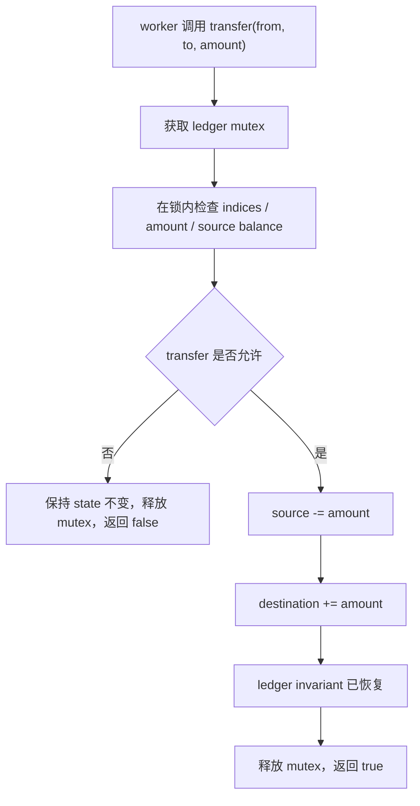
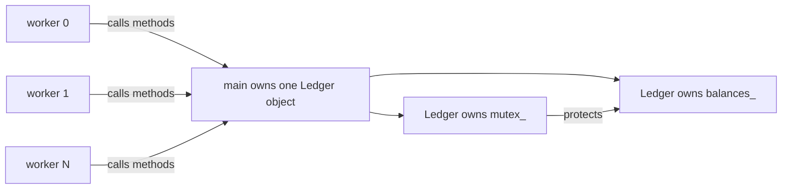

# Week7 Day2：`mutex` 保护的是 shared invariant，不是“这几行代码”

> 今日主线：data race、race condition、shared state、invariant、critical section、`lock_guard`、`unique_lock`、lock scope。
>
> 今日类型：并发正确性机制 + 独立 class 练习。
>
> 今日产出：`shared_invariant.cpp` 与 `day2_note.md`。
>
> 默认编译：`g++ -std=c++17 -Wall -Wextra -g -pthread`。

学习前置：Week7 Day1 已验收。提前生成不代表 Day1 已经完成。

今天不重新做 Week5 的“多个 threads 对同一个 counter 执行 `++`”入门练习。今天把问题升级为：

```text
多个 fields 单独看都只是整数，
但它们之间必须始终满足某个关系；
mutex 到底应该保护哪个关系？
```

---

# Part 1：前情提要与必要术语

## 1. 从 Day1 的 ownership partition 接过来

Day1 的 `parallel_sum` 通过划分 ownership 避免共享写：

```text
每个 worker 写不同 result slot
main 在 join 后读取
```

但很多真实组件无法完全避免共享状态，例如：

```text
多个 threads 修改同一个 bank ledger
多个 producers/consumers 修改同一个 queue
多个 workers 更新同一组 service statistics
```

这时需要 synchronization。

不过“加一把锁”之前，必须先说清楚它保护什么。

---

## 2. 必要术语

### 2.1 shared state

`shared state`：共享状态。

它不是“放在 global 区的变量”的同义词。只要同一个 object 可以被多个 execution flows 访问，它就可能是 shared state：

```text
global object
heap object
通过 reference 传给多个 workers 的 local object
class object 内的 members
```

---

### 2.2 conflicting actions

`conflicting actions`：冲突访问。

对同一 memory location 的两个访问中，至少一个是 write，就可能形成冲突：

```text
read + write
write + write
```

两个纯 reads 不冲突。

---

### 2.3 data race

`data race`：数据竞争。

当前层次的定义：

```text
不同 threads 对同一 memory location 发生 conflicting actions
并且没有适当 synchronization 建立顺序
```

在 C++ 中，普通 object 上的数据竞争通常导致 undefined behavior。

因此“最后结果偶尔不对”只是可能现象；compiler 并不需要保留你想象中的逐条交错模型。

---

### 2.4 race condition

`race condition`：竞态条件。

它是更广的逻辑概念：结果是否正确取决于不同 execution flows 的时序。

`race condition`：程序结果依赖线程谁先执行，如果不是这个顺序的话可能导致**业务逻辑错**。

可能出现：

```text
有 data race 的 race condition，可能运气好对了一次
没有 data race，但业务步骤组合错误的 race condition
```

例如每个 atomic operation 都合法，不代表“先检查余额再扣款”这个复合业务操作整体原子。

---

### 2.5 nondeterministic order

`nondeterministic`：非确定的。

多个 workers 打印顺序每次不同，并不自动表示有 bug：

```text
worker 2 先完成
worker 0 后完成
```

只要程序不把这个顺序当 correctness requirement，它可以是合法调度结果。

所以：

```text
不确定顺序 != data race
```

---

### 2.6 invariant

`invariant`：不变量，也就是在规定观察边界上必须保持成立的关系。

bank ledger 例子：

```text
sum(all account balances) == initial total
every balance >= 0
```

转账中间可能暂时执行了：

```text
from -= amount
```

但在释放 ledger mutex 前，还必须完成：

```text
to += amount
```

其他 threads 不应在中间状态观察 ledger。

---

### 2.7 critical section

`critical section`：临界区。

它是访问受保护 shared state、必须保持互斥的一段执行区域。

critical section 的边界来自 invariant，不是来自缩进好看与否。

---

### 2.8 mutex

`mutex`：mutual exclusion，互斥。

同一时刻只允许一个 thread 持有同一 mutex。

它不“属于某几行代码”；更准确的说法是：

```text
所有遵守约定的 methods 在访问某组 shared state 前获取同一 mutex。
```

---

### 2.9 lock scope

`lock scope`：持锁范围。

太小：

```text
只保护单个 write，却让复合 invariant 在中间暴露
```

太大：

```text
把 sleep、I/O、复杂计算也放在锁内，增加 contention
```

正确范围首先服务 correctness，再在保持 invariant 的前提下缩短。

---

### 2.10 deadlock

`deadlock`：死锁。

多个 execution flows 彼此等待对方持有的资源，导致谁也不能继续。

今天只复习第一层：

```text
Thread A 持有 mutex A，等待 mutex B
Thread B 持有 mutex B，等待 mutex A
```

Day2 核心练习使用一把 ledger mutex，不把多锁设计作为主要难度。

---

# Part 2：教程主体

# 教程开始

## 3. 为什么“每个变量各自加锁”仍可能错

假设 ledger 有两个 balances：

```text
Alice = 100
Bob   = 100
total = 200
```

一次转账：

```text
Alice -= 30
Bob   += 30
```

如果分别保护两个写操作，但允许另一个 thread 在中间读取：

```text
Alice = 70
Bob   = 100
observed total = 170
```

每一次单独 write 可能都“持过锁”，但 ledger invariant 被中间观察破坏。

真正需要互斥的是一次完整 transaction：

```text
检查 source balance
-> 更新 source
-> 更新 destination
-> 重新满足 total invariant
-> 释放 mutex
```

所以 mutex 保护的是：

```text
balances collection 及其跨元素关系
```

不是某个孤立 `long long`。

---

## 4. 一把 ledger mutex 的正常主线



所有读取完整 ledger snapshot 的 method 也必须获取同一 mutex。否则 reader 仍可能与 writer data race，或看到复合更新中间态。

---

## 5. mutex 建立的不只是“轮流进去”

同一 mutex 上：

```text
Thread A 在 unlock 前写入 shared state
-> Thread B 之后成功 lock 同一 mutex
-> Thread B 能在同步关系下观察 A 已完成的受保护更新
```

当前先把它记成：

```text
same mutex 的 unlock -> later successful lock
建立跨 thread 的可见性和顺序保证
```

这比“CPU 一次只跑一个 thread”更准确。即使两个 threads 真正在不同 CPU cores 上并行，mutex 仍提供所需 synchronization。

---

## 6. API：`std::mutex`

头文件：

```cpp
#include <mutex>
```

常见接口：

```cpp
void lock();
bool try_lock();
void unlock();
```

项目代码通常不手工成对写 `lock()` / `unlock()`，而让 RAII lock object 管理。

原因：

```text
return
exception
新增 branch
```

都可能让手写 `unlock()` 被漏掉。

---

## 7. API：`std::lock_guard`

头文件：

```cpp
#include <mutex>
```

概念接口：

```cpp
std::lock_guard<std::mutex> guard(mutex);
```

状态变化：

```text
construction -> lock mutex
destruction  -> unlock mutex
```

独立最小例子：

```cpp
void set_value(int new_value) {
    std::lock_guard<std::mutex> guard(mutex_);
    value_ = new_value;
}
```

适合：

```text
整个 lexical scope 都需要持锁
不需要中途 unlock/relock
不需要把 lock 传给 condition_variable::wait
```

`guard` 名字不是语义重点，RAII lifetime 才是。

---

## 8. API：`std::unique_lock`

头文件：

```cpp
#include <mutex>
```

常见构造：

```cpp
std::unique_lock<std::mutex> lock(mutex);
```

它与 `lock_guard` 一样可以在构造时 lock、析构时 unlock，但它还允许：

```text
暂时 unlock
再次 lock
转移 lock ownership
配合 condition_variable::wait
```

独立最小例子：

```cpp
std::unique_lock<std::mutex> lock(mutex_);
prepare_shared_state();
lock.unlock();
do_slow_work_without_holding_mutex();
```

不要因为它功能更多就所有地方都用它。

当前选择：

```text
普通固定 scope -> lock_guard
condition_variable wait 或确实需要改变持锁状态 -> unique_lock
```

---

## 9. API：`std::scoped_lock`

C++17 提供：

```cpp
std::scoped_lock lock(mutex_a, mutex_b);
```

它可以协调获取多个 mutex，减少手工相反顺序造成 deadlock 的风险。

独立用途示例：

```cpp
void update_two_resources(
    std::mutex& first_mutex,
    std::mutex& second_mutex) {
    if (&first_mutex == &second_mutex) {
        std::lock_guard<std::mutex> guard(first_mutex);
        // Update state protected by this one mutex.
        return;
    }

    std::scoped_lock lock(first_mutex, second_mutex);
    // Update state that requires both mutexes.
}
```

今天的正式 ledger exercise 使用一把 mutex，不要求实现 per-account mutex。这个 API 只作为后续多锁场景的入口。

---

## 10. 为什么 getter 也可能需要锁

这里的 “不自动 synchronization” 可以直接理解为：

```text
const 不会让线程排队。
const 不会加锁。
const 不会保证读到最新值。
const 不会阻止另一个线程同时写。
```

例如有余额：

```cpp
class Account {
public:
    long long balance() const {
        return balance_;
    }

    void deposit(long long amount) {
        balance_ += amount;
    }

private:
    long long balance_ = 0;
};
```

两个线程同时做：

```text
reader: balance()          -> 读 balance_
writer: deposit(100)       -> 写 balance_
```

它们访问的是同一个 `balance_`，其中 writer 在写。即使 reader 调用的是 `const balance()`，仍然可能在 writer 写到一半时读取。

这叫 read/write conflict。若两边没有锁或 atomic 等同步机制，就是 C++ data race，行为未定义。

真正的 synchronization 是这样：

```cpp
class Account {
public:
    long long balance() const {
        std::lock_guard<std::mutex> guard(mutex_);
        return balance_;
    }

    void deposit(long long amount) {
        std::lock_guard<std::mutex> guard(mutex_);
        balance_ += amount;
    }

private:
    mutable std::mutex mutex_;
    long long balance_ = 0;
};
```

完整关系：

```text
writer 拿 mutex_
-> 修改 balance_
-> 释放 mutex_

reader 之后拿到同一个 mutex_
-> 读取 balance_
-> 释放 mutex_
```

同一时刻只有一个线程能持有这把锁，所以 reader 和 writer 不会并发访问 `balance_`；并且 writer 的 unlock 会让之后成功 lock 的 reader 看见前面的修改。

`mutable` 是因为 `balance()` 是 `const` 函数。普通情况下，`const` 函数不能修改成员；但 `lock()` 会改变 `mutex_` 自己的内部锁状态。这个改变不算“账户余额这个业务对象的状态改变”，所以把 mutex 标为 `mutable`：

```text
balance_：业务状态，const getter 不应修改
mutex_：保护业务状态的工具状态，可以在 const getter 中 lock/unlock
```

一句压缩记忆：

```text
const 管“这个函数是否改业务数据”；
mutex/atomic 管“多个线程能否安全地同时访问数据”。
```

它们解决的是两件完全不同的事。

---

## 11. 为什么不要返回内部 reference

下面这版可以直接接在原段落后面：

---

### 11.1 先区分：返回 reference 到底返回了什么

```cpp
const std::vector<long long>& balances() const;
```

返回的不是一份新的余额数据，而是一个 **reference**：

```text
caller 获得的是内部 balances_ 的别名
```

因此：

```cpp
const auto& view = ledger.balances();
```

这里的 `view` 和 `ledger` 内部的 `balances_` 是同一个 vector，不是副本。

`const` 只限制 caller 不能通过 `view` 修改它：

```cpp
view[0] = 100;  // 不允许
```

但它不能阻止其他 thread 通过 ledger 的写接口修改内部 `balances_`。

---

### 11.2 “函数里已经加锁”为什么仍不安全

假设 getter 这样写：

```cpp
const std::vector<long long>& balances() const {
    std::lock_guard<std::mutex> guard(mutex_);
    return balances_;
}
```

实际时间线是：

```text
reader 调用 balances()
    |
    v
getter 获得 mutex_
    |
    v
return 内部 balances_ 的 reference
    |
    v
getter 结束，guard 析构，mutex_ 解锁
    |
    v
reader 才开始在函数外使用那个 reference
```

重点是：

```text
lock 只保护 getter 函数执行期间。
reference 返回以后，lock 已经没有了。
```

此时另一个 writer 可以：

```text
获得 mutex_
-> 修改 balances_
-> 释放 mutex_
```

而 reader 同时读取 `view`，就形成了对同一内部 vector 的并发 read/write。

---

### 11.3 最坏情况不只是读到旧值

如果 writer 只是修改某个元素：

```text
reader 读 balances_[0]
writer 写 balances_[0]
```

没有同步就是 data race。

---

你这个理解差一点点，关键要把“`view` 指向谁”分开看。

`:codex-annotation{index="1"}`

```cpp
const std::vector<long long>& view = ledger.balances();
```

`view` 是对 **vector 对象本身** 的别名，不是对 vector 内部元素数组的别名。

所以若 `balances_` 是类的成员：

```cpp
std::vector<long long> balances_;
```

另一个线程执行：

```cpp
balances_.push_back(100);
```

发生扩容时，通常是：

```text
旧 elements buffer 被释放
-> elements 被搬到新的 buffer
-> balances_ 这个 vector 对象本身仍在原处
```

因此：

```text
view：仍然是 balances_ 这个 vector 对象的别名
view 本身不会因为 vector 扩容而失效
```

但下面这些会失效：

```cpp
const long long& first = view[0];
auto it = view.begin();
const long long* p = view.data();
```

因为它们指向的是 vector 内部的 elements buffer。扩容后，旧 buffer 没了，它们就可能 dangling。

不过对并发场景来说，即使你只保留 `view`：

```cpp
const auto& view = ledger.balances();
// writer 同时 push_back / 修改 / clear
auto x = view[0];
```

仍然不安全。不是因为 `view` 一定 dangling，而是 reader 正在读 vector 的内部状态时，writer 正在修改同一个 vector，没有同步，已经是 data race。

我之前那句“caller 手里的 reference 可能失效”说得不够精确。更准确应为：

```text
返回的 vector reference 通常不会因 vector 自身扩容而失效；
但它不能保护 caller 后续访问 vector 的过程。

扩容会使指向元素的 pointer/reference/iterator 失效；
并发读写 vector 本身则可能直接构成 data race。
```

至于“reference 本质上是不是 `const pointer`”：

```cpp
const std::vector<long long>& view
```

不是 “const pointer”。它的含义是：

```text
一个绑定到 vector 的 reference；
通过它不能修改 vector。
```

它更接近“不可重新绑定的别名”。

---

### 11.4 snapshot 为什么安全

snapshot: 快照

推荐接口：

```cpp
std::vector<long long> balances() const {
    std::lock_guard<std::mutex> guard(mutex_);
    return balances_;
}
```

这里返回值不是 reference，而是一份 copy。

```text
reader 获得 mutex_
-> 复制内部 balances_ 到新 vector
-> unlock
-> caller 获得自己的 vector
```

之后 writer 再修改 ledger 内部数据，不会影响 caller 的 snapshot。

```cpp
const auto snapshot = ledger.balances();
```

`snapshot` 由 caller 自己拥有，生命周期也由 caller 决定。

---

### 11.4.1 vector 返回值的过程

对，这样理解已经对了。

```cpp
const auto snapshot = ledger.balances();
```

`balances()` 的返回类型是：

```cpp
std::vector<long long>
```

也就是“按值返回一个 vector”。

因此在函数执行时，会产生一个新的 vector，它的内容是从内部 `balances_` 复制来的：

```text
内部 balances_
-> copy
-> 新 vector
```

然后 caller 用变量名：

```cpp
snapshot
```

来拥有、使用这个新 vector。

在 C++17 里可以直接把它理解成：

```text
函数返回时创建的那个新 vector
=
caller 里的 snapshot
```

不需要再脑补：

```text
内部 balances_
-> tmp
-> snapshot
```

这两个 vector。

所以你的这句话可以稍微精确成：

```text
函数返回一个新的 vector 值；
这个新 vector 从内部 balances_ 复制而来；
caller 用 snapshot 这个变量名拥有它。
```

而不是返回内部原来的 `balances_` 本体。

---

### 11.5 snapshot 不是什么

snapshot 不是“永远最新的余额”：

```text
它只是复制时刻的一致视图。
之后内部余额变化，snapshot 不会自动更新。
```

这正是它安全的原因之一：caller 手里的数据不再和内部可变状态绑在一起。

压缩记忆：

```text
返回内部 reference：
借出内部对象，但锁已释放，caller 后续访问不受保护。

返回 snapshot：
锁内复制，caller 拥有自己的数据；
内部后续变化不会影响这份副本。
```

---

## 12. critical section 中不要做什么

在保持 correctness 前提下，尽量不要在 ledger mutex 内：

```text
sleep
阻塞 I/O
大量 cout
与 invariant 无关的耗时计算
调用未知 callback
```

原因：其他需要 ledger mutex 的 threads 全部等待。

但也不能为了缩短 scope 把复合更新拆开。

正确顺序：

```text
先确定 invariant 所需最小原子业务步骤
-> 保证完整步骤受锁保护
-> 再把无关工作移到锁外
```

---

### 12.1 一次合法交错怎样破坏 transfer invariant

假设：

```text
account A = 100
account B = 0
account C = 0
```

Thread 1 要执行 `A -> B, 80`，Thread 2 要执行 `A -> C, 80`。如果代码把“检查余额”和“真正扣款”拆成不同 lock scopes，可能出现：

```text
T1 lock  -> 看到 A = 100，判断可以转 80 -> unlock
T2 lock  -> 看到 A = 100，判断可以转 80 -> unlock
T1 lock  -> A -= 80，B += 80              -> unlock
T2 lock  -> A -= 80，C += 80              -> unlock
```

每一次普通 memory access 都可能在 mutex 下，因此 TSan 未必报告 data race；但最终：

```text
A = -60
B = 80
C = 80
```

业务 invariant `all balances >= 0` 已经被破坏。这说明 critical section 不能按“哪一行写了变量”划分，而要按一次业务状态转移划分：

```text
检查 indices
检查 amount
检查 source balance
更新 source
更新 destination
```

必须由同一把 ledger mutex 保护成一个不可被其他 ledger operation 观察到中间状态的整体。

如果 transfer 失败，也要在同一 lock scope 中决定失败，并且在返回前不修改任何 balance。这里的 `false` 不只是一个 return value，它还承诺：

```text
operation did not take effect
shared state remains unchanged
```

---

### 12.2 “互斥”与“可见性”分别解决什么

同一把 mutex 同时提供两层作用。

第一层，mutual exclusion：

```text
T1 持有 ledger mutex
-> T2 不能进入任何同样要求该 mutex 的 critical section
```

这防止两个 transfer 同时修改 ledger。

第二层，synchronization/visibility：

```text
T1 在锁内把 A 从 100 改成 20
T1 unlock ledger mutex
T2 后来 lock 同一 ledger mutex
T2 在锁内观察 ledger state
```

T2 必须能在这条 synchronization relation 下观察到 T1 已完成的受保护更新。它不需要猜 CPU cache 何时“自动刷新”。

注意边界：这个保证依赖相同的 synchronization discipline。若某个 getter 绕过 mutex 直接读 `balances_`，它既破坏 mutual exclusion，也没有加入上述可见性关系。

---

### 12.2.1 同步了什么？

这里的“同步”不是指：

```text
T1 和 T2 同时做同一件事
```

而是指：**让两个线程对“某次状态更新”建立可靠的先后关系。**

在这段里，被同步的不是线程本身，而是：

```text
T1 对 ledger state 的修改
和
T2 对 ledger state 的读取
```

例如：

```cpp
// T1
{
    std::lock_guard<std::mutex> guard(mutex_);
    balance_ = 20;
}  // unlock

// T2，发生在 T1 unlock 之后
{
    std::lock_guard<std::mutex> guard(mutex_);
    std::cout << balance_;  // 必须看到 20
}
```

这条链可以读成：

```text
T1 在锁内写 balance_ = 20
-> T1 unlock

-> T2 成功 lock 同一把 mutex
-> T2 在锁内读 balance_
-> 必须看到 T1 已完成的受保护写入
```

mutex 做了两件事。

第一件是你比较熟悉的：**互斥**。

```text
T1 持锁时，T2 不能同时进入同一把锁保护的区域。
```

第二件就是这里说的：**visibility / memory synchronization**。

```text
T1 unlock 前的写入
-> 对之后拿到同一把锁的 T2 可见
```

所以 T2 不需要自己考虑：

```text
“另一个 CPU 核的 cache 什么时候刷新？”
“编译器会不会把我的读取挪到前面？”
```

锁的实现和 C++ 内存模型替你保证了这个关系。

更准确地说，`unlock` 和之后成功的同一把 `lock` 建立了：

```text
T1 的 unlock
-> synchronizes-with
-> T2 的 lock

因此：

T1 锁内操作
-> happens-before
-> T2 锁内操作
```

`happens-before` 你现在可以先理解成：

```text
T1 的那次更新，对 T2 而言已经“正式发生在前面”；
T2 不能把它当作还没发生。
```

注意“之后”很重要。若 T2 先拿到锁并读取，然后才轮到 T1 改成 20：

```text
T2 lock -> 读到 100 -> unlock
T1 lock -> 改成 20 -> unlock
```

那么 T2 读到 100 完全正确，因为它读发生在更新之前。

一句话：

```text
mutex 不只是在门口拦住另一个线程；
它还保证：前一个持锁者写好的受保护状态，
会被之后持有同一把锁的线程正确看见。
```

---

### 12.3 Ledger 每个 method 对 state 做什么

先画出 object ownership：



方法职责可以先列成表，再写代码：

| Method | Reads shared state | Writes shared state | Lock requirement | Return ownership |
|---|---|---|---|---|
| constructor | initial input | initializes `balances_` | object 尚未共享，无需锁 | none |
| `transfer` | indices、balances | two balances on success | same ledger mutex | `bool` value |
| `snapshot` | all balances | none | same ledger mutex | caller-owned copy |
| `total` | all balances | none | same ledger mutex | numeric value |

constructor 不加锁不是因为 initialization 天生 thread-safe，而是因为 object 在发布给 workers 之前还由 main 独占。若 object 已经可被其他 threads 访问，就不能一边让它们读，一边重新初始化内部 vector。

`snapshot()` 的正确语义是：

```text
lock
-> copy a self-consistent ledger state
-> unlock
-> return caller-owned vector
```

它不是“返回以后继续替 caller 持锁”。

---

### 12.4 RAII 为什么不仅是少写一行 `unlock`

考虑 transfer 在锁内检查后提前返回：

```cpp
std::lock_guard<std::mutex> guard(mutex_);
if (amount < 0) {
    return false;
}
```

离开 scope 时 `guard` 析构并释放 mutex。以后即使检查逻辑增加 branch，或者 vector operation 抛出 exception，已经构造成功的 guard 仍按 stack unwinding 规则析构。

手工写：

```text
lock
-> 很多 branches
-> 每个 branch 都记得 unlock
```

会把 unlock correctness 分散到所有出口。RAII 把规则压缩成：

```text
guard lifetime == lock ownership lifetime
```

不过 RAII 不会替你决定 lock scope。guard 写得太短仍会拆坏 invariant；guard 写得过长仍会扩大 contention。

---

### 12.5 两把锁怎样形成 deadlock

Day2 主练习只用一把 ledger mutex，但先认识多锁问题：

```text
T1 lock mutex_A
T2 lock mutex_B
T1 等待 mutex_B
T2 等待 mutex_A
```

此时：

```text
T1 只有拿到 B 才能继续
T2 只有拿到 A 才能继续
没有任何一方会主动释放已持有的 mutex
```

这就是 circular wait。常见处理是全局规定统一 lock order，或用 `std::scoped_lock` 协调多把不同 mutex 的获取。

不要把 deadlock 与“某个 thread 暂时没抢到 mutex”混为一谈。普通 contention 仍可能在 owner unlock 后继续；deadlock 是等待关系形成闭环，没有外部介入就不会前进。

---

### 12.6 怎样测试一个结果顺序不确定的 Ledger

若多个 requests 竞争同一 source，究竟哪一个成功可能取决于 scheduler。测试不应硬编码某条 thread interleaving，例如：

```text
必须 request 3 成功、request 7 失败
```

应检查所有合法执行都必须满足的 postconditions：

```text
final total == initial total
every final balance >= 0
successful_count + failed_count == request_count
每次失败 operation 没有产生半次 transfer
程序可以 join 并正常退出
```

若测试数据被设计成所有 requests 都有充足余额，则可以进一步要求全部成功。若测试数据故意制造竞争，就验证 invariant，不假定胜者。

TSan 的职责也要放准：

```text
TSan report -> 强烈说明存在未同步 conflicting access
TSan no report -> 本次执行没有检测到 data race
TSan no report != ledger invariant 一定正确
```

因此 Day2 必须同时做 sanitizer 检查与业务 invariant 检查。

---

## 13. data race、logical race 和合法交错对照

| 情况 | 是否 data race | 是否可能逻辑错误 |
|---|---:|---:|
| 两个 workers 写同一个普通 `int`，无同步 | 是 | 是 |
| 每个 worker 写不同 `vector<long long>` element | 否 | 取决于 range/slot contract |
| 每次 balance 写都用锁，但一次 transfer 被拆成两个独立锁区 | 可能没有 | 是，复合 invariant 可被中间观察 |
| 所有 ledger reads/writes 都在同一 mutex 下 | 否 | 仍需检查业务规则 |
| 两个 workers 完成顺序不同，但结果汇总不依赖顺序 | 否 | 否 |

mutex 只能解决遵守同一 locking discipline 的 synchronization；它不会替你定义正确业务规则。

---

# Part 3：收尾、练习、测试与验收

## 14. 今日产出：`shared_invariant.cpp`

### 14.1 程序是干什么的

实现一个线程安全的简化 bank ledger。

程序包含多个 accounts，多个 workers 并发执行 transfers。每次成功转账必须同时满足：

```text
source balance 足够
source 和 destination 更新作为一个完整 ledger operation
所有 balances 总和保持不变
所有 balances 非负
```

输入：

```text
main 中构造的 initial balances
一组 transfer requests
worker count
```

输出：

```text
成功/失败 transfer count
final balances snapshot
initial total / final total
invariant PASS / FAIL
```

正常结束：

```text
workers 完成 requests
main join workers
main 获取 final snapshot
main 检查 invariant
```

今天不实现：

```text
数据库 transaction
真实货币精度与持久化
per-account mutex 优化
lock-free ledger
```

---

### 14.2 建议 class contract

可以设计：

```text
Ledger(initial_balances)
transfer(from, to, amount) -> bool
snapshot() -> balances copy
total() -> value snapshot
```

你可以调整签名，但必须写清：

```text
哪个 mutex 保护 balances_
transfer 的成功/失败条件
失败时 state 完全不变
snapshot 返回 copy，不泄露内部 reference
```

`capacity`、condition_variable 和 atomic 都不属于今天。

---

### 14.3 核心 shared invariant

```text
balances_.size() 在 construction 后不变
all balances >= 0
sum(balances_) == initial_total_
```

如果 `initial_total_` construction 后 immutable，可以不在每次 transfer 中修改；但读取 balances 仍需遵守 mutex contract。

---

### 14.4 thread work 分配

可以继续使用 Day1 的 range partition：

```text
每个 worker 处理 transfer requests 的不同 range
所有 workers 调用同一个 shared Ledger object
```

request list 只读；Ledger 是今天真正的 shared mutable state。

---

## 15. 固定测试

至少覆盖：

```text
same account transfer：明确拒绝或当 no-op，contract 二选一
amount = 0：明确允许 no-op 或拒绝
negative amount：拒绝
invalid account index：拒绝
insufficient funds：失败且 state 不变
single-thread known transfers
multiple workers, many transfers
final total 保持不变
所有 balances 非负
```

多线程 test 不要求每个 transfer 的成功顺序固定，因为余额变化可能让后续请求成功或失败；真正固定的是 invariants。

---

## 16. TSan 与重复测试

```bash
g++ -std=c++17 -Wall -Wextra -g -O1 -pthread \
  -fsanitize=thread -fno-omit-frame-pointer \
  shared_invariant.cpp -o shared_invariant_tsan

./shared_invariant_tsan
```

再重复运行：

```bash
for i in $(seq 1 50); do
  ./shared_invariant || exit 1
done
```

证据边界：

```text
TSan：帮助发现执行中发生的 data race
重复运行：扩大不同 interleavings 被执行的机会
invariant check：验证业务关系
```

三者互补，谁也不能单独证明全部正确性。

---

## 17. 编译与运行

```bash
g++ -std=c++17 -Wall -Wextra -g -pthread \
  shared_invariant.cpp -o shared_invariant

./shared_invariant
```

规定编译参数下零 warning。

---

## 18. 可选增强，不阻塞 Day2

```text
对同一个 Ledger 同时运行 snapshot reader 和 transfer writers
记录 critical section 外的 diagnostics
设计两个 Ledger objects，使用 scoped_lock 实现跨 ledger transfer
故意改变 lock order，解释潜在 deadlock，但不保留危险代码为正式版本
```

---

## 19. 验收问题

1. data race、race condition 和 nondeterministic order 分别是什么？
2. 为什么一次 transfer 的 mutex scope 必须同时覆盖扣款与入账？
3. “mutex 保护 balances_”为什么还不够精确？应该怎样描述 invariant？
4. 为什么只读 getter 也可能需要 lock？`const` 为什么不等于 thread-safe？
5. 为什么返回内部 `vector&` 会让 method 内部的 lock 失去保护作用？
6. `lock_guard` 与 `unique_lock` 今天的职责差异是什么？
7. 同一 mutex 的 unlock 与后续 lock 为 shared state 提供了什么第一层保证？
8. TSan、重复运行和 final invariant 各自能证明什么、不能证明什么？

---

## 20. 推荐的 `day2_note.md` 结构

```markdown
# Week7 Day2 Note

## 1. data race / race condition / nondeterministic order

## 2. Ledger 的 shared state 与 invariant

## 3. mutex 与 critical section 边界

## 4. snapshot ownership

## 5. TSan、重复测试与结果

## 6. 验收回答
```

---

## 21. 今日压缩记忆

```text
mutex 不保护变量名，也不保护缩进；
它通过所有 methods 共同遵守的 locking discipline，保护一组 shared state 及其 invariant。

没有 data race 只是底线，
复合业务步骤仍可能存在 logical race。

正确性先决定 critical section，
再把 I/O 和无关耗时工作移出锁外。
```
