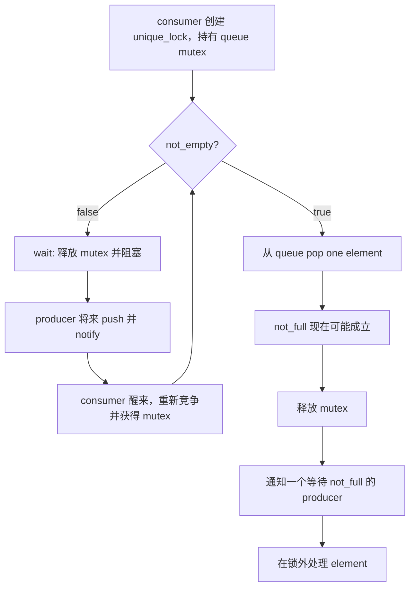
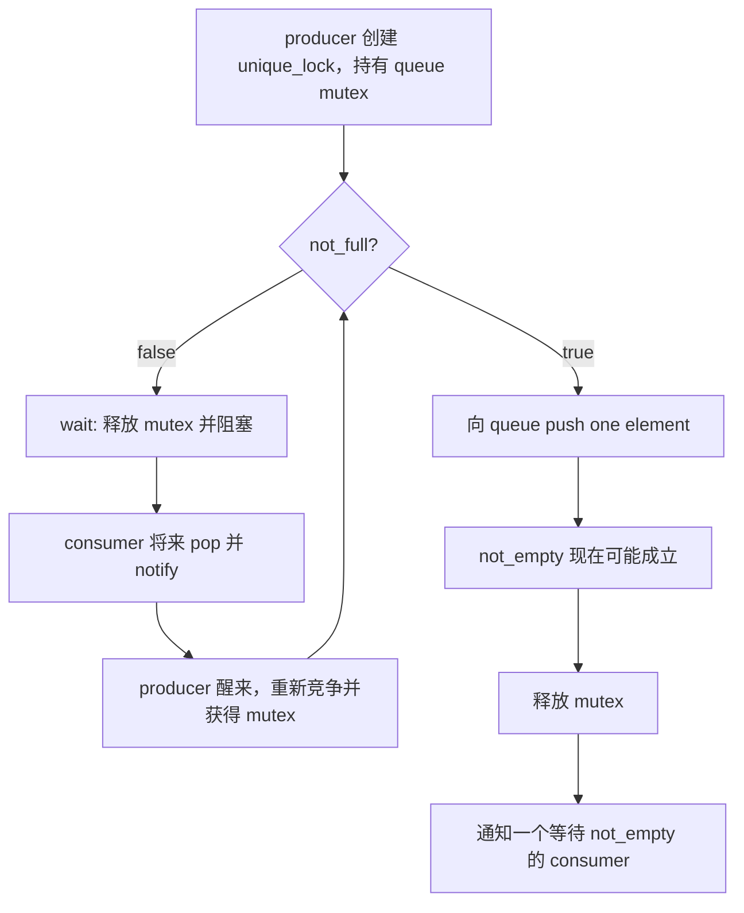

# Week7 Day3：queue 为空或已满时，producer 和 consumer 分别在等什么

> 今日主线：producer-consumer、bounded queue、backpressure、`condition_variable`、`not_empty`、`not_full`。
>
> 今日类型：机制连接 + 受控的一生产者一消费者练习。
>
> 今日产出：`producer_consumer.cpp` 与 `day3_note.md`。
>
> 默认编译：`g++ -std=c++17 -Wall -Wextra -g -pthread`。

学习前置：Week7 Day2 已验收。提前生成不代表前一天已经完成。

Week5 已经讲过：

```text
lost wakeup
spurious wakeup
wait 释放 mutex 并睡眠
醒来后重新获得 mutex、重新检查 predicate
notify 不保存业务数据
```

今天不再手推 xv6 `sleep/wakeup`。今天的新问题是：

```text
一个 bounded queue 同时有“空”和“满”两种不能继续的状态，
producer 与 consumer 应分别等待哪个 predicate？
```

---

# Part 1：前情提要与必要术语

## 1. 从 Day2 的 shared invariant 接过来

Day2 的 ledger 只需要 mutual exclusion：

```text
拿到 mutex
-> 完成一次 transfer
-> 释放 mutex
```

如果 mutex 暂时被别人持有，`lock()` 会等待；但拿到 mutex 后，业务条件仍可能不满足。

bounded queue 中：

```text
consumer 拿到 mutex，但 queue empty
producer 拿到 mutex，但 queue full
```

这时不能在锁内 busy loop，也不能直接失败后不停重试。需要让当前 execution flow 阻塞，直到相关 state 改变。

---

## 2. 必要术语

### 2.1 producer

`producer`：生产者。

在今天的程序里，它生成 integer IDs 并放入 queue。

producer 生产的是业务 element；`notify_one()` 本身不生产 element。

---

### 2.2 consumer

`consumer`：消费者。

它从 queue 取出 element，再在 queue lock 外处理。

consumer 不应该持有 queue mutex 执行耗时业务处理，否则 producer 无法继续 push。

---

### 2.3 bounded queue

`bounded`：有界的。

```text
0 <= queue.size() <= capacity
```

capacity 固定且大于 0。与无限增长的 queue 相比，它会在下游处理不过来时限制 producer。

---

### 2.4 backpressure

`backpressure`：背压。

当前场景：

```text
consumer 处理速度不足
-> queue 达到 capacity
-> producer 阻塞等待 not_full
-> 上游不能无限积累 elements
```

背压是明确的 flow-control contract，不是“随便 sleep 一下让 producer 慢点”。

---

### 2.5 predicate

`predicate`：谓词，即返回 true/false、决定 execution flow 能否继续的条件。

今天有两个：

```text
not_empty = !queue.empty()
not_full  = queue.size() < capacity
```

predicate 不存储在 condition variable 里。它由 queue state 计算出来，并由 mutex 保护。

---

### 2.6 notification

`notification`：通知。

```text
notify_one -> 让至少一个相关 waiter 有机会醒来竞争 mutex
notify_all -> 让所有相关 waiters 有机会醒来竞争 mutex
```

通知不保证 waiter 立即运行，也不保证 waiter 拿到 mutex 时 predicate 仍为 true。

---

### 2.7 waiter

`waiter`：等待者，也就是当前在 condition variable 上等待的 execution flow。

今天：

```text
empty queue 上等待的 consumer
full queue 上等待的 producer
```

---

### 2.8 spurious wakeup

`spurious wakeup`：虚假唤醒。

wait 可能在没有对应业务通知的情况下返回；即使确有 notify，多个 waiters 竞争后，当前 thread 重新拿到 mutex 时条件也可能已经被别人改变。

所以正确性来自：

```text
醒来后在 mutex 下重新检查 predicate
```

不是来自“我相信 notify 只叫醒该继续的人”。

---

# Part 2：教程主体

# 教程开始

## 3. 为什么一把 mutex 还不够

假设 capacity 为 1：

```text
queue = []
```

consumer 获取 mutex 后发现 empty。

如果它这样做：

```text
while queue empty:
    什么也不做，继续检查
```

而且一直持有 mutex，producer 永远无法拿锁 push，程序永久卡住。

如果它释放 mutex 后不停检查：

```text
unlock
check again
unlock
check again
```

会造成 busy waiting，浪费 CPU。

condition variable 提供的是：

```text
condition false
-> 释放 mutex 并阻塞当前 execution flow
-> 其他 thread 可以拿锁修改 state
-> state 改变后通知
-> waiter 将来重新拿锁并检查
```

---

## 4. queue 的 shared state 与 invariant

今天的 shared state：

```text
queue
capacity
```

其中 capacity construction 后不变，queue 会变化。

同一 mutex 保护：

```text
queue contents
queue size
empty/full 判断
push/pop 的状态转移
```

invariant：

```text
capacity > 0
queue.size() <= capacity
每个成功 push 的 ID 最多被 pop 一次
```

condition variables 不替代 mutex，也不保存 queue state。

---

## 5. consumer 的正常主线



谁在做什么：

```text
consumer 检查 not_empty
consumer 自己调用 wait
producer push 后调用 notify
scheduler 决定 consumer 何时真正恢复运行
consumer wait 返回前重新获得 mutex
consumer 自己重新检查 predicate
```

---

## 6. producer 的正常主线



这两张图互为对称：

```text
push 使 not_empty 可能从 false 变 true
pop 使 not_full 可能从 false 变 true
```

---

## 7. API：`std::condition_variable`

头文件：

```cpp
#include <condition_variable>
```

object：

```cpp
std::condition_variable cv;
```

常用接口：

```cpp
cv.wait(lock);
cv.wait(lock, predicate);
cv.notify_one();
cv.notify_all();
```

今天优先使用 predicate overload：

```cpp
cv.wait(lock, [&] {
    return ready;
});
```

它表达：

```text
只要 ready 仍为 false，就继续等待；
返回给 caller 时，lock 已重新持有，并且本次检查 ready 为 true。
```

独立例子中的 `ready` 必须由传给 wait 的同一 mutex 保护。

---

## 8. 为什么 `wait` 需要 `unique_lock`

接口需要能够临时改变 lock ownership：

```text
wait 前：caller 持有 mutex
等待期间：mutex 必须释放
wait 返回：caller 再次持有 mutex
```

`std::unique_lock` 支持这种 unlock/relock 状态变化；`lock_guard` 只表示固定 scope 持锁，不提供 wait 所需接口。

所以：

```text
condition_variable::wait -> unique_lock
普通短 critical section -> lock_guard 通常足够
```

---

## 9. producer 应怎样发布 state

正确顺序的核心：

```text
获取保护 queue/predicate 的 mutex
-> 修改 queue，使 not_empty 可能成立
-> 释放 mutex
-> notify_one consumer
```

也允许在仍持锁时 notify；正确性核心不是 notify 放在 unlock 前还是后，而是：

```text
queue state 在同一 mutex 下修改和检查
```

今天推荐先 unlock 再 notify，减少刚唤醒的 waiter 立刻阻塞在同一 mutex 上的机会。

但不要把“先 unlock 再 notify”背成脱离 predicate contract 的绝对规则。

---

## 10. notification 为什么没有业务记忆

场景一：producer 只 notify，不 push。

```text
consumer 醒来
-> 重新拿 mutex
-> not_empty 仍为 false
-> 继续等待
```

场景二：producer 在 consumer 开始 wait 前已经 push。

```text
consumer 之后拿 mutex
-> 第一次检查 not_empty 已为 true
-> 根本不睡眠
```

即使它“错过了 notify”，也不会错过 queue state。

所以业务记忆保存在：

```text
queue contents / state fields
```

而不是 condition variable 的通知次数。

---

## 11. 为什么今天使用两个 condition variables

理论上可以让所有 waiters 共用一个 condition variable，每次 state 改变都通知；但两个 variables 能更明确表达等待原因：

```text
not_empty_cv -> consumers 等 queue 非空
not_full_cv  -> producers 等 queue 未满
```

这样 push 后只需唤醒可能继续的 consumer，pop 后只需唤醒可能继续的 producer。

注意：

```text
mutex 可以是一把
condition variables 可以是两个
predicates 也有两个
```

数量不同，因为它们职责不同：

```text
mutex -> 保护 shared state
predicate -> 判断某类 operation 能否继续
condition variable -> 管理对应等待集合和通知
```

---

## 12. queue lock 内外怎样分工

锁内：

```text
检查 predicate
修改 queue
取出或放入 element
维护 size/capacity invariant
```

锁外：

```text
生产 element 的耗时计算
消费 element 的业务处理
日志和 cout
sleep 模拟处理延迟
```

consumer 应先把 element 从 queue 移入自己的 local object，再释放锁处理。

这样 queue slot 已经腾出，producer 可以继续工作。

---

## 13. 为什么不能用 sleep 编排正确顺序

错误思路：

```text
producer 先 sleep 100 ms
consumer 应该已经 wait
然后 producer push
```

问题：

```text
scheduler 不保证 consumer 100 ms 内运行到某行
机器负载不同
调试器、TSan、输出都会改变时序
```

可以用 sleep 模拟 producer/consumer 速度差，扩大 empty/full 出现概率；但无论谁先运行，正确性都必须由 mutex + predicate + wait 保证。

---

### 13.1 capacity = 1 时完整走一遍

设：

```text
capacity = 1
初始 queue = []
producer 依次生产 10、11
consumer 依次取两个值
```

可能的执行过程：

```text
1. consumer lock mutex
2. 检查 not_empty: false
3. consumer 调用 wait，释放 mutex 并进入等待

4. producer lock mutex
5. 检查 not_full: true
6. push 10，queue = [10]
7. producer unlock，notify not_empty

8. producer 再次 lock mutex
9. 检查 not_full: false，因为 size == capacity
10. producer 调用 wait，释放 mutex 并进入等待

11. consumer 被 scheduler 恢复并重新拿到 mutex
12. consumer 再次检查 not_empty: true
13. pop 10，queue = []
14. consumer unlock，notify not_full
15. consumer 在锁外处理 10

16. producer 将来重新拿到 mutex
17. producer 再次检查 not_full: true
18. push 11，queue = [11]
```

这里不是 notification 直接把 `10` 交给 consumer，也不是 `notify_one()` 把 mutex 交给 waiter。真正的 data 始终在 queue 中；真正决定 operation 能否继续的是重新持锁后对 predicate 的检查。

对象职责分开看：

```text
mutex          -> 保护 queue state 与 predicate check
queue          -> 保存业务数据与业务记忆
condition var  -> 让当前不能继续的 thread 高效等待，并接收“也许能继续了”的提示
scheduler      -> 决定被提示的 waiter 何时真正获得 CPU
```

---

### 13.2 两个 predicates 的状态表

设当前 `size = queue.size()`：

| Queue state | `not_empty: size > 0` | `not_full: size < capacity` | Consumer | Producer |
|---|---:|---:|---|---|
| empty 且 capacity > 0 | false | true | wait | can push |
| partially filled | true | true | can pop | can push |
| full | true | false | can pop | wait |

一次 push 只可能直接帮助等待 `not_empty` 的 consumer；一次 pop 只可能直接帮助等待 `not_full` 的 producer。因此今天用两个 condition variables 表达两个 waiting sets。

这不意味着需要“两把 mutex 挡住 notifier”。producer 和 consumer 都使用同一把 queue mutex，因为两个 predicates 都来自同一份 queue state。condition variables 是等待入口，不是保护 state 的锁。

---

### 13.3 `wait(lock, predicate)` 到底等价于什么

概念上可以理解为：

```cpp
while (!predicate()) {
    cv.wait(lock);
}
```

但不要自己用“先 unlock，再 sleep”的普通代码拼装 wait。condition variable 必须协调下面这个关键转换：

```text
caller 持锁检查 predicate 为 false
-> 把自己登记为 waiter，并释放 mutex
-> 阻塞
```

为什么必须协调？看一个错误拆法：

```text
consumer lock
consumer 发现 queue empty
consumer unlock

                    producer lock
                    producer push 42
                    producer notify_one
                    producer unlock

consumer 现在才开始 wait
```

notification 已经发生，而 queue 虽然有数据，consumer 却进入了一个没有后续 notification 的等待。这就是典型 lost wakeup 窗口。

标准 `wait` 配合“同一 mutex 下修改和检查 predicate”关闭了这个窗口。你不需要知道库内部怎样实现 futex 才能使用它，但必须遵守它的 contract。

---

### 13.4 `condition_variable` API 逐项看

头文件：

```cpp
#include <condition_variable>
```

常用 signatures：

```cpp
void wait(std::unique_lock<std::mutex>& lock);

template<class Predicate>
void wait(std::unique_lock<std::mutex>& lock, Predicate predicate);

void notify_one() noexcept;
void notify_all() noexcept;
```

`wait(lock, predicate)` 的前提与结果：

```text
进入时：lock owns the mutex
等待时：library 暂时释放 mutex
醒来后：先重新竞争并获得 mutex
返回时：lock 再次 owns the mutex，且本次 predicate check 为 true
```

`predicate` 应是一个能在当前 mutex 保护下读取 shared state、并返回 bool-like result 的 callable。它不负责修改 queue。

独立最小例子：

```cpp
std::unique_lock<std::mutex> lock(mutex);
cv.wait(lock, [&] {
    return ready;
});
// lock still owns mutex here, and ready was observed true under this lock.
```

`notify_one()`：

```text
若有 waiters，选择至少一个使其有机会继续
若没有 waiters，不保存一张“以后可兑换”的 notification ticket
不修改 predicate
不保证被唤醒者立刻运行
```

`notify_all()` 会让所有对应 waiters 都有机会重新竞争 mutex 并检查 predicate。Day3 正常单 producer/single consumer 使用 `notify_one()` 足够；Day5 lifecycle 变化需要同时处理多类 waiters 时再正式使用 `notify_all()`。

---

### 13.5 notify 放在 unlock 前后分别发生什么

两种顺序都可能正确：

```text
A. 修改 state -> notify -> unlock
B. 修改 state -> unlock -> notify
```

在 A 中，被唤醒的 waiter 想重新检查 predicate，仍要等 notifier 释放同一 mutex。在 B 中，waiter 被唤醒时 mutex 已经可能可用，因此常能减少一次刚醒来又阻塞在 mutex 上的过程。

但 B 不是脱离生命周期分析的绝对口诀。今天 queue object 在 notify 完成前一定仍存在，因此推荐 B。未来若“unlock 后 object 可能立刻被另一个 owner 销毁”，则必须重新审视 object lifetime。正确性的核心始终是：

```text
shared predicate 的修改与检查受同一 mutex 保护
waiter 每次继续前重新检查 predicate
```

---

### 13.6 固定 count 如何让 Day3 正常结束

今天没有 `close()`，所以 consumer 不知道“以后再也不会有 element”。终止信息由测试参数 `N` 提供：

```text
producer loop exactly N times
consumer loop exactly N times
main owns both thread objects
main joins producer and consumer
```

若 producer 实际只成功 push `N - 1` 次，而 consumer 仍 pop `N` 次，consumer 最后会永久等待。这不是 condition variable 的错误，而是 producer/consumer termination contract 被破坏。

为了验证 IDs 无遗漏、无重复，可以让 consumer 独占一个 `consumed` vector：

```text
只有 consumer 写 consumed
main 只在 join consumer 后读取
```

这样结果收集不需要额外 mutex。测试时再检查：

```text
consumed.size() == N
排序后 consumed == [0, 1, ..., N-1]
```

这里 `sleep` 只能用来制造 producer 更快或 consumer 更快的观察场景，不能承担结束协议。

---

## 14. Day3 为什么暂时不处理 close

如果 consumer 写成：

```text
永远等待下一条 element
```

producer 结束后，它可能永远睡眠。

这是重要问题，但今天故意用固定 count 解决程序结束：

```text
producer 明确生产 N 个 IDs
consumer 明确消费 N 次
```

Day4 封装 BlockingQueue V1，Day5 再把“固定 count”升级为正式 `close()` lifecycle。

不把 close 提前塞进今天，是为了先把两个正常 predicates 走清楚。

---

# Part 3：收尾、练习、测试与验收

## 15. 今日产出：`producer_consumer.cpp`

### 15.1 程序是干什么的

实现一个固定 capacity 的 integer queue，由一个 producer 生产 IDs `0..N-1`，一个 consumer 消费恰好 N 个 IDs。

输入：

```text
capacity > 0
N >= 0
```

输出：

```text
consumed IDs 或最终 consumed vector
produced count
consumed count
每个 ID 是否恰好出现一次
PASS / FAIL
```

正常结束：

```text
producer 完成 N 次 push
consumer 完成 N 次 pop
main join 两个 workers
main 验证结果
```

今天不实现：

```text
通用 BlockingQueue<T> class
multiple producers/consumers
close/shutdown
timed wait
try_push/try_pop
```

---

### 15.2 shared state

```text
integer queue
capacity
```

建议再准备两个 condition variables：

```text
not_empty_cv
not_full_cv
```

一把 mutex 保护 queue state 和两个 predicates。

结果验证 storage 不要在 worker 运行时发生未同步 resize。你可以让 consumer 独占 `consumed` vector，从而不额外加锁。

---

### 15.3 核心 contract

```text
producer 只在 not_full 时 push
consumer 只在 not_empty 时 pop
predicate 在同一 mutex 下检查
queue 修改在同一 mutex 下完成
wait 使用 unique_lock
push 后通知 not_empty waiter
pop 后通知 not_full waiter
业务处理和诊断输出尽量放在 queue lock 外
```

Daily 不给完整 producer/consumer function 排列；请根据前面的状态图独立实现。

---

## 16. 固定测试

至少覆盖：

```text
capacity = 1, N = 1
capacity = 1, N = 1000
capacity = 3, N = 10000
capacity > N
N = 0
producer 更慢
consumer 更慢
```

速度差可以用很短的 sleep 模拟，但验证标准仍是：

```text
程序最终退出
produced == consumed == N
IDs 无遗漏、无重复
queue size 从不超过 capacity
```

---

## 17. 编译、TSan 与压力运行

```bash
g++ -std=c++17 -Wall -Wextra -g -pthread \
  producer_consumer.cpp -o producer_consumer

./producer_consumer
```

TSan：

```bash
g++ -std=c++17 -Wall -Wextra -g -O1 -pthread \
  -fsanitize=thread -fno-omit-frame-pointer \
  producer_consumer.cpp -o producer_consumer_tsan

./producer_consumer_tsan
```

重复：

```bash
for i in $(seq 1 50); do
  ./producer_consumer || exit 1
done
```

如果程序偶尔永久不返回，优先检查：

```text
等待的是不是正确 predicate
state 修改后通知了哪一个 condition variable
是否在 wait 前错误释放/持有 lock
生产和消费次数是否真的匹配
```

---

## 18. 可选观察，不阻塞 Day3

```text
打印 queue 从 0 -> capacity -> 0 的变化，但不要在锁内大量输出
让 capacity = 1，观察 producer/consumer 更频繁交替
用 ps -L 确认 main + producer + consumer threads 存活
记录 wait 并不持续占用 CPU 的现象
```

---

## 19. 验收问题

1. 一把 mutex 为什么不能单独解决 queue empty/full 时的等待问题？
2. `not_empty` 和 `not_full` 分别由哪些 state 计算？
3. producer 和 consumer 分别等待谁、修改什么 state、通知谁？
4. 为什么 `condition_variable::wait` 使用 `unique_lock`？
5. notify 为什么不保存 element，也不保证 waiter 立即运行？
6. producer 在 consumer wait 前已经 push，consumer 为什么不会永久错过这条 element？
7. 为什么 consumer 应在锁外处理已经 pop 的 element？
8. 今天为什么使用固定 N 结束，而不提前加入 `close()`？

---

## 20. 推荐的 `day3_note.md` 结构

```markdown
# Week7 Day3 Note

## 1. bounded queue、backpressure 与两个 predicates

## 2. producer 完整等待/发布流程

## 3. consumer 完整等待/消费流程

## 4. mutex / predicate / condition variable 的职责区别

## 5. 测试、TSan 与真实问题

## 6. 验收回答
```

---

## 21. 今日压缩记忆

```text
bounded queue 有两个不能继续的状态：
consumer 等 not_empty，producer 等 not_full。

业务记忆在 mutex 保护的 queue state 里，
condition variable 只负责等待和通知。

wait 返回只表示当前 thread 重新拿到了 mutex；
能否继续仍由 predicate 决定。
```
