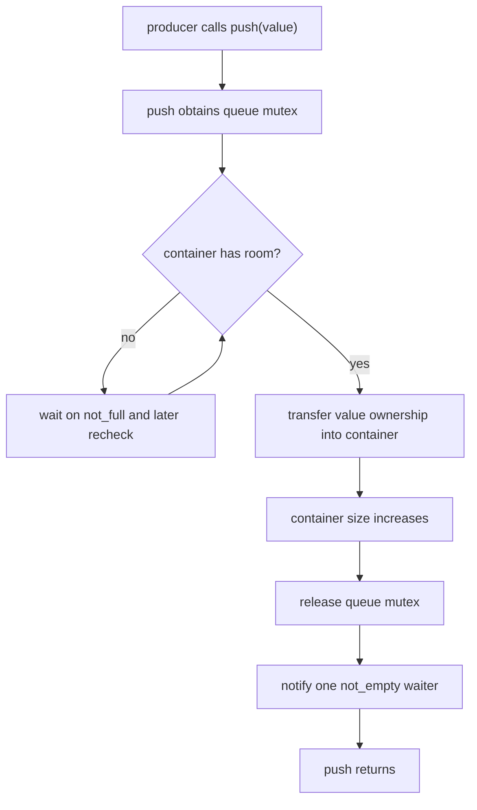
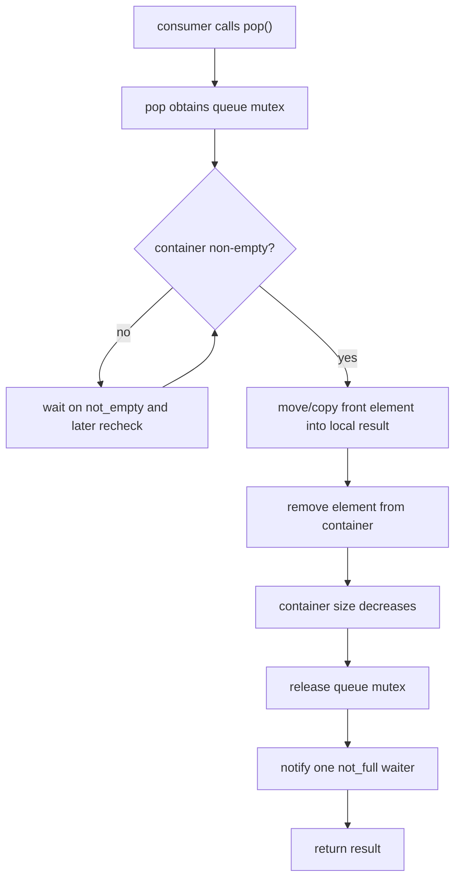
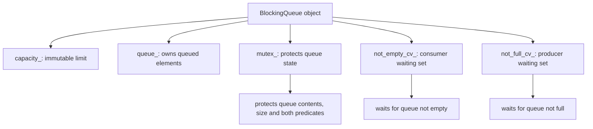
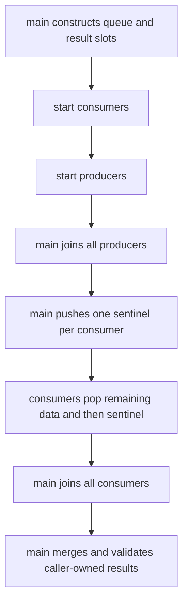

# Week7 Day4：怎样把 producer-consumer 控制流封装成 `BlockingQueue<T>`

> 今日主线：class ownership、class invariant、bounded capacity、blocking `push/pop`、MPMC、header-only template 第一层。
>
> 今日类型：独立组件练习日。
>
> 今日产出：`blocking_queue.hpp`、`blocking_queue_test.cpp` 与 `day4_note.md`。
>
> 默认编译：`g++ -std=c++17 -Wall -Wextra -g -pthread`。

学习前置：Week7 Day3 已验收。提前生成不代表 Day3 已完成。

今天会复用 Day3 的：

```text
one mutex
not_empty / not_full predicates
two condition variables
producer push / consumer pop
```

但今天不重复写一份固定的 global queue。新增问题是：

```text
怎样把 shared state、mutex、predicates 和 blocking behavior
收进一个具有明确 public contract 的 reusable class？
```

今天仍不加入 `close()`。Day5 专门处理 shutdown，否则 class 封装和 lifecycle termination 会一次混在一起。

---

# Part 1：前情提要与必要术语

## 1. 从 Day3 的 global state 接过来

Day3 程序可能有：

```text
queue
capacity
mutex
not_empty_cv
not_full_cv
producer function
consumer function
```

它能证明机制，但有几个工程问题：

```text
哪些 state 必须一起使用，只能靠人记
任何函数都可能绕过 lock 直接访问 queue
无法自然创建两个独立 queues
测试和业务代码耦合
未来 ThreadPool 很难复用
```

Day4 用 class 建立 ownership boundary：

```text
BlockingQueue object 自己拥有并保护内部 state
caller 只通过 public methods 操作
```

---

## 2. 必要术语

### 2.1 encapsulation

`encapsulation`：封装。

它不只是把 variables 放进 `private:`。真正目标是：

```text
外部代码无法绕过 class invariant 随意修改内部 state
```

---

### 2.2 public contract

`public contract`：公开接口契约。

它回答：

```text
method 什么时候阻塞
什么时候返回
谁拥有传入/返回的 value
是否 thread-safe
object 销毁前 caller 必须满足什么
```

---

### 2.3 MPMC

`MPMC`：Multiple Producers, Multiple Consumers，多生产者、多消费者。

今天的 queue 要允许：

```text
多个 threads 并发调用 push
多个 threads 并发调用 pop
```

MPMC 描述调用者数量，不表示内部必须 lock-free。

---

### 2.4 blocking operation

`blocking operation`：阻塞操作。

```text
push on full queue -> 当前 producer 等待
pop on empty queue -> 当前 consumer 等待
```

阻塞期间 execution flow 不持续 busy-spin；scheduler 可以运行其他 work。

---

### 2.5 linearization point

`linearization point`：线性化点。

今天只建立直觉：一次并发 operation 在某个受锁保护的瞬间真正修改 queue state。

```text
push 的关键点：element 被加入 container
pop 的关键点：element 从 container 被移除
```

我们不展开线性一致性理论，但这个词帮助你理解：method 调用可能等待很久，真正生效发生在锁内某个时刻。

---

### 2.6 termination token / sentinel

`sentinel`：哨兵值；`termination token`：终止标记。

Day4 因为还没有 `close()`，测试程序会在所有普通 elements 后 push 特殊 token，让 consumers 知道退出。

它只是测试期临时协议，不是最终 BlockingQueue lifecycle。

---

### 2.7 snapshot

`snapshot`：快照。

`size()` 若在锁内读取后返回，只能表示读取那一刻的 size。method 返回后，其他 threads 可以立刻改变 queue。

因此：

```text
if (!queue.empty()) queue.pop()
```

不能由两个独立 public calls 组成可靠原子逻辑。

真正 blocking pop 必须在 class 内把检查和修改放在同一 synchronization contract 中。

---

# Part 2：教程主体

# 教程开始

## 3. 为什么 `empty()` + `pop()` 不是 thread-safe 组合

假设 public API 分开提供：

```text
empty()
pop_without_wait()
```

Thread A：

```text
empty() -> false
```

在 A 真正 pop 前，Thread B 可能先 pop 最后一项。

于是 A 的旧判断已经失效。

这叫 check-then-act race：

```text
检查条件
-> 中间 state 被其他 thread 改变
-> 基于过期检查执行动作
```

BlockingQueue 的价值之一，就是把：

```text
检查 predicate
等待
重新检查
修改 queue
```

封装成一个 public operation。

---

## 4. `BlockingQueue<T>` 拥有什么

建议内部 state：

```text
container of T
capacity
mutex
not_empty condition variable
not_full condition variable
```

ownership：

```text
BlockingQueue object owns container and synchronization objects
producer owns a value before successful push
queue owns the stored value after push completes
consumer owns the returned value after pop completes
```

queue 不拥有 producer/consumer threads。创建、join 和销毁 workers 仍由外部 owner 负责。

---

## 5. class invariant

任何 public method 返回、mutex 释放给另一个 caller 时，都应满足：

```text
capacity_ > 0
container_.size() <= capacity_
所有 container_ access 都持有 mutex_
not_empty 等价于 !container_.empty()
not_full 等价于 container_.size() < capacity_
```

condition variables 不需要与 queue size 保持一个独立计数；predicate 直接从受保护 state 计算，避免两份状态失去同步。

---

## 6. V1 public contract

Day4 可以采用以下概念接口：

```cpp
template <typename T>
class BlockingQueue {
public:
    explicit BlockingQueue(std::size_t capacity);

    BlockingQueue(const BlockingQueue&) = delete;
    BlockingQueue& operator=(const BlockingQueue&) = delete;

    void push(T value);
    T pop();
};
```

这里只给接口形状，不给 implementation。

### `BlockingQueue(capacity)`

```text
capacity > 0 -> 构造 OPEN V1 queue
capacity == 0 -> 明确拒绝，例如 throw std::invalid_argument
```

### `push(T value)`

```text
queue full -> block until not_full
queue has room -> move/copy value into queue and return
```

参数按 value 接收的意义：

```text
caller 传 lvalue -> value parameter copy constructed
caller 传 rvalue -> value parameter move constructed
queue 最后再把 parameter move into container
```

今天以 `int` 验证，不强制分析所有 `T` exception cases。

### `T pop()`

```text
queue empty -> block until not_empty
queue has element -> remove one element and return it by value
```

Day4 没有 closed state，因此正常程序必须保证最终会有足够 elements 或 sentinels 让每个 pop 返回。

---

## 7. 为什么 queue 禁止 copy

如果复制一个 concurrent queue，问题会变得模糊：

```text
复制的是 elements snapshot 还是共享同一 container？
正在 wait 的 threads 属于哪一个 copy？
mutex 和 condition variables 怎样复制？
```

`std::mutex` 和 `std::condition_variable` 本身也不可复制。

所以显式删除 copy constructor / copy assignment，让 ownership boundary 清楚。

今天也不要求实现 move。一个正在被 threads 使用的 synchronization object 不应该随意移动地址。

---

## 8. template 为什么通常放在 header

compiler 为具体 `T` 生成 template specialization 时，需要看到 template definition。

例如 test 中使用：

```cpp
BlockingQueue<int> queue(4);
```

编译 `blocking_queue_test.cpp` 时，compiler 必须看到 `BlockingQueue<int>` methods 的 definitions 才能实例化。

因此初学阶段通常把整个 class template 放入：

```text
blocking_queue.hpp
```

然后 test：

```cpp
#include "blocking_queue.hpp"
```

这不是说 template 永远绝对不能拆实现文件；显式实例化等方式以后再学，今天不增加编译模型复杂度。

---

## 9. `push` 的职责链

下面只描述需求级流程，不给可直接抄写的 C++ implementation：



要自己决定：

```text
使用哪个 unique_lock
predicate lambda 捕获什么
何时 move value
如何确保 exception 时 invariant 不被破坏
```

Day4 以 `int` 为核心测试，先保证 normal flow。

---

## 10. `pop` 的职责链



顺序需要保证：

```text
returned value 已经由 consumer own
queue slot 已释放
consumer 的后续业务处理不持 queue mutex
```

---

## 11. container 选 `deque` 还是 `queue`

两种都可以：

```text
std::queue<T>
-> container adaptor，直接提供 front/push/pop/size/empty

std::deque<T>
-> underlying sequence container，直接提供 front/push_back/pop_front
```

今天推荐选你更容易解释的一种，不为“底层实现”重复写容器。

如果使用 `std::queue<T>`：

```cpp
#include <queue>
```

如果使用 `std::deque<T>`：

```cpp
#include <deque>
```

这两个容器都不是 thread-safe；thread safety 来自你的 class mutex contract。

---

## 12. `size()` / `empty()` 要不要提供

可以不提供。BlockingQueue 核心是 `push/pop`。

如果为了测试提供：

```text
method 内部必须 lock
return 只是瞬时 snapshot
caller 不能把 snapshot 当作下一次 operation 的保证
```

例如：

```text
size() returns 0
```

只说明该 method 读取时 queue empty；return 后 producer 可能立刻 push。

---

## 13. V1 怎样让多个 consumers 退出

因为 V1 没有 `close()`，test 使用 sentinel protocol：

```text
普通 ID：0..N-1
sentinel：一个不会与普通 ID 冲突的特殊值
```

测试 owner 的责任：

```text
启动 consumers/producers
等待所有 producers 完成
为每个 consumer push 一个 sentinel
等待所有 consumers 完成
```

为什么每个 consumer 要一个 sentinel？

```text
一个 sentinel 只能被一个 consumer pop
其他 consumers 仍可能阻塞等待
```

sentinel 是 queue payload protocol，污染了 `T` 的业务取值空间。这正是 Day5 要用 `close()` 替换它的原因。

---

## 14. MPMC test 怎样避免引入第二个 race

多个 consumers 不能无锁地 `push_back` 到同一个普通 result vector。

可以继续使用 Day1 ownership partition：

```text
consumer 0 owns consumed_by_worker[0]
consumer 1 owns consumed_by_worker[1]
...
```

每个 consumer 只修改自己的 result vector；main 在 join 后合并并验证。

注意：

```text
外层 result storage 在启动 workers 前完成 size allocation
worker 运行期间不 resize outer vector
每个 inner vector 只由对应 consumer 修改
```

这样 test harness 不需要为了记录结果再加一把共享 mutex。

---

### 14.1 先画清 class 内部对象关系

`BlockingQueue<T>` 不是只把 Day3 的 globals 搬进 class。它要成为这些对象的唯一 owner：



调用者只看 public contract，不应该能直接拿到 `queue_`、`mutex_` 或 condition variables。否则 caller 可以绕开 class 的 locking discipline，使“这个类型是 thread-safe 的”失去意义。

这也是 encapsulation 在并发类里的更强含义：

```text
不只是隐藏 implementation details
还要让非法的 synchronization 顺序难以从 public API 表达出来
```

---

### 14.2 constructor 先建立完整 invariant

construction 结束后，object 应立即满足：

```text
capacity_ > 0
queue_.empty()
queue_.size() <= capacity_
尚未被任何 worker 使用
```

若允许 `capacity == 0`，则：

```text
not_full: queue.size() < capacity
         0 < 0 -> false
```

所有 producers 从一开始就永久等待，而 consumers 也没有数据可取。V1 应在 constructor 明确拒绝 `0`，例如抛出 `std::invalid_argument`；不要默默制造一个永远无法前进的 object。该 exception type 位于：

```cpp
#include <stdexcept>
```

调用者测试时应真正构造一次 `BlockingQueue<int>(0)` 并确认 construction 失败，而不是只在输出中打印“invalid capacity”。

成员真正的 initialization order 由 class 中的 declaration order 决定，不由 initializer list 的书写顺序决定。若声明为：

```cpp
const std::size_t capacity_;
std::deque<T> queue_;
```

就按这个顺序初始化。保持 initializer list 与 declaration order 一致，既消除 `-Wreorder`，也让依赖关系一眼可见。

---

### 14.3 `push(T value)` 中 copy 与 move 发生在哪里

接口：

```cpp
void push(T value);
```

caller 传 lvalue：

```text
lvalue element
-> copy-construct parameter value
-> wait until queue not full
-> move value into queue storage
```

caller 传 rvalue：

```text
rvalue element
-> move-construct parameter value
-> wait until queue not full
-> move value into queue storage
```

独立调用例子：

```cpp
std::string name = "task-7";
queue.push(name);            // name remains available; parameter is copied.
queue.push(std::move(name)); // ownership may move; name remains valid but unspecified.
```

这种 by-value interface 让 V1 只保留一个 public overload，也自然支持 move-only `T` 的 rvalue push。代价是 lvalue 会先发生一次 copy。当前重点是 lifecycle 与 synchronization，不要求提前写 perfect-forwarding overloads。

等待期间，parameter `value` 属于调用 `push` 的 execution flow，不在 shared queue 中。只有真正插入 `queue_` 后，element ownership 才转到 queue object。

如果 element construction/move 可能抛异常，要保证 queue 在插入成功前不被当作已发布。今天使用 `int` 测试主线，先掌握正常状态转换；在 note 中知道 exception boundary 即可。

---

### 14.4 capacity = 2 的 MPMC 状态轨迹

设 producer P1、P2，consumer C1，初始 queue 为空：

```text
P1 push 10 -> queue [10]
P2 push 20 -> queue [10, 20], full
P1 再 push 11 -> not_full false，P1 wait
C1 pop -> 取出 10，queue [20]
C1 notify not_full
P1 将来重新拿锁 -> 再查 not_full true -> push 11
最终 queue [20, 11]
```

注意，`notify not_full` 到 P1 真正 push 之间，P2 或其他 producer 可能先拿到 mutex。所以 P1 醒来后不能假设“那个空位归我”，必须重新检查 predicate。

对一次成功 push，可以把 linearization point 理解为“element 在 mutex 保护下真正进入 queue 的那个瞬间”；对一次成功 pop，则是“element 在 mutex 保护下真正离开 queue 的瞬间”。

在此之前，push caller 仍拥有 parameter；在此之后，queue 拥有 queued element。对于 pop，在 linearization point 之后，返回值对应的 local object 已由 caller 接管，其他 consumer 不会再拿到同一个 queue entry。

linearization point 不是“整个 function 只执行一条 CPU instruction”。它是并发观察中，可以把该 operation 看作生效的那一个逻辑瞬间。

---

### 14.5 template header 的编译边界

若 class template 的 method definitions 只放在一个普通 `.cpp` 中，使用它的 translation unit 往往看不到为具体 `T` 生成代码所需的 definition。V1 最直接的组织是：

```text
blocking_queue.hpp
  -> class template declaration
  -> method definitions

blocking_queue_test.cpp
  -> #include "blocking_queue.hpp"
  -> instantiate BlockingQueue<int>
```

header 顶部使用 include guard 或：

```cpp
#pragma once
```

避免同一 translation unit 中重复包含造成重复定义。`#pragma once` 是广泛支持的实现扩展；传统 include guard 是标准预处理写法。今天任选一种，不把模板显式实例化扩展进来。

---

### 14.6 MPMC test 的 result ownership

假设两个 producers 共生产 `0..9999`，两个 consumers 共同消费。不要让 consumers 无锁地 `push_back` 到同一个 result vector；那会给 queue 之外再造一个 data race。

可选设计：

```text
consumer 0 owns consumed_by_0
consumer 1 owns consumed_by_1
main joins both consumers
main merges the two vectors
main sorts and checks IDs
```

每个 producer 也应拥有不重叠的 ID range，例如：

```text
producer 0 -> [0, 5000)
producer 1 -> [5000, 10000)
```

V1 没有 `close()`，所以每个 consumer 需要终止 token。若用两个 consumers，就必须提供两个 tokens；一个 token 只能让一个 consumer 完成一次 pop 并退出。

sentinel 必须与正常业务 ID domain 分离，例如正常 IDs 非负时使用 `-1`。main 要在所有 producers 已完成后再 push sentinels，否则某个 consumer 可能提前退出，剩余 producer 又因 queue full 永久阻塞。

完整 test lifecycle：



这套 sentinel 只是 V1 test protocol，不是 queue 自身 lifecycle。Day5 会把终止语义正式收进 `BlockingQueue<T>`。

---

## 15. destructor 的隐藏前置条件

Day4 V1 queue destructor 不负责停止 threads。

caller 必须保证：

```text
没有 execution flow 正在 push/pop
没有 waiter 仍睡在 queue condition variable 上
所有 producer/consumer threads 已 join
```

否则 queue 的 mutex、condition variables 和 container 被销毁时仍有人访问，属于严重 lifetime bug。

Day5 会加入 close，但即使有 close，owner 仍必须 join workers 后才能销毁 queue。

---

# Part 3：收尾、练习、测试与验收

## 16. 今日产出一：`blocking_queue.hpp`

### 16.1 这个文件是干什么的

定义一个 C++17 bounded `BlockingQueue<T>` class template。

它负责：

```text
拥有 queue elements
限制 capacity
同步多个 push/pop callers
full 时阻塞 producer
empty 时阻塞 consumer
在 operation 成功后转移 T ownership
```

它不负责：

```text
创建 producer/consumer threads
join threads
处理业务 element
close/shutdown
记录大量日志
```

---

### 16.2 核心 interface

```text
explicit constructor(capacity)
deleted copy constructor / copy assignment
blocking push(value)
blocking pop() -> value
```

你可以自行选择 `std::queue<T>` 或 `std::deque<T>`。

源文件中需为 class 和 public methods 写简洁 contract comment，不机械翻译每一行。

---

## 17. 今日产出二：`blocking_queue_test.cpp`

### 17.1 这个程序是干什么的

它不是用户交互程序，而是一个可重复的 concurrency test harness：

```text
多个 producers 生成唯一 integer IDs
多个 consumers 从 BlockingQueue<int> 取走 IDs
producer 完成后由 owner push sentinels
main join 所有 threads
main 验证每个普通 ID 恰好出现一次
```

成功标准：

```text
no missing IDs
no duplicate IDs
no unexpected IDs
queue 不超过 capacity
all workers join
program terminates
TSan 无 data race report
```

---

## 18. 固定测试矩阵

至少覆盖：

```text
capacity=1, producers=1, consumers=1, N=100
capacity=1, producers=2, consumers=2, N=10000
capacity=3, producers=4, consumers=3, N=10000
capacity > total elements
capacity=0，constructor 明确拒绝并进入预期 exception path
producer slow / consumer fast
producer fast / consumer slow
```

N 表示普通 IDs 总数，不包含 sentinels。

不要用输出行数代替 ID 集合验证。

---

## 19. 编译与运行

```bash
g++ -std=c++17 -Wall -Wextra -g -pthread \
  blocking_queue_test.cpp -o blocking_queue_test

./blocking_queue_test
```

因为 template definition 在 header 中，不需要把 `.hpp` 当独立 translation unit 编译。

TSan：

```bash
g++ -std=c++17 -Wall -Wextra -g -O1 -pthread \
  -fsanitize=thread -fno-omit-frame-pointer \
  blocking_queue_test.cpp -o blocking_queue_test_tsan

./blocking_queue_test_tsan
```

重复运行：

```bash
for i in $(seq 1 50); do
  ./blocking_queue_test || exit 1
done
```

---

## 20. 可选增强，不阻塞 Day4

```text
为 int 以外的 std::string 写 test
测试 rvalue push 后 value 的 moved-from state
提供 size() snapshot 仅用于诊断
```

今天不要求：

```text
move-only T
timed wait
close
perfect forwarding overloads
allocator customization
```

---

## 21. 验收问题

1. BlockingQueue class 应拥有哪几个 state/synchronization objects？它不拥有谁？
2. 为什么 `empty()` 和 `pop()` 两个独立 calls 不能组成可靠 check-then-act？
3. V1 的 class invariant 是什么？
4. `push(T value)` 中 value ownership 在 caller、parameter、queue 之间怎样变化？
5. 为什么 class template implementation 初学阶段通常放在 header？
6. `size()` 即使内部加锁，为什么返回值也只是一张 snapshot？
7. 为什么 MPMC test 中每个 consumer 需要一个 sentinel？
8. queue destructor 前 owner 必须保证什么？`close` 缺失为何让这件事更难？

---

## 22. 推荐的 `day4_note.md` 结构

```markdown
# Week7 Day4 Note

## 1. BlockingQueue ownership 与 class invariant

## 2. blocking push 的状态流程

## 3. blocking pop 的状态流程

## 4. MPMC test 与 sentinel termination

## 5. 编译、TSan、压力测试

## 6. 验收回答
```

---

## 23. 今日压缩记忆

```text
BlockingQueue 的价值不是把 queue 和 mutex 放进同一个 class，
而是让 caller 无法绕过“检查 predicate -> 等待 -> 修改 state”的完整 contract。

V1 能正确传递 elements，但没有 lifecycle termination；
sentinel 只是测试 workaround，Day5 用 close 正式解决。
```
