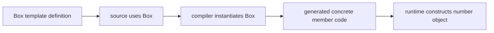
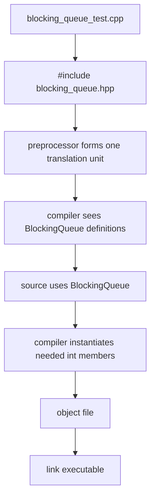
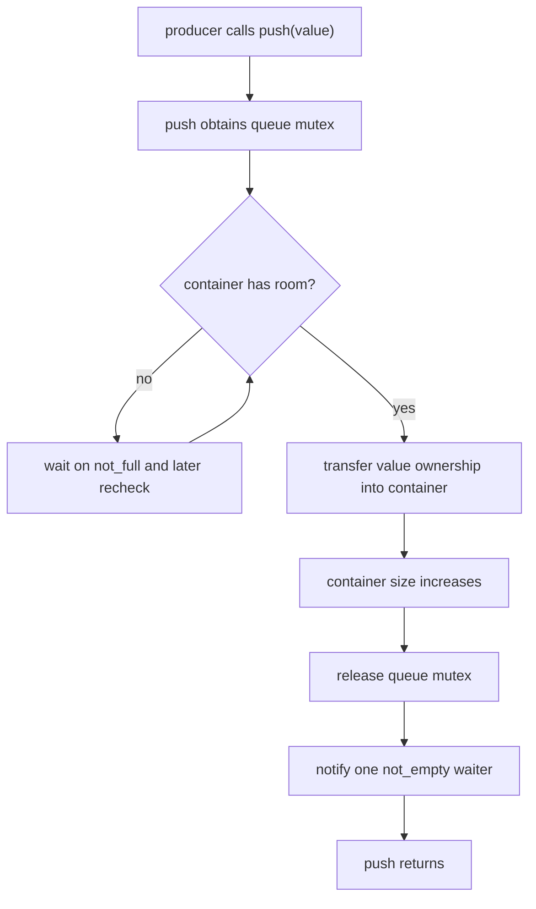
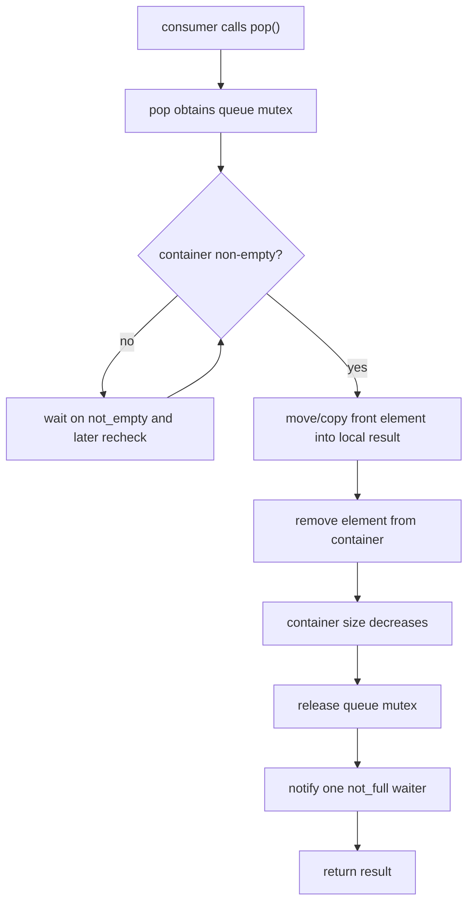
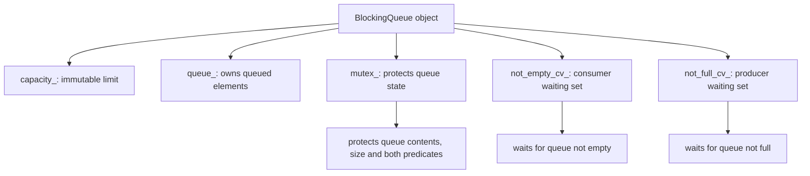
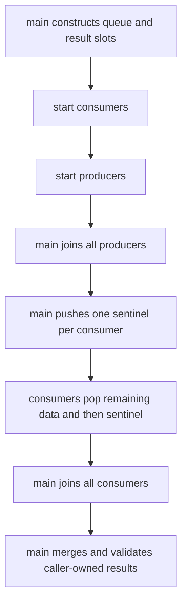

# Week7 Day4：怎样把 producer-consumer 控制流封装成 `BlockingQueue<T>`

> 今日主线：class ownership、class invariant、bounded capacity、blocking `push/pop`、MPMC、header-only template 第一层。
>
> 今日类型：独立组件练习日。
>
> 今日产出：`blocking_queue.hpp`、`blocking_queue_test.cpp` 与 `day4_note.md`。
>
> 默认编译：`g++ -std=c++17 -Wall -Wextra -g -pthread`。

学习前置：Week7 Day3 已验收。提前生成不代表 Day3 已完成。

今天会复用 Day3 的：

```text
one mutex
not_empty / not_full predicates
two condition variables
producer push / consumer pop
```

但今天不重复写一份固定的 global queue。新增问题是：

```text
怎样把 shared state、mutex、predicates 和 blocking behavior
收进一个具有明确 public contract 的 reusable class？
```

今天仍不加入 `close()`。Day5 专门处理 shutdown，否则 class 封装和 lifecycle termination 会一次混在一起。

---

# Part 1：前情提要与必要术语

## 1. 从 Day3 的 global state 接过来

Day3 程序可能有：

```text
queue
capacity
mutex
not_empty_cv
not_full_cv
producer function
consumer function
```

它能证明机制，但有几个工程问题：

```text
哪些 state 必须一起使用，只能靠人记
任何函数都可能绕过 lock 直接访问 queue
无法自然创建两个独立 queues
测试和业务代码耦合
未来 ThreadPool 很难复用
```

Day4 用 class 建立 ownership boundary：

```text
BlockingQueue object 自己拥有并保护内部 state
caller 只通过 public methods 操作
```

---

## 2. 必要术语

### 2.1 encapsulation

`encapsulation`：封装。

它不只是把 variables 放进 `private:`。真正目标是：

```text
外部代码无法绕过 class invariant 随意修改内部 state
```

---

### 2.2 public contract

`public contract`：公开接口契约。

它回答：

```text
method 什么时候阻塞
什么时候返回
谁拥有传入/返回的 value
是否 thread-safe
object 销毁前 caller 必须满足什么
```

---

### 2.3 MPMC

`MPMC`：Multiple Producers, Multiple Consumers，多生产者、多消费者。

今天的 queue 要允许：

```text
多个 threads 并发调用 push
多个 threads 并发调用 pop
```

MPMC 描述调用者数量，不表示内部必须 lock-free。

---

### 2.4 blocking operation

`blocking operation`：阻塞操作。

```text
push on full queue -> 当前 producer 等待
pop on empty queue -> 当前 consumer 等待
```

阻塞期间 execution flow 不持续 busy-spin；scheduler 可以运行其他 work。

---

### 2.5 linearization point

`linearization point`：线性化点。

今天只建立直觉：一次并发 operation 在某个受锁保护的瞬间真正修改 queue state。

```text
push 的关键点：element 被加入 container
pop 的关键点：element 从 container 被移除
```

我们不展开线性一致性理论，但这个词帮助你理解：method 调用可能等待很久，真正生效发生在锁内某个时刻。

---

### 2.6 termination token / sentinel

`sentinel`：哨兵值；`termination token`：终止标记。

Day4 因为还没有 `close()`，测试程序会在所有普通 elements 后 push 特殊 token，让 consumers 知道退出。

它只是测试期临时协议，不是最终 BlockingQueue lifecycle。

---

### 2.7 snapshot

`snapshot`：快照。

`size()` 若在锁内读取后返回，只能表示读取那一刻的 size。method 返回后，其他 threads 可以立刻改变 queue。

因此：

```text
if (!queue.empty()) queue.pop()
```

不能由两个独立 public calls 组成可靠原子逻辑。

真正 blocking pop 必须在 class 内把检查和修改放在同一 synchronization contract 中。

---

## 2.8 class template 前置：`BlockingQueue<T>` 里的 `T` 到底是什么

你目前对 template 使用不多，所以这里不直接把：

```cpp
template <typename T>
class BlockingQueue;
```

当作已经熟悉的语法。先从它解决的问题开始。

### 2.8.1 没有 template 时会发生什么

假设先写一个只能保存 `int` 的 class：

```cpp
class IntBox {
public:
    explicit IntBox(int value) : value_(value) {}

    int get() const {
        return value_;
    }

private:
    int value_;
};
```

如果还需要保存 `std::string`，可以再写一个 `StringBox`，但两个 class 的结构几乎相同，只是类型不同：

```text
IntBox       里面写 int
StringBox    里面写 std::string
```

继续为 `double`、自定义 `Task` 重复 class，维护成本会越来越高。

class template 解决的是：

```text
class 的结构和 algorithm 相同
只有某些 type 需要由使用者决定
```

你可以把它理解为“生成一族具体 class 的编译期蓝图”。

---

### 2.8.2 最小 class template 语法

```cpp
#include <utility>

template <typename T>
class Box {
public:
    explicit Box(T value) : value_(std::move(value)) {}

    const T& get() const {
        return value_;
    }

private:
    T value_;
};
```

逐项看：

```text
template
    告诉 compiler：接下来的 declaration 是一个 template。

<typename T>
    template parameter list；这里声明一个 type parameter，名字叫 T。

typename
    这里表示“后面的 parameter 代表一个 type”，不是普通 value。

T
    由我们起的 placeholder name。可以改名为 ValueType，但惯例常写 T。

class Box
    Box 现在不是单独一个完整 concrete type，而是一个 class template。
```

在 template parameter list 中，下面两种写法等价：

```cpp
template <typename T>
class Box;

template <class T>
class Box;
```

今天推荐 `typename T`，因为它更直接表达“T 是一个类型参数”。`typename` 在 dependent name 等其他场景还有额外规则，当前不展开。

---

### 2.8.3 `T` 能出现在哪里

在这个 template declaration 的作用域中，`T` 可以像一个类型名一样使用：

```cpp
T value_;                 // member type
explicit Box(T value);    // parameter type
const T& get() const;     // return type 的组成部分
```

但要区分：

```text
T 是 type placeholder
value_ 是一个 object
```

`T` 自己不占用一块运行时内存，也不是“存着类型信息的变量”。它在 compiler 生成具体 class 时被一个实际 type 替换。

---

### 2.8.4 怎样使用：template argument 与 concrete type

```cpp
#include <string>

Box<int> number(42);
Box<std::string> text("hello");
```

这里：

```text
T                         template parameter
int / std::string         template arguments
Box<int>                  一个具体 class type
Box<std::string>          另一个具体 class type
number / text             各自类型的 objects
```

`Box<int>` 和 `Box<std::string>` 是不同类型，不能因为它们来自同一个 template 就随意互相赋值：

```cpp
Box<int> a(1);
Box<std::string> b("x");

// a = b;  // type mismatch
```

这不是 Java/C# 风格的运行时“一个 Box 里随时放任意类型”。每个 object 的 `T` 在 compile time 已经确定：

```text
Box<int> object 的 value_ 永远是 int
Box<std::string> object 的 value_ 永远是 std::string
```

---

### 2.8.5 compiler 什么时候生成具体代码

当 source 中真正使用：

```cpp
Box<int> number(42);
```

compiler 会根据需要实例化 `Box<int>`。第一层可以理解为：

```text
读取 Box<T> template definition
-> 看到使用 Box<int>
-> 用 int 代入本次需要的 T
-> type-check Box<int> 的相关 members
-> 为实际使用的 members 生成 code，也就是不一定为所有 members 生成 code
```

但它通常不是简单的“往源码文本里复制粘贴一份”。这是 compiler 内部的类型分析和代码生成过程。

这个过程叫：

```text
instantiation：实例化
specialization：由某组 template arguments 得到的具体版本
```

不要把“template 实例化”和“构造 object”混成一件事：

```text
template instantiation
    compiler 形成 Box<int> 这个具体 class/method code，是 compile-time 概念。

object construction
    程序创建 number object 并执行 constructor，是 object lifetime 概念。
```

它们的关系是：先要有可用的具体 class code，运行时才能构造对应 object。



### 2.8.5.1 具体 class code 是啥？

这里的 “具体 class code” 说得不够严谨，容易让人以为 compiler 真在源码里复制出一份 class。更准确应是：

```text
先让 compiler 知道具体类型 Box<int> 的结构和成员规则，
并为本次实际用到的成员函数生成可执行的目标代码；
运行时才能按这个具体类型的布局创建 object。
```

以：

```cpp
Box<int> number(42);
number.get();
```

为例，compiler 需要得到的“具体版本”大致是：

```cpp
class Box<int> 的类型信息：
    成员 value_ 的类型是 int
    object 需要多少内存、成员在什么位置

本次需要的成员：
    Box<int>::Box(int)
    const int& Box<int>::get() const
```

其中要分两类：

```text
类型布局
    例如 Box<int> 里有一个 int value_。
    这不是“机器指令 code”，而是 compiler 用来安排 object 内存的规则。

成员函数的目标代码
    例如 constructor 把 42 写进 value_，
    get() 返回 value_ 的引用。
    compiler 会为实际调用到的函数生成机器码或内联后的等价指令。
```

然后运行时才发生：

```text
执行 Box<int>::Box(42) 的代码
-> 在 number 所在的内存位置按 Box<int> 的布局放置一个 int
-> 把 42 写进去
-> number object 构造完成
```

所以你原来的理解可以改成这条更稳：

```text
template instantiation：
    编译期形成具体类型 Box<int> 的规则，并处理本次需要成员的代码生成。

object construction：
    运行时按照 Box<int> 的内存布局，执行 constructor，创建 number。
```

甚至在优化后，`get()` 这种很小的函数可能被直接展开，最终没有一个独立叫 `Box<int>::get` 的机器码函数；但 `Box<int>` 的具体类型规则仍然存在。

---

### 2.8.6 为什么常写 `BlockingQueue<int>`，不能只写 `BlockingQueue`

今天的 queue template 有一个 type parameter `T`。因此使用时要给出 element type：

```cpp
BlockingQueue<int> queue(4);
```

拆开看：

```text
BlockingQueue<int>    object 的完整 type
queue                 variable name
(4)                   调用 constructor，4 是 runtime capacity
```

这里有两个完全不同维度：

```text
int：compile-time template argument，决定 element type
4：runtime constructor argument，决定这个 object 的 capacity
```

不要写成：

```cpp
// BlockingQueue queue(4);
```

C++17 某些 class template 可以使用 class template argument deduction，也就是 CTAD，让 compiler 从 constructor arguments 推导 template arguments。但这里的 `4` 只能说明 capacity，无法说明 queue element 是 `int`、`Task` 还是其他 type，所以今天必须显式写 `BlockingQueue<int>`。

---

### 2.8.7 template class 内部与外部定义 method 的语法差异

如果 method definition 写在 class body 内，可以直接使用 `T`：

```cpp
template <typename T>
class Box {
public:
    void set(T value) {
        value_ = std::move(value);
    }

private:
    T value_{};
};
```

如果把 definition 写到 class body 外，即使仍放在同一个 header 中，也要重新写 template parameter，并指出这是 `Box<T>` 的 member：

```cpp
template <typename T>
class Box {
public:
    void set(T value);

private:
    T value_{};
};

template <typename T>
void Box<T>::set(T value) {
    value_ = std::move(value);
}
```

关键语法：

```text
template <typename T>
    让这份 out-of-class definition 也认识 T。

Box<T>::set
    说明 set 属于由 T 参数化的 Box<T>，不是某个普通 Box class。
```

对于 constructor，class body 内写：

```cpp
explicit Box(T value);
```

class body 外写：

```cpp
template <typename T>
Box<T>::Box(T value) : value_(std::move(value)) {}
```

Day4 可以把 methods 都定义在 class body 内，先减少语法噪声；但你需要能看懂上面的 class 外写法。

---

### 2.8.8 为什么 template definition 通常必须让使用点看见

普通 non-template function 常见组织是：

```text
header 放 declaration
.cpp 放 definition
其他 .cpp 只 include header
linker 最后找到已经编译好的 definition
```

template 多了一步：使用 `BlockingQueue<int>` 的 translation unit 需要根据 definition 实例化具体 members。若 `blocking_queue_test.cpp` 只看见 declaration，看不见 method definitions，它通常无法为 `BlockingQueue<int>` 生成需要的 code。

今天的实际编译链：



所以今天使用：

```text
blocking_queue.hpp
    template declaration + method definitions

blocking_queue_test.cpp
    include header + tests
```

若把所有 template definitions 单独藏在普通 `.cpp`，常见结果是在 link 阶段出现 `undefined reference`，因为需要的具体 specialization 没有在正确位置生成。

显式实例化、extern template、分离大型 template implementation 等方案以后再学。今天 header-only 是最直接、最容易验证的组织方式。

---

### 2.8.8.1 上面的是啥意思啊？对比非模板的确定函数


这段的核心是：

```text
普通函数：可以先在别的 .cpp 里把“确定的一份函数”编译好，最后交给 linker 拼起来。

template：`T` 还没确定，必须等某个 .cpp 真正说“我要 Box<int>”
时，compiler 才能生成 `Box<int>` 对应的函数代码。
```

先看普通函数。

`add.hpp`：

```cpp
int add(int a, int b);  // declaration：只说有这个函数
```

`add.cpp`：

```cpp
int add(int a, int b) { // definition：真正实现
    return a + b;
}
```

`main.cpp`：

```cpp
#include "add.hpp"

int main() {
    return add(1, 2);
}
```

编译时：

```text
compiler 编译 add.cpp
-> 已经知道 add(int, int) 的完整实现
-> 生成 add 的目标代码，放进 add.o

compiler 编译 main.cpp
-> 只需知道 add 的声明，确认调用参数和返回值正确
-> 生成“调用 add”的代码，放进 main.o

linker
-> 把 main.o 中“我需要 add”与 add.o 中“我提供 add”连接起来
```

因为 `add(int, int)` 从一开始就是一个确定的函数，`add.cpp` 可以独立编译好。

---

再看 template。

假设 `box.hpp` 只有声明：

```cpp
template <typename T>
class Box {
public:
    T get() const;

private:
    T value_{};
};
```

而定义藏在 `box.cpp`：

```cpp
template <typename T>
T Box<T>::get() const {
    return value_;
}
```

`main.cpp`：

```cpp
#include "box.hpp"

int main() {
    Box<int> box;
    box.get();
}
```

当 compiler 编译 `main.cpp` 时，它看到：

```text
我要调用 Box<int>::get()
```

但它只有 declaration，不知道 `get()` 的函数体具体是什么。

你可能会想：“那 linker 之后去 `box.cpp` 找不就好了？”

关键在于 `box.cpp` 里的不是一个已经确定的函数：

```text
不是：int Box<int>::get()
而是：T Box<T>::get()
```

`T` 还没确定。linker 不会理解 template 语法、更不会自己做：

```text
“哦，main 需要 int，
那我把 T 换成 int，
生成 Box<int>::get 吧。”
```

这件事是 **compiler** 的工作，不是 linker 的工作。

所以 `main.cpp` 在使用：

```cpp
BlockingQueue<int>
```

时，必须能看见完整定义，才能自己完成：

```text
看到 BlockingQueue<T> 的完整 definition
-> 看到 BlockingQueue<int> 的使用
-> compiler 生成本次需要的 BlockingQueue<int>::push/pop 等代码
```

这就是为什么今天通常写成：

```text
blocking_queue.hpp
    declaration + definition 都放这里

blocking_queue_test.cpp
    #include "blocking_queue.hpp"
    使用 BlockingQueue<int>
```

`#include` 后，`blocking_queue_test.cpp` 的 translation unit 就能同时看见：

```text
template 定义
+
BlockingQueue<int> 的实际使用
```

于是 compiler 能完成实例化。

有一个例外：你也可以在 `.cpp` 中明确说：

```cpp
template class BlockingQueue<int>;
```

这叫显式实例化，意思是“请在这里专门生成 `BlockingQueue<int>` 的代码”。但它只能提前支持你列出来的类型，例如 `int`；Day4 不需要先碰这个复杂度，所以先用 header-only。

---

### 2.8.8.2 针对上文的注解

不会。`g++ -std=c++17 main.cpp` 只会把 `main.cpp` 交给编译器，它不会因为看到 `add()` 就自动去目录里寻找并编译 `add.cpp`。注释 1

你要明确把相关 `.cpp` 都交给 `g++`：

```bash
g++ -std=c++17 main.cpp add.cpp -o app
```

这里 `g++` 这个驱动程序会依次做：

```text
编译 main.cpp -> main.o
编译 add.cpp  -> add.o
link main.o + add.o + 标准库
-> app
```

或者手动拆开：

```bash
g++ -std=c++17 -c main.cpp -o main.o
g++ -std=c++17 -c add.cpp -o add.o
g++ main.o add.o -o app
```

`-c` 的意思是“只编译成 object file，不做最后链接”。

---

`translation unit`，中文一般叫“翻译单元”。它不是一个 `.cpp` 文件原样本身，而是：

```text
一个 .cpp 文件
+ 它 #include 进来的所有 header 内容
+ 预处理后的结果
```

例如：

```cpp
// blocking_queue_test.cpp
#include "blocking_queue.hpp"

int main() {
    BlockingQueue<int> queue(4);
}
```

预处理器先把 `#include "blocking_queue.hpp"` 的内容文本展开进来，概念上得到：

```text
blocking_queue_test.cpp 原内容
+
blocking_queue.hpp 的完整内容
=
一个 translation unit
```

然后 compiler 编译这个完整 translation unit。注释 3

---

Day4 的 header-only 结构具体像这样。这里用一个不涉及 queue 逻辑的 `Box<T>` 展示文件组织：

```cpp
// box.hpp
#pragma once

#include <utility>

template <typename T>
class Box {
public:
    explicit Box(T value);

    const T& get() const;

private:
    T value_;
};

template <typename T>
Box<T>::Box(T value) : value_(std::move(value)) {}

template <typename T>
const T& Box<T>::get() const {
    return value_;
}
```

注意：**declaration 和 definition 都在 `box.hpp`**。

使用它：

```cpp
// main.cpp
#include "box.hpp"

int main() {
    Box<int> number(42);
    return number.get();
}
```

编译：

```bash
g++ -std=c++17 main.cpp -o app
```

预处理后，`main.cpp` 的 translation unit 已经同时拥有：

```text
Box<T> 的完整 definition
+
Box<int> 的实际使用
```

于是 compiler 能在编译 `main.cpp` 时生成所需的：

```text
Box<int>::Box(int)
Box<int>::get() const
```

的具体目标代码。注释 2

Day4 的真实结构同理，只是把 `Box` 换成 `BlockingQueue`：

```text
blocking_queue.hpp
    template <typename T>
    class BlockingQueue { ... }

    template <typename T>
    BlockingQueue<T> 的各个 method definitions

blocking_queue_test.cpp
    #include "blocking_queue.hpp"
    BlockingQueue<int> queue(4);
```

---

完整过程可以串成：

```text
blocking_queue_test.cpp
+ #include "blocking_queue.hpp"
        |
        v
预处理后得到一个 translation unit
        |
        v
compiler 看到：
template definition + BlockingQueue<int> 的使用
        |
        v
实例化本次需要的 BlockingQueue<int> members
        |
        v
生成 blocking_queue_test.o
        |
        v
linker 把它和 C++ 标准库、pthread 等连接
        |
        v
最终可执行文件
```

这里没有独立的 `blocking_queue.cpp` 需要 linker 去找；因为 `BlockingQueue<int>` 需要的实现代码，已经在编译 `blocking_queue_test.cpp` 时生成进对应的 `.o` 了。注释 4

如果 template definition 被藏进 `blocking_queue.cpp`，但 test `.cpp` 看不到它，那么 test 那一侧无法生成 `BlockingQueue<int>::push/pop`；linker 也不会替你做 `T -> int` 的实例化，于是常见结果就是 `undefined reference`。

### 2.8.9 template 并不保证任意 `T` 都能工作

template definition 中对 `T` 做了什么，就对实际 template argument 提出了什么要求。

例如：

```cpp
value_ = std::move(value);
```

意味着对应类型需要支持这里要求的 assignment。对于 Day4 的 BlockingQueue：

```text
push(T value)
    涉及把 caller value copy/move 到 parameter，再把 parameter 放进 container。

T pop()
    涉及把 front element copy/move 到返回 object。
```

如果某个 `T` 不支持被当前 implementation 使用的 operation，通常会在实例化相关 method 时得到 template compile error。错误信息可能很长，但第一步仍是找：

```text
你实例化了哪个 concrete type？
哪个 user-code operation 要求 T 支持什么？
```

今天固定使用 `BlockingQueue<int>` 完成主练习，不要求立刻解决 move-only type、copy/move 抛异常或 concepts/constraints。

---

### 2.8.10 Day4 常见 template 语法错误

```text
错误 1：使用时漏掉 template argument
    BlockingQueue queue(4);

修正：
    BlockingQueue<int> queue(4);
```

```text
错误 2：class 外定义 member 时漏掉 template declaration
    void Box<T>::set(T value) { ... }

修正：
    template <typename T>
    void Box<T>::set(T value) { ... }
```

```text
错误 3：把 definition 只放进普通 .cpp，使用点只看见 declaration

现象：
    source 可能通过部分 compile，但 link 出现 undefined reference

当前修法：
    template method definitions 放回 blocking_queue.hpp
```

```text
错误 4：把 template 当成 runtime 任意类型 container

澄清：
    BlockingQueue<int> 与 BlockingQueue<std::string> 是不同 concrete types；
    一个 BlockingQueue<int> object 只保存 int。
```

学完这一节，今天只要求你能回答：

```text
T 是什么？
int 在 BlockingQueue<int> 中是什么？
BlockingQueue<int> 和 BlockingQueue<std::string> 是否同一类型？
为什么 4 是 constructor argument，不是 template argument？
为什么 method definitions 今天放在 header？
```

复杂 template metaprogramming、partial specialization、variadic templates、SFINAE 和 concepts 继续后置。

---

# Part 2：教程主体

# 教程开始

## 3. 为什么 `empty()` + `pop()` 不是 thread-safe 组合

假设 public API 分开提供：

```text
empty()
pop_without_wait()
```

Thread A：

```text
empty() -> false
```

在 A 真正 pop 前，Thread B 可能先 pop 最后一项。

于是 A 的旧判断已经失效。

这叫 check-then-act race：

```text
检查条件
-> 中间 state 被其他 thread 改变
-> 基于过期检查执行动作
```

BlockingQueue 的价值之一，就是把：

```text
检查 predicate
等待
重新检查
修改 queue
```

封装成一个 public operation。

---

## 4. `BlockingQueue<T>` 拥有什么

建议内部 state：

```text
container of T
capacity
mutex
not_empty condition variable
not_full condition variable
```

ownership：

```text
BlockingQueue object owns container and synchronization objects
producer owns a value before successful push
queue owns the stored value after push completes
consumer owns the returned value after pop completes
```

queue 不拥有 producer/consumer threads。创建、join 和销毁 workers 仍由外部 owner 负责。

---

## 5. class invariant

任何 public method 返回、mutex 释放给另一个 caller 时，都应满足：

```text
capacity_ > 0
container_.size() <= capacity_
所有 container_ access 都持有 mutex_
not_empty 等价于 !container_.empty()
not_full 等价于 container_.size() < capacity_
```

condition variables 不需要与 queue size 保持一个独立计数；predicate 直接从受保护 state 计算，避免两份状态失去同步。

---

## 6. V1 public contract

Day4 可以采用以下概念接口：

```cpp
template <typename T>
class BlockingQueue {
public:
    explicit BlockingQueue(std::size_t capacity);

    BlockingQueue(const BlockingQueue&) = delete;
    BlockingQueue& operator=(const BlockingQueue&) = delete;

    void push(T value);
    T pop();
};
```

这里只给接口形状，不给 implementation。

### `BlockingQueue(capacity)`

```text
capacity > 0 -> 构造 OPEN V1 queue
capacity == 0 -> 明确拒绝，例如 throw std::invalid_argument
```

### `push(T value)`

```text
queue full -> block until not_full
queue has room -> move/copy value into queue and return
```

参数按 value 接收的意义：

```text
caller 传 lvalue -> value parameter copy constructed
caller 传 rvalue -> value parameter move constructed
queue 最后再把 parameter move into container
```

今天以 `int` 验证，不强制分析所有 `T` exception cases。

### `T pop()`

```text
queue empty -> block until not_empty
queue has element -> remove one element and return it by value
```

Day4 没有 closed state，因此正常程序必须保证最终会有足够 elements 或 sentinels 让每个 pop 返回。

---

## 7. 为什么 queue 禁止 copy

如果复制一个 concurrent queue，问题会变得模糊：

```text
复制的是 elements snapshot 还是共享同一 container？
正在 wait 的 threads 属于哪一个 copy？
mutex 和 condition variables 怎样复制？
```

`std::mutex` 和 `std::condition_variable` 本身也不可复制。

所以显式删除 copy constructor / copy assignment，让 ownership boundary 清楚。

今天也不要求实现 move。一个正在被 threads 使用的 synchronization object 不应该随意移动地址。

---

## 8. template 为什么通常放在 header

前面的 2.8 已经建立完整编译链。这里把它压缩映射回今天的组件：compiler 为具体 `T` 生成 template specialization 时，需要看到 template definition。

例如 test 中使用：

```cpp
BlockingQueue<int> queue(4);
```

编译 `blocking_queue_test.cpp` 时，compiler 必须看到 `BlockingQueue<int>` methods 的 definitions 才能实例化。

因此初学阶段通常把整个 class template 放入：

```text
blocking_queue.hpp
```

然后 test：

```cpp
#include "blocking_queue.hpp"
```

这不是说 template 永远绝对不能拆实现文件；显式实例化等方式以后再学，今天不增加编译模型复杂度。

---

## 9. `push` 的职责链

下面只描述需求级流程，不给可直接抄写的 C++ implementation：



要自己决定：

```text
使用哪个 unique_lock
predicate lambda 捕获什么
何时 move value
如何确保 exception 时 invariant 不被破坏
```

Day4 以 `int` 为核心测试，先保证 normal flow。

---

## 10. `pop` 的职责链



顺序需要保证：

```text
returned value 已经由 consumer own
queue slot 已释放
consumer 的后续业务处理不持 queue mutex
```

---

## 11. container 选 `deque` 还是 `queue`

两种都可以：

```text
std::queue<T>
-> container adaptor，直接提供 front/push/pop/size/empty

std::deque<T>
-> underlying sequence container，直接提供 front/push_back/pop_front
```

今天推荐选你更容易解释的一种，不为“底层实现”重复写容器。

如果使用 `std::queue<T>`：

```cpp
#include <queue>
```

如果使用 `std::deque<T>`：

```cpp
#include <deque>
```

这两个容器都不是 thread-safe；thread safety 来自你的 class mutex contract。

---

## 12. `size()` / `empty()` 要不要提供

可以不提供。BlockingQueue 核心是 `push/pop`。

如果为了测试提供：

```text
method 内部必须 lock
return 只是瞬时 snapshot
caller 不能把 snapshot 当作下一次 operation 的保证
```

例如：

```text
size() returns 0
```

只说明该 method 读取时 queue empty；return 后 producer 可能立刻 push。

---

## 13. V1 怎样让多个 consumers 退出

因为 V1 没有 `close()`，test 使用 sentinel protocol：

```text
普通 ID：0..N-1
sentinel：一个不会与普通 ID 冲突的特殊值
```

测试 owner 的责任：

```text
启动 consumers/producers
等待所有 producers 完成
为每个 consumer push 一个 sentinel
等待所有 consumers 完成
```

为什么每个 consumer 要一个 sentinel？

```text
一个 sentinel 只能被一个 consumer pop
其他 consumers 仍可能阻塞等待
```

sentinel 是 queue payload protocol，污染了 `T` 的业务取值空间。这正是 Day5 要用 `close()` 替换它的原因。

---

## 14. MPMC test 怎样避免引入第二个 race

多个 consumers 不能无锁地 `push_back` 到同一个普通 result vector。

可以继续使用 Day1 ownership partition：

```text
consumer 0 owns consumed_by_worker[0]
consumer 1 owns consumed_by_worker[1]
...
```

每个 consumer 只修改自己的 result vector；main 在 join 后合并并验证。

注意：

```text
外层 result storage 在启动 workers 前完成 size allocation
worker 运行期间不 resize outer vector
每个 inner vector 只由对应 consumer 修改
```

这样 test harness 不需要为了记录结果再加一把共享 mutex。

---

### 14.1 先画清 class 内部对象关系

`BlockingQueue<T>` 不是只把 Day3 的 globals 搬进 class。它要成为这些对象的唯一 owner：



调用者只看 public contract，不应该能直接拿到 `queue_`、`mutex_` 或 condition variables。否则 caller 可以绕开 class 的 locking discipline，使“这个类型是 thread-safe 的”失去意义。

这也是 encapsulation 在并发类里的更强含义：

```text
不只是隐藏 implementation details
还要让非法的 synchronization 顺序难以从 public API 表达出来
```

---

### 14.2 constructor 先建立完整 invariant

construction 结束后，object 应立即满足：

```text
capacity_ > 0
queue_.empty()
queue_.size() <= capacity_
尚未被任何 worker 使用
```

若允许 `capacity == 0`，则：

```text
not_full: queue.size() < capacity
         0 < 0 -> false
```

所有 producers 从一开始就永久等待，而 consumers 也没有数据可取。V1 应在 constructor 明确拒绝 `0`，例如抛出 `std::invalid_argument`；不要默默制造一个永远无法前进的 object。该 exception type 位于：

```cpp
#include <stdexcept>
```

调用者测试时应真正构造一次 `BlockingQueue<int>(0)` 并确认 construction 失败，而不是只在输出中打印“invalid capacity”。

成员真正的 initialization order 由 class 中的 declaration order 决定，不由 initializer list 的书写顺序决定。若声明为：

```cpp
const std::size_t capacity_;
std::deque<T> queue_;
```

就按这个顺序初始化。保持 initializer list 与 declaration order 一致，既消除 `-Wreorder`，也让依赖关系一眼可见。

---

### 14.3 `push(T value)` 中 copy 与 move 发生在哪里

接口：

```cpp
void push(T value);
```

caller 传 lvalue：

```text
lvalue element
-> copy-construct parameter value
-> wait until queue not full
-> move value into queue storage
```

caller 传 rvalue：

```text
rvalue element
-> move-construct parameter value
-> wait until queue not full
-> move value into queue storage
```

独立调用例子：

```cpp
std::string name = "task-7";
queue.push(name);            // name remains available; parameter is copied.
queue.push(std::move(name)); // ownership may move; name remains valid but unspecified.
```

这种 by-value interface 让 V1 只保留一个 public overload，也自然支持 move-only `T` 的 rvalue push。代价是 lvalue 会先发生一次 copy。当前重点是 lifecycle 与 synchronization，不要求提前写 perfect-forwarding overloads。

等待期间，parameter `value` 属于调用 `push` 的 execution flow，不在 shared queue 中。只有真正插入 `queue_` 后，element ownership 才转到 queue object。

如果 element construction/move 可能抛异常，要保证 queue 在插入成功前不被当作已发布。今天使用 `int` 测试主线，先掌握正常状态转换；在 note 中知道 exception boundary 即可。

---

### 14.3.1 lvalue,rvalue

你记得的“能不能放在赋值左边”是一个早期直觉，但不够准确。

更稳的理解是：

```text
lvalue：一个有稳定身份的 object 的表达式
        你可以持续用它的名字找到同一个 object。

rvalue：一个即将被使用、通常不再需要保留原内容的值表达式。
```

例如：

```cpp
std::string name = "task-7";
```

这里：

```cpp
name
```

是 lvalue，因为它明确指向那个叫 `name` 的 `std::string` object。它当然可以在赋值左边：

```cpp
name = "new task";
```

但也完全可以在右边：

```cpp
std::string copy(name);
```

所以“lvalue 能放右边吗？”答案是能。真正区别不是左右位置，而是它有没有可持续识别的 object identity。

---

`std::move` 和这个关系非常直接：

```cpp
std::move(name)
```

**不移动任何东西。**

它基本可以理解成：

```cpp
static_cast<std::string&&>(name)
```

也就是把 `name` 这个表达式从“普通 lvalue”转换成“可以被当作将要耗用的 rvalue 来对待”的表达式。更精确地说，结果是 `xvalue`，属于 rvalue。

```text
name
    -> lvalue：我还把它当作正常 object 使用

std::move(name)
    -> rvalue/xvalue：后面可以把它的资源转交出去；
       我接受它之后可能不再保留原内容
```

真正发生移动的是后续的 move constructor 或 move assignment，不是 `std::move` 本身。

```cpp
std::string name = "task-7";

std::string a(name);            // 调用 copy constructor
std::string b(std::move(name)); // 调用 move constructor
```

第二行之后，`name` 仍然是一个活着、合法的 object；只是它的内容不应再被假设仍为 `"task-7"`。

---

映射回今天的：

```cpp
void push(T value);
```

假设 `T` 是 `std::string`。

```cpp
std::string name = "task-7";

queue.push(name);
```

过程是：

```text
name 是 lvalue
-> 用 name copy-construct 函数 parameter value
-> queue 满则等待
-> 再把 value move 到 queue 内部 storage
```

因此 caller 的 `name` 保留原内容。

而：

```cpp
queue.push(std::move(name));
```

过程是：

```text
std::move(name) 是 xvalue/rvalue
-> 用它 move-construct 函数 parameter value
-> queue 满则等待
-> 再把 value move 到 queue 内部 storage
```

这里真正可能把 `name` 原有资源交给 parameter 的，是这一步：

```text
move-construct parameter value
```

不是 `std::move(name)` 那一瞬间。

你那句理解可以微调成：

```text
std::move 把一个表达式转换成 rvalue/xvalue，
让 overload resolution 能选择 move constructor / move assignment。

但 std::move 本身不移动 object；
真正的移动发生在随后调用的 move constructor 或 move assignment 中。
```

最后一个细节：今天 `push(T value)` 是**按值传参**，所以 parameter `value` 在进入 `push` 之前就已经完成 copy 或 move 了。若 queue 已满，caller 传入的 rvalue 对象可能已经处于 moved-from state，只是在函数内等待最终入队。

---

### 14.4 capacity = 2 的 MPMC 状态轨迹

设 producer P1、P2，consumer C1，初始 queue 为空：

```text
P1 push 10 -> queue [10]
P2 push 20 -> queue [10, 20], full
P1 再 push 11 -> not_full false，P1 wait
C1 pop -> 取出 10，queue [20]
C1 notify not_full
P1 将来重新拿锁 -> 再查 not_full true -> push 11
最终 queue [20, 11]
```

注意，`notify not_full` 到 P1 真正 push 之间，P2 或其他 producer 可能先拿到 mutex。所以 P1 醒来后不能假设“那个空位归我”，必须重新检查 predicate。

对一次成功 push，可以把 linearization point 理解为“element 在 mutex 保护下真正进入 queue 的那个瞬间”；对一次成功 pop，则是“element 在 mutex 保护下真正离开 queue 的瞬间”。

在此之前，push caller 仍拥有 parameter；在此之后，queue 拥有 queued element。对于 pop，在 linearization point 之后，返回值对应的 local object 已由 caller 接管，其他 consumer 不会再拿到同一个 queue entry。

linearization point 不是“整个 function 只执行一条 CPU instruction”。它是并发观察中，可以把该 operation 看作生效的那一个逻辑瞬间。

---

### 14.5 template header 的编译边界

若 class template 的 method definitions 只放在一个普通 `.cpp` 中，使用它的 translation unit 往往看不到为具体 `T` 生成代码所需的 definition。V1 最直接的组织是：

```text
blocking_queue.hpp
  -> class template declaration
  -> method definitions

blocking_queue_test.cpp
  -> #include "blocking_queue.hpp"
  -> instantiate BlockingQueue<int>
```

header 顶部使用 include guard 或：

```cpp
#pragma once
```

避免同一 translation unit 中重复包含造成重复定义。`#pragma once` 是广泛支持的实现扩展；传统 include guard 是标准预处理写法。今天任选一种，不把模板显式实例化扩展进来。

---

### 14.6 MPMC test 的 result ownership

假设两个 producers 共生产 `0..9999`，两个 consumers 共同消费。不要让 consumers 无锁地 `push_back` 到同一个 result vector；那会给 queue 之外再造一个 data race。

可选设计：

```text
consumer 0 owns consumed_by_0
consumer 1 owns consumed_by_1
main joins both consumers
main merges the two vectors
main sorts and checks IDs
```

每个 producer 也应拥有不重叠的 ID range，例如：

```text
producer 0 -> [0, 5000)
producer 1 -> [5000, 10000)
```

V1 没有 `close()`，所以每个 consumer 需要终止 token。若用两个 consumers，就必须提供两个 tokens；一个 token 只能让一个 consumer 完成一次 pop 并退出。

sentinel 必须与正常业务 ID domain 分离，例如正常 IDs 非负时使用 `-1`。main 要在所有 producers 已完成后再 push sentinels，否则某个 consumer 可能提前退出，剩余 producer 又因 queue full 永久阻塞。

完整 test lifecycle：



这套 sentinel 只是 V1 test protocol，不是 queue 自身 lifecycle。Day5 会把终止语义正式收进 `BlockingQueue<T>`。

---

## 15. destructor 的隐藏前置条件

Day4 V1 queue destructor 不负责停止 threads。

caller 必须保证：

```text
没有 execution flow 正在 push/pop
没有 waiter 仍睡在 queue condition variable 上
所有 producer/consumer threads 已 join
```

否则 queue 的 mutex、condition variables 和 container 被销毁时仍有人访问，属于严重 lifetime bug。

Day5 会加入 close，但即使有 close，owner 仍必须 join workers 后才能销毁 queue。

---

# Part 3：收尾、练习、测试与验收

## 16. 今日产出一：`blocking_queue.hpp`

### 16.1 这个文件是干什么的

定义一个 C++17 bounded `BlockingQueue<T>` class template。

它负责：

```text
拥有 queue elements
限制 capacity
同步多个 push/pop callers
full 时阻塞 producer
empty 时阻塞 consumer
在 operation 成功后转移 T ownership
```

它不负责：

```text
创建 producer/consumer threads
join threads
处理业务 element
close/shutdown
记录大量日志
```

---

### 16.2 核心 interface

```text
explicit constructor(capacity)
deleted copy constructor / copy assignment
blocking push(value)
blocking pop() -> value
```

你可以自行选择 `std::queue<T>` 或 `std::deque<T>`。

源文件中需为 class 和 public methods 写简洁 contract comment，不机械翻译每一行。

---

## 17. 今日产出二：`blocking_queue_test.cpp`

### 17.0 harness 是啥

`harness` 原意是“马具、缰绳”，在软件里引申为“把被测对象接起来、控制起来的一套辅助框架”。

`concurrency test harness` 可以翻译成：

```text
并发测试支架 / 并发测试驱动框架
```

它不是你真正要实现的 `BlockingQueue`，而是测试代码：负责创建多个线程、安排它们同时开始、重复运行、收集结果，然后判断有没有错误或卡死。

```text
test harness
    |
    +-- 创建 producer / consumer threads
    +-- 用 barrier 或条件变量让它们同时开始
    +-- 重复施压运行
    +-- join / timeout
    +-- 检查结果是否正确
```

所以这里的重点是：`harness` 是为了“驾驭并观察测试”的外围工具，不是业务功能本身。

### 17.1 这个程序是干什么的

它不是用户交互程序，而是一个可重复的 concurrency test harness：

```text
多个 producers 生成唯一 integer IDs
多个 consumers 从 BlockingQueue<int> 取走 IDs
producer 完成后由 owner push sentinels
main join 所有 threads
main 验证每个普通 ID 恰好出现一次
```

成功标准：

```text
no missing IDs
no duplicate IDs
no unexpected IDs
queue 不超过 capacity
all workers join
program terminates
TSan 无 data race report
```

---

## 18. 固定测试矩阵

至少覆盖：

```text
capacity=1, producers=1, consumers=1, N=100
capacity=1, producers=2, consumers=2, N=10000
capacity=3, producers=4, consumers=3, N=10000
capacity > total elements
capacity=0，constructor 明确拒绝并进入预期 exception path
producer slow / consumer fast
producer fast / consumer slow
```

N 表示普通 IDs 总数，不包含 sentinels。

不要用输出行数代替 ID 集合验证。

---

## 19. 编译与运行

```bash
g++ -std=c++17 -Wall -Wextra -g -pthread \
  blocking_queue_test.cpp -o blocking_queue_test

./blocking_queue_test
```

因为 template definition 在 header 中，不需要把 `.hpp` 当独立 translation unit 编译。

TSan：

```bash
g++ -std=c++17 -Wall -Wextra -g -O1 -pthread \
  -fsanitize=thread -fno-omit-frame-pointer \
  blocking_queue_test.cpp -o blocking_queue_test_tsan

./blocking_queue_test_tsan
```

### 19.1 Day4 不再只看“TSan 没输出”

Day3 已讲过 TSan 的基本模型与 report 结构。今天把它应用到一个 class template：

```text
TSan report 可能显示 libstdc++ queue/deque frame
-> 继续沿 stack 找 blocking_queue.hpp 中第一个属于自己的 frame
-> 判断它来自 push、pop、size/empty getter，还是 test bookkeeping
```

因为 method definitions 在 `blocking_queue.hpp`，report 指向 header 行号是正常的，不代表“header 不能调试”。

今天读 report 时建立一张口头 matrix：

```text
shared location / object        writer               possible reader/writer
container internal state       push                  pop / observer method
queue size / empty state        push / pop            predicate / getter
test result vector              consumers             main / other consumers
test completion flag            worker                main / watcher
```

若同一行只在一个轻松 case 中没有 report，还不够。固定测试矩阵要让：

```text
multiple producers 同时进入 push paths
multiple consumers 同时进入 pop paths
capacity=1 频繁触发 not_full/not_empty
result collection 本身采用独立 slots、mutex 或 thread-local 后 join 汇总
```

推荐运行：

```bash
TSAN_OPTIONS="halt_on_error=1" ./blocking_queue_test_tsan
echo $?
```

报告出现时先修第一条 user-code conflict，再重跑同一 case；不要立刻加 `sleep`，也不要用“给所有地方随便加锁”掩盖 ownership 和 predicate 边界。

TSan clean 仍不证明 FIFO、exactly-once、capacity 不超限或所有 workers 能结束。这些必须由 fixed tests 的 ID 集合、最大 observed size、join completion 等业务证据负责。

重复运行：

```bash
for i in $(seq 1 50); do
  ./blocking_queue_test || exit 1
done
```

---

## 20. 可选增强，不阻塞 Day4

```text
为 int 以外的 std::string 写 test
测试 rvalue push 后 value 的 moved-from state
提供 size() snapshot 仅用于诊断
```

今天不要求：

```text
move-only T
timed wait
close
perfect forwarding overloads
allocator customization
```

---

## 21. 验收问题

1. BlockingQueue class 应拥有哪几个 state/synchronization objects？它不拥有谁？
2. 为什么 `empty()` 和 `pop()` 两个独立 calls 不能组成可靠 check-then-act？
3. V1 的 class invariant 是什么？
4. `push(T value)` 中 value ownership 在 caller、parameter、queue 之间怎样变化？
5. 为什么 class template implementation 初学阶段通常放在 header？
6. `size()` 即使内部加锁，为什么返回值也只是一张 snapshot？
7. 为什么 MPMC test 中每个 consumer 需要一个 sentinel？
8. queue destructor 前 owner 必须保证什么？`close` 缺失为何让这件事更难？

---

## 22. 推荐的 `day4_note.md` 结构

```markdown
# Week7 Day4 Note

## 1. BlockingQueue ownership 与 class invariant

## 2. blocking push 的状态流程

## 3. blocking pop 的状态流程

## 4. MPMC test 与 sentinel termination

## 5. 编译、TSan、压力测试

## 6. 验收回答
```

---

## 23. 今日压缩记忆

```text
BlockingQueue 的价值不是把 queue 和 mutex 放进同一个 class，
而是让 caller 无法绕过“检查 predicate -> 等待 -> 修改 state”的完整 contract。

V1 能正确传递 elements，但没有 lifecycle termination；
sentinel 只是测试 workaround，Day5 用 close 正式解决。
```
