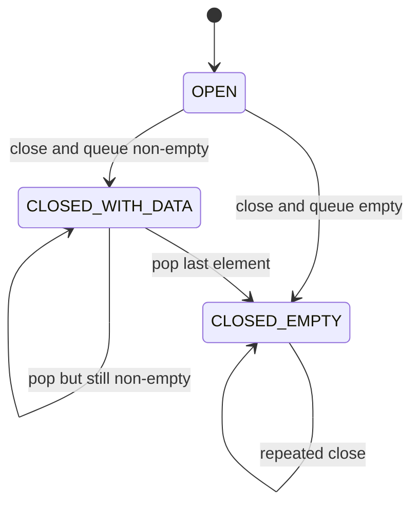
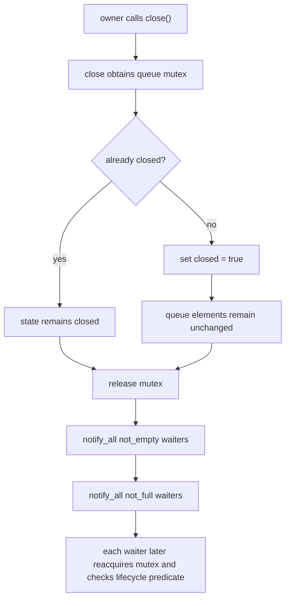
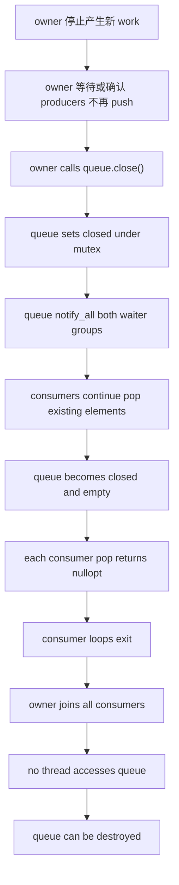
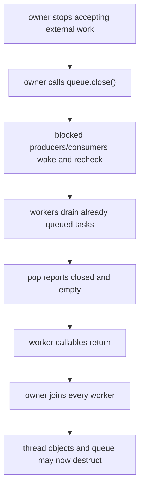

# Week7 Day5：queue 关闭以后，blocked producers 和 consumers 怎样全部退出

> 今日主线：`close()`、OPEN/CLOSED lifecycle、drain、`notify_all`、graceful shutdown、join-before-destruction。
>
> 今日类型：同一 BlockingQueue 的生命周期升级 + 错误路径测试。
>
> 今日产出：升级 Day4 的 `blocking_queue.hpp` 与 `blocking_queue_test.cpp`，并完成 `day5_note.md`。
>
> 默认编译：`g++ -std=c++17 -Wall -Wextra -g -pthread`。

学习前置：Week7 Day4 已验收。提前生成不代表 Day4 已完成。

今天不复制一份新 queue 项目。直接升级 Day4 的同一组件，用 Git 观察差异。

Day4 的 sentinel 能让受控 test 退出，但它不是通用 lifecycle：

```text
payload type 可能没有可用特殊值
每个 consumer 都需要一个 sentinel
producer 崩溃或提前结束时谁补 sentinel
blocked producer 并不会因 sentinel 自动退出
```

今天从真正的问题出发：

```text
owner 决定 queue 永远不再接收新 work 时，
所有可能在 not_empty / not_full 上睡眠的 threads 怎样知道“不要再等了”？
```

---

# Part 1：前情提要与必要术语

## 1. V1 缺少的不是一个 bool，而是 lifecycle contract

Day4 V1 只有：

```text
push waits for not_full
pop waits for not_empty
```

如果 queue empty 且所有 producers 已结束：

```text
not_empty 永远不会再次成立
```

consumer 如果只等待 `not_empty`，就会永久睡眠。

同理，queue full 且 service 要 shutdown 时：

```text
blocked producer 也需要停止等待
```

因此 wait predicate 必须从“只考虑数据状态”升级为“数据状态或 lifecycle state”。

---

## 2. 必要术语

### 2.1 lifecycle

`lifecycle`：生命周期。

今天指 queue 从可接收 work，到关闭、排空、最终销毁的状态变化。

---

### 2.2 graceful shutdown

`graceful shutdown`：优雅关闭。

当前 queue 语义：

```text
拒绝新 work
不丢弃已经成功入队的 work
唤醒所有等待者
让 consumers drain remaining elements
让 workers 自然退出
owner join workers
最后销毁 queue
```

它不等于“立刻 kill threads”。

---

### 2.3 drain

`drain`：排空。

queue closed 后，consumers 继续取走 close 前已经入队的 elements，直到 closed and empty。

---

### 2.4 idempotent

`idempotent`：幂等。

对同一 queue 多次调用 `close()`，最终状态与调用一次相同：

```text
closed remains true
existing elements 不被重复处理
不会重新打开
```

---

### 2.5 end-of-stream state

`end-of-stream`：流结束状态。

对于 queue：

```text
closed && empty
-> 不会再有 element
-> pop 不应继续等待
```

它类似 Week6 中 `recv == 0` 表达 peer write side EOF，但对象和协议不同：这里是 application queue lifecycle。

---

### 2.6 wake all waiters

`waiter` 是正在 condition variable 上等待的 execution flow。

close 改变的是所有 operations 的继续条件，所以通常需要：

```text
not_empty_cv.notify_all()
not_full_cv.notify_all()
```

这不是为了保证所有 threads 同时运行；它只是让所有 waiters 获得重新检查 lifecycle predicate 的机会。

---

### 2.7 linearization order

并发 `push()` 与 `close()` 发生时，需要存在可解释顺序：

```text
push 先在 mutex 下完成 -> element 已入队，之后可被 drain
close 先在 mutex 下设置 closed -> push 观察 closed 并失败
```

不能出现“push 返回成功，但 element 既不在 queue 也没被 consumer 处理”的中间结果。

---

### 2.8 owner

通常是 `main thread`，但 `owner` 不是“必须 main”的意思，而是**负责整个 queue 生命周期的那段执行流**。

在 Day5 的测试里，最自然的安排就是：

```text
main
-> 创建 BlockingQueue
-> 启动 producers / consumers
-> 等 producers 完成
-> 调用 queue.close()
-> join consumers
-> queue 析构
```

所以这里 `owner` 就是 main。

以后做 ThreadPool 时，owner 可能是：

```text
ThreadPool object 的 shutdown() 调用者
```

它也许仍是 main，也可能是别的管理线程。关键职责不变：它决定“不再接受新任务”，调用 `close()`，再等待所有仍在使用 queue 的 worker 退出。

---

### 2.9 `std::optional<int>`

`std::optional<int>` 表示“这里可能有一个 `int`，也可能没有值”。

Day5 的 `pop()` 可以用它表达两种结果：

```cpp
std::optional<int> value = queue.pop();
```

如果 queue 正常取到元素：

```cpp
return 42;  // 自动包装成 optional<int>{42}
```

如果 queue 已关闭且为空：

```cpp
return std::nullopt;  // 没有 int
```

使用时先判断：

```cpp
std::optional<int> value = queue.pop();

if (!value) {
    // 等价于 value.has_value() == false
    // queue 已关闭且没有剩余元素
    return;
}

int number = *value;  // 取出里面的 int
```

也可以写：

```cpp
if (value.has_value()) {
    std::cout << value.value() << '\n';
}
```

但通常更喜欢：

```cpp
if (value) {
    use(*value);
}
```

因为 `value.value()` 在 optional 为空时会抛 `std::bad_optional_access`；`*value` 也必须只在确认有值后使用。

压缩记忆：

```text
optional<int> = “可能存在的 int”
nullopt       = “没有值”
if (opt)      = “有值吗？”
*opt          = “取出值”
```

# Part 2：教程主体

# 教程开始

## 3. 三个 lifecycle states

今天把 queue 理解为：

```text
OPEN
CLOSED_WITH_DATA
CLOSED_EMPTY
```

### OPEN

```text
push：允许，full 时等待
pop：允许，empty 时等待
```

### CLOSED_WITH_DATA

```text
push：失败，不再等待
pop：继续返回已有 elements
```

### CLOSED_EMPTY

```text
push：失败
pop：返回 end-of-stream，不再等待
```

状态图：



不存在：

```text
CLOSED -> OPEN
```

本周 queue 不支持 reopen。

---

## 4. public API 为什么需要表达失败/结束

Day4：

```cpp
void push(T value);
T pop();
```

加入 close 后不够：

```text
push 如何表示 queue 已关闭？
pop 如何表示 closed and empty，不会再有 value？
```

推荐升级为：

```cpp
bool push(T value);
std::optional<T> pop();
void close();
```

头文件：

```cpp
#include <optional>
```

契约：

```text
push returns true  -> value 已进入 queue
push returns false -> queue 已 closed，value 未进入 queue

pop returns value   -> consumer owns one drained element
pop returns nullopt -> queue closed and empty

close               -> queue 永久进入 closed lifecycle
```

Day5 以 `int` 测试。对于 move-only `T`，push 失败时是否要把 value 归还 caller 是更深入的 API 设计问题，本日不阻塞。

---

## 5. push predicate 怎样升级

Day4 只等待：

```text
not_full = size < capacity
```

Day5 必须允许 close 打断等待：

```text
push_can_stop_waiting = closed || size < capacity
```

wait 返回并持有 mutex 后：

```text
if closed
-> return false

else
-> queue has room
-> insert value
-> return true
```

注意顺序：

```text
closed 优先于继续 push
```

即使 close 时 queue 恰好也 not_full，新 work 仍不再接受。

### 5.1 close 与 not full 对 waiter 的 predicate 的影响

`push_can_stop_waiting` 不是单纯的“是否 close”，而是 `push()` 的**等待结束条件**。

Day4 中 producer 只能因为 queue 有空位而结束等待：

```text
not_full = size < capacity
```

Day5 加入 `close()` 后，producer 还有另一种不必继续等的情况：queue 已关闭。即使它仍然是满的，也不能永远睡下去。

```text
push_can_stop_waiting = closed || size < capacity
```

它的含义是：

| `closed` | `size < capacity` | `wait` 返回后 |
|---|---:|---|
| false | false | 继续等 |
| false | true | 可以正常 push |
| true | false | 停止等待，push 失败/返回 |
| true | true | 仍停止等待，不能再 push |

所以 wait 返回并重新拿到 mutex 后，逻辑通常是：

```cpp
not_full_cv_.wait(lock, [this] {
    return closed_ || queue_.size() < capacity_;
});

if (closed_) {
    return false;  // 或抛异常，取决于 Day5 的接口设计
}

queue_.push(std::move(value));
```

关键是：`closed_` 让等待者“醒来并退出”；`size < capacity` 让等待者“醒来并继续完成 push”。它们合在一起才叫 `push_can_stop_waiting`。

---

## 6. pop predicate 怎样升级

Day4 只等待：

```text
not_empty = !queue.empty()
```

Day5：

```text
pop_can_stop_waiting = closed || !queue.empty()
```

wait 返回并持有 mutex 后有两种情况：

```text
queue non-empty
-> pop one element
-> 即使 closed 也要 drain

queue empty
-> predicate 为 true 只能因为 closed
-> return nullopt
```

所以不能写成：

```text
if closed -> pop immediately returns nullopt
```

那会丢弃 close 前已经入队的 work。

---

## 7. `close()` 的职责链



`close()` 不做：

```text
clear queue
join threads
destroy condition variables
强制中断正在处理 element 的 consumer
```

它只改变 queue lifecycle state 并发布这个变化。

---

## 8. 为什么 close 使用 `notify_all`

正常 push：

```text
新增一个 element
-> 通常只够一个 consumer pop
-> notify_one 合理
```

正常 pop：

```text
腾出一个 slot
-> 通常只够一个 producer push
-> notify_one 合理
```

close：

```text
所有 producers 都不应再等待 not_full
所有 consumers 都应重新判断是否 drain 或退出
```

如果只 notify_one：

```text
一个 waiter 退出
其他 waiter 可能永远睡眠
因为之后再也没有业务 state change 触发通知
```

所以 close 通知所有等待集合。

---

## 9. close、consumer drain、join、destructor 的完整主线



如果 producers 也是外部 workers：

```text
先保证不再提交
-> 让 producers 完成或让 blocked producers 因 close 返回失败
-> join producers
```

具体 owner 顺序取决于业务，但最终不变量相同：

```text
queue destructor 发生时，没有任何 thread 仍访问它。
```

---

## 10. close 与 blocked consumer

初始：

```text
queue empty
consumer waits on closed || !empty
```

owner close：

```text
closed = true
notify_all
```

consumer 将来恢复：

```text
重新获得 mutex
predicate true because closed
queue empty
pop returns nullopt
worker exits
```

consumer 不是被 `close()` 函数直接“杀掉”；它是正常从 public contract 返回结束状态后自行退出 loop。

---

## 11. close 与 blocked producer

初始：

```text
queue full
producer waits on closed || not_full
```

owner close：

```text
closed = true
notify_all
```

producer 恢复：

```text
重新获得 mutex
predicate true because closed
push returns false
value 未进入 queue
producer 根据业务退出或记录 rejection
```

不能让它醒来后只检查 not_full；否则 closed queue 恰好有 slot 时还会继续接受 work。

---

## 12. close 与正在进行的 push 谁先

同一 mutex 给出可解释顺序。

情况 A：push 先拿 mutex。

```text
push sees open
-> inserts element
-> releases mutex
-> close later sets closed
-> element belongs to queue and will be drained
```

情况 B：close 先拿 mutex。

```text
close sets closed
-> releases mutex
-> push later sees closed
-> returns false
```

这两个结果都合法。错误的是没有明确 linearization order，导致 caller 不知道成功返回的 element 去了哪里。

---

## 13. `closed()` query 只是 snapshot

可以不提供 public `closed()`。

即使提供并在锁内读取：

```text
closed() returns false
```

也不能保证下一次 `push()` 时仍 open，因为另一个 thread 可能马上 close。

所以 caller 不应写：

```text
if not closed:
    push
```

真正可靠的是 `push()` 自己原子地检查 lifecycle 并返回 success/failure。

---

## 14. destructor 为什么不能替你做完整 shutdown

可能想到：

```text
~BlockingQueue() 内自动 close
```

但 destructor 开始意味着 object lifetime 正在结束。如果其他 threads 仍可能调用 methods，仅仅 close 不能 join 它们，因为 queue 并不拥有这些 thread objects。

正确 ownership：

```text
外部 service / future ThreadPool owns workers and queue
-> service first closes queue
-> service joins workers
-> service members later destruct in safe order
```

Day5 的 queue destructor 仍要求 no concurrent access/no waiters。

---

## 15. member declaration order 也影响析构安全

未来 class 如果同时拥有：

```text
BlockingQueue queue_;
std::vector<std::thread> workers_;
```

C++ members 按声明的逆序析构。

但不能只靠声明顺序碰运气；owner destructor body 必须先：

```text
close queue
join workers
```

这样进入 member destruction 时，workers 已不再访问 queue。

这会成为 Week8 ThreadPool 的核心生命周期规则。

---

### 15.1 三组数字把 close 语义走完

#### 场景 A：empty queue 被 close

```text
capacity = 2
queue = []
closed = false
```

main 调用 `close()`：

```text
lock
-> closed = true
-> unlock
-> notify all producer and consumer waiters
```

之后：

```text
push(1) -> fail
pop()   -> end-of-stream
```

这里 consumer 不应继续等待，因为 predicate 已经从“只等数据”升级为“有数据或已经关闭”。

#### 场景 B：queue 中有两个 elements 时 close

```text
capacity = 3
queue = [10, 20]
closed = false
```

close 后是 `CLOSED_WITH_DATA`：

```text
push(30) -> fail
pop()    -> 10
pop()    -> 20
pop()    -> end-of-stream
```

close 不清空 queue。graceful shutdown 的 drain 就体现在：已经发布成功的 work 仍能被 consumers 取完。

#### 场景 C：full queue 上有 blocked producer

```text
capacity = 1
queue = [10]
producer 正在等待 push(20)
```

main close：

```text
closed = true
-> notify_all(not_full_cv)
-> producer 醒来并重新拿锁
-> predicate 因 closed 为 true 允许 wait 返回
-> producer 检查 closed
-> push(20) fails，20 没有进入 queue
```

consumer 仍可 pop 已存在的 `10`；随后看到 closed and empty，正常结束。

---

### 15.2 推荐 V2 API 的返回语义

一种清晰的接口是：

```cpp
bool push(T value);
std::optional<T> pop();
void close();
bool closed() const;
```

需要头文件：

```cpp
#include <optional>
```

最小调用例子只展示 caller 怎样解释结果：

```cpp
if (!queue.push(42)) {
    std::cout << "queue already closed\n";
}

std::optional<int> value = queue.pop();
if (value.has_value()) {
    std::cout << "received " << *value << '\n';
} else {
    std::cout << "closed and drained\n";
}
```

`push` 的 `false` 表示：

```text
the element was not published into this queue
```

但当前接口是 `push(T value)`：进入函数前，parameter 已经通过 copy 或 move 构造。失败返回时，这个 parameter 会被析构。因此：

```text
caller 传 lvalue -> caller 原对象仍在，因为 parameter 来自 copy
caller 传 rvalue -> caller 原对象可能已经 moved-from，失败不会自动把 value 还回去
```

所以 `false` 只承诺“queue 没有接受 element”，不承诺 caller 一定还能恢复原值。若业务必须在关闭竞争中取回未入队的 move-only task，需要设计不同 result type，例如在失败时返回 element；这属于 Day5 可选 API 增强，不改变本周核心 lifecycle。

`pop` 的 empty optional 只表达一个终态：

```text
closed && queue.empty()
```

它不表达“暂时 empty”。暂时 empty 时，open queue 的 `pop()` 仍然等待。

`closed()` 返回的是调用瞬间的 snapshot，不能拿来做：

```text
if (!queue.closed()) queue.push(...)
```

并期待两次调用之间状态不会改变。真正的 check-and-act 必须在 `push` 内部一次完成。

---

### 15.3 每个 operation 的 linearization point

把并发竞争放进同一张表：

| Operation | Logical effect point under mutex | Result after that point |
|---|---|---|
| successful `push` | element 插入 queue | element 已发布，future pop 可见 |
| failed `push` | 在锁内观察 `closed == true` | queue 不变，返回 failure |
| successful `pop` | element 从 queue 移出 | caller 获得该 element |
| end-of-stream `pop` | 在锁内观察 `closed && empty` | 返回 empty optional |
| first `close` | `closed_` 从 false 变 true | future pushes 必须失败 |
| repeated `close` | 在锁内观察已经 closed | state 不再变化 |

若 `push` 与 `close` 并发，谁先获得 mutex 不是重点；重点是这两个 operations 在 mutex 下形成一个可解释的顺序：

```text
push linearizes first -> element accepted，随后 close，consumer 可 drain
close linearizes first -> push rejected，element 从未进入 queue
```

不存在“半个 element 进入 queue”的中间结果。

---

### 15.4 为什么两个 condition variables 都要 `notify_all`

close 改变了两类 waiters 的继续条件。

blocked consumers 原来在等：

```text
not_empty
```

升级后在等：

```text
not_empty || closed
```

blocked producers 原来在等：

```text
not_full
```

升级后在等：

```text
not_full || closed
```

因此 close 后只通知 `not_empty_cv` 会漏掉 blocked producers；只通知 `not_full_cv` 会漏掉 blocked consumers。

只调用 `notify_one()` 也不够。假设三个 consumers 都在 empty queue 上等待，close 后只有一个被唤醒并退出，另外两个可能再也没有任何 state transition 来通知它们。`notify_all()` 的目的不是让所有 waiters 都获得成功结果，而是让所有受 lifecycle 变化影响的 waiters 都有机会重新检查并发现终止条件。

---

### 15.5 close 必须 idempotent，但每次都怎么处理通知

idempotent 表示：

```text
close(); close(); close();
```

与一次 `close()` 具有相同最终业务状态。简单实现可以让每次 close 都在锁内把 `closed_` 设为 true，随后通知；也可以只让第一次 state transition 执行通知。

无论采用哪种，必须保证：

```text
concurrent close calls 不产生 data race
closed_ 不会从 true 回到 false
所有可能已在等待的 producers/consumers 最终都得到重新检查机会
```

当前练习可把“设置 closed 与判断是否首次 close”放在同一 mutex 下，不引入 atomic。

---

### 15.6 owner 的 shutdown 顺序为什么比 queue destructor 更早

把它映射到 Week8 的 ThreadPool owner：

```text
ThreadPool owns BlockingQueue<Task>
ThreadPool owns worker thread objects
workers call queue.pop()
```

正确 shutdown 主线：



若直接进入 queue destructor，而还有 worker 正阻塞在 queue 的 mutex/CV 上，则 worker 可能继续访问已被销毁的 synchronization objects。destructor 无法替 owner 猜出所有外部 execution flows，也无法自动找到并 join 不属于 queue 的 thread objects。

所以 member declaration order 虽然重要，但它只是最后一道结构约束：owner 仍要先执行显式 shutdown protocol。

---

### 15.7 lifecycle 测试怎样提供证据

“程序跑完一次”不足以覆盖 blocked paths。测试要主动制造并观察每种状态，但 `sleep` 只能扩大窗口，不能证明某线程已经精确停在某一行。

可以结合：

```text
small capacity -> 更容易形成 full queue
multiple waiters -> 验证 notify_all
atomic counters or protected test flags -> 记录 operation 是否返回
join completion -> 证明没有 waiter 永久遗留
result IDs -> 证明 accepted elements 被 drain exactly once
repeated loops -> 扩大调度组合
TSan -> 检查未同步 memory access
```

每组 case 都写出预期终态，而不是依赖打印顺序。例如 close-with-data：

```text
accepted IDs 全部出现一次
post-close push 返回 false
所有 consumers 最终收到 end-of-stream
所有 thread objects 被 join
```

TSan 不证明 shutdown protocol 一定无 hang，因此普通运行、超时观察、结果 invariant 与 TSan 要一起使用。

---

# Part 3：收尾、练习、测试与验收

## 16. 今日升级目标

### 16.1 `blocking_queue.hpp` 是干什么的

继续作为 bounded MPMC queue，但新增 explicit lifecycle：

```text
OPEN 时正常 blocking push/pop
close 后拒绝 push
close 后继续 drain
closed and empty 时 pop 返回 end state
close 唤醒全部 waiters
```

不实现：

```text
reopen
cancel 已被 consumer 取走的 element
immediate clear-and-drop shutdown
timed operations
ThreadPool
```

---

### 16.2 推荐 V2 interface

```text
constructor(capacity)
deleted copy operations
push(value) -> bool
pop() -> optional<T>
close() -> void, idempotent
```

你可以选择其他同等清晰的 result type，但必须区分：

```text
pop 得到一个 value
pop 因 closed-and-empty 结束
```

不能用一个合法业务 `T` 值冒充结束标记。

---

## 17. V2 核心 predicates

请在 note 中明确写出自己的表达式，至少满足：

```text
producer 停止等待：closed 或 queue 有空间
consumer 停止等待：closed 或 queue 有数据
```

wait 返回后必须继续按 state 分支，不能把 predicate true 直接等同于 operation success。

---

## 18. 固定测试矩阵

### 18.1 normal MPMC

```text
多个 producers/consumers
所有 IDs 恰好消费一次
owner 结束提交后 close
consumers drain 并退出
```

### 18.2 close empty queue

```text
consumer 正在等待 empty queue
owner close
consumer pop 返回 end state
consumer exits and joins
```

### 18.3 close full queue

```text
capacity=1
queue 已满
另一个 producer 等待
owner close
blocked push 返回 false
```

### 18.4 close with data

```text
先 push 多个 values
close
consumer 仍取到全部 existing values
之后 pop 返回 end state
```

### 18.5 multiple blocked consumers

```text
多个 consumers 等待 empty queue
close
全部最终退出
```

### 18.6 multiple blocked producers

```text
capacity=1 且 queue 已满
多个 producers 分别阻塞在后续 push
owner close
所有 blocked push 都返回 false
没有任何等待中的 value 在 close 后进入 queue
```

### 18.7 repeated close

```text
close
close again
state remains valid
```

### 18.8 push after close

```text
returns false
queue state unchanged
```

这些 tests 可以使用短 sleep 扩大 blocked state 观察窗口，但正确性不能依赖 sleep 的固定顺序。

---

## 19. 测试结果必须验证什么

```text
no missing/duplicate normal IDs
no successful push after close linearizes first
close 前成功 push 的 values 全部 drain
all blocked waiters eventually return
all workers join
program exits repeatedly
TSan clean
```

“没有卡住”不够；还要确认没有为了退出丢掉已有 work。

---

## 20. 编译、TSan 与压力运行

```bash
g++ -std=c++17 -Wall -Wextra -g -pthread \
  blocking_queue_test.cpp -o blocking_queue_test

./blocking_queue_test
```

```bash
g++ -std=c++17 -Wall -Wextra -g -O1 -pthread \
  -fsanitize=thread -fno-omit-frame-pointer \
  blocking_queue_test.cpp -o blocking_queue_test_tsan

./blocking_queue_test_tsan
```

### 20.1 Day5 要用 TSan 检查哪些 lifecycle paths

Day5 新增的风险不是普通 push/pop 本身，而是 `close()` 与其他 operations 并发：

```text
close writes closed state
push/pop read closed state and queue state
blocked waiters 醒来后重新检查 predicate
test threads 记录 operation 是否返回
```

因此不能只跑“先完成全部 work，再由 main close”的轻松路径。TSan case 至少要实际覆盖：

```text
consumer blocked on empty -> another thread close
producer blocked on full -> another thread close
queue has data -> close 与 consumers drain 并发
multiple blocked waiters -> close + notify_all
close 与 push 尽量同时发生，结果按 linearization order 验证
```

分析 report 时先分类：

```text
report points to closed_
    检查所有 reads/writes 是否在同一 queue mutex 下，而不是只给 close 加锁。

report points to container internals
    检查 close/drain path 是否绕开了 push/pop 的 locking discipline。

report points to returned/counter/test flag
    检查 test harness；记录“某 waiter 已返回”的 flag 也需要 synchronization。
```

推荐先停在第一份报告：

```bash
TSAN_OPTIONS="halt_on_error=1" ./blocking_queue_test_tsan
echo $?
```

这里必须把 TSan 和 hang 检查分开：

```text
TSan 能报告未同步 memory access
TSan 不保证发现 lost wakeup
TSan 没有输出但程序永久不返回，仍然是失败
```

TSan instrumentation 会显著减慢程序，因此 timeout 要比普通 build 宽松；但不能因为它慢就把真正的永久等待都解释成工具开销。先确认当前 case 的 expected terminal state，再观察所有 workers 是否 join。

```bash
for i in $(seq 1 100); do
  ./blocking_queue_test || exit 1
done
```

若某次卡住，保留该 case 和日志，不要只增加 sleep 掩盖。

---

## 21. 可选增强，不阻塞 Day5

```text
try_push / try_pop
timed push / timed pop
close 后返回 rejection reason
失败 push 返回未入队的 value
move-only T
immediate shutdown 与 graceful shutdown 两种 policy
```

Week8 前不需要把 queue 做成工业级库。

---

## 22. 验收问题

1. Day4 sentinel termination 有哪些通用性问题？
2. OPEN、CLOSED_WITH_DATA、CLOSED_EMPTY 分别允许哪些 operations？
3. 为什么 producer wait predicate 必须包含 `closed`？
4. 为什么 consumer 看到 closed 后不能直接退出？
5. `pop()` 返回 `nullopt` 精确表示什么？
6. close 为什么要同时 `notify_all` 两组 waiters？
7. close 与 push 并发时，哪两种 linearization order 都是合法的？
8. 为什么 queue destructor 不能独自完成 service 的 graceful shutdown？
9. owner 的“停止提交 -> close -> drain -> join -> destroy”链条中，每一步由谁负责？

---

## 23. 推荐的 `day5_note.md` 结构

```markdown
# Week7 Day5 Note

## 1. BlockingQueue lifecycle states

## 2. push/pop predicates 如何加入 closed

## 3. close -> notify_all -> drain -> worker exit -> join

## 4. close 与 push/pop 并发的顺序

## 5. empty/full/with-data/multiple-waiter 测试

## 6. TSan、压力测试与真实问题

## 7. 验收回答
```

---

## 24. 今日压缩记忆

```text
close 不是清空 queue，也不是杀死 threads；
它改变 lifecycle predicate，让所有 waiters 有机会结束等待。

closed with data 继续 drain；
只有 closed and empty 才表示 pop 的 end-of-stream。

graceful shutdown 的完整责任在 owner：
stop submit -> close -> drain -> join -> destroy。
```
