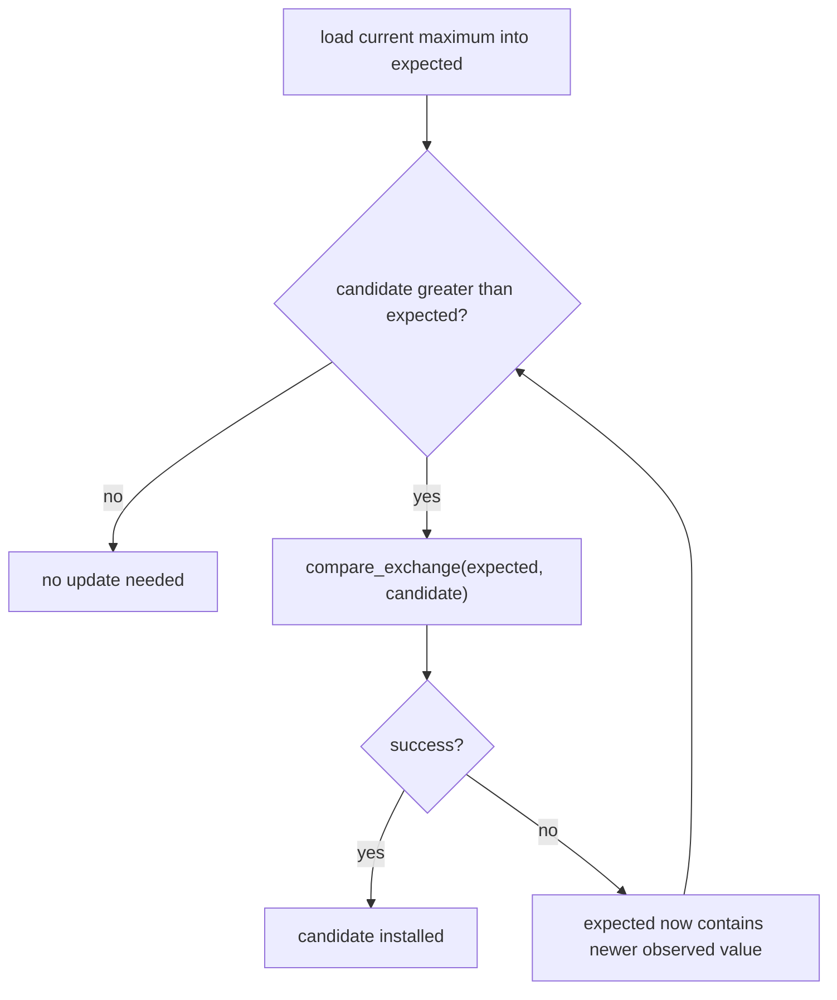

# Week7 Day6：一个 atomic counter 能不用 mutex，为什么整个 BlockingQueue 不行

> 今日主线：atomic object、atomic read-modify-write、sequential consistency、CAS、`compare_exchange`、适用边界。
>
> 今日类型：机制理解 + 两个受控小练习。
>
> 今日产出：`atomic_counter.cpp`、`cas_max.cpp` 与 `day6_note.md`。
>
> 默认编译：`g++ -std=c++17 -Wall -Wextra -g -pthread`。

学习前置：Week7 Day5 已验收。提前生成不代表 Day5 已完成。

今天不修改 BlockingQueue 为 lock-free queue，也不学习复杂 memory ordering。

今天从一个对比出发：

```text
shared counter 只维护一个整数的递增
BlockingQueue 同时维护 container、size、capacity、closed 和等待协议
```

为什么前者常能使用 `std::atomic`，后者不能把 members 分别改成 atomic 就自动正确？

---

# Part 1：前情提要与必要术语

## 1. 从 Day2 和 Day5 接过来的问题

Day2 已经知道 mutex 可以保护复合 invariant：

```text
检查 state
-> 修改多个 fields
-> 在 unlock 前恢复 invariant
```

Day5 的 queue 更复杂：

```text
closed
container empty/full
element ownership transfer
waiters
```

但有些 shared state 真的只是单一数值：

```text
completed task count
request count
maximum observed value
```

这类问题可以先考虑 atomic。

---

## 2. 必要术语

### 2.1 atomic operation

`atomic`：原子的。

当前层次：一次 atomic operation 不会被其他 threads 观察成只发生了一半。

例如 atomic `fetch_add(1)` 是一次不可分割的 read-modify-write operation。

---

### 2.2 read-modify-write

`RMW`：Read-Modify-Write，读-改-写。

```text
读取旧值
计算新值
写回新值
```

atomic RMW 把这三步作为一个 atomic operation。

---

### 2.3 atomic load / store

`load`：读取 atomic value。

`store`：写入 atomic value。

它们各自是 atomic operations，但：

```text
load
-> 普通计算
-> store
```

三个步骤组合起来不自动成为一个 atomic RMW。

---

### 2.4 sequential consistency

`sequential consistency`，常缩写 `seq_cst`：顺序一致性。

它是 C++ atomic operations 的默认 memory order，也是本周唯一使用的 order。

第一层直觉：

```text
所有 seq_cst atomic operations 可以按一个与各 thread 程序顺序一致的全局顺序理解
```

这不是说 threads 实际串行运行；它是 observable ordering model。

---

### 2.5 CAS

`CAS`：Compare-And-Swap 或 Compare-And-Set，比较并交换/设置。

C++ API 名字使用：

```text
compare_exchange
```

概念：

先比较 atomic 的值是否等于 expected，这是 compare；

如果等于的话，进入 set，就是把 desired 的值写入 atomic。

```text
如果 atomic 当前值等于 expected
-> 写入 desired
-> success

否则
-> 不写 desired
-> failure，并告诉 caller 当前真实值
```

---

### 2.6 expected / desired

`expected`：预期值。

`desired`：期望写入的新值。

`expected` 在 compare_exchange 中是 input/output parameter：

```text
调用前：caller 认为 atomic 当前应等于 expected
失败后：API 把 atomic 实际观察值写回 expected
```

这一点是 CAS loop 的核心。

---

### 2.7 weak / strong

```text
compare_exchange_weak
compare_exchange_strong
```

`weak` 允许 spurious failure：即使值相等，也可能返回 false，适合放在 loop 中。

`strong` 不允许这种额外的虚假失败，更适合只尝试一次的场景。

两者都可能因为其他 thread 先改变 atomic value 而正常失败。

---

### 2.8 lock-free

`lock-free` 是一种进度性质，不是 `std::atomic` 的同义词。

某个 `std::atomic<T>` implementation 是否 lock-free 与类型和平台有关。

因此：

```text
atomic operation
!=
标准保证底层绝对不使用 lock
```

今天不以 lock-free 为学习目标。

---

这里的 `lock-free` 不是“代码里没写 `std::mutex`”这么简单，而是在说：**并发操作卡住时，系统还能不能继续推进。**

先看普通 mutex：

```
线程 A 拿到 mutex
-> A 突然被暂停，或者执行很慢
-> 线程 B 想访问同一份数据
-> B 只能等 A 释放 mutex
```

A 不动，B 就完全不能完成操作。
这种进度依赖某个持锁线程，叫 **blocking**，不是 lock-free。

而 lock-free 的目标是：

```
多个线程同时尝试更新共享数据
-> 某个线程可能失败、重试、甚至被暂停
-> 但只要其他线程还在运行
-> 至少有一个线程能完成操作
```

注意这个保证是“整个系统有人能完成”，不是“每个线程都一定很快完成”。

```
lock-free：
A 一直失败也没关系，
只要 B、C 之类还能成功推进共享状态即可。

wait-free：
更强。
每一个线程都保证在有限步骤内完成。
```

你现在学的 CAS loop 很接近这个直觉：

```
A CAS 失败
-> 说明 B 可能抢先 CAS 成功
-> A 虽然没成功
-> 但 shared state 已经被 B 推进了
```

所以 A 的失败不一定是“白忙”；可能正说明系统里另一个线程完成了工作。

但 `std::atomic` 只保证：

```
这次读 / 写 / RMW 是原子的
不会因为并发访问本身构成 data race
```

它**不保证**实现底层一定没有锁。

例如：

```
std::atomic<int> counter;
```

在大多数常见机器上往往能直接用 CPU 原子指令实现，通常是 lock-free。

但：

```
std::atomic<VeryLargeStruct> state;
```

CPU 可能没有“一条指令原子更新这么大的对象”的能力。标准库为了仍提供“原子语义”，可能在内部偷偷用一把锁保护它。

于是：

```
它仍然是 std::atomic
但实现可能不是 lock-free
```

可以查询：

```
std::atomic<int> value;
std::cout << value.is_lock_free() << '\n';
```

压缩记忆：

```
atomic：操作不可被并发拆开，避免 data race
lock-free：某线程卡住时，其他线程仍能让整体继续推进
wait-free：每个线程都保证能在有限步骤内完成
```

所以你这段 daily 的重点是在提醒你：**不要看到 `std::atomic` 就自动脑补“没有锁、不会阻塞、性能一定高”。**

---

# Part 2：教程主体

# 教程开始

## 3. 普通 `counter++` 为什么是 read-modify-write

源代码：

```cpp
++counter;
```

对普通 `int` 的概念步骤：

```text
read counter
add 1
write counter
```

两个 threads 可能都读到旧值 10：

```text
Thread A reads 10
Thread B reads 10
Thread A writes 11
Thread B writes 11
```

两次 increment 只留下一个增长，而且普通 object 上这还是 C++ data race/undefined behavior。

---

## 4. `std::atomic<int>` 改变了什么

头文件：

```cpp
#include <atomic>
```

创建：

```cpp
std::atomic<int> counter{0};
```

atomic increment：

```cpp
counter.fetch_add(1);
```

或：

```cpp
++counter;
```

这里的 increment 是 atomic RMW：多个 threads 的每一次增加都占据一个完整 atomic operation，不会因为两个 callers 同时读旧值而丢失一次更新。

---

## 5. API：`load()` 与 `store()`

概念接口：

```cpp
T load() const;
void store(T desired);
```

独立例子：

```cpp
std::atomic<bool> stop{false};

stop.store(true);
const bool observed = stop.load();
```

默认使用 `seq_cst`。

注意：

```cpp
const int old = counter.load();
counter.store(old + 1);
```

虽然 load 和 store 各自 atomic，但组合不是 atomic increment。其他 thread 可以在二者之间改变 counter。

---

## 6. API：`fetch_add()`

概念接口：

```cpp
T fetch_add(T amount);
```

语义：

```text
atomic value += amount
return modification 之前的旧值
```

独立例子：

```cpp
std::atomic<int> next_id{0};

const int my_id = next_id.fetch_add(1);
```

多个 threads 调用时，每个成功 operation 获得不同 old value，因此可用于分配唯一递增 ID。

对照：

```text
fetch_add 返回 old value
pre-increment ++value 返回 new value
```

使用前看清返回语义，不要靠猜。

---

## 7. atomic object 的 copy 边界

`std::atomic<T>` 不提供普通 copy constructor/copy assignment semantics。

要读取一个 atomic value，使用：

```text
load
```

要写入：

```text
store
```

这能强迫代码明确 operation，而不是把 synchronization object 当普通 value object 随意复制。

---

## 8. API：`compare_exchange_strong`

简化接口：

```cpp
bool compare_exchange_strong(T& expected, T desired);
```

独立单次例子：

```cpp
std::atomic<int> state{10};
int expected = 10;

const bool changed = state.compare_exchange_strong(expected, 20);
```

compare: 先看 atomic（也就是 state）的值是否等于 expected。

若调用时 `state == 10`：

```text
state becomes 20
changed == true
expected remains 10，成功时 expected 不变！
```

若另一个 thread 已把 state 改成 15：

```text
state remains 15
changed == false
expected becomes 15，失败后，从 atomic 把实际观察值写入到 expected 中。
```

失败时 `expected` 被改写，不是附带细节，而是为了让 caller 获得新的 observed state。

---

## 9. CAS loop 为什么需要重新判断

`cas_max` 想维护：

```text
shared maximum >= every successfully processed candidate so far
```

caller 可能观察旧 maximum，然后另一个 thread 先更新。

于是第一次 CAS 失败并把新 maximum 写回 `expected`。

caller 不能盲目再次提交原 `desired`，而要重新问：

```text
基于最新 observed maximum，candidate 还需要更新吗？
```

需求级流程：



这张图描述 algorithm contract，但没有给完整 C++ loop；请自己选择 weak/strong 和条件组织。

---

### 9.1 上述 shared maximum 的案例啥意思

**这个案例很好地演示了 CAS 能够用来 check 从我观察到的值到我实际去 CAS 中间有没有别的 thread 去修改 atomic。**

这里的 `caller` 就是“调用 `cas_max(candidate)` 的那个线程”。  
“观察旧 maximum”不是内存读错了，而是它读到一个当时正确、但马上被别的线程更新过的值。

假设一开始：

```text
maximum = 10
```

线程 A 想提交 `candidate = 20`，线程 B 想提交 `candidate = 30`。

时间顺序可能是：

```text
线程 A：
expected = maximum.load();   // 读到 10

线程 B：
expected = maximum.load();   // 也读到 10
CAS(10 -> 30) 成功
maximum 现在变成 30

线程 A：
CAS(10 -> 20)
```

A 的 CAS 会失败，因为它说的是：

```text
“只有 maximum 现在仍然等于 10，
我才把它改成 20。”
```

但 maximum 已经是 30，不再等于 A 手里旧的 `expected == 10`。

CAS 失败时有一个很重要的行为：

```text
expected 原本是 10
CAS 失败后，expected 会被改写成当前真实的 maximum，也就是 30
```

所以 A 现在得到的信息是：

```text
我原来以为 maximum 是 10；
但实际上别人已经把它更新到 30 了。
```

这时 A 必须重新判断：

```text
candidate = 20
最新 maximum = 30

20 > 30 吗？
不大于。
```

因此 A 什么也不该做。因为“维护最大值”的目标不是把自己的 candidate 硬写进去，而是保证 maximum 不下降。

如果 A 不重新判断，盲目再试：

```text
CAS(30 -> 20)
```

它反而会把 maximum 从 30 降成 20，算法就错了。

再看另一种情况。A 的 candidate 是 40：

```text
A 起初读到 expected = 10
B 先把 maximum 更新成 30
A 的 CAS(10 -> 40) 失败
CAS 把 expected 改成 30

重新判断：
40 > 30
仍然成立

于是 A 再尝试 CAS(30 -> 40)
成功
```

完整直觉就是：

```text
load 得到的 expected 只是“我观察到的旧版本”

CAS 成功
-> 说明从观察到提交之间，没有别人改过 maximum
-> 可以安全安装 candidate

CAS 失败
-> 说明有人抢先改了 maximum
-> expected 带回最新值
-> 你必须基于新值重新判断业务条件
```

所以这个循环不是“CAS 失败就无脑重试”，而是：

```text
CAS 失败（意味着 shared state 遭遇别的 thread 修改）
-> 获取最新 shared state
-> 重新判断 candidate 是否还值得更新
-> 值得才再 CAS
```

`maximum` 是原子变量，所以这里没有 data race；困难在于多个线程的逻辑操作会交错，旧 snapshot 可能已经不适用于当前业务判断。

---

## 10. weak 为什么适合 loop

`compare_exchange_weak` 可能 spurious fail，但 loop 本来就会：

```text
读取 failure 后的新 expected
-> 重新判断
-> 必要时重试
```

所以 weak 常用于 CAS loop。

`strong` 也能放进 loop，只是标准不允许它因 value 相等而额外虚假失败。

今天重点不是性能微调，而是：

```text
每次 failure 后 expected 可能变化，algorithm 必须基于新 state 重新决策。
```

---

### 10.1 weak 的 spurious fail 是啥？

**其实就是莫名其妙失败了，并不是因为 expected!=atomic。**

你说得基本对：**两者失败时都会返回 `false`，并把 atomic 当前观察到的值写回 `expected`。**

真正的区别只在于：`weak` 多了一种“其实没人抢，但它也允许说自己失败了”的情况。

假设：

```text
atomic maximum = 10
expected = 10
desired = 20
```

没有其他线程修改 `maximum`。

| 调用 | 允许的结果 |
|---|---|
| `compare_exchange_strong(expected, 20)` | 必须成功：`maximum = 20`，返回 `true` |
| `compare_exchange_weak(expected, 20)` | 可以成功；也允许返回 `false`，但 `maximum` 仍是 10 |

后一种就是 `spurious failure`，中文常译“虚假失败”：

```text
weak 返回 false
但不是因为 maximum 已被别人改掉
maximum 仍然是 10
expected 被写回 10
```

于是 caller 再试一次即可。

如果确实有其他线程先把 maximum 改成了 30：

```text
maximum = 30
expected 原来是 10
```

那两者都会正常失败：

```text
return false
expected 被更新为 30
```

所以可以压缩成：

```text
weak 失败：
    可能是别人改了值
    也可能没人改，只是允许虚假失败

strong 失败：
    只能是比较不相等，也就是值确实不再是 expected
```

为什么 loop 里通常用 `weak`？

```text
CAS loop 本来就准备失败后重试
-> weak 多失败一次没有破坏正确性
-> 某些 CPU 上更容易映射成高效机器指令
```

为什么单次尝试常用 `strong`？

```text
我只想问一次：
“当前还是 10 吗？是就改成 20，否则告诉我失败。”

如果实际仍是 10，
我不希望因为虚假失败得到 false。
```

还有一个容易混淆的点：`strong` 不意味着“更不会被其他线程抢”。它也完全可能失败：

```text
A 准备 CAS(10 -> 20)
B 抢先改成 30
A 的 strong CAS 返回 false
expected = 30
```

它只是保证：**没有竞争、值确实相等时，不会额外装作失败。**

---

## 11. atomic counter 为什么适合 atomic

counter invariant 简单：

```text
一个 atomic integer 保存一个累计值
每次 operation 只需要对这一个 object 做 RMW
```

例如：

```text
completed_tasks.fetch_add(1)
```

caller 不需要与另一个 field 同时保持关系。

---

## 12. bank transfer 为什么不能只把 balances 改成 atomic

假设两个 accounts 都是 atomic：

```text
source.fetch_sub(amount)
destination.fetch_add(amount)
```

两个 operations 各自 atomic，但中间仍存在：

```text
source 已扣
destination 未加
```

另一个 observer 可以看到 total 暂时减少。

而且“检查余额足够 + 扣款”本身也是复合逻辑。

所以：

```text
多个 atomic fields
!=
整个 business transaction atomic
```

Day2 ledger 仍适合 mutex。

---

## 13. BlockingQueue 为什么不能把 size/closed 都改 atomic 就完成

queue invariant 涉及：

```text
container contents
size/capacity relation
closed lifecycle
element ownership transfer
wait predicate 和 waiter protocol
```

即使 `size_` 和 `closed_` 是 atomic：

```text
检查 size 有空间
-> 另一个 producer 改变 container
-> 当前 producer 修改非 thread-safe container
```

仍然不正确。

本周不实现 lock-free queue，因为真正 lock-free MPMC queue 还需要：

```text
复杂 algorithm
memory ordering
safe memory reclamation
ABA 等边界
```

这些超出当前路线。

---

## 14. atomic 与 mutex 不是“谁更高级”

选择依据：

```text
单一 scalar state、独立 RMW
-> atomic 可能合适

多个 fields / container / condition wait /复合 invariant
-> mutex 通常更清楚
```

atomic 可能降低某些 lock contention，但也可能产生 cache contention。Day7 再观察 performance。

正确性设计不能只看“有没有 mutex”。

---

## 15. 本周为什么不显式写 memory order

下面使用默认：

```cpp
counter.fetch_add(1);
```

等价于使用默认 `std::memory_order_seq_cst`。

今天不写：

```cpp
counter.fetch_add(1, std::memory_order_relaxed);
```

不是因为 relaxed 永远错误，而是它需要额外解释：

```text
哪些 operations 只要求原子性
哪些 state publication 需要 happens-before
哪些 reorderings 允许
```

当前先把 atomic API 与 algorithm contract 写对，再进入 memory model 深水区。

---

## 16. TSan 与 atomic

正确使用 atomic operations 访问 atomic object，不会形成普通 non-atomic data race。

但 TSan clean 不表示 algorithm 正确：

```text
用 atomic load/store 写错 read-modify-write
多个 atomics 之间 invariant 不成立
CAS loop 条件错误
```

都可能没有 data race report，却给出错误结果。

因此仍需 trusted single-thread result 和 invariant check。

TSan 能识别标准 mutex 和 atomic operations 建立的同步关系，所以：

```text
两个 threads 都用 atomic operations 访问同一个 atomic object
    通常不会产生普通 non-atomic data-race report。

一个 thread 用 atomic access，另一个通过错误方式访问同一 storage
    仍可能被报告为冲突。

atomic load + store 造成 lost update
    可能完全 TSan clean，因为每次单独 access 都是 atomic；错误在 algorithm contract。
```

这使 Day6 成为理解 TSan 证据边界的最好反例：

```text
TSan clean
!=
atomic algorithm correct
```

今天若 TSan report 指向 `atomic_counter.cpp` 或 `cas_max.cpp`，按以下顺序查：

```text
1. 被报告的 location 真的是 atomic object，还是旁边的普通 expected/result/test flag？
2. 两个 user-code frames 分别执行 atomic access、ordinary access 还是 container access？
3. main 是否在 join 前读取 worker 正在修改的普通 result？
4. CAS loop 的 expected/desired 是否为 thread-local，而不是被多个 workers 共享？
```

即使没有 report，也必须分别检查：

```text
atomic counter == worker_count * increments
cas_max == std::max_element trusted result
negative / duplicate / worker-count boundaries
```

---

### 16.1 atomic `load` + `store` 仍可能丢更新

把普通 counter 改成 atomic 后，下面每一步都不再是 data race：

```cpp
int old_value = counter.load();
中间仍然有窗口给其他 thread 插入。
counter.store(old_value + 1);
```

但个“加一”仍由两个分离 operations 组成。假设初始 `counter = 0`：

```text
T1 load  -> 0
T2 load  -> 0
T1 store -> 1
T2 store -> 1
```

最终是 `1`，而不是 `2`。

这里：

```text
没有 data race：每个 access 都是 atomic
仍有 logical race：两个 operations 之间没有不可分割的 update contract
```

`fetch_add(1)` 把 read-modify-write 合成单个 atomic operation：

```text
T1 fetch_add observes 0 and writes 1
T2 fetch_add observes 1 and writes 2
```

两者先后可能变化，但每次 increment 都只生效一次。

这条对比很重要：

```text
atomic variables
!=
任意一串 atomic operations 自动成为一个 transaction
```

---

### 16.2 `compare_exchange` 的完整 signature 与双向结果

简化后的常用 signatures：

```cpp
bool compare_exchange_weak(T& expected, T desired);
bool compare_exchange_strong(T& expected, T desired);
```

它们都把 `expected` 当作 input/output parameter。

成功时：

```text
atomic current == expected
-> atomic current becomes desired
-> return true
-> expected 保持原值
```

失败时：

```text
atomic current != expected
-> atomic current 不被修改
-> expected 被改写成刚观察到的 current value
-> return false
```

独立最小例子：

```cpp
std::atomic<int> value{10};
int expected = 10;

const bool changed = value.compare_exchange_strong(expected, 20);
// changed == true, value == 20, expected == 10
```

失败例子：

```cpp
std::atomic<int> value{15};
int expected = 10;

const bool changed = value.compare_exchange_strong(expected, 20);
// changed == false, value == 15, expected == 15
```

因此失败不是只给一个 `false`。它还把最新观察值交还给 caller，让 loop 可以基于新 state 重新判断。

---

### 16.3 两个 threads 竞争更新 maximum

假设 shared maximum 初始是 `40`：

```text
T1 candidate = 50
T2 candidate = 60
```

一种执行：

```text
T1 load expected = 40
T2 load expected = 40

T1 CAS(expected=40, desired=50)
-> success，maximum = 50

T2 CAS(expected=40, desired=60)
-> fail，因为 current 已是 50
-> expected 被写成 50

T2 重新检查 60 > 50
-> CAS(expected=50, desired=60)
-> success，maximum = 60
```

如果 T2 的 candidate 只有 `45`，在失败后拿到 `expected = 50`，重新判断就会发现 `45` 已不可能改善 maximum，直接停止。

这就是 CAS loop 的核心 invariant：

```text
shared maximum 始终等于已经成功发布的 candidates 中的某一个值
只有 candidate 比当前观察值更大时才尝试替换
CAS 失败后，expected 已更新，必须重新比较而不是盲目重试旧判断
```

不要在 compare-exchange 失败后手工把 `expected` 重置成最初 load 的值；那会丢掉 API 刚提供的最新观察结果。

---

### 16.4 weak 与 strong 的选择边界

`compare_exchange_weak` 允许 spurious failure：即使当前值等于 expected，也可能返回 false。放在 loop 中没有问题，因为 loop 本来就会重新检查并重试。

```text
CAS loop -> weak 通常合适
只尝试一次、失败具有业务含义 -> strong 更符合直觉
```

但 `weak` 不等于“线程不安全”，`strong` 也不等于“一定成功”。只要另一个 thread 先修改了 atomic，strong 同样会正常失败。

CAS loop 还可能在高 contention 下反复失败：

```text
load
-> 准备 desired
-> 别的 thread 抢先更新
-> CAS fail
-> retry
```

所以 atomic 并不自动意味着更快，也不保证某一个具体 thread 在有限次数内一定成功。Day7 会用 measurement 而不是口号比较这种 contention cost。

---

### 16.5 `cas_max` 的 initialization 不能偷偷假设全是正数

如果把 maximum 初始化为 `0`，输入全为负数时会错：

```text
input = [-8, -3, -11]
错误初值 maximum = 0
没有 candidate 大于 0
结果错误地保留 0
```

可解释方案：

```text
non-empty input -> 使用第一个 element 初始化 maximum，其余 elements 并发更新
empty input -> 单独定义返回 contract，例如 std::optional<int>
```

当前练习可以明确规定 input non-empty，并把 empty case 作为拒绝条件；也可以自行使用 optional。无论选哪一种，测试都必须包含 all-negative values，避免初始化假设躲过去。

---

### 16.6 atomic object 的 ownership 与 lifetime

`std::atomic<T>` 本身不可 copy。多个 threads 要操作同一个 atomic state，通常是：

```text
owner 创建一个 atomic object
-> 以 reference/pointer 让 workers 访问同一 object
-> owner 保证 object 活到所有 workers join 以后
```

若把每个 worker 都给一个独立 atomic copy，即使语言允许，也不会得到 shared counter；它们只是多个彼此无关的 states。

初始化应在 object 发布给 workers 之前完成：

```cpp
std::atomic<long long> counter{0};
```

之后不要在 workers 运行时销毁或重新放置这个 object。atomic 解决的是对存活 object 的并发 access，不解决 dangling pointer/reference。

---

### 16.7 默认 sequential consistency 当前怎样理解

今天不显式传 `memory_order`，所有 operations 使用默认 sequential consistency，缩写 `seq_cst`。

当前层次把它理解为：

```text
每个 atomic operation 本身不可分割
所有 seq_cst atomic operations 可被放进一个大家一致观察的 global order
该 order 尊重每个 thread 自己的 program order
```

例如 T1 先对同一 counter 做两次 `fetch_add`，其他 threads 不会把这两次 seq_cst operations 看成颠倒的顺序。

但这不把多个 operations 合成 transaction，也不替你保护普通 non-atomic data。若业务正确性要求“改 A 与改 B 一起生效”，仍应回到 invariant 与 mutex 设计。

---

### 16.8 为什么 atomic 不能代替 BlockingQueue 的等待协议

即使把 `size_` 与 `closed_` 都改成 atomic，仍然缺少：

```text
queue container 本身的复合修改保护
not_empty / not_full 的一致判断
没有条件时让 thread 阻塞
state 改变后唤醒正确 waiting set
close 后让所有 waiters 退出
```

atomic `load()` 只能告诉 producer“这一瞬间 size 看起来是多少”。等 producer 真正修改 queue 时，其他 threads 可能已经改变 state。若写成不停 load 的 busy loop，它还会持续占用 CPU，而不是 condition variable 那样进入阻塞等待。

因此选择工具先看 state transition：

```text
单个独立 counter/RMW -> atomic 可能合适
多个字段组成 invariant -> mutex 往往更清晰
需要等待 predicate -> mutex + condition_variable
```

---

### 16.9 `is_lock_free` 这个名字不要误读

标准库允许查询某个 atomic implementation 是否 lock-free：

```cpp
bool is_lock_free() const noexcept;
```

C++17 还可通过对应类型的 `is_always_lock_free` 了解该实现是否总是 lock-free。它描述的是 implementation 是否需要内部锁来完成 atomic operation，不描述你的整个 algorithm 是否：

```text
没有 contention
一定更快
没有 retry
业务逻辑正确
```

Day6 不把“必须 lock-free”设为验收条件。正确语义先于实现细节。

---

# Part 3：收尾、练习、测试与验收

## 17. 产出一：`atomic_counter.cpp`

### 17.1 程序是干什么的

多个 workers 各执行固定次数 increment，比较：

```text
mutex-protected counter
atomic counter
```

输入：

```text
worker count
increments per worker
```

输出：

```text
expected total
mutex counter result
atomic counter result
PASS / FAIL
```

成功标准：

```text
两种正确版本都精确等于 worker_count * increments
all workers join
TSan clean
```

今天不把普通 racy counter 重新作为正式版本；Week5 已经做过。

---

### 17.2 contract

```text
mutex version 的每次 increment 在同一 mutex 下
atomic version 的每次 increment 使用 atomic RMW
不能用 atomic load + ordinary add + atomic store 冒充 RMW
main 在 join 后读取最终结果
```

今天不记录 timing 结论，避免 debug/TSan noise 混入性能判断。

---

## 18. 产出二：`cas_max.cpp`

### 18.1 程序是干什么的

多个 workers 读取各自 input range，把 candidate values 提交给一个 shared atomic maximum。

输入：

```text
integer vector
worker count
```

输出：

```text
single-thread std::max_element result
CAS maximum result
PASS / FAIL
```

边界：

```text
empty input 必须有明确 policy，例如不运行或使用 optional result
包含 negative values 时 initial maximum 不能随便写 0
```

---

### 18.2 CAS contract

```text
每个 candidate 小于等于当前 maximum 时无需写
candidate 更大时尝试 compare_exchange
失败后 expected 已更新，必须重新判断
成功后 shared maximum 已安装 candidate
```

请独立写 loop，不从其他 lock-free algorithm 复制复杂模板。

---

## 19. 固定测试

### atomic counter

```text
1 worker * 0 increments
1 worker * 10000
4 workers * 100000
8 workers * 100000
```

### CAS max

```text
one element
strictly increasing values
strictly decreasing values
duplicates
all negative values
large random vector，与 max_element 对照
workers > element count
```

每个 test 重复运行，不能只看一次。

---

## 20. 编译与运行

```bash
g++ -std=c++17 -Wall -Wextra -g -pthread \
  atomic_counter.cpp -o atomic_counter

g++ -std=c++17 -Wall -Wextra -g -pthread \
  cas_max.cpp -o cas_max

./atomic_counter
./cas_max
```

TSan：

```bash
g++ -std=c++17 -Wall -Wextra -g -O1 -pthread \
  -fsanitize=thread -fno-omit-frame-pointer \
  atomic_counter.cpp -o atomic_counter_tsan

g++ -std=c++17 -Wall -Wextra -g -O1 -pthread \
  -fsanitize=thread -fno-omit-frame-pointer \
  cas_max.cpp -o cas_max_tsan

TSAN_OPTIONS="halt_on_error=1" ./atomic_counter_tsan
TSAN_OPTIONS="halt_on_error=1" ./cas_max_tsan
```

看到 `exit 0 + no report` 时，只记录“本次执行未检测到 data race”。随后仍要读取两个程序自己的 PASS/FAIL 和 trusted-result comparison；不能用 TSan exit status 替代算法结果。

---

## 21. 可选增强，不阻塞 Day6

```text
打印 compare_exchange failure 次数作为 contention observation
查询 atomic.is_lock_free()，但不把结果推广到其他平台
比较 strong/weak 正确性，不做微基准结论
为 empty max input 使用 std::optional<int>
```

今天禁止主动扩展：

```text
lock-free stack/queue
relaxed/acquire/release 教程
ABA solution
spinlock
```

---

## 22. 验收问题

1. 普通 `counter++` 为什么是 read-modify-write？
2. atomic `fetch_add` 返回 old value 还是 new value？
3. atomic `load` + ordinary add + atomic `store` 为什么仍会丢更新？
4. `compare_exchange` 成功时 atomic/expected 怎样变化？失败时怎样变化？
5. `compare_exchange_weak` 为什么适合放在 loop 中？
6. CAS 失败后为什么必须基于新的 expected 重新判断 candidate？
7. 为什么多个 atomic balances 不能自动维护 ledger total invariant？
8. 为什么 BlockingQueue 不能只把 `size_`、`closed_` 改成 atomic 就去掉 mutex？
9. `std::atomic<T>` 是否标准保证 lock-free？
10. 为什么今天只使用默认 seq_cst？

---

## 23. 推荐的 `day6_note.md` 结构

```markdown
# Week7 Day6 Note

## 1. atomic operation 与 RMW

## 2. load/store/fetch_add 返回和状态语义

## 3. compare_exchange success/failure

## 4. cas_max 的循环不变量

## 5. atomic 与 mutex 的适用边界

## 6. 测试、TSan 与真实问题

## 7. 验收回答
```

---

## 24. 今日压缩记忆

```text
atomic 适合把单个 object 的 operation 做成不可分割步骤；
它不自动把多个 operations 或多个 fields 组成 transaction。

compare_exchange 失败会把最新 observed value 写回 expected；
CAS loop 必须基于新 state 重新判断。

BlockingQueue 的 container + lifecycle + wait protocol 是复合 invariant，
本周继续使用 mutex + condition_variable。
```
