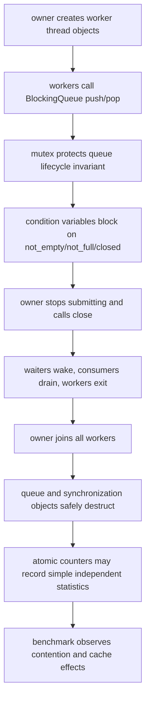
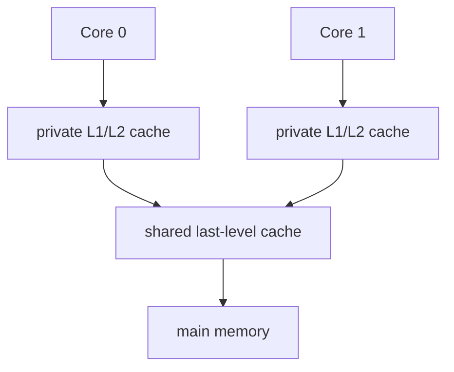

# Week7 Day7：代码没有 data race，为什么增加 threads 仍可能更慢

> 今日主线：correctness vs performance、contention、cache line、false sharing、可重复 measurement、Week7 integration。
>
> 今日类型：硬件直觉 + 性能观察 + 组件复检，不新写大型组件。
>
> 今日产出：`contention_false_sharing.cpp` 与 `day7_note.md`。
>
> 正确性编译：`g++ -std=c++17 -Wall -Wextra -g -pthread`。
>
> 性能观察编译：在保留 warnings 的前提下单独使用 `-O2`。

学习前置：Week7 Day6 已验收。提前生成不代表前六天已经完成。

今天不新增 MIT 6.S081 lecture，不深入 MESI、memory ordering 或 lock-free algorithm。

今天从一个反直觉现象出发：

```text
程序没有 data race
结果也完全正确
但从 1 thread 增加到 2/4/8 threads，elapsed time 反而变长
```

今天要建立的是测量和第一层硬件模型，不是背一个“多线程一定更快/更慢”的答案。

---

# Part 1：前情提要与必要术语

## 1. 从 Day1 和 Day6 的两个 counter 接过来

Day1：

```text
per-thread local result
-> join 后汇总
-> 尽量避免 shared writes
```

Day6：

```text
shared atomic counter
-> 每次 increment race-free
```

两者都可以正确，但 performance path 不同：

```text
shared mutex counter -> threads 竞争同一 mutex
shared atomic counter -> threads 竞争同一 cache line 上的 atomic value
per-thread local      -> 共享写更少，最后汇总
```

今天通过真实 measurement 比较，不靠想象直接宣布 winner。

---

## 2. 必要术语

### 2.1 benchmark

`benchmark`：基准测试。

它在明确环境、input 和 build options 下测量某个 workload。

benchmark 不是一次 `cout << duration` 就得到普遍结论。

---

### 2.2 elapsed time

`elapsed time`：经过时间，也常叫 wall-clock time。

从测量起点到终点实际过去多久。

今天使用 `std::chrono::steady_clock`，因为它是 monotonic clock，适合测 duration。

---

### 2.3 throughput

`throughput`：吞吐量。

```text
单位时间完成多少 operations
```

例如：

```text
increments per second
```

不要把 latency 与 throughput 混为一个指标。

---

### 2.4 contention

`contention`：竞争。

多个 threads 同时争用同一个 synchronization resource 或硬件资源。

例如：

```text
同一 mutex
同一 atomic counter
同一 cache line
同一 memory bandwidth
```

---

### 2.5 CPU core

`core`：处理器核心。

多个 threads 只有在获得不同 execution resources 时才可能真正并行；threads 数超过可用 cores 后，还会增加 scheduling 和 context switching 开销。

VM 中看到的 virtual CPUs 也受宿主机调度影响。

---

### 2.6 cache

`cache`：缓存。

CPU 使用比 main memory 更小、更快的 cache 保存近期访问的数据。

现代多核 CPU 通常有每 core 私有的部分 cache，也可能有共享的 last-level cache；具体结构依 CPU 而异。

---

### 2.7 cache line

`cache line`：缓存行。

CPU cache 与 memory 交换和维护一致性的基本块通常不是一个 C++ variable，而是一整块连续 bytes。

很多 x86-64 CPU 的 line size 是 64 bytes，但不能把 64 当语言标准保证。

Linux 可观察：

```bash
cat /sys/devices/system/cpu/cpu0/cache/index0/coherency_line_size
```

---

### 2.8 cache coherence

`coherence`：一致性。

多个 cores 各自缓存同一 memory line 时，hardware protocol 需要协调 writes，让不同 cores 对 line 的修改具有一致的可观察结果。

今天不背 MESI states，只记：

```text
一个 core 反复写某条 line
-> 其他 core 对同一 line 的缓存副本可能需要失效/重新取得
```

---

### 2.9 false sharing

`false sharing`：伪共享。

```text
Thread A 只写 variable A
Thread B 只写 variable B
A 和 B 是不同 memory locations，没有 data race
但 A/B 位于同一 cache line
-> cores 仍围绕整条 line 发生 coherence traffic
-> performance 可能下降
```

“false” 指 variables 在业务上没有真正共享同一 value，却因为 line granularity 产生类似共享争用。

---

### 2.10 alignment / padding

`alignment`：对齐。

`padding`：填充。

通过让热点 counters 分布到不同 cache lines，可以减少 false sharing；代价是使用更多 space。

今天使用 `alignas(...)` 建立实验，不把它当所有 struct 的默认优化。

---

### 2.11 measurement noise

`noise`：测量噪声。

来源包括：

```text
OS scheduling
VM host load
CPU frequency scaling
thread migration
background processes
cache warm/cold state
thermal throttling
```

所以需要多次运行、记录分布和环境。

---

### 2.12 synchronization

synchronization：协调多个 threads 对 shared state 的访问顺序和可见性，使需要互斥或依赖结果的操作不会无约束地并发交错。

---

### 2.13 CPU affinity

`affinity` 是英文，原意是“亲和性、倾向于靠近或绑定的关系”。

**CPU affinity** 就是：

```
操作系统规定某个 process / thread
允许在哪些 logical CPUs 上运行。
```

例如机器有 8 个 logical CPUs：

```
CPU 0 1 2 3 4 5 6 7
```

但某个程序的 CPU affinity 被设置成：

```
只允许 CPU 0、1、2、3
```

那么 scheduler 即使发现 CPU 4~7 空闲，也不会把这个程序调度过去。

这和刚才的 `nproc` 有关：`nproc` 往往会考虑这种限制，可能输出 `4`，而不是机器总共的 `8`。

为什么要设 affinity？

```
减少 thread 在不同 CPU core 间迁移
保持 cache 中的数据更容易被复用
隔离某个服务，避免它占满所有 CPU
容器 / 虚拟机 / 性能测试限制可用 CPU
```

---

# Part 2：教程主体

# 教程开始

## 3. correctness 与 performance 必须分开验证

正确性问题：

```text
final result 是否正确
是否 data race
是否 deadlock
是否 lost/duplicate work
是否 graceful shutdown
```

性能问题：

```text
elapsed time
throughput
scaling with thread count
contention
cache locality
```

不能用性能结果证明 correctness：

```text
racy counter 更快
```

可能只是它丢了大量 increments，实际完成的 work 更少。

也不能用 TSan timing 比较生产性能；instrumentation 会显著改变 execution。

---

## 4. shared mutex counter 的竞争链

多个 workers 每次 increment 都：

```text
lock mutex
increment
unlock mutex
```

如果 critical section 只有一个 increment：

```text
有用工作很少
同步开销相对很大
所有 workers 在同一个 serial point 排队
```

增加 threads 后，可能增加：

```text
mutex waiting
scheduler activity
cache line transfer
```

但没有增加能够并行执行的 shared increment。

这就是 contention 的一种。

---

## 5. shared atomic counter 为什么也可能竞争

atomic increment 不需要你显式写 mutex，并保证每次 RMW 正确。

但所有 cores 仍反复修改同一个 atomic object 所在 cache line：

```text
Core A wants write ownership
-> increments
Core B wants write ownership
-> line ownership/coherence state changes
-> increments
-> repeat
```

所以：

```text
lock-free or atomic
!=
contention-free
```

正确性 abstraction 与 hardware traffic 是两个层次。

---

## 6. per-thread local 为什么常更容易扩展

每个 worker 使用自己的 local counter：

```text
worker i increments local_i
```

worker 完成后：

```text
main join
-> sum all local counters once
```

共享 synchronization 从“每次 increment”降低到“最终汇总”。

这与 Day1 `parallel_sum` 是同一个设计原则：

```text
先 partition ownership
-> 批量做 local work
-> 在明确 synchronization point 合并
```

---

## 7. false sharing 的具体场景

假设 memory layout：

```text
one cache line
┌──────────┬──────────┬──────────────────────────┐
│ counter0 │ counter1 │ remaining bytes          │
└──────────┴──────────┴──────────────────────────┘
```

Thread 0 只修改 `counter0`，Thread 1 只修改 `counter1`。

C++ memory model 角度：

```text
不同 objects
-> 可以没有 data race
```

hardware cache 角度：

```text
同一 cache line
-> coherence 以整条 line 协调
-> 两个 cores 的 writes 仍相互影响
```

本地《图解系统》的示意图展示了这种 line-level 影响：


图是第一层直觉，不要求背具体 coherence state 或固定 write-back 顺序；不同 CPU implementation 的协议细节可能不同。

---

## 8. `alignas` 怎样建立对照实验

C++ `alignas` 指定 object/type alignment requirement。

受控实验可以定义：

```cpp
struct alignas(64) PaddedCounter {
    std::atomic<std::uint64_t> value{0};
};
```

目的：

```text
让相邻 PaddedCounter objects 的起点至少按 64-byte alignment 排列
增加 counters 位于不同 lines 的可能性
```

重要边界：

```text
64 是实验平台常见 line size，不是跨平台永久常量
alignment 增加不代表任何 workload 都更快
padding 会占用更多 cache/memory space
```

先用 sysfs 命令观察当前 line size，再在 note 中写明假设。

C++17 标准库还定义了 `<new>` 中的 `std::hardware_destructive_interference_size`：一个 `std::size_t` compile-time constant，表示为减少 destructive interference 而推荐的最小间隔。它不是读取当前 CPU cache line 的运行时探针，而且会影响 type layout/ABI。

标准库实现支持时可以写：

```cpp
#include <atomic>
#include <cstddef>
#include <cstdint>
#include <new>

#if defined(__cpp_lib_hardware_interference_size)
constexpr std::size_t kDestructiveSize =
    std::hardware_destructive_interference_size;
#else
constexpr std::size_t kDestructiveSize = 64;
#endif

struct alignas(kDestructiveSize) PaddedCounter {
    std::atomic<std::uint64_t> value{0};
};
```

当前 Ubuntu 使用 GCC 10.5，其 libstdc++ 很可能尚未提供这个后来才在 GCC 12 实现的常量。因此本周核心实验继续使用“sysfs 观察值 + `alignas(64)` + 地址打印”，不要为了使用一个名字更标准的常量升级工具链或中断主线。上面的 conditional snippet 只是说明 C++17 标准接口与 implementation availability 的区别，不是新增验收任务。

---

### 8.1 上面这个代码什么意思

这段代码不是“实现计数器逻辑”，而是在**为 Day7 的 false sharing 实验准备一种不容易和邻居挤在同一条 cache line 的计数器类型**。

先抓主线：

```text
如果标准库实现提供“推荐的 cache-line 隔离大小”
-> 用标准库给出的值

否则
-> 暂时假设 64 bytes

然后
-> 让每个 PaddedCounter 按这个大小对齐
```

`#if / #else / #endif` 属于**预处理阶段**，发生在真正编译 C++ 前。它不是运行时的 `if`。

```cpp
#if 条件
    // 条件成立时，保留这里
#else
    // 条件不成立时，保留这里
#endif
```

整个过程是：

```text
源文件
    |
    v
preprocessor 先判断 #if
    |
    +-- 条件成立：删除 #else 那一支
    |
    +-- 条件不成立：删除 #if 那一支
    |
    v
compiler 只看到留下来的普通 C++ 代码
```

所以这里：

```cpp
#if defined(__cpp_lib_hardware_interference_size)
```

意思是：

```text
“当前你使用的标准库有没有声明
__cpp_lib_hardware_interference_size 这个 feature-test macro？”
```

`defined(...)` 的结果只有 true/false。这个宏由标准库自己定义，用来告诉你：

```text
我实现了 std::hardware_destructive_interference_size 这个 C++17 接口。
```

不是你自己要定义的变量。名字里有双下划线，也不要自己手写定义它。

如果支持，预处理后大致会变成：

```cpp
constexpr std::size_t kDestructiveSize =
    std::hardware_destructive_interference_size;
```

如果不支持，例如当前 GCC 10 的 libstdc++，预处理后则变成：

```cpp
constexpr std::size_t kDestructiveSize = 64;
```

两边都叫 `kDestructiveSize` 不冲突，因为最终只会留下其中一边。

接着看这句：

```cpp
struct alignas(kDestructiveSize) PaddedCounter {
```

`alignas` 可以理解为“对齐要求”。

```text
alignas(64)
-> 这个 PaddedCounter object 的起始地址必须是 64 的倍数
```

这样若你有：

```cpp
PaddedCounter counters[4];
```

每个 `PaddedCounter` 都会按至少 64-byte 边界排列，通常就不会和相邻 counter 落在同一条 64-byte cache line 中，减少 false sharing。

内部成员：

```cpp
std::atomic<std::uint64_t> value{0};
```

意思是：

```text
std::uint64_t
    固定 64-bit 的无符号整数

std::atomic<...>
    多线程对 value 做 load/store/fetch_add 等操作不会产生普通 data race

{0}
    初始值为 0
```

所以这个 struct 的意义是：

```text
普通 Counter：
多个 threads 的 counters 可能挤在同一 cache line
-> 虽然各自写不同变量，但 cache line 反复失效
-> false sharing

PaddedCounter：
每个 counter 尽量隔开
-> 减少互相抢同一 cache line
```

最后，这段 conditional code 的重点不是让你背宏，而是一个很常见的工程习惯：

```text
C++ 标准规定“可以有这个接口”
!=
你当前 GCC + libstdc++ 已经实现了它
```

所以先检测能不能用；不能用就走已知的 `64` fallback。Day7 你只需理解这个分支逻辑，不需要自己专门练预处理器。

---

## 9. 为什么 adjacent atomics 是有意设计的实验

实验组：

```text
多个 atomic counters 紧邻存放
每个 worker 只 increment 自己的 counter
```

这样：

```text
没有多个 workers 修改同一个 atomic object
final result 可验证
每次 atomic RMW 不容易被 compiler 合并掉
相邻 objects 仍可能共享 line
```

对照组：

```text
每个 counter 使用 padding/alignment 分离
```

两组算法应完成相同数量 operations；只改变 memory layout 才更接近 false-sharing 对照。

---

## 10. 为什么不能只运行一次

一次结果：

```text
adjacent = 120 ms
padded   = 80 ms
```

不能直接宣布“padding 快 50%”。

至少需要：

```text
固定 input/workload
相同 compiler options
相同 worker count
多次运行
忽略或单独记录 warm-up/outlier
报告 median 或结果范围
```

VM 中 fluctuation(波动) 可能很大。真实结论可以是：

```text
当前环境没有观察到稳定差异
```

只要实验设计和限制解释正确，这比编造漂亮数字更有价值。

---

## 11. API：`std::chrono::steady_clock`

头文件：

```cpp
#include <chrono>
```

测量形状：

```cpp
const auto begin = std::chrono::steady_clock::now();

// Run the workload.

const auto end = std::chrono::steady_clock::now();
const auto elapsed =
    std::chrono::duration_cast<std::chrono::microseconds>(end - begin);
```

`steady_clock` 不会因 wall-clock 被手工调整而倒退，适合 duration measurement。

测量区间不要包含：

```text
大量 cout
随机数据生成（除非它本身是 workload）
文件 I/O
不同 variant 不一致的 setup
```

线程创建开销如果所有 variants 都包含，可以保留并明确说明；若只想测循环，应设计统一 start gate。Day7 不强制实现复杂 benchmark framework。

---

## 12. correctness build、TSan build、benchmark build 分开

### Correctness

```bash
g++ -std=c++17 -Wall -Wextra -g -pthread \
  contention_false_sharing.cpp -o contention_false_sharing
```

### TSan

```bash
g++ -std=c++17 -Wall -Wextra -g -O1 -pthread \
  -fsanitize=thread -fno-omit-frame-pointer \
  contention_false_sharing.cpp -o contention_false_sharing_tsan
```

只用它查 race，不记录 timing 排名。

运行时仍按 Day3 的 report 阅读顺序：

```bash
TSAN_OPTIONS="halt_on_error=1" ./contention_false_sharing_tsan
echo $?
```

Day7 要特别区分三种结果：

```text
TSan reports data race
    correctness 失败；先修 shared memory access，不讨论性能排名。

TSan clean，但 expected != actual
    可能是 logical race、work partition、overflow 或测试错误；TSan 不替代结果检查。

TSan clean，expected == actual，但运行较慢
    才进入 contention / false sharing / measurement 分析。
```

false sharing 本身通常不会产生 TSan report：不同 threads 可以合法修改不同 objects，只是这些 objects 恰好落在同一 cache line，引发 coherence traffic。它是 performance 问题，不是 C++ data race。

因此 Day7 的顺序必须是：

```text
correctness build 检查结果
-> TSan build 检查执行到的 memory races
-> optimized benchmark 多轮测量 timing
-> 地址/layout 与可选硬件工具支持性能解释
```

若把 TSan timing 拿去比较 shared mutex、atomic 和 local variants，结论无效。TSan 会插入大量 bookkeeping，官方文档也明确说明它会带来显著运行时间与内存开销；该 binary 的职责只是找 race。

### Optimized benchmark

```bash
g++ -std=c++17 -Wall -Wextra -g -O2 -DNDEBUG -pthread \
  contention_false_sharing.cpp -o contention_false_sharing_bench
```

三个 binaries 的目的不同，结果不能混用。

---

## 13. thread count 怎样选择

至少测试：

```text
1
2
4
当前环境允许时的 8
```

观察：

```bash
nproc
lscpu
```

`std::thread::hardware_concurrency()` 也可提供 hint：

```cpp
const unsigned int hint = std::thread::hardware_concurrency();
```

返回 0 表示 implementation 无法提供；非 0 也只是 hint，不是“最佳 worker count”。

---

### 13.1 nproc,lscpu 都是啥

它们都是 Linux 下查看 CPU 情况的命令。

```bash
nproc
```

`nproc` 可以理解为 **number of processing units**。它输出当前这个进程可用的逻辑 CPU 数，例如：

```text
4
```

表示系统允许你的程序同时在 4 个逻辑 CPU 上运行。它通常会考虑 CPU affinity、容器/cgroup 限制，所以对“我的程序现在大概能开多少 worker”比较实用。

```bash
lscpu
```

`lscpu` 是 **list CPU**，输出更完整的 CPU 拓扑和架构信息，例如：

```text
CPU(s):                8
Thread(s) per core:    2
Core(s) per socket:    4
Socket(s):             1
Model name:            ...
```

这里：

```text
Socket
    一颗物理 CPU 插槽

Core
    物理核心

Thread(s) per core
    每个物理核心提供几个逻辑 CPU
    常见 2，通常意味着超线程

CPU(s)
    操作系统看到的逻辑 CPU 总数
```

例如：

```text
1 socket
4 cores per socket
2 threads per core
```

那么 Linux 看到：

```text
1 * 4 * 2 = 8 个 logical CPUs
```

所以 Day7 让你测 `1 / 2 / 4 / 当前环境允许时的 8`，是为了让你观察 contention 随并发度变化，而不是说 8 一定是最佳线程数。

对应关系可以先这样记：

```text
nproc
    当前进程大概可用几个 logical CPUs

lscpu
    这些 logical CPUs 背后的硬件拓扑是什么

std::thread::hardware_concurrency()
    C++ 从 implementation 获得的类似 hint
```

三者都只能帮助你选实验参数；它们不等于“线程池应该固定开这么多线程”。

---

### 13.2 hint 是什么？

hint：暗示。

`:codex-annotation{index="1"}`

`hint` 就是“提示信息、参考建议”。

```cpp
std::thread::hardware_concurrency()
```

返回的不是承诺：

```text
“你必须创建这么多 threads”
```

而是 implementation 根据当前环境告诉你：

```text
“我估计这里大约有这么多个可并行执行的 hardware threads，
你可以拿它作为初始参考。”
```

例如：

```cpp
const unsigned int hint = std::thread::hardware_concurrency();
```

若返回：

```text
8
```

可以先考虑：

```text
CPU-bound 工作：从 8 个 workers 附近开始测试
```

但不代表 8 永远最好。实际 worker count 还取决于：

```text
任务是 CPU-bound 还是 I/O-bound
是否有锁竞争
是否存在 false sharing
是否还有其他程序占 CPU
容器或虚拟机是否限制了可用 CPU
```

如果返回 `0`，意思只是：

```text
当前 C++ implementation 没有办法提供这个提示
```

不是说机器没有 CPU。

---

## 14. thread migration 与 affinity

scheduler 可能让同一 thread 在不同 CPU cores 上运行。migration 会改变 cache locality 和 measurement noise。

`taskset` 可以作为可选观察：

```bash
taskset -c 0-3 ./contention_false_sharing_bench
```

但 Day7 不要求 affinity tuning，也不能因为 pinning 后某次更快就立刻推广。

---

## 15. Week7 的完整工程链



Week7 的核心不是“mutex、cv、atomic 三种写法”，而是知道它们各自在这条链中解决什么问题。

---

### 15.1 从 core 到 memory 的数据路径

先建立简化硬件图。真实 CPU 可能有更多层级与共享方式，今天只抓机制：



core 执行 load/store 时，通常希望在更近、更快的 cache 中访问数据。memory system 不是每次都直接去 RAM 读一个孤立 byte，而会以 cache line 为基本传输与 coherence 单位。

今天常用 `64 bytes` 作为实验假设，但它不是 C++ 标准保证。可以在实验报告中写：

```text
本机预期 cache line size = 64 bytes
通过 sysfs/lscpu 等观察环境
alignas(64) 用于建立本机对照
```

不要把 `alignas(64)` 说成“所有机器上都彻底消除 false sharing”的跨平台证明。

---

#### 15.1.1 shared last-level cache 是什么意思？

`shared last-level cache` 就是：**多个 CPU core 共用的、离 main memory 最近的一层 cache**。

先把名字拆开：

```text
last-level cache
    CPU 到 RAM 之间，最后一层 cache
    再往后就是 main memory

shared
    多个 core 都可以使用这一层 cache
```

在很多常见 CPU 上，它常常对应 L3 cache：

```text
Core 0: private L1 / L2
Core 1: private L1 / L2
...
多个 core: shared L3
RAM
```

也就是说，Core 0 和 Core 1 各自有自己的 L1/L2；但它们再往外一层，可能连接到同一个 L3。

```text
Core 0 的 L1/L2 miss
-> 去 shared L3 找

Core 1 的 L1/L2 miss
-> 也去同一个 shared L3 找

L3 也 miss
-> 再去 RAM
```

“shared”不表示两个 core 的 private cache 自动变成同一个东西。比如同一个 cache line：

```text
Core 0 的 L1：可能有一份副本
Core 1 的 L1：也可能有一份副本
shared L3：也管理/保存相关数据
```

当 Core 0、Core 1 都在读时，这没问题；但某个 core 要写这一条 line 时，cache coherence 会让其他 core 的旧副本失效或交出修改权限。

所以 false sharing 的痛点仍主要发生在：

```text
Core 0 写自己的变量
Core 1 写自己的变量
但两个变量在同一 cache line
-> 两边 private cache 中那一整条 line 反复失效、转移写权限
```

即使底下有 shared L3，也不能消除这种“写同一条 cache line 的所有权来回跑”的成本。

你可以暂时把层级记成：

```text
private L1/L2
    最靠近某个 core，最快

shared last-level cache（常见是 L3）
    多个 core 的较大共享缓冲层

main memory / RAM
    更大、更慢
```

“last-level”说的是**cache hierarchy 的最后一级**，不是“最后一次访问”。

---

### 15.2 false sharing 的 ownership ping-pong 全流程

假设两个 atomics 紧邻：

```text
cache line L: [counter_A][counter_B][other bytes ...]
Core 0 repeatedly writes counter_A
Core 1 repeatedly writes counter_B
```

虽然程序层面两个 threads 没有写同一个 C++ object，但 coherence 以 line L 为单位。一个简化过程是：

```text
1. Core 0 获得 line L 的可写 ownership
2. Core 0 更新 counter_A
3. Core 1 想更新 counter_B，也需要 line L 的可写 ownership
4. coherence protocol 让 Core 0 的对应 line copy 失去可写状态
5. Core 1 获得 line L，更新 counter_B
6. Core 0 下一次更新 counter_A，又要把 line L 拿回来
7. 两个 cores 反复转移同一 line 的 ownership
```

真正来回移动的是 cache-line coherence ownership，不是两个 source-level variables 互相覆盖。结果仍然可以完全正确，但大量 coherence traffic 降低 throughput。

把两个 counters 分到不同 lines 后：

```text
Core 0 mostly owns line A
Core 1 mostly owns line B
```

它们就不再因为写不同 counters 而不断争夺同一 line。这就是 padded layout 可能更快的因果链。

### 15.2.1 必看 ownership 是什么？

你这个理解已经碰到关键了：**Core 0 最终确实是写自己 cache 里的 Line L；但它不是任何时候都“想写就写”。**

这里的 `ownership` 不是 C++ 的对象所有权，而是 cache coherence 协议里的：

```text
“当前哪个 core 有权把这一整条 cache line 当作可写版本修改？”
```

简化成两种权限就够了：

```text
Shared：可以读，但不能直接写
Writable / ownership：可以读写
```

同一时刻，一条 line 可以被多个 core 读；但通常只能有一个 core 持有可写权限。否则：

```text
Core 0 把 counter_A 写成 1
Core 1 同时把 counter_B 写成 2
```

两个 core 各自都拥有 Line L 的可写副本，硬件就很难定义这一整条 line 的“最新版本”。

所以真实过程更像：

```text
开始：
Core 0 cache: Line L，只有读权限
Core 1 cache: Line L，只有读权限

Core 0 想写 counter_A：
-> 先向 coherence protocol 请求 Line L 的写权限
-> Core 1 的 Line L 被 invalid
-> Core 0 获得 Line L 的可写 ownership
-> Core 0 才在本地 cache 修改 counter_A
```

此时你说得对：Core 0 后续只要没人来抢 Line L，它可以一直在自己的 cache 里本地写，不需要每次都访问内存。

问题是 Core 1 也在高频写 `counter_B`：

```text
Core 1 想写 counter_B
-> 它发现自己的 Line L 已 invalid，不能直接写
-> 它请求 Line L 的写权限
-> Core 0 的 Line L 失去可写权限，通常变 invalid
-> Core 1 获得可写 ownership
-> Core 1 才能在本地写 counter_B
```

然后 Core 0 下一次写又得把 Line L 抢回来。

```text
Core 0 owns writable Line L
-> Core 1 requests writable Line L
-> Core 1 owns writable Line L
-> Core 0 requests it back
-> Core 0 owns it again
```

这就是 ping-pong。

所以更准确地说：

```text
“写完导致 Core 1 invalid”
```

确实会发生；而 `ownership` 讲的是更前一步：

```text
Core 0 为了能写，必须先让其他 core 的同一条 line
不再保持可用的竞争副本，
自己获得这一条 line 的独占写权限。
```

padded layout 的好处是：

```text
Core 0 写 counter_A -> 只需要 line A 的写权限
Core 1 写 counter_B -> 只需要 line B 的写权限
```

两边各自长期保留自己的 line，不会因为对方写“另一个变量”而被 invalid。程序结果本来就都对，差别只是高频写时少了这堆硬件协调交通。

---

### 15.3 true sharing、false sharing 与 no sharing

| Situation | Source-level object | Cache-line relation | Correctness tool | Main performance issue |
|---|---|---|---|---|
| true sharing | threads 操作同一个 counter | same line | atomic/mutex | serialization + coherence |
| false sharing | threads 操作不同 counters | accidentally same line | 已可 race-free | coherence ping-pong |
| no sharing/local | each thread owns its own counter | preferably separate lines or registers | join 后汇总 | final reduction cost |

`false` 的意思不是“性能问题是假的”，而是 source code 看起来没有共享同一个 variable，hardware 却因为同一 cache line 产生了共享效果。

另一个边界：两个 read-only variables 在同一 cache line 通常不构成 false sharing，因为没有 cores 反复争夺 write ownership。核心触发条件是不同 cores 对同一 line 的并发写，或读写导致的 coherence invalidation。

---

### 15.4 怎样确认实验对象真的相邻或被分开

不能只写 class 名字叫 `PaddedCounter` 就宣称布局成立。实验可以打印：

```text
sizeof(counter type)
alignof(counter type)
address of counters[i]
address % assumed_cache_line_size
相邻 addresses 的差值
```

独立观察例子：

```cpp
const auto address = reinterpret_cast<std::uintptr_t>(&counters[i]);
std::cout << "address=" << address
          << " line_offset=" << address % 64 << '\n';
```

需要头文件：

```cpp
#include <cstdint>
```

`reinterpret_cast<std::uintptr_t>` 在这里用于把 object address 转成足以保存 pointer 数值表示的 unsigned integer，方便做打印与 `% 64` 观察；它不是在访问该地址对应的数据，也不是把 virtual address 手工翻译成 physical address。

对于：

```cpp
struct alignas(64) PaddedCounter {
    std::atomic<long long> value{0};
};
```

`alignas(64)` 要求每个 object 的起始地址满足至少 64-byte alignment。array 中每个 element 还要满足其类型 alignment，所以 `sizeof(PaddedCounter)` 通常也会包含必要 padding。最终仍以本机打印和 measurement 为证据。

---

### 15.5 benchmark 怎样减少“刚好这次”的影响

最低限度的方法：

```text
1. correctness build 先验证 result
2. optimized build 才计时
3. 每个 variant 运行多轮
4. 不只报告最快一次
5. 记录 input size、thread count、build flags 和 VM 环境
```

可以使用 median：把多轮 elapsed times 排序，取中间值。median 比单次结果更不容易被一次偶发调度延迟拖走。

还要防止固定测试顺序偏向某个 variant。若永远：

```text
mutex -> atomic -> local -> adjacent -> padded
```

后面的 case 可能受 CPU frequency、cache warm-up 或系统负载变化影响。至少做两件事之一：

```text
轮换/随机化 variant 顺序
整组重复多次并报告分布
```

warm-up 可以先运行一次不计入结果，让 dynamic linking、page faults 与初次 allocation 的影响不全压在第一组上。但 warm-up 不能消除 scheduler、VM steal time 或 frequency scaling。

---

### 15.6 防止 benchmark 测到被优化掉的工作

若计算结果从未被观察，optimized compiler 可能删除部分甚至全部 work。每个 variant 都应产生一个可验证 result，例如：

```text
expected total = thread_count * increments_per_thread
measured result == expected total
```

把 result 打印或传给一个不会被优化消失的验证步骤。不要把每次 increment 都打印；I/O 会完全淹没你要测的 synchronization cost。

计时边界也要一致：

```text
start
-> create/start workers
-> perform increments
-> join workers
stop
```

或者事先创建 threads，只测 operation body。两种都可以，但不能一个 variant 包含 thread creation，另一个不包含。Day7 建议所有 variants 统一包含 create + join，因为代码更容易保持公平并解释。

---

### 15.7 `steady_clock` 的最小计时框架

接口所在头文件：

```cpp
#include <chrono>
```

独立最小例子：

```cpp
const auto start = std::chrono::steady_clock::now();

run_work();

const auto stop = std::chrono::steady_clock::now();
const auto elapsed =
    std::chrono::duration_cast<std::chrono::microseconds>(stop - start);

std::cout << elapsed.count() << " us\n";
```

`steady_clock` 的关键性质是 monotonic：它用于测 duration，不会因为 wall clock 被人工调整而倒退。`duration_cast` 把 clock 的原生 duration 转换成你要报告的 unit。

若一次 work 只有几微秒，measurement overhead 与 noise 可能占比很大。应增加每轮 iterations，使单轮持续时间足够长，而不是迷信纳秒单位会自动提高可信度。

---

### 15.8 结果能支持多强的结论

假设在当前 VM 上得到：

```text
4 threads, 10 million increments each
adjacent atomics median: 420 ms
padded atomics median:   190 ms
```

可写：

```text
在本机、当前 build flags、thread count 与 workload 下，
padded layout consistently outperformed adjacent layout；
地址观察与 cache-line coherence 机制支持 false sharing 是主要解释。
```

不要直接写：

```text
padding 永远快 2.2 倍
atomic 一定比 mutex 快
我的 CPU cache line 在所有环境都必然是 64 bytes
```

若两组接近，也不等于 false sharing 不存在。可能原因包括：

```text
threads 没有长期运行在不同 physical cores
VM scheduling noise 较大
workload 太短
objects 实际布局与假设不同
CPU/coherence implementation 差异
```

先报告观察，再给机制解释，最后标出 evidence boundary。这是 AI Infra 做 performance engineering 时比“背结论”更重要的习惯。

---

# Part 3：收尾、练习、测试与验收

## 16. 今日产出：`contention_false_sharing.cpp`

### 16.1 程序是干什么的

实现一个小型 benchmark harness，在相同 total increments 下比较：

```text
Variant A：shared mutex-protected counter
Variant B：per-thread local counters，join 后汇总
Variant C：adjacent per-thread atomic counters
Variant D：padded/aligned per-thread atomic counters
```

输入：

```text
worker count
iterations per worker
repeat count
```

输出：

```text
variant name
final total / expected total
每次 elapsed time
简单 median 或范围
PASS / FAIL
```

正常结束：

```text
每个 variant 创建 workers
workers 完成相同数量 operations
main join
验证 total
记录 duration
进入下一次 repeat
```

不实现：

```text
专业 benchmark framework
CPU performance counter parser
MESI simulator
lock-free queue
```

---

### 16.2 公平比较要求

```text
相同 worker count
相同 iterations per worker
相同 expected total
相同 build binary/configuration
measurement interval 尽量一致
measurement 内不大量输出
每个 variant 多次运行
```

Variant B 最终汇总的少量 additions 与其他 variant 的每次 shared synchronization 不同，这正是 algorithm design 差异；报告中应明确，而不是称为纯粹 mutex-vs-atomic 微基准。

Variant C/D 才是更接近 false-sharing 的 memory-layout 对照。

---

### 16.3 repeat_count 啥意思

`repeat count` 是指：**同一个 Variant 用同样的 workload 重复测多次**，不是把 A、B、C、D 整套 benchmark 重复后只保留一个结果。

你可以把 `testA` 设计成内部循环 `repeat_count` 次，但每次都要：

```text
重新创建/清零本次 counter
-> start timer
-> 创建 workers 并完成固定 increments
-> join
-> stop timer
-> 检查 final_total == worker_count * iterations
-> 保存这一次 elapsed time
```

关键点：每次 repeat 的 `expected total` 都是：

```text
worker_count * iterations
```

不是再乘 `repeat_count`，因为每次测量应是独立的一轮。

输出上，**不要在计时区间里 `cout`**，它会污染 benchmark。推荐在 `testA` 结束后统一打印：

```text
Variant A
repeat 1: 12.3 ms, PASS
repeat 2: 11.8 ms, PASS
repeat 3: 12.0 ms, PASS
median: 12.0 ms
range: 11.8 ~ 12.3 ms
```

也就是说：每次 repeat 的时间都要记录；是否逐行打印由你决定，但 Day7 要求“每次 elapsed time + median/range”，所以最终最好都展示出来。

---

## 17. fixed tests

### Correctness

```text
workers=1, iterations=0
workers=1, iterations=100000
workers=2, iterations=1000000
workers=4, iterations=1000000
```

每个 variant：

```text
final total == workers * iterations
all workers joined
```

### Measurement

```text
至少 5 次 repeats
记录当前 CPU/VM 信息
记录 cache line size
记录 compiler command
```

如果 total 可能溢出，使用 `std::uint64_t` 并提前验证 multiplication 边界。

---

## 18. BlockingQueue 最终复检

Day7 不重写 queue，但 Week7 出口前重新运行 Day5 tests：

```text
normal MPMC
capacity=1
close empty
close full
close with remaining data
multiple blocked consumers
repeated close
push after close
100 次压力运行
TSan
```

复检只运行和记录证据，不复制新的 queue source。

---

## 19. 性能结果应该怎样写

推荐表格：

```text
Environment:
    VM / CPU hint:
    nproc:
    cache line size:
    compiler:
    build flags:

Workload:
    workers:
    iterations per worker:
    repeats:

Results:
    shared mutex:
    per-thread local:
    adjacent atomics:
    padded atomics:

Interpretation:
    stable trend:
    noise/outliers:
    what this experiment cannot prove:
```

不要写：

```text
atomic 一定比 mutex 快
padding 一定提升 X%
threads 越多越快
```

除非你的数据和适用范围真的支持，并且仍应限定到当前 workload/environment。

---

## 20. 可选工具，不阻塞 Day7

```bash
/usr/bin/time -v ./contention_false_sharing_bench
perf stat ./contention_false_sharing_bench
taskset -c 0-3 ./contention_false_sharing_bench
```

工具目的：

```text
time -> wall time、CPU time、context switches 等概览
perf stat -> 可选 hardware/software counters
taskset -> 限制 CPU set，减少部分调度变化
```

环境没有 `perf` 或权限不足时，不安装、不折腾，保留 `chrono` results 即可。

证据边界要再收紧一层：普通 `perf stat` 可以展示 cycles、cache misses、context switches 等汇总，但通常不能单独指出“正是这两个 fields 共享某条 cache line”。在受支持的 bare-metal Linux 上，`perf c2c` 可以进一步定位发生 cache-to-cache contention 的 lines；Intel VTune 的 Memory Access/False Sharing analysis 也能提供更强证据。它们都只作为未来性能分析工具入口，不是 Week7 安装任务，VM 中不可用也不影响通过。

本节资料核对入口：

```text
Linux kernel documentation: False Sharing
Intel VTune Profiler Cookbook: False Sharing
WG21 P1119R0: hardware destructive/constructive interference size 的 ABI 边界
```

---

## 21. Week7 核心验收问题

1. thread object、execution flow 和 task 的职责区别是什么？
2. 为什么所有 joinable workers 必须在 owner 退出前处理？
3. mutex 保护 shared invariant 是什么意思？
4. bounded queue 的 `not_empty/not_full` 分别由谁等待、由谁改变？
5. `close()` 为什么改变 producer 和 consumer 两边的 wait predicate？
6. closed with data 与 closed empty 的 `pop()` 结果为什么不同？
7. 为什么 queue owner 必须执行 close -> drain/worker exit -> join -> destroy？
8. atomic RMW 与 atomic load+store 的区别是什么？
9. CAS failure 为什么会修改 expected？
10. atomic 为什么不能自动维护 BlockingQueue 的复合 invariant？
11. false sharing 为什么可以没有 data race，却降低 performance？
12. shared mutex、shared atomic、per-thread local 三种 counter 的 contention path 分别是什么？
13. 为什么 TSan build 的 timing 不能作为 benchmark 结果？
14. 为什么一次运行不能证明 padding 的普遍收益？

---

## 22. Week7 完成标准

核心通过：

```text
parallel_sum 正确划分 work/result ownership
shared_invariant 能解释并维护复合 invariant
producer-consumer 正确使用 not_empty/not_full
独立实现 bounded BlockingQueue<T>
BlockingQueue close/drain/shutdown tests 通过
all threads join before dependent objects destruct
atomic counter 和 cas_max 与 trusted result 一致
能解释 atomic 与 mutex 的适用边界
能完成 contention/false-sharing observation 并诚实描述噪声
核心正确版本 warning clean，TSan 基本检查通过
```

不因以下内容阻塞：

```text
没有 lock-free queue
没有 acquire/release
没有 perf
false sharing 差异不稳定
没有提前写 ThreadPool
```

---

## 23. 推荐的 `day7_note.md` 结构

```markdown
# Week7 Day7 Note

## 1. correctness 与 performance 的证据区别

## 2. mutex / atomic / per-thread local 的 contention path

## 3. cache line 与 false sharing

## 4. benchmark environment 与方法

## 5. 真实结果、噪声和结论边界

## 6. BlockingQueue 最终复检

## 7. Week7 核心验收回答
```

---

## 24. 与 Week8 的连接

Week8 ThreadPool 将直接复用：

```text
worker lifecycle
BlockingQueue<Task>
close/drain
worker loop exit
join
atomic statistics（仅简单独立指标）
contention measurement discipline
```

Week8 才新增：

```text
task abstraction
future / packaged_task
ThreadPool V1
AsyncLogger V1
```

---

## 25. 今日压缩记忆

```text
race-free 只说明正确性底线，不说明 scalability。

mutex 会有 lock contention；
shared atomic 仍可能争用同一 cache line；
per-thread local + join 后汇总常能减少共享写。

false sharing 是不同 variables 落在同一 cache line 后产生的性能干扰，
不是 data race。

性能结论必须限定 workload、build、hardware 和多次 measurement。
```
