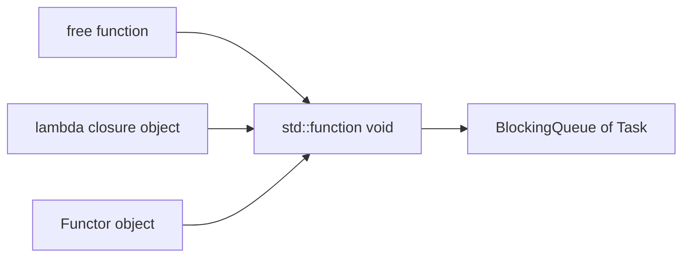
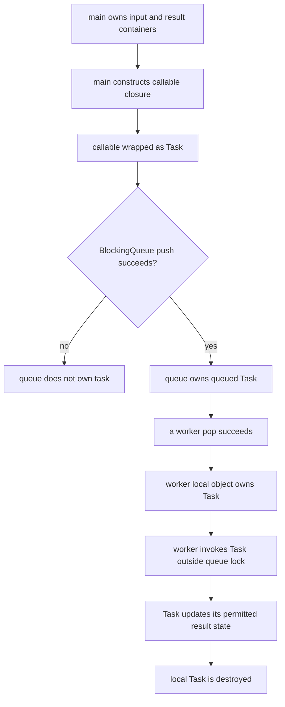
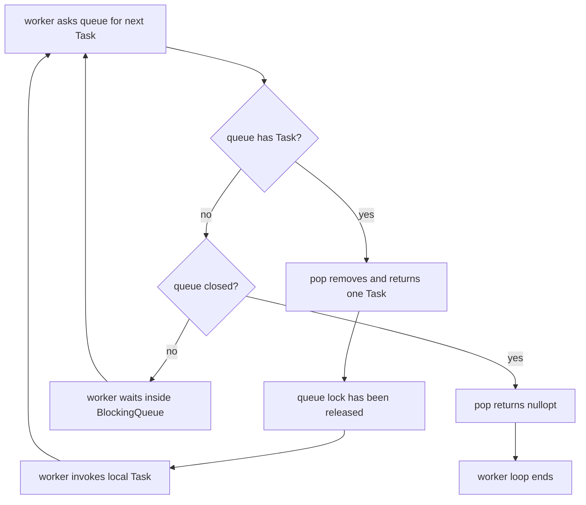
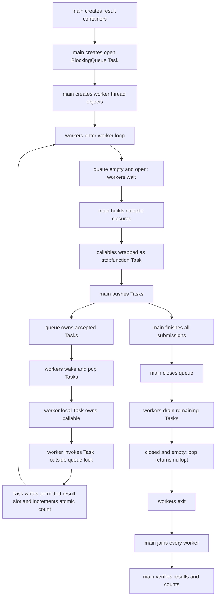

# Week8 Day1：queue 里放的 task 到底是什么

> 今日定位：从 Week7 的“queue 里放数据”，走到 Week8 的“queue 里放将来要执行的 work”。
>
> 今日产出：独立实现 `task_dispatch_demo.cpp`，验证 `callable -> task object -> BlockingQueue -> worker -> result` 的完整生命周期。
> 今日不是 ThreadPool 完成日：先把 task abstraction 和 worker loop 的职责看清，Day2 再封装 `ThreadPool`。

---

# Part 1：前情提要与必要术语

## 1. 从 Week7 接到 Week8

Week7 已经完成：

```text
std::thread lifecycle
mutex 保护 shared invariant
condition_variable + predicate
bounded BlockingQueue<T>
OPEN / CLOSED_WITH_DATA / CLOSED_EMPTY
close -> drain -> worker exit -> owner join
atomic / CAS / TSan / benchmark 第一层
```

你现在已有的 `BlockingQueue<T>` 可以保存普通 values：

```cpp
BlockingQueue<int> queue(4);
```

Week8 的第一个变化只是：

```text
以前 T 是 int

现在 T 是“一项将来可以执行的 work”
```

如果不同 work 都能被包装成同一种 C++ type，那么已有的 BlockingQueue 就能继续负责：

```text
bounded capacity
blocking push/pop
producer-consumer handoff
close
drain
closed-and-empty termination
```

因此今天不是重写 BlockingQueue，而是回答：

```text
“一段将来才执行的代码，怎样先变成一个可以放进 queue 的 object？”
```

---

## 2. 今日最终程序是干什么的

`task_dispatch_demo.cpp` 是一个 **task 分发实验**。

它从启动到退出的完整行为是：

```text
main 创建一个 task queue
-> main 创建固定数量 workers
-> workers 暂时没有 task，于是等待
-> main 创建多项不同 work，并把它们包装成统一 task type
-> main 把 tasks push 到 queue
-> workers 分别 pop tasks
-> workers 在 queue 外执行 tasks
-> main 提交结束后 close queue
-> workers 继续 drain 已经接受的 tasks
-> queue closed-and-empty 后，workers 退出
-> main join 所有 workers
-> main 检查每项结果和执行数量
-> PASS 返回 0，FAIL 返回非 0
```

输入来自程序中的固定参数：

```text
worker_count
queue_capacity
task_count
```

输出不是依赖多线程 `cout` 顺序，而是一份最终可验证结果：

```text
accepted task count
executed task count
每个 task 对应的 result
PASS / FAIL
```

今天明确不实现：

```text
ThreadPool class
generic submit template
return value future
packaged_task
task cancellation
dynamic worker count
benchmark
```

---

## 3. 必要术语

### 3.1 callable

`callable` 来自 `call`，可理解为“可调用对象”。

在 C++ 中，只要某个东西可以写成类似：

```cpp
object();
```

它在当前语境中就可以被称为 callable。

常见 callable：

```text
free function：普通自由函数
lambda expression 产生的 closure object
function object / functor：定义了 operator() 的 class object
std::function object
```

`callable` 描述的是“能否被调用”，它不是 thread，也不代表已经开始执行。

---

### 3.2 task

`task`：任务、一项工作。

今天的 task 是：

```text
已经被包装成统一接口、准备将来由某个 worker 调用的 callable object
```

task 有自己的生命周期：

```text
被 main 构造
-> 被 push 进 queue
-> 暂时由 queue 保存
-> 被某个 worker pop
-> 由该 worker 调用
-> 调用结束后销毁
```

task 不是：

```text
worker thread
OS scheduling entity
queue 本身
future
```

一项 task 在 queue 中等待时，还没有在 CPU 上执行。

---

### 3.3 dispatch

`dispatch`：分派、派发。

今天表示：

```text
submitter 把 task 交给 queue，
将来由某个可用 worker 取走并执行。
```

它不保证某个具体 worker，也不保证 tasks 按完成顺序排列。

---

### 3.4 submitter

`submit`：提交。

`submitter` 就是提交 task 的 execution flow。今天主要是 `main thread`。

submitter 负责：

```text
准备 callable 所需的数据
构造 task object
尝试把 task 交给 queue
处理 push 成功或失败
```

submitter 不负责决定最后由哪个 worker 执行。

---

### 3.5 worker

`worker`：工作者。

今天每个 worker 是一个长期存在的 execution flow：

```text
等待 task
-> 取得 task
-> 执行 task
-> 再次等待
```

worker 是一种角色；`std::thread` object 是 C++ 中管理对应 execution flow 的 object。两者不要直接画等号。

---

### 3.6 worker loop

`loop`：循环。

`worker loop` 是 worker 重复执行的控制流程：

```text
从 queue 获取 work
-> 有 work 就执行
-> queue 已 closed-and-empty 就退出
```

今天要由你独立把这个状态流程翻译成 C++，教程不会提前给出完整 worker-loop 实现。

---

### 3.7 task queue

`task queue`：任务队列。

它保存的是：

```text
已经 accepted、但还没有被 worker 取走的 task objects
```

它不保存：

```text
正在执行的 task
worker 的 call stack
task 的最终 future result
```

worker 一旦成功 pop，task ownership 就从 queue 转移到 worker 的局部对象。

---

### 3.8 type erasure

`type erasure`：类型擦除。

这里的“擦除”不是把 object 删除，也不是丢掉运行行为。它表示：

```text
外层只通过一个统一 interface 使用 object，
不再要求使用者在类型上写出内部 callable 的具体 class type。
```

例如下面三个 callable 的具体 types 不一样：

```text
free function pointer
某个 lambda closure type
某个 Functor class
```

但都可以包装成：

```cpp
std::function<void()>
```

queue 因此只需要知道一种 element type。

---

### 3.9 closure 与 capture

`closure`：闭包对象。lambda expression 在运行时产生的 object。

`capture`：捕获。lambda 把外部变量保存为 value，或保存对外部对象的 reference。

```cpp
int value = 7;

auto by_value = [value]() {
    // closure object 内部保存 value 的一份副本
};

auto by_reference = [&value]() {
    // closure object 内部保存访问原 value 的引用关系
};
```

异步 task 最大的风险不是 lambda 语法本身，而是：

```text
task 可能在原作用域结束以后才执行。
```

所以 reference capture 必须证明被引用对象一直活到 task 执行结束。

---

### 3.9.1 lambda capture 闭包对象空间

也就是这个 lambda capture 的东西如果是按值的话会保存到闭包对象的空间里？这样被调用的时候就能获取到。

对，完全是这个意思。

```cpp
int i = 3;

auto task = [i]() {
    std::cout << i << '\n';
};
```

概念上 compiler 会生成一个类似这样的 closure class：

```cpp
class GeneratedClosure {
public:
    int saved_i;  // 保存按值捕获的副本

    void operator()() const {
        std::cout << saved_i << '\n';
    }
};
```

然后：

```cpp
auto task = [i]() { /* ... */ };
```

概念上类似：

```cpp
GeneratedClosure task{i};
```

所以之后即使外面的 `i` 改了，甚至离开作用域了：

```cpp
i = 100;
```

task 内部仍然保存最初捕获时那份 `3`。

在今天的链路中，这个 closure object 会继续被包装、复制或移动：

```text
lambda closure
-> std::function<void()> Task
-> BlockingQueue<Task>
-> worker pop 出 Task
-> worker 调用 task()
```

只要这条链上的 Task 还活着，按值捕获的那份数据也跟着活着；worker 调用 `task()` 时，读取的是 closure 自己保存的成员。

对比：

```cpp
[i]   // closure 保存 i 的副本
[&i]  // closure 保存“访问外部 i”的引用关系
```

后者没有保存 `i` 本身，所以外部 `i` 死亡后，task 再调用就可能出问题。

---

### 3.10 exactly once

`exactly once`：恰好一次。

今天的最小正确性目标是：

```text
每个 accepted task
既不能 missing
也不能 duplicated
必须恰好执行一次
```

只看最终总和可能让错误互相抵消，因此还要检查每项 task 的独立 result。

---

### 3.11 decltype

`decltype` 是 **declared type** 的缩写，可以理解为“声明类型”。

它让编译器根据一个表达式推导出其类型，常用于模板和泛型代码。例如：

```cpp
int x = 3;
decltype(x) y = 4;  // y 的类型也是 int
```

它和 `auto` 都能推导类型，但方向相反：

```cpp
auto a = x;        // 根据右侧 x，推导左侧 a 的类型
decltype(x) b = 1; // 根据 x 的类型，声明 b 的类型
```

在你 Day1 的语境里，不同 lambda 的 `decltype(first)`、`decltype(second)` 往往不同，因为每个 lambda expression 都有独立的 closure type。

---

### 3.12 同步/异步 task

这里的“异步 task”就是：

```text
main 现在把一项 work 交出去，
但不自己立刻执行完、也不等它执行完；
它会在之后由 worker 执行。
```

对比一下就很清楚。

同步：

```cpp
int result = square(i);  // main 在这里执行，并等它返回
```

流程是：

```text
main 调用 square(i)
-> square 执行
-> 得到结果
-> main 才继续下一行
```

异步 task：

```text
main 把“将来计算 i 的平方”包装成 task
-> push 到 queue
-> main 可以继续提交下一个 task
-> 某个 worker 将来取到它并执行
```

时间线可能是：

```text
main:    i=0 -> 提交 task0 -> i=1 -> 提交 task1 -> 循环结束
worker:                    过一会儿才执行 task0
```

所以若 task 写成按引用捕获：

```cpp
[&i]() {
    // 将来才读取 i
}
```

它引用的是循环中那**同一个** `i`。等 worker 真执行时，`i` 可能已经变成最终值，甚至循环已经结束、`i` 已被销毁了。

而按值捕获：

```cpp
[i]() {
    // closure 内保存“这一次 i 的副本”
}
```

则 task0 保存 `0`，task1 保存 `1`，各自互不影响。

再压缩一句：

```text
异步 = 提交和实际执行不在同一时刻完成。
```

它不一定意味着多个 CPU 同时运行；即使只有一个 worker、只是“晚一点执行”，也是异步。

---

# Part 2：教程主体

# 教程开始：worker 不可能提前知道将来要调用哪个函数

## 4. 先从具体问题出发

假设我们直接创建 workers：

```text
Worker 0
Worker 1
Worker 2
```

workers 创建时，未来的任务可能还没有出现：

```text
task A：计算一个平方
task B：修改一个结果 slot
task C：调用一个 functor
task D：执行一个 lambda
```

这些 callable 的具体 C++ types 可能完全不同。

如果 worker 的函数写死为：

```text
只会 square(int)
```

它就不能处理其他 work。

如果为每种 work 各写一套 queue：

```text
queue<FunctionPointer>
queue<LambdaTypeA>
queue<FunctorB>
```

worker 又无法只通过一条统一流程取任务。

因此第一个设计需求是：

```text
让不同 concrete callable types
在 queue 外面先被包装成同一种 task type。
```

今天选择：

```cpp
using Task = std::function<void()>;
```

读法：

```text
Task 是一个可以用 task() 调用的 object；
调用时不传参数；
当前接口不向调用者返回结果。
```

---

## 5. 为什么不同 callable 不能直接放进同一个普通 container

每个 lambda expression 都会产生一个由 compiler 创建的独立 closure type。

即使它们看起来都能 `()`：

```cpp
auto first = []() { /* work A */ };
auto second = []() { /* work B */ };
```

也不能假设：

```text
decltype(first) == decltype(second)
```

普通 `std::queue<T>` 或 `BlockingQueue<T>` 在 compile time 需要一个确定的 `T`。

也就是说，问题不是这些 lambda 不能运行，而是：

```text
container 的 element type 必须统一，
而不同 callable 的 concrete types 不统一。
```

`std::function<void()>` 在外层提供统一 type，内部保存具体 callable 并记住怎样调用它。

关系是：



图中的“统一”只发生在外部 interface：

```text
worker 只需要执行 task()
```

不同 callable 原本的行为仍然保存在 wrapper 内部。

---

## 6. `std::function<void()>` 到底是什么

### 6.1 所属头文件

```cpp
#include <functional>
```

### 6.2 当前需要认识的形式

标准库模板的抽象形式：

```cpp
template<class Signature>
class function;
```

今天使用：

```cpp
std::function<void()>
```

拆开：

```text
void：调用后的 return type
()：调用时的 argument list 为空
```

常用操作：

```cpp
std::function<void()> task = []() {};

if (task) {
    task();
}
```

这里：

```text
构造/赋值：wrapper 保存 callable
operator bool：检查 wrapper 当前是否保存 callable
operator()：调用内部保存的 callable
```

空的 `std::function` 被直接调用会抛出 `std::bad_function_call`。今天不向 queue 提交 empty task。

### 6.3 一个独立最小例子

下面代码只演示 `std::function`，不是今天练习的 worker loop：

```cpp
/*
目标：证明三种不同 callable 可以被包装成同一种 std::function<void()>，
然后通过统一的 task() 语法调用。
*/
#include <functional>
#include <iostream>

void free_function() {
    std::cout << "free function\n";
}

struct Functor {
    void operator()() const {
        std::cout << "functor\n";
    }
};

int main() {
    const int value = 7;

    std::function<void()> first = free_function;
    std::function<void()> second = Functor{};
    std::function<void()> third = [value]() {
        std::cout << "lambda value=" << value << '\n';
    };

    first();
    second();
    third();
    return 0;
}
```

编译运行：

```bash
g++ -std=c++17 -Wall -Wextra -g function_api_demo.cpp -o function_api_demo
./function_api_demo
```

预期：

```text
free function
functor
lambda value=7
```

这个例子证明：

```text
wrapper interface 相同
!=
内部 callable 行为相同
```

---

### 6.4 独立例子注解以及 operator()

`wrapper` 可以直译成“包装器”。这里 `std::function<void()>` 的意思是：

```text
它在外面提供统一的 task() 接口，
里面保存某个具体 callable。
```

所以它把原本类型不同的 free function、lambda、Functor “包起来”，worker 不必知道内部到底是哪一种，只要统一写：

```cpp
task();
```

就行。

这句实际发生的是：

```cpp
std::function<void()> second = Functor{};
```

```text
Functor{}                    创建一个临时 Functor object
-> std::function<void()>     把这个 object 保存/包装起来
-> second                    成为统一的 Task wrapper
```

之后：

```cpp
second();
```

逻辑上等价于：

```text
std::function 的 operator() 被调用
-> 它转而调用内部保存的 Functor object
-> Functor::operator()() 被调用
```

---

`Functor` 这个 struct 的关键是：

```cpp
struct Functor {
    void operator()() const {
        std::cout << "functor\n";
    }
};
```

`operator()` 是 C++ 的“函数调用运算符重载”。

普通 object 原本不能这样调用：

```cpp
Functor f;
f();  // 为什么 class object 也能像函数一样调用？
```

因为你定义了：

```cpp
void operator()() const
```

编译器会把：

```cpp
f();
```

理解为：

```cpp
f.operator()();
```

拆开看：

```cpp
operator()  // 函数名：重载“调用对象()”这个运算符
()          // 这个成员函数自己的参数列表：这里没有参数
void        // 调用后不返回值
const       // 调用它不会修改这个 Functor object
```

因此这两段代码的效果相同：

```cpp
Functor f;
f();
```

```cpp
Functor f;
f.operator()();
```

`Functor{}` 则只是“构造一个没有成员数据的临时 `Functor` object”。它还没被 `std::function` 包装前，也可以直接调用：

```cpp
Functor{}();
```

输出：

```text
functor
```

所以今天可以先这样记：

```text
Functor：一个通过 operator() 伪装成函数的 class object
std::function：一个能统一包装不同 callable 的外层 object
second()：调用 wrapper
-> wrapper 再调用里面的 Functor::operator()()
```

---

### 6.5 complier 会为 operator 做些什么？

对，作为直觉可以这样理解。

如果 `Node` 里定义的是成员运算符：

```cpp
class Node {
public:
    int operator+(const Node& rhs) const;
};
```

那么：

```cpp
Node f;
Node g;

f + g;
```

会经过运算符重载解析，调用效果等价于：

```cpp
f.operator+(g);
```

这里：

```cpp
operator+              // 函数名：重载二元 +
const Node& rhs        // 右操作数 g
const                  // 允许 const Node 也参与 f + g
```

而 `f` 是左操作数，它隐含为成员函数的 `this`。

不过这不是简单的“文本替换”。编译器会先做**运算符重载解析**：检查有哪些可用的 `operator+`，再按类型、`const`、引用等规则选最匹配的版本。

还有另一种常见写法：把 `operator+` 写成非成员函数。

```cpp
Node operator+(const Node& lhs, const Node& rhs);
```

这时：

```cpp
f + g;
```

效果等价于：

```cpp
operator+(f, g);
```

所以可以先记：

```text
成员 operator+：
f + g  ->  f.operator+(g)

非成员 operator+：
f + g  ->  operator+(f, g)

成员 operator()：
f()    ->  f.operator()()
```

`operator()` 比较特殊，它只能是非静态成员函数，因此 `f()` 只能对应 `f.operator()()`。

---

### 6.6 什么是非静态成员函数

基本理解对，但补一个很重要的修正：**每个 object 不会各自存一份成员函数代码**。成员函数的代码通常只有一份，所有对象共用。

非静态成员函数的关键是它调用时绑定一个具体 object，编译器会隐含传入 `this`：

```cpp
class Node {
public:
    void print() const;
};

Node f;
f.print();  // 概念上：Node::print(&f)
```

因此 `print()` 内部可以直接访问 `f` 自己的非静态成员。

静态成员函数则没有 `this`：

```cpp
class Node {
public:
    static void show_count();
};
```

它可以写成：

```cpp
Node::show_count();
```

但不能直接访问某个具体 object 的普通成员，因为它根本不知道“你指的是哪一个 Node”。

所以你可以这样记：

```text
非静态成员函数：
属于 class 的接口，但每次调用都对应一个具体 object；
有隐含 this。

静态成员函数：
也属于 class 的接口，但不绑定具体 object；
没有 this。
```

而 `operator()` 必须是非静态成员函数，正是因为 `f()` 必须知道“到底是哪一个 `f` 被调用了”。 注释 1

---

## 7. `std::function` 为统一接口付出了什么

`std::function` 很适合当前第一版，但不是零成本魔法。

### 7.1 type erasure 的运行成本

worker 调用 `task()` 时，外层不再知道具体 callable type，因此通常存在一次间接调用。

某些较大的 callable 还可能需要动态内存；较小 callable 可能被实现放入 wrapper 自己的内部存储。具体优化方式属于 library implementation，不作为今天的 contract。

当前选择的理由是：

```text
接口清楚
不同 callable 可以进入同一 queue
足以建立 ThreadPool V1
```

不是因为它永远最快。

### 7.2 C++17 的 copyable target 边界

放入 `std::function` 的 callable 在 C++17 中需要满足 wrapper 所需的 copy 语义。

例如 lambda 若直接 move-capture 一个 `std::unique_ptr`，该 lambda 可能成为 move-only callable，不能直接放进 `std::function<void()>`。

这会在 Day3 处理 `packaged_task` 时再次出现。今天不要为此提前改成复杂 task wrapper。

### 7.3 `void()` 暂时没有结果通道

`Task = std::function<void()>` 表示 worker 只负责调用：

```cpp
task();
```

它没有直接向 submitter 返回一个 typed result。

今天用 shared result slots 验证执行；Day3 再加入：

```text
future
packaged_task
return value
exception propagation
```

---

## 8. lambda capture 决定 task 保存了什么

### 8.1 value capture

```cpp
int input = 10;

std::function<void()> task = [input]() {
    // 使用 closure 中保存的 input 副本
};
```

构造 task 时，`input` 的当前值被保存进 closure object。

之后原变量改变：

```cpp
input = 99;
```

不会自动改变 task 中保存的那份 `input`。

value capture 适合：

```text
task 将来执行
原局部变量可能已经离开作用域
task 只需要提交时的 snapshot
```

---

### 8.2 reference capture

```cpp
int result = 0;

std::function<void()> task = [&result]() {
    result = 42;
};
```

task 保存的是访问原 `result` 的引用关系。

它只在以下条件同时成立时安全：

```text
result 活到 task 执行结束
并发访问 result 的 synchronization contract 正确
```

`join` 可以帮助证明生命周期：

```text
result 由 main scope 拥有
-> workers 在该 scope 内运行
-> main join 全部 workers
-> join 后才离开 scope 和销毁 result
```

但 `join` 不自动解决 data race。如果多个 tasks 同时写同一个 `result`，仍然需要 mutex/atomic 或独立 slot ownership。

---

### 8.3 loop variable 为什么通常按 value 捕获

提交多个带 task ID 的 lambda 时，task 需要保存“本次循环的 ID snapshot”。

危险想法：

```text
所有 tasks 都引用同一个 loop variable i
```

因为 task 可能等到 loop 已经继续甚至结束后才执行。

正确的设计目标是：

```text
共享且保证长寿命的 result container：按 reference 使用
每项 task 独有的 index/input：按 value 保存
```

今天要在写代码前，自己标出 lambda capture list 中每一项的 ownership 理由；不要只写 `[&]` 让所有变量无差别按引用进入异步 task。

---

### 8.4 pointer capture 也不转移 pointee ownership

```cpp
int value = 0;
int* pointer = &value;

auto task = [pointer]() {
    // pointer 数值被复制
};
```

按 value capture pointer 只复制 address，不会自动延长 pointee 的生命周期。

因此：

```text
pointer 本身的副本还在
!=
pointee 仍然存活
```

这与前面学过的 dangling pointer 是同一类 lifetime 问题，只是现在延迟到另一个 execution flow 中暴露。

---

### 8.5 pointee /er 啥意思？

对，你的理解是对的。这里要区分 `pointer` 和 `pointee`：

```cpp
int value = 0;
int* pointer = &value;
```

```text
pointer：这个指针变量，里面存着地址
pointee：该地址指向的对象，也就是这里的 value
```

`pointee` 不是 C++ 关键字，只是常用英文，意思是“被指向的对象”。

当你写：

```cpp
auto task = [pointer]() {
    // ...
};
```

lambda 会得到一份自己的 `pointer` 副本。也就是说它保存了同一个地址，但**没有复制 `value`，也没有拥有 `value`**。

如果 pointee 已经死了，lambda 中的 pointer 数值虽然还在，解引用却非法。

对于你选中的代码：

```cpp
int value = 0;
int* pointer = &value;
```

`value` 是栈上的局部对象，不能 `delete pointer`。它会在作用域结束时自动销毁：

```cpp
std::function<void()> make_task() {
    int value = 0;
    int* pointer = &value;

    return [pointer]() {
        // *pointer 已经是 dangling pointer，非法
    };
} // value 在这里死亡
```

另一种确实是你说的 `delete` 场景：

```cpp
int* pointer = new int(42);

auto task = [pointer]() {
    std::cout << *pointer << '\n';
};

delete pointer;  // 销毁 heap 上的 int

task();          // pointer 数值还在，但 pointee 已释放，解引用非法
```

压缩成一句：

```text
按 value capture pointer：
复制的是地址，不是地址指向的对象。
```

所以 lambda 有自己的 `pointer`，但它和外面的 pointer 都指向同一个 pointee；谁销毁 pointee，两个指针都会一起变成 dangling pointer。

---

## 9. task 怎样进入现有 `BlockingQueue`

今天复用 Week7 已完成的接口：

```cpp
template<class T>
class BlockingQueue {
public:
    explicit BlockingQueue(std::size_t capacity);
    bool push(T value);
    std::optional<T> pop();
    void close();
};
```

定义统一 task type：

```cpp
using Task = std::function<void()>;
```

得到：

```cpp
BlockingQueue<Task> tasks(capacity);
```

### 9.1 `push(T value)` 的 ownership 变化

现有接口按 value 接收：

```cpp
bool push(T value);
```

若传 lvalue：

```cpp
Task task = []() {};
const bool accepted = tasks.push(task);
```

`push` parameter 需要从 `task` copy 构造。

若传 rvalue：

```cpp
const bool accepted = tasks.push(std::move(task));
```

`push` parameter 可以从 `task` move 构造。调用后原 `task` 处于 valid but unspecified state，不能假设还能重试执行同一 callable。

业务结果与 argument ownership 必须分开：

```text
accepted == false
    说明 queue 没接受这项 work

但若调用时使用 std::move(task)
    不代表原 task 自动恢复到调用前状态
```

今天 main 在 queue open 时提交全部 tasks，再 close，因此正常路径中每次 push 应成功；仍要检查返回值。

---

### 9.2 `pop()` 返回 optional task

```cpp
std::optional<Task> result = tasks.pop();
```

两种结果：

```text
result has value
    worker 已取得一项 task

result == nullopt
    queue 已 closed-and-empty
    worker 不会再取得新 task，应结束 worker loop
```

由于 `pop()` 返回前其内部 lock 已释放，worker 后续调用 task 时不持有 queue mutex。

这是重要边界：

```text
queue 只保护 task handoff
task 自己的执行不属于 queue critical section
```

---

### 9.3 `close()` 不会删除 queued tasks

Week7 的 contract 是 drain：

```text
OPEN + data
-> close
-> CLOSED_WITH_DATA
-> workers 继续 pop
-> CLOSED_EMPTY
-> pop returns nullopt
```

所以：

```text
close：停止接受新 task，并唤醒 waiters
join：owner 等待 worker execution flow 结束
```

`close()` 和 `join()` 不是同一件事。

---

## 10. 一项 task 的 ownership 全流程

先看对象，不看代码语法：



每一步的主体：

| 阶段 | 当前执行主体 | task 当前由谁保存 | 是否正在执行 |
|---|---|---|---:|
| 构造 callable | main | main local object | 否 |
| push 成功 | main | queue | 否 |
| pop 成功 | worker | worker local object | 否 |
| invoke | worker | worker local object | 是 |
| invoke 返回 | worker | worker local object，随后销毁 | 否 |

这里没有“queue 执行 task”。

queue 只负责：

```text
保存
同步
handoff
关闭状态
```

真正调用 callable 的主体是 worker。

---

## 11. worker 的四种 queue 状态

worker 每次尝试取得 work 时，只需要区分：

| Queue state | Queue data | `pop()` 行为 | Worker 下一步 |
|---|---:|---|---|
| OPEN | empty | wait | 暂时 sleep，等待状态改变 |
| OPEN | not empty | return task | 执行 task |
| CLOSED | not empty | return task | 继续 drain |
| CLOSED | empty | return nullopt | 退出 worker loop |

完整状态流：



图中没有给 C++ worker-loop 答案，但已经给出你必须翻译的业务状态。

写代码时只需保证：

```text
有 task 才调用
nullopt 才退出
调用结束后再次取 task
```

---

## 12. 为什么 task 必须在 queue lock 外执行

假设错误设计是：

```text
worker 拿着 queue mutex
-> 从 queue 看一项 task
-> 仍拿着 queue mutex 执行 task
```

如果 task 很慢：

```text
其他 workers 不能 pop
submitter 不能 push
close 也可能不能及时改变 state
```

多个 workers 最终会被一把 queue lock 串行化。

更糟的是，task 内部可能间接调用另一个需要 queue state 的操作，造成锁依赖问题。

正确职责边界：

```text
queue mutex 只保护 queue state 与 handoff
worker local Task 已经离开 queue 后，再执行 user work
```

你现有 `BlockingQueue::pop()` 返回时，内部 `unique_lock` 会释放。因此只要 worker 在 `pop()` 返回以后调用 local task，就不会持有 queue mutex。

---

## 13. workers 什么时候开始，什么时候停止

### 13.1 创建 `std::thread` 后 execution flow 就可能开始

main 把 thread object `emplace_back` 进 vector 后，对应 worker execution flow 就可以被 scheduler 运行。

不要假设：

```text
main 一定先把全部 workers 创建完
workers 才一起开始
```

真实情况可能是：

```text
main 创建 Worker 0
-> Worker 0 已经进入 pop 并等待
-> main 再创建 Worker 1
```

BlockingQueue 的同步 contract 必须允许这种交错。

### 13.2 queue empty 不代表 worker 应退出

queue 仍 open 时：

```text
empty 只表示“现在暂时没有 work”
```

未来 submitter 仍可能 push，所以 worker 应等待。

只有：

```text
closed && empty
```

才表示：

```text
以后也不会再有 task
```

### 13.3 `close` 由 owner 发起

今天 main 是 owner/control execution flow：

```text
main 知道所有 tasks 已经提交完
-> main close queue
```

workers 不根据“我刚好看到 empty”擅自 close queue。

### 13.4 `join` 由 main 完成

main close 后不能立刻读取所有 results 并退出，因为 queued tasks 可能仍在执行。

正确因果链：

```text
close 阻止新增 work
-> workers drain
-> workers 看到 closed-and-empty 后退出
-> main join
-> join 返回后，main 才能确认 worker execution 已结束
-> main 检查最终 results
```

---

## 14. result 怎样避免 data race

今天推荐两层证据。

### 14.1 每项 task 拥有独立 result slot

例如概念上：

```text
task 0 只写 results[0]
task 1 只写 results[1]
task 2 只写 results[2]
```

不同 threads 可以修改普通 standard container 的不同 elements；但不要使用 `std::vector<bool>`，它有特殊 packed representation。

必须同时满足：

```text
vector size 在 workers 启动前已经固定
workers 运行时不 resize / reallocate
每个 slot 只有对应 task 写
main 在 join 前不读取尚未完成的 slots
```

这叫做明确的 slot ownership，不需要为了每个独立 slot 再加一把共享 mutex。

### 14.2 用 atomic 统计已执行数量

另设：

```text
executed_count
```

每项 task 完成时做一次 atomic `fetch_add(1)`。

最后检查：

```text
accepted_count == task_count
executed_count == accepted_count
每个 results[i] == expected(i)
```

三类检查分别帮助发现：

```text
push 被拒绝
task missing / extra execution
具体 task 结果错误或未写入
```

### 14.3 为什么 main 要在 join 后检查

join 建立一个关键 happens-before 关系：

```text
worker 在结束前对 result slot 的写入
-> main 的 join 返回
-> main 随后的读取
```

因此 main 在 join 后读取结果，不与仍运行的 worker 并发访问。

---

## 15. task completion order 不等于 submission order

即使 queue 按 FIFO 交出 tasks：

```text
task 0 先被 Worker A pop
task 1 后被 Worker B pop
```

也可能：

```text
task 1 计算更快，先完成
task 0 后完成
```

因此要区分：

```text
queue order
start order
completion order
```

今天的程序不能使用：

```text
cout 显示 task 0、1、2 的顺序
```

来证明调度正确。

真正证据是：

```text
所有 accepted IDs 都有正确 result
executed count 正确
所有 workers join
```

---

## 16. task 抛 exception 今天怎样处理

如果 exception 从 `std::thread` 的顶层 callable 逃出，程序会调用 `std::terminate`。

ThreadPool 必须设计 exception boundary，但 Day1 还没有 future/result channel。

为了不同时展开两个新问题，今天 contract 是：

```text
提交的 demo tasks 不抛 exception
```

Day2 会决定 `void()` task 的 exception isolation；Day3 再通过 `packaged_task + future` 把 exception 交还 submitter。

所以今天不要写：

```text
catch (...) 后完全静默吞掉错误
```

也不要为异常系统提前搭复杂框架。

---

## 17. 从 submit 到退出的完整主线

把今天所有对象串一次：



今天最重要的压缩记忆：

```text
queue 保存未来 work；
worker 取得 task 后才真正调用；
close 结束生产并允许 drain；
join 证明 worker 生命周期结束。
```

---

# Part 3：收尾、练习、验证与验收

## 18. 今日独立练习：`task_dispatch_demo.cpp`

### 18.1 程序整体目的

你要写一个最小 task dispatch system：

```text
main 负责生产 tasks
固定 workers 负责消费并执行 tasks
BlockingQueue<Task> 负责 handoff 与 close/drain
main 最后验证每项 accepted task exactly once
```

这不是 ThreadPool class。它只是把 ThreadPool 最核心的内部关系摆在 main 里，让你先看懂每个 object 和 execution flow。

### 18.2 建议固定参数

第一轮：

```text
worker_count = 3
queue_capacity = 4
task_count = 20
```

每项 task 有唯一 `task_id`，计算一个确定结果，例如：

```text
result[task_id] = task_id * task_id + 1
```

公式可以自己选，但必须能在 main 中独立计算 expected value。

### 18.3 完整生命周期要求

```text
1. main 在 workers 启动前创建并固定 result storage
2. main 创建 bounded BlockingQueue<Task>
3. main 创建固定数量 workers
4. 每个 worker 重复从 queue 取得 task
5. 有 task：在 queue lock 外调用
6. closed-and-empty：worker 退出
7. main 构造并提交 task_count 项 tasks
8. 每次 push 都检查 accepted result
9. main 完成提交后 close queue
10. main join 所有 workers
11. join 后验证 accepted/executed/results
12. PASS 返回 0，任何错误返回非 0
```

这份清单描述 business lifecycle，不提供可以直接复制的 C++ worker-loop 实现。

### 18.4 shared state 与 ownership

写代码前先在注释中列出：

| Object | Owner | Writers | Readers | Lifetime end |
|---|---|---|---|---|
| task queue | main scope | main pushes, workers pop, main closes | main/workers through methods | all workers joined 后 |
| workers vector | main | main constructs/joins | main | join 后离开 scope |
| results | main | 每项 task 只写自己的 slot | main 在 join 后读取 | verification 后 |
| executed count | main scope | all tasks atomic increment | main 在 join 后读取 | verification 后 |
| task ID | each closure value | 构造后不改 | executing worker | task 销毁时 |

如果你的实际设计不同，修改表格，但必须说得通。

### 18.5 task construction 要求

至少让 queue 接收两种 callable 来源：

```text
多个带 task_id 的 lambdas
一个 free function 或 Functor 包装出的 task
```

目的不是凑花样，而是验证：

```text
不同 concrete callable types
-> 同一种 Task
-> 同一个 BlockingQueue<Task>
```

不要提交 empty `std::function`。

### 18.6 capture 要求

每个 lambda 的 capture list 必须有理由：

```text
task_id/input snapshot：按 value
results container：若按 reference，必须由 main scope 拥有并活到 join 后
executed atomic：按 reference，生命周期同样延伸到 join 后
```

禁止为了省事只写 `[&]`，然后无法解释每一项引用是否仍存活。

### 18.7 synchronization 要求

```text
不使用 sleep 保证顺序
不使用 cout 顺序判断 correctness
不在 task 中修改 vector size/capacity
不让 main 在 join 前读取 result slots
executed count 使用 atomic 或等价正确同步
不额外给 BlockingQueue 外面再套一把“万能 mutex”
```

### 18.8 error contract

今天所有 tasks 不抛 exception。

必须处理：

```text
queue capacity == 0 的构造错误：测试参数不传 0
push 返回 false：记录 failure，不能假装 accepted
thread 创建过程中出现 exception：作为工程增强记录，Day2 结合 ThreadPool constructor 再系统处理
任何 worker 仍 joinable：main 退出前必须 join
final verification failure：process 返回非 0
```

---

## 19. 允许查阅的最小 API

### 19.1 `std::function`

```cpp
#include <functional>

using Task = std::function<void()>;
```

最小调用：

```cpp
Task task = []() {
    // independent work
};

if (task) {
    task();
}
```

状态变化：

```text
构造后 task 保存 callable
operator bool 检查是否 non-empty
operator() 执行 callable
```

---

### 19.2 lambda value/reference capture

```cpp
int input = 5;
int output = 0;

auto task = [input, &output]() {
    output = input * input;
};
```

这里：

```text
input：closure 内的 value snapshot
output：对原 object 的 reference
```

该最小例子只在 `output` 活到 `task()` 调用结束时安全。多线程时还要另外处理 synchronization。

---

### 19.3 现有 `BlockingQueue<T>`

```cpp
bool push(T value);
std::optional<T> pop();
void close();
```

用 `int` 展示单个 API，不泄露 task worker loop：

```cpp
BlockingQueue<int> queue(2);

const bool accepted = queue.push(7);
std::optional<int> value = queue.pop();
queue.close();
```

当前 contract：

```text
push：queue full 时等待；closed 后返回 false
pop：empty/open 时等待；有值时返回 element；closed/empty 返回 nullopt
close：幂等地阻止后续 push，唤醒 waiters，保留已入队 elements 供 drain
```

---

### 19.4 `std::atomic<T>::fetch_add`

```cpp
#include <atomic>

std::atomic<std::size_t> executed{0};
executed.fetch_add(1);
```

当前默认 memory order 是 sequential consistency。今天只需要 atomic RMW 的正确性，不重新展开 CAS/memory order。

调用后：

```text
executed 作为一个 atomic object 被整体加一
多个 tasks 不会把普通 load-add-store 拆开互相覆盖
```

---

### 19.5 `std::move`

```cpp
#include <utility>

Task task = []() {};
const bool accepted = queue.push(std::move(task));
```

作用：把 `task` 转成允许 move 的 value category，具体是否发生 move 由接收方构造决定。

调用后不要继续假设原 `task` non-empty。

---

## 20. 建议目录与开始方式

Week8 使用 canonical source，不按每天复制组件。

在 Ubuntu：

```bash
mkdir -p ~/code/system-learning/cpp/week8/include
mkdir -p ~/code/system-learning/cpp/week8/demos
mkdir -p ~/code/system-learning/cpp/week8/build

cp ~/code/system-learning/cpp/week7/day5/blocking_queue.hpp \
   ~/code/system-learning/cpp/week8/include/blocking_queue.hpp

cd ~/code/system-learning/cpp/week8
```

今天新写：

```text
demos/task_dispatch_demo.cpp
```

编译时通过 include path 找 header：

```bash
g++ -std=c++17 -Wall -Wextra -g -pthread \
  -Iinclude demos/task_dispatch_demo.cpp \
  -o build/task_dispatch_demo
```

运行：

```bash
./build/task_dispatch_demo
```

不要今天创建：

```text
thread_pool.hpp
async_logger.hpp
future demo
完整 CMakeLists.txt
```

---

## 21. Fixed tests

不要重新抄 Week7 的整套 BlockingQueue lifecycle tests。今天测试的是 **task dispatch integration**。

### Test 1：normal dispatch

```text
worker_count = 3
queue_capacity = 4
task_count = 20
```

要求：

```text
all pushes accepted
executed == 20
20 个 results 全部正确
all workers joined
exit code 0
```

### Test 2：small capacity backpressure

```text
worker_count = 4
queue_capacity = 1
task_count = 100
```

要求相同。capacity=1 只是增加 producer/consumer handoff，不允许使用 sleep 保证某种顺序。

### Test 3：no task shutdown

```text
worker_count = 3
queue_capacity = 2
task_count = 0
```

main 创建 workers 后直接 close，所有 workers 最终退出并 join。

这不是重新测试 queue 全部语义，而是验证 worker loop 把 `closed-and-empty -> exit` 翻译正确。

### Test 4：不同 callable types

至少让一项 free function/Functor task 和多项 lambda tasks 都成功执行。用独立 observable result 判断，不使用输出顺序。

---

## 22. ThreadSanitizer

正确性版本通过后再编译：

```bash
g++ -std=c++17 -Wall -Wextra -g -O1 -pthread \
  -fsanitize=thread -fno-omit-frame-pointer \
  -Iinclude demos/task_dispatch_demo.cpp \
  -o build/task_dispatch_demo_tsan

./build/task_dispatch_demo_tsan
```

TSan 今天检查的重点：

```text
result slots 是否被错误共享写
executed counter 是否使用正确同步
lambda reference capture 是否导致并发访问 data race
```

TSan clean 能说明：

```text
本次实际执行路径中没有观察到 TSan 能检测的 data race
```

不能单独证明：

```text
每项 task exactly once
没有 missing task
不会 deadlock
close/drain 业务语义一定正确
所有 captures 生命周期一定正确
```

所以仍然需要 final result checks 和 join evidence。

---

## 23. 重复运行

正常版本通过后：

```bash
for i in $(seq 1 50); do
  ./build/task_dispatch_demo >/dev/null || exit 1
done

echo "stress PASS"
```

这里重复运行的作用是增加 scheduling interleavings。

它不能证明程序永远正确，但如果某次 verification 失败，shell 会立刻返回非 0，而不是继续打印“看起来都行”。

今天不做 timing benchmark，因为 task dispatch correctness 还没封装稳定。

---

## 24. 建议输出

不要让每个 worker 大量 `cout`。最终只需类似：

```text
workers=3 capacity=4 tasks=20 accepted=20 executed=20 PASS
```

失败时输出最小诊断，例如：

```text
FAIL: task_id=7 expected=50 actual=-1
```

`-1` 可以作为 result slot 的未执行 sentinel，但要确保 expected formula 不会合法地产生 `-1`。

---

## 25. `day1_note.md` 只记录这些

不复制整份教程。建议结构：

```markdown
# Week8 Day1 Note

## 1. 我理解的完整流程

用自己的文本或 Mermaid 图串：
callable -> Task -> queue -> worker -> result -> close/drain/join

## 2. 我的 ownership / capture 决策

说明 task_id、results、executed 分别怎样 capture，以及为什么活得够久。

## 3. 验证证据

记录 normal、capacity=1、no-task、TSan、50 次重复运行的代表结果。

## 4. Questions

只写真正仍不清楚的问题。
```

如果你的代码、注释和流程图已经证明某一点，不需要为了篇幅再次抄一段答案。

---

## 26. 今日验收问题

1. callable、Task object、task queue、worker execution flow 分别是什么？
2. 为什么不同 lambda types 可以进入同一个 `BlockingQueue<std::function<void()>>`？
3. value capture 与 reference capture 分别保存什么？异步 task 为什么更容易暴露 dangling reference？
4. queue open-and-empty 与 closed-and-empty 时，worker 为什么做不同选择？
5. 为什么 worker 应在 `pop()` 返回、queue lock 释放后再执行 task？
6. `close()` 与 `join()` 分别改变或等待什么？为什么两者都需要？

验收时以代码、主动补充和 note 为证据。已经从产出中清楚体现的问题，不要求机械重复回答。

---

## 27. 今日通过标准

### 核心必须完成

```text
能区分 callable、task、queue、worker
能解释 std::function<void()> 的统一接口和当前限制
独立完成 task_dispatch_demo.cpp
worker loop 能等待、执行、drain 并退出
main close 并 join 所有 workers
每项 accepted task exactly once，有 executable verification
lambda captures 生命周期和同步正确
规定参数零 warning
normal / capacity=1 / no-task tests 通过
TSan 无 data-race report
重复运行通过
```

### 工程增强，不阻塞 Day1

```text
thread creation exception 的完整 rollback
move-only task wrapper
task exception propagation
GoogleTest
CMake
benchmark
ThreadPool class
```

### Day1 不通过的真正原因

```text
把 task 当成 thread
queue empty 就让 worker 退出，忽略未来 submission
close 后不 drain queued tasks
worker 在 queue lock 内执行 user task
lambda 引用已经销毁的 local object
多个 tasks 无同步写同一个 result
main 在 join 前读取 results
只看 cout 顺序，不检查 exact results
程序打印 FAIL 但仍返回 0
```

---

## 28. 今天停止在哪里

今天完成：

```text
different callables
-> std::function<void()> Task
-> BlockingQueue<Task>
-> worker loop
-> close / drain / join
-> exactly-once result verification
```

今天不要顺势进入：

```text
future
packaged_task
generic submit template
ThreadPool public API
work stealing
lock-free queue
```

Day2 才把今天散落在 main 中的：

```text
task queue
workers vector
worker loop
shutdown ownership
```

收进一个 `ThreadPool` object，并正式定义它的 constructor、`submit`、`shutdown` 和 destructor contract。
