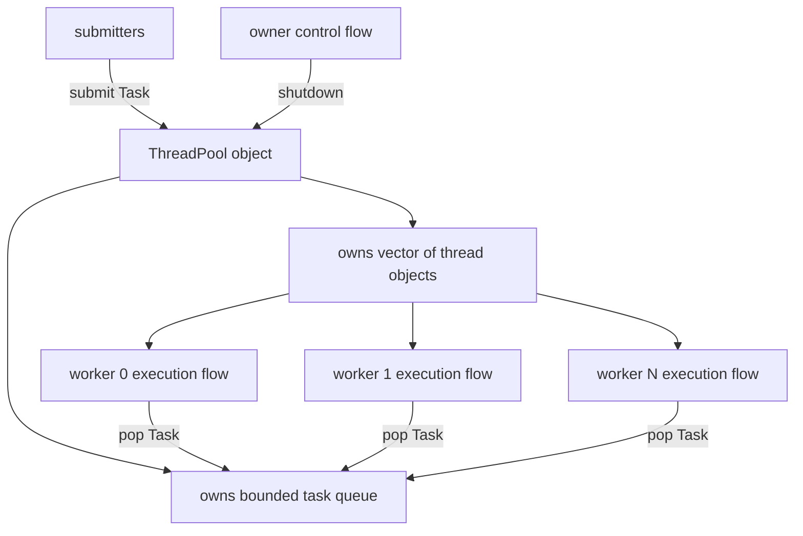
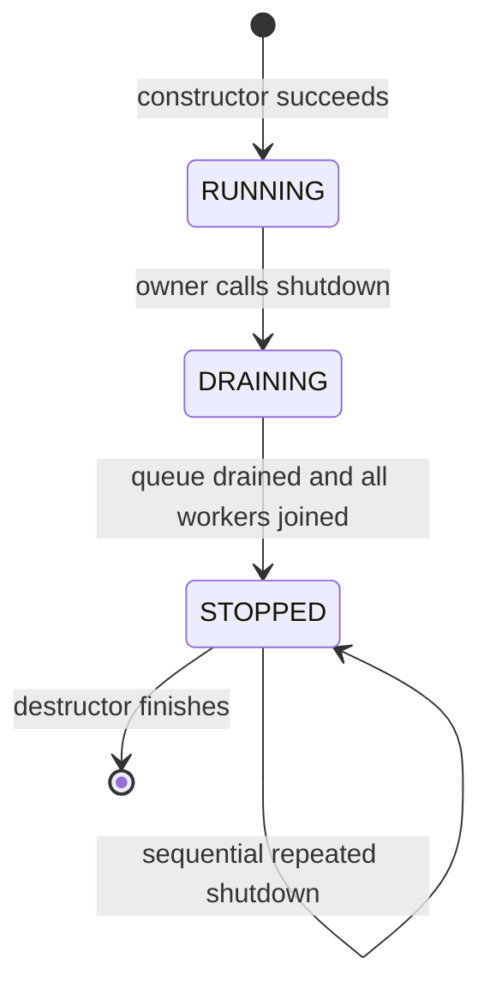
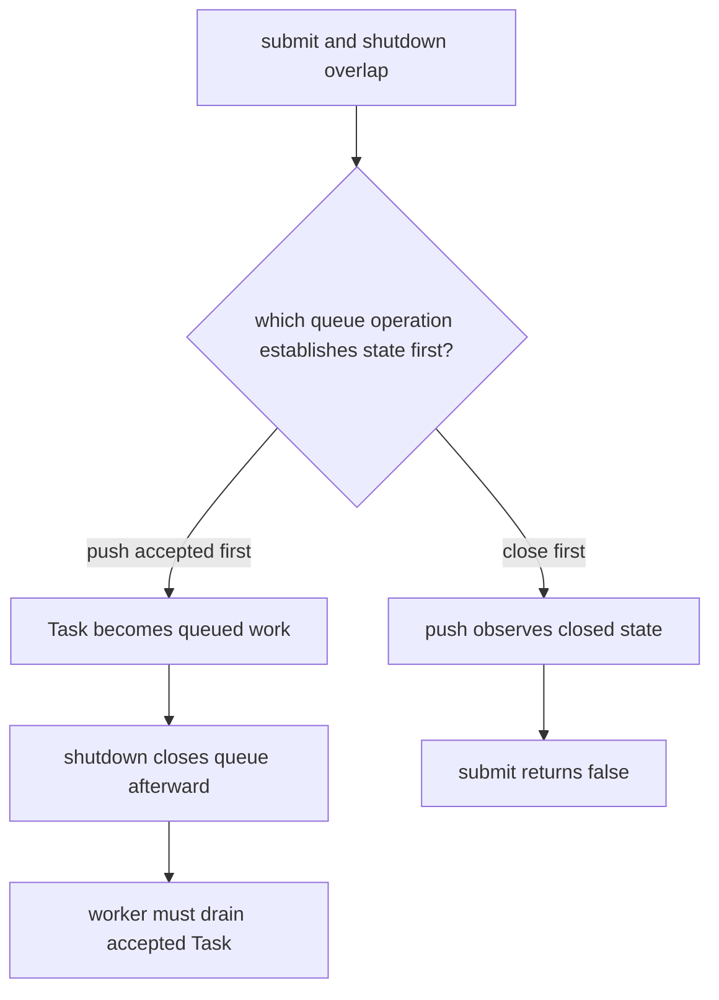
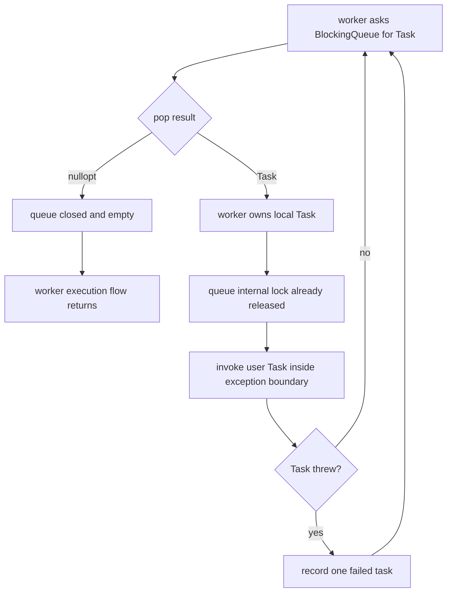
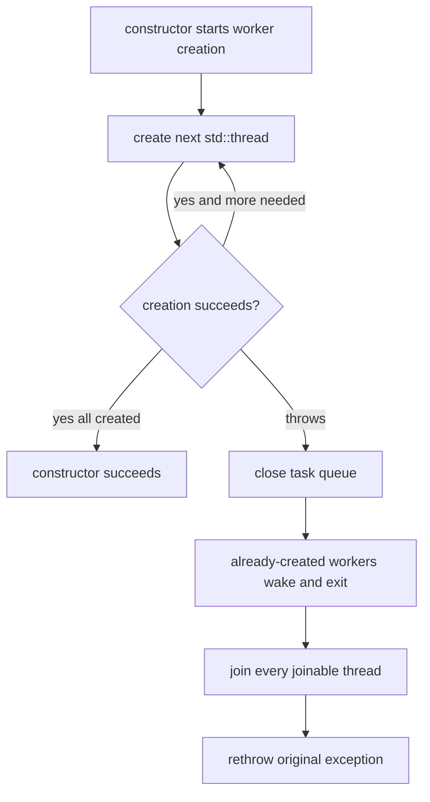
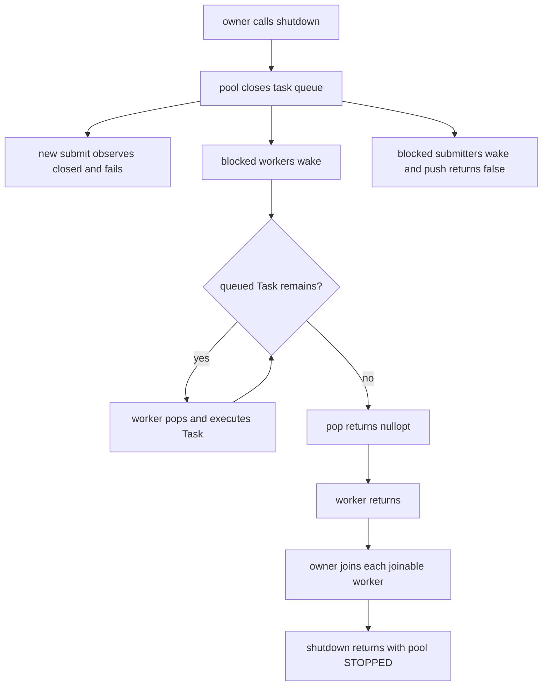
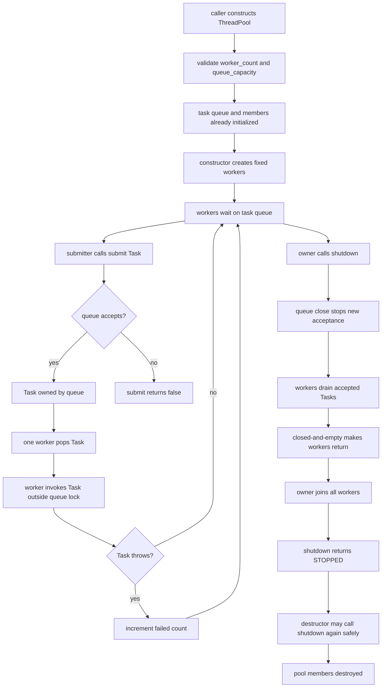

# Week8 Day2：ThreadPool 怎样安全接受、执行和停止 work

> 进度说明：这份 Day2 是按你的要求提前生成，方便你之后直接进入学习；它不代表 Day1 已经完成检阅或正式通过。稍后只有你明确发出检阅指令时，才检查 Day1 note 和 Ubuntu 代码。
>
> 今日定位：把 Day1 散落在 `main` 中的 task queue、workers、worker loop 和 shutdown responsibility，收进一个拥有明确生命周期的 `ThreadPool` object。
>
> 今日产出：独立实现 `thread_pool.hpp` 与 `thread_pool_test.cpp`。今天只接受 `std::function<void()>` tasks，不加入 future 和 generic submit template。

---

# Part 1：前情提要与必要术语

## 1. Day1 留下了什么工程问题

Day1 的 task dispatch 模型是：

```text
callable
-> std::function<void()> Task
-> BlockingQueue<Task>
-> worker pop
-> worker invoke
-> close / drain / join
```

这个模型能够证明机制，但如果所有 objects 和操作都留在 `main`：

```text
谁拥有 queue？
谁拥有 worker thread objects？
谁负责 close？
谁保证所有 workers 被 join？
调用者什么时候还能 submit？
对象离开作用域时怎样安全退出？
task 抛 exception 会怎样？
```

都只能依赖编写 `main` 的人每次重新记住。

这不是可复用组件。

Day2 要把这些责任收进一个 class：

```text
ThreadPool object
```

它的核心价值不只是“少写几行创建 thread 的代码”，而是建立一个统一的 ownership 与 lifecycle boundary。

---

## 2. 今日最终组件是干什么的

今天的 `ThreadPool V1` 为调用者提供：

```text
构造时创建固定数量 workers
运行期间接受 void() tasks
workers 重复从 bounded BlockingQueue 获取并执行 tasks
shutdown 后停止接受新 tasks
已经 accepted 的 tasks 继续 drain
所有 workers 退出并由 pool join
destructor 返回前完成最终 shutdown
```

最小使用场景：

```text
main creates ThreadPool with 4 workers
-> main submits 100 tasks
-> workers execute tasks concurrently
-> main calls shutdown
-> pool stops accepting new tasks
-> workers drain the 100 accepted tasks
-> workers observe closed-and-empty and exit
-> shutdown joins workers and returns
-> main verifies results
```

今天的成功标准不是“输出顺序看起来并发”，而是：

```text
accepted tasks exactly once
shutdown 不丢 accepted tasks
submit after shutdown 明确失败
task exception 不终止整个 process，也不杀死 worker loop
repeated shutdown 不出错
destructor 不留下 joinable workers
```

---

## 3. 必要术语

### 3.1 thread pool

`pool`：池、一组预先准备并可重复使用的资源。

`thread pool`：线程池。

今天把它理解为：

```text
一个拥有固定 worker execution flows 和 task queue 的 object，
让多个 tasks 复用同一组 workers。
```

它解决的是：

```text
不为每项 task 都重新创建/销毁 thread
统一控制 worker lifecycle
集中处理 task handoff 与 shutdown
```

它不自动保证：

```text
tasks 更快
tasks 按提交顺序完成
没有 data race
任意 blocking task 都适合放进去
worker count 永远正确
```

---

### 3.2 fixed-size

`fixed`：固定的。

`fixed-size thread pool`：worker 数量在本次 pool 生命周期中固定。

今天 constructor 创建 `worker_count` 个 workers，之后不动态增加或减少。

固定 worker 数量是 V1 的范围，不是 production thread pool 的唯一方案。

---

### 3.3 submit

`submit`：提交。

今天表示：

```text
调用者把一项 Task 交给 ThreadPool，
由 pool 尝试将它加入 task queue。
```

submit 成功只说明：

```text
pool 已经 accepted 这项 task，并承诺按当前 graceful-shutdown contract 处理它。
```

它不说明：

```text
task 已经开始
task 已经完成
task 内部没有 exception
```

---

### 3.4 lifecycle

`life cycle`：生命周期。

ThreadPool 的 lifecycle 是：

```text
construction
-> running / accepting tasks
-> shutdown requested
-> draining accepted tasks
-> workers exited and joined
-> destruction
```

今天每个 public operation 都必须能放进这条时间线上解释。

---

### 3.5 graceful shutdown

`graceful`：平稳、有秩序的。

`graceful shutdown`：优雅关闭。

今天的准确含义：

```text
停止接受新 tasks
但不丢弃已经 accepted 的 tasks
workers drain queue
workers 退出
owner join workers
```

它不是：

```text
立刻杀死正在运行的 worker
取消全部 queued tasks
detach workers 后让它们自己结束
```

---

### 3.6 drain

`drain` 原意是“排空”。

今天表示：

```text
queue 已经关闭，不再接受新 task，
但 workers 继续取走并执行 queue 中已有的 tasks，直到 empty。
```

---

### 3.7 idempotent

`idempotent`：幂等。

今天的 `shutdown()` 幂等是指：

```text
同一个 owner sequentially 调用多次 shutdown，
第二次以后不会重复 close 出错，也不会重复 join 已经 joined 的 thread。
```

幂等不自动代表 thread-safe。

本日 contract 不支持多个 execution flows 同时调用 `shutdown()`。

---

### 3.8 invariant

`invariant`：不变量，在合法状态下必须始终成立的关系。

ThreadPool V1 的关键 invariants：

```text
每个 worker thread object 最终都被 join
queue closed 后不再 accepted 新 task
每个 accepted task 最多被一个 worker pop
worker 只在持有 local Task 后调用 user code
destructor 返回时没有 worker 再访问 pool members
```

---

### 3.9 exception boundary

`exception`：异常。

`boundary`：边界。

`exception boundary` 是：

```text
程序明确决定 exception 最远允许传播到哪里，
以及越过边界前由谁记录、转换或处理。
```

今天 worker 调用的是 user-provided task。若 task exception 穿过 `std::thread` 顶层入口，程序会 `std::terminate`。

所以 worker 每次调用 task 的位置必须形成 exception boundary。

---

### 3.10 rollback

`rollback`：回滚、撤销已经完成的部分工作。

如果 constructor 打算创建 4 个 workers，但创建第 3 个时抛 exception：

```text
前 2 个 workers 已经存在
```

constructor 不能直接离开，让包含 joinable threads 的 vector 析构；必须先 close queue、让已创建 workers 退出并 join，再重新抛出原 exception。

这叫 constructor failure rollback。

---

### 3.11 linearization point

`linearization`：把并发操作理解为在某个瞬间生效并排成顺序。

`linearization point`：线性化点。

今天不用学习完整并发理论，只需要一个直觉：

```text
submit 与 shutdown 即使并发发生，
最终必须有一个明确结果：

task 在 close 前被 queue accepted
或
close 先发生，task 被拒绝
```

现有 `BlockingQueue::push` 与 `close` 使用同一 queue mutex 修改/检查 `closed_`，因此 acceptance decision 不会处于“半成功”状态。

---

# Part 2：教程主体

# 教程开始：把散落在 `main` 的责任收进一个 object

## 4. 为什么“有几个 workers”还不等于 ThreadPool

Day1 可以在 `main` 中写：

```text
BlockingQueue<Task> tasks
vector<thread> workers
create workers
push tasks
close
join
```

但调用者每次使用时都必须自己保证：

```text
queue 比 workers 活得久
results 比 tasks 活得久
close 的时机正确
join 没有遗漏
异常路径也会 cleanup
```

ThreadPool class 的职责是把这些约束集中起来：



这里最关键的是 `owns`：

```text
pool 创建 workers
pool 保存 thread objects
pool 发起 queue close
pool join workers
pool 析构时完成最终 cleanup
```

调用者不再直接操作内部 queue 和 worker vector。

---

## 5. ThreadPool V1 的 public contract

今天建议的 interface shape：

```cpp
#pragma once

#include <cstddef>
#include <functional>

using Task = std::function<void()>;

class ThreadPool {
public:
    ThreadPool(std::size_t worker_count, std::size_t queue_capacity);

    ThreadPool(const ThreadPool&) = delete;
    ThreadPool& operator=(const ThreadPool&) = delete;
    ThreadPool(ThreadPool&&) = delete;
    ThreadPool& operator=(ThreadPool&&) = delete;

    bool submit(Task task);
    void shutdown();
    std::size_t failed_task_count() const;

    ~ThreadPool();
};
```

这只是 public contract，不是 implementation 答案。private members、constructor body、worker loop 和 shutdown control flow 由你设计。

### 5.1 constructor

输入：

```text
worker_count：固定 workers 数量
queue_capacity：bounded task queue 容量
```

建议 contract：

```text
worker_count == 0 -> throw std::invalid_argument
queue_capacity == 0 -> 由 BlockingQueue constructor 拒绝
成功返回 -> worker_count 个 workers 已被 pool 拥有并可等待 work
部分创建失败 -> cleanup 已创建 workers，再把 exception 继续抛出
```

### 5.2 `submit(Task task)`

建议 contract：

```text
empty task -> throw std::invalid_argument
pool 正在接受 work，push 成功 -> return true
pool 已 shutdown，queue 拒绝 -> return false
```

`true` 只表示 accepted，不表示 completed。

### 5.3 `shutdown()`

建议 contract：

```text
由 owner/control execution flow 调用
停止接受新 tasks
drain 已 accepted tasks
等待 workers 退出
join 所有 joinable workers
返回时 pool 已 STOPPED
同一 owner sequential repeated call 安全
```

不支持：

```text
某个 worker task 内部调用当前 pool.shutdown()
多个 execution flows 同时调用 shutdown()
```

### 5.4 destructor

建议 contract：

```text
若调用者忘记显式 shutdown，destructor 仍完成 shutdown + join
destructor 返回后，没有 worker 再访问 pool members
```

但调用者仍必须保证：

```text
开始析构时，不再有外部 submitter 使用这个 pool object
```

destructor 不能让一个已经 dangling 的 `this` 继续被其他 execution flows 调用。

---

## 6. 为什么 V1 禁止 copy 和 move

ThreadPool 拥有：

```text
mutex/condition-variable based queue
thread objects
workers 正在访问的 member addresses
lifecycle responsibility
```

copy 的问题很直接：

```text
复制后哪一个 pool 拥有原 workers？
两个 pools 是否 join 同一 execution flow？
tasks queue 是复制还是共享？
```

因此 copy 禁止。

move 看起来可能可做，但当前 workers 很可能通过 `this` 或 member address 访问原 object。若 object 被移动，内部地址和 ownership 关系需要重新设计。

V1 直接禁止 move：

```text
先保证生命周期清楚
不为了“Rule of Five 看起来完整”强行实现危险 move
```

---

## 7. ThreadPool 的 conceptual states

今天不强制加入 enum，但必须能用状态解释行为。

### 7.1 RUNNING

```text
queue open
submit 可以 accepted
workers wait/pop/execute
```

### 7.2 DRAINING

```text
shutdown 已 close queue
新 submit 被拒绝
queue 或 workers 中仍可能有 accepted tasks
workers 继续执行
shutdown caller 正在等待 join
```

### 7.3 STOPPED

```text
queue closed-and-empty
所有 workers 已退出
所有 thread objects 已 join
shutdown 已返回
```

状态流程：



注意：

```text
queue closed
!=
pool 已 STOPPED
```

因为 workers 可能还在 drain 或执行 local tasks。

---

## 8. submit 与 shutdown 同时发生时，谁赢

设两个 execution flows：

```text
Submitter：调用 pool.submit(task)
Owner：调用 pool.shutdown()
```

ThreadPool 若额外写一个没有同步的普通 bool：

```text
if (!stopped) {
    queue.push(task);
}
```

会产生两个问题：

```text
普通 bool data race
check 与 push 之间存在窗口
```

即使 bool 是 atomic，也可能：

```text
submitter 读到 accepting=true
-> owner close queue
-> submitter 才调用 push
```

所以最终 acceptance 仍必须由 queue 的同步 contract 决定。

现有 BlockingQueue 的关系：

```text
push：在 queue mutex 下等待 closed_ || not_full，成功后入队
close：在同一 queue mutex 下把 closed_ 改为 true
close：notify_all not_empty 与 not_full waiters
blocked push：被 close 唤醒，重新拿 mutex 后看到 closed_，返回 false，不入队
```

最后两行是 ThreadPool shutdown 能和 bounded submit 正确组合的必要 contract，不是可选优化。若 close 只唤醒 blocked consumers、不唤醒 blocked producers，full queue 上等待的 submitter 可能永远无法观察 shutdown。

因此只有两类结果：



没有第三类合法结果：

```text
submit 返回 true，但 task 既不在 queue，也不会执行
```

### 8.1 为什么不需要再复制一份 `closed_`

如果 pool state 和 queue state 分别维护两份 acceptance bool，很容易出现不一致：

```text
pool says accepting
queue says closed
```

Day2 的简单设计让 BlockingQueue 成为 task acceptance 的 single source of truth。

`single source of truth`：单一事实来源，即同一业务状态只由一个权威对象决定。

---

## 9. worker loop 的职责边界

worker loop 只负责四件事：

```text
1. 从 task queue 等待/取得 Task
2. closed-and-empty 时退出
3. 在 queue lock 外调用 local Task
4. 隔离 task exception，然后继续下一轮
```

worker loop 不负责：

```text
决定何时 shutdown
join 自己
销毁 pool
替 submitter 保存 future result
动态增减 workers
```

流程图：



教程给的是职责和状态，不给完整 C++ loop。你需要自己把 `optional<Task>`、调用和 exception handling 组合起来。

---

## 10. 为什么 task exception 不能逃出 worker entry

### 10.1 uncaught exception 的后果

如果一个 exception 从 `std::thread` 最外层 callable 逃出：

```text
std::terminate
-> 整个 process 被终止
```

它不是“只让当前 task 失败”。

ThreadPool 执行的是 user-provided code，所以必须把每项调用视为可能失败。

### 10.2 V1 的最小 policy

今天还没有 future，无法把每个 exception 原样交还 submitter。

V1 采用一个明确但有限的 policy：

```text
worker 捕获 task exception
-> atomic failed_task_count +1
-> worker 不退出
-> 继续执行后续 task
```

`failed_task_count()` 让测试和调用者至少知道有 tasks 失败。

限制：

```text
不保存每项 exception 的具体类型/message
调用者不知道是哪一个 task 失败
```

Day3 用 `packaged_task + future` 建立逐 task 的 exception propagation。

### 10.3 单个 API 语法例子

下面只展示 exception boundary，不是 worker loop：

```cpp
/*
目标：调用一个可能抛异常的 callable；失败时计数，但不让异常继续逃出。
*/
#include <atomic>
#include <cstddef>
#include <functional>

void execute_one_safely(
    const std::function<void()>& task,
    std::atomic<std::size_t>& failures) noexcept {
    try {
        task();
    } catch (...) {
        failures.fetch_add(1);
    }
}
```

这里 `noexcept` 表示该 helper 承诺不向调用者传播 exception。它内部必须捕获所有 task exceptions。

生产系统可能选择：

```text
log exception
invoke error callback
mark task result failed
stop pool on fatal category
```

今天先不展开。

---

## 11. constructor 为什么是第一个困难的 error path

### 11.1 所有 data members 先初始化

进入 constructor body 前，data members 已按 **class declaration order** 初始化。

不是按 initializer list 的书写顺序。

建议概念顺序：

```text
task queue
failure counter
workers vector
```

constructor body 再逐个创建 worker execution flows。

workers 只能访问已经完成初始化的 members；不要在 worker 中读取 constructor body 尚未建立的临时状态。

### 11.2 `std::thread` 创建可能抛 exception

创建 thread 可能因资源不足等原因抛出 `std::system_error`。

假设：

```text
worker_count = 4
Worker 0 created
Worker 1 created
Worker 2 creation throws
```

此时 ThreadPool constructor 尚未成功，但 Worker 0/1 已经可能在 queue 上等待。

如果直接重新抛出：

```text
workers vector 开始析构
-> 内含 joinable std::thread
-> std::thread destructor calls std::terminate
```

所以 constructor catch path 必须：



这个 rollback 是 Day2 核心，不要求你写一个真实资源耗尽测试；通过 code review 检查。

### 11.3 为什么先 close 再 join

已创建 workers 可能正阻塞在 `pop()`：

```text
queue open + empty
```

若 catch path 直接 join：

```text
workers 等未来 task
constructor 等 workers 退出
双方永久等待
```

先 close 使 `pop()` 最终返回 `nullopt`，workers 才能退出。

---

## 12. shutdown 的完整因果链

owner 调用 shutdown 时：



### 12.1 shutdown 是 blocking operation

今天 `shutdown()` 不只是发一个 signal 后立即返回。

它会等待：

```text
queued tasks drain
currently running tasks return
all workers exit
all workers join
```

如果某项 task 永远阻塞，shutdown 也可能永远阻塞。

V1 不支持强制终止任意 C++ user task。

### 12.2 repeated shutdown 为什么安全

顺序调用第二次 shutdown：

```text
queue.close() 再次调用：BlockingQueue contract 幂等
worker.joinable()：已经 join 的 thread 返回 false
```

因此不会重复 join。

必须检查 `joinable()`，不能对已经 joined 的 thread 再调用 `join()`。

### 12.3 为什么 worker 不能 shutdown 当前 pool

若 Worker 1 正在执行 task，该 task 调用：

```text
pool.shutdown()
```

shutdown 遍历 workers 并尝试 join Worker 1 自己。

一个 execution flow 不能等待自己结束；这会抛 `std::system_error` 或形成错误的 self-join 逻辑。

Day2 contract 明确：

```text
shutdown 只由 pool 外部 owner/control execution flow 调用
```

---

## 13. `close()`、worker exit、`join()`、destruction 不是同一时刻

按时间分开：

| Event | 改变了什么 | 尚未保证什么 |
|---|---|---|
| queue close | 不再 accepted 新 task，唤醒 waiters | tasks 已完成、workers 已退出 |
| queue drained | 没有 queued task | 正在运行的 local task 已返回 |
| worker returns | 某个 execution flow 已结束 | 其 thread object 已 join |
| join returns | owner 已回收该 execution flow | 其他 workers 已 join |
| shutdown returns | 所有 workers 已 join | 外部 objects 被 tasks 引用时仍需调用者管理 lifetime |
| destructor returns | pool members 已销毁 | 外部 dangling pointer 不由 pool 自动修复 |

这张表防止把一句“线程池关闭了”混成多个不同状态。

---

## 14. destructor 为什么调用 shutdown 仍不等于万能

### 14.1 destructor 的责任

如果 pool object 离开作用域：

```text
~ThreadPool
-> close queue
-> drain
-> join workers
-> destructor body ends
-> members reverse declaration order destruction
```

这样 `workers_` vector 析构时，内部 threads 已不再 joinable。

### 14.2 caller 的责任

destructor 开始前，调用者必须保证没有其他 execution flow 仍在：

```text
pool.submit(...)
pool.shutdown()
读取 pool API
```

否则一边析构，一边调用 member function，本身就是 object lifetime violation。

### 14.3 tasks 捕获的外部 references

pool 可以保证 workers 在自身析构前结束，但不能知道 task 捕获的外部 reference 是否仍有效。

错误顺序：

```text
destroy external object
-> queued task later accesses reference
-> dangling reference
```

正确顺序必须由调用者建立：

```text
external objects outlive all tasks that reference them
-> pool shutdown/join
-> then external objects may be destroyed
```

---

## 15. `joinable()` 与 `join()` 在组件里的作用

### 15.1 `joinable()`

所属头文件：

```cpp
#include <thread>
```

签名：

```cpp
bool joinable() const noexcept;
```

返回 `true` 表示该 `std::thread` object 当前关联一个 execution flow identity，必须在析构前 `join()` 或 `detach()`。

Day2 不使用 detach。

### 15.2 `join()`

```cpp
void join();
```

调用者等待对应 execution flow 结束。成功后：

```text
thread.joinable() == false
```

最小独立例子：

```cpp
/*
目标：展示 joinable 在 join 前后发生变化。
*/
#include <thread>

int main() {
    std::thread worker([]() {});

    if (worker.joinable()) {
        worker.join();
    }

    return worker.joinable() ? 1 : 0;
}
```

编译：

```bash
g++ -std=c++17 -Wall -Wextra -g -pthread joinable_demo.cpp -o joinable_demo
./joinable_demo
```

exit code 0 表示 join 后不再 joinable。

---

## 16. 为什么不需要在 ThreadPool 外再加“万能 mutex”

ThreadPool 内有两类 state：

### 16.1 queue state

```text
queued tasks
capacity
closed state
not_empty/not_full predicates
```

由 BlockingQueue 自己的 mutex 保护。

### 16.2 failure count

```text
failed_task_count
```

今天可以使用单个 atomic counter。

### 16.3 workers vector

```text
constructor 期间由 owner 写
running 期间 workers 不修改 vector
shutdown 期间由同一个 owner sequentially join
```

本日 contract 不允许 concurrent shutdown，所以不需要为 vector 再加一把 mutex。

设计不是“共享 object 都加同一把锁”，而是：

```text
先定义谁在哪个阶段访问
再决定是否存在 concurrent conflicting access
最后选择 synchronization
```

---

## 17. V1 的能力边界

### 17.1 它适合什么

```text
一组彼此独立的 void() tasks
固定 workers
明确 owner lifecycle
tasks 能在有限时间内返回
调用者可以接受 bounded queue 的 blocking backpressure
```

### 17.2 它暂时不适合什么

```text
需要 typed return value
需要逐 task exception detail
需要 cancellation
需要 priority
需要动态 worker count
task 会无限 blocking
worker task 内部等待同一 pool 中其他 tasks，可能造成 starvation/deadlock
```

### 17.3 worker count 不等于越多越好

Week7 已观察到 contention 与 false sharing。ThreadPool 只控制并发上限，不保证线性加速。

今天不 benchmark。等 implementation 和 tests 稳定后再测。

---

## 18. ThreadPool V1 完整主线

把 constructor、submit、worker、shutdown 和 destructor 串起来：



今天最重要的压缩记忆：

```text
ThreadPool 不只是“threads + queue”；
它是接受 work、执行 work、拒绝新 work、drain 旧 work、join workers 的生命周期 owner。
```

---

# Part 3：收尾、练习、测试与验收

## 19. 今日独立练习

### 19.1 产出文件

在 Week8 canonical source 中新增：

```text
include/thread_pool.hpp
tests/thread_pool_test.cpp
```

继续复用：

```text
include/blocking_queue.hpp
```

不要复制为：

```text
thread_pool_v1_final.hpp
thread_pool_new.cpp
blocking_queue_day2_copy.hpp
```

Day3 会继续修改同一份 `thread_pool.hpp`，由 Git 保存演进。

---

### 19.2 `thread_pool.hpp` 程序用途

它定义一个 fixed-size ThreadPool component：

```text
caller construction supplies worker count and queue capacity
caller submits std::function<void()> tasks
pool-owned workers execute accepted tasks
owner calls shutdown or lets destructor perform final shutdown
accepted tasks are drained before all workers join
```

今天不是 executable 的主要入口；它由 `thread_pool_test.cpp` include 并验证。

---

### 19.3 public contract

必须支持：

```text
constructor(worker_count, queue_capacity)
submit(Task) -> bool
shutdown()
failed_task_count() const
destructor
deleted copy/move
```

你可以调整类型别名位置和命名，但语义不能悄悄变化。

建议明确：

```text
worker_count=0 -> invalid_argument
queue_capacity=0 -> invalid_argument
empty Task -> invalid_argument
submit after shutdown -> false
shutdown -> drain + join
sequential repeated shutdown -> safe
task exception -> failure count + worker continues
```

---

### 19.4 private state 需要你自己设计

至少要表达这些 ownership：

```text
bounded BlockingQueue<Task>
vector of worker thread objects
atomic failure counter
```

若你增加其他 state，必须回答：

```text
谁写？
谁读？
哪把锁/哪个 atomic 保护？
它是否和 queue.closed_ 重复？
```

不要为了“看起来像工程代码”先堆很多 bool 和 mutex。

---

### 19.5 constructor requirements

```text
validate worker_count
reserve worker vector capacity
create fixed workers
worker waits on member queue
if any thread creation throws：close queue -> join already-created workers -> rethrow
constructor success 后所有 workers 由 pool ownership 管理
```

`reserve` 只是减少 vector reallocation，不替代 rollback。

---

### 19.6 submit requirements

```text
reject empty Task according to contract
delegate final acceptance to BlockingQueue::push
return true only if queue accepted Task
return false after close
if blocked because queue is full, close must wake this push and make it return false
do not execute task in submitter
do not hold an unrelated pool mutex while a bounded queue push blocks
```

最后一条很重要：

```text
queue full 时 submit 可能 blocking
```

如果 submit 持有一把 shutdown 也需要的外层 mutex，再等待 queue space，可能制造新的 lock dependency。

---

### 19.7 worker requirements

```text
repeatedly obtain optional Task from queue
nullopt -> return
Task -> invoke outside queue lock
catch task exceptions at per-task boundary
increment failure counter
continue next task after failure
do not call shutdown/join
```

教程不提供完整 worker-loop C++。

---

### 19.8 shutdown requirements

```text
close queue first
join each joinable worker
return only after all workers joined
sequential second call remains safe
do not detach
```

本日不支持 concurrent shutdown，也不支持 shutdown from worker task。

---

### 19.9 destructor requirements

```text
perform final shutdown
must not leave joinable threads
must not throw under the component's valid-use contract
```

如果内部 invariant 已被外部错误用法破坏，例如 worker 自己触发 self-join，不要求 destructor 神奇修复。

---

## 20. 允许查阅的最小 API

### 20.1 `std::invalid_argument`

所属头文件：

```cpp
#include <stdexcept>
```

最小例子：

```cpp
#include <cstddef>
#include <stdexcept>

void require_positive(std::size_t value) {
    if (value == 0) {
        throw std::invalid_argument("value must be positive");
    }
}
```

表示 caller 提供的 argument 不满足 API contract。

---

### 20.2 `std::vector::reserve`

```cpp
#include <vector>

std::vector<int> values;
values.reserve(4);
```

作用：至少为 4 个 elements 预留 capacity，但 `size()` 仍是 0。

在 workers vector 中，reserve 可以减少逐项 `emplace_back` 时的 reallocation。

它不创建 worker，也不改变 thread lifecycle。

---

### 20.3 `std::thread::joinable` / `join`

```cpp
#include <thread>

std::thread worker([]() {});

if (worker.joinable()) {
    worker.join();
}
```

成功 join 后，该 thread object 不再 joinable。

---

### 20.4 try / catch / rethrow

```cpp
try {
    require_positive(0);
} catch (...) {
    // cleanup current scope resources here
    throw;
}
```

单独的：

```cpp
throw;
```

只能在 active exception 的 catch handler 中使用，表示继续抛出当前 exception，不会把它转换成新类型。

constructor rollback 需要这种“先 cleanup，再 rethrow”。

---

### 20.5 `std::atomic<std::size_t>`

```cpp
#include <atomic>
#include <cstddef>

std::atomic<std::size_t> failures{0};
failures.fetch_add(1);
const std::size_t snapshot = failures.load();
```

今天用它记录 task failure count。默认 sequential consistency 足够，不展开 memory order。

---

### 20.6 `std::function::operator bool`

```cpp
#include <functional>
#include <stdexcept>

std::function<void()> task;

if (!task) {
    throw std::invalid_argument("empty task");
}
```

空 `std::function` 没有 callable target。直接调用会抛 `std::bad_function_call`。

---

## 21. 编译方式

在 Ubuntu：

```bash
cd ~/code/system-learning/cpp/week8
mkdir -p tests build
```

编译：

```bash
g++ -std=c++17 -Wall -Wextra -g -pthread \
  -Iinclude tests/thread_pool_test.cpp \
  -o build/thread_pool_test
```

运行：

```bash
./build/thread_pool_test
```

今天保持 header-only ThreadPool，暂时不增加单独 `.cpp` translation unit。Day4 再建立 CMake / GoogleTest。

---

## 22. Fixed tests

测试要证明 ThreadPool contract，不重复写一套纯 BlockingQueue tests。

### Test 1：invalid construction

动作：

```text
construct worker_count=0
```

证据：

```text
捕获 std::invalid_argument
没有遗留 worker
```

`queue_capacity=0` 也应被拒绝，可保留一个代表测试，不要求重复大量相同断言。

---

### Test 2：zero task shutdown

```text
construct pool
submit nothing
shutdown
all workers exit and join
second shutdown succeeds
```

这验证 owner lifecycle，不是重做 queue 的全部 close tests。

---

### Test 3：normal exact execution

```text
workers=4
capacity=4
tasks=100
```

每项 task 使用 unique ID 和独立 result slot。

检查：

```text
all submit return true
all expected results correct after shutdown
failed_task_count == 0
```

---

### Test 4：accepted-work completion baseline

```text
workers=2
capacity 较小
submit 明显多于 worker_count 的 tasks
submit 完成后调用 shutdown
```

不要使用 sleep 猜“肯定还有任务在 queue”。

只检查最终 exact results，可以证明 accepted tasks 没有丢失，但不能单独证明 `shutdown()` 开始时 queue 中确实存在 pending task。快机器可能已经在 shutdown 前完成全部 work。

如果今天愿意加入少量受控 gate/state，可以进一步建立 pending state；否则把本测试准确记为 accepted-work completion baseline，不把它当作严格 drain-timing evidence。

Day4 会把“确实建立 pending state”的 deterministic test 做得更严格；今天先确保业务结果完整。

---

### Test 5：submit after shutdown

```text
construct
shutdown
submit non-empty Task
```

检查：

```text
submit returns false
Task does not execute
```

---

### Test 6：empty task

```text
submit default-constructed std::function<void()>
```

检查：

```text
std::invalid_argument
pool remains usable
```

随后再提交一项合法 task，确认 programming-error path 没破坏 pool。

---

### Test 7：task exception isolation

按顺序 accepted：

```text
normal Task A
throwing Task B
normal Task C
```

shutdown 后检查：

```text
A executed
C executed
failed_task_count == 1
process did not terminate
worker pool could continue after B
```

不要依赖 A/B/C 的完成打印顺序。

---

### Test 8：destructor path

```text
external result state created
enter inner scope
construct pool
submit tasks that update external state
do not explicitly call shutdown
leave scope
after destructor returns, verify all accepted tasks completed
```

这证明 destructor 最终 close/drain/join。

确保 external state 比 pool 活得久。

---

### Test 9：sequential repeated shutdown

```text
shutdown
shutdown
shutdown
```

程序不能重复 join 或抛异常。

本日不测试 concurrent shutdown，因为 contract 明确不支持。

---

## 23. 测试 harness 要求

今天还没到 GoogleTest，但不能只打印几行 `PASS`。

要求：

```text
每个 test function 返回 bool，或失败时明确影响总结果
main 汇总所有 tests
任何核心 test 失败 -> main returns non-zero
unexpected exception -> test fails
输出包含具体 test name
```

不要写成：

```text
发现错误只 cout << "FAIL"
最后 main 仍 return 0
```

---

## 24. ThreadSanitizer

正常版本通过后：

```bash
g++ -std=c++17 -Wall -Wextra -g -O1 -pthread \
  -fsanitize=thread -fno-omit-frame-pointer \
  -Iinclude tests/thread_pool_test.cpp \
  -o build/thread_pool_test_tsan

timeout 30s ./build/thread_pool_test_tsan
```

TSan 今天重点观察：

```text
failure counter
test result state
task captures
submit 与 shutdown overlap 时 queue state
worker 对 pool members 的访问
```

TSan clean 不能证明：

```text
constructor rollback 一定正确
不会 self-join
没有 lost task
shutdown 一定 drain
不会 deadlock
```

这些仍依赖 contract、code review 和 fixed tests。

`timeout` exit code 124 表示命令超时，需要检查可能的 hang；它不是 PASS。

---

## 25. 重复运行

```bash
for i in $(seq 1 50); do
  timeout 10s ./build/thread_pool_test >/dev/null || exit 1
done

echo "stress PASS"
```

作用：

```text
尝试更多 scheduling interleavings
让偶发 failure/hang 更容易出现
```

不能证明：

```text
所有可能 interleavings 都已覆盖
```

今天不做 performance benchmark。ThreadPool contract 先正确，Day4 tests 稳定后再进入 Week8 benchmark 阶段。

---

## 26. 建议输出

```text
[PASS] invalid construction
[PASS] zero-task shutdown
[PASS] normal exact execution
[PASS] accepted-work completion baseline
[PASS] submit after shutdown
[PASS] empty task
[PASS] exception isolation
[PASS] destructor path
[PASS] repeated shutdown
ALL TESTS PASS
```

输出标签必须来自真实 assertion/check，不是直接打印固定字符串。

多 workers 不要大量 `cout`，避免日志本身扰乱观察。

---

## 27. `day2_note.md` 建议结构

```markdown
# Week8 Day2 Note

## 1. ThreadPool ownership

画出 pool、queue、thread objects、worker execution flows 和 submitter。

## 2. Lifecycle

用自己的流程串 constructor -> running -> shutdown -> drain -> join -> destructor。

## 3. 我定义的 contract

记录 worker_count=0、empty task、submit after shutdown、task exception、repeated shutdown。

## 4. Constructor rollback

说明为什么先 close，再 join，最后 rethrow。

## 5. Verification

保留 fixed tests、TSan、50 次重复运行的代表结果。

## 6. Questions

只写真正仍不理解的点。
```

代码注释已经说明的机械内容不需要复制到 note。

---

## 28. 今日验收问题

1. ThreadPool object 拥有哪些 resources？为什么调用者不再直接 join workers？
2. submit 返回 true、task 开始执行、task 执行完成，为什么是三个不同状态？
3. shutdown 为什么先 close queue，再 join workers？如果反过来会怎样？
4. constructor 创建部分 workers 后抛 exception，为什么不能直接 rethrow？
5. task exception 为什么必须在 worker 内形成 boundary？Day2 怎样记录失败，当前方案缺少什么？
6. 为什么 V1 的 sequential repeated shutdown 可以幂等，但 concurrent shutdown 仍不在 contract 内？

验收时优先看代码、Git diff、note 和测试证据。产出已经清楚证明的问题，不要求机械重写答案。

---

## 29. 今日通过标准

### 核心必须完成

```text
能解释 ThreadPool 不是简单的 threads + queue，而是 lifecycle owner
独立实现 fixed-size ThreadPool V1
copy/move disabled
worker_count/queue_capacity boundary 明确
constructor partial-failure path 能 close + join + rethrow
submit empty task 有明确 programming-error contract
submit after shutdown 返回 false
accepted tasks 在 shutdown 时 drain
all workers join
sequential repeated shutdown 安全
destructor 能完成最终 shutdown
task exception 不 terminate process，worker 可继续
failure count 可观察
fixed tests 真实影响 exit code
规定参数零 warning
TSan 无 data-race report
50 次重复运行通过
```

### 工程增强，不阻塞 Day2

```text
concurrent shutdown
shutdown from worker 的支持
per-task exception detail
future
packaged_task
generic submit template
move-only callable
dynamic worker resize
task cancellation
GoogleTest / CMake
benchmark
```

### Day2 不通过的真正原因

```text
destructor 时仍有 joinable thread
constructor failure 留下已经创建的 workers
shutdown 先 join、worker 却仍在 open empty queue 等待
close 后直接丢弃 accepted tasks
submit 返回 true 但 task 没有执行路径
task exception 逃出 worker 导致 terminate
worker 在 queue lock 内执行 user task
pool 析构时外部仍调用 submit
repeated shutdown 对同一 thread 重复 join
测试只打印 PASS、不检查结果或始终 return 0
```

---

## 30. 今天停止在哪里

今天完成：

```text
Task = std::function<void()>
-> ThreadPool owns queue and workers
-> submit delegates acceptance to queue
-> workers invoke tasks with exception boundary
-> shutdown closes, drains and joins
-> destructor guarantees final cleanup
```

今天不要继续：

```text
future
packaged_task
parameter pack
invoke_result_t
perfect forwarding
generic result-returning submit
```

Day3 才解决：

```text
submit f(args...)
-> return future<R>
-> worker executes callable
-> return value or exception enters shared state
-> submitter observes it through future.get()
```
