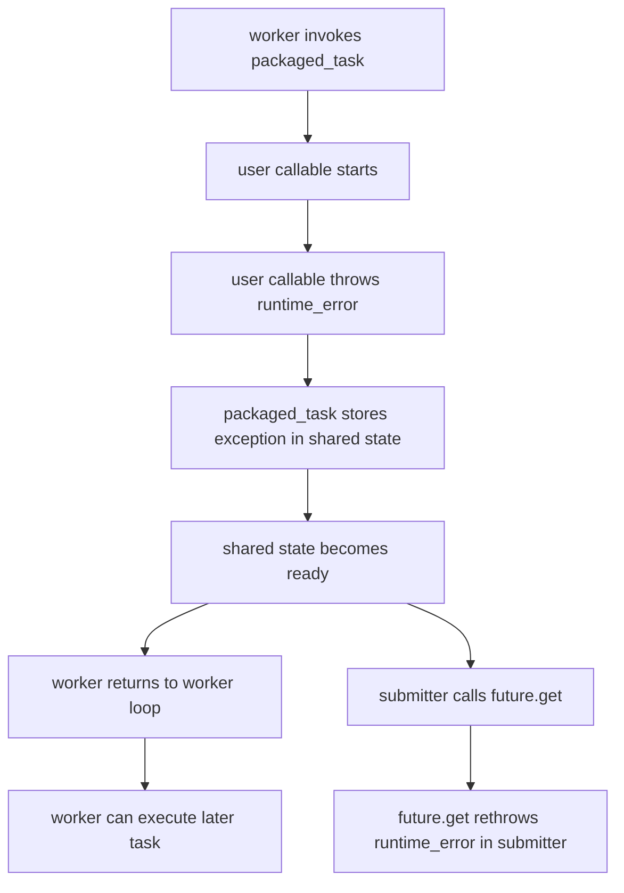
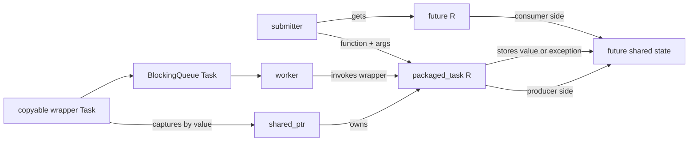
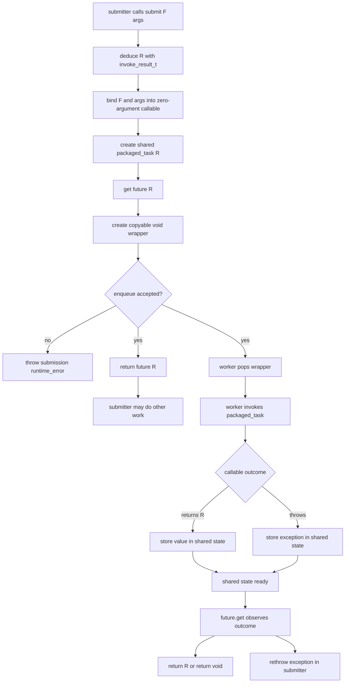

# Week8 Day3：task 的 return value 和 exception 怎样回到 submitter

> 今日定位：在 Day2 ThreadPool V1 的生命周期与 drain 语义之上，增加一次性异步结果通道。
>
> 今日只升级同一份 `thread_pool.hpp`，不复制第二套线程池源码。

---

# Part 1：前情提要与必要术语

## 1. 从 Day2 接到今天

Day2 设计的 ThreadPool V1 解决了这一条链：

```text
caller 构造 pool
-> pool 创建固定数量 workers
-> caller submit 一个 std::function<void()>
-> task 进入 bounded BlockingQueue
-> 某个 worker 取出并执行 task
-> owner shutdown
-> queue close，workers drain 已接收 tasks
-> owner join workers
```

这已经能执行 work，但提交者看不到 work 的直接结果。

例如：

```cpp
pool.submit([] {
    return 40 + 2;
});
```

若 public interface 仍然只接收：

```cpp
std::function<void()>
```

那么 lambda 的 `42` 没有返回给 caller 的通道。task 若抛出 exception，Day2 的 worker 也只能在执行边界捕获并计数，caller 不知道究竟是哪次提交失败。

今天要补上的不是“再开一个 thread”，而是另一条独立的链：

```text
task execution：worker 什么时候执行 callable
result observation：submitter 什么时候观察 return value 或 exception
```

二者可以发生在不同 execution flows，也可以发生在不同时间。

---

## 2. 今日最终组件是干什么的

今天升级后的 ThreadPool 要支持：

```cpp
auto result = pool.submit(add, 20, 22);

// caller 还可以先做别的事

std::cout << result.get() << '\n';
```

整体输入、输出和执行者如下：

```text
输入：callable + arguments
立即输出：std::future<R>
真正执行 callable 的人：pool 中某个 worker
最终结果：R，或 callable 抛出的 exception
观察结果的人：持有 future 的 submitter
正常结束：shutdown drain 已接收 tasks，然后 join workers
```

成功必须分成两个阶段：

```text
submission success：task 被 queue 接受
execution success：worker 执行 callable 并正常产生 R
```

提交成功不保证业务执行成功。业务执行失败时，今天的目标也不是让 worker 消失，而是让对应的 `future.get()` 重新观察到那个 exception。

今天暂不实现：

```text
task cancellation
timeout submit
future continuation / then
work stealing
task priority
shared_future 深入
手写 promise/shared state
复杂 template metaprogramming
```

---

## 3. 必要术语

### 3.1 asynchronous result

`asynchronous`：异步的。

`result`：结果。

今天的 asynchronous result 指：提交者发起 work 后，不要求在 `submit()` 返回前就得到最终计算结果；结果可以由另一个 worker 将来产生。

它不是：

```text
一定并行
一定更快
提交者永远不等待
忽略执行错误
```

当 submitter 调用 `future.get()` 而结果尚未 ready 时，它仍可能 blocking。

---

### 3.2 future

`future` 原义是“未来”。

`std::future<R>` 可以理解为：

```text
一个用于将来观察 R 或 exception 的一次性 handle
```

在今天的组件中：

```text
submit() 立即把 future 交给 caller
worker 将来产生 result
caller 用 future.get() 观察 result
```

`future` 不是：

```text
worker thread
task 本身
queue element 本身
已经计算完成的 R
可以无限次读取的普通变量
```

`future` 自己不负责找 worker，也不执行 callable。它只是连接提交者与某个共享结果状态的 handle。

---

### 3.3 shared state

`shared state`：共享状态。

这里的“共享”表示结果生产端和结果观察端关联到同一份异步状态，不是让你手写一个没有锁保护的 global variable。

可以先把这份状态想成：

```text
+--------------------------------------+
| future shared state                  |
|--------------------------------------|
| status: not-ready / ready            |
| payload: R or exception              |
+--------------------------------------+
          ^                   ^
          |                   |
 producer side          consumer side
 packaged_task             future<R>
```

这张图表达的是逻辑关系。C++ standard library 负责 shared state 内部同步，今天不手写它的 mutex 和 condition variable。

shared state 中最终放的是二选一：

```text
正常完成 -> return value
异常完成 -> exception
```

---

### 3.4 ready

`ready`：结果状态已经就绪。

对今天的 future 而言：

```text
not-ready：worker 尚未完成对应 task
ready with value：task 正常返回
ready with exception：task 抛出 exception，exception 已保存
```

注意：

```text
ready 不等于成功
```

保存了 exception 的 shared state 也是 ready，因为 `get()` 已经不会无限等待，它可以立刻重新抛出该 exception。

---

### 3.5 producer / consumer

`producer`：生产者。

`consumer`：消费者。

在结果通道里：

```text
worker 执行的 packaged_task 是 result producer
持有 future 并调用 get 的 submitter 是 result consumer
```

不要和 BlockingQueue 的 task producer/consumer 混在一起：

```text
task queue：submitter produce task，worker consume task
result state：worker produce result，submitter consume result
```

同一个 execution flow 在两条关系中可以扮演不同角色。

---

### 3.6 packaged task

`package`：打包。

`std::packaged_task<R()>`：把一个 callable 打包成“执行后向 shared state 写入 `R` 或 exception”的对象。

它完成的连接是：

```text
callable execution
        |
        v
future shared state
```

`std::packaged_task` 不是 thread。调用它的 execution flow 才会真正执行内部 callable：

```cpp
task();  // 当前调用 task() 的 thread 执行内部 callable
```

在线程池中，调用 `task()` 的应该是 worker。

---

### 3.7 exception propagation

`propagation`：传播、传递。

`exception propagation` 在今天表示：

```text
callable 在 worker 中 throw
-> packaged_task 捕获并把 exception 保存进 shared state
-> worker 可以继续处理下一项 work
-> submitter 在 future.get() 时重新 throw 同一个失败
```

这里不是 exception 从 worker 的 call stack 直接“跳”到 submitter 的 stack。两个 thread 没有共享 call stack。中间必须经过 shared state 保存和再次观察。

---

### 3.8 one-shot

`one-shot`：一次性的。

今天可以把普通 `std::future` 记成一次性结果通道：

```text
get() 成功取得 value，或观察 exception 后
-> 该 future 通常不再持有有效 shared state
```

因此不要对同一个 future 连续调用两次 `get()`。

若以后需要多个观察者，需要讨论 `std::shared_future`，但不属于今天主线。

---

### 3.9 function template

`function template`：函数模板。

它不是一个固定参数类型的普通 function，而是一份由 compiler 根据调用处类型生成具体 function 的规则。

例如：

```cpp
template <class T>
T twice(T value) {
    return value + value;
}
```

调用：

```cpp
twice(3);           // T 推导为 int
twice(std::string("a")); // T 推导为 std::string
```

ThreadPool 的 `submit` 必须接收不同 callable、不同 arguments 和不同 return types，因此需要 function template。

---

### 3.10 parameter pack

`parameter`：参数。

`pack`：一包、一个参数集合。

模板中会遇到两种相关写法：

```cpp
template <class... Args> // Args 是 template parameter pack
void call(Args... args); // args 是 function parameter pack
```

今天只需要建立第一层直觉：

```text
Args... 表示零个或多个 argument types
args... 表示与这些 types 对应的零个或多个 function arguments
```

它让同一个 `submit` 可以接受：

```cpp
pool.submit(f);
pool.submit(f, 1);
pool.submit(f, 1, "hello");
```

今天不展开递归模板、fold expression 和复杂 pack expansion。

---

### 3.11 forwarding reference

当模板形如：

```cpp
template <class T>
void wrapper(T&& value);
```

并且 `T` 由调用处推导时，`T&&` 是 `forwarding reference`，中文常译“转发引用”。

它可以接收 lvalue，也可以接收 rvalue。与 `std::forward<T>(value)` 配合后，wrapper 可以把调用者原本的 value category 继续传给下游。

它不是“所有写成 `&&` 的参数”。例如固定类型的 `std::string&&` 是 rvalue reference，不是模板推导产生的 forwarding reference。

---

### 3.12 perfect forwarding

`perfect forwarding`：完美转发。

今天不需要背完整引用折叠规则，只抓当前用途：

```text
submit 接到 callable 和 arguments
-> 不应无条件把所有东西都当 lvalue 再复制一次
-> std::forward 尽量保留调用处原来的 lvalue/rvalue 属性
-> 交给真正保存 callable/arguments 的对象
```

“perfect” 不表示完全没有 copy，也不表示保存引用一定安全。后续使用 `std::bind` 时，普通 arguments 默认仍会被保存为值；显式引用要用 `std::ref`。

---

### 3.13 invoke result

`invoke`：调用。

`result`：结果。

`std::invoke_result_t<F, Args...>` 在 compile time 计算：

```text
如果用 Args... 调用 F，return type 是什么？
```

例如：

```cpp
int add(int, int);

using R = std::invoke_result_t<decltype(add), int, int>;
// R 是 int
```

它不会真的执行 `add`，也不会产生 runtime result。它只是得到 type，供 `submit` 的 return type 和 `packaged_task<R()>` 使用。

---

### 3.14 type erasure 与今天的新边界

Day1 的 `std::function<void()>` 做 type erasure：不同 concrete callable types 被统一成一种 queue element type。

今天又出现一条边界：

```text
std::packaged_task<R()> 是 move-only
std::function<void()> 在 C++17 要求内部 callable 可复制
```

所以不能想当然地把 move-only packaged task 直接塞进要求 copyable target 的 `std::function<void()>`。

今天会用 `std::shared_ptr` 做一座很小的桥：lambda 按值捕获一个 copyable `shared_ptr`，真正的 move-only packaged task 由该 shared pointer 指向。

---

# Part 2：教程主体

# 教程开始：worker 算出的结果怎样回到 submitter

## 4. 先看没有 ThreadPool 的最小结果通道

下面这个 demo 只验证 `packaged_task` 与 `future` 的关系，不涉及 queue 和 worker。

程序目的：

```text
把一个返回 int 的 callable 装进 packaged_task
先取得 future
在当前 main thread 调用 packaged_task
通过 future.get() 取得 42
```

```cpp
#include <future>
#include <iostream>

int main() {
    std::packaged_task<int()> task([] {
        return 40 + 2;
    });

    std::future<int> result = task.get_future();

    // 没有创建新 thread；main thread 在这里执行内部 lambda。
    task();

    std::cout << result.get() << '\n';
    return 0;
}
```

编译运行：

```bash
g++ -std=c++17 -Wall -Wextra -g packaged_task_basic.cpp -o packaged_task_basic
./packaged_task_basic
```

预期：

```text
42
```

完整状态变化：

```mermaid
flowchart TD
    A[main creates packaged_task<int()>] --> B[packaged_task owns callable]
    B --> C[main calls get_future]
    C --> D[future<int> refers to same shared state]
    D --> E[shared state is not-ready]
    E --> F[main calls task()]
    F --> G[callable returns 42]
    G --> H[packaged_task stores 42 in shared state]
    H --> I[shared state becomes ready]
    I --> J[result.get() returns 42]
```

这里最重要的观察是：

```text
packaged_task 负责“怎样生产结果”
future 负责“将来怎样观察结果”
调用 packaged_task 的 thread 负责真正执行 callable
```

---

## 5. `std::packaged_task<R()>` API

### 5.1 header 与当前使用形态

```cpp
#include <future>

std::packaged_task<R()> task(callable);
```

今天使用 `R()`，表示打包完成后的 task 是一个“调用时不再需要参数、返回 `R`”的 callable。

原始 function 可能需要 arguments；我们稍后先把 function 和 arguments 绑定成一个 zero-argument callable，再交给 `packaged_task<R()>`。

---

### 5.2 `get_future()`

简化签名：

```cpp
std::future<R> get_future();
```

作用：取得与当前 packaged task 的 shared state 关联的 future。

当前边界：

```text
同一个 packaged_task 只调用一次 get_future()
它不执行 callable
它不等待 callable 完成
```

再次调用会产生 `std::future_error`。今天不故意依赖这种错误路径写业务逻辑。

---

### 5.3 `operator()`

对 `std::packaged_task<R()>`，当前调用形态是：

```cpp
task();
```

它会：

```text
调用内部 callable
-> 正常 return：把 R 保存到 shared state
-> callable throw：把当前 exception 保存到 shared state
-> shared state 变为 ready
```

用户 callable 抛出的 exception 通常不会从这次 `task()` 调用直接逃到 worker 外层，而会在对应 `future.get()` 中重新出现。

`packaged_task` 自己被错误使用时仍可能抛出 library-level exception，例如没有有效 shared state。不要把“业务 exception 被保存”扩大成“调用 packaged_task 永远不会 throw”。

---

### 5.4 move-only

`std::packaged_task` 可以 move，不能 copy：

```text
copy constructor：deleted
move constructor：supported
```

原因可以先从 ownership 理解：一个 packaged task 对应一个异步结果生产端，不应随便复制出两个都声称拥有同一份执行责任的独立对象。

---

## 6. `std::future<R>::get()` 到底做什么

### 6.1 header 与签名

```cpp
#include <future>

R get();
```

对 `std::future<void>`：

```cpp
void get();
```

### 6.2 三种情况

```text
shared state not-ready
-> 当前调用 get() 的 thread blocking

shared state ready with value
-> get() 返回或移动出 R

shared state ready with exception
-> get() 在当前调用者 thread 中重新 throw exception
```

因此 `get()` 同时承担：

```text
必要时等待 completion
观察最终 value/exception
消费普通 future 的一次性结果
```

### 6.3 `void` 仍然有意义

`std::future<void>` 没有业务 return value，但 `get()` 仍然可以：

```text
等待 task 完成
确认 task 没有 exception
若有 exception，在 caller 中重新 throw
```

所以“返回 void”不等于“不需要 future”。

### 6.4 `valid()` 是什么

简化签名：

```cpp
bool valid() const noexcept;
```

它查询这个 future 当前是否关联 shared state，不查询 task 是否 ready。

最小例子：

```cpp
std::packaged_task<int()> task([] { return 7; });
std::future<int> result = task.get_future();

std::cout << result.valid() << '\n'; // true
task();
std::cout << result.get() << '\n';
std::cout << result.valid() << '\n'; // false
```

不要用 `valid()` 代替 ready check，也不要为了今天的练习主动轮询 future。

---

## 7. exception 为什么能跨 thread 被重新观察

先看一个不含 ThreadPool 的最小例子。

程序目的：验证 callable 的 exception 被放入 shared state，而不是在调用 `task()` 的位置作为业务 exception 逃出；`future.get()` 再在观察者一侧抛出。

```cpp
#include <future>
#include <iostream>
#include <stdexcept>

int main() {
    std::packaged_task<int()> task([]() -> int {
        throw std::runtime_error("calculation failed");
    });

    std::future<int> result = task.get_future();
    task();

    try {
        std::cout << result.get() << '\n';
    } catch (const std::runtime_error& error) {
        std::cout << "observed: " << error.what() << '\n';
    }

    return 0;
}
```

预期：

```text
observed: calculation failed
```

完整链条：



要明确两套 stack：

```text
worker stack：执行 callable，异常在 packaged_task 边界被保存
submitter stack：以后调用 get，library 在这里重新 throw
```

不是同一个 exception object 在两个 call stacks 之间直接跳跃。

---

## 8. 接入 ThreadPool 后的完整对象关系

今天需要同时看五个对象：

```text
1. original callable + arguments
2. packaged_task<R()>
3. queue 中统一类型的 Task，也就是 std::function<void()>
4. future shared state
5. submitter 持有的 future<R>
```

关系图：



完整时间线：

```text
submitter calls pool.submit(function, args...)
    |
    +--> compiler determines R
    +--> function + args become a zero-argument callable
    +--> create packaged_task<R()>
    +--> call get_future(), obtain future<R>
    +--> create copyable wrapper Task
    +--> enqueue wrapper
    |
    +--> enqueue accepted: return future<R>
    |
worker later pops wrapper
    |
    +--> invoke wrapper
    +--> wrapper invokes packaged_task
    +--> packaged_task invokes original function
    |
    +--> normal return: store R
    |
    +--> exception: store exception
    |
shared state becomes ready
    |
submitter calls future.get()
    |
    +--> not-ready: wait
    +--> value: receive R
    +--> exception: rethrow exception
```

这就是今天全文主线。后面的模板语法都只是在帮助 `submit` 对不同 callable 和 arguments 自动完成这条链。

---

## 9. 为什么不能直接把 packaged_task 放进 `std::function<void()>`

Day2 的 queue element type 是：

```cpp
using Task = std::function<void()>;
```

`std::function` 在 C++17 中要求它保存的 callable target 可复制。可是 `std::packaged_task` 是 move-only。

下面这种思路有问题：

```cpp
std::packaged_task<int()> packaged(...);

Task wrapper = [task = std::move(packaged)]() mutable {
    task();
};
```

这个 lambda 按值拥有一个 move-only member，所以 lambda 自身也不可复制；它不能满足 C++17 `std::function` 的 copyable target 要求。

注意问题不在 lambda 能不能调用，而在：

```text
这个 lambda object 能否被 std::function 按其 C++17 contract 保存
```

---

## 10. `shared_ptr` 怎样连接 move-only 与 copyable

当前最小桥接方式：

```text
shared_ptr<packaged_task<R()>> 是 copyable
-> lambda 按值 capture shared_ptr
-> lambda 是 copyable
-> lambda 可以装进 std::function<void()>
-> shared_ptr 指向的 packaged_task 本身仍只有一份
```

下面是一个独立 demo。它只演示桥接，不给出完整 ThreadPool `submit`。

```cpp
#include <functional>
#include <future>
#include <iostream>
#include <memory>

int main() {
    auto packaged = std::make_shared<std::packaged_task<int()>>([] {
        return 7;
    });

    std::future<int> result = packaged->get_future();

    // wrapper 复制的是 shared_ptr，不是 packaged_task。
    std::function<void()> wrapper = [packaged] {
        (*packaged)();
    };

    wrapper();
    std::cout << result.get() << '\n';
    return 0;
}
```

编译运行：

```bash
g++ -std=c++17 -Wall -Wextra -g packaged_task_bridge.cpp -o packaged_task_bridge
./packaged_task_bridge
```

预期：

```text
7
```

### 10.1 这里谁拥有谁

创建后：

```text
local shared_ptr packaged ----+
                              +--> one packaged_task object
wrapper's captured shared_ptr-+
```

`submit()` 返回后，local shared pointer 会销毁，但 queue 中 wrapper 的 captured copy 仍让 packaged task 存活。

worker 执行 wrapper 后，queue element 和 captured shared pointer 最终销毁。future shared state 是否还存在，由与它关联的异步对象共同管理；future 不是靠访问 worker stack 取得结果。

### 10.2 为什么不会执行两次

`shared_ptr` copyable 只代表可以存在多个 owner handle，不代表应该调用 packaged task 多次。

今天的 invariant 必须是：

```text
一个 accepted wrapper 只作为一个 queue element 出现
一个 worker pop 到它
该 worker 只 invoke 一次
```

正确性来自 queue ownership transfer 和 worker loop，不来自 `shared_ptr` 自动防止重复调用。

---

## 11. function template 怎样表达通用 submit

今天期望的 public interface 形状是：

```cpp
template <class F, class... Args>
auto submit(F&& function, Args&&... args)
    -> std::future<std::invoke_result_t<F, Args...>>;
```

先逐段读，不要整行硬背。

### 11.1 `F`

```cpp
class F
```

`F` 是 callable 的 type，由调用处推导。

可能是：

```text
function pointer type
lambda closure type
function object type
```

### 11.2 `Args...`

```cpp
class... Args
```

这是零个或多个 argument types。

调用：

```cpp
pool.submit(add, 20, 22);
```

概念上会推导出：

```text
F：add 对应的 callable type
Args...：与 20、22 对应的 argument types
```

### 11.3 `F&& function, Args&&... args`

这里处于 template argument deduction context，因此是 forwarding references。

目标不是让参数永远成为 reference member，而是让 `submit` 有机会：

```text
接收 lvalue callable/argument
接收 rvalue callable/argument
把它们按原 value category 交给负责保存它们的对象
```

### 11.4 trailing return type

```cpp
auto submit(...) -> std::future<...>;
```

箭头右边是 function return type。这里使用 trailing return type 只是为了让复杂 return type 更容易组织。

真正返回的是：

```cpp
std::future<R>
```

其中 `R` 是用 `F` 和 `Args...` 调用后的 return type。

---

## 12. `std::invoke_result_t` 只计算 type

### 12.1 header 与使用形态

```cpp
#include <type_traits>

std::invoke_result_t<F, Args...>
```

它没有 runtime parameters，也没有 return value，因为它是一个 type alias。

独立例子：

```cpp
#include <type_traits>

int add(int left, int right) {
    return left + right;
}

int main() {
    using Result = std::invoke_result_t<decltype(add), int, int>;
    static_assert(std::is_same_v<Result, int>);
    return 0;
}
```

编译：

```bash
g++ -std=c++17 -Wall -Wextra -g invoke_result_demo.cpp -o invoke_result_demo
```

`static_assert` 通过，说明 compiler 推导出 `Result` 是 `int`。

### 12.2 它不做什么

```text
不调用 add
不创建 worker
不产生 future
不保存 runtime value
```

它只帮助模板回答：该构造哪种 `std::future<R>` 与 `std::packaged_task<R()>`。

---

## 13. function 和 arguments 怎样变成 zero-argument callable

ThreadPool queue 中的 worker 最终只想做：

```cpp
task();
```

但 caller 可能提交：

```cpp
add(20, 22);
```

因此 submit 需要把：

```text
function = add
arguments = 20, 22
```

绑定成：

```text
一个以后调用时不再需要参数的 callable
```

今天允许使用 `std::bind` 完成这一步。

### 13.1 `std::bind`

header：

```cpp
#include <functional>
```

当前简化使用形态：

```cpp
auto bound = std::bind(function, arg1, arg2);
```

返回值是一个新的 callable object。以后调用：

```cpp
bound();
```

就会在内部调用原来的：

```cpp
function(arg1, arg2);
```

独立例子：

```cpp
#include <functional>
#include <iostream>

int add(int left, int right) {
    return left + right;
}

int main() {
    auto bound = std::bind(add, 20, 22);
    std::cout << bound() << '\n';
    return 0;
}
```

预期输出：

```text
42
```

### 13.2 默认保存的是 value

`std::bind` 通常会对保存的 callable 和 arguments 做 decay-copy 或 move。

今天可以这样记：

```text
普通 value argument：异步 task 保存自己的 value
显式 std::ref(x)：异步 task 保存一个指向原 object 的 reference wrapper
```

这也是为什么下面两种提交语义不同：

```cpp
pool.submit(set_value, value);           // 默认保存 value 的副本/移动结果
pool.submit(set_value, std::ref(value)); // 显式请求引用同一个 object
```

第二种要求原 object 在 task 执行期间仍然 alive，并且并发访问有正确同步。

### 13.3 `std::ref`

header：

```cpp
#include <functional>
```

当前签名形态：

```cpp
std::reference_wrapper<T> std::ref(T& object) noexcept;
```

最小例子：

```cpp
#include <functional>
#include <iostream>

void increment(int& value) {
    ++value;
}

int main() {
    int value = 10;
    auto bound = std::bind(increment, std::ref(value));
    bound();
    std::cout << value << '\n';
    return 0;
}
```

预期输出 `11`。

`std::ref` 不延长 `value` 的 lifetime，也不提供 mutex。

### 13.4 当前 `std::bind` 方案的能力边界

`std::forward` 可以让 rvalue 在进入 `std::bind` 时被 move 到 bind object 中，但这不等于 bind object 将来调用时一定把该对象再次作为 rvalue 传出。

对普通 bound argument，`std::bind` 将来调用 original callable 时，通常把自己保存的 argument 作为 lvalue 交给 callable。因此当前 V1 明确支持：

```text
copyable value arguments
可以从保存值的 lvalue 正常调用的 parameter types
通过 std::ref / std::cref 显式传递的 references
```

当前 V1 不承诺：

```text
move-only argument 按 value 传给 function
只接受 T&& 的 function parameter
每个 bound argument 在执行时再次被 move
```

例如，bind object 即使已经 move-own 一个 `std::unique_ptr<int>`，以后调用一个要求按 value 接收 `std::unique_ptr<int>` 的 function 时，仍可能因为 bind 试图从 stored lvalue 传参而无法编译。

这不是 `std::forward` 失效，而是两个时刻不同：

```text
submit 时：forward 决定怎样把 argument 交给 bind storage
worker 执行时：bind 的 operator() 决定怎样把 stored argument 交给 original callable
```

要完整支持 move-only arguments，需要以后改用 tuple + invoke + move 等更精细的包装；今天不扩展该实现，也不把“generic submit”误写成“支持所有可能 callable/argument combinations”。

---

## 14. `std::forward` 在今天只负责保留 value category

### 14.1 header 与使用形态

```cpp
#include <utility>

std::forward<T>(value)
```

在 `submit` 内部，概念上的用途是：

```cpp
std::bind(
    std::forward<F>(function),
    std::forward<Args>(args)...
)
```

这不是完整 `submit` 答案，只展示转发发生在哪个动作上。

### 14.2 `args...` 与 `std::forward<Args>(args)...`

末尾的 `...` 表示对整包 arguments 展开。

假设有两个 arguments，概念上：

```cpp
std::forward<Args>(args)...
```

会展开成两次对应的 `std::forward`。

### 14.3 为什么 named rvalue reference 仍是 lvalue expression

在函数体中，`function` 和 `args` 都有名字；有名字的 expression 按 lvalue 使用。若直接写：

```cpp
std::bind(function, args...)
```

就可能失去 caller 原本传入 rvalue 的信息。

`std::forward` 的作用是根据 template deduction 结果恢复该信息。

### 14.4 不要误解成“永远不复制”

即使使用 `std::forward`，最终负责异步保存 callable/arguments 的 `std::bind` 仍要拥有足够长 lifetime 的内容。

因此：

```text
forward 决定怎样交给下游
bind 决定怎样保存
std::ref 显式改变保存引用的语义
```

三者不是一回事。

还要加上第 13.4 节的边界：forward 保留的是进入 storage 时的 value category，不保证 `std::bind` 将来以同一 value category 调用 original callable。

---

## 15. 为什么模板定义要放在 header

你的 ThreadPool 当前是 header-based component，generic `submit` 也是 function template。

compiler 在调用处看到：

```cpp
pool.submit(lambda, 1, 2);
```

需要根据具体 `F` 和 `Args...` 实例化对应 function。若调用该 template 的 translation unit 只能看到 declaration，看不到 definition，通常无法生成所需实例。

因此今天把 template definition 放在：

```text
include/thread_pool.hpp
```

不是因为所有 function 都必须写在 header，而是 template 通常必须在实例化点可见。

今天不展开 explicit instantiation 和 separate compilation 的高级组织方式。

---

## 16. Day2 interface 为什么要演进

Day2 的 public interface 是：

```cpp
bool submit(Task task);
```

Day3 需要：

```cpp
template <class F, class... Args>
auto submit(F&& function, Args&&... args) -> std::future<R>;
```

若仍让 generic `submit` 在内部调用同名 public `submit(Task)`，阅读 overload resolution 和避免意外递归都会变得别扭。

今天推荐把 Day2 的低层 queue acceptance operation 重命名为 private helper：

```text
enqueue(Task task) -> bool
```

职责划分：

```text
public submit(function, args...)
-> 推导 R
-> 创建 result channel
-> 生成统一 Task wrapper
-> 调用 private enqueue
-> 返回 future 或报告 rejection

private enqueue(Task)
-> 只负责把已完成 type erasure 的 Task 交给 BlockingQueue
-> 返回 queue 是否接受
```

这不是创建另一套 ThreadPool。它是在同一份 canonical source 中演进 interface，并让 public API 与内部 primitive 各自只有一个清晰职责。

---

## 17. submit after shutdown 应该怎样处理

Day2 的：

```cpp
bool submit(Task)
```

可以用 `false` 表示 queue 已关闭。

Day3 的 return type 已经是：

```cpp
std::future<R>
```

不能同时用一个 `bool` 表示 rejection。更不能返回一个永远不会 ready 的 future，否则 caller 的 `get()` 可能永久等待。

今天选择的 contract：

```text
enqueue accepted
-> return associated future<R>

enqueue rejected because pool is shutting down/stopped
-> submit throws std::runtime_error immediately
-> no unusable future is returned
```

为什么要在 enqueue 之前先创建 future？

```text
wrapper 必须捕获 result producer
future 必须与同一 producer 的 shared state 关联
```

若 enqueue 最终失败：

```text
wrapper 没进入 queue
local owners 正常销毁
submit 直接 throw rejection
caller 不会拿到永远 pending 的 future
```

### 17.1 与 callable exception 区分

两种 exception 发生在不同阶段：

```text
submit throws runtime_error
-> submission failed，task 未被 pool 接受

future.get throws user exception
-> submission succeeded，task 被执行但业务失败
```

caller 应该能区分这两种边界。

---

## 18. Day2 failure counter 的语义会发生什么变化

Day2 中 worker 直接调用普通 `std::function<void()>`；如果 user task throw，worker 外层 catch 能观察到并增加 `failed_task_count`。

Day3 的 generic task 被 `packaged_task` 包装后：

```text
user callable throws
-> packaged_task 把 exception 存入 future shared state
-> worker 外层通常看不到这个 user exception
```

因此不要同时宣称：

```text
每个 future task 的 user exception 一定让 failed_task_count + 1
```

除非你另外设计明确机制并测试它。

今天推荐把 public API 的变化写清楚：

```text
Day2 failed_task_count 是没有 future 时的过渡性观察接口
Day3 generic result task 的业务失败由对应 future.get() 观察
public failed_task_count 不再代表“失败的 user tasks 数量”
```

推荐 Day3 从核心 public contract 中移除 `failed_task_count()`，保留 worker outer catch 作为最后的 component containment boundary。若你确实保留 counter，应把它改名/注释为 `unexpected_worker_failure_count` 一类的诊断信息，只统计逃出 wrapper invocation 的异常，不能再拿它和 future 中的业务失败数量比较。

这是接口升级带来的语义变化，不是“worker catch 失效”。异常现在在更靠近具体 task result 的位置被保存。

### 18.1 Day2 的 empty Task contract 也必须显式演进

Day2 的 public input type 就是 `std::function<void()>`，因此可以统一检查：

```text
!task -> immediate invalid_argument
```

Day3 的 public input 变成满足当前模板约束的 `F`。不同 callable types 没有统一的“empty”查询接口，所以不能假装 generic submit 仍能对所有 `F` 做同一种空值检查。

本日选择的简化 contract：

```text
提交一个 empty std::function<void()>
-> template/type deduction 成功
-> wrapper 被 queue accepted
-> worker 调用时 std::function throws std::bad_function_call
-> packaged_task 把异常保存进 shared state
-> future<void>.get() rethrows std::bad_function_call
-> worker/pool 继续工作
```

也就是说，这一项从 Day2 的 submission-stage programming error 变成 Day3 的 execution-stage exception。若以后坚持“empty std::function 必须立即拒绝”，需要为该类型增加明确 overload 或 type-specific validation；今天不引入 `if constexpr` type branching。

---

## 19. completion order 与 get order 不是 submission order

假设依次提交：

```text
Task A：计算慢
Task B：计算快
Task C：计算中等
```

即使 queue FIFO pop：

```text
A 先被 worker-1 pop
B 后被 worker-2 pop
```

也可能：

```text
B 先完成
C 再完成
A 最后完成
```

因为多个 workers 并发执行。

持有 futures 后，caller 可以按不同顺序 get：

```cpp
auto first = pool.submit(...);
auto second = pool.submit(...);
auto third = pool.submit(...);

third.get();
second.get();
first.get();
```

这不会倒转 worker 已经执行的任务，只改变 caller 观察结果的顺序。

需要留意：

```text
若 caller 先 get 一个尚未 ready 的 slow future
即使另一个 future 已 ready，caller 仍会阻塞在前者
```

这影响结果观察的 latency，不影响其他 worker 是否继续执行。

---

## 20. 同一 pool 内 nested future wait 的 deadlock 边界

考虑只有一个 worker：

```text
Task A 正在唯一 worker 上执行
Task A submit Task B 到同一 pool
Task A 立刻调用 B_future.get()
```

状态会变成：

```text
唯一 worker：被 A 占用，并等待 B
B：仍在 queue 中，等待某个 worker
可执行 B 的 worker：没有
```

于是可能 deadlock。

即使不止一个 worker，足够多的 tasks 都在等待同一 pool 中尚未运行的后续 tasks，也可能发生 thread-pool starvation。

ThreadPool V1 不尝试自动解决这个问题。今天的使用 contract 是：

```text
不要让 pool task blocking wait 同一 pool 中依赖的 future
```

这不是 `future` 本身错误，而是 dependency graph 与固定 worker capacity 形成循环等待。

---

## 21. lifetime：默认 value capture 与显式 reference

异步执行最容易犯的 lifetime 错误之一：

```cpp
std::future<std::size_t> result;
{
    std::string text = "hello";
    result = pool.submit([](const std::string& value) {
        return value.size();
    }, std::ref(text));
}

result.get(); // task 若尚未执行，reference 已 dangling
```

`std::ref` 不延长 `text` 的 lifetime。

若希望 task 独立拥有输入，直接按 value 提交：

```cpp
auto result = pool.submit([](std::string value) {
    return value.size();
}, std::string("hello"));
```

当前记忆方式：

```text
value：task 拥有自己的输入状态，通常更适合异步边界
std::ref：task 借用原 object，caller 必须保证 lifetime 和 synchronization
```

不要因为 `std::ref` 少一次 copy 就默认使用它。

---

## 22. shutdown、drain 与 future 的关系

Day2 已选择 graceful shutdown：

```text
stop accepting new work
-> drain accepted tasks
-> workers exit
-> owner join workers
```

Day3 接入 future 后，accepted tasks 的结果也必须完成：

```text
submit accepted and returned future
-> shutdown begins
-> task remains in queue or is running
-> worker executes it during drain
-> future becomes ready
-> shutdown joins worker
```

如果 shutdown 丢弃已接受 tasks，对应 packaged task 被销毁而未执行，future 可能观察 `broken_promise`。但这不符合 Week8 当前 drain contract。

所以本日 invariant 是：

```text
每个成功返回的 future 对应一个已接受 task
每个已接受 task 在正常 shutdown 中会被执行一次
因此 future 最终 ready with value or exception
```

系统异常终止、process 被 kill、硬件故障不在该 contract 内。

---

## 23. `broken_promise` 只建立边界直觉

名字虽然叫 `broken_promise`，但不要求今天学习 `std::promise` API。

只需要理解这个状态：

```text
future 的 result producer 被销毁
但 producer 从未写入 value 或 exception
```

此时 consumer 不应永远等下去，standard library 会让 shared state ready with `std::future_error`，其 error condition 可表示 broken promise。

在本日 ThreadPool 中，它通常意味着某条 lifecycle invariant 被破坏，例如 accepted task 没有被 drain。

今天不把 broken promise 当正常 shutdown 机制，也不专门手写测试依赖它。

---

## 24. ThreadPool Day3 的主状态轨迹

### 24.1 正常返回

```text
caller submit add(20, 22)
-> R = int
-> create packaged_task<int()>
-> obtain future<int>
-> wrapper accepted by queue
-> submit returns future<int>
-> worker pops wrapper
-> packaged task invokes add
-> add returns 42
-> shared state ready with 42
-> caller get returns 42
```

### 24.2 task 抛异常

```text
caller submit failing callable
-> queue accepts wrapper
-> submit returns future<int>
-> worker invokes packaged task
-> callable throws runtime_error
-> packaged task stores exception
-> worker continues its loop
-> caller future.get rethrows runtime_error
-> a later submitted task can still complete
```

### 24.3 shutdown 后提交

```text
owner shutdown
-> queue closed and workers drained/joined
-> caller calls submit
-> wrapper cannot be accepted
-> submit throws runtime_error immediately
-> no future is returned
```

### 24.4 返回 void

```text
caller submit side-effect callable
-> R = void
-> returns future<void>
-> worker completes callable
-> shared state ready
-> caller get returns normally with no value
```

### 24.5 empty `std::function<void()>`

```text
caller submits empty std::function<void()>
-> generic submit creates future<void> and queue accepts wrapper
-> worker invokes packaged task
-> empty std::function throws std::bad_function_call
-> packaged task stores exception
-> future.get rethrows std::bad_function_call
-> later normal task still completes
```

---

## 25. Day2 contract 的“显式变化”与“保持不变”

先列出这次 API upgrade 明确改变的部分：

```text
public bool submit(Task) -> public generic submit(...) returning future<R>
post-shutdown return false -> submit throws runtime_error
empty Task immediate invalid_argument -> empty std::function exception through future
failed_task_count -> 不再作为 generic user-task failure 的核心 public contract
```

这些变化必须同步修改 tests 和调用者理解，不能只换 function signature 后继续沿用旧 assertions。

升级 result channel 时，以下语义保持：

```text
worker_count fixed after construction
queue remains bounded
queue full 时 submit may block
tasks run outside queue lock
shutdown stops new acceptance
accepted tasks are drained
workers are joined, not detached
copy/move of ThreadPool remain deleted
```

特别是：

```text
future 不替代 queue synchronization
packaged_task 不替代 shutdown
shared_ptr 不替代 task exactly-once ownership
```

每一层只解决自己的问题。

---

## 26. 今日完整机制压缩图



读图只抓这一句话：

> queue 传递的是“怎样执行 work”，shared state 传递的是“work 最终得到什么”。

---

# Part 3：收尾、练习、测试与验收

## 27. 今日独立练习

### 27.1 产出文件

继续修改 Week8 canonical files：

```text
include/thread_pool.hpp
tests/thread_pool_test.cpp
day3_note.md
```

不要新增：

```text
thread_pool_v2.hpp
thread_pool_future_final.hpp
thread_pool_copy.cpp
```

Git 已经负责保存 Day2 到 Day3 的演进历史。

---

### 27.2 今天这份代码最终是干什么的

升级后的 `thread_pool.hpp` 定义一个 fixed-size ThreadPool component：

```text
caller 提交满足本日 bind-based contract 的 callable 与参数
submit 立即返回与该 task 对应的 future<R>
pool worker 异步执行 task
task 的 return value 或 exception 通过 shared state 回到 future
normal shutdown drain 已接受 tasks 并 join workers
shutdown 后的新提交立即失败，不返回永久 pending future
```

`tests/thread_pool_test.cpp` 是 executable test entry，用来证明以上 contract，而不是另一个 ThreadPool implementation。

---

### 27.3 public contract

在保留 Day2 constructor、shutdown、destructor 和 deleted copy/move 的基础上，public submit 演进为：

```cpp
template <class F, class... Args>
auto submit(F&& function, Args&&... args)
    -> std::future<std::invoke_result_t<F, Args...>>;
```

必须满足：

```text
支持 R = int
支持 R = std::string
支持 R = void
支持零个或多个 arguments
支持 copyable ordinary value arguments
显式 std::ref 支持 reference semantics
user callable exception 由对应 future.get() 观察
submit after shutdown 立即 throw std::runtime_error
empty std::function 的 std::bad_function_call 由 future.get() 观察
```

当前不要求 move-only value arguments 或只接受 rvalue-reference 的 parameters；不能因为 interface 使用 forwarding references 就宣称这两类已经支持。

Day2 的低层 queue acceptance 操作建议改成 private `enqueue(Task)`，不再作为使用者主要 public API。

---

### 27.4 你要自己完成的实现步骤

本节只给 algorithm checklist，不给可直接复制的完整 template body。

在 generic `submit` 中依次完成：

```text
1. 根据 F 和 Args... 得到 ReturnType
2. 把 function 和 arguments 绑定成 zero-argument callable
3. 用这个 callable 创建 packaged_task<ReturnType()>
4. 取得与 packaged task 关联的 future<ReturnType>
5. 创建一个 copyable void wrapper，使 worker 调用它时会调用 packaged task
6. 通过 private enqueue 交给现有 BlockingQueue<Task>
7. 若 enqueue 失败，立即 throw runtime_error
8. 若 enqueue 成功，return future
```

你需要自己决定具体 local variable names、`using` aliases 和 statement 顺序，并根据 compiler diagnostics 修正模板语法。

不要改写 worker loop 去识别 `int task`、`string task`、`void task`。worker 仍然只执行统一的：

```cpp
std::function<void()>
```

return type 的差异由 packaged task 与 future shared state 吸收。

---

### 27.5 private enqueue contract

```text
input：已经 type-erased 的非空 Task
output：queue 是否接受
accepted：Task ownership 进入 queue
rejected：Task 未进入 queue
blocking：bounded queue full 时仍可等待 space
synchronization：沿用 BlockingQueue 自己的 mutex/condition variables
```

不要再加一把包住整个 submit 的 pool mutex。queue full 时 submit 可能等待；若持有 shutdown 也需要的外层 mutex，会制造不必要的 lock dependency。

---

### 27.6 worker contract

worker loop 主结构沿用 Day2：

```text
pop Task
-> nullopt：queue closed and drained，worker exits
-> Task：在 queue lock 外 invoke
-> continue
```

新增理解：

```text
generic task 的 user exception 已由 packaged_task 保存
worker 正常继续下一次 pop
worker 不调用 future.get()
worker 不把 result 存进另一个 global container
```

保留 per-task outer catch 作为 component safety boundary，但要在 note 中写清它不等于统计所有 generic user exceptions。

---

## 28. 必做测试矩阵

今天不要求复制一个巨大 test framework，但每一类新增语义都必须有可执行证据。

### 28.1 `int` result

```text
submit callable returning 42
future.get() == 42
```

证明 return value 能跨 worker 回到 submitter。

### 28.2 `std::string` result

```text
submit callable returning std::string
future.get() equals expected string
```

证明 interface 不是只为 arithmetic type 写死。

### 28.3 `void` result

```text
task 修改一个正确同步的 observable state
future<void>.get() 正常返回
检查 side effect 已发生
```

不要用 unsynchronized plain bool 作为跨线程 completion flag。可以让 callable 在 mutex 保护下写状态，或使用合适 atomic。

### 28.4 value arguments

```text
submit function with multiple value arguments
离开原 local scope 后再 get
result 仍正确
```

证明 task 保存了自己的 input state，而不是留下 dangling references。

### 28.5 explicit reference argument

```text
创建 lifetime 足够长的 object
通过 std::ref 提交
等待 future ready
检查同一个 object 被更新
```

测试本身必须保证 object lifetime，并为并发访问建立同步或只在 `get()` 之后读取。

### 28.6 exception propagation

```text
submit callable throws runtime_error("expected failure")
future.get() 必须 throw runtime_error
what() 与预期相符
之后再提交一个正常 task
正常 task 仍完成
```

这组测试同时证明：

```text
错误与正确 future 一一对应
worker 没因 user exception 终止
pool 仍可继续工作
```

### 28.7 get order differs from submission order

```text
连续提交多个独立 tasks
保存每个 future 和预期 identity
按反向顺序调用 get
每个 future 返回自己的 expected result
```

不要用 `sleep` 假装证明 completion order。这里验证的是 future 与 task result 的关联不乱，不要求哪一个 task 先完成。

### 28.8 submit after shutdown

```text
pool.shutdown()
尝试 submit
必须立即观察 runtime_error
不能得到一个之后永远不 ready 的 future
```

### 28.9 empty `std::function`

```text
submit default-constructed std::function<void()>
submit 返回 future<void>
future.get() 必须 throw std::bad_function_call
随后提交的正常 task 仍能完成
```

这组测试证明 Day2 到 Day3 的 empty-input contract 已被明确更新，而不是在 API 重构中无意丢失。

### 28.10 optional enhancement

若主线测试全通过，可额外测试 move-only result：

```text
task returns std::unique_ptr<int>
future.get() moves result to caller
```

它是加分项，不阻塞 Day3。

---

## 29. 测试不要证明错的事情

### 29.1 不用 output order 证明 FIFO completion

多个 workers 下，queue FIFO 只约束 pop 顺序的一部分观察，不保证 task 完成顺序。

### 29.2 不用 sleep 作为唯一 synchronization

```text
sleep 100ms 后检查
```

不能证明 task 一定完成。今天已经有 future，直接使用对应 `get()` 建立 completion synchronization。

### 29.3 不连续 get 同一个 future

第一次 `get()` 已消费普通 future 的 shared state。第二次调用不属于正常 contract。

### 29.4 不让 pool task 等待同池依赖

测试中避免构造：唯一 worker 执行 A，而 A 等待仍在同一 queue 中的 B。

---

## 30. 编译与运行

若 tests 仍是普通 executable：

```bash
g++ -std=c++17 -Wall -Wextra -g -pthread \
    -Iinclude tests/thread_pool_test.cpp -o thread_pool_test

./thread_pool_test
```

要求：

```text
零 compiler warnings
每组 failure 返回非零 exit code
测试输出能指出失败的是哪类 result contract
```

若你当前 tests 已接入 GoogleTest，则沿用现有 build command，不为了 Day3 创建第二套 test entry。

---

## 31. TSan 与重复运行

ThreadSanitizer build：

```bash
g++ -std=c++17 -Wall -Wextra -g -O1 \
    -fsanitize=thread -fno-omit-frame-pointer -pthread \
    -Iinclude tests/thread_pool_test.cpp -o thread_pool_test_tsan

./thread_pool_test_tsan
```

TSan 今日能帮助观察：

```text
你自己增加的 shared test state 是否 data race
ThreadPool/BlockingQueue 的访问是否出现已执行路径上的 data race
std::ref 指向 object 的并发访问是否缺少同步
```

TSan clean 不证明：

```text
future 与 task 一定正确关联
exception contract 正确
submit after shutdown 一定拒绝
所有 interleavings 都已覆盖
没有 deadlock
```

所以仍需要 fixed assertions。

普通重复运行：

```bash
for i in $(seq 1 50); do
    ./thread_pool_test || exit 1
done
```

重复运行的价值是让 scheduler 提供更多 interleavings；它不替代定向 lifecycle tests。

---

## 32. 建议实现顺序

```text
1. 先独立跑通 packaged_task_basic demo
2. 再独立跑通 shared_ptr copyable bridge demo
3. 在 thread_pool.hpp 中只改 API 与内部 enqueue 命名
4. 完成 generic submit
5. 先测 int 和 void
6. 再测 value args 与 std::ref
7. 再测 exception propagation 和 later task
8. 最后测 shutdown rejection、reverse get order
9. normal build 零 warning
10. repeated run
11. TSan
```

如果 compiler 在 template 里报一长串错误，先把第一条 error 和最内层 `required from here` 对应的调用找出来，不要只看最后几十行。

---

## 33. 常见错误与定位方向

### 33.1 `std::function target must be copy-constructible`

含义：你尝试把 move-only target 直接装进 C++17 `std::function`。

检查：copyable wrapper 是否只捕获了 `shared_ptr`，而不是按值捕获 move-only packaged task。

### 33.2 future 永远不 ready

检查完整链：

```text
wrapper 是否真的 enqueue 成功
worker 是否 pop 到它
wrapper 是否真的 invoke packaged task
shutdown 是否错误丢弃 accepted task
```

不要先怪 `future.get()`；它只是暴露 producer 没有完成。

### 33.3 task exception 直接让 process terminate

检查你是否真的通过 packaged task 执行 callable，还是绕过包装后直接在 worker 调用了原 callable。

### 33.4 `std::ref` test 偶发错误

检查：

```text
referenced object 是否仍 alive
caller 是否在 task 完成前无锁读写同一 object
是否误以为 reference_wrapper 自带 synchronization
```

### 33.5 template definition 链接失败

检查调用处 include 的 header 中是否能看到完整 template definition。

### 33.6 shutdown 后拿到 pending future

检查 rejection path 是否在 enqueue 失败后仍 return 了先前取得的 future。今天 contract 要求直接 throw submission error。

---

## 34. Day3 note 建议

创建：

```text
day3_note.md
```

只记录真正新增内容：

```markdown
# Week8 Day3 Note

## 1. 我对完整结果链的理解

submitter -> packaged_task -> queue wrapper -> worker
-> shared state -> future.get

## 2. value 与 exception 分别怎样回来

## 3. move-only packaged_task 为什么不能直接进入 std::function

## 4. shared_ptr bridge 的 ownership

## 5. function template / Args... / invoke_result_t 当前理解

## 6. value argument 与 std::ref 的 lifetime 区别

## 7. 我实际遇到的 compiler/runtime 问题

## 8. 测试证据
```

已经通过代码和测试证明的内容，不要求再机械抄写整篇教程。

---

## 35. 今日验收问题

这些问题用于检查新增机制。若你的 note、实现、tests 已经清楚证明某一项，可以在验收时直接引用证据，不要求重复劳动。

1. `std::future<int>` 为什么不是一个 worker thread？它实际关联的是什么？
2. callable 在 worker 中抛 exception 后，为什么 submitter 可以在另一个 thread 的 `future.get()` 中观察到它？请串完整链。
3. 为什么 move-only `std::packaged_task` 不能直接作为 C++17 `std::function<void()>` 的 target？`shared_ptr` bridge 复制的到底是什么？
4. `std::invoke_result_t<F, Args...>` 在 compile time 做什么？它会不会执行 `F`？
5. 普通 value argument 与 `std::ref(argument)` 进入异步 task 后，在 ownership、lifetime 和 synchronization 上有什么区别？
6. 为什么 submit after shutdown 不能返回一个永远 pending 的 future？今天选择了什么错误 contract？
7. Day2 的 empty Task 和 `failed_task_count` 在 generic submit 出现后为什么不能原样解释？本日分别选择了什么新 contract？

---

## 36. 今日通过标准

### 核心通过

```text
能画出 submit -> packaged_task -> wrapper -> worker -> shared state -> future.get
同一份 ThreadPool 支持 int/string/void results
value args 与 explicit std::ref 都有测试
callable exception 由 future.get 重新观察，worker 继续工作
empty std::function 由 future.get 观察 bad_function_call，pool 继续工作
shutdown 后 submit 立即失败，不产生永久 pending future
normal build 零 warning
fixed tests 全部 PASS
```

### 工程证据

```text
至少一次 repeated run
至少一次 TSan run
失败会导致非零 exit code
没有用 sleep 代替 future completion synchronization
```

### 不阻塞 Day3

```text
没有实现 shared_future
没有实现 task cancellation
没有深入 SFINAE/concepts
没有解决 nested future wait starvation
没有写复杂 benchmark
```

---

## 37. 今日压缩记忆

```text
queue 传递 task execution responsibility，future shared state 传递 result。

packaged_task 把 callable 的 return value 或 exception 写入 shared state；
future.get 在 submitter 一侧等待并观察这个 outcome。

packaged_task 是 move-only，C++17 std::function 要 copyable target；
copyable lambda 捕获 shared_ptr，可以把两者接起来。

submit after shutdown 必须立即明确失败，不能返回永远不 ready 的 future。

std::bind 只保证按值保存普通 arguments，不保证执行时再次把 stored values 当 rvalue；
empty std::function 和 failure counter 也必须随 generic API 显式重新定义。
```

下一天将从“功能看起来能跑”转向“怎样用 GoogleTest、lifecycle tests、stress 与 sanitizer 证明 ThreadPool 的 contract”。今天先把 result channel 的设计、代码和测试做实。
