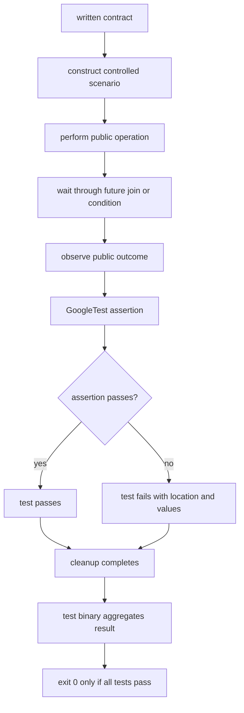
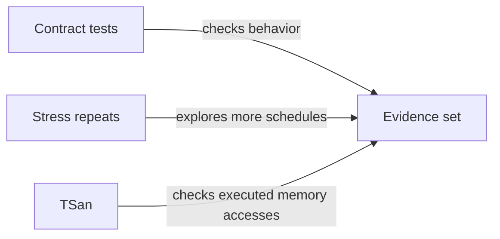
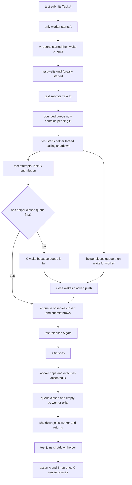
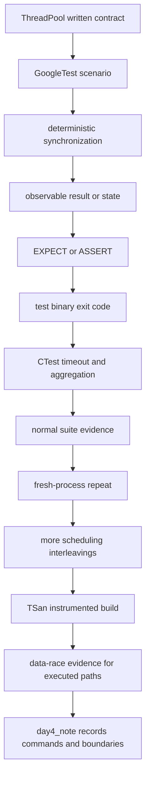

# Week8 Day4：怎样证明 ThreadPool 不只是 happy path 能跑

> 今日定位：不再给 ThreadPool 堆新功能，而是把 Day2、Day3 写下的 contract 变成会真实失败的 executable tests。
>
> 今日继续复用同一份 `include/thread_pool.hpp` 和 `tests/thread_pool_test.cpp`，不复制新的 ThreadPool 实现。

---

# Part 1：前情提要与必要术语

## 1. 从 Day3 接到今天

到 Day3 为止，ThreadPool 计划具备以下能力：

```text
fixed-size workers
bounded task queue
generic submit(function, args...)
future<R> result channel
callable return value / exception propagation
graceful shutdown
accepted tasks drain
workers join
post-shutdown submission rejection
```

但“代码看起来覆盖了这些分支”和“我们已经有证据证明这些 contract”不是一回事。

例如下面的程序会打印 `PASS`：

```cpp
#include <iostream>

int main() {
    const int actual = 41;
    const int expected = 42;

    if (actual != expected) {
        std::cout << "FAIL: expected 42, got " << actual << '\n';
    }

    std::cout << "PASS\n";
    return 0;
}
```

它实际上失败了，却仍然：

```text
打印 PASS
return 0
让 shell / CI 认为 executable 成功
```

所以今天不是“把测试输出写得更漂亮”，而是建立一条可靠链：

```text
written contract
-> controlled scenario
-> observable outcome
-> assertion
-> test case pass/fail
-> test binary exit code
-> CTest / shell 能判断整个验证是否成功
```

---

## 2. 今日最终产出是干什么的

今天有三个产出：

```text
tests/thread_pool_test.cpp
    把 ThreadPool contract 写成 GoogleTest test cases

CMakeLists.txt
    描述怎样构建 test executable、链接 GoogleTest、注册 CTest tests

day4_note.md
    记录 normal / repeat / TSan 三类证据和真实问题
```

输入、输出和执行主体：

```text
输入：ThreadPool public API、test scenario、expected behavior
执行：GoogleTest test binary 创建和使用真实 ThreadPool objects
输出：每个 test 的 assertion result、整个 executable 的 exit code
额外工具：CTest 组织 tests；TSan 检查已执行路径上的 data race
```

今天成功的含义不是“所有 concurrency bugs 从此被数学证明不存在”，而是：

```text
每条核心 contract 都有针对性测试
错误能让 test fail
关键 lifecycle scenario 被确定性地建立
重复运行扩大 scheduling interleavings
TSan 检查已执行路径上的 data race
不同证据的能力边界被写清楚
```

---

## 3. 必要术语

### 3.1 contract

`contract`：契约。

它描述 component 对 caller 承诺的行为，以及 caller 必须遵守的使用边界。

例如：

```text
worker_count == 0 -> constructor throws invalid_argument
submit accepted -> returned future eventually becomes ready
shutdown -> accepted tasks drain, workers join
submit after shutdown -> throws runtime_error
```

contract 不是 implementation 的逐行复述。测试应该从 public behavior 验证 contract，而不是依赖 private member 的具体排列。

---

### 3.2 executable test

`executable`：可执行的。

`executable test` 指可以真正编译运行、自动判断 expected 与 actual 是否一致的测试。

它不是：

```text
注释里写“这里应该等于 42”
手工看一眼终端输出
程序永远 return 0
只打印 ok 但没有 assertion
```

---

### 3.3 test framework

`framework`：框架。

`test framework` 提供 test registration、assertion、结果汇总、失败诊断和 exit code 管理等公共能力。

今天使用 `GoogleTest`，常写作 `GTest`。

GoogleTest 不替你设计 scenario，也不自动知道 ThreadPool 的正确 contract。它只负责运行你注册的 tests，并根据 assertions 汇总结果。

---

### 3.4 test binary

`binary`：这里指编译链接得到的可执行文件。

`thread_pool_test` 是 test binary：

```text
包含多个 TEST definitions
链接 GoogleTest 与 gtest_main
运行时执行 tests
有任意失败时返回 non-zero exit code
```

test binary 不是某一个 `TEST(...)`。一个 binary 中可以注册很多 tests。

---

### 3.5 test suite / test case

`test suite`：测试套件，用于组织一组相关 tests。

`test case`：一个具体 scenario 的测试。

GoogleTest 写法：

```cpp
TEST(ThreadPoolTest, ReturnsSubmittedValue) {
    // one test case
}
```

这里：

```text
ThreadPoolTest：test suite name
ReturnsSubmittedValue：test name
ThreadPoolTest.ReturnsSubmittedValue：完整 test identity
```

GoogleTest 官方文档在自己的术语中会把 `TEST()` 定义出来的单项称为 test；不要因为不同资料对 “test case” 的称呼略有差异而卡住。今天只要保证一个 test name 对应一个清晰 scenario。

---

### 3.6 assertion

`assertion`：断言。

它把 expected behavior 写成自动检查：

```cpp
EXPECT_EQ(actual, 42);
```

若条件不满足，GoogleTest 会记录 file、line、expected/actual 等诊断，并让该 test 失败。

assertion 不是 C++ `assert()` 宏的同义替代。GoogleTest assertions 属于 test framework，能汇总多个 tests；今天不使用 `NDEBUG` 可能关闭的普通 `assert()` 作为主要 test oracle。

---

### 3.7 test oracle

`oracle` 原义是“能给出答案的判定来源”。

`test oracle` 指：测试用什么规则判断 actual behavior 是否正确。

例如 exactly-once test 的 oracle 不能只是：

```text
最终 sum 看起来差不多
```

更强的 oracle 是：

```text
每个 accepted task 都有 unique ID
每个 ID 的 execution count 恰好为 1
没有 missing ID
没有 duplicate ID
没有 unexpected ID
```

---

### 3.8 deterministic test

`deterministic`：确定性的。

今天说 deterministic test，重点不是要求 OS scheduler 每次顺序完全相同，而是：

```text
测试的正确性判断不依赖猜测时间
目标状态由明确 synchronization 建立
expected behavior 不因机器快慢而改变
```

例如用 future、mutex、condition variable、join 和 queue state 建立完成关系；不要只写 `sleep(100ms)` 后猜 task 应该结束了。

---

### 3.9 happy path / edge case

`happy path`：一切输入和时序都顺利的正常路径。

`edge case`：边界场景。

ThreadPool happy path：

```text
construct -> submit one normal task -> get value -> shutdown
```

本周必须覆盖的 edges 包括：

```text
zero workers
zero tasks
many tasks
task exception
pending tasks during shutdown
repeated shutdown
submit after shutdown
concurrent submitters
destructor lifecycle
```

只测 happy path，最多说明最直的一条路径能跑。

---

### 3.10 unit test / component test / integration test

`unit test`：对较小单元做隔离验证。

`integration test`：验证多个对象或模块组合后的行为。

今天的 ThreadPool tests 同时涉及：

```text
ThreadPool
BlockingQueue
std::thread workers
future shared state
shutdown lifecycle
```

严格分类时，它更接近 component/integration-level tests，而不只是一个纯函数 unit test。今天不在命名分类上消耗时间，重点是每个 public contract 都有可执行 scenario。

---

### 3.11 stress test

`stress`：施加压力。

`stress test` 通过更多 tasks、submitters、重复次数或不同 scheduling interleavings 寻找偶发错误。

它可以提高发现概率，但不能证明：

```text
运行 100 次通过 -> 第 101 次绝不失败
没有观察到 race -> 程序没有 data race
没有卡住 -> deadlock 不可能发生
```

---

### 3.12 sanitizer / instrumentation

`sanitizer`：动态错误检测工具家族。

`instrumentation`：编译器在 program 中插入额外检测逻辑。

ThreadSanitizer build 不是普通 binary 外面套一个观察器。compiler 会对 memory access 与 synchronization 插桩，runtime 根据实际执行轨迹检测 data race。

代价是运行更慢、占用更多内存，所以 TSan binary 不用于 benchmark。

---

### 3.13 ThreadSanitizer / TSan

`ThreadSanitizer`，简称 `TSan`：线程消毒器，主要用于检测 data race。

它能帮助回答：

```text
本次真正执行到的路径中
是否观察到两个 threads 对同一 memory location 的冲突访问
且缺少有效 synchronization / happens-before
```

它不能单独证明：

```text
没有 deadlock
没有 lost task
没有 duplicate execution
shutdown contract 正确
future 与 task identity 没串
业务结果正确
所有可能路径都执行过
```

---

### 3.14 data race

当前层次先记：

```text
两个或更多 threads 并发访问同一 memory location
至少一个 access 是 write
这些 accesses 之间没有正确 synchronization relationship
```

在 C++ 中，data race 会带来 undefined behavior。

注意：

```text
所有 accesses 都改成 atomic
```

可能消除某个 data race，但不自动保证整体业务逻辑正确。比如两个 atomics 的组合 invariant 仍可能被破坏。

---

### 3.15 CMake

`CMake` 是 build system generator。

今天它读取 `CMakeLists.txt`，生成当前平台实际使用的 build files，再调用 compiler/linker 构建 targets。

它不是 compiler，也不是 GoogleTest。

当前流程：

```text
CMake configure/generate
-> build tool invokes g++
-> linker links ThreadPool test + GoogleTest + pthread
-> produces thread_pool_test binary
```

---

### 3.16 target

`target`：构建目标。

例如：

```cmake
add_executable(thread_pool_test tests/thread_pool_test.cpp)
```

创建名为 `thread_pool_test` 的 executable target。

后面的 include directories、warning flags、link libraries 都应附着在这个 target 上，而不是靠全局命令到处扩散。

---

### 3.17 CTest

`CTest` 是 CMake 配套的 test runner。

它不替代 GoogleTest：

```text
GoogleTest：定义和运行 C++ test cases
CTest：注册、调用 test executable，并汇总 pass/fail/timeout
```

`gtest_discover_tests` 可以让 CTest 从编译后的 GoogleTest binary 中发现每个 test。

---

### 3.18 fixture

`fixture`：测试夹具，表示多个 tests 共享的 setup/teardown 结构。

GoogleTest 对应 `TEST_F`。

今天先不用 fixture，因为 ThreadPool lifecycle 本身就应在每个 test 中清晰可见。等重复 setup 真正造成维护成本时再抽象，避免一开始把 ownership 藏进复杂 base class。

---

# Part 2：教程主体

# 教程开始：把一句 contract 变成能真实失败的 test

## 4. 测试的最小因果链

以 contract：

```text
submit 一个返回 42 的 task
-> future.get() 应得到 42
```

为例，一条完整 test 包含：

```text
Arrange：构造 ThreadPool 和输入
Act：submit task，并 get result
Assert：actual result == 42
Cleanup：shutdown / destructor 回收 workers
```

常见缩写是 `AAA`：

```text
Arrange
Act
Assert
```

但 concurrency component 还必须主动考虑 cleanup，因为一个提前退出的 test 可能留下 blocked workers 或 joinable threads。

流程图：



如果缺少 `Assert`，那只是运行 demo；如果失败后仍 exit 0，自动化工具也无法可靠判断。

---

## 5. 三类证据必须分开

### 5.1 deterministic GoogleTest

回答：

```text
给定明确 scenario，这条 contract 是否满足？
```

例如：

```text
submit after shutdown 是否 throw runtime_error
future 是否返回对应 value
每个 unique task ID 是否执行一次
```

### 5.2 stress repeat

回答：

```text
同一组 assertions 在更多 scheduling interleavings 下是否暴露偶发失败？
```

它仍依赖测试本身有正确 oracle。

### 5.3 TSan

回答：

```text
已执行路径中是否观察到 data race？
```

三者关系：



不能从其中任何一项推出另外两项的全部结论。

---

## 6. GoogleTest test binary 怎样运行

你在 source 中写：

```cpp
TEST(ThreadPoolTest, ReturnsSubmittedValue) {
    // assertions
}
```

宏会让这个 test 在 GoogleTest registry 中注册。

今天链接 `gtest_main`，因此不用自己写 `main()`。运行 binary 时：

```text
gtest_main 提供 main
-> initializes GoogleTest
-> RUN_ALL_TESTS
-> framework executes registered tests
-> assertions record pass/fail
-> framework prints summary
-> returns 0 only when test run succeeds
```

GoogleTest 不会自动扫描你磁盘上的所有 `.cpp`。只有被编译进当前 test target 的 test definitions 才会注册到这个 binary。

---

## 7. 你的 Ubuntu 当前环境

本教程生成时已通过 SSH 实际检查：

```text
Ubuntu compiler：g++ 10.5.0
CMake：3.16.3
libgtest-dev：尚未安装
apt candidate：1.10.0-2
TSan smoke test：通过
```

Ubuntu Focal 当前候选 `libgtest-dev` package 经临时下载检查，包含：

```text
/usr/include/gtest/gtest.h
/usr/lib/x86_64-linux-gnu/libgtest.a
/usr/lib/x86_64-linux-gnu/libgtest_main.a
```

今天开始学习时先安装：

```bash
sudo apt update
sudo apt install libgtest-dev
```

安装后检查：

```bash
dpkg -s libgtest-dev
test -f /usr/include/gtest/gtest.h && echo header-ok
test -f /usr/lib/x86_64-linux-gnu/libgtest.a && echo library-ok
```

不要在项目仓库中复制一份 `/usr/src/gtest` 源码，也不要同时混用 apt、手工编译和 `FetchContent` 三种来源。当前环境先选择 apt package + CMake `find_package(GTest REQUIRED)`，依赖来源保持单一。

---

## 8. 第一个独立 GoogleTest demo

这段代码不测试 ThreadPool，只让你看清 `TEST`、assertion 和 test binary。

程序目的：

```text
定义 add function
注册两个 tests
一个检查 equality
一个检查 boolean condition
由 gtest_main 提供 main
```

```cpp
#include <gtest/gtest.h>

int add(int left, int right) {
    return left + right;
}

TEST(AddTest, ReturnsSumOfTwoPositiveValues) {
    EXPECT_EQ(add(20, 22), 42);
}

TEST(AddTest, ResultCanBeComparedAsBooleanCondition) {
    EXPECT_TRUE(add(1, 1) == 2);
    EXPECT_FALSE(add(1, 1) == 3);
}
```

直接编译：

```bash
g++ -std=c++17 -Wall -Wextra -g -pthread \
    add_test.cpp -lgtest -lgtest_main -o add_test

./add_test
echo $?
```

预期：

```text
2 tests passed
exit code 0
```

故意把第一个 expected 改成 `43` 再运行：

```text
assertion 显示 actual/expected 差异
test binary exit code non-zero
```

这个错误实验很重要。只看成功输出，无法证明 failure 真的能传递给 shell。

---

## 9. `TEST` 宏

header：

```cpp
#include <gtest/gtest.h>
```

使用形态：

```cpp
TEST(TestSuiteName, TestName) {
    // scenario and assertions
}
```

参数：

```text
TestSuiteName：组织相关 tests 的 suite name
TestName：当前具体 behavior/scenario name
```

返回值：没有供你接收的 runtime return value；宏定义并注册一个 test function。

命名建议：

```cpp
TEST(ThreadPoolTest, RejectsSubmissionAfterShutdown)
TEST(ThreadPoolTest, DrainsAcceptedTasksDuringShutdown)
TEST(ThreadPoolTest, PropagatesTaskExceptionThroughFuture)
```

避免：

```cpp
TEST(ThreadPoolTest, Test1)
TEST(ThreadPoolTest, Works)
TEST(ThreadPoolTest, Normal)
```

好名字应同时告诉你：

```text
什么对象
什么场景
expected behavior
```

---

## 10. `EXPECT_EQ`、`EXPECT_TRUE`、`EXPECT_FALSE`

### 10.1 `EXPECT_EQ`

使用形态：

```cpp
EXPECT_EQ(actual, expected);
```

作用：检查两边可用 `==` 比较且结果相等。

最小例子：

```cpp
const int result = 40 + 2;
EXPECT_EQ(result, 42);
```

它会分别计算参数一次。不要让 test correctness 依赖两个参数之间的 evaluation order。

对 `std::string`：

```cpp
std::string result = "thread-pool";
EXPECT_EQ(result, std::string("thread-pool"));
```

对两个 `const char*` 使用 `EXPECT_EQ` 比较的是 pointer value，不是 C string contents。今天 ThreadPool result 优先使用 `std::string`，不扩展 C string assertion。

### 10.2 `EXPECT_TRUE`

```cpp
EXPECT_TRUE(condition);
```

最小例子：

```cpp
EXPECT_TRUE(future.valid());
```

但要注意：`future.valid()` 只表示关联 shared state，不表示已经 ready。不要写出错误 oracle。

### 10.3 `EXPECT_FALSE`

```cpp
EXPECT_FALSE(condition);
```

最小例子：

```cpp
const bool duplicate_found = false;
EXPECT_FALSE(duplicate_found);
```

若存在更直接的 equality assertion，优先让诊断显示 actual value：

```cpp
EXPECT_EQ(hits[id], 1);
```

通常比：

```cpp
EXPECT_TRUE(hits[id] == 1);
```

更容易定位失败。

---

## 11. `EXPECT_*` 与 `ASSERT_*` 的区别

GoogleTest assertions 成对出现：

```text
EXPECT_*：non-fatal failure，记录失败后继续当前 test function
ASSERT_*：fatal failure，记录失败并立即结束当前 test function
```

“fatal” 在这里不是结束整个 process，也不是取消其他 tests。它主要是停止当前 test function。

### 11.1 什么时候用 `ASSERT_*`

若后续语句依赖前置条件，否则会 invalid access：

```cpp
ASSERT_FALSE(values.empty());
EXPECT_EQ(values.front(), 42);
```

如果 vector 为空还继续 `front()`，行为无效，所以前置条件失败后不应继续。

### 11.2 concurrency test 的 cleanup 风险

假设 tasks 正在等待 `release == true`，测试中途：

```cpp
ASSERT_EQ(started, worker_count);
```

若 assertion 失败，当前 test function 立即返回。接下来 local objects 开始析构；若 ThreadPool destructor 等待仍被 gate 挡住的 tasks，而 test 已经跳过 release，就可能卡住。

所以并发 lifecycle test 要先设计：

```text
无论 assertion 是否通过，谁负责 release gate
谁 join helper thread
谁让 pool 能正常 shutdown
```

当前建议：

```text
先建立和记录 actual state
确保所有 gates released、threads joined、pool 可析构
再做不会破坏 cleanup 的 assertions
```

不要因为 `ASSERT_*` 看起来“更严格”就全部替换 `EXPECT_*`。

---

## 12. `EXPECT_THROW` / `ASSERT_THROW`

使用形态：

```cpp
EXPECT_THROW(statement, ExceptionType);
ASSERT_THROW(statement, ExceptionType);
```

它验证 `statement` 抛出指定 type 的 exception。

### 12.1 constructor boundary

```cpp
EXPECT_THROW(ThreadPool(0, 8), std::invalid_argument);
```

这里验证 zero worker contract。

### 12.2 post-shutdown submission

```cpp
ThreadPool pool(2, 8);
pool.shutdown();

EXPECT_THROW(
    pool.submit([] { return 42; }),
    std::runtime_error
);
```

这里的 exception 来自 submission stage。

### 12.3 future exception propagation

```cpp
auto result = pool.submit([]() -> int {
    throw std::runtime_error("expected failure");
});

EXPECT_THROW(result.get(), std::runtime_error);
```

这里的 exception 来自 execution stage，先被 packaged task 存进 shared state，再由 `future.get()` 重新抛出。

注意：`EXPECT_THROW` 检查的是 exception type，不自动检查 `what()` text。今天先验证 type 与 worker survival；复杂 exception matcher 不进入主线。

---

## 13. 为什么 assertions 尽量放在 test thread

不要在 pool worker task 内直接写：

```cpp
pool.submit([] {
    EXPECT_EQ(...);
});
```

今天推荐：

```text
worker task：计算 result 或更新受同步保护的 observable state
test thread：通过 future.get / join 等待 completion
test thread：执行 GoogleTest assertions
```

原因：

```text
test ownership 更清楚
assertion failure 不会和 worker lifecycle/cleanup 纠缠
跨线程 assertion 支持存在平台和用法边界
future 已经提供自然的 result/exception channel
```

例如：

```cpp
auto result = pool.submit([] {
    return 6 * 7;
});

EXPECT_EQ(result.get(), 42);
```

比让 worker 自己调用 `EXPECT_EQ` 更容易解释和维护。

---

## 14. 从 contract 写出 scenario 的固定方法

每条 test 先写四问：

```text
1. 要验证哪一句 public contract？
2. 怎样确定性建立目标 state？
3. 哪个 observable value/state 是 oracle？
4. 失败时 test binary 怎样得到 non-zero result？
```

再补 cleanup：

```text
5. assertion 失败后怎样避免 blocked worker / joinable thread？
```

不要先写一堆 threads，再回头猜它究竟验证了什么。

---

# Round 1：到这里停止阅读，先为自己的 ThreadPool 写第一版 tests

你现在已经知道 GoogleTest 的基本运行链、常用 assertions，以及怎样从 public contract 写出 scenario。先不要继续看第 15 节之后的确定性同步、exactly-once oracle 和 shutdown gate 设计。

Round1 使用这些 canonical files：

```text
include/blocking_queue.hpp      已有 component，不在今天重写
include/thread_pool.hpp         Day3 最终 component
tests/thread_pool_test.cpp      今天主要修改的 executable tests
week8/day4/day4_note.md         记录 test design 与证据缺口
```

`tests/thread_pool_test.cpp` 的程序用途不是再实现一个 pool，而是：

```text
创建真实 ThreadPool
-> 只通过 public API 建立 scenario
-> 在 test thread 观察 value / exception / lifecycle outcome
-> assertion 把错误变成 test failure
-> test binary 用 non-zero exit status 把 failure 交给外部工具
```

第一轮暂时不用先写完整 CMake。先直接得到一个能运行的 GoogleTest binary：

```bash
cd ~/code/system-learning/cpp/week8
mkdir -p build
g++ -std=c++17 -Wall -Wextra -g -pthread \
  -Iinclude tests/thread_pool_test.cpp \
  -lgtest_main -lgtest \
  -o build/thread_pool_test
./build/thread_pool_test
```

这里链接 `gtest_main`，因此 test source 不需要自己写 `main()`。若你的发行版没有预编译 library，先按第 7 节已经给出的 Ubuntu 环境步骤处理，不要靠复制未知来源的 `.a` 文件解决。

Round1 的输入和输出很明确：

```text
输入：每个 TEST 中写死的小型 controlled scenario
输出：GoogleTest pass/fail summary + process exit status
成功：所有 assertions 通过，binary exit 0
失败：任一 assertion/uncaught exception 使 binary non-zero，hang 不能算通过
```

只根据 Day3 最终 public contract，独立选择并实现第一批 tests。最低覆盖：

```text
constructor 参数边界
返回 int / void 的 task
task exception 通过 future 传播
shutdown 后 submission 被拒绝
多个 tasks 最终完成
```

每个 test 在动手前先写五行草稿：

```text
contract
Arrange
Act
Assert / oracle
Cleanup
```

这一轮不要求测试设计已经完美。你可以暂时使用自己想到的同步方法，但要在 `day4_note.md` 标出：

```text
哪一条 test 依赖 sleep 或 scheduling 运气？
哪一条只能证明总数，不能证明 exactly once？
哪一条失败时可能无法 cleanup？
```

先让 test binary 能编译、能出现真实 pass/fail，再阅读后半部分强化它。

**阅读闸门：第一版 test suite 尚未运行前，停在这里。**

---

# Round 2：用确定性、oracle 和 cleanup 审查第一版 tests

下面的内容不是让你照抄一套固定 tests，而是用来审查第一版证据哪里太弱、哪里可能自己挂住。

## 15. 完成关系优先使用 future，不使用 sleep

如果测试只需要知道某个 result task 是否完成：

```cpp
auto result = pool.submit([] {
    return 42;
});

EXPECT_EQ(result.get(), 42);
```

`get()` 建立：

```text
task 未完成 -> test thread waits
task value/exception ready -> test thread resumes
```

不需要：

```cpp
std::this_thread::sleep_for(std::chrono::milliseconds(100));
```

sleep 只表示 test thread 暂停了一段 wall-clock time，不表示 worker 一定运行到某一行。

---

## 16. exactly-once 不能只检查总和

错误例子：

```text
100 tasks，每个加 1
final counter == 100
```

如果一个 task 漏执行，另一个 task 重复执行，总数仍可能是 100。

更强设计：

```text
为每个 task 分配 unique ID：0..N-1
准备 N 个 hit counts，初始为 0
task i 在 mutex 保护下增加 hits[i]
保存每个 task 的 future
test thread get 所有 futures
最后逐项 EXPECT_EQ(hits[i], 1)
```

这能区分：

```text
hits[i] == 0：missing
hits[i] == 1：exactly once
hits[i] > 1：duplicate
```

不要使用 `std::vector<std::atomic<int>>` 只是为了显得高级。当前用一个 mutex 保护普通 vector，ownership 和 oracle 更容易解释。

---

## 17. 怎样确定性建立“shutdown 时仍有 pending tasks”

仅仅：

```text
submit 100 tasks
立刻 shutdown
```

不能证明 shutdown 开始时真的还有 pending tasks。快机器上 tasks 可能已经完成。

今天使用 gate 构造目标 state。

### 17.1 对象配置

```text
ThreadPool：1 worker，queue capacity = 1
Task A：worker 取到后等待 release gate
Task B：进入 queue，成为确定的 pending task
Task C：用来观察 close 后 submission rejection
```

### 17.2 完整流程



上图中 test 启动 helper 后就调用 C，但不能假装 scheduler 一定让 helper 先完成 close。这里有两个合法 interleavings：

```text
close 先线性化
-> C 直接观察 closed 并被拒绝

C 先进入 enqueue，看到 open + full
-> C 在 not_full 上等待
-> helper close 必须 notify blocked push
-> C 醒来观察 closed 并被拒绝
```

因此 `EXPECT_THROW` 返回本身就是一个同步证据：此刻 C 已经观察到 closed，而 A 仍被 gate 挡住、B 仍 pending。然后 test 才 release A，才能严格证明“B 在 close 时 pending，随后被 drain”。

不要把 C 移到 `helper.join()` 之后：`shutdown()` 是 blocking operation，必须先 release A 才可能 join；如果 helper 在 release A 后才获得调度，B 可能在 close 前已经执行完，反而失去 pending-at-close 的证明。

这里：

```text
A waiting：确定 worker 被占用
B in queue：确定存在 accepted pending task
C rejected：证明 shutdown 已关闭 acceptance
A release 前 C 已返回：证明 close 已线性化且 B 仍 pending
A release：让 drain 能继续
B executed：证明 accepted pending task 没被丢弃
```

整个正确性不依赖固定 sleep。

### 17.3 gate 用什么实现

今天可以复用 Week7 的：

```text
mutex
condition_variable
bool started
bool release
```

Task A：

```text
lock gate mutex
started = true
notify test
wait until release == true
unlock and finish
```

test thread：

```text
wait until started == true
之后再提交 B
```

不要引入新的 `std::promise` 组合，避免与 Day3 的 future 主线混在一起。

---

## 18. multiple concurrent submitters 怎样建立 oracle

目标 contract：多个 caller threads 同时 submit 时，accepted tasks 不丢、不重复，results 不串。

推荐 identity：

```text
submitter 0 owns IDs [0, K)
submitter 1 owns IDs [K, 2K)
...
```

每个 submitted callable 返回自己的 unique ID。

每个 submitter thread：

```text
只写自己预先分配的 future container
不与其他 submitter push 同一个 vector
```

test thread：

```text
join all submitter threads
get all futures
验证每个 future 返回对应 ID
验证 ID set 没有 missing/duplicate/unexpected
```

这里至少有两层 synchronization：

```text
submitter thread join：保证 future containers 已写完
future.get：保证对应 worker task 已完成
```

不要让多个 submitter 无锁 `push_back` 同一个 `std::vector<std::future<int>>`，那会让 test code 自己产生 data race。

---

## 19. destructor lifecycle 怎样从 public behavior 验证

你不能从 test 直接访问 private `workers_` 来检查 `joinable()`，否则 test 与 implementation layout 耦合。

可以验证 public outcome：

```text
在 outer scope 声明 future
进入 inner scope 构造 pool
submit accepted task，将 future move 到 outer scope
不显式调用 shutdown
离开 inner scope，pool destructor 运行
scope 成功退出后调用 future.get
result 必须正确
```

若 destructor contract 正确：

```text
accepted task 已 drain
workers 已 join
destructor 才返回
```

这个 test 不能证明 private vector 的每一行实现，但它验证了 caller 真正依赖的 lifecycle behavior。

CTest timeout 可以让意外 hang 变成可见 failure，但 timeout 本身不是 lifecycle 正确性的证明。

---

## 20. task exception test 要证明两件事

只写：

```cpp
EXPECT_THROW(failing_future.get(), std::runtime_error);
```

证明了异常传播 type，但还没有证明 worker/pool 仍存活。

完整 scenario：

```text
submit failing task
submit later normal task
failing future.get -> runtime_error
later future.get -> expected normal value
```

这样同时验证：

```text
exception 与对应 future 关联
worker execution flow 没被 user exception 终止
pool 仍能处理后续 work
```

Day3 已说明 generic packaged task 的 user exception 通常被 shared state 保存，因此不要再要求旧的 `failed_task_count` 必然为每个 future exception 加一。

Day3 的 canonical contract 已决定删除 public `failed_task_count()`。因此迁移 Day2 tests 时必须同步删除 `failed_task_count == 0/1` assertions；Day4 用 `future.get()` 观察业务 exception，并用 later task result 证明 worker/pool 仍可继续工作。不要保留一个名称仍叫“failed task count”、实际却只统计 unexpected wrapper failure 的悬空 API。

### 20.1 empty `std::function` 是 API 演进回归场景

Day2 的 `submit(Task)` 可以在 submission stage 用 `!task` 立即拒绝 empty `std::function<void()>`。Day3 改成 generic submit 后，本教程选择的新 contract 是：

```text
empty std::function 被 queue accepted
-> worker 调用时抛 std::bad_function_call
-> packaged_task 将异常存入 shared state
-> future<void>.get() 重新抛出
-> later normal task 仍能完成
```

Day4 必须为这条显式变化保留 test，防止 API 重构后仍沿用 Day2 的 `invalid_argument` assertion，或完全漏掉该边界。

---

## 21. repeated shutdown 与 concurrent shutdown 不要混写

Week8 当前 contract 是：

```text
sequential repeated shutdown：支持且安全
multiple threads concurrently call shutdown：本阶段不承诺
shutdown called from worker task：本阶段不支持
```

所以 repeated test 应写：

```text
same owner thread calls shutdown
then calls shutdown again
both return normally
```

不要把它擅自升级成十个 threads 同时 shutdown，然后把失败归咎于 implementation 没满足从未声明的 contract。

---

## 22. ThreadPool contract 到 test name 的映射

建议最小矩阵：

| Contract | Suggested test name | Core oracle |
|---|---|---|
| zero worker rejected | `RejectsZeroWorkerCount` | `invalid_argument` |
| zero tasks can stop | `ShutsDownWithoutTasks` | returns without hang |
| one value result | `ReturnsSubmittedValue` | future result |
| void task completion | `CompletesVoidTask` | synchronized side effect |
| many tasks exactly once | `ExecutesEachAcceptedTaskExactlyOnce` | each ID hit == 1 |
| task exception | `PropagatesTaskExceptionAndKeepsPoolAlive` | throw + later result |
| empty std::function | `PropagatesBadFunctionCallAndKeepsPoolAlive` | future throws + later result |
| shutdown drains | `DrainsAcceptedPendingTaskDuringShutdown` | deterministic gate |
| repeated shutdown | `AllowsSequentialRepeatedShutdown` | both calls return |
| post-shutdown submit | `RejectsSubmissionAfterShutdown` | runtime_error |
| concurrent submitters | `AcceptsTasksFromMultipleSubmitters` | all IDs/results exact |
| destructor lifecycle | `DestructorDrainsAndJoinsWorkers` | scope exits + future result |

表格只是 test design map，不是完整 test source。每个 scenario 仍需要你自己写 Arrange / Act / Assert / Cleanup。

---

## 23. 最小 CMake 主线

CMake 分成三个阶段：

```text
configure/generate
-> build
-> test
```

### 23.1 configure/generate

```bash
cmake -S . -B build -DCMAKE_BUILD_TYPE=Debug
```

参数：

```text
-S .：source tree 在当前目录
-B build：generated build tree 放入 build/
-DCMAKE_BUILD_TYPE=Debug：当前单配置 generator 使用 Debug flags
```

这一步读取 `CMakeLists.txt`，检查 dependency，并生成 build files；它通常不等于已经编译完 executable。

### 23.2 build

```bash
cmake --build build -j
```

作用：使用上一步生成的 build system 编译和链接 targets。

### 23.3 test

从 project root 使用：

```bash
cmake -E chdir build ctest --output-on-failure
```

`cmake -E chdir build ...` 表示让 CMake 先把该 command 的 working directory 切到 `build/`，再执行后面的 `ctest`；command 结束后，不会改变你当前 interactive shell 的目录。这样后续 `./build/thread_pool_test` 仍明确以 project root 为起点。

`--output-on-failure`：通过时保持简洁，失败时显示 test output。

也可以直接运行 binary：

```bash
./build/thread_pool_test
```

二者作用不同：

```text
direct binary：查看 GoogleTest 原生运行与 flags
CTest：统一调用 registered tests，并处理 timeout/汇总
```

---

## 24. CMake directives 的最小例子

下面是独立 `add_test.cpp` demo 的完整 CMake，不是 ThreadPool 最终答案。

```cmake
cmake_minimum_required(VERSION 3.16)

project(gtest_minimal LANGUAGES CXX)

set(CMAKE_CXX_STANDARD 17)
set(CMAKE_CXX_STANDARD_REQUIRED ON)
set(CMAKE_CXX_EXTENSIONS OFF)

enable_testing()
find_package(GTest REQUIRED)

add_executable(add_test add_test.cpp)

target_compile_options(add_test PRIVATE
    -Wall
    -Wextra
    -g
)

# CMake 3.16 的 FindGTest imported target names。
target_link_libraries(add_test PRIVATE
    GTest::GTest
    GTest::Main
)

include(GoogleTest)
gtest_discover_tests(add_test
    PROPERTIES TIMEOUT 10
)
```

### 24.1 `cmake_minimum_required`

```cmake
cmake_minimum_required(VERSION 3.16)
```

声明本项目至少需要哪个 CMake version，并选择相应 policy behavior。这里与 Ubuntu 实测 `3.16.3` 对齐。

### 24.2 `project`

```cmake
project(gtest_minimal LANGUAGES CXX)
```

声明 project name 与使用 C++ language。

### 24.3 C++ standard

```cmake
set(CMAKE_CXX_STANDARD 17)
set(CMAKE_CXX_STANDARD_REQUIRED ON)
set(CMAKE_CXX_EXTENSIONS OFF)
```

当前含义：要求 C++17，不允许静默降级，不依赖 GNU-only language extensions。

### 24.4 `find_package`

```cmake
find_package(GTest REQUIRED)
```

让 CMake 查找已安装 GoogleTest。`REQUIRED` 表示找不到就让 configure 明确失败，而不是后面在 include/link 阶段给更难读的错误。

### 24.5 `add_executable`

```cmake
add_executable(add_test add_test.cpp)
```

创建 executable target，并列出 source files。

### 24.6 `target_compile_options`

```cmake
target_compile_options(add_test PRIVATE -Wall -Wextra -g)
```

只把 warning/debug options 附着到 `add_test` target。`PRIVATE` 表示这些 options 不作为使用要求传播给依赖当前 target 的其他 targets。

### 24.7 `target_link_libraries`

```cmake
target_link_libraries(add_test PRIVATE
    GTest::GTest
    GTest::Main
)
```

当前 CMake 3.16 `FindGTest` 提供的 imported target names 是：

```text
GTest::GTest：GoogleTest framework library
GTest::Main：GoogleTest 提供的 main
```

较新资料常出现 `GTest::gtest` / `GTest::gtest_main`；那是较新 CMake/package configuration 中的 names。今天按你的实际 CMake 3.16 环境使用旧 names，不把两个版本混写。

### 24.8 `gtest_discover_tests`

```cmake
include(GoogleTest)
gtest_discover_tests(add_test PROPERTIES TIMEOUT 10)
```

作用：build 后运行 test binary 的 test-listing mode，发现其中注册的 GoogleTest tests，并分别注册给 CTest。

`TIMEOUT 10` 是每个 discovered CTest test 的 timeout property。它让 hang 最终成为 failure，而不是让终端永久等待。

---

## 25. ThreadPool CMakeLists 需要你完成什么

今天实际 project 的 target 应该：

```text
minimum CMake 3.16
project language CXX
C++17 required
enable_testing
find GTest REQUIRED
find Threads REQUIRED
build tests/thread_pool_test.cpp as thread_pool_test
add include/ to private include path
enable -Wall -Wextra -g
link GTest::GTest, GTest::Main, Threads::Threads
discover tests
set timeout
```

你需要自己把这些 requirements 写进 project root `CMakeLists.txt`。不要直接复制成多个：

```text
CMakeLists_day4.txt
CMakeLists_final.txt
CMakeLists_new.txt
```

### 25.1 `find_package(Threads REQUIRED)`

CMake 不直接把 Linux pthread flags 写死在跨平台 target relationship 中，而是提供：

```cmake
find_package(Threads REQUIRED)
```

然后链接：

```cmake
Threads::Threads
```

在当前 Linux/g++ 环境中，它会表达 thread library 的 compile/link requirements。

### 25.2 include directory

若 test 中写：

```cpp
#include "thread_pool.hpp"
```

target 需要知道在 project `include/` 中查找：

```cmake
target_include_directories(thread_pool_test PRIVATE
    ${CMAKE_CURRENT_SOURCE_DIR}/include
)
```

这不是把 header 复制到 `tests/`。

---

## 26. 怎样只运行一个 test

先列出 binary 中注册的 tests：

```bash
./build/thread_pool_test --gtest_list_tests
```

只运行一个：

```bash
./build/thread_pool_test \
    --gtest_filter=ThreadPoolTest.DrainsAcceptedPendingTaskDuringShutdown
```

参数：

```text
--gtest_list_tests：只列 names，不真正执行 test bodies
--gtest_filter=...：只执行匹配的 tests
```

这对定位 lifecycle hang 很有用。先让最小 failing scenario 稳定复现，再运行整套 suite。

---

## 27. stress repeat 怎样做

### 27.1 单 process repeat

GoogleTest 提供：

```bash
./build/thread_pool_test --gtest_repeat=50
```

它在同一个 process 中重复 test run。

### 27.2 fresh process repeat

```bash
for i in $(seq 1 50); do
    ./build/thread_pool_test || exit 1
done
```

它每轮启动 fresh process。

今天推荐至少保留第二种证据，因为：

```text
每轮 address space / process lifecycle 重新建立
任意一轮 non-zero 立即停止
命令含义容易解释
```

repeat 不是把一个没有 assertions 的 demo 运行 50 次。每轮必须真实检查 contract。

---

## 28. TSan build 为什么必须单独目录

普通 Debug 和 TSan 的 compile/link flags 不同。不要在同一个 `build/` 中反复切换，避免 cache 与 objects 混杂。

建议：

```text
build/       -> normal Debug tests
build-tsan/  -> TSan instrumented tests
```

CMake 中可以增加一个简单 option：

```cmake
option(ENABLE_TSAN "Build with ThreadSanitizer" OFF)

if(ENABLE_TSAN)
    target_compile_options(thread_pool_test PRIVATE
        -O1
        -fsanitize=thread
        -fno-omit-frame-pointer
    )
    target_link_options(thread_pool_test PRIVATE
        -fsanitize=thread
    )
endif()
```

这段只展示 sanitizer flags 怎样同时进入 compile 和 link。你需要把它放在 `thread_pool_test` target 创建之后。

构建运行：

```bash
cmake -S . -B build-tsan \
    -DCMAKE_BUILD_TYPE=Debug \
    -DENABLE_TSAN=ON

cmake --build build-tsan -j
cmake -E chdir build-tsan ctest --output-on-failure
```

也可以直接 g++ 验证：

```bash
g++ -std=c++17 -Wall -Wextra -g -O1 -pthread \
    -fsanitize=thread -fno-omit-frame-pointer \
    -Iinclude tests/thread_pool_test.cpp \
    -lgtest -lgtest_main \
    -o thread_pool_test_tsan

./thread_pool_test_tsan
```

不要拿 TSan runtime 结果与之后 `-O2` benchmark 数字比较。

---

## 29. 怎样读一份 TSan data race report

典型报告会包含：

```text
WARNING: ThreadSanitizer: data race
Write of size ... by thread T1
    stack frame ...
Previous read/write ... by thread T2
    stack frame ...
Location is ...
Thread T1 created at ...
```

分析顺序：

```text
1. 找 Location：冲突的是哪个 object/member/memory address
2. 看 current access：哪个 thread 在 read/write，stack 到哪一行
3. 看 previous access：另一个 thread 在哪一行 read/write
4. 至少一个是否是 write
5. 原设计声称哪把 mutex/哪个 atomic/happens-before 保护它
6. 两条 stack 是否真的经过同一 synchronization protocol
7. 修 code 或 test code
8. 先重跑 targeted test，再跑 full suite 和 repeat
```

常见情况：

```text
report 指向 ThreadPool source -> component synchronization 可能错误
report 指向 test hit vector -> test 自己可能无锁并发写
report 指向 referenced object -> std::ref lifetime/synchronization 可能错误
```

不要第一反应就加 suppression。先判断是不是 test 真正暴露的 bug。

---

## 30. TSan clean 到底证明了多少

正确表述：

```text
在本次 TSan build 实际执行到的 paths 和 observed interleavings 中，
没有收到 TSan data-race report。
```

错误表述：

```text
ThreadPool 已被证明完全线程安全
shutdown 不可能 deadlock
所有 tasks 一定 exactly once
```

原因：

```text
TSan 是 dynamic analysis，只看实际执行路径
没执行到的 branch 没有证据
atomic logical bug 未必是 data race
lost wakeup/deadlock/lost task 需要其他 oracle
```

官方文档也明确把 TSan 定位为 data-race detector；它通过 compiler instrumentation 与 runtime 工作，并会带来明显性能和内存开销。

---

## 31. timeout 的作用与边界

CTest test property：

```text
TIMEOUT 10
```

表示某个 test 超过限制后由 runner 终止并标记失败。

它能把：

```text
永远 hang
```

变成：

```text
自动化可见的 timeout failure
```

但 timeout 数字不是 synchronization：

```text
test 在 9 秒内完成
```

不等于 lifecycle 正确。正常完成仍需 future、condition、join 和 assertions 建立因果链。

TSan 较慢，若 normal timeout 太紧，可以为 sanitizer build 调整 test timeout；不要因此在 test body 中增加一堆 sleep。

---

## 32. failure diagnosis 的建议顺序

若整套 tests 偶发失败：

```text
1. 记录失败 test full name
2. 用 --gtest_filter 单独运行
3. 区分 assertion failure / exception / crash / timeout
4. 读 expected 与 actual identity
5. 检查 scenario 是否真的建立目标 state
6. 检查 test 自己有无 data race / dangling reference
7. normal targeted test 重复
8. TSan targeted test
9. 修复后 full suite
10. full suite repeat
```

不要看到 concurrency failure 就随机加 sleep。sleep 可能只改变 scheduler，让 bug 暂时消失。

---

## 33. 今日完整证据链



读图只抓：

> 先用 deterministic tests 证明具体 contract，再用 repeat 和 TSan 扩大动态证据；后两者不能替代前者。

---

# Part 3：收尾、练习、测试与验收

# Round 3：补齐工程证据并运行完整验证

## 34. Round3 最终 test project 复检

Round1 已经得到第一个可运行的 GoogleTest binary。这里才把它升级为完整 CMake/CTest/TSan 证据集，不要求重写已经正确的 basic tests。

### 34.1 canonical files 复检

继续使用 canonical project：

```text
include/blocking_queue.hpp
include/thread_pool.hpp
tests/thread_pool_test.cpp
CMakeLists.txt
week8/day4/day4_note.md
```

今天主要新增 tests 与 build entry。除非 test 暴露真实 bug，否则不要为了配合测试随意改 ThreadPool public behavior。

---

### 34.2 test program 最终职责复检

`tests/thread_pool_test.cpp` 要把 ThreadPool 的 public contract 变成 executable evidence：

```text
创建真实 pool objects
用真实 submit/future/shutdown/destructor API 建立场景
在 test thread 观察 values/exceptions/lifecycle outcomes
让错误通过 GoogleTest assertion 变成 test failure
让任意 test failure 变成 test binary non-zero exit code
```

它不负责：

```text
重新实现 ThreadPool
访问 private worker vector
用 sleep 猜完成顺序
用日志人工判断 PASS
做性能 benchmark
```

---

### 34.3 CMakeLists.txt 是干什么的

它要描述：

```text
使用 C++17
构建 thread_pool_test target
为 target 提供 include path
启用 warnings/debug info
链接 GoogleTest 与 Threads
让 CTest 发现每个 GoogleTest test
为 hang 设置 timeout
可选择单独构建 TSan target configuration
```

它不下载生产依赖，也不把所有 compiler flags 写成全局字符串。

---

## 35. 必做 test scenarios

你需要自己写 test bodies。本教程只给 scenario、oracle 和 cleanup boundary。

### 35.1 construct boundary

```text
Arrange：worker_count = 0，合法 capacity
Act：construct
Assert：invalid_argument
```

### 35.2 zero-task shutdown

```text
Arrange：construct pool，不 submit
Act：shutdown
Assert：call returns；第二次 sequential shutdown 也能 return
```

若 implementation hang，由 CTest timeout 让 failure 可见。

### 35.3 single value result

```text
submit callable returning int/string
future.get equals expected
```

Day3 已有多 result types 时，不需要在 Day4 重写所有语法 demo；把现有 contract 转成 GoogleTest assertions。

### 35.4 void result

```text
task 修改受正确 synchronization 保护的 state
future<void>.get returns
test thread checks side effect
```

### 35.5 many tasks exactly once

```text
unique IDs
mutex-protected hit vector
future for every task
get all futures
each hit count exactly 1
```

### 35.6 task exception and worker survival

```text
failing task future.get -> runtime_error
later normal task future.get -> expected value
```

### 35.7 empty `std::function` regression

```text
submit default-constructed std::function<void()>
future<void>.get -> std::bad_function_call
submit later normal task
later future.get -> expected value
```

这验证 Day3 明确选择的 generic-submit contract，并证明该 execution failure 不会终止 worker。

### 35.8 deterministic drain during shutdown

按第 17 节的：

```text
1 worker
capacity 1
Task A blocked at gate
Task B accepted and pending
helper calls shutdown
test submits Task C；它要么直接观察 close，要么先因 full 等待再被 close 唤醒
Task C throws 后，close 已确定线性化且 A 仍 blocked、B 仍 pending
release A
join helper
assert A/B once, C zero
```

### 35.9 submit after shutdown

```text
shutdown returns
new submit -> runtime_error
```

### 35.10 multiple concurrent submitters

```text
multiple caller threads
disjoint ID ranges
per-submitter future containers
join submitters
get and verify all results
```

### 35.11 destructor lifecycle

```text
future lives outside pool scope
pool scope ends without explicit shutdown
destructor must drain/join
future result remains observable
```

---

## 36. test source 编写边界

今天允许使用：

```text
TEST
EXPECT_EQ / EXPECT_TRUE / EXPECT_FALSE
ASSERT_EQ / ASSERT_TRUE / ASSERT_FALSE when continuation is invalid
EXPECT_THROW / ASSERT_THROW
future.get
mutex / condition_variable gates
thread join
unique task IDs
```

今天不需要：

```text
TEST_F fixture
parameterized tests
mock framework
death tests
custom matchers
private-member access hacks
random sleep-based scheduling
```

---

## 37. 建议完成顺序

```text
1. 安装并检查 libgtest-dev
2. 独立编译运行 add_test demo
3. 故意制造 assertion failure，确认 exit code non-zero
4. 写 project CMakeLists.txt
5. 先迁移 single result / exception tests
6. 补 empty std::function 的 future exception regression
7. 补 construct、zero-task、repeated shutdown
8. 补 unique-ID exactly-once
9. 补 deterministic drain gate
10. 补 concurrent submitters
11. 补 destructor lifecycle
12. normal CTest full suite
13. direct binary filter targeted tests
14. fresh-process repeat 50 次
15. separate build-tsan
16. 读 TSan output 并记录能力边界
```

若某个 test 卡住，先 filter 单项；不要让整套 suite 每次都陪它等 timeout。

---

## 38. normal build 与运行命令

从 project root：

```bash
rm -rf build
cmake -S . -B build -DCMAKE_BUILD_TYPE=Debug
cmake --build build -j
```

检查 warning：

```text
ThreadPool source 零 warning
test source 零 warning
CMake configure 没有缺失 dependency
```

运行：

```bash
./build/thread_pool_test
cmake -E chdir build ctest --output-on-failure
```

若 binary path 因 generator 不同而变化，以 CMake build output 为准，不手工复制 executable。

---

## 39. repeat 与 TSan 命令

fresh-process repeat：

```bash
for i in $(seq 1 50); do
    ./build/thread_pool_test || exit 1
done
```

TSan：

```bash
rm -rf build-tsan
cmake -S . -B build-tsan \
    -DCMAKE_BUILD_TYPE=Debug \
    -DENABLE_TSAN=ON
cmake --build build-tsan -j
cmake -E chdir build-tsan ctest --output-on-failure
```

记录时分开写：

```text
normal CTest：多少 tests passed
repeat：多少 complete process runs passed
TSan：哪些 tests 执行；是否有 WARNING: ThreadSanitizer
```

不要只写一句“全部测试过了”。

---

## 40. 失败时先检查 test 本身

并发 test 很容易自己制造 bug：

```text
multiple threads push same vector without mutex
task captures local reference that already died
ASSERT early-return skipped gate release
helper thread 没 join
future get twice
test name says pending，但没有确定性建立 pending
只检查 sum，遗漏/重复互相抵消
```

发现 failure 时先回答：

```text
是 component 违反 contract？
还是 test scenario/oracle/synchronization 自己不正确？
```

两者都必须修，但不能把 test code 的 data race 误判成 ThreadPool bug。

---

## 41. day4_note 建议

创建：

```text
week8/day4/day4_note.md
```

建议结构：

```markdown
# Week8 Day4 Note

## 1. GoogleTest execution chain

TEST registration -> gtest_main -> assertions -> binary exit code

## 2. EXPECT 与 ASSERT 的边界

## 3. 我怎样确定性建立 pending-task shutdown

## 4. exactly-once oracle

## 5. normal test evidence

命令：
结果：

## 6. stress repeat evidence

命令：
次数：
结果：

## 7. TSan evidence

命令：
结果：
TSan 能证明什么：
TSan 不能证明什么：

## 8. 我遇到的失败与修复
```

你若已经通过 test names、代码、terminal evidence 清楚证明某个验收问题，不需要再机械抄一遍答案。

---

## 42. 今日验收问题

1. 为什么打印 `FAIL` 后仍 `return 0` 的程序不能作为可靠 automated test？
2. `EXPECT_*` 与 `ASSERT_*` 分别怎样影响当前 test function？为什么 blocked-worker test 中滥用 `ASSERT_*` 可能破坏 cleanup？
3. GoogleTest、test binary、CTest 三者分别负责什么？
4. 请串起 deterministic drain test：怎样确定 A 正在运行、B 已 pending、shutdown 已 close acceptance，以及最后怎样证明 B 被 drain？
5. 为什么 exactly-once 不能只检查 final sum？unique task ID 提供了什么更强 oracle？
6. deterministic tests、stress repeat、TSan 分别提供哪一类证据？TSan clean 为什么不能证明没有 deadlock/lost task？
7. 为什么 assertions 推荐在 test thread 做，而 worker task 只返回 result 或更新受同步保护的 observable state？

---

## 43. 今日通过标准

### 核心通过

```text
GoogleTest/CMake 环境可用
test binary failure 会产生 non-zero exit code
test names 能说清 scenario + expected behavior
核心 ThreadPool contract 均有 executable assertions
Day2 到 Day3 改变的 empty-task contract 有明确 regression test
pending-task shutdown 由 gate 确定性建立
exactly-once 使用 unique IDs，不只检查 sum
tests 不依赖固定 sleep 猜顺序
```

### 工程证据

```text
C++17 + Wall + Wextra 零 warning
normal CTest full suite PASS
fresh-process repeat 至少 50 次 PASS
TSan build 能运行且无 data-race report
CTest tests 有 timeout，hang 会成为 failure
day4_note 分开记录三类证据
```

### 不阻塞 Day4

```text
没有 fixture
没有 parameterized tests
没有 mock framework
没有 coverage report
没有 CI pipeline
没有 benchmark
没有证明所有 concurrency bugs 不存在
```

---

## 44. 今日压缩记忆

```text
contract 只有变成 scenario + observable outcome + assertion，才成为 executable evidence。

GoogleTest 判断具体 behavior；
stress repeat 扩大 scheduling interleavings；
TSan 检查已执行路径上的 data race。

三类证据互相补充，但不能互相替代。

并发测试先确定性建立目标 state，再断言；
不要用 sleep 猜顺序，也不要让测试代码自己产生 race。
```

下一天进入 AsyncLogger V1：将日志 record 的生产与 file I/O 分离。Day5 会复用今天形成的测试纪律，但不会继续扩展 GoogleTest 高级功能。

---

## 45. 今日参考资料

本教程按你的 Ubuntu `CMake 3.16.3` 环境使用对应版本文档和 target names：

- [GoogleTest Primer](https://google.github.io/googletest/primer.html)
- [GoogleTest Assertions Reference](https://google.github.io/googletest/reference/assertions.html)
- [CMake 3.16 FindGTest](https://cmake.org/cmake/help/v3.16/module/FindGTest.html)
- [CMake 3.16 GoogleTest module](https://cmake.org/cmake/help/v3.16/module/GoogleTest.html)
- [LLVM ThreadSanitizer documentation](https://clang.llvm.org/docs/ThreadSanitizer.html)
- [Ubuntu Focal libgtest-dev package](https://launchpad.net/ubuntu/focal/amd64/libgtest-dev)

这些资料用于核对 API、CMake 3.16 imported target names、test discovery 与 TSan 能力边界；今天不要求通读完整高级文档。
