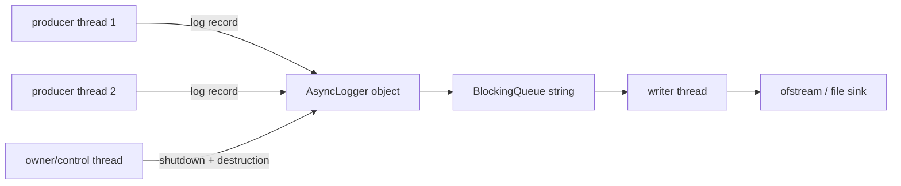
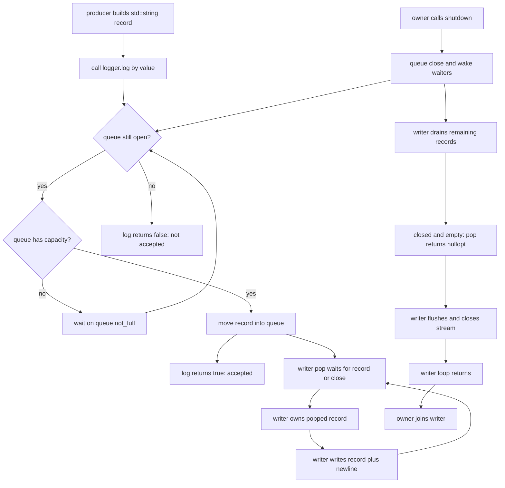
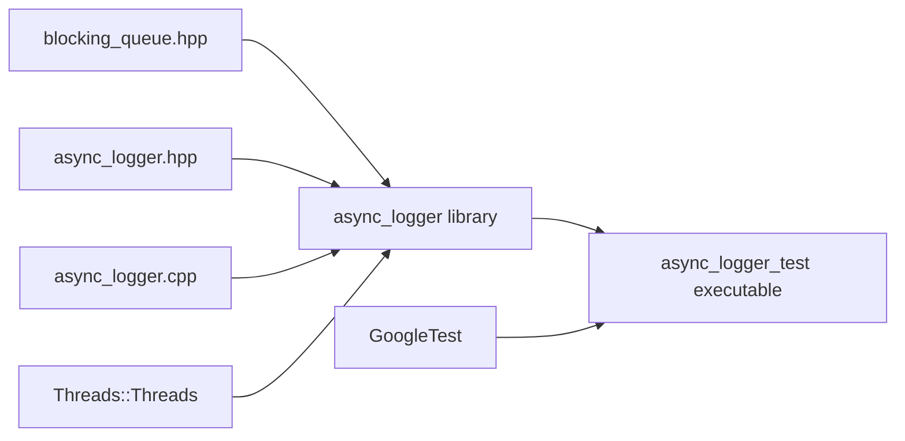

# Week8 Day5：日志 I/O 为什么要和业务 execution flow 分开

> 今日定位：从已经完成设计的 `BlockingQueue<T>` 与 ThreadPool 测试纪律，进入第二个并发组件 `AsyncLogger V1`。
>
> 今天只建立 `producer -> bounded queue -> single writer -> file` 的完整主线、ownership 和基本 lifecycle。Day6 再专门处理受控 backpressure、复杂 shutdown 交错、完整 lifecycle tests 与 benchmark。

---

# Part 1：前情提要与必要术语

## 1. 从 Day4 接到今天

Week8 前四天围绕的是 task lifecycle：

```text
submitter
-> task queue
-> ThreadPool worker
-> result / exception shared state
-> future
```

Day4 又把 ThreadPool 的 written contract 变成了 GoogleTest、repeat 和 TSan 能检查的 executable evidence。

今天不继续给 ThreadPool 堆功能，而是复用已经掌握的并发骨架，解决另一种工作：

```text
业务 execution flow 产生 log record
-> logger 接受 record
-> background writer 将来执行 file I/O
```

两者的共同点：

```text
都有 producer
都有 bounded BlockingQueue
都有 background execution flow
都有 close / drain / join
都必须说明 accepted work 在 shutdown 时怎样处理
```

两者的区别：

```text
ThreadPool：多个 workers 执行彼此独立的 tasks
AsyncLogger：一个 writer 串行写同一个 output stream

ThreadPool result：通常由每个 future 单独观察
AsyncLogger result：通常形成一个顺序文件，并由组件级状态反映 I/O failure
```

当前 Day1~Day4 教程已经提前生成，不等于已经学习或验收。Day5 只依赖这些教程最终会按顺序完成，不修改真实进度。

---

## 2. 今天从哪个问题出发

先看最直接的同步日志思路：

```cpp
void handle_request(const std::string& request) {
    do_business_work(request);
    output << "handled: " << request << '\n';
    output.flush();
}
```

如果多个 threads 都这样写，同一个业务调用可能同时承担：

```text
等待 stream mutex
格式化 record
把 bytes 交给 stream buffer
触发底层 file write
等待 flush
处理 I/O error
```

于是 caller latency 中混进了 logging latency：

```text
业务函数何时返回
不仅取决于业务计算
还可能取决于日志锁竞争和 file I/O
```

这不是说 synchronous logging 一定错误。日志很少、程序很小、错误发生后必须立刻写出时，同步方案可能更简单。

今天要解决的是另一种需求：

> 让多个业务 execution flows 主要负责提交 records，由一个 background writer 负责串行 file I/O，同时保留 bounded memory、明确 backpressure 和可解释 shutdown。

---

## 3. 今天最终要造什么

今天的产出：

```text
include/async_logger.hpp
src/async_logger.cpp
tests/async_logger_test.cpp
更新同一个 project-root CMakeLists.txt
week8/day5/day5_note.md
```

`AsyncLogger V1` 的程序用途：

```text
输入：多个 producers 提交的 std::string log records
中转：bounded BlockingQueue<std::string>
执行：一个 logger-owned background writer thread
输出：一个由 writer 串行写入的 text file
关闭：停止接受新 records，drain 已接受 records，flush/close stream，join writer
```

正常使用场景：

```text
main creates logger
-> business threads call log(record)
-> logger accepts records into queue
-> writer pops and writes records
-> business threads stop using logger
-> owner calls shutdown
-> logger drains and joins
-> owner reads final result / destroys logger
```

今天的成功标准不是“做出生产级日志库”，而是：

```text
所有权清楚
只有 writer 访问 output stream
log() 的 true/false 含义清楚
close/drain/flush/close-file/join 顺序清楚
accepted records 在正常 I/O 下 exactly once 出现在文件中
open failure 与 post-shutdown log 有明确结果
basic GoogleTest 与 TSan 能真实失败或报告
```

---

## 4. 必要术语

### 4.1 logging

`logging` 来自 `log`，这里指程序把运行事件记录成可供之后观察的 records。

日志不是业务数据本身，也不是自动生成的正确性证明。它主要帮助回答：

```text
哪个 execution flow 做了什么
什么时候进入某个 lifecycle stage
哪一个 operation 失败
程序退出前已经处理到哪里
```

### 4.2 log record

`record`：一条记录。

今天一个 `std::string` object 就代表一个 log record。logger 会在写出时为每个 record 追加一个 `\n`，因此测试输入使用不含换行符的单行 records。

要区分：

```text
record object：C++ 中的一项数据
record bytes：最终交给 output stream 的字符
physical line：文件中以 '\n' 分隔的一行
```

V1 不做 level、timestamp、source location 和复杂 formatter。

### 4.3 producer

`producer`：生产者。

今天指调用 `logger.log(record)` 的 execution flow。可能是 main thread，也可能是 ThreadPool workers。

producer 负责生成并提交 record，不直接写 logger 的 `std::ofstream`。

### 4.4 writer

`writer`：写入者。

今天特指 AsyncLogger 拥有的唯一 background thread。它不断从 queue `pop()` records，然后访问 output stream。

`writer` 不是文件，也不是 queue；它是执行 writer loop 的 execution flow。

### 4.5 sink

`sink`：接收日志输出的目的地。

今天唯一的 sink 是一个普通文件。以后 sink 也可能是 stderr、socket 或其他 logging backend，但当前不扩展。

### 4.6 synchronous / asynchronous

`synchronous`：同步的。今天表示 caller 自己完成主要 file-writing work 后才返回。

`asynchronous`：异步的。今天表示：

```text
producer 提交 record 的 execution flow
与 writer 执行 file I/O 的 execution flow
不是同一个
```

它不自动意味着：

```text
log() 永远立即返回
每条日志一定更快
返回时 record 已写入文件
系统崩溃后 record 一定存在
```

bounded queue 满时，blocking policy 会让 producer 等待，这正是 backpressure。

### 4.7 serialization

`serialization` 在今天不是“对象序列化格式”，而是把多个 concurrent write attempts 变成一个 writer 的顺序操作：

```text
many producers
-> one ordered queue
-> one writer
-> one stream
```

这样 output stream 不需要被多个业务 threads 同时访问。

### 4.8 backpressure

`backpressure`：背压。

当 producers 产生 records 的速度长期大于 writer 消费速度时，系统不能假装无限内存存在。bounded queue 满后，今天的 policy 是让 `log()` 阻塞等待空间，或者在 shutdown close queue 后返回 `false`。

它解决的是：

```text
不能无限积压 records
```

它带来的代价是：

```text
producer latency 仍可能因为 queue full 而上升
```

Day6 再受控观察这个现象；今天先把 contract 写准。

### 4.9 accepted / written / flushed / durable

这是今天最重要的一组边界：

```text
accepted：record 已成功进入 logger-owned queue
written：writer 已把 record 交给 output stream
flushed：stream buffer 已执行 synchronization request
durable：即使 system crash/reboot，数据仍满足所要求的持久性保证
```

四者不是同一个时刻：

```text
accepted
-> writer later pops
-> written
-> stream flush
-> possible OS/filesystem/device persistence work
```

今天的 `log() == true` 只承诺 accepted。

今天的 final `flush()` 也不承诺 durable。durability 需要更底层、明确的 persistence contract；本日不实现。

### 4.10 buffer / flush

`buffer`：缓冲区。output operations 可能先把 bytes 放进用户态 stream buffer，而不是每次 `<<` 都直接完成一次独立磁盘写入。

`flush`：冲刷/同步当前 stream buffer。`std::ostream::flush()` 会请求关联的 stream buffer 执行同步。

它不等于 Linux `fsync(fd)`。

### 4.11 truncate / append

`truncate`：截断。打开文件时清空旧内容，从新的空文件开始写。

`append`：追加。每次 write 位于文件末尾，保留旧内容。

今天选择 `std::ios::trunc`，因为 unit test 需要 deterministic output；生产日志常用 append，但那会引入历史文件、rotation 和多次进程运行等额外问题。

---

## 5. 复用你已经验收的 BlockingQueue

Ubuntu 中的 canonical source：

```text
~/code/system-learning/cpp/week7/day5/blocking_queue.hpp
```

真实 public API 是：

```cpp
explicit BlockingQueue(std::size_t capacity);
bool push(T value);
std::optional<T> pop();
void close();
```

它已经提供：

```text
capacity > 0 invariant
bounded blocking push
blocking pop
close 后拒绝 push
closed-with-data 继续 pop/drain
closed-and-empty 返回 std::nullopt
close 唤醒 blocked producers/consumers
sequential repeated close
```

因此今天不要在 `AsyncLogger` 中再写一套：

```text
queue mutex
not_empty_cv
not_full_cv
closed flag
```

那会制造两份 shutdown protocol，并让 AsyncLogger 同时承担“日志组件”和“重写队列”的责任。

当前 queue 的 `pop()` 从 front 构造一个 `T value`。对今天的 `std::string` 能正确工作；是否进一步优化 move path 不属于 Day5 主线。

---

## 6. 从 Day4 继承下来的测试纪律

Day5 不应退回：

```text
运行后人工看一眼文件
打印 PASS 但 process 总是 return 0
固定 sleep 猜 writer 已写完
只检查 line count，不检查内容和重复
```

今天继续使用 Day4 建立的链：

```text
written contract
-> controlled scenario
-> observable file/result
-> GoogleTest assertion
-> test binary exit code
-> CTest / TSan evidence
```

等待 logger 完成的主要同步证据是 `shutdown()` 返回，因为它必须在 join writer 后返回。不要用 `sleep(1)` 代替 lifecycle contract。

---

# Part 2：教程主体

# 教程开始：先独立实现，再用 ownership 与 lifecycle 复盘

# Round 1：到这里停止阅读，先独立写出 AsyncLogger V1

你已经知道今天要解决的问题、复用的 BlockingQueue API，以及最终文件必须可验证。先不要看下面的 ownership map、状态机、single-writer 理由和 shutdown 算法。

本轮新增和修改：

```text
include/async_logger.hpp         声明 public interface；你自己设计 private state
src/async_logger.cpp             实现 file open、log、writer lifecycle 与 shutdown
tests/async_logger_test.cpp      只通过 public API 验证最终文件与 lifecycle
CMakeLists.txt                   增加 AsyncLogger source/test targets
week8/day5/day5_note.md          记录 V1 设计和真实问题
```

不要复制 `blocking_queue.hpp`，继续 include canonical component。

### Round1 程序用途

三个代码文件从外部形成：

```text
test/producer 提供 output path、capacity 和 string records
-> AsyncLogger 接受或拒绝 records
-> background writer 把 accepted records 写入指定 file
-> shutdown 返回后 test 读取 file
-> exact content 正确则通过，否则 test failure
```

本轮只给最小 public contract：

```cpp
AsyncLogger(std::string output_path, std::size_t capacity);
~AsyncLogger();

bool log(std::string record);
bool shutdown();
```

### Round1 文件 API 工具箱

这些例子只教 file stream 的基本调用，不包含 AsyncLogger 的线程控制流。

打开并截断 output file：

```cpp
#include <fstream>

std::ofstream output("logger_api_demo.txt",
                     std::ios::out | std::ios::trunc);
if (!output.is_open()) {
    // open failed
}
```

写入、检查、刷新和关闭：

```cpp
output << "record-7" << '\n';
if (!output) {
    // a write operation has failed
}

output.flush();
const bool flush_ok = static_cast<bool>(output);
output.close();
```

`flush()` 只要求把 C++ stream buffer 交给下层，不等于 `fsync` durability。

shutdown 后读取最终文件：

```cpp
#include <fstream>
#include <string>

std::ifstream input("logger_api_demo.txt");
std::string line;
while (std::getline(input, line)) {
    // test records one complete line
}
```

不要在 writer 仍可能写文件时，把暂时读不到的行判成最终丢失。

### Round1 编译入口

在 CMake target 完成前，可先直接编译第一版：

```bash
cd ~/code/system-learning/cpp/week8
g++ -std=c++17 -Wall -Wextra -g -pthread \
  -Iinclude src/async_logger.cpp tests/async_logger_test.cpp \
  -lgtest_main -lgtest \
  -o build/async_logger_test
./build/async_logger_test
```

外部可观察需求：

```text
constructor 打开一个新的 output file；失败时报告错误
多个 producers 可以调用 log
log true 表示该 record 已被 logger 接受
后台 execution flow 把 accepted records 写成一行一条
shutdown 停止接受新 records，并在返回前处理完已接受 records
shutdown 后 log 返回 false
destructor 不留下仍访问 logger members 的 thread
```

先独立决定：

```text
哪些 objects 是 members
谁拥有 output stream
writer 从哪里退出
log 与 shutdown 共享哪些状态
怎样让 tests 在 shutdown 后检查文件
```

完成一个能通过“单 producer 顺序写入、多 producer 不丢不重、shutdown 后拒绝”三个基本场景的 V1。若你暂时没处理 file runtime failure、queue 满时 shutdown 或 repeated shutdown，先把它们记作疑问，不要提前读答案。

**阅读闸门：AsyncLogger V1 尚未编译运行前，停在这里。**

---

# Round 2：拿 V1 对照 ownership、状态机与关闭竞态

下面开始揭示完整设计问题。每节先检查你的代码已经如何处理，再决定是修 bug、补 contract，还是明确写成 V1 limitation。

## 7. 今天的 ownership map

先把 objects 放对位置：



逐项解释：

```text
producer：调用 log 前拥有自己的 input string
log parameter：以 value 接收 record，建立本次调用自己的 object
queue：push 成功后拥有 queued string
writer：pop 成功后拥有当前 local record
ofstream：AsyncLogger member，只有 writer 访问其 write/flush/close operations
thread object：AsyncLogger member，表示并控制 background writer 的 joinable lifecycle
owner：负责保证所有 producers 不再访问 logger 后才销毁 logger
```

特别注意：

```text
AsyncLogger owns writer thread object
不等于 AsyncLogger 可以在 writer 仍运行时直接析构其他 members
```

destructor 必须先完成 close/drain/join，之后 members 才能按反向声明顺序销毁。

---

## 8. 概念状态与真实状态

可以用三个概念状态理解 V1：

```text
RUNNING：queue open，可以接受 records，writer 可能 waiting/writing
DRAINING：queue closed，不再接受 records，writer 继续消费已有 records
STOPPED：queue closed-and-empty，writer 已 flush/close stream 并退出，thread 已 join
```

V1 不一定需要额外写一个 `enum class State`。这些状态可由现有对象关系体现：

```text
queue close state
queue remaining records
writer loop 是否返回
thread object 是否已经 join
```

不要为了“看起来像状态机”复制一份与 queue 可能不一致的 `running_` flag。

---

## 9. 先看 synchronous logging 的完整路径

假设两个 business threads 直接共享同一个 output stream。为了不发生 data race，至少需要一个 mutex：

```text
producer creates record
-> lock stream mutex
-> output << record << '\n'
-> maybe flush
-> unlock
-> producer continues business work
```

mutex 能保护 stream shared state，却不能消除 I/O latency：

```text
waiting for mutex
+ writing/flushing under mutex
= caller-visible logging latency
```

如果每个 producer 都持锁执行 slow I/O，其他 producers 也会排在这个 mutex 后面。

AsyncLogger 的变化不是“删除等待”，而是移动责任：

```text
producer 主要等待 queue capacity
writer 独占承担 stream I/O
```

当 writer 跟得上时，producer 往往只做 record construction + queue handoff；当 writer 跟不上时，bounded queue 用 backpressure 暴露真实容量限制。

---

## 10. AsyncLogger 的完整主线



读图先抓五件事：

```text
1. true 表示 accepted，不是 written
2. queue full 时 producer 可以 blocking
3. writer 只有一个，所以 stream write 被串行化
4. close 不会删除已接受 records，writer 继续 drain
5. shutdown 返回前必须 join writer
```

---

## 11. normal `log()` 的对象转移

建议接口：

```cpp
bool log(std::string record);
```

为什么使用 by-value parameter：

```text
logger 需要最终拥有 accepted record
caller 传 lvalue：先 copy 到 parameter
caller 传 rvalue：parameter 可以 move-construct
parameter 再 move 进入 BlockingQueue::push(T value) 的 ownership path
```

今天真实 queue 的 `push` 本身也是 by value，因此完整路径可能包含不止一次 move/copy。先保证 ownership 正确，不在 Day5 为减少每一次 move 重写 queue API。

返回值：

```text
true：record 已被 queue 接受，ownership 已进入 logger
false：queue 已 close，该 record 没有被发布给 writer
```

`false` 不表示 caller 的原对象一定保持原值。若 caller 使用：

```cpp
logger.log(std::move(message));
```

即使最终因 close 返回 `false`，`message` 也可能已经是 moved-from，因为 by-value parameter 在发现失败前已经构造。

这与 Week7 `BlockingQueue::push(T value)` 的失败 ownership 边界相同。

---

## 12. queue full 时到底是谁在等

假设：

```text
capacity = 2
queue already has A, B
writer currently writing an earlier record
producer P calls log(C)
```

状态轨迹：

```text
P enters BlockingQueue::push(C)
-> P obtains queue mutex
-> predicate closed || size < capacity is false
-> condition_variable wait releases queue mutex and blocks P

writer later pops A
-> queue size becomes 1
-> writer notifies not_full

P wakes and reacquires queue mutex
-> predicate is true
-> C enters queue
-> log(C) returns true
```

所以 asynchronous logging 不是“producer 永远不阻塞”。它把主要 slow sink work 移到 writer，但保留 bounded-resource policy。

如果这时 owner `close()` queue：

```text
blocked producer wakes
-> sees closed
-> push returns false
-> log returns false
```

Day6 会用 gate/小 capacity 确定性观察；今天只需要能手推。

---

## 13. 为什么只允许一个 writer 访问 stream

single writer 的核心收益不是“thread 越少越快”，而是 ownership 简单：

```text
ofstream write state 只属于 writer
record order 只由 one queue + one consumer 决定
flush/close 也由 writer 完成
shutdown thread 不与 writer 同时访问 stream
```

如果 producers 自己写 stream，即使加 mutex，也需要所有 producers 共同遵守同一锁规则；一处忘锁就可能产生 data race 或交错 output。

如果多个 logger writers 写同一个 stream，还需要新的 stream mutex，并重新定义 output order、flush ownership 和 shutdown coordination。

今天的明确 invariant：

> Constructor 在 writer 启动前完成 stream open；writer 启动后直到退出，只有 writer execution flow 调用 stream 的 write、flush 和 close operations。

owner 的 `shutdown()` 只 close queue、join writer，再读取 writer 已经完成的 result；不在 writer 活着时调用 `output_.flush()`。

---

## 14. FIFO 能保证什么，不能保证什么

BlockingQueue 是 FIFO：先成功进入 queue 的 record 先被 writer pop。

一个 producer 连续调用：

```text
log("A")
log("B")
log("C")
```

在没有其他特殊失败时，它自己的 submission order 是 A、B、C。

多个 producers 时：

```text
P1 prepares A
P2 prepares B
```

不能只凭 wall-clock 感觉断言 A 一定先入队。真正顺序取决于两个 push operations 谁先在线性化点完成入队。

因此 V1 承诺：

```text
file order == successful queue order
同一 producer 的 sequential successful calls 保持 program order
不同 producers 的 total order 由实际 synchronization interleaving 决定
```

V1 不承诺：

```text
业务事件真实发生时间的全局排序
不同 CPU 上 timestamp 完全可比较
按 producer ID 排序
```

---

## 15. `std::ofstream` 是什么

`ofstream` 是 `output file stream`：面向文件输出的 C++ stream type。

头文件：

```cpp
#include <fstream>
```

最小独立例子：

```cpp
#include <fstream>
#include <iostream>

int main() {
    std::ofstream output("ofstream_demo.log",
                         std::ios::out | std::ios::trunc);

    if (!output.is_open()) {
        std::cerr << "open failed\n";
        return 1;
    }

    output << "first record" << '\n';
    output.flush();

    if (!output) {
        std::cerr << "write or flush failed\n";
        return 1;
    }

    output.close();
    if (!output) {
        std::cerr << "close failed\n";
        return 1;
    }

    return 0;
}
```

当前读法：

```text
open with out|trunc
-> verify is_open
-> write bytes and newline
-> flush stream buffer
-> verify stream state
-> close file
-> verify stream state again
```

### 15.1 `is_open()`

```cpp
bool is_open() const;
```

作用：询问 file stream 当前是否成功关联一个打开的 file。

重要边界：默认情况下，`std::ofstream` open failure 通常设置 stream failure state，不一定自动抛 exception。因此 constructor 不能只写 open 后就直接启动 writer，必须检查 `is_open()` 或 stream state，再把 failure 变成明确的 `std::runtime_error`。

### 15.2 `std::ios::out | std::ios::trunc`

`openmode` 是 bitmask，可以用 `|` 组合：

```text
out：打开用于 output
trunc：若文件已存在，打开时截断旧内容
```

今天用 `trunc` 让每次 test 从空文件开始。

不要混淆：

```text
app：每次 write 前定位到末尾
ate：刚打开时定位到末尾，之后仍可 seek
trunc：清空旧内容
```

### 15.3 `operator<<` 与 `write`

今天使用：

```cpp
output << record << '\n';
```

它适合当前 text records。

以后若写固定 byte count 或 binary record，可学习：

```cpp
output.write(data, count);
```

Day5 不扩展 binary format。

### 15.4 为什么用 `'\n'`，不用 `std::endl`

`std::endl` 不只输出 newline，还会 flush stream。

若每条 record 都强制 flush：

```text
writer 很难利用 buffering
I/O synchronization 次数可能增加
benchmark 条件也会改变
```

今天用：

```cpp
output << record << '\n';
```

在 shutdown drain 完成后统一 flush。

---

## 16. `flush` 为什么不等于 durability

C++ stream 视角：

```text
output.flush()
-> calls associated stream buffer synchronization operation
-> failure updates stream error state
```

Linux 文件路径可以先建立第一层模型：


今天只能承诺：

```text
writer 在退出前请求 stream synchronization
并检查 stream failure state
```

不能承诺：

```text
power loss 后一定存在
system crash 后目录项和文件数据一定 durable
```

Linux `fsync(fd)` 才是面向 file descriptor 的持久化 system call；它也有 metadata、directory entry 和 filesystem/device 边界。Day5 使用标准 C++17 `ofstream`，不为了 durability 重新切回 POSIX fd logger。

压缩记忆：

```text
log true != written
written != flushed
flushed != durable
```

---

## 17. Constructor 顺序为什么很关键

AsyncLogger constructor 需要完成：

```text
1. construct bounded queue
2. open output stream
3. verify file open success
4. start writer thread
```

绝不能先启动 thread，再检查 stream：

```text
writer may run immediately
-> access stream before constructor has validated it
-> constructor then reports failure
-> partially started execution flow becomes hard to clean up
```

推荐 member declaration dependency order：

```cpp
BlockingQueue<std::string> queue_;
std::ofstream output_;
bool write_failed_{false};
std::thread writer_;
```

C++ 按 member **声明顺序** 初始化，不按 initializer list 的书写顺序。

析构时反过来：

```text
writer_
write_failed_
output_
queue_
```

但 destructor body 会在 members 自动析构前执行，所以必须先 `shutdown()`，让 writer join 后，才允许后续 member destruction。

### 17.1 为什么 thread 在 constructor body 最后启动

可以先让 queue/output/bool/thread object 全部完成 construction，检查 output open 成功，再启动：

```cpp
writer_ = std::thread(&AsyncLogger::writer_loop, this);
```

这个 API 的最小独立形态：

```cpp
#include <thread>

class WorkerOwner {
public:
    WorkerOwner() {
        worker_ = std::thread(&WorkerOwner::run, this);
    }

    ~WorkerOwner() {
        if (worker_.joinable()) {
            worker_.join();
        }
    }

private:
    void run() {}
    std::thread worker_;
};
```

这只是 member-function thread API 演示，不是 AsyncLogger 完整答案。真实 logger 还需要 queue close 才能让 waiting writer 退出。

### 17.2 constructor failure boundary

```text
capacity == 0
-> BlockingQueue constructor throws invalid_argument
-> no writer started

file open fails
-> AsyncLogger checks is_open
-> throws runtime_error
-> no writer started

std::thread creation fails
-> thread constructor throws system_error
-> already constructed queue/output members are destroyed
```

关键设计是：成功启动 writer 之后，constructor 不再执行新的容易抛异常的工作。

---

## 18. 为什么 AsyncLogger 禁止 copy，也暂时禁止 move

copy 明显不成立：

```text
不能复制 mutex/CV-based queue
不能复制 std::thread ownership
不能让两个 logger objects 同时认为自己拥有同一个 writer/file lifecycle
```

move 也不能只因为 `std::thread` 可 move 就默认允许。

writer thread 的 entry 可能保存原对象的 `this`：

```cpp
std::thread(&AsyncLogger::writer_loop, this)
```

若 logger object 在 writer 运行时被 move：

```text
thread still uses old this address
members may have moved to new object
-> lifetime/address contract breaks
```

所以 V1 明确删除：

```cpp
AsyncLogger(const AsyncLogger&) = delete;
AsyncLogger& operator=(const AsyncLogger&) = delete;
AsyncLogger(AsyncLogger&&) = delete;
AsyncLogger& operator=(AsyncLogger&&) = delete;
```

以后若真要 movable component，需要稳定 shared state 或“只能在未启动状态 move”等额外设计；今天不做。

---

## 19. `log()` 与 `shutdown()` 的 public contract

建议 V1 interface：

```cpp
class AsyncLogger {
public:
    AsyncLogger(std::string output_path, std::size_t capacity);
    ~AsyncLogger();

    AsyncLogger(const AsyncLogger&) = delete;
    AsyncLogger& operator=(const AsyncLogger&) = delete;
    AsyncLogger(AsyncLogger&&) = delete;
    AsyncLogger& operator=(AsyncLogger&&) = delete;

    bool log(std::string record);
    bool shutdown();

private:
    void writer_loop();
};
```

这只是 interface，不是 implementation。

### 19.1 `log(record)`

```text
thread-safe for multiple producers
may block while bounded queue is full
returns true only when record is accepted
returns false after/while shutdown closes queue
does not promise written/flushed/durable on return
```

### 19.2 `shutdown()`

```text
called by owner/control execution flow
closes acceptance
drains accepted records
waits for writer flush/close and exit
joins writer before return
sequential repeated calls are allowed
returns true if no stream write/flush/close failure was observed
returns false if writer observed I/O failure
```

今天不要求多个 threads concurrent 调用 `shutdown()`。`std::thread` object 的 `joinable/join` coordination 仍由一个 owner 串行负责。

### 19.3 destructor

```text
if caller forgot explicit shutdown
-> destructor performs final shutdown/join
```

但 destructor 无法把 `bool` status 返回给 caller。因此：

```text
需要观察 final I/O status 的正常路径：显式调用 shutdown()
只要求 lifetime safety 的兜底路径：destructor 自动 shutdown()
```

### 19.4 `write_failed_` 的 synchronization

writer 是唯一写 `write_failed_` 的 execution flow；owner 只在 `join()` 返回后读取它。

```text
writer stores write_failed_
-> writer returns
-> owner join returns
-> owner reads write_failed_
```

`join` 提供必要的 completion synchronization，所以这个受限 contract 下不需要为了一个 post-join result 强行改成 atomic。

若以后允许运行中查询 `healthy()`，就必须重新设计同步；今天不加这个 API。

---

## 20. writer loop 的职责，不给完整答案

writer loop 只做一条主线：

```text
repeat pop
    record available -> write record and '\n'
    stream failure -> remember failure, but continue draining queue
    nullopt -> queue is closed and empty, leave loop

flush stream
check stream state
close stream
check stream state
return
```

为什么 I/O failure 后仍继续 `pop()`：

```text
如果 writer 直接退出
-> queue may remain full
-> producers may block forever
-> shutdown cannot finish cleanly
```

V1 的保守 policy：

```text
remember failure
continue consuming/draining accepted records
final shutdown returns false
```

这不代表 failed records 成功保存，只是保证 component lifecycle 不因为 sink failure 自动卡死。

不要在 writer loop 中：

```text
访问 ThreadPool
启动更多 writers
每条 record 调 std::endl
拿着 queue internal mutex 执行 file I/O
让 exception 逃出 thread entry 导致 std::terminate
```

`BlockingQueue::pop()` 返回 local object 后已经释放 queue mutex；file write 在 queue critical section 之外发生。

---

## 21. shutdown 的完整因果链

```text
owner has stopped/joins all producer threads that may call log
    |
    v
owner calls AsyncLogger::shutdown
    |
    +--> queue.close()
    |       |
    |       +--> acceptance closes
    |       +--> blocked producers wake and return false
    |       +--> blocked writer wakes
    |
    +--> if writer thread is joinable: join()
            |
            v
writer continues pop existing records
            |
            v
queue becomes closed-and-empty
            |
            v
pop returns nullopt
            |
            v
writer flushes and closes output stream
            |
            v
writer_loop returns
            |
            v
join returns to owner
    |
    v
shutdown returns final I/O status
```

关键不是背函数名，而是回答：

```text
谁停止 acceptance：owner through queue.close
谁 drain records：writer
谁 flush/close stream：writer
谁等待 writer：owner through join
谁最终销毁 members：AsyncLogger destructor path after join
```

---

## 22. `close`、`drain`、`flush`、`join` 各自等待什么

| operation | 操作对象 | 主要作用 | 不代表什么 |
|---|---|---|---|
| queue `close()` | BlockingQueue | 停止新 push，唤醒 waiters | writer 已退出 |
| drain | queued records | writer 继续处理 accepted records | stream 已 flush |
| stream `flush()` | output buffer | 请求同步 buffered output | storage durable |
| stream `close()` | file stream | flush/close file association | writer thread 已 join |
| thread `join()` | writer thread | 等待 writer execution flow 结束 | 自动检查 file content 正确 |

顺序错误示例：

```text
join before queue.close
-> writer may be blocked forever in pop

owner flushes while writer is writing
-> two execution flows access stream without synchronization

destroy stream before join
-> writer may access destroyed object

close queue and immediately destroy logger
-> queued records may not finish
```

---

## 23. `log()` 与 `shutdown()` 发生交错时

今天允许一个 owner 调用 shutdown，同时某个 producer 正处于 `log()`；结果由 queue 的 close/push linearization 决定：

### Case A：push 先完成

```text
producer moves record into open queue
-> log returns true
-> owner later closes queue
-> writer must drain that record
```

### Case B：close 先完成

```text
owner closes queue
-> producer sees closed
-> log returns false
-> record is not accepted
```

### Case C：producer blocked on full queue

```text
producer waits for not_full
-> owner closes queue and notify_all
-> producer wakes
-> detects closed
-> log returns false
```

不允许的 lifetime：

```text
owner destroys AsyncLogger object
while another thread may still enter log()
```

queue 的 synchronization 只能保护 still-alive object 内部状态，不能让已销毁的 object 继续被调用。

---

## 24. Header / source split 在今天怎样落地

建议 canonical project 继续保持：

```text
include/
    blocking_queue.hpp
    thread_pool.hpp
    async_logger.hpp
src/
    async_logger.cpp
tests/
    thread_pool_test.cpp
    async_logger_test.cpp
CMakeLists.txt
```

### 24.1 header 负责什么

```text
class declaration
public API
deleted special members
private member types
writer_loop declaration
```

因为 `BlockingQueue<std::string>`、`std::ofstream` 和 `std::thread` 是 by-value members，header 必须看见它们的完整 type definitions，因此包含相应 headers。

### 24.2 source 负责什么

```text
constructor definition
destructor definition
log definition
shutdown definition
writer_loop definition
```

`BlockingQueue<T>` 自身是 class template，definition 仍应位于可被使用 translation unit 看见的 header；不要把 queue template implementation 搬进 `async_logger.cpp`。

### 24.3 不要复制多个 final files

继续修改同一个 canonical component：

```text
async_logger.hpp
async_logger.cpp
```

不要创建：

```text
async_logger_v1_final.hpp
async_logger_new.cpp
async_logger_day6_final2.cpp
```

Git 已经负责保存演进历史。

---

## 25. CMake 怎样延续 Day4，而不是重新开始

Day4 已建立 project-root CMake。Day5 只新增 targets/relationships：

```text
build src/async_logger.cpp as async_logger library
make include/ visible to that target and its users
link Threads::Threads
build tests/async_logger_test.cpp as async_logger_test
link async_logger_test to async_logger + GTest targets
register async_logger_test with CTest and timeout
```

这里更适合把 implementation 做成 library target，而不是让每个 test 手写：

```text
g++ async_logger.cpp async_logger_test.cpp ...
```

概念关系：



今天仍使用：

```bash
cmake -S . -B build -DCMAKE_BUILD_TYPE=Debug
cmake --build build -j
cmake -E chdir build ctest --output-on-failure
```

不要 `cd build` 后又混用 `./build/...` 的 project-root path。

---

## 26. V1 明确不做什么

今天不做：

```text
log levels
timestamp formatting
source file/line capture
rotation
append across process runs
multiple sinks
multiple writer threads
drop-oldest / drop-newest
nonblocking try_log
crash-safe durable logging
signal-handler-safe logging
fork 后继续复用 logger
spdlog source analysis
benchmark
```

这些不是“不重要”，而是会让今天从：

```text
ownership + queue + single writer + lifecycle
```

膨胀成完整 logging ecosystem。

---

# Part 3：收尾、练习、测试与验收

# Round 3：按复盘结果完成组件与基础测试

## 27. Round3 最终 AsyncLogger contract 复检

Round1 已经建立文件、程序用途、file API 和基础 scenarios。这里用 Round2 的 ownership/lifecycle 分析补齐最终 contract，不重新复制一套 logger。

### 27.1 canonical files 复检

在 canonical Week8 project 中新增：

```text
include/async_logger.hpp
src/async_logger.cpp
tests/async_logger_test.cpp
week8/day5/day5_note.md
```

并修改原有：

```text
CMakeLists.txt
```

不要复制 BlockingQueue implementation；复用 Week7 已验收的 `include/blocking_queue.hpp` canonical copy。

### 27.2 三个代码文件最终职责复检

`async_logger.hpp`：

```text
声明 AsyncLogger public contract
声明 object ownership
禁止 copy/move
声明 private writer loop
```

`async_logger.cpp`：

```text
打开 output file
启动/停止 writer
把 log records 交给 BlockingQueue
在 writer execution flow 中 drain/write/flush/close
记录最终 stream failure status
```

`async_logger_test.cpp`：

```text
只通过 public API 创建和使用真实 logger
在 shutdown/join 后读取 output file
验证 accepted records、file content、failure paths 和 lifecycle
让 assertion failure 影响 process exit code
```

### 27.3 final public contract

你需要实现与下面语义等价的 interface：

```cpp
AsyncLogger(std::string output_path, std::size_t capacity);
~AsyncLogger();

bool log(std::string record);
bool shutdown();
```

固定语义：

```text
capacity == 0：invalid_argument（由 BlockingQueue invariant 提供）
file open failure：constructor throws runtime_error
log before close：block until accepted or close; true means accepted
log after/while close wins：false
shutdown：close acceptance, drain, flush/close stream, join
shutdown return：true means no stream failure observed; false means failure observed
sequential repeated shutdown：allowed and returns same final status
destructor：final shutdown/join fallback
copy/move：disabled
```

调用者 contract：

```text
multiple threads may call log
one owner controls shutdown/destruction
concurrent shutdown calls are not supported
owner must ensure no thread accesses logger after destruction begins
record lifetime after successful log belongs to logger
```

### 27.4 private state 责任

你需要自己确定准确声明，但至少表达：

```text
one BlockingQueue<std::string>
one std::ofstream
one final write-failure flag
one std::thread writer object
```

每个 member 必须能回答：

```text
谁写
谁读
在什么 synchronization 后读取
何时销毁
为什么需要
```

### 27.5 constructor algorithm checklist

只给步骤，不给完整代码：

```text
construct queue with capacity
open output path in out|trunc mode
verify open success
on failure throw runtime_error before starting writer
start writer thread as the last constructor action
perform no new throwing setup after writer start
```

### 27.6 `log` algorithm checklist

```text
accept std::string by value
delegate ownership/close decision to queue.push
return queue result
do not access output stream
do not maintain a second closed flag
```

### 27.7 writer-loop algorithm checklist

```text
pop until nullopt
for every value, write exact record bytes plus one '\n'
if stream state fails, remember failure
do not exit early solely because stream failed; keep draining queue
after nullopt, flush and check
close file and check
return normally
```

### 27.8 shutdown algorithm checklist

```text
close queue first
if writer is joinable, join it
only after join read final failure flag
return final status
sequential repeated call must not join twice
```

### 27.9 destructor checklist

```text
call shutdown as lifecycle fallback
do not detach
do not let writer outlive members
do not attempt to report status through destructor return value
```

---

## 28. 必做 basic tests

今天使用 GoogleTest，但 test bodies 由你自己写。

### 28.1 `RejectsZeroCapacity`

```text
construct capacity=0
EXPECT_THROW invalid_argument
test process does not hang/terminate
```

### 28.2 `RejectsOutputOpenFailure`

选择一个确定不存在且无法由单次 file open 自动创建父目录的 path，并在 test 开始前确认该 parent 不存在：

```text
missing_parent_directory/async.log
```

```text
construct logger
EXPECT_THROW runtime_error
test process does not hang/terminate
```

不要使用依赖当前用户权限偶然失败的 `/root/...` 作为唯一测试。

### 28.3 `WritesSingleProducerRecordsInOrder`

```text
construct logger
log A/B/C; each returns true
shutdown returns true
read output file
assert lines exactly [A, B, C]
```

这个 test 同时证明：

```text
normal acceptance
single-producer FIFO
shutdown waits for writer
final flush/close allows deterministic read
```

### 28.4 `AcceptsRecordsFromMultipleProducersExactlyOnce`

```text
several producer threads
each submits unique IDs such as producer-i-record-j
record every log() result
join producers
shutdown logger
read all lines
assert every successful ID appears exactly once
```

不要断言不同 producers 的全局 line order。

Day5 不要求故意把 queue 填满或让 shutdown 与 blocked producer 精确交错；那是 Day6。

### 28.5 `RejectsLogAfterShutdownAndAllowsRepeatedShutdown`

```text
construct logger
first shutdown returns true
second shutdown returns same status
log("late") returns false
file does not contain late
```

### 28.6 `DestructorDrainsBasicRecords`

```text
create logger in inner scope
submit a few accepted records
do not explicitly call shutdown
leave scope
read file after scope
assert accepted records are present
```

这个 test 证明 destructor fallback，不替代正常路径显式检查 `shutdown()` status。

---

## 29. test file 读取与 cleanup

你已经在 Week4 使用过 file input。最小读取 helper 可以：

```text
open std::ifstream
while getline succeeds: push line into vector<string>
return vector
```

每个 test 使用独立 path，并在开始前删除旧文件。

cleanup 也要考虑 assertion failure。推荐写一个很小的 test-only RAII helper，让 destructor 调 `std::remove(path.c_str())`。这不是 AsyncLogger 的一部分，只是防止 failed test 把旧 output 留给下一次运行。

`std::remove` 最小例子：

```cpp
#include <cstdio>

int main() {
    const int result = std::remove("temporary_test.log");
    (void)result;  // 文件不存在也不影响这个清理示例
    return 0;
}
```

测试不要：

```text
读取 logger 仍在写的 file 来猜 completion
多个 tests 共用一个 path
把上一次残留内容当成本次 output
只在最后一行手工 remove，导致 ASSERT 提前返回后不 cleanup
```

---

## 30. CMake target requirements

在 Day4 的 `CMakeLists.txt` 上新增，不重写整个工程。

`async_logger` library target：

```text
source: src/async_logger.cpp
public include directory: include/
C++17
-Wall -Wextra -g
Threads::Threads
```

`async_logger_test` executable target：

```text
source: tests/async_logger_test.cpp
link: async_logger, GTest::GTest, GTest::Main
gtest_discover_tests
TIMEOUT 10 or another explicit small bound
```

为什么 `include/` 对 library 通常是 `PUBLIC`：

```text
async_logger.cpp needs headers
test/user including async_logger.hpp also needs the same include directory
```

Day4 中 thread_pool header-only target 怎样表达，以你的现有 CMake 为准；今天不要为了 logger 大规模重构 ThreadPool build。

---

## 31. 普通构建、定向运行与 TSan

从 canonical project root：

```bash
cmake -S . -B build -DCMAKE_BUILD_TYPE=Debug
cmake --build build -j
cmake -E chdir build ctest --output-on-failure
```

只运行 AsyncLogger tests：

```bash
cmake -E chdir build ctest -R AsyncLogger --output-on-failure
```

若你的 test names/suite names 不包含 `AsyncLogger`，按实际 `ctest -N` 输出调整 regex。

TSan 继续使用 Day4 的 separate build tree：

```bash
cmake -S . -B build-tsan \
    -DCMAKE_BUILD_TYPE=Debug \
    -DENABLE_TSAN=ON
cmake --build build-tsan -j
cmake -E chdir build-tsan ctest -R AsyncLogger --output-on-failure
```

今天读 TSan 结果时问：

```text
是否有 producer 与 writer 对同一 stream/member 的 unsynchronized access？
是否有 shutdown thread 与 writer 对 write_failed_/thread object 的 race？
是否有 logger destruction 时 writer 仍访问 members？
```

TSan clean 仍只表示：

```text
本次实际执行路径上没有观察到它能报告的 data race
```

它不能证明 file content、drain policy、ordering contract 或 durability 正确。

---

## 32. 常见错误与定位方向

### 32.1 程序卡在 shutdown

先检查：

```text
是否先 queue.close 再 join
writer 是否把 nullopt 当作 exit signal
是否意外复制了另一个 queue
是否 producer 仍在永久等待一个永不释放的外部 gate
```

### 32.2 process terminate without normal test failure

先检查：

```text
thread object destructor 前是否仍 joinable
writer_loop 是否让 exception 逃出 thread entry
constructor open failure 后是否已经启动 thread
```

### 32.3 log returns true but file missing record

先检查：

```text
shutdown 是否真正 join
writer 是否在 close 后错误地直接退出而没有 drain
output 是否在 writer loop 里检查/flush/close
test 是否在 shutdown 前读取 file
```

### 32.4 lines duplicated or missing

先检查：

```text
writer 是否只有一个
每次 pop 是否只 write 一次
test IDs 是否真的 unique
旧 file 是否被 trunc/cleanup
assertion 是否逐 ID，而不只比较 count
```

### 32.5 constructor reorder warning

若看到 `-Wreorder`：

```text
member initialization follows declaration order
initializer list text order cannot change it
```

把 member 声明顺序写成真实 dependency order，并让 initializer list 与它一致。

### 32.6 TSan 报 stream race

检查是否：

```text
owner 在 writer alive 时调用 output_.flush/close
producer 直接访问 output_
test 通过 private hack 读取 stream
writer failure flag 在 join 前被其他 thread 读取
```

---

## 33. 建议实现顺序

```text
1. 在纸上写 ownership map 与 public contract
2. 建 async_logger.hpp，只写 interface/member responsibility
3. 完成 constructor open-before-thread-start
4. 完成 log delegation
5. 完成 writer-loop normal drain path
6. 补 stream failure flag，保证 failure 后仍 drain
7. 完成 shutdown close-before-join 与 repeated call
8. destructor 调 final shutdown
9. 手工最小 main：A/B/C -> shutdown -> read file
10. 接入 async_logger library target
11. 写 GoogleTest basic matrix
12. normal CTest
13. targeted TSan CTest
14. 记录真实证据和问题
```

若第 9 步都不通过，不要先写一大批 tests；先定位最小 lifecycle。

---

## 34. `day5_note.md` 建议结构

```markdown
# Week8 Day5 Note

## 1. AsyncLogger 最终是干什么的

## 2. producer / queue / writer / stream ownership

## 3. log true 的准确含义

## 4. close -> drain -> flush -> close file -> join 流程

## 5. accepted / written / flushed / durable 的区别

## 6. 我定义的 public contract

## 7. basic test / TSan 证据

## 8. 我实际遇到的问题与修复

## 9. Questions
```

只记录新增机制、真实错误和关键证据。不要把 daily 的术语整段复制过去。

---

## 35. 今日验收问题

1. synchronous logger 与今天的 AsyncLogger 分别由谁执行 file I/O？异步方案把哪种等待移走了，又保留了哪种 backpressure？
2. `log(record) == true` 精确证明了什么？为什么它不能证明 record 已 written、flushed 或 durable？
3. 为什么 V1 用 single writer？它让 output stream 的 ownership、ordering 和 shutdown 分别简单在哪里？
4. 从 owner 调用 `shutdown()` 开始，按执行主体串出 `close -> drain -> flush/close stream -> writer return -> join return`。
5. `output.flush()` 与 Linux `fsync(fd)` 为什么不是同一个 durability contract？
6. 为什么 constructor 必须先验证 file open，再启动 writer？为什么 V1 还要禁止 move？
7. 多个 producers 的 records 最终顺序由什么决定？V1 能保证什么，不能保证什么？

如果你的代码、流程图和 note 已经自然覆盖这些问题，不需要为了形式重复抄写七段答案；验收时会逐项检查现有证据。

---

## 36. 今日通过标准

### 核心必须完成

```text
AsyncLogger V1 能编译运行
constructor open failure 明确
multiple producers 可以调用 log
one writer exclusively writes stream
log true/false contract 正确
shutdown close/drain/flush/close/join 顺序正确
sequential repeated shutdown 成立
destructor 不留下 joinable writer
normal I/O 下 accepted records exactly once
post-shutdown record 不进入 file
```

### 工程证据

```text
C++17
-Wall -Wextra -g
Threads::Threads / -pthread
GoogleTest failures affect exit code
CTest normal suite passes
TSan run has no sanitizer report on exercised paths
test output files are isolated and cleaned
```

### 不阻塞 Day5

```text
受控制造 full-queue backpressure timing
shutdown 与多个 blocked producers 的完整交错矩阵
运行中 disk-full/write-failure injection
sync vs async benchmark
append/rotation/levels/formatter
fsync durability
```

这些属于 Day6 或更后面的工程增强。

### Day5 不通过的真正原因

```text
producer 仍直接写 shared stream
log true 被误写成 written/durable
join before queue close 导致可能 hang
close 后直接丢弃已 accepted records
writer exception 逃出导致 terminate
destructor 时 writer 仍访问 members
file open failure 后仍启动 writer
测试只靠 sleep/人工看 output
```

---

## 37. 今日压缩记忆

```text
AsyncLogger V1 = many producers + bounded queue + one writer + one file sink。

log true 只表示 accepted；
accepted != written != flushed != durable。

single writer 独占 stream；
owner 只负责 close queue 和 join，不与活着的 writer 同时 flush stream。

shutdown 主线：
stop producers -> close acceptance -> drain records
-> flush/close stream -> writer returns -> join returns。

bounded queue 让内存有上限；
writer 跟不上时，blocking producer 就是 backpressure。
```

下一天不重写 logger。Day6 会在同一份 `AsyncLogger` 上把 backpressure、shutdown interleavings、accepted/written/flushed 边界和 benchmark 变成更强的 executable evidence。

---

## 38. 今日参考资料

- [C++ working draft：`basic_ostream::flush`](https://eel.is/c++draft/ostream.unformatted)
- [C++ working draft：file buffer open/close](https://eel.is/c++draft/filebuf.members)
- [C++ working draft：`ios_base::openmode`](https://eel.is/c++draft/ios.openmode)
- [Linux man-pages：`fsync(2)`](https://man7.org/linux/man-pages/man2/fsync.2.html)

资料边界：C++ draft 用于核对 stream/open/flush/close semantics；Linux `fsync(2)` 只用于说明 durability 与 C++ stream flush 不同。Day5 不实现 POSIX durable logger。
