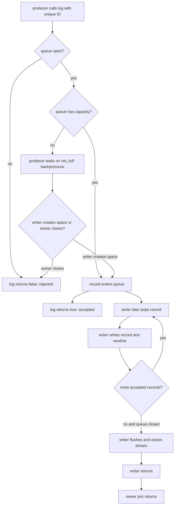
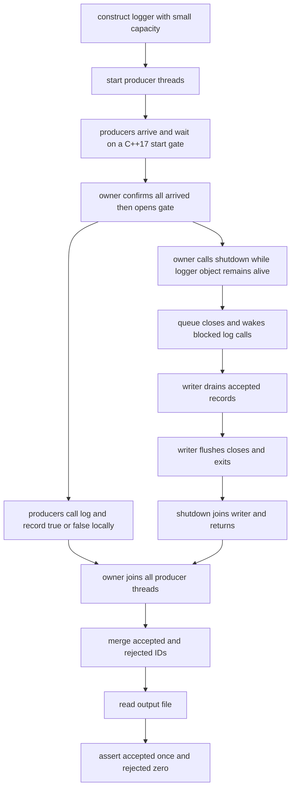
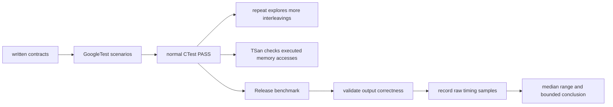

# Week8 Day6：AsyncLogger 怎样面对背压、关闭与真实性能比较

> 今日定位：继续演进 Day5 的同一份 `AsyncLogger`，不复制第二份 logger implementation。
>
> 今日主线：先把 backpressure、close/drain/flush/join 和运行期 I/O failure 变成可信证据，再比较 synchronous logging 与 asynchronous logging。
>
> 今日产出：扩展 `tests/async_logger_test.cpp`，新增 `benchmark/async_logger_bench.cpp`，完成 `day6_note.md` 和一份真实 benchmark 结果。
>
> 今日不新增 MIT 6.S081 lecture，也不进入日志等级、轮转、lock-free ring buffer、`fsync` logger 或生产级日志库源码。

---

# Part 1：前情提要与必要术语

## 1. Day5 已经建立了什么

Day5 的 canonical component 已经有一条完整路径：

```text
producer
-> AsyncLogger::log(record)
-> bounded BlockingQueue<std::string>
-> one background writer
-> std::ofstream
-> output file
```

Day5 的核心 contract 是：

```text
log(record) == true
-> record 已被 queue accepted

log(record) == false
-> close 赢得 linearization，record 没有进入 queue

shutdown()
-> close acceptance
-> writer drain accepted records
-> writer flush/close stream
-> writer exits
-> owner joins writer
-> 返回最终 I/O status
```

还必须继续保留这组边界：

```text
accepted != written
written != flushed
flushed != durable
```

今天不重新实现这些基础机制。今天问的是：

```text
这些 contract 在压力、关闭交错和真实性能比较中，证据够不够？
```

---

## 2. 今天从哪三个真实问题出发

### 2.1 writer 跟不上 producers

假设：

```text
4 个 producers 持续产生日志
1 个 writer 串行写文件
queue capacity = 8
```

当 producers 的长期生产速率高于 writer 消费速率时：

```text
queue occupancy 上升
-> queue full
-> 新 log() 等待 not_full
-> producer-visible latency 上升
```

这就是 bounded queue 的 backpressure，不是 logger “突然失效”。

### 2.2 shutdown 与 log 正在交错

owner 调用 `shutdown()` 时，可能同时存在：

```text
已经 accepted 的 records
writer 正在处理的 record
blocked on full queue 的 producers
尚未开始 log() 的 producers
```

我们要能回答每一类 record 最终属于：

```text
accepted and must be drained
或
rejected and must not appear in file
```

不能只看“程序没挂”就说生命周期正确。

### 2.3 async submit 很快，但整体可能并不快

如果只测：

```text
producer 调用 log() 到 log() 返回
```

那么 AsyncLogger 可以把尚未完成的 I/O 留给 writer，提交阶段看起来很快。

但如果完全不测：

```text
最后一条 accepted record 真正处理完
shutdown drain/flush/join 返回
output correctness
```

就不能声称“异步日志整体更快”。那只是把工作挪到了计时区间之外。

---

## 3. 今天最终要完成什么

今天有两个彼此独立的产出。

### 3.1 lifecycle evidence

继续扩展：

```text
tests/async_logger_test.cpp
```

重点验证：

```text
empty shutdown
small-capacity pressure 下不丢 accepted records
shutdown 与 producers 交错时 accepted/rejected accounting
close 能使 blocked log 最终结束
runtime output failure 不会让 lifecycle 卡死
repeated shutdown 仍安全
```

### 3.2 benchmark evidence

新增：

```text
benchmark/async_logger_bench.cpp
```

它比较：

```text
synchronous single-writer baseline
AsyncLogger with one producer
AsyncLogger with multiple producers
different queue capacities
```

并且同时记录：

```text
producer-visible submission time
end-to-end completion time
throughput
output correctness
environment and parameters
```

---

## 4. 必要术语

### 4.1 benchmark

`benchmark`：基准测试。

它不是“随手跑一次然后看谁小”，而是在明确条件下测量并记录性能：

```text
测什么对象
输入是什么
计时从哪里开始、在哪里结束
运行环境是什么
重复多少次
结果怎样汇总
正确性是否先通过
```

benchmark 回答的是性能问题，不自动回答 correctness 问题。

### 4.2 baseline

`baseline`：基线、对照方案。

今天的 baseline 是一个最小 synchronous file logger：

```text
producer 调用 log
-> 在当前 producer execution flow 中加锁
-> 写同一个 ofstream
-> 返回
```

没有 baseline，只得到一个孤立数字，很难判断它好还是坏。

### 4.3 latency

`latency`：延迟。

它回答：

```text
一次 operation 从开始到结束等了多久？
```

今天至少区分：

```text
single log-call latency
整个 producer submission phase latency
end-to-end completion latency
```

它们不是同一个 measurement boundary。

### 4.4 throughput

`throughput`：吞吐量。

它回答：

```text
单位时间完成多少 work？
```

今天可以使用：

```text
records per second = valid record count / end-to-end seconds
bytes per second = valid payload bytes / end-to-end seconds
```

必须写清分母使用 submit time 还是 end-to-end time。今天报告最终吞吐时使用 end-to-end time。

### 4.5 backpressure

`backpressure`：背压，字面上是向上游传回压力。

今天的上游是 producers，下游是 writer/file sink。

```text
writer slower than producers
-> bounded queue fills
-> log() blocks waiting for capacity
-> pressure reaches producers
```

backpressure 的目标不是让系统变快，而是拒绝“无限堆积内存”这个假设。

### 4.6 saturation

`saturation`：饱和。

今天把它理解为：

```text
writer/service capacity 已经被充分占用，新增输入主要形成等待，而不是让完成速率继续同比增加
```

queue full 是一个明显压力信号，但“某一瞬间 full”不等于已经严格测出长期 saturation throughput。

### 4.7 producer-visible submission time

这是今天人为定义的 measurement：

```text
所有 producer execution flows 被统一放行
-> 所有 log() calls 返回
```

对于 synchronous logger，它包含锁等待和 stream writing。

对于 AsyncLogger，它主要包含 record handoff、queue synchronization 和可能发生的 backpressure。

它不包含 AsyncLogger 在 producers 返回后仍然进行的全部 drain work。

### 4.8 end-to-end time

`end-to-end`：端到端，从工作入口一直到所声明的完成出口。

今天定义：

```text
统一放行 producers
-> producers 完成 submission
-> logger 完成 final flush/close
-> background writer joined
```

AsyncLogger 的 end-to-end timer 必须等 `shutdown()` 返回。

否则计时会漏掉 queue 中尚未处理的 work。

### 4.9 warm-up

`warm-up`：预热。

第一次运行可能额外承担：

```text
page cache 状态变化
动态链接和代码页首次访问
内存分配器初始路径
CPU frequency 状态变化
```

今天先做一轮不计入结果的 warm-up，再做多轮 measured runs。

warm-up 不能消除所有系统噪声，只是减少明显的 first-run effect。

### 4.10 repetition、sample、median 与 range

`repetition`：重复运行一次同样的 case。

`sample`：一次运行得到的 measurement value。

`median`：中位数。排序后位于中间的值，比单次结果更不容易被一个极端慢样本支配。

`range`：范围，今天记录最小值到最大值：

```text
median = 18.4 ms
range = 17.9 ~ 22.1 ms
```

只跑一次不能判断波动，也不应该宣布稳定倍数。

### 4.11 wall-clock time

`wall-clock time`：现实经过时间，也就是从观察者角度过去了多久。

多线程 benchmark 中，多个 threads 的 CPU time 可以重叠；今天关心 caller 等待与整个 operation 完成，所以使用 elapsed wall-clock time。

### 4.12 `std::chrono::steady_clock`

`steady`：稳定向前、不受系统校时回拨影响。

`std::chrono::steady_clock` 的 time points 不会随着物理时间前进而倒退，适合测 elapsed duration。

今天不要用 `system_clock` 测短 benchmark interval。`system_clock` 更适合表示日历时间，不是本日 elapsed-time measurement 的首选。

### 4.13 oracle

`oracle`：测试中判断结果正确与否的依据。

今天 logger 的 correctness oracle 不是“文件行数差不多”，而是：

```text
每个 attempted record 有 unique ID
每次 log() 的 true/false 被记录
每个 accepted ID 在 output 中 exactly once
每个 rejected ID 在 output 中 zero times
shutdown status 符合 sink result
```

---

## 5. 今天必须区分四类证据

### 5.1 deterministic contract test

通过受控 state 和明确 assertions 验证组件 contract。

例如：

```text
shutdown 返回后读取 file
-> accepted IDs exactly once
-> rejected IDs absent
```

### 5.2 repeat / stress

重复执行同一测试，探索更多 scheduling interleavings。

它增加覆盖机会，但不能把没有建立的前置 state 变成确定事实。

### 5.3 ThreadSanitizer

TSan 检查实际执行路径上的 data race。

它不测性能，也不能证明没有 deadlock、lost record 或错误 benchmark boundary。

### 5.4 benchmark

benchmark 在 correctness 已通过后测量性能。

它不能替代 unit/integration tests。一个“很快但漏日志”的实现没有可比较价值。

---

## 6. 今天不跨越的边界

今天不新增：

```text
public flush() during RUNNING
fsync / fdatasync durability contract
drop-oldest / drop-newest
nonblocking try_log
log level filtering
rotation
multiple sinks
multiple writer threads
lock-free ring buffer
Google Benchmark dependency
production logger library comparison
```

尤其不新增 public `flush()`。

如果允许任意 producer 在 logger RUNNING 时要求“等到我之前的 records 全部 flushed”，就需要新的 request/ack sequence、watermark 或 promise protocol。今天只有 final shutdown flush。

---

# Part 2：教程主体

# 教程开始：先证明压力下没有撒谎，再讨论谁更快

## 7. 一条 record 在今天可能走哪几条路径



读图时抓住三个分叉：

```text
open vs closed：决定能否继续接受
capacity vs full：决定立即 handoff 还是产生 backpressure
writer space vs close：决定 blocked log 最后 accepted 还是 rejected
```

这三个结果都由真实 synchronization order 决定，不由日志调用在 source code 中出现的先后单独决定。

---

## 8. queue capacity 控制的是积压上限，不是 writer 速度

假设 writer 的长期能力是：

```text
50,000 records / second
```

producers 长期输入：

```text
100,000 records / second
```

把 capacity 从 64 改成 4096，可能产生：

```text
更晚出现 producer blocking
更大的瞬时 backlog
更高的 memory usage
shutdown 时可能需要 drain 更多 records
```

但它不会凭空把 single writer 的长期 file-writing capacity 变成两倍。

所以不要把：

```text
capacity 更大时 submit phase 更短
```

直接解释成：

```text
logger 真正处理日志的 throughput 更高
```

有时只是更多 work 被暂存在 queue 中。

---

## 9. backpressure 的完整因果链

```text
producer rate temporarily exceeds writer rate
    |
    v
queue occupancy increases
    |
    v
queue reaches capacity
    |
    v
next producer enters BlockingQueue::push
    |
    +--> queue open but full
    +--> wait on closed || not_full
    |
writer pops one record
    |
    +--> queue has a slot
    +--> notify producer waiter
    |
producer later reacquires queue mutex
    |
    +--> queue still open: move record in, return true
    +--> queue closed: do not enqueue, return false
```

backpressure 的可观察结果主要在 producer side：

```text
log() latency 增加
producer submission phase 拉长
```

不是 writer 多写了一份数据，也不是 queue 丢弃了一份数据。

---

## 10. 为什么今天不把“log 超过 1 ms”写成 correctness assertion

下面这种测试很脆弱：

```text
call log()
assert duration >= 1 ms
```

原因：

```text
VM scheduling 不稳定
writer 可能刚好及时 pop
clock granularity 与测量开销存在
机器负载不同
测试没有真正建立 queue full state
```

时间变长可以作为 backpressure observation，却不是最可靠的 correctness oracle。

今天采取两层策略：

```text
correctness layer：
    复用 Week7 已验证的 BlockingQueue full/close/wakeup contract
    在 logger 层验证 accepted/rejected/file accounting 与最终退出

observation layer：
    用 small capacity、multiple producers 和足够 records
    记录 submit time 怎样随 capacity 改变
    不用固定 latency threshold 决定 test PASS/FAIL
```

这是有意的证据边界，不是回避问题。

若未来一定要在 logger black-box test 中严格证明“某个 producer 此刻正在 `not_full` 上等待”，需要 queue waiter observation 或 test injection seam。Week8 不为了重复 Week7 的 queue test 污染 AsyncLogger public API。

---

## 11. shutdown 与多个 producers 交错时，怎样写真实 oracle

为每条 record 生成 unique ID：

```text
producer-0-record-0
producer-0-record-1
producer-1-record-0
...
```

每个 producer 维护自己的 local result：

```text
accepted_ids
rejected_ids
```

为什么优先使用 thread-local result：

```text
每个 producer 只写自己的 vector
-> producer 运行时不需要共享 result mutex
-> join producer 后 main 再 merge
```

完整场景：



这个 test 不要求每次都得到固定的 accepted/rejected 数量。

合法结果由 interleaving 决定：

```text
push 在 close 前完成 -> accepted -> file exactly once
close 在 push 前线性化 -> rejected -> file zero times
push 因 full 等待 -> close 唤醒 -> rejected -> file zero times
```

真正固定的 invariant 是：

```text
accepted IDs 与 file IDs 完全相等
accepted 和 rejected 互不重叠
每个 attempted ID 恰好属于其中一组
同一 producer 的 accepted sequence 在 file 中保持递增
不同 producers 的全局相对顺序不作断言
所有 threads 最终 join
```

---

## 12. object lifetime 为什么必须单独写清楚

允许 `log()` 与一个 owner 的 `shutdown()` overlap，不等于允许 logger object 被提前销毁。

正确的 test lifetime：

```text
AsyncLogger object remains alive
-> owner may call shutdown
-> producers finish current/future log calls and are joined
-> assertions read final file
-> only then leave logger scope
```

即使 `shutdown()` 已返回，仍未执行完的 producer 也可能刚开始调用 `log()`；它应观察 closed queue 并返回 false。

所以：

```text
shutdown returned != no producer thread still has a logger reference
```

owner 必须 join producers，才能安全 destroy logger object。

---

## 13. 怎样准确描述 drain test 的证据

黑盒 test 能直接证明：

```text
所有 log() 返回 true 的 IDs
在 shutdown 返回后的 output file 中 exactly once
```

这叫：

```text
accepted-record completion evidence
```

如果没有额外的 writer test seam，它不能严格证明：

```text
shutdown 调用瞬间，某个指定 ID 一定仍 pending in queue
```

快机器上，部分或全部 records 可能已经 written。

因此 note 中应写：

```text
我证明 accepted records 在 shutdown 后完整出现；
我没有仅凭“提交很多”就宣称某个 record 必然在 close 时 pending。
```

这和 ThreadPool Day4 的 deterministic gate test 不冲突。ThreadPool test 有专门 task gate；当前 AsyncLogger V1 没有暴露 writer gate。不要为了让文案更漂亮而伪造证据强度。

---

## 14. close 为什么必须唤醒 blocked log calls

Day5 的 `log()` 最终调用 BlockingQueue `push()`。

full queue 上的 producer 等待：

```text
closed || not_full
```

owner shutdown：

```text
queue.close()
-> set closed under queue mutex
-> notify_all(not_empty)
-> notify_all(not_full)
```

blocked producer 醒来后：

```text
reacquire queue mutex
-> sees closed
-> does not enqueue
-> push returns false
-> log returns false
```

如果 close 只唤醒 writer/consumers，不唤醒 producers：

```text
producer may remain asleep on not_full
-> producer join may hang
-> logger owner cannot complete component cleanup
```

这是 AsyncLogger 能安全组合 bounded queue 与 shutdown 的必要 inherited contract。

---

## 15. 用 `/dev/full` 测运行期 write failure

Day5 已测：

```text
output path 无法 open
-> constructor throws
```

这不能覆盖“open 成功，但后续 write/flush 失败”。

Linux 提供特殊设备：

```text
/dev/full
```

`full` 的意思是“总是已满”。对它执行 write 会失败并报告 `ENOSPC`：

```text
ENOSPC = Error: No Space
```

最小观察：

```bash
ls -l /dev/full
printf 'hello\n' > /dev/full
echo $?
```

预期 shell 会报告没有剩余空间，并得到 non-zero exit status。

AsyncLogger 场景：

```text
construct AsyncLogger("/dev/full", capacity)
-> open normally succeeds
-> log one or more records
-> writer write or final flush observes stream failure
-> writer remembers write_failed
-> writer continues draining queue lifecycle
-> shutdown joins writer
-> shutdown returns false
```

这个 test 的重点不是让 `/dev/full` 保存 records，而是证明：

```text
runtime sink failure is observable
and component shutdown does not hang
```

它是 Linux-specific test。若环境没有 `/dev/full`，明确 skip，不要把它写成跨平台 contract。

---

## 16. flush 的 test 能证明到什么程度

最终 file 内容完整，可以证明 shutdown 结束后 output 对普通 file reader 可见。

但纯 black-box test 很难区分下面两种内部实现：

```text
explicit output.flush(); then output.close();
versus
output.close() performs final stream-buffer handling
```

所以 Day6 对 flush 使用两类证据：

```text
implementation inspection：writer exit path 明确调用 flush/check/close/check
behavior evidence：shutdown 返回后 file content 完整，/dev/full failure 可见
```

不要把 black-box test 描述成“证明源代码中一定执行了某一行”。

更不能把 final C++ stream flush 描述成 power-loss durability。

---

## 17. benchmark 先决定问题，再决定 timer

今天不是问一个模糊的：

```text
async 是否更快？
```

而是拆成：

```text
Q1：producer-visible submission phase 谁更短？
Q2：从 producers 开始到全部 output 完成，谁更短？
Q3：queue capacity 对 submit time 和 end-to-end time 各有什么影响？
Q4：producer count 增加后，lock/queue contention 怎样变化？
```

同一组 results 可能出现：

```text
AsyncLogger submit 更快
but
AsyncLogger end-to-end 更慢
```

这不是自相矛盾。它表示 AsyncLogger 改变了 work placement 和 caller-visible latency，但付出了 queue synchronization、record movement 和 background thread scheduling 成本。

---

## 18. synchronous baseline 必须和 async 比较什么

benchmark source 中写一个局部、最小的 `SyncFileLogger`，只为本次对照服务。

建议 interface：

```cpp
class SyncFileLogger {
public:
    explicit SyncFileLogger(const std::string& path);

    // 多个 producers 可以调用；当前调用负责持锁并写 stream。
    bool log(const std::string& record);

    // 所有 producers 停止后，由 owner 调用 final flush/close。
    bool shutdown();
};
```

这段 interface 表达：

```text
sync producer does file-stream work before log returns
one mutex serializes shared stream access
final shutdown checks stream status
```

两种 `bool log(...)` 的完成语义并不相同：

```text
SyncFileLogger true：当前 stream write 没有观察到 failure
AsyncLogger true：record 被 queue accepted，write 仍可能在未来发生
```

两者都不表示 durable。也正因为完成语义不同，今天必须同时报告 submission time 和 end-to-end time，不能只拿单次 `log()` 返回时间下结论。

不要把它扩展成第三个正式组件，也不要给它 queue/background thread。

公平条件：

| 条件 | Sync baseline | AsyncLogger |
|---|---|---|
| record 内容 | 相同 | 相同 |
| record count | 相同 | 相同 |
| newline policy | `record + '\n'` | `record + '\n'` |
| output mode | truncate | truncate |
| per-record flush | 不做 | 不做 |
| final flush/close | 做 | shutdown 中做 |
| output filesystem | 相同 | 相同 |
| compiler/build type | 相同 | 相同 |
| timed-region console output | 不做 | 不做 |

AsyncLogger 多出的 queue、writer thread 和 handoff cost 是被测设计的一部分，不应该隐藏。

今天让两个 cases 都从同一份 pre-generated records 以 lvalue 调用 `log()`：

```text
SyncFileLogger(const std::string&)：不需要取得 record ownership
AsyncLogger(std::string)：为了跨线程 handoff，需要复制出 owned record
```

这个 copy difference 是当前两个 public designs 的真实成本，不是 benchmark bug。note 中必须说明它；不要暗中让 async 使用 rvalue、sync 使用 lvalue。若以后想单独研究 copy/move cost，需要另设明确实验，不混入今天的主结果。

---

## 19. 两个 timer 的精确定义

### 19.1 setup 不进入 timed region

timer 开始前完成：

```text
生成所有 input records
准备 unique IDs
构造 logger 并成功 open output
创建 producer threads，并用 wait_until_all_ready 确认它们都已到达 start gate
```

今天不测 logger construction latency。

### 19.2 producer-visible timer

```text
submit_begin = open start gate
submit_end = all producer threads have returned from all log calls
submit_time = submit_end - submit_begin
```

它测的是 callers 何时摆脱 logging calls。

### 19.3 end-to-end timer

AsyncLogger：

```text
end_to_end_begin = submit_begin
end_to_end_end = shutdown() returns after drain/flush/close/join
```

Sync baseline：

```text
end_to_end_begin = submit_begin
end_to_end_end = producers joined and final shutdown flush/close returns
```

由于 synchronous `log()` 已经做了大部分 stream work，它的 submit/end-to-end 差距可能较小；AsyncLogger 可能保留明显 drain tail。

---

## 20. `std::chrono::steady_clock` 怎样使用

接口：

```cpp
#include <chrono>

using Clock = std::chrono::steady_clock;

const Clock::time_point begin = Clock::now();

// 这里调用真正需要测量的 operation。
run_one_case();

const Clock::time_point end = Clock::now();
const std::chrono::duration<double> elapsed = end - begin;
const double seconds = elapsed.count();
```

逐项解释：

```text
Clock::now()：取得当前 steady-clock time point
time_point：时间轴上的一个点
end - begin：得到 duration，不是绝对时间
duration<double>：以 seconds 为单位保存 floating-point duration
count()：取出数值
```

计算 throughput：

```cpp
const double records_per_second =
    static_cast<double>(valid_record_count) / seconds;
```

边界：

```text
seconds 必须大于 0
valid_record_count 必须来自 correctness validation
不要在 timed region 内逐条 std::cout
```

---

## 21. C++17 start gate 是干什么的

C++20 有 `std::latch` / `std::barrier`，但今天固定 C++17，不提前扩展。

可以复用你已经掌握的 mutex + condition variable，写一个只用于 benchmark/test 的 start gate：

```cpp
#include <condition_variable>
#include <cstddef>
#include <mutex>

class StartGate {
public:
    // expected 表示本轮必须先到达 gate 的 producer 数量。
    explicit StartGate(std::size_t expected);

    // Producer 调用：登记自己已到达，然后等待 owner 统一开放 gate。
    void arrive_and_wait();

    // Owner 调用：等待所有 expected producers 都已经到达 gate。
    void wait_until_all_ready();

    // Owner 调用：设置 open state 并唤醒所有等待者。
    void open();

private:
    // open_ 由 mutex_ 保护；condition variable 等待 open_ == true。
    std::mutex mutex_;
    std::condition_variable cv_;
    std::size_t expected_;
    std::size_t arrived_ = 0;
    bool open_ = false;
};
```

这里故意不提供完整 method bodies，因为你已经写过 predicate wait。需要满足：

```text
arrive_and_wait 在同一 mutex 下增加 arrived_，并通知等待 readiness 的 owner
producer 等待 open_ 时使用 predicate form
wait_until_all_ready 等待 arrived_ == expected_
open 在同一 mutex 下修改 open_
open 使用 notify_all
```

benchmark 中的 owner 顺序必须是：

```text
create producer threads
-> wait_until_all_ready()
-> record begin time
-> open()
```

这样可以减少 thread creation/startup 对 timed region 的污染。若 owner 没等 `arrived_ == expected_` 就开始计时，一些 producer 可能还没运行到 gate，结果会混入不一致的 startup delay。

它不承诺所有 CPU instructions 在完全同一个纳秒开始，也不改变 scheduler 权限。

---

## 22. benchmark input 怎样设计

先使用一组不至于让 VM 跑很久的矩阵：

```text
total records：100,000
record payload：约 128 bytes
producer count：1、4
async capacity：1、64、1024
measured repetitions：5
warm-up：1
```

保持 total records 不变，再改变 producer count，才能初步观察 concurrency effect，而不是同时把总 work 变成四倍。

每个 record 应提前构造：

```text
producer ID
record sequence
padding to roughly fixed size
record 本身不含 embedded newline
```

例如：

```text
producer=2 seq=1842 payload=xxxxxxxxxxxxxxxx...
```

为什么 pre-generate：

```text
避免 async case 和 sync case 在 timed region 中承担不同 string formatting cost
避免随机生成器成本污染 logging measurement
```

如果 100,000 条在 VM 上太快导致数字抖动，可以增大到让每个 case 至少持续几十到几百毫秒；若太慢则降低。调整后必须把实际参数记录下来。

---

## 23. queue capacity 需要怎样解释

至少比较：

```text
capacity = 1
capacity = 64
capacity = 1024
```

你可能观察到：

```text
capacity=1：producer 经常与 writer rendezvous，submit time 较长
capacity=64：允许短 burst 被吸收
capacity=1024：submit 可能更早结束，但 shutdown drain tail 可能更明显
```

这只是合理假设，不是预设答案。

真实结果也可能因为：

```text
VM vCPU 数量
filesystem/page cache
record size
mutex/CV scheduling
compiler optimization
```

而不同。

benchmark 的职责是记录，不是强迫机器证明 AsyncLogger 更快。

---

## 24. warm-up、重复运行与 case 顺序

建议：

```text
每种 case 先做 1 次 warm-up，不记入结果
再做 5 次 measured repetitions
记录每一次原始值
最后报告 median + min/max range
```

不要总按：

```text
sync x5
then async x5
```

因为系统负载可能随时间漂移。

本日简单做法可以交替：

```text
sync
async capacity=1
sync
async capacity=64
sync
async capacity=1024
```

或让每一轮按相同 case matrix 跑一遍，再汇总各 case。

Google Benchmark 支持 repetitions、warm-up、统计和环境 context；今天先手写最小 harness，目的是把 measurement boundary 真正理解清楚，不新增库依赖。

---

## 25. correctness validation 必须放在每个 case 后

每个 measured case 完成后，在 timed region 外执行：

```text
shutdown status == true
attempted count == expected total
accepted count == expected total
output line count == accepted count
every expected unique ID appears exactly once
no unexpected ID
```

benchmark 正常路径中，owner 要在所有 producers 完成后才 shutdown，因此 no-I/O-failure 时所有 `log()` 都应最终 accepted；queue full 只会阻塞，不会主动 drop。

如果 validation 失败：

```text
这个 case 是 correctness failure
不是一个“更快”的 performance sample
```

不要把错误 sample 纳入 median。

---

## 26. 为什么这里只能叫 buffered file logging benchmark

今天 sync 与 async 都：

```text
使用 std::ofstream
不每条 flush
最后 flush/close
不调用 fsync
```

因此结果可能大量受到：

```text
C++ stream buffering
kernel page cache
filesystem behavior
VM virtual disk
```

影响。

所以结论应写：

```text
在当前 VM、当前 filesystem、当前 buffered-output policy 下，
观察到 producer-visible time / end-to-end time 为……
```

不要写：

```text
磁盘真实持久化速度提高了 X 倍
```

因为今天没有 durable-write contract。

---

## 27. 一组假想结果应该怎样读

下面只是读表练习，不是你的真实结果：

| mode | producers | capacity | submit ms | end-to-end ms | valid |
|---|---:|---:|---:|---:|---|
| sync | 4 | N/A | 120 | 124 | yes |
| async | 4 | 64 | 45 | 138 | yes |
| async | 4 | 1024 | 28 | 142 | yes |

正确解释：

```text
AsyncLogger 明显缩短了 producers 被 logging calls 占用的时间；
但当前 end-to-end 更慢，说明 queue handoff、writer scheduling 等成本
没有让最终 buffered output 更快。

capacity 1024 进一步缩短 submit time，
但更多 work 留在 producers 返回后的 drain tail。
```

错误解释：

```text
async 比 sync 快 120 / 28 倍数对应的结论
```

这个比值比较的是不同 completion boundary。

---

## 28. TSan build 为什么不能拿来计时

ThreadSanitizer 会插入 instrumentation 并维护额外 metadata，用来检测 memory accesses 的 synchronization relationship。

这会显著改变：

```text
instruction count
memory traffic
thread scheduling timing
overall runtime
```

所以：

```text
TSan build -> correctness/data-race evidence
Release build -> performance measurement
```

不能比较：

```text
sync Release
vs
async TSan
```

也不要把 TSan slow-down 解释成 logger design cost。

---

## 29. CMake 怎样增加 benchmark target

继续使用 Week8 project-root `CMakeLists.txt`，增加一个独立 executable：

```cmake
add_executable(async_logger_bench
    benchmark/async_logger_bench.cpp
)

target_link_libraries(async_logger_bench
    PRIVATE
        async_logger
        Threads::Threads
)

target_compile_options(async_logger_bench
    PRIVATE
        -Wall
        -Wextra
)
```

这里每一项的作用：

```text
add_executable：创建 benchmark binary target
bench source：只放 measurement harness 和 local sync baseline
async_logger target：链接真实 Day5 component
Threads::Threads：保留 thread/pthread 编译链接要求
-Wall -Wextra：Release benchmark 也不放弃 warnings
```

不把 benchmark 注册成 CTest correctness test。它耗时、输出参数化 results，职责与 unit tests 不同。

---

## 30. Release build 与运行环境记录

配置独立 build directory：

```bash
cmake -S . -B build-release -DCMAKE_BUILD_TYPE=Release
cmake --build build-release --target async_logger_bench -j
```

查看实际 compile command：

```bash
cmake --build build-release --target async_logger_bench --verbose
```

运行前记录：

```bash
uname -a
lscpu
nproc
g++ --version
cmake --version
git rev-parse --short HEAD
```

还要在 note 中写：

```text
是否 VMware/VirtualBox
VM 分配的 vCPU 和 memory
output file 所在 filesystem/path
record count / size
producer count
queue capacity
repetitions
```

在 VM 中测出的数据仍然有学习价值，只要不假装它是裸机生产环境结论。

---

## 31. 测试、repeat、TSan、benchmark 的最终关系



顺序很重要：

```text
correctness first
then performance
```

如果 benchmark 暴露 correctness failure，应回到 tests/component 修复，再重新测全部相关 cases。

---

## 32. 今天最容易犯的 benchmark 错误

### 32.1 只测 async submit

漏掉 queue drain，结论偏向 async。

### 32.2 sync 每条 flush，async 最后 flush

比较的是不同 durability/buffering policy。

### 32.3 一个 case 生成短字符串，另一个读预生成字符串

比较中混入不同 formatting cost。

### 32.4 timed region 内打印每条 record

终端 I/O 会成为主要开销。

### 32.5 不检查文件内容

漏日志实现可能因为少做 work 而显得更快。

### 32.6 只跑一次

无法看见系统噪声与波动。

### 32.7 比较不同 build types

Debug、TSan、Release 的代码成本不在同一条件下。

### 32.8 把 VM page-cache 结果称为 durable disk throughput

超出了当前实验真正测量的对象。

---

## 33. 今日完整因果链

```text
Day5 AsyncLogger contract
    |
    v
multiple producers create pressure
    |
    +--> queue has capacity -> accepted
    +--> queue full -> blocked backpressure
    +--> shutdown close wins -> rejected
    |
    v
writer drains accepted records only
    |
    v
final flush/close -> writer return -> join
    |
    v
accepted/rejected/file oracle proves correctness
    |
    v
Release benchmark measures two boundaries
    |
    +--> producer-visible submission time
    +--> end-to-end completion time
    |
    v
repeat + median/range + environment
    |
    v
write a conclusion no stronger than the evidence
```

---

# Part 3：收尾、练习、测试与验收

## 34. 今日独立练习

### 34.1 继续使用 canonical source

不要创建：

```text
async_logger_v2.hpp
async_logger_final.cpp
async_logger_day6.cpp
```

继续修改 Week8 同一份：

```text
include/async_logger.hpp
src/async_logger.cpp
tests/async_logger_test.cpp
```

只有 test 真正暴露 implementation bug 时才修改 logger source。

### 34.2 新增文件

```text
benchmark/async_logger_bench.cpp
week8/day6/day6_note.md
```

`async_logger_bench.cpp` 的程序用途：

```text
构造相同 input records
运行 synchronous baseline 和真实 AsyncLogger
测 producer-visible 与 end-to-end durations
验证每个 output file
打印可保存的 structured result rows
```

它不是 correctness test replacement，也不是新的 logging component。

---

## 35. Day6 test matrix

不需要复制 Day5 已通过的全部 basic tests；继续保留并运行它们，在同一个 test file 中补下面的增量场景。

### 35.1 `ShutsDownEmptyLogger`

```text
construct logger
no log calls
shutdown returns true
second sequential shutdown returns same status
output file exists and contains zero records
```

验证 empty lifecycle 与 repeated shutdown。

### 35.2 `DrainsEveryAcceptedRecord`

```text
multiple producers
unique IDs
small capacity
each producer records log() return locally
join producers
shutdown
read output
accepted IDs exactly once
```

这里证明 accepted completion，不宣称某个 ID 在 shutdown 时必然 pending。

### 35.3 `AccountsForConcurrentShutdown`

```text
logger remains alive
producer threads wait on start gate
owner opens gate and overlaps one shutdown call
each producer classifies every attempted ID by log() return
shutdown returns; owner joins all producers
accepted IDs exactly once
rejected IDs absent
accepted count + rejected count == attempted count
accepted IDs and rejected IDs are disjoint
each producer's accepted sequence remains ordered in the file
```

不要断言固定 accepted count，也不要断言固定 line order across producers。

### 35.4 `ReportsRuntimeWriteFailureWithoutHanging`

Linux-only：

```text
construct logger with /dev/full
log a bounded number of records
shutdown returns false
test process exits normally
```

给该 test 设置 CTest timeout，timeout 只是 hang safety net，不是正常同步手段。

### 35.5 `SmallCapacityBackpressureObservation`

这不是依赖固定毫秒 threshold 的 GoogleTest assertion。

做成 benchmark/probe row：

```text
same records
same producers
capacity 1 / 64 / 1024
record submit time and end-to-end time
validate output every time
```

观察 capacity 是否改变 producer-visible time，并在 note 中限定结论。

---

## 36. benchmark program contract

### 36.1 输入

最少支持以下 configuration：

```text
mode：sync / async
total record count
record size
producer count
async queue capacity
repetition index
output path
```

可以先在 source 中使用常量，不要求今天写 command-line parser。

### 36.2 输出结果

每个 case 输出一行：

```text
mode,producers,capacity,records,record_bytes,submit_ms,end_to_end_ms,records_per_sec,valid
```

例如格式：

```text
async,4,64,100000,128,41.82,133.57,748670.4,true
```

这是格式示例，不是预期性能值。

### 36.3 failure behavior

```text
logger construction failure -> print case context and return non-zero
any log rejection in normal benchmark -> case invalid and return non-zero
shutdown false -> case invalid and return non-zero
output validation failure -> case invalid and return non-zero
```

不能打印 `valid=false` 后仍让整体 benchmark exit 0，除非 harness 明确汇总并在最后返回 non-zero。

---

## 37. benchmark implementation checklist

### 37.1 common setup

```text
generate unique fixed-size records without embedded newlines before timing
partition total records among producers
prepare one local accepted/result area per producer
construct logger before timer
create threads; owner waits until every producer has arrived at StartGate
record begin time, then open StartGate
```

### 37.2 synchronous case

```text
all producers share one SyncFileLogger
log locks one stream mutex
write exact record + newline
no per-record flush
join producers
final shutdown flush/close/check
```

### 37.3 asynchronous case

```text
all producers share real AsyncLogger
log blocks until accepted when queue full
join producers
call shutdown
end timer only after shutdown returns
```

### 37.4 validation and reporting

```text
stop timer before parsing output
read file outside timed region
verify exact IDs
delete or rename output outside timed region
save raw sample
after repetitions compute median/min/max
```

---

## 38. 允许查阅的最小 API

### 38.1 `std::chrono::steady_clock::now`

```cpp
const auto begin = std::chrono::steady_clock::now();
// measured operation
const auto end = std::chrono::steady_clock::now();
```

用途：取得 elapsed interval 的两个 time points。

### 38.2 `std::chrono::duration<double>`

```cpp
const std::chrono::duration<double> elapsed = end - begin;
const double seconds = elapsed.count();
```

用途：把 clock-native duration 转成 seconds 的 floating-point value。

### 38.3 `std::sort`

```cpp
#include <algorithm>
#include <vector>

std::sort(samples.begin(), samples.end());
const double median = samples[samples.size() / 2];
```

用途：对 5 个 samples 排序后取得中间值。

今天固定使用奇数 repetitions，因此无需处理偶数样本中间两项平均值。调用前必须保证 `samples` 非空。

### 38.4 `std::ifstream` line validation

```cpp
std::ifstream input(path);
std::string line;

while (std::getline(input, line)) {
    // 将 unique ID 计入 test/benchmark oracle。
}
```

用途：在 logger shutdown/join 后读取最终 output。

不要在 writer 仍活着时并发读取文件并把暂时缺失当 failure。

### 38.5 `/dev/full`

```cpp
AsyncLogger logger("/dev/full", 8);
```

用途：Linux 环境中让 open 成功、后续 writes 报 no-space failure，从而检查运行期 sink failure path。

它不是普通 output file，不能拿来验证 line content。

---

## 39. 编译与运行顺序

### 39.1 normal correctness tests

```bash
cmake -S . -B build
cmake --build build -j
cmake -E chdir build ctest --output-on-failure --timeout 20
```

### 39.2 TSan tests

沿用 Day4/Day5 的 separate TSan build：

```bash
cmake -S . -B build-tsan -DENABLE_TSAN=ON
cmake --build build-tsan -j
cmake -E chdir build-tsan ctest --output-on-failure --timeout 60
```

分析 TSan report 时重点看：

```text
producer log vs owner shutdown
writer write_failed state vs owner read
test result vectors 是否被多个 threads 共同写
logger destruction 前 threads 是否全部 join
```

### 39.3 Release benchmark

```bash
cmake -S . -B build-release -DCMAKE_BUILD_TYPE=Release
cmake --build build-release --target async_logger_bench -j
./build-release/async_logger_bench
```

若 project 的 binary 输出路径不同，以 CMake 实际 target path 为准。

---

## 40. 失败时按什么顺序排查

### 40.1 concurrent shutdown test 挂住

先检查：

```text
queue.close 是否同时 notify_all not_empty/not_full
shutdown 是否 close before join
producers 是否在 closed queue 上仍继续 wait for capacity
test 是否遗漏 producer join
test 是否提前 destroy logger
```

### 40.2 accepted ID 在 file 中缺失

检查：

```text
writer 是否在 close 后直接退出而没有 drain
shutdown 是否真正 join
test 是否在 shutdown 返回前读取 file
record parser 是否把 ID/padding 解析错
```

### 40.3 rejected ID 出现在 file

检查：

```text
log 返回值是否真的来自 BlockingQueue::push result
close 后是否仍允许 enqueue
test 是否把另一个同名 ID 混进 output
```

### 40.4 `/dev/full` test 返回 true

检查：

```text
writer 是否在 write/flush/close 后检查 stream state
write_failed 是否被最终 shutdown 读取
test 是否错误地使用 /dev/null
```

### 40.5 benchmark 抖动很大

检查：

```text
case 是否太短
是否在 VM 中同时运行其他高负载任务
是否在 timed region 打印
是否每轮生成 strings
是否只有一次 sample
sync/async case 顺序是否固定并受系统漂移影响
```

### 40.6 async submit 快很多但 end-to-end 没优势

这不一定是 bug。

先分析：

```text
queue handoff cost
single writer bottleneck
drain tail
record size
capacity
producer count
buffer/page-cache behavior
```

再写有边界的结论，不要为了得到“异步更快”去改 measurement boundary。

---

## 41. 建议完成顺序

```text
1. 先重新运行 Day5 normal tests
2. 增加 /dev/full runtime failure test
3. 增加 concurrent shutdown accepted/rejected accounting test
4. normal CTest
5. repeat lifecycle tests
6. TSan CTest
7. 写 local SyncFileLogger baseline
8. 写 StartGate 与 common record generation
9. 先跑一个 sync case，验证 output
10. 先跑一个 async case，验证 output
11. 加 producer/capacity matrix
12. 加 warm-up、5 repetitions、median/range
13. Release build 运行并保存 raw rows
14. 写 day6_note，只陈述数据支持的结论
```

先让一条 case 从 setup、timing、shutdown 到 validation 全部正确，再扩展 matrix。

---

## 42. `day6_note.md` 建议结构

```markdown
# Week8 Day6 Note

## 1. backpressure 的完整因果链

## 2. shutdown overlap 的 accepted/rejected oracle

## 3. accepted / written / flushed / durable 边界

## 4. normal tests 与 repeat 证据

## 5. TSan 证据

## 6. benchmark 环境与参数

## 7. raw samples

## 8. median / range 汇总

## 9. producer-visible 与 end-to-end 的结论

## 10. 当前 benchmark 的限制

## 11. 我遇到的问题与修复

## 12. Questions
```

benchmark 结果不要只保留一句“async 快 X 倍”。至少保留一张参数与原始样本表。

---

## 43. 今日验收问题

1. backpressure 是谁把压力传给谁？bounded queue full 时 `log()` 为什么会变慢？
2. queue capacity 变大为什么不等于 writer 长期 throughput 必然变大？
3. `log() == true`、writer `operator<<` 完成、`flush()` 完成、durable 分别处于什么层次？
4. shutdown 与 producers overlap 时，怎样用 accepted/rejected sets 和 file IDs 建立 oracle？
5. 为什么 logger 已 `shutdown()` 返回，仍不能在 producer threads 未 join 时销毁 logger object？
6. `/dev/full` 测的是 constructor open failure 还是 runtime write failure？预期 `shutdown()` 返回什么？
7. producer-visible submission time 与 end-to-end time 的起止点分别是什么？
8. 为什么 sync 每条 flush、async 最后 flush 的比较不公平？
9. 为什么 TSan timing 不能拿来和 Release benchmark 比较？
10. 如果 async submit 更快但 end-to-end 更慢，应该怎样解释，而不是直接判定实现错误？

如果代码、测试、流程图和 note 已经自然覆盖，不需要为了形式重复抄写十段答案；验收时会逐项核对现有证据。

---

## 44. 今日通过标准

### 44.1 核心必须完成

```text
Day5 canonical AsyncLogger 没有被复制成多个版本
normal lifecycle tests PASS
concurrent shutdown test 按 accepted/rejected/file accounting 验证
all threads have explicit join/lifetime cleanup
/dev/full runtime failure 能让 shutdown 返回 false 且不 hang
TSan 对相关 tests 无 data-race report
sync 与 async 使用相同 records/output policy/build type
同时测 producer-visible 与 end-to-end boundaries
每个 benchmark case 都先通过 output validation
至少 1 warm-up + 5 measured repetitions
记录 median 与 min/max range
结论明确限定当前 VM/filesystem/buffering policy
```

### 44.2 可按实际环境调整

```text
record count 可根据 VM 速度调整
record size 可从 128 bytes 改为其他固定值
producer count 可从 1/4 改为不超过可用 vCPU 的合理组合
若 /dev/full 不存在，明确 skip Linux-specific case
```

调整参数不等于删除 measurement boundary 或 correctness validation。

### 44.3 工程增强，不阻塞 Day6

```text
per-call p50/p95/p99 latency
Google Benchmark integration
CSV/JSON reporter
CPU affinity
perf stat / flame graph
public runtime flush protocol
fsync durability benchmark
drop policy comparison
real disk-full fault injection
```

### 44.4 Day6 不通过的真正原因

```text
把 log true 写成 record 已 durable
shutdown 丢失 accepted records
close 不能结束 blocked producers
runtime sink failure 导致 writer 提前退出并让 queue 永久堵塞
object 销毁时仍有 producer/writer access
只测 submit time 就宣布整体吞吐提升
sync/async 使用不同 flush policy
benchmark 不验证 output
用 TSan/Debug timing 当 Release performance
只跑一次并宣布稳定倍数
```

---

## 45. 今天停止在哪里

今天结束时，你应当能够说清：

```text
AsyncLogger 的价值首先是把 file-I/O responsibility 移出 producers，
而不是保证所有 workload 下 end-to-end 都更快。

bounded queue 用 backpressure 限制 backlog；
close 必须同时让 writer 和 blocked producers 重新检查 lifecycle。

shutdown 返回后，accepted records 应完成 drain，writer 已 flush/close 并 join；
但 C++ stream flush 仍不等于 durable。

性能结论必须同时给 producer-visible 和 end-to-end boundaries，
并且建立在 output correctness、相同 policy、Release build 和重复样本上。
```

Day7 再把 ThreadPool 与 AsyncLogger 按 lifetime dependency 组合，补 README、架构图、benchmark 表和面试讲稿。今天不提前做 integration project。

---

## 46. 今日压缩记忆

```text
Backpressure：writer 跟不上 -> queue full -> producer log blocks。

close：停止 acceptance，并唤醒 blocked consumers/producers。

accepted/rejected oracle：
accepted IDs exactly once in file；rejected IDs zero times。

shutdown：close -> drain -> flush/close -> writer return -> join。

Runtime I/O failure：Linux /dev/full；shutdown false，但 lifecycle 仍结束。

Benchmark 必须测两段：
producer-visible submit time
end-to-end drain/flush/join time。

Correctness first；Release timing later；TSan timing 不参与性能比较。
```

---

## 47. 今日参考资料

- [C++ working draft：`std::chrono::steady_clock`](https://eel.is/c++draft/time.clock.steady)
- [C++ working draft：`basic_ostream::flush`](https://eel.is/c++draft/ostream.unformatted)
- [Linux man-pages：`full(4)` 与 `/dev/full`](https://man7.org/linux/man-pages/man4/full.4.html)
- [Google Benchmark 官方 User Guide](https://github.com/google/benchmark/blob/main/docs/user_guide.md)

资料边界：C++ draft 用来核对 steady clock 与 stream flush semantics；`full(4)` 用来建立 Linux runtime no-space failure test；Google Benchmark guide 只用于参考 warm-up、repetitions、context 与统计方法。Day6 不引入 Google Benchmark dependency。
