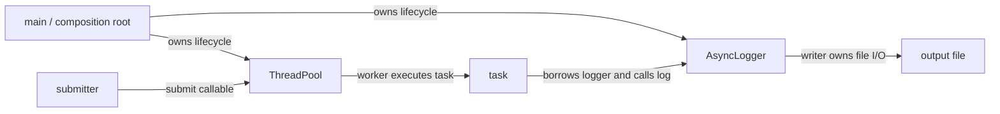
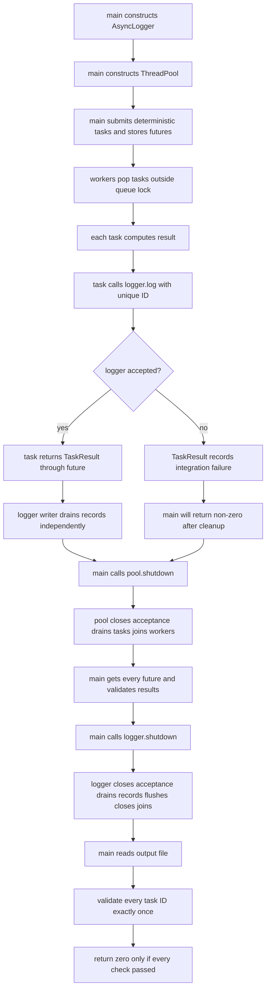
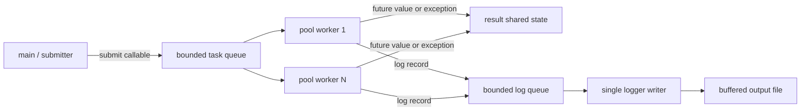
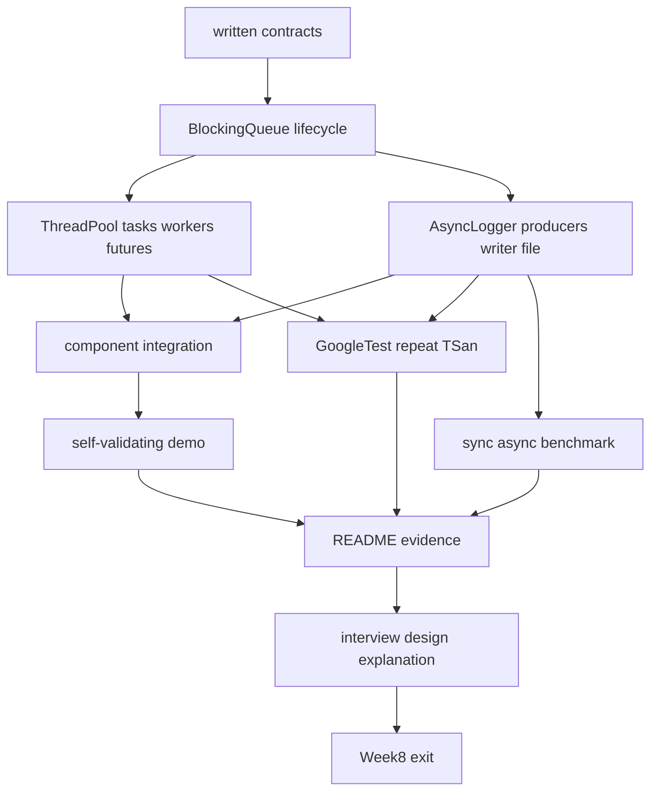

# Week8 Day7：把 ThreadPool 与 AsyncLogger 变成能运行、能解释、能展示的小项目

> 今日定位：Week8 出口日。今天不再给两个组件堆新功能，而是验证它们怎样组合、怎样关闭、怎样被别人复现，以及你能否用真实证据解释设计取舍。
>
> 今日主线：`dependency -> ownership -> integration lifecycle -> executable demo -> README -> interview.md -> final evidence`。
>
> 今日产出：`demos/component_demo.cpp`、项目根目录 `README.md`、项目根目录 `interview.md`、`day7_note.md`，以及 Week8 最终验证记录。
>
> 今日不新增 MIT 6.S081 lecture，不进入 epoll/Reactor 实现，不扩展 work stealing、dynamic resize、logger rotation、durability 或生产级日志生态。

---

# Part 1：前情提要与必要术语

## 1. Week8 前六天留下了什么

Week8 不是七个互不相干的 demos。

它已经形成两条 component 主线。

ThreadPool：

```text
callable
-> packaged_task
-> copyable queue wrapper
-> bounded task queue
-> worker
-> shared result state
-> future
```

AsyncLogger：

```text
producer record
-> bounded log queue
-> single writer
-> std::ofstream
-> final flush/close
```

两条主线都有：

```text
bounded queue
background execution flow
acceptance contract
close/drain/join lifecycle
normal tests
failure tests
repeat / TSan evidence
```

今天不重复实现它们，而是回答：

> 当 ThreadPool 中的 tasks 会调用 AsyncLogger 时，谁必须比谁活得更久，owner 应按什么顺序停止两个组件，怎样证明结果和日志都完整？

---

## 2. 今天从哪个真实问题出发

假设一个 task 在 pool worker 中执行：

```text
compute result
-> logger.log("task completed")
-> return result
```

此时 task 同时依赖：

```text
ThreadPool 提供 execution flow
AsyncLogger 接受并最终写出 record
```

如果 owner 先停止 logger：

```text
queued pool tasks later run
-> call log on a closed logger
-> log returns false
-> record is rejected
```

如果 owner 甚至先销毁 logger：

```text
queued pool tasks later run
-> use a dangling logger reference
-> undefined behavior
```

所以 Day7 的核心不是“在一个 `main()` 里同时出现两个 class names”，而是建立正确 dependency 与 lifetime order。

---

## 3. 今天最终要交付什么

### 3.1 一个自验证 integration demo

```text
demos/component_demo.cpp
```

它必须：

```text
construct logger before pool
submit deterministic tasks
tasks compute result and submit unique log records
shutdown/drain/join pool first
observe every future
shutdown/drain/flush/join logger second
validate results and output IDs
return non-zero on any failure
```

### 3.2 一份别人能执行的 README

```text
README.md
```

它不只是项目介绍，还要给出可复现的：

```text
build
run demo
run tests
run TSan
run Release benchmark
```

### 3.3 一份只属于这个项目的面试讲稿

```text
interview.md
```

它要把答案绑定到：

```text
你的 source
你的 contracts
你的 test scenarios
你的 benchmark boundaries
你的 known limitations
```

不是复制通用线程池八股。

---

## 4. 必要术语

### 4.1 component

`component`：组件。

今天把它理解为：

```text
有明确用途、public interface、owned resources、lifecycle contract 和 tests 的可组合代码单元
```

ThreadPool 与 AsyncLogger 都是 component；一段散落在 `main()` 里的线程代码还不能自动称为 component。

### 4.2 integration

`integration`：集成、组合。

它关注的不是单个 component 内部，而是边界连接：

```text
谁调用谁
谁借用谁
谁先构造
谁先停止
错误怎样跨 component 传播
组合以后是否出现新的阻塞链或 lifetime risk
```

### 4.3 dependency

`dependency`：依赖。

若 A 正确完成工作需要 B 仍然可用，则：

```text
A depends on B
```

今天 pool tasks 调用 logger，所以：

```text
pool task execution depends on logger availability
```

这不表示 ThreadPool object 拥有 AsyncLogger object。

### 4.4 ownership

`ownership`：所有权。

owner 负责资源最终生命周期：

```text
main owns ThreadPool object
main owns AsyncLogger object
ThreadPool owns workers and task queue
AsyncLogger owns writer, log queue and output stream
```

### 4.5 borrow

`borrow`：借用。

task lambda reference-capture logger 时，closure 只保存一个 non-owning access path：

```text
task can use logger
but task does not own/destroy logger
```

borrow 的安全前提是 borrowed object 活得足够久。

### 4.6 lifetime

`lifetime`：生命周期。

对象 lifetime 从 construction 完成开始，到 destruction 开始/完成的语言规则边界结束。

今天最重要的关系：

```text
AsyncLogger lifetime must cover every task that may call logger.log()
```

### 4.7 destruction order

`destruction order`：析构顺序。

同一作用域内成功构造的 local objects 按 declaration 的逆序析构：

```text
construct A
construct B
-> destroy B
-> destroy A
```

今天可以把这一规则作为异常路径的 lifetime backup，但正常路径仍要显式 shutdown 并检查状态。

### 4.8 composition

`composition`：组合。

今天不是让 ThreadPool 成为 AsyncLogger 的 data member，也不是让 logger 内部创建 pool。

main 作为 composition root：

```text
construct both components
connect them through task captures
control the shutdown order
```

### 4.9 architecture

`architecture`：架构。

在本项目当前层次，它不是宏大的分布式图，而是清楚展示：

```text
components
data flow
control flow
ownership
thread boundaries
shutdown direction
```

### 4.10 integration test / smoke test

`integration test`：验证多个真实组件组合后的 behavior。

`smoke test`：最小冒烟测试，用来快速确认主要路径能启动、运行和退出。

今天的 `component_demo` 同时承担：

```text
可展示 demo
自验证 integration smoke
```

但它不替代 ThreadPool/AsyncLogger 各自更细的 unit tests。

### 4.11 reproducible

`reproducible`：可复现。

别人按 README 在相同前置条件下，可以：

```text
configure
build
run
test
understand result
```

只写“运行成功”而没有命令、环境和预期输出，不可复现。

### 4.12 evidence

`evidence`：证据。

项目表达中的 claim 必须尽量连接到证据：

```text
claim：accepted tasks are drained
evidence：controlled test + assertions + passing exit code

claim：current run has no observed data race
evidence：TSan command + executed scenarios + clean report

claim：async submit latency lower in this VM
evidence：Day6 parameters + raw samples + median/range
```

### 4.13 known limitation

`known limitation`：已知限制。

它不是自曝其短，而是定义当前版本的能力边界：

```text
fixed workers
blocking submission
one-owner shutdown
no cancellation
buffered logger without durability
single sink
```

知道边界并能解释后续演进，比假装 V1 已经 production-ready 更可信。

### 4.14 README

`README`：项目入口文档，通常是读者进入 repository 后先看到的说明。

今天它要回答：

```text
这是什么
为什么存在
怎样构建和运行
架构如何
怎样验证
结果如何
不能做什么
```

### 4.15 interview

`interview`：面试。

`interview.md` 不是背诵答案集合，而是你对自己项目的设计复盘。每个回答优先遵循：

```text
结论
-> 机制
-> 取舍
-> 证据
-> 限制/下一步
```

---

## 5. 今天继承的两个 public contracts

ThreadPool：

```text
submit accepted callable -> return future<R>
accepted task -> eventually ready with value or exception
shutdown -> close task acceptance, drain accepted tasks, join workers
submit after completed shutdown -> throw runtime_error
```

AsyncLogger：

```text
log true -> record accepted, not necessarily written yet
log false -> record rejected after close wins
shutdown -> close acceptance, drain, flush/close stream, join writer
shutdown bool -> final stream status
```

Day7 不修改这些 contract 来迁就 demo。

如果 integration 暴露真实 bug，修 canonical source 和对应 tests；不要在 demo 中绕过错误。

---

## 6. 今天不跨越的边界

```text
ThreadPool 不获得 logger ownership
AsyncLogger writer 不向 ThreadPool 反向 submit
不使用 shared_ptr 掩盖不清楚的 owner
不增加 global singleton logger
不增加 dynamic resize/work stealing/priority
不增加 logger level/rotation/drop/fsync
不开始 Reactor implementation
不伪造 benchmark numbers
不把 README 写成营销页
```

今天的难点是让已有组件形成闭环，不是继续横向扩展 feature list。

---

# Part 2：教程主体

# 教程开始：先独立组合，再审查 dependency、lifetime 与证据

# Round 1：到这里停止阅读，先独立完成 integration V1

Day7 的第一次产出不该从标准 dependency graph 和标准 shutdown order 开始。你已经拥有两个通过各自 tests 的 components，也知道它们的 public contracts；现在先用自己的设计把它们组合起来。

先不要看第 7 节及之后的 ownership map、构造/析构顺序、backpressure chain 和 README 答题框架。

第一轮新增：

```text
demos/component_demo.cpp
README.md 初稿
interview.md 初稿
```

三个文件各自负责：

```text
demos/component_demo.cpp
    使用真实 ThreadPool 和 AsyncLogger public APIs
    运行一条可自验证的 integration scenario
    success return 0，任何 contract violation return non-zero

README.md
    告诉另一个人项目做什么、怎样 fresh build/run/test、目前边界是什么

interview.md
    用自己的项目代码解释 design choice、trade-off、evidence 和 limitation
```

第一版 demo 不读取 stdin，也不要求 command-line parser。可以先使用稳定常量：

```text
worker_count = 4
task_queue_capacity = 16
logger_queue_capacity = 8
task_count = 100
output_path = component_demo.log
```

这些只是 correctness configuration，不是性能参数结论。

`component_demo.cpp` 只规定最终功能：

```text
main 创建 ThreadPool 与 AsyncLogger
submit 多个会产生计算结果并记录日志的 tasks
caller 最终取得所有 task outcomes
所有 accepted log records 在进程成功退出前进入 output file
任一结果、日志或 lifecycle 检查失败时返回 non-zero
```

可观察输出至少包含一份 summary，而不是打印每个 thread 的调度顺序：

```text
tasks submitted
future results checked
logs accepted
unique log IDs found
integration result: PASS / FAIL
```

### Round1 build/run 入口

沿用 Day4~Day6 的 project CMake。新增 executable target 名称固定为 `component_demo`，然后：

```bash
cd ~/code/system-learning/cpp/week8
cmake -S . -B build
cmake --build build --target component_demo -j
cmake -E chdir build ./component_demo
echo $?
```

`echo $?` 应在成功时得到 `0`。README 初稿里的命令必须和你实际运行成功的命令一致。

今天没有新的核心 C++ API：主要复用 `submit/future/shutdown/log`、`std::ifstream + std::getline` 和已经学过的 CMake target。Round1 的难点是组合与验证，不是寻找新 library。

在写代码前自己画两张图：

```text
ownership / borrowing graph
从 construction 到 process exit 的 lifecycle 顺序
```

然后按自己的判断决定：谁先构造、谁先 shutdown、task 捕获什么、何时检查 futures、何时读取日志文件。README 和 interview 先写你当前真实理解，不必提前迎合后面的推荐答案。

**阅读闸门：integration demo 尚未独立运行，且两张图尚未完成前，停在这里。**

---

# Round 2：用 dependency、lifetime 与 backpressure 审查 V1

从下面开始再把你的方案与完整机制对照。重点不是把代码改成唯一写法，而是检查是否存在 dangling borrow、错误 shutdown order、无法证明的 output 或 dependency cycle。

## 7. 两个 components 的 dependency graph



图中最关键的一条边：

```text
task -> AsyncLogger
```

它说明：

```text
只要 pool 中仍可能执行 task
logger 就必须继续存在且保持 acceptance contract
```

logger writer 不依赖 pool：

```text
AsyncLogger writer -> file
```

这使 dependency graph 没有环，也决定了安全 shutdown order。

---

## 8. ownership map 与 borrowing map 必须分开

```text
main owns AsyncLogger object
main owns ThreadPool object

ThreadPool owns:
    task queue
    worker thread objects
    accepted task wrappers

AsyncLogger owns:
    log queue
    writer thread object
    output stream

task borrows:
    AsyncLogger access through reference capture
```

task 不应该：

```text
delete logger
close logger
call logger.shutdown()
store logger reference beyond the pool/task lifecycle
```

shutdown 是 composition root 的责任，不是业务 task 的责任。

---

## 9. 为什么今天推荐 logger 先声明、pool 后声明

最小 declaration order：

```cpp
AsyncLogger logger("component_demo.log", 64);
ThreadPool pool(4, 128);
```

正常路径仍显式：

```text
pool.shutdown()
-> logger.shutdown()
```

但若中间 operation 抛 exception，local objects 会逆序析构：

```text
pool destructor first
-> drains/joins workers while logger is still alive
logger destructor second
-> drains/joins writer
```

如果反过来声明：

```cpp
ThreadPool pool(4, 128);
AsyncLogger logger("component_demo.log", 64);
```

异常展开时会先 destroy logger，再 destroy pool。若 pool destructor 仍 drain 会使用 logger 的 tasks，就可能访问已销毁对象。

压缩规则：

> 被其他 local component 借用的 dependency 通常先构造、后析构；依赖它的 component 后构造、先停止。

---

## 10. 为什么不靠 `shared_ptr<AsyncLogger>` 自动续命

可以想象让每个 task capture：

```text
shared_ptr<AsyncLogger>
```

这样 logger 可能活到最后一个 task 释放 shared ownership。

但 V1 不选择它，因为：

```text
谁负责 shutdown 变模糊
最后一个 shared_ptr 可能在任意 worker 中释放
destructor 可能在非预期 execution flow 中 blocking join
错误的 shutdown order 被引用计数暂时掩盖
```

当前更清楚的模型：

```text
main is the only owner
tasks borrow logger
main explicitly stops pool before logger
```

这不是说 `shared_ptr` 永远错误，而是当前 ownership 不需要 shared ownership。

---

## 11. component demo 的正常数据流

今天使用 deterministic task：

```text
input：task_id
business result：由 task_id 可预测地计算
log record：包含 task_id 与 result
task return：TaskResult
```

建议每个 task 只产生一条 unique log：

```text
task_id=17 result=289
```

为什么这样设计：

```text
future result 可独立验证
file record 可按 task_id exact 验证
跨 workers 的全局完成顺序无需固定
missing/duplicate 不会被 final sum 掩盖
```

不需要把 demo 变成复杂业务模拟器。

---

## 12. TaskResult 需要表达什么

可以自行设计一个小 result type，至少保存：

```text
task_id
computed_value
log_accepted
```

它的程序作用：

```text
future.get() 返回 task 的业务结果
同时把 logger.log() 是否 accepted 带回 main
```

正常 integration contract 中：

```text
logger 在 pool shutdown 之后才 close
-> every task log should be accepted
```

若某个 `log_accepted == false`，demo 必须失败。它通常表示 shutdown order 或 lifetime orchestration 出错，而不是可以忽略的普通结果。

---

## 13. 从 submit 到最终文件的完整主线



注意：logger writer 可以在 pool tasks 仍运行时并行写文件。图中的箭头表示 dependency/最终汇合，不表示 writer 必须等到 `pool.shutdown()` 才开始写。

---

## 14. 正确 shutdown order 的完整因果链

```text
main has submitted all intended tasks
    |
    v
main calls ThreadPool::shutdown
    |
    +--> close task acceptance
    +--> blocked submitters wake/reject according to pool contract
    +--> workers drain accepted tasks
    +--> tasks may still call logger.log
    +--> join all workers
    |
    v
pool.shutdown returns
    |
    +--> no pool worker remains
    +--> no accepted pool task can call logger again
    |
    v
main observes all futures
    |
    v
main calls AsyncLogger::shutdown
    |
    +--> close log acceptance
    +--> writer drains accepted records
    +--> flush/close stream
    +--> join writer
    |
    v
logger.shutdown returns
    |
    v
main validates final file and destroys components
```

一句话：

> 先停止 log producers，再停止 logger consumer。

---

## 15. 为什么先 `future.get()` 还是先 `pool.shutdown()` 要说清楚

两种顺序都可能写出可运行程序，但证明力不同。

### 15.1 先 get 所有 futures

```text
get waits every task
-> tasks have completed
-> pool.shutdown mostly closes an empty task queue
```

这能得到结果，但 integration demo 没有体现 pool shutdown drain accepted work 的角色。

### 15.2 今天推荐先 pool shutdown

```text
submit all tasks
-> pool.shutdown drains and joins
-> every future must now be ready
-> get values/exceptions without leaving workers alive
```

然后再 shutdown logger。

这条顺序更直接地表达：

```text
pool is the producer lifecycle boundary for logs
```

但 `future.get()` 仍可能抛 task exception，所以必须逐个 catch/记录，不能让第一个 exception 跳过 logger cleanup。

---

## 16. task exception 不能破坏 component cleanup

假设某个 future 在 `get()` 时重新抛 exception。

错误写法：

```text
get first future
-> exception escapes main immediately
-> explicit logger.shutdown/status/file validation skipped
```

destructors 可以提供 lifetime fallback，但会丢失显式 status/evidence。

今天的 control flow：

```text
pool.shutdown first
for every future:
    try get
    catch and record failure
continue observing remaining futures
logger.shutdown regardless of task outcome
validate what can still be validated
return non-zero if any task/logger/output check failed
```

本日 demo 可以只提交正常 tasks；但 orchestration 仍应避免未来加入异常 task 后直接跳过 cleanup。

---

## 17. 为什么两个 bounded queues 会形成一条 backpressure chain

现在系统中有：

```text
external submitter
-> bounded ThreadPool task queue
-> pool workers
-> bounded AsyncLogger record queue
-> writer
-> file sink
```

如果 file writer 较慢：

```text
logger queue fills
-> pool workers block in logger.log
-> fewer workers available for task queue
-> task queue may fill
-> external ThreadPool submitter may block
```

这是一条端到端 backpressure propagation。

它没有形成 deadlock 的必要条件，因为：

```text
logger writer does not depend on ThreadPool
writer can continue pop/write and create logger queue space
```

但若 file operation 永久不返回，V1 没有 timeout/cancellation，整个链条仍可能长期阻塞。这是 known limitation，应写进 README。

---

## 18. 为什么禁止 logger writer 反向依赖 pool

如果设计成：

```text
pool task waits for logger capacity
logger writer submits file work back into same pool and waits
```

可能形成 cycle：

```text
all pool workers blocked on logger
-> logger waits for pool worker
-> no execution flow can create progress
```

当前 V1 避免它：

```text
logger writer owns its own thread
logger writer writes file directly
logger does not call pool
```

dependency DAG 越清楚，shutdown 与 deadlock analysis 越简单。

---

## 19. 两种错误 shutdown order 分别会怎样

### 19.1 logger object 仍活着，但先 shutdown logger

```text
logger.shutdown
-> log acceptance closes
-> pool still has accepted tasks
-> later task calls log
-> log returns false
```

这通常不是 use-after-free，但会违反“每个 task 产生一条 accepted log”的 integration contract。如果 task 忽略返回值，就会形成 silent log loss。

### 19.2 先 destroy logger object

```text
logger destructor completes
-> task still stores borrowed reference
-> worker later calls logger.log
-> dangling reference / undefined behavior
```

这是 lifetime bug，比简单 rejection 更严重。

README/interview 中要区分这两种失败，不要统称“可能有问题”。

---

## 20. component demo 的 observable outcomes

demo 不依赖打印顺序，而是检查：

```text
submitted task count == expected
future count == submitted count
every future returns the expected task_id/value
every TaskResult.log_accepted == true
ThreadPool shutdown returns normally
AsyncLogger shutdown returns true
output line count == task count
every task_id appears exactly once
no unexpected task_id
process exit code == 0 only when all checks pass
```

不检查：

```text
different workers 的完成顺序
different task logs 的全局 task_id 升序
哪个 OS thread 执行某个固定 task
```

---

## 21. demo 为什么必须返回 non-zero on failure

下面不是可靠验证：

```text
print "missing log"
return 0
```

因为 shell、CTest 和 CI 只看到成功 exit status。

建议 main 最终维护：

```text
bool all_ok
```

每个 failure：

```text
record diagnostic
all_ok = false
continue required cleanup
```

最后：

```text
return all_ok ? 0 : 1
```

不要在 cleanup 之前因为一个 mismatch 直接 `return 1`，除非 RAII 路径已经明确仍会安全 join，并且你接受丢失后续 diagnostics。

---

## 22. CMake 中 integration demo 是什么 target

继续扩展 project-root `CMakeLists.txt`：

```cmake
add_executable(component_demo
    demos/component_demo.cpp
)

target_link_libraries(component_demo
    PRIVATE
        async_logger
        Threads::Threads
)

target_compile_options(component_demo
    PRIVATE
        -Wall
        -Wextra
)
```

若 `ThreadPool` 是 header-only，demo 通过 include path 获得 definition；若已有独立 interface target，按你当前 canonical CMake target 链接，不为 Day7 重复 source。

可以把 self-validating demo 注册成一个 smoke test：

```cmake
add_test(NAME component_demo_smoke COMMAND component_demo)
```

但要先决定 output path/working directory，确保 README 手动运行与 CTest 运行不会互相覆盖无法解释的文件。

---

## 23. README 的读者是谁

README 至少同时服务三个读者：

### 23.1 未来的你

几个月后忘了命令，仍能重新构建和解释。

### 23.2 reviewer / interviewer

想快速判断：

```text
你实现了什么
核心数据流是什么
哪些是自己写的
怎么验证
有什么限制
```

### 23.3 一个愿意实际运行的人

他不应该必须先翻聊天记录或 daily 才知道怎样 build/test。

所以 README 不写：

```text
按照之前的方法编译
运行测试即可
效果很好
```

必须给完整、相对项目根目录可执行的 commands。

---

## 24. README 推荐结构

```markdown
# ThreadPool + AsyncLogger

## 1. Project Goal

## 2. Features

## 3. Architecture

## 4. Ownership and Lifecycle

## 5. Directory Layout

## 6. Build

## 7. Run Integration Demo

## 8. Tests

## 9. ThreadSanitizer

## 10. Benchmark Methodology

## 11. Benchmark Results

## 12. Known Limitations

## 13. Future Work
```

README 可以中文为主，API/术语保留英文；重点是准确、可执行，不要求写成英文简历项目。

---

## 25. README 的 Project Goal 应怎样写

不要写：

```text
这是一个高性能工业级线程池和日志系统。
```

当前证据支持的准确表述：

```text
这是一个 C++17 并发组件练习项目，包含 fixed-size ThreadPool、
bounded BlockingQueue 与 single-writer AsyncLogger。

项目重点是资源 ownership、graceful shutdown、future result/exception、
backpressure、contract-driven tests 和可解释 benchmark，
不是 production-ready scheduler/logger。
```

项目定位写准，会让后面的 limitations 和 evidence 自然一致。

---

## 26. README 的 architecture 图应该画什么

可以复用下面的图，但文字必须对应你的真实 source names：



图下至少解释：

```text
task queue 与 log queue 是两个不同 queues
pool 有多个 workers，logger 只有一个 writer
future result channel 与 log output channel 是两条不同路径
shutdown direction 是 pool first, logger second
```

---

## 27. README 的 lifecycle section 应该放什么

不要只列 destructor names。

写完整：

```text
Construction:
    logger first
    pool second

Normal shutdown:
    stop further external submissions
    pool.shutdown -> drain tasks -> join workers
    observe futures
    logger.shutdown -> drain records -> flush/close -> join writer
    inspect final output

Fallback:
    local declaration order makes pool destructor run before logger destructor
```

再明确：

```text
tasks borrow logger by reference
main owns both components
logger must outlive every task that may call log
```

---

## 28. README build commands 必须从 fresh build directory 验证

不要破坏现有 build directory，使用新的 smoke directory：

```bash
cmake -S . -B build-readme
cmake --build build-readme -j
```

运行 demo：

```bash
./build-readme/component_demo
echo $?
```

运行 tests：

```bash
cmake -E chdir build-readme ctest --output-on-failure --timeout 30
```

README 中不要出现只在你机器成立的 absolute source path：

```text
/home/xgf/code/...
C:\Users\FxorG\...
```

命令默认从 repository/project root 执行，并明确 output file 出现在哪里。

---

## 29. README 怎样呈现 TSan evidence

给出独立 build：

```bash
cmake -S . -B build-tsan -DENABLE_TSAN=ON
cmake --build build-tsan -j
cmake -E chdir build-tsan ctest --output-on-failure --timeout 60
```

准确描述：

```text
在记录的 compiler/environment 和已执行 scenarios 中，
TSan 未报告 data race。
```

不要写：

```text
项目绝对线程安全，已经被 TSan 证明。
```

TSan 不证明：

```text
所有路径都执行过
没有 deadlock
没有 lost task/log
业务结果正确
```

---

## 30. README 怎样呈现 benchmark

Day6 已经要求保留：

```text
environment
record count/size
producer count
queue capacity
build type
flush policy
raw samples
median/range
producer-visible time
end-to-end time
correctness validation
```

README 只放代表性 summary，不把几十行 raw samples 全塞进去。

建议表：

| mode | producers | capacity | records | submit median | end-to-end median | range | valid |
|---|---:|---:|---:|---:|---:|---|---|
| sync | measured | N/A | measured | measured | measured | measured | yes |
| async | measured | measured | measured | measured | measured | measured | yes |

必须使用你的真实数据替换 `measured`，不能把 Day6 教程中的假想结果复制成项目成绩。

结论格式：

```text
在当前 VM、buffered file output、当前 record size 和 Release build 下，
AsyncLogger 的 producer-visible time ……；
end-to-end time ……；
该结果不代表 fsync durability 或其他硬件上的固定倍数。
```

---

## 31. README 的 Known Limitations 至少写这些

ThreadPool：

```text
fixed worker count
bounded blocking submission
no cancellation / timeout
no priority / work stealing / resize
one-owner sequential shutdown
bind-based generic submit has declared value-category limits
```

AsyncLogger：

```text
single file sink / single writer
blocking backpressure only
no drop policy
no levels/formatter/rotation
final stream flush is not fsync durability
one-owner sequential shutdown
permanently blocking sink cannot be force-cancelled
```

Integration：

```text
tasks borrow logger by reference
caller must preserve pool-first/logger-second shutdown
logger backpressure can block pool workers
```

这些边界与当前 source 一致，不需要为了显得高级而写尚未实现的未来功能。

---

## 32. `interview.md` 的回答框架

每道题尽量按五步：

### 32.1 Conclusion

先用一两句直接回答。

### 32.2 Mechanism

把 objects、threads、states 和调用链串起来。

### 32.3 Trade-off

说明为什么选当前方案，付出了什么代价。

### 32.4 Evidence

指出哪个 test、TSan run 或 benchmark 支撑。

### 32.5 Limitation / next step

说明 V1 不做什么，未来怎样演进。

这比只背定义更像真实项目面试。

---

## 33. `interview.md` 必须回答的 ThreadPool 问题

### 33.1 为什么不为每个 task 创建一个 thread

回答要点：

```text
thread creation/join 有成本
并发数量需要有界
fixed workers 复用 execution flows
bounded queue 暴露 overload/backpressure
代价是 queue synchronization、scheduling 与 shutdown complexity
```

不要声称“线程池一定更快”，要限定 workload。

### 33.2 worker 为什么在 queue lock 外执行 task

```text
queue mutex 保护 queue state/predicate
不保护 task business work
若持锁执行，其他 workers/submitters 无法操作 queue
长 task 会把整个 pool 串行化甚至参与死锁链
```

### 33.3 shutdown 怎样处理 accepted tasks

```text
close acceptance
blocked submitters observe rejection
workers continue pop/drain
closed-and-empty makes workers exit
owner joins all workers
```

### 33.4 future 与 packaged_task 各负责什么

```text
packaged_task 包装 callable 并连接 shared result state
worker invokes packaged_task
future 是 submitter 侧观察 value/exception 的 handle
future 不是 thread
```

### 33.5 task exception 为什么不会直接杀死 worker

```text
user exception stored in packaged_task shared state
future.get rethrows to observer
worker execution flow continues to next wrapper
```

同时说明 unexpected wrapper-level failure 与 user task exception 不是同一个 public counter。

---

## 34. `interview.md` 必须回答的 AsyncLogger 问题

### 34.1 为什么 single writer

```text
stream ownership belongs to one execution flow
records serialized through one queue
producer 不直接争抢 stream state
flush/close responsibility 清楚
```

代价：single writer 可能成为 throughput bottleneck。

### 34.2 backpressure policy 是什么

```text
bounded queue full
-> log blocks waiting for not_full or closed
-> writer creates space or shutdown rejects
```

当前没有 drop/try_log/timed log。

### 34.3 accepted、written、flushed、durable 的区别

必须按 Day5/Day6 的层次回答，不能把 `log true` 说成 file durable。

### 34.4 为什么 I/O failure 后 writer 仍继续 drain lifecycle

```text
如果 writer 立刻退出，queue 可能保持 full
-> blocked producers/shutdown 无法结束

V1 records failure, keeps consuming, final shutdown returns false
```

这不表示 failed records 被保存，只保证 lifecycle 能收尾。

---

## 35. `interview.md` 必须回答的 integration 问题

### 35.1 为什么 shutdown 先 pool 后 logger

```text
pool tasks are log producers
pool drain/join returns -> no pool task can log again
then logger can close acceptance and drain safely
```

### 35.2 logger 为什么先构造

```text
tasks borrow logger
logger must outlive pool tasks
local reverse destruction gives pool-before-logger fallback
```

### 35.3 两个 bounded queues 怎样传播 backpressure

从 file writer 一直串到 external submitter，说明为什么 graph 无环但仍可能 blocking。

### 35.4 benchmark 测了什么，不能证明什么

必须区分：

```text
producer-visible
end-to-end
buffered output
durability not measured
current VM only
```

---

## 36. 项目故事怎样说才不空

可以用五段，而不是从 Day1 日记开始逐天背：

```text
Problem：
    需要有界执行 tasks，并把 file I/O 从业务 execution flows 分离。

Design：
    bounded BlockingQueue + fixed ThreadPool + future result channel
    + single-writer AsyncLogger。

Hard parts：
    close/drain/join、submit-vs-shutdown、move-only packaged_task bridge、
    logger backpressure、跨 component lifetime order。

Verification：
    GoogleTest controlled scenarios、repeat、TSan、sync/async benchmark、
    self-validating component demo。

Limits：
    fixed workers、blocking queues、no cancellation/work stealing、
    no log rotation/fsync durability。
```

这已经足够构成第一版项目表达，不需要把它吹成“企业级高性能框架”。

---

## 37. README 与 interview.md 的职责不同

README：

```text
让别人理解和运行项目
```

interview.md：

```text
让你解释为什么这样设计、证据是什么、还有什么边界
```

可以重复核心事实，但不要复制整篇。

例如 shutdown：

```text
README：给生命周期图和调用顺序
interview.md：解释为什么这个顺序必要、错误顺序会怎样、tests 如何验证
```

---

## 38. Week8 final evidence matrix

| claim | evidence | 不应夸大的地方 |
|---|---|---|
| task result/exception 可观察 | ThreadPool future tests | 不代表支持 cancellation |
| accepted tasks drain | controlled shutdown test | 不代表任意卡死 task 可强停 |
| accepted logs 完整 | unique-ID file tests | 不代表 durable |
| 当前路径未见 data race | TSan executed scenarios | 不代表所有 interleavings |
| integration order 正确 | component_demo + output oracle | 不代表错误调用顺序自动安全 |
| 当前 benchmark 数字 | Release repetitions + validation | 不代表所有机器固定倍数 |

README 与 interview 中的项目 claim 应能落到这张表的一行。

---

## 39. 与 Week9 Reactor 的连接，只讲接口边界

Week9 EventLoop 主线会关注：

```text
readiness events
nonblocking fd
epoll wait
callback dispatch
```

Week8 components 将来可能这样使用：

```text
EventLoop handles readiness and short callbacks
ThreadPool handles selected blocking/CPU work
AsyncLogger records events without multiple threads sharing stream
```

但今天只记住一个风险：

```text
ThreadPool submit 和 AsyncLogger log 当前都可能 blocking under backpressure
```

因此未来不能不加分析地在 EventLoop thread 中调用可能长时间阻塞的 operation。

今天不提前设计 Reactor 解决方案。

---

## 40. Week8 的完整工程闭环



这条链中缺任何一项都不等于项目完全没价值，但 Week8 的目标就是第一次把它们串成一个小闭环。

---

# Part 3：收尾、练习、验证与验收

# Round 3：完善项目表达并完成 Week8 出口证据

## 41. Round3 最终项目交付复检

Round1 已经生成 integration V1、README/interview 初稿和真实运行结果。这里根据 Round2 的 dependency/lifetime 审查修正它们，并补齐 Week8 出口证据；不要创建第二套 final components。

### 41.1 canonical deliverables 复检

Ubuntu canonical project：

```text
demos/component_demo.cpp
README.md
interview.md
```

Windows 学习资料：

```text
week8/day7/day7_note.md
```

### 41.2 不新增的文件

```text
thread_pool_final.hpp
async_logger_final.cpp
blocking_queue_v3.hpp
component_all_in_one.cpp
```

integration demo 必须 include 真实 canonical components，不复制 implementation。

---

## 42. `component_demo.cpp` 的程序用途

在文件开头注释中先写清楚：

```text
This demo composes the canonical ThreadPool and AsyncLogger.
It submits deterministic tasks, shuts down the pool before the logger,
validates future results and unique log IDs, and returns non-zero on failure.
```

中文也可以，但必须让读者在看 implementation 前知道程序做什么。

---

## 43. component demo 固定需求

### 43.1 configuration

建议从小而稳定的参数开始：

```text
pool workers：4
task queue capacity：16 或 32
logger queue capacity：8 或 16
task count：100
one unique log per task
```

参数不是性能结论，只用于 integration correctness。

### 43.2 task behavior

每个 task：

```text
receives unique task_id by value
computes deterministic expected value
constructs one record containing task_id/value
calls logger.log
returns TaskResult through future
```

不要 capture loop variable by reference。

### 43.3 main ownership

```text
declare logger first
declare pool second
main owns both
tasks only borrow logger
```

### 43.4 shutdown

```text
submit all tasks
pool.shutdown
observe every future without skipping cleanup on exception
logger.shutdown
read final file
```

### 43.5 final oracle

```text
all values exact
all log_accepted true
logger shutdown true
all task IDs exactly once in file
zero unexpected IDs
```

---

## 44. integration demo 的错误 contract

```text
logger construction failure -> diagnostic + non-zero
pool construction/submission failure -> preserve RAII cleanup + non-zero
future exception -> record failure, continue observing/cleanup
log rejection -> record integration failure
logger shutdown false -> non-zero
file open/read/parse failure -> non-zero
missing/duplicate/unexpected ID -> non-zero
```

diagnostic 至少包含：

```text
stage
task_id if available
expected
observed
```

不要只打印 `failed`。

---

## 45. demo 的输出顺序不要成为 test oracle

允许输出一份简短 summary：

```text
tasks submitted: 100
futures valid: 100
logs accepted: 100
unique log IDs: 100
thread pool shutdown: ok
async logger shutdown: ok
integration result: PASS
```

但 correctness 来自内部 exact checks 与 exit code，不是人眼觉得这些行看起来合理。

不要打印每个 task 的 execution order 来证明线程池正确。

---

## 46. CMake 与 smoke test 要求

```text
component_demo target links real AsyncLogger and thread requirements
inherits project C++17 setting
uses -Wall -Wextra
does not compile duplicate component source
can run from documented working directory
failure returns non-zero
```

如果注册 CTest：

```text
component_demo_smoke has timeout
output path does not collide with parallel unit tests
```

Day7 不要求把 demo 改造成新的大型 GoogleTest fixture。

---

## 47. README fixed checklist

README 最终必须能找到：

```text
literal project purpose
features actually implemented
architecture diagram
ownership map
normal shutdown order
directory layout
requirements
normal build commands
demo command and expected summary
CTest command
TSan command
Release benchmark command
benchmark environment/method/results
known limitations
future work
```

每条 command 都在 fresh `build-readme` 或对应独立 build directory 实际执行。

---

## 48. interview.md fixed questions

至少写出你自己的答案：

1. 这个项目解决什么问题，为什么不是几个孤立 demos？
2. 为什么 ThreadPool 使用 bounded queue 和 fixed workers？
3. worker 为什么在 queue lock 外执行 task？
4. graceful shutdown 怎样处理 accepted tasks？
5. `packaged_task`、shared state 与 `future` 怎样连接？
6. user task exception 怎样传播，为什么 worker 不退出？
7. AsyncLogger 为什么使用 single writer？
8. logger queue full 时 backpressure 怎样发生？
9. accepted、written、flushed、durable 有什么区别？
10. 为什么先 shutdown ThreadPool，再 shutdown AsyncLogger？
11. 两个 bounded queues 怎样形成 backpressure chain？
12. TSan、stress 与 deterministic tests 分别证明什么？
13. benchmark 的两个 timing boundaries 是什么？
14. 当前 V1 最大的 limitations 是什么？
15. 进入 Reactor 后哪些 component 可以复用，哪些 blocking boundary 必须重新考虑？

不要求每题写成长文章。优先写能口述、能指向代码/证据的答案。

---

## 49. Week8 最终验证顺序

### 49.1 warning/build

```bash
cmake -S . -B build-final
cmake --build build-final -j
```

要求 canonical targets 在当前编译参数下没有 `-Wall -Wextra` warnings。

### 49.2 normal CTest

```bash
cmake -E chdir build-final ctest --output-on-failure --timeout 30
```

运行现有 ThreadPool/AsyncLogger tests 与 component smoke，不重新复制 test source。

### 49.3 repeat

只重复最有并发价值的现有 cases：

```text
ThreadPool deterministic shutdown/concurrent submitters
AsyncLogger concurrent shutdown/multiple producers
component demo smoke
```

若 Day7 没有修改 component source，且 Day4/Day6 已保存充分 repeat evidence，不要求为了形式重写或重复整套 Week7 BlockingQueue tests。

### 49.4 TSan

```bash
cmake -S . -B build-final-tsan -DENABLE_TSAN=ON
cmake --build build-final-tsan -j
cmake -E chdir build-final-tsan ctest --output-on-failure --timeout 60
```

### 49.5 Release benchmark

```bash
cmake -S . -B build-final-release -DCMAKE_BUILD_TYPE=Release
cmake --build build-final-release --target async_logger_bench -j
./build-final-release/async_logger_bench
```

若 Day6 已有同 commit/component source 下的完整 benchmark evidence，Day7 可以复用真实结果，不要求重复大量 runs；但 README 命令至少 smoke-run 一次，确认仍可执行。

### 49.6 README smoke

严格复制 README 中的 commands，在 fresh build directory 执行，不依赖 shell history。

### 49.7 Git check

```bash
git status --short
git diff --check
git diff --stat
```

检查：

```text
无 binary/output logs/build directory 被误提交
无 password/token/absolute private path
README result 与当前 source/commit 对齐
```

---

## 50. 怎样记录 final evidence 而不堆截图

`day7_note.md` 保留高信号文本：

```text
compiler / cmake / OS
commit
normal CTest summary
targeted repeat command and count
TSan command and result
component demo summary and exit code
README fresh-build result
benchmark summary reference
remaining limitations
```

截图可以补充，但不能代替可复制 command 和关键 output。

---

## 51. 常见失败与排查顺序

### 51.1 demo 卡在 pool shutdown

检查：

```text
task 是否阻塞在 logger.log
logger writer 是否仍运行
logger queue close 是否被错误提前调用
file sink 是否永久阻塞
ThreadPool worker 是否在 task queue lock 内执行 task
```

### 51.2 futures 正确但 logs 缺失

检查：

```text
task 是否忽略 log false
是否先 shutdown logger
是否在 logger.shutdown 前读取 file
record parser 是否错误
```

### 51.3 程序退出时 terminate

检查：

```text
pool workers 是否全部 join
logger writer 是否 join
exception path 是否跳过 lifecycle fallback
thread object destructor 是否仍 joinable
```

### 51.4 TSan 报 logger lifetime race

检查：

```text
logger 是否声明在 pool 之后
是否在 producer/task 未结束时 destroy logger
task capture 是否指向临时/local 已结束对象
```

### 51.5 README 命令只能在你的旧 build 下成功

检查：

```text
遗漏 source/target
依赖 absolute include path
command working directory 写错
旧 build cache 掩盖 CMake 缺失
```

### 51.6 interview 写成通用八股

检查每个答案能否指出：

```text
source object
actual contract
specific test
measured limitation
```

若完全指不回项目，就还不是项目讲稿。

---

## 52. `day7_note.md` 建议结构

```markdown
# Week8 Day7 Note

## 1. Component dependency and ownership

## 2. Why pool shutdown comes before logger shutdown

## 3. Integration demo oracle

## 4. Component demo result

## 5. Final normal CTest

## 6. Targeted repeat evidence

## 7. Final TSan evidence

## 8. README fresh-build evidence

## 9. Benchmark summary used in README

## 10. Current known limitations

## 11. My project explanation

## 12. Questions
```

如果 README、interview、代码和 tests 已经自然回答某些验收问题，不需要在 note 中重复抄写。

---

## 53. 今日验收问题

1. main、ThreadPool、tasks、AsyncLogger 分别拥有哪些对象？task 对 logger 是 ownership 还是 borrow？
2. 为什么 logger 应先构造、pool 后构造？local reverse destruction 在异常路径中提供什么 backup？
3. 从 `pool.shutdown()` 开始，串出直到最终 file validation 的完整流程。
4. 先 shutdown logger 但不销毁，与先销毁 logger 分别会造成什么不同后果？
5. 为什么 logger full queue 可能让 pool task queue 也感受到 backpressure？为什么当前 graph 没有必然形成 deadlock cycle？
6. 为什么推荐先 pool shutdown，再逐个观察 futures？future exception 出现时怎样保证 logger cleanup 仍完成？
7. component demo 怎样同时验证 business results 与 log records？为什么不能断言跨 workers 的全局顺序？
8. README、day7_note 与 interview.md 的职责分别是什么？
9. README 中的 benchmark 结论为什么必须同时写 environment、timing boundary 和 correctness？
10. 当前 ThreadPool/AsyncLogger 离 production component 还缺哪些关键能力？
11. 为什么 TSan clean 不能替代 deterministic tests，也不能证明无 deadlock？
12. Week9 EventLoop 使用这些组件时，哪些 blocking interface 需要特别小心？

验收仍以现有产出为主。代码、README、interview 或 note 已清楚覆盖的内容，不要求为了形式再次重复。

---

## 54. Week8 通过标准

### 54.1 Component correctness

```text
ThreadPool canonical source 能构建
AsyncLogger canonical source 能构建
component demo 使用真实 components，无复制 implementation
logger constructed before pool
pool shutdown/drain/join before logger shutdown
future results exact
task log acceptance exact
final output IDs exactly once
failure affects exit code
```

### 54.2 Evidence

```text
normal CTest PASS
有价值的 concurrent cases 有 repeat evidence
TSan 对执行路径无 report
Release benchmark 保留参数、原始样本与 bounded conclusion
README commands 在 fresh build directory 成功
```

### 54.3 Project expression

```text
README 有 architecture/ownership/lifecycle
README 能让别人 build/run/test
benchmark 不伪造、不夸大
known limitations 与真实 source 一致
interview.md 能解释设计、取舍、证据和边界
```

### 54.4 不阻塞 Week8

```text
没有 dynamic resize/work stealing
没有 cancellation/timed submit
没有 lock-free queue
没有 logger levels/rotation/drop policy
没有 fsync durability
没有 Google Benchmark library
没有 perf/flame graph
没有测出 async end-to-end 固定更快
没有新增 MIT/15-445/CUDA 内容
```

### 54.5 Week8 不通过的真正原因

```text
logger 在仍可能被 task 使用时关闭/销毁
pool/logger destructor 留下 joinable threads
accepted tasks/logs 在 shutdown 中丢失
future 永远不 ready 或异常悄悄消失
integration demo failure 仍 exit 0
tests 只靠 sleep/cout 顺序
TSan/benchmark claim 超过证据
README commands 无法执行
README 宣称 production-ready 或 durable，但 source 不支持
interview 无法解释 ownership/shutdown/limitations
```

---

## 55. 建议完成顺序

```text
1. 画 dependency/ownership/shutdown 图
2. 写 component_demo 的 program purpose 和 fixed oracle
3. 声明 logger first, pool second
4. 实现 deterministic tasks + TaskResult
5. submit tasks and store futures
6. pool shutdown -> observe futures -> logger shutdown
7. parse file and return exact exit status
8. 接入 CMake/component smoke
9. normal build/test
10. 写 README architecture/lifecycle/build/run/test
11. 从 fresh build-readme 执行 README commands
12. 把 Day6 真实 benchmark summary 放进 README
13. 写 interview.md project-specific answers
14. targeted repeat + TSan
15. git diff/check，完成 day7_note
```

先让 demo 的 lifecycle 和 oracle 正确，再写文档。README 应描述真实项目，不应先写一套愿望再逼代码配合。

---

## 56. 今天停止在哪里

Day7 结束时，你应当能够不看教程画出：

```text
main owns logger and pool
pool workers execute tasks
tasks borrow logger
logger writer owns file I/O

shutdown:
pool close -> task drain -> worker join
-> no more log producers
-> logger close -> record drain -> flush/close -> writer join
```

并能拿出：

```text
可运行 demo
可执行 README
真实 tests/TSan/benchmark evidence
能口述的 interview.md
诚实的 limitations
```

到这里，Week8 才从“我写过线程池和异步日志”升级为“我能组合、验证、测量和解释两个 C++ 并发组件”。

Week9 再进入 epoll/Reactor 第一轮，不在今天提前写 EventLoop。

---

## 57. 今日压缩记忆

```text
Dependency：pool tasks -> AsyncLogger。

Ownership：main owns both；tasks only borrow logger。

Construction：logger first, pool second。

Shutdown：
pool close/drain/join
-> no more task can log
-> logger close/drain/flush/join。

Integration oracle：
future results exact
log accepted true
file IDs exactly once
failure -> non-zero exit。

README 负责复现；interview.md 负责解释设计取舍；
tests/TSan/benchmark 各自只支持有限范围的 claim。
```

---

## 58. 今日参考资料

- [CMake 3.16 `cmake` command-line manual](https://cmake.org/cmake/help/v3.16/manual/cmake.1.html)
- [CMake 3.16 `ctest` command-line manual](https://cmake.org/cmake/help/v3.16/manual/ctest.1.html)
- [GoogleTest Primer](https://google.github.io/googletest/primer.html)
- [Clang ThreadSanitizer documentation](https://clang.llvm.org/docs/ThreadSanitizer.html)

资料边界：这些资料只用于核对 build/test/tool 的入口与能力边界。Day7 的 architecture、ownership、shutdown 与 benchmark 结论必须来自你自己的 canonical source 和实际证据，而不是从文档复制项目描述。
