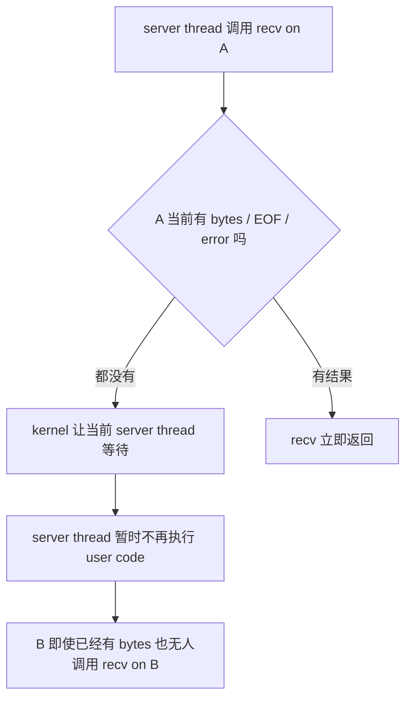
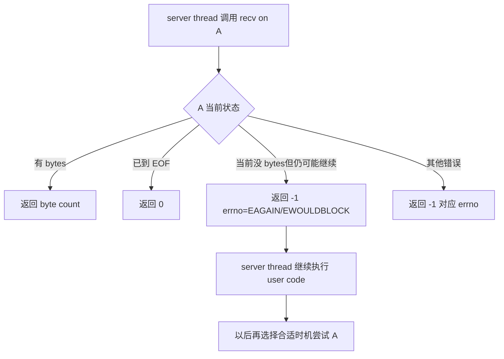
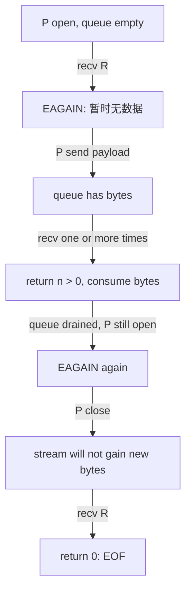
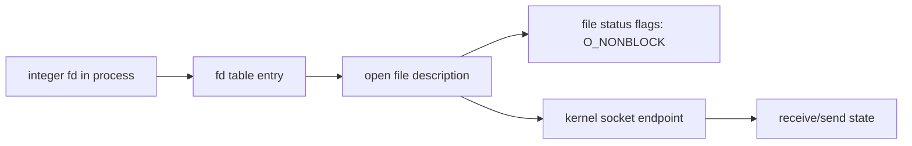

# Week9 Day1：blocking 与 non-blocking 到底改变了什么

> 今日定位：Week9 起点，先理解 non-blocking I/O 的返回语义。
>
> 今日唯一主问题：当 stream socket 当前没有数据时，怎样让 `recv` 不睡眠，并准确区分“暂时没有数据”和“peer 已经关闭”？
>
> 今日主要产出：
>
> ```text
> ~/code/system-learning/cpp/week9/nonblocking_stream_probe.cpp
> C:\Users\FxorG\Desktop\gpt_infra\week9\day1\day1_note.md
> ```
>
> 今天不使用 `epoll`，不写 TCP server，也不提前设计 Reactor。

---

# Part 1：前情提要与必要术语

## 1. 前情提要：为什么 Week9 从这里开始

Week6 里，你已经写过 blocking TCP client/server。典型流程是：

```text
server accept connection
-> server read client data
-> server process data
-> server write response
```

只服务一个 client 时，这条流程很自然。

但假设一个单线程 server 已经接受两个 clients：

```text
client A：连接存在，但暂时不发送数据
client B：已经把 request 发到了 kernel receive buffer
```

如果 server 此时直接对 A 调用 blocking `recv`：

```text
server 当前 execution flow 在 A 的 recv 中睡眠
-> 它没有机会转去处理 B
-> B 明明已有数据，也只能等待
```

今天先不急着解决“怎样知道 B ready”。那是 Day2 的 `epoll`。

今天只解决更基础的问题：

```text
怎样让对 A 的 recv 在当前不能推进时直接返回，
而不是让当前 execution flow 睡眠？
```

---

## 2. blocking operation

**blocking** 来自 **block**，这里译为“阻塞”。

一次 blocking operation 在当前条件不满足时，可以让调用它的 **current execution flow** 等待。例如：

```text
socket 当前没有 bytes
peer 还没有关闭
-> blocking recv 没有结果可返回
-> 调用 recv 的 thread 进入等待
```

必须说清主语：

```text
被阻塞的是调用该 system call 的 thread / execution flow。
```

不是说整个 process 中的所有 threads 必然一起停止。若 process 还有其他 threads，它们仍可能运行。

**今天的 server 问题之所以严重，是因为我们计划只用一个 event-loop thread 管理许多 connections。这个唯一 execution flow 一旦睡在某个 connection 上，其他 connections 也得不到处理。**

一句话记忆：

```text
blocking：当前操作暂时不能完成时，允许调用者等待。
```

---

## 3. non-blocking mode

**non-blocking**：非阻塞。

对今天的 socket read 来说，它的含义是：

```text
有 bytes      -> 立即返回当前能取得的 bytes
已经 EOF      -> 立即返回 0
当前没 bytes，peer 仍存在 -> 立即返回 -1，并报告 EAGAIN/EWOULDBLOCK
其他错误      -> 立即返回 -1，并报告相应 errno
```

non-blocking 不等于：

```text
操作一定成功
一次读完整条 message
kernel 在后台替你读完
函数变成另一个 thread
程序不再需要等待任何事件
```

它只改变“本次调用当前不能推进时怎么办”：

```text
blocking：调用者可以睡眠等待
non-blocking：本次调用返回 would-block 状态
```

一句话记忆：

```text
non-blocking 不是保证完成，而是保证不能立即推进时不在这次调用里等。
```

---

## 4. file status flags 与 O_NONBLOCK

### 4.1 flag

**flag**：标志位。

它通常是一个 integer 中的某些 bit，用来表示 object 当前启用了哪些选项。

### 4.2 file status flags

**file status flags**：打开资源的状态标志。

今天关注其中的：

```cpp
O_NONBLOCK
```

`O_` 是 Linux/POSIX 文件打开相关常量常见的命名前缀；`NONBLOCK` 表示 non-blocking。

对已经创建好的 fd，可以使用 `fcntl` 查询和修改这些 flags。

### 4.3 flags 属于谁

今天先记住下面的对象关系：

```text
process fd table entry
        |
        v
open file description(这里有 file status flag)
        |
        v
socket object
```

`O_NONBLOCK` 是 open file description 上的 file status flag，不是 C++ local variable，也不是 `recv` 的一次性参数。

因此，如果两个 fd entries 通过 `dup` 或 `fork` 后引用同一个 open file description，修改 `O_NONBLOCK` 可能会被这些 references 共同观察到。

今天的 `socketpair` 会产生两个相互连接的 endpoints；它们是两个不同的 open file descriptions。只把 receiver endpoint 设成 non-blocking，不会自动把 peer endpoint 也改成 non-blocking。

---

## 5. fcntl

`fcntl` 来自 **file control**，可以理解为“文件描述符控制接口”。

头文件：

```cpp
#include <fcntl.h>
```

接口是 variadic function，也就是参数数量会随 command 改变：

```cpp
int fcntl(int fd, int command, ...);
```

今天只使用两个 commands：

```text
F_GETFL：get file status flags，查询现有 flags
F_SETFL：set file status flags，写回新的 flags
```

### 5.1 F_GETFL

```cpp
int flags = ::fcntl(fd, F_GETFL);
```

结果：

```text
成功 -> 返回当前 file status flags
失败 -> 返回 -1，并设置 errno
```

### 5.2 F_SETFL

```cpp
int result = ::fcntl(fd, F_SETFL, flags | O_NONBLOCK);
```

结果：

```text
成功 -> 返回 0
失败 -> 返回 -1，并设置 errno
```

这里使用 bitwise OR：

```cpp
flags | O_NONBLOCK
```

意思是保留原来的 flags，同时打开 `O_NONBLOCK` 对应的 bit。

不能直接想当然地写：

```cpp
::fcntl(fd, F_SETFL, O_NONBLOCK);
```

因为这会用一组新 flags 覆盖可由 `F_SETFL` 修改的现有状态，而不是明确保留已有 flags。

### 5.3 最小独立例子

下面只演示“把一个已经存在的 fd 设为 non-blocking”，不包含今天主练习的读取流程：

```cpp
#include <cerrno>
#include <fcntl.h>

bool set_nonblocking(int fd) {
    const int old_flags = ::fcntl(fd, F_GETFL);
    if (old_flags == -1) {
        return false;
    }

    if (::fcntl(fd, F_SETFL, old_flags | O_NONBLOCK) == -1) {
        return false;
    }

    return true;
}
```

这里没有打印 `errno`，因为它只是展示调用形态。你的正式程序遇到失败时，应输出具体阶段和 error message，并返回 non-zero。

---

## 6. errno、EAGAIN 与 EWOULDBLOCK

### 6.1 errno

`errno` 是 thread-local error indicator。许多 C/POSIX interfaces 失败后，会把更具体的 error number 写到它。

头文件：

```cpp
#include <cerrno>
```

正确使用顺序：

```text
先检查 function return value 表示失败
-> 只有失败时再读取 errno
```

不要在一次成功调用后，通过旧的 `errno` 判断本次是否成功。成功的 system call 通常没有义务把过去的 `errno` 清零。

### 6.2 EAGAIN

`EAGAIN` 可以按 **try again** 来记：当前不能完成，请稍后再试。

对 non-blocking stream read：

```text
当前 receive buffer 没有可取 bytes
并且当前还不能报告 EOF
-> recv 返回 -1
-> errno == EAGAIN 或 EWOULDBLOCK
```

### 6.3 EWOULDBLOCK

`EWOULDBLOCK`：**operation would block**，操作如果继续就会阻塞。

Linux 上 `EAGAIN` 与 `EWOULDBLOCK` 通常具有相同数值，但 portable code 不应依赖它们永远相同。今天判断：

```cpp
errno == EAGAIN || errno == EWOULDBLOCK
```

### 6.4 would block 不是什么

它不是：

```text
peer close
connection broken
永远不会再有数据
程序逻辑失败
需要立即 close fd
```

它只描述这一刻：

```text
现在继续 recv 没有 bytes 可返回；non-blocking mode 不允许在这里等。
```

---

## 7. EOF

**EOF** = **End Of File**，输入结束。

虽然名字来自 file，对 stream socket 也用 `recv` 返回 `0` 表示：

```text
对端已经关闭它的发送方向
并且在此之前发送的 bytes 已经全部被本端取走
```

必须把这两种返回分开：

```text
-1 + EAGAIN/EWOULDBLOCK：peer 可能以后继续发送，当前只是没数据
0：这个 stream 方向已经到达 EOF，以后不会再出现新的 bytes
```

如果 peer 先发送 `hello`，再关闭：

```text
第一次 recv 可能先返回 5，得到 hello
下一次 recv 才返回 0
```

peer close 不会让已经排队的数据凭空消失。EOF 位于这些 bytes 之后。

---

## 8. partial I/O

**partial**：部分的。

**partial I/O** 表示一次 I/O call 只完成 caller 请求的一部分。

例如：

```cpp
char buffer[4096];
const ssize_t n = ::recv(fd, buffer, sizeof(buffer), 0);
```

即使 caller 提供了 4096-byte buffer，`n` 也可能是：

```text
1
17
1000
4096
```

`sizeof(buffer)` 是“本次最多接收多少”，不是“必须等到这么多才返回”。

对 TCP 或 `SOCK_STREAM`：

```text
sender 一次 send 100 bytes
不保证 receiver 一次 recv 正好得到 100 bytes
```

stream 只承诺有序 bytes，不保存 application message boundaries。

今天的 probe 会把收到的所有 chunks 拼回原 payload，再验证内容，而不是断言第一次 `recv` 必须返回完整字符串。

---

## 9. drain

**drain** 原意是“排空”。

在 non-blocking read 中，今天把它理解为：

```text
反复 recv 当前可以取得的 bytes
直到返回 EAGAIN/EWOULDBLOCK 或 EOF
```

它不是说关闭 connection，也不是说一次 `recv` 必须拿完所有未来数据。

drain boundary 是：

```text
当前时刻已经没有更多可立即读取的 bytes
```

Day2、Day3 会把这个动作接到 epoll readiness event 后面。

---

## 10. socketpair

`socketpair`：创建一对已经彼此连接的 sockets。

头文件：

```cpp
#include <sys/socket.h>
```

签名：

```cpp
int socketpair(int domain, int type, int protocol, int socket_vector[2]);
```

今天使用：

```cpp
int sockets[2];
const int result = ::socketpair(AF_UNIX, SOCK_STREAM, 0, sockets);
```

参数含义：

```text
AF_UNIX：Unix domain，本机 kernel 内的进程间通信 domain
SOCK_STREAM：有序 byte stream 语义
0：使用该 domain/type 的默认 protocol
sockets：成功后接收两个新 fd
```

返回值：

```text
成功 -> 0，并把两个 owned fds 写入 sockets[0]、sockets[1]
失败 -> -1，errno 说明原因，不产生可用 pair
```

成功后：

```text
向 sockets[0] 发送的 bytes，可从 sockets[1] 接收
向 sockets[1] 发送的 bytes，可从 sockets[0] 接收
```

它不是 TCP connection：

```text
没有 IP address
没有 TCP three-way handshake
不经过外部 network
```

但它同样提供 connected `SOCK_STREAM` endpoints，因此很适合把“stream + non-blocking return semantics”单独拿出来做 deterministic experiment。

### 10.1 最小独立例子

下面只证明 pair 创建成功，并正确释放两个 fd：

```cpp
#include <sys/socket.h>
#include <unistd.h>

int main() {
    int sockets[2] = {-1, -1};
    if (::socketpair(AF_UNIX, SOCK_STREAM, 0, sockets) == -1) {
        return 1;
    }

    ::close(sockets[0]);
    ::close(sockets[1]);
    return 0;
}
```

所有权：成功后当前 process 拥有两个 fds，最终都必须 `close`。

---

## 11. recv 与 send

### 11.1 recv

`recv` = **receive**，接收 bytes。

头文件：

```cpp
#include <sys/socket.h>
```

签名：

```cpp
ssize_t recv(int socket_fd, void* buffer, size_t length, int flags);
```

参数：

```text
socket_fd：从哪个 socket endpoint 接收
buffer：把收到的 bytes 写到哪里
length：本次最多写入多少 bytes
flags：本次 receive 的额外选项；今天使用 0
```

返回值必须按顺序分类：

| 返回值 | 含义 | 今天的动作 |
|---:|---|---|
| `> 0` | 实际收到的 byte count | 只处理 `[buffer, buffer + n)` |
| `0` | EOF | 记录 peer closed；不再期待新 input |
| `-1` 且 `EAGAIN/EWOULDBLOCK` | 当前 would block | 本轮 drain 完成，不 close |
| `-1` 且 `EINTR` | 被 signal interrupt | 重新执行本次 call |
| `-1` 且其他 errno | 真正 error | 输出错误并进入失败/cleanup |

`recv` 不自动补 `\0`。它返回的是 raw bytes，不是 C string。

### 11.2 recv 的最小独立分类

假设 `fd` 已经是一个 connected non-blocking socket：

```cpp
#include <cerrno>
#include <sys/socket.h>

char buffer[128];
const ssize_t n = ::recv(fd, buffer, sizeof(buffer), 0);

if (n > 0) {
    // 只有前 n 个 bytes 有效。
} else if (n == 0) {
    // Peer 的发送方向到达 EOF。
} else if (errno == EAGAIN || errno == EWOULDBLOCK) {
    // 当前没有 bytes；稍后有 readiness event 时再尝试。
} else {
    // 其他错误。
}
```

这个片段只展示一次 call 的分类，不是今天完整 drain loop。

### 11.3 send

`send`：向 connected socket 发送 bytes。

```cpp
ssize_t send(int socket_fd, const void* buffer, size_t length, int flags);
```

返回值：

```text
> 0：本次接受了多少 bytes
0：对本练习的 non-empty payload 表示没有进展，应作为 unexpected result 退出，不能原地死循环
-1：失败，通过 errno 分类
```

`send` 也可能 partial。今天 probe 的重点是 read semantics，但 test payload 最终必须完整发送，不能用“一次小 send 通常全写完”冒充接口保证。Day5 会系统处理 non-blocking partial write 与 pending output。

---

# Part 2：教程主体

# 教程开始：从“client A 不发数据，client B 为什么也被拖住”出发

## 12. 先把 blocking 因果链串完整

假设 server 只有一个 thread：

```text
server thread
-> accept A
-> accept B
-> recv(A)
```

此时 A 没有数据，B 已经有数据。

blocking 模式下：



逐步读图：

1. `recv(A)` 是 server thread 主动发起的一次 system call。
2. kernel 检查 A 对应 socket 的 receive state。
3. A 当前既没有可返回 bytes，也没有 EOF/error。
4. blocking contract 允许 kernel 让这个 thread 等待。
5. thread 不再执行后面的 user-space event handling，所以 B 也得不到处理。

重点不是 `recv` 很慢，而是：

```text
当前 execution flow 把“等待 A 将来变化”放进了这次 recv 调用中。
就是 server execution flow 会一直在等待 A 能 recv 到信息；导致 B 得不到处理，因为空不出来时间去调用 recv(B)；时间一直花在等待 A 了。
```

---

## 13. O_NONBLOCK 后，因果链怎样变化

receiver fd 启用 `O_NONBLOCK` 后：



变化只发生在“当前没有结果”的分支：

```text
原来：thread 可以睡在 recv 里面
现在：recv 返回 would-block，thread 重新获得控制权
```

但现在又出现一个新问题：

```text
程序什么时候应该再次尝试 A？
```

如果写成：

```text
recv(A) -> EAGAIN -> 立刻 recv(A) -> EAGAIN -> 立刻再 recv(A) ...
```

这叫 busy polling / busy loop：CPU 不断重复没有进展的调用。

Day2 会用 `epoll_wait` 让 thread 在“目前没有任何 fd ready”时等待，并在 kernel 观察到 readiness 后再回来处理。

今天先只建立正确返回语义，不抢跑通知机制。

---

# Round 1：独立实现 nonblocking_stream_probe.cpp

## 14. 这个程序到底做什么

你要写一个 self-validating executable，通过一对 local connected stream sockets，依次建立并区分三种 input state：

```text
State A：peer 仍 open，但当前没有 bytes
State B：peer 已发送 payload，并且 receiver 可以 drain bytes
State C：payload 已 drain，peer 随后 close，receiver 到达 EOF
```

程序不读取 keyboard，不访问 network，也不依赖另一个 process。所有操作都由同一个 `main` 按确定顺序完成。

它的价值不是演示 `socketpair` 本身，而是让你亲手确认：

```text
would block != EOF
recv buffer capacity != actual returned byte count
peer close 前发送的 bytes 位于 EOF 之前
```

---

## 15. 文件、输入、输出与成功标准

### 15.1 文件

Ubuntu：

```text
~/code/system-learning/cpp/week9/nonblocking_stream_probe.cpp
```

Windows note：

```text
C:\Users\FxorG\Desktop\gpt_infra\week9\day1\day1_note.md
```

### 15.2 输入

程序内部准备一段固定 payload，例如：

```text
nonblocking-stream
```

payload 是 bytes。是否包含结尾 `\0` 由你传给 `send` 的 length 决定；本练习不把 terminator 当作业务数据发送。

### 15.3 observable output

输出格式可以自己设计，但必须让人明确看到：

```text
empty-open state 被识别为 WOULD_BLOCK
发送后的全部 payload 被正确重建
peer close 后被识别为 EOF
最终 PASS 或 FAIL
```

示意，不要求逐字相同：

```text
empty_open: WOULD_BLOCK
payload: nonblocking-stream
after_peer_close: EOF
PASS
```

### 15.4 exit status

```text
所有观察与 payload validation 正确 -> return 0
任一 syscall unexpected failure 或状态不符 -> return non-zero
```

不要只打印错误后仍返回 0。

---

## 16. Round1 public contract

这是 standalone executable，没有要求你暴露 class API。它的 public contract 就是 caller 可观察的 process behavior：

1. 创建两个 connected `SOCK_STREAM` endpoints。
2. 只把 receiver endpoint 设置为 `O_NONBLOCK`。
3. 在 peer 保持 open 且未发送数据时调用 `recv`，必须观察到 `-1 + EAGAIN/EWOULDBLOCK`。
4. peer 完整发送固定 payload；receiver 使用一个刻意较小的 buffer，持续收集返回的 bytes。
5. receiver 必须按返回的 `n` 处理 bytes，最终重建的 payload 与原文完全相同。
6. payload 暂时 drain 完、peer 仍 open 时，receiver 再次观察到 would-block。
7. peer 随后 close；receiver 最终观察到 `recv == 0`。
8. 所有成功创建的 fds 都被关闭；任一 unexpected error 使程序失败。

你可以自由决定：

```text
是否写 helper function
helper 名称和签名
怎样表示 WOULD_BLOCK / EOF / ERROR
怎样组织 cleanup
怎样保存收到的 bytes
输出具体格式
```

Round1 不规定 private layout、函数调用顺序模板或完整 control flow。

---

## 17. Round1 必须处理的返回值

今天不是 error encyclopedia，只要求以下真实分支：

```text
socketpair failure
fcntl F_GETFL failure
fcntl F_SETFL failure
send > 0 / interrupted / error
send == 0 时按 unexpected no-progress 处理
recv > 0
recv == 0
recv -1 + EAGAIN/EWOULDBLOCK
recv -1 + EINTR
recv -1 + other errno
```

对于 `close` failure，学习 demo 可以报告，但不要因为 cleanup diagnostic 写出一整套异常框架。

---

## 18. Round1 明确不做

```text
不创建 TCP listening socket
不使用 IP address 或 port
不使用 epoll/select/poll
不创建 threads
不使用 sleep 猜测状态
不 busy-loop 等待未来数据
不实现 production RAII fd wrapper
不实现 generic send library
```

所有状态都由程序自己的操作顺序建立，不需要 scheduler timing。

---

## 19. 第一条编译运行命令

```bash
cd ~/code/system-learning/cpp/week9
g++ -std=c++17 -Wall -Wextra -g nonblocking_stream_probe.cpp -o nonblocking_stream_probe
./nonblocking_stream_probe
echo $?
```

预期：

```text
编译无 warning
程序打印三类状态和 PASS
echo $? 输出 0
```

---

## 20. Round1 阅读闸门

到这里停止阅读。

先独立完成：

```text
创建文件
画出两个 endpoints 的方向
实现 V1
编译运行
保留真实 compiler/runtime 问题
把你的设计和问题写入 day1_note.md
```

V1 不要求漂亮 abstraction，也不要求你预判 Day2 的 epoll。只要 observable contract 正确即可。

---

# Round 2：完成 V1 后再读，复检机制与状态

你当前的 R1 已经使用单个 `main` 建立完整轨迹。下面不再假设一份抽象实现，而是直接对照你的控制流：

```text
receiver_work(receiver_fd)
-> peer open + queue empty
-> EAGAIN

sender_work(sender_fd)
-> payload 进入 peer 的 receive queue

receiver_work(receiver_fd)
-> 以 2-byte buffer 多次取得 n > 0
-> append 到 recv_data
-> queue drain 完且 peer 仍 open
-> EAGAIN

close(sender_fd)
-> receiver_work(receiver_fd)
-> EOF

check()
-> reconstructed payload exact match
-> PASS
```

这条轨迹不依赖 thread scheduling，也不需要 `sleep`。因为 receiver 已经是 non-blocking，当前没有结果时 `recv` 会立刻把控制权还给同一个 `main`，随后由 `main` 主动制造下一个 socket state。

## 21. 三种状态为什么必须分开

把 receiver endpoint 记为 R，peer endpoint 记为 P。

### 21.1 P open，当前没发 bytes

```text
P 仍可能在未来发送
R receive queue 当前为空
R 是 non-blocking
-> recv(R) = -1
-> errno = EAGAIN/EWOULDBLOCK
```

此时若 close R，会把“暂时没数据”错误解释成“连接结束”。

### 21.2 P 已发 bytes，仍 open

```text
kernel queue 中已有一部分或全部 payload
-> recv(R) > 0
-> n 是本次实际取得的 byte count
```

继续读取后，当前 bytes 被 drain 完：

```text
P 仍 open
-> recv(R) 再次返回 EAGAIN/EWOULDBLOCK
```

### 21.3 P close，R 已取完此前 bytes

```text
不会再有新的 peer bytes
receive queue 也已耗尽
-> recv(R) = 0
```

这时才是 EOF。

完整轨迹：



---

## 22. 为什么小 buffer 是有价值的

如果 payload 长 18 bytes，而你的 receive buffer 只有 4 bytes，程序很可能观察到多个 chunks：

```text
4 + 4 + 4 + 4 + 2
```

但不要把这个具体拆分写成必须出现的结果。`SOCK_STREAM` 不保证 chunk boundaries。

正确 invariant 是：

```text
每次只 append recv 返回的 n bytes
所有 n > 0 的 chunks 按顺序拼接
最终 reconstructed bytes == sent payload
```

错误写法的思想是：

```text
我 send 了一次，所以 recv 也应该正好一次
```

正确写法的思想是：

```text
send/recv 是对 byte stream 的推进，不是 message 一一对应。
```

---

## 23. drain loop 的状态机

完成 R1 后，你的 receive loop 应该能映射到下面的状态机：

```text
call recv
    |
    +--> n > 0
    |       处理这 n bytes
    |       继续尝试 drain
    |
    +--> n == 0
    |       EOF，本方向结束
    |
    +--> n == -1 && EINTR
    |       本次没有形成业务结果，重试
    |
    +--> n == -1 && EAGAIN/EWOULDBLOCK
    |       当前 drain 完成，返回 event loop
    |
    +--> n == -1 && other errno
            error，进入 cleanup/failure
```

注意两种“继续”的区别：

```text
n > 0 后继续：可能还有已经排队的 bytes
EINTR 后继续：刚才的 call 被 signal 打断，还没有得到 I/O 结果
```

而 `EAGAIN` 后不应在没有新条件的情况下立刻无限重试。Day2 会让 `epoll_wait` 负责等待 readiness。

### 23.1 对照你的 `receiver_work`

你的 `receiver_work` 不是“只读一次”的 helper，而是一个 drain helper：

```text
n > 0       -> 保存这 n bytes，继续 recv
EAGAIN      -> 当前 drain 完成，return
EOF         -> 当前输入方向结束，return
other error -> 失败
```

因此，发送 payload 后的那一次 `receiver_work(receiver_fd)` 已经完成了两件事：

```text
先观察一个或多个 BYTES
再观察 queue drain 后的第二次 WOULD_BLOCK
```

当前 `main` 在它返回后、peer close 前又调用一次 `receiver_work`，只会重复证明同一个 empty-open 状态。它不影响正确性，但 canonical 版本可以删掉这次重复调用，让四段证据与四个状态转换一一对应。

### 23.2 sender 是否也要设置 non-blocking

`send()` 在“当前不能再把更多 bytes 放进这条 stream 的内核发送路径”时才会需要等待。最常见的原因就是 peer 一直不 `recv()`，数据越积越多，最终接收侧及其背后的发送缓冲空间没有容量了。

完整链是：

```
sender 调用 send(data)
    |
    v
kernel 检查这条 socket 当前还有没有可用发送容量
    |
    +-- 有空间
    |     -> 复制一部分或全部 data 到 kernel
    |     -> send 返回 n > 0
    |
    +-- 没空间
          |
          +-- sender_fd 是 blocking
          |     -> 调用 send 的 thread 睡眠等待
          |     -> peer recv 后释放容量，才可能继续
          |
          +-- sender_fd 是 non-blocking
                -> send 立刻返回 -1
                -> errno = EAGAIN / EWOULDBLOCK
```

所以“peer 的 receive queue 满了”是很好的第一层模型。不过更准确地说，`send` 看到的是“**本端目前没有可用的发送容量**”；peer 不读是造成这个状态最常见的原因。

---

## 24. non-blocking 不等于 asynchronous

**asynchronous**：异步。

今天的 `recv` 仍然是当前 thread 自己调用的：

```text
thread calls recv
-> kernel 当场检查 socket state
-> recv 当场返回 bytes / EOF / would-block / error
-> bytes 仍由这个 thread 的 user code 处理
```

没有发生：

```text
提交一个 recv request 后函数先返回
kernel 将来自动把 completion callback 推给你
另一个 hidden thread 替你执行 receive loop
```

所以：

```text
O_NONBLOCK 是 non-blocking readiness-style programming 的基础，
不是把同步 system call 变成 completion-style asynchronous I/O。
```

---

## 25. 为什么 O_NONBLOCK 要保留旧 flags

`F_GETFL` 与 `F_SETFL` 的目标不是写两行固定咒语。

完整因果链是：

```text
fd 引用一个 open file description
-> F_GETFL 读取它当前的 file status flags
-> old_flags | O_NONBLOCK 只增加 non-blocking bit
-> F_SETFL 写回可修改的 flags
-> 后续通过该 open file description 发起的 I/O 观察新模式
```

如果 `F_GETFL` 已失败，`old_flags` 不是有效 flags，不能继续拿它做 OR。

如果 `F_SETFL` 失败，程序也不能假装 fd 已经 non-blocking。否则后续一次空 `recv` 可能真的睡眠，让 probe 卡住。

---

## 26. fd、open file description 与 socket state

今天不把所有 kernel implementation 细节展开，只需要守住对象边界：



逐步读图：

1. C++ variable 中的 `int fd` 只是一个 integer value。
2. kernel 使用它索引当前 process 的 fd table entry。
3. entry 引用 open file description。
4. `O_NONBLOCK` 属于这层 description 的 status flags。
5. description 再关联实际 socket endpoint；bytes 与 peer-close state 属于 socket communication state。

因此：

```text
fcntl 修改的是 I/O mode state
send/recv 推进的是 stream data state
close 释放当前 fd reference
```

这三件事相关，但不是同一个动作。

---

## 27. close 与 EOF 不是同一个 process 内的同一瞬间

当 P 调用：

```cpp
::close(peer_fd);
```

P 释放自己的 fd reference。R 端之后通过 `recv` 观察到 EOF，但要满足：

```text
P 的发送方向已经关闭
此前进入 stream 的 bytes 已经被 R 取完
```

所以真实顺序可能是：

```text
P send payload
P close
R recv -> payload bytes
R recv -> 0
```

不能写成：

```text
只要 peer close，下一次 recv 就一定直接是 0，之前数据不算了
```

这个认识会在 Day3 的 peer cleanup 和 Day5 的 pending output 中继续使用。

---

## 28. errno diagnostic

出错时只打印 `errno` number 不够直观。可以使用：

```cpp
#include <cstring>
#include <iostream>

std::cerr << "recv failed: " << std::strerror(errno) << '\n';
```

`strerror` 根据 error number 返回可读文字。

但要注意：

```text
先保存或立即使用当前 errno
不要在读取它之前调用一串可能再次修改 errno 的函数
```

简单学习程序中，紧跟失败分支打印通常足够。

错误信息应包含阶段：

```text
fcntl(F_GETFL) failed
fcntl(F_SETFL) failed
initial recv failed
payload recv failed
```

只写 `error` 会让你不知道哪个 state transition 失败。

---

## 29. 用你的 V1 回答五个问题

不要重写代码，直接指向已有实现：

1. 哪一行把 receiver 的 open file description 改成 non-blocking？
2. 你的代码如何区分 would-block 与 EOF？
3. `recv` 返回 `n > 0` 后，你使用的是 buffer 中哪一段？
4. peer 保持 open 时，drain 完为什么得到 EAGAIN 而不是 0？
5. peer close 后，为什么仍可能先读到 bytes 再读到 0？

如果某个答案无法从代码看出来，再补一条短注释或 note；不需要给每一行写说明。

---

# Round 3：高价值验证与证据

## 30. 编译与正常运行

```bash
g++ -std=c++17 -Wall -Wextra -g nonblocking_stream_probe.cpp -o nonblocking_stream_probe
./nonblocking_stream_probe
echo $?
```

必须证据：

```text
零 warning
三种状态均被观察
payload exact match
exit status 0
```

这个程序没有 scheduler race，也没有随机 workload。若逻辑正确，一次确定性运行已经是主要证据；不要求机械运行 100 次。

### 30.1 你的 R1 已建立的证据

本次实际检阅结果：

```text
g++ -std=c++17 -Wall -Wextra -g：零 warning
空且 peer open：WOULD_BLOCK
2-byte receive buffer：观察到多次 partial reads
payload drain 后 peer 仍 open：WOULD_BLOCK
peer close 后：EOF
reconstructed payload == sent payload
PASS，exit status 0
```

具体 chunk 拆分只是本次 observation，不是长期 contract；真正的 oracle 是最终 bytes 完整、顺序一致。

### 30.2 从 R1 到 canonical 版本只收口这些

这些属于 R2/R3 工程整理，不推翻 R1 的机制通过：

```text
只把 receiver_fd 设置为 non-blocking
删掉已经不再使用的 thread/chrono includes 和旧 thread 注释
直接 include errno/perror/exit 所属 headers，不依赖传递包含
让 helper 把 failure 传回 main，再由 main 统一 close 已创建的 fds
删掉 drain 完成后、close 前那次重复 WOULD_BLOCK 调用
```

这里不要求引入 RAII fd class、GoogleTest 或通用 send framework。

---

## 31. 可选 strace 观察

`strace` = system call trace，记录 process 执行的 system calls。

只想看今天相关 calls，可以运行：

```bash
strace -e trace=socketpair,fcntl,sendto,recvfrom,close ./nonblocking_stream_probe
```

不同 libc/kernel 路径下，`send`/`recv` 可能显示为 `sendto`/`recvfrom`。观察重点不是逐行抄输出，而是寻找：

```text
socketpair 返回两个 fds
fcntl 查询并写回 flags
空 recv 返回 EAGAIN
send 推进 bytes
后续 recv 返回 bytes
peer close 后 recv 返回 0
两个 endpoints 最终被 close
```

若命令输出形式与你预想不同，先根据实际 syscall name 分析，不把工具显示差异误判成程序错误。

这是可选观察，不阻塞 Day1。

### 31.1 strace 观察例子

你可以把 `strace` 理解成：**Linux 内核交互的流水账记录器**。

你的 C++ 程序平时在 user space 跑；一旦调用 `socketpair`、`fcntl`、`send`、`recv`、`close`，就要通过 system call 进入 kernel。`strace` 会让程序作为被观察对象运行，并在每次 system call 的：

```text
调用前：记录传了什么参数
调用后：记录内核返回什么值、errno 是什么
```

所以它不是看你的 C++ 变量、`std::vector` 或函数逻辑；它专门看“程序实际向内核请求了什么，内核实际答复了什么”。

Day1 的命令：

```bash
strace -e trace=socketpair,fcntl,sendto,recvfrom,close ./nonblocking_stream_probe
```

`-e trace=...` 是过滤器。否则它还会打印 `execve`、`mmap`、加载动态库等一大堆启动噪声。现在只保留今天最关心的五类内核交互。

你的程序大致会看到这条证据链：

```text
socketpair(AF_UNIX, SOCK_STREAM, 0, [3, 4]) = 0
```

创建两个已连接的 Unix stream socket。`3`、`4` 是当前进程里的 fd。

```text
fcntl(4, F_GETFL) = ...
fcntl(4, F_SETFL, ... | O_NONBLOCK) = 0
```

先读取 receiver 的 file status flags，再加上 `O_NONBLOCK` 写回。这样你能确认：不是“代码写了 `set_nonblocking` 就算”，而是 kernel 真接受了这个设置。

```text
recvfrom(4, ..., 2, 0, NULL, NULL) = -1 EAGAIN
```

这是空 receive queue、peer 仍 open 时的关键证据。`recv` 没有睡住，而是从 kernel 回来了，并报告 `EAGAIN`。

```text
sendto(3, "this is a test!", 15, 0, NULL, 0) = 15
recvfrom(4, "th", 2, 0, NULL, NULL) = 2
recvfrom(4, "is", 2, 0, NULL, NULL) = 2
...
```

说明 sender 确实把 bytes 交给 kernel；receiver 每次真正取得多少，完全由返回值决定。你这次 buffer 是 `2` bytes，所以恰好观测到一段段读出。

```text
recvfrom(4, ..., 2, 0, NULL, NULL) = -1 EAGAIN
```

payload 已 drain，但 sender 还没有 close，因此这是第二次 would-block，不是 EOF。

```text
close(3) = 0
recvfrom(4, ..., 2, 0, NULL, NULL) = 0
close(4) = 0
```

关闭 sender endpoint 后，receiver 才观察到 `recv == 0`，即 EOF。

你源码写的是 `send` / `recv`，为什么 `strace` 常显示 `sendto` / `recvfrom`？因为 `strace` 看的是更底层的实际 system call；socket API 的 libc wrapper 可能用 `sendto` / `recvfrom` 这一层实现普通 stream 的 `send` / `recv`，地址参数则是空。它不表示你突然用了 UDP，也不表示真的经过网络。

它和 `printf`、`gdb` 的区别是：

```text
printf：
你自己说“我认为走到了这里”。

gdb：
看源码、变量、调用栈，控制程序执行。

strace：
看程序实际是否调用了 kernel interface，
以及 kernel 实际返回了什么。
```

所以它特别适合排查这类问题：

```text
我明明设置了 O_NONBLOCK，为什么还卡住？
-> 看 fcntl 是否真的成功。

我以为是 EOF，为什么程序还在等？
-> 看 recv 是 0，还是 -1 + EAGAIN。

我以为写出去了，为什么 peer 没收到？
-> 看 send 实际返回多少 bytes，是否 EAGAIN / EPIPE。

我以为 fd 关了，为什么连接状态还奇怪？
-> 看 close 调用顺序和返回值。
```

但也要守住边界：`strace` 看不到 kernel 内部完整的 socket queue 状态，也看不到你的 C++ 对象生命周期；而且它会明显拖慢程序、改变时序，所以不能用它证明多线程 race 是否存在。对 Day1 这种单线程确定性 state trace，它正好非常合适。

---

## 32. 不需要的测试体力活

今天不要求：

```text
GoogleTest
CMake/CTest
TSan
ASan stress loop
TCP multi-client test
benchmark
```

原因不是这些工具没价值，而是它们回答不了今天最核心的新问题。

例如：

```text
TSan clean 不能证明你区分了 EAGAIN 和 EOF
benchmark 不能证明 partial bytes 被正确拼回
100 次重复不能替代对返回值的正确分类
```

今天的核心证据是一个 deterministic state trace。

---

## 33. day1_note.md 只记录什么

不复制整篇教程。建议只保留：

```text
## R1 design
你怎样建立 WOULD_BLOCK -> BYTES -> WOULD_BLOCK -> EOF

## Actual result
编译命令、关键输出、是否零 warning

## Questions
真实卡住的问题

## One-sentence model
你自己压缩的一句话
```

如果代码已经清楚证明某个 branch，不要求把同样逻辑再抄成验收题答案。

---

# Part 3：收尾、验证与验收

## 34. 今日完整机制链

```text
main creates two connected stream endpoints
-> main enables O_NONBLOCK on receiver description
-> recv while peer open and queue empty
-> kernel cannot return bytes/EOF
-> recv returns -1 + EAGAIN instead of sleeping
-> peer sends payload
-> receiver repeatedly consumes available chunks
-> queue becomes empty while peer remains open
-> recv returns EAGAIN again
-> peer closes
-> receiver observes recv == 0
-> main closes remaining fd and exits 0
```

这条链里：

```text
O_NONBLOCK 决定“不能立即推进时是否等待”
socket state 决定当前是 bytes、would-block 还是 EOF
程序负责按 return value 推进自己的 control flow
```

---

## 35. 今日验收问题

不要求机械抄写。如果代码和 note 已经明确证明，可以口述或在检阅时直接指向证据。

1. blocking `recv` 阻塞的是谁？为什么单线程多连接 server 特别怕这一点？
2. `O_NONBLOCK` 改变了什么？它为什么不等于 asynchronous I/O？
3. `recv == -1 && errno == EAGAIN` 与 `recv == 0` 分别表示什么？
4. 为什么 `recv(fd, buffer, 4096, 0)` 不保证返回 4096，也不保证对应 sender 的一次 `send`？
5. 为什么设置 `O_NONBLOCK` 前先 `F_GETFL`，再写回 `old_flags | O_NONBLOCK`？
6. peer 发送 payload 后立刻 close，receiver 为什么可能先得到 bytes，之后才得到 EOF？

---

## 36. Day1 通过标准

```text
能独立实现 nonblocking_stream_probe.cpp
编译零 warning
能稳定区分 WOULD_BLOCK、BYTES 与 EOF
payload validation 不依赖一次 recv 读完
unexpected error 导致 non-zero exit
所有成功创建的 fds 被 close
能解释 O_NONBLOCK、EAGAIN、EOF 和 partial read
```

以下不阻塞：

```text
没有 RAII fd wrapper
没有 epoll
没有 TCP/IP
没有 GoogleTest
没有 benchmark
没有完整处理所有 signal/error recovery policy
```

---

## 37. 明天接什么

今天结束后，你已经能做到：

```text
recv 当前不能推进 -> 返回 EAGAIN -> thread 继续执行
```

但还缺：

```text
thread 怎样避免不停重试所有 currently-empty fds？
kernel 怎样告诉它“某个 fd 现在可能可以推进了”？
```

Day2 会从这个缺口进入：

```text
epoll_create1
epoll_ctl
epoll_wait
interest list
readiness event
```

Day2 的重点不是背三个 API，而是理解：

```text
epoll 负责通知可能推进的 fd；
程序仍然必须自己调用 recv，并按 bytes / EOF / EAGAIN / error 分类。
```

---

## 38. 今日一句话

```text
O_NONBLOCK 不保证 I/O 完成；它让当前不能立即推进的 recv 用 EAGAIN 把控制权还给程序，而 EOF 仍由返回 0 单独表示。
```
