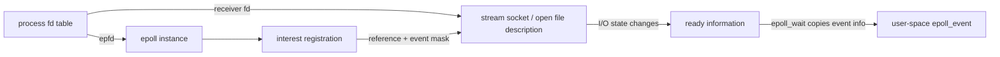
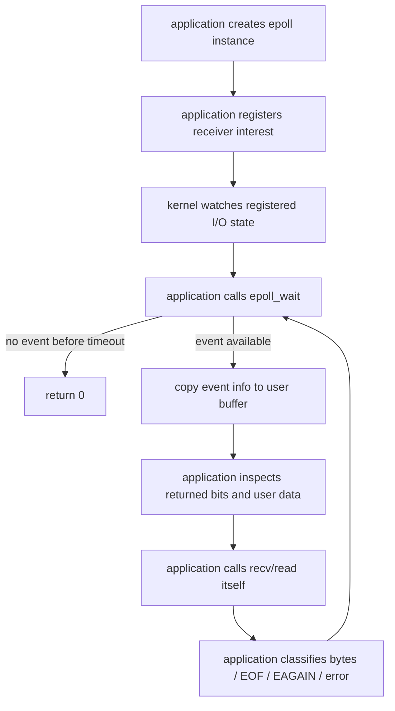

# Week9 Day2：epoll 报告的 readiness 到底是什么

> 当前主线：non-blocking I/O -> epoll readiness -> multi-connection event loop
>
> 前置状态：Week9 Day1 已正式通过；你已经能区分 `recv > 0`、`recv == 0` 与 `EAGAIN/EWOULDBLOCK`，并能把一个 stream endpoint drain 到 would-block。
>
> 今日唯一产出：`epoll_stream_probe.cpp`
>
> 今日核心问题：既然 non-blocking `recv` 在暂时没数据时会返回，程序怎样避免自己不停轮询每一个 fd？
>
> 默认环境：Ubuntu Linux，C++17，`g++ -std=c++17 -Wall -Wextra -g`

---

# Part 1：前情提要与必要术语

## 1. 前情提要：Day1 解决了什么，还缺什么

Day1 的 receiver 已经不会被某一个空 socket 卡住：

```text
receiver fd is non-blocking
-> recv 当前能取得 bytes：返回 n > 0
-> peer 已关闭且 queued bytes 已耗尽：返回 0
-> 当前不能推进：返回 -1，errno = EAGAIN/EWOULDBLOCK
```

这解决的是：

```text
一次 recv 不能推进时，调用它的 execution flow 是否必须睡眠
```

但如果 server 有很多 connections，下面这种办法仍然不好：

```text
for each fd:
    recv(fd)
    如果 EAGAIN，就试下一个

什么都没发生
-> 再把所有 fd 试一遍
-> 再试一遍
-> 再试一遍
```

所有 fd 都暂时没数据时，这个 execution flow 仍在运行，只是在重复制造 `EAGAIN`。这叫 busy polling：CPU 做了很多检查，却没有业务进展。

Day2 要补上的能力是：

```text
把“等待任意一个关注的 fd 可能推进”交给 kernel
-> 当前没有 event 时，event-loop thread 可以睡眠
-> 某个 fd 状态变化后，kernel 让 wait 返回
-> program 再对返回的 fd 执行真实 recv/read
```

今天不写 TCP server。仍然使用 Day1 熟悉的 local stream endpoints，把注意力只放在 epoll object、registration、wait result 和 socket state 的关系上。

---

## 2. I/O multiplexing

`I/O` = Input/Output，输入/输出。

`multiplexing` 来自 multiplex，表示把多个来源汇集到一个协调点处理。`I/O multiplexing` 常译为 **I/O 多路复用**。

今天把它理解成：

```text
一个 execution flow
通过一次等待
关注多个 I/O objects 中谁当前可能推进
```

它不表示：

```text
kernel 替 application 读完了所有数据
多个 callbacks 自动并行运行
一次 event 就对应一条完整 message
```

Day2 的 probe 只注册一个 endpoint，是为了看清 API。Day3 才把同一个等待点扩展到 listening socket 与多个 connection sockets。

记忆句：

> Multiplexing 复用的是“等待点”，不是替你完成业务 I/O。

---

## 3. readiness

`readiness` 来自 `ready`，表示“准备就绪的状态”。在 epoll 上通常译为 **I/O 就绪状态**。

今天的 readable readiness 可以先读成：

```text
对这个 fd 做 read-like operation，当前有机会立即得到一个结果，
而不是因为暂时没有结果一直睡眠。
```

这个结果可能是：

```text
bytes
EOF
error
```

所以 `readable` 不能简单翻译成“里面一定有业务数据”。更不能理解成：

```text
有一条完整 message
一定能读满 caller 提供的 buffer
event 已经替我保留了这些 bytes
```

`readiness notification` = 就绪通知。它告诉程序“现在值得尝试”，真正取得什么仍以随后 `recv/read` 的返回值为准。

记忆句：

> readiness 是一次尝试 I/O 的机会，不是 I/O 结果本身。

---

## 4. epoll

Linux man page 对 `epoll` 的正式描述是：

```text
I/O event notification facility
```

即 **I/O event 通知设施**。正式文档没有要求把 `epoll` 强行拆成一个缩写，因此不要为了记忆编造展开。

epoll API 的职责是：

```text
监视一组被注册的 fds
-> kernel 根据 I/O activity 维护 readiness information
-> epoll_wait 把当前 events 返回给 user space
```

epoll 不负责：

```text
创建 TCP connection
调用 recv/send
保存 application message
解析 protocol
决定 connection object lifetime
```

这些仍然属于 application。

权威查证：[Linux `epoll(7)`](https://man7.org/linux/man-pages/man7/epoll.7.html)。

---

## 5. epoll instance

`instance` = 一个具体实例。

调用 `epoll_create1` 后，kernel 创建一个 epoll instance，并返回一个 fd 让当前进程访问它。这个 fd 常命名为：

```cpp
int epfd;
```

其中：

```text
ep：epoll
fd：file descriptor
```

这里有两个不同对象：

```text
receiver_fd -> stream socket object
epfd        -> epoll instance
```

epfd 本身不是被监视的 socket，也不保存 socket payload。它是当前进程访问 epoll instance 的入口。

---

## 6. interest list

`interest` = 感兴趣、关注。

`interest list` = **关注列表**：application 已经告诉某个 epoll instance 要监视哪些 fd，以及分别关心哪些 events。

例如：

```text
receiver_fd
-> interest = EPOLLIN
-> application 关心它何时具有 readable readiness
```

interest list 保存的是 registration information，不是：

```text
socket 中的 bytes
event 发生次数日志
application 的 input buffer
```

registration 在一次 `epoll_wait` 返回后不会自动消失。除非显式修改/删除、相关对象被关闭，或使用今天不学的特殊 one-shot 模式，否则后续还可以继续等待同一个 registration。

---

## 7. ready list

`ready list` = **就绪列表**。

从 user-space mental model 看，它由 kernel 根据被监视对象的 I/O activity 动态维护，保存当前 ready registrations 的引用。`epoll_wait` 可以理解为从这里取得当前可交付给程序的 event information。

不要把 ready list 想成精确的业务 event 日志：

```text
peer send 了几次
!= epoll_wait 必须返回几次

epoll_wait 返回一次
!= socket 中只有一个 chunk
```

epoll 关心 readiness condition，不保存 TCP message boundary。

---

## 8. event、interest 与 returned event

`event` = 事件。

今天要分开两件事：

```text
注册时：application 指定自己关心哪些 event bits
返回时：kernel 告诉 application 当前发生/满足哪些 event bits
```

例如 `EPOLLIN`：

```text
注册侧 EPOLLIN：我关心 readable readiness
返回侧 EPOLLIN：这个 registration 当前报告 readable readiness
```

`EPOLLIN` 中的 `IN` 可以记成 input。它表示对应对象当前适合尝试 read-like operation，不表示已经把 input bytes 放进 `epoll_event`。

---

## 9. timeout

`timeout` = 等待的时间上限。

`epoll_wait` 的 timeout 参数以 milliseconds 为单位：

```text
timeout > 0：最多等待对应毫秒数
timeout == 0：不等待，立即检查并返回
timeout == -1：无限等待，直到 event 或 interrupt
```

今天的 probe 主要使用：

```text
0：确定性检查“此刻有没有 event”
一个有限正数：防止实验逻辑错误时永久挂住
```

不使用 `sleep` 猜测时序，也不让正常实验依赖无限等待。

---

## 10. level-triggered

`level-triggered`，缩写 `LT`，通常译为 **水平触发**。

Day2 只建立第一层：默认不指定 `EPOLLET` 时，epoll 使用 LT behavior。只要 readable condition 仍成立，后续 `epoll_wait` 仍可以继续报告它。

例如 socket 中还有未读 bytes：

```text
epoll_wait reports EPOLLIN
-> application 暂时不 recv
-> socket 仍 readable
-> 下一次 epoll_wait 仍可以报告 EPOLLIN
```

Day6 才会把 LT 与 edge-triggered (`ET`) 做受控对照。今天不添加 `EPOLLET`。

---

## 11. 四个对象先分开



读图只抓四件事：

1. `epfd` 与 `receiver_fd` 是两个不同 fd，分别访问不同 kernel objects。
2. `epoll_ctl` 把 receiver 的 registration 放进 epoll instance 的 interest list。
3. socket 的 I/O state 变化后，kernel 更新 epoll 内部 ready information。
4. `epoll_wait` 只把 event information 复制到 user-space output buffer；它不消费 socket bytes。

---

# Part 2：教程主体

# 教程开始：从“不能阻塞之后，难道要一直 recv 吗”出发

## 12. busy polling 为什么不是答案

假设有三个 non-blocking connections：

```text
fd 7：当前无数据
fd 8：当前无数据
fd 9：当前无数据
```

程序不断执行：

```text
recv(7) -> EAGAIN
recv(8) -> EAGAIN
recv(9) -> EAGAIN
repeat
```

它没有阻塞，但也没有真正解决等待问题：

```text
execution flow 一直 RUNNING
-> 反复进入 kernel
-> 反复得到相同的 EAGAIN
-> 消耗 CPU time
```

epoll 改变的是“等待谁”的方式：

```text
blocking recv(fd 7)
-> 只等待 fd 7 的 read outcome
-> fd 8 即使 ready，这个 execution flow 也还卡在 recv(7)

epoll_wait(epfd)
-> 等待 interest list 中任意 registration 的 event
-> 哪个 fd 可能推进，就返回哪个 fd 对应的 event information
```

`epoll_wait` 自己也可以阻塞当前 thread，但这是有目的的：它等待的是**任意被关注对象**，而不是把整个 execution flow 绑死在某一个 connection 的 `recv` 上。

---

## 13. create -> register -> wait -> consume 的职责链

先只看责任，不看完整程序：



这里每一步的主体必须说清：

```text
application：create、register、wait、recv、解释返回值
kernel：维护 epoll instance、观察 I/O state、交付 ready information
```

kernel 不会因为 `EPOLLIN` 自动替你执行 `recv`。

---

## 14. `epoll_create1`：创建 epoll instance

### 14.1 名字与接口

`create` = 创建。

头文件：

```cpp
#include <sys/epoll.h>
```

接口：

```cpp
int epoll_create1(int flags);
```

参数：

```text
flags == 0：创建普通 epoll fd
flags == EPOLL_CLOEXEC：同时为新 fd 设置 close-on-exec
```

今天可以使用 `EPOLL_CLOEXEC`。它只是在以后 `exec` 新程序时避免意外继承该 fd，不改变 readiness 机制；使用 `0` 也不影响今天的实验结论。

返回值：

```text
成功：>= 0，新的 epoll fd
失败：-1，并设置 errno
```

所有权：

```text
成功返回的 epfd 由 caller 拥有
-> 不再使用时 close(epfd)
-> 最后一个指向该 epoll instance 的 fd 被关闭后，kernel 释放 instance
```

### 14.2 最小独立调用例子

下面只展示创建，不注册任何 socket：

```cpp
#include <sys/epoll.h>
#include <unistd.h>

#include <cerrno>
#include <cstdio>

int main() {
    const int epfd = ::epoll_create1(EPOLL_CLOEXEC);
    if (epfd == -1) {
        std::perror("epoll_create1");
        return 1;
    }

    std::printf("epoll fd = %d\n", epfd);

    if (::close(epfd) == -1) {
        std::perror("close epfd");
        return 1;
    }
    return 0;
}
```

编译运行：

```bash
g++ -std=c++17 -Wall -Wextra -g epoll_create_demo.cpp -o epoll_create_demo
./epoll_create_demo
```

这个例子只能证明 epoll instance 被创建并关闭，不能证明任何 socket readiness。

权威查证：[Linux `epoll_create1(2)`](https://man7.org/linux/man-pages/man2/epoll_create.2.html)。

---

## 15. `epoll_event`：注册输入与等待输出共用的结构

### 15.1 结构的两个核心字段

头文件仍是：

```cpp
#include <sys/epoll.h>
```

user-space 主要看到：

```cpp
struct epoll_event {
    uint32_t events;
    epoll_data_t data;
};
```

实际 header 使用的 integer typedef 可能显示成不同名字；今天只抓语义：

```text
events：bit mask，描述关注或返回的 event bits
data：application 自己附带的 user data，kernel 保存后在 event 返回时原样带回
```

`epoll_data_t` 是一个 union，可以保存 `fd`、pointer、32-bit integer 或 64-bit integer。Day2 只使用：

```cpp
event.data.fd = watched_fd;
```

这不是 kernel 自动填写的“发生事件的 fd”。是 application 注册时主动保存 `watched_fd`，之后 kernel 把这份 data 带回来。

### 15.2 为什么要 value-initialize

推荐：

```cpp
epoll_event event{};
```

`{}` 会把 structure 的 members 做零初始化，再由你写入需要的 fields。这样不会读取未初始化的 `events` 或 union member，也不会意外携带无关 event bits。

### 15.3 bit mask 怎样判断

event bits 可以组合：

```cpp
event.events = EPOLLIN;
```

返回后判断某一 bit：

```cpp
if ((event.events & EPOLLIN) != 0U) {
    // readable readiness was reported
}
```

不要默认用：

```cpp
event.events == EPOLLIN
```

因为 returned mask 可能同时包含多个 bits。今天只处理 `EPOLLIN` 主线；`EPOLLHUP`、`EPOLLERR`、`EPOLLRDHUP` 留到 Day6 系统处理。

权威查证：[Linux `epoll_event(3type)`](https://man7.org/linux/man-pages/man3/epoll_event.3type.html)。

---

## 16. `epoll_ctl`：修改 interest list

### 16.1 名字与接口

`ctl` = control，控制。

接口：

```cpp
int epoll_ctl(int epfd, int op, int fd, struct epoll_event* event);
```

参数：

```text
epfd：要操作的 epoll instance
op：operation，ADD / MOD / DEL
fd：target fd，也就是被监视的 fd
event：新的 interest settings 与 application data
```

三种 operation：

```text
EPOLL_CTL_ADD：add，新增 registration
EPOLL_CTL_MOD：modify，修改已有 registration
EPOLL_CTL_DEL：delete，删除 registration
```

Day2 Round1 只需要 `EPOLL_CTL_ADD`。`MOD` 会在 Day5 动态开关 `EPOLLOUT` 时成为主角；`DEL` 与 close/lifetime 在 Day6 再完整处理。

返回值：

```text
成功：0
失败：-1，并设置 errno
```

### 16.2 最小独立调用形式

下面假设 `epfd` 与 `watched_fd` 已经有效，只展示一次 registration：

```cpp
epoll_event interest{};
interest.events = EPOLLIN;
interest.data.fd = watched_fd;

if (::epoll_ctl(epfd, EPOLL_CTL_ADD, watched_fd, &interest) == -1) {
    std::perror("epoll_ctl ADD");
    // caller performs cleanup
}
```

调用成功后发生的是：

```text
epoll instance 的 interest list 新增一项
-> target 指向 watched fd 对应的 open file description
-> interest mask 包含 EPOLLIN
-> associated user data 保存 watched_fd
```

它不会读取 `watched_fd`，也不会等待 event。

今天只要求 unexpected `epoll_ctl` failure 输出 diagnostic、cleanup 并 non-zero exit，不展开所有 errno 清单。

权威查证：[Linux `epoll_ctl(2)`](https://man7.org/linux/man-pages/man2/epoll_ctl.2.html)。

---

## 17. `epoll_wait`：等待并取得 ready event information

### 17.1 接口

```cpp
int epoll_wait(
    int epfd,
    struct epoll_event* events,
    int maxevents,
    int timeout
);
```

参数：

```text
epfd：要等待的 epoll instance
events：caller 提供的 output array/buffer
maxevents：events buffer 最多能接收多少项，必须 > 0
timeout：等待上限，单位 milliseconds
```

返回值：

```text
> 0：本次写入 events[0..n) 的 event 数量
== 0：timeout 到期，没有 event 被返回
== -1：失败，errno 描述原因
```

只有 `[0, ready_count)` 是本次有效输出，不能遍历整个 capacity 并把旧内容当成新 event。

### 17.2 最小独立调用形式

下面只做一次立即检查：

```cpp
epoll_event returned_event{};

const int ready_count = ::epoll_wait(epfd, &returned_event, 1, 0);
if (ready_count == -1) {
    std::perror("epoll_wait");
} else if (ready_count == 0) {
    std::puts("no event right now");
} else {
    std::printf(
        "data.fd=%d events=0x%x\n",
        returned_event.data.fd,
        returned_event.events
    );
}
```

这段代码假设 epfd 已经存在 registration，但不负责创建或注册。它展示的是 output buffer 与三类返回值。

一般 event loop 遇到 `EINTR` 可能重新等待；Day2 的单线程固定实验没有主动安装 signal handler，可以选择 retry 或把 unexpected interrupt 作为 diagnostic failure。不要为了这一个分支写完整 signal framework。

权威查证：[Linux `epoll_wait(2)`](https://man7.org/linux/man-pages/man2/epoll_wait.2.html)。

---

## 18. readiness 为什么不等于 reservation

`reservation` = 预留、保留。

epoll 返回 `EPOLLIN` 时，不会把某些 bytes 锁给当前 handler：

```text
kernel reports readiness
-> event information enters user-space buffer
-> socket state may still change before application calls recv
```

例如在更复杂的程序里：

```text
另一个 thread 先读取了同一个 socket
另一个 handler 改变或关闭了相关 state
程序先处理 event array 中其他 entries
```

因此可靠 event-driven code 仍然让 watched sockets 保持 non-blocking，并始终相信实际 `recv/read` 返回值，而不是把 event 当成“这次 recv 必成功”的许可证。

Day2 的 probe 是单线程、单 registration，事件后通常能直接读到刚发送的 payload；但你要建立的长期模型仍然是：

```text
event = notification
recv result = actual I/O outcome
```

---

# Round 1：独立实现 `epoll_stream_probe.cpp`

## 19. 这个程序到底做什么

你要写一个单进程、单线程的 deterministic probe：

```text
使用 socketpair 创建一对 connected stream endpoints
-> receiver 保持 non-blocking
-> 用一个 epoll instance 关注 receiver 的 EPOLLIN
-> 在没有 payload、payload 未消费、payload 已 drain 三种状态下调用 epoll_wait
-> 比较 wait result 与真实 recv result
```

它要回答四个问题：

1. 当前没有 readable condition 时，`epoll_wait(..., timeout=0)` 返回什么？
2. peer 写入 payload 后，returned event 怎样标识 receiver 与 `EPOLLIN`？
3. 默认 LT 下，如果第一次 event 返回后仍不读取，下一次 wait 会怎样？
4. payload 被 drain 到 `EAGAIN` 后，立即 wait 又会怎样？

这是一个 readiness probe，不是 echo server。

---

## 20. 文件、输入、输出与生命周期

### 20.1 文件

Ubuntu 建议位置：

```text
~/code/system-learning/cpp/week9/epoll_stream_probe.cpp
```

只创建这一个 source file。可以复用 Day1 自己已经写过的 `set_nonblocking` 和 receive-drain 思路，不要求重新发明一套 helper。

### 20.2 输入

程序不读取 command-line arguments 或 stdin。输入由程序内部确定性制造：

```text
一对 local stream endpoints
一个固定、非空的小 payload
程序主动控制 send、wait 与 drain 的先后关系
```

payload 不需要很大。今天验证的是 readiness 与 state，不是 partial-write/backpressure。

### 20.3 输出

输出格式由你设计，但必须能看出下面五段 evidence：

```text
A. before data：immediate wait returns 0
B. after send：wait returns an event for receiver with EPOLLIN
C. before consume：default LT reports receiver again
D. drain：reconstructed payload exact match, final recv state is EAGAIN/EWOULDBLOCK
E. after drain：immediate wait returns 0
```

最后打印 `PASS`，正常退出状态为 `0`。任何 syscall failure、错误 fd、缺失 bit、payload mismatch 或不符合预期的 wait count 都应 non-zero exit。

### 20.4 完整生命周期

从资源角度，程序会拥有：

```text
sender endpoint fd
receiver endpoint fd
epoll fd
```

正常与失败路径都要保证所有已经成功创建的 fds 最终关闭。今天不要求重写 `UniqueFd`；可以沿用 Day1 的“helper 把 failure 传回 main，由 main 统一 cleanup”。

---

## 21. Round1 observable contract

### 21.1 endpoint 与 registration

```text
socketpair 使用 AF_UNIX + SOCK_STREAM
只把 receiver endpoint 设置为 O_NONBLOCK
创建一个 epoll instance
只注册 receiver fd
interest mask 至少包含 EPOLLIN
associated data 能让 returned event 指回 receiver fd
```

### 21.2 wait evidence

```text
无 payload 时使用 timeout=0，必须返回 0
send 小 payload 后使用有限 timeout，必须返回至少一个 event
在单 registration probe 中，returned data.fd 必须等于 receiver fd
returned events 必须包含 EPOLLIN bit
第一次 event 后先不 consume，再立即 wait；默认 LT 应再次报告 readable receiver
```

不要通过 `sleep` 等待 event。send 与 wait 都由同一个 `main` 按确定顺序执行。

### 21.3 consume evidence

复用 Day1 已掌握的 receive classification：

```text
recv > 0：只保存实际 n bytes，继续 drain
recv == -1 && EAGAIN/EWOULDBLOCK：本轮 drain 完成
recv == 0：今天在 peer 仍 open 的 consume phase 中属于 unexpected
其他错误：failure
```

drain 后要求：

```text
reconstructed bytes == sent payload
peer remains open
immediate epoll_wait returns 0
```

### 21.4 小 payload 的发送边界

今天可以对固定小 payload 调用一次 blocking `send`，并要求返回值恰好等于 payload length；否则实验失败。不要在 Day2 提前实现 Day5 的 non-blocking pending-output state machine。

---

## 22. Round1 允许自由设计的部分

下面由你决定：

```text
helper 是否存在以及叫什么
event output buffer 使用单个 object 还是 array
每个 phase 怎样记录结果
cleanup 怎样组织
怎样构造最终 PASS oracle
输出文字的具体格式
```

Round1 不规定：

```text
class hierarchy
event-loop abstraction
Connection object
callback
通用 error wrapper
```

不要为了“以后会写 Reactor”提前设计这些抽象。

---

## 23. Round1 明确不做

```text
TCP socket / bind / listen / accept
multiple clients
thread / sleep
EPOLLET
EPOLLOUT
EPOLLONESHOT
EPOLLHUP / EPOLLERR / EPOLLRDHUP 的完整处理
EPOLL_CTL_MOD / DEL 的工程流程
GoogleTest / CMake / benchmark
通用 EventLoop / Channel / Connection classes
```

这些能力分别属于 Week9 后续天数或 Week10 Reactor。

---

## 24. 第一条编译运行命令

```bash
cd ~/code/system-learning/cpp/week9
g++ -std=c++17 -Wall -Wextra -g epoll_stream_probe.cpp -o epoll_stream_probe
./epoll_stream_probe
echo $?
```

第一版成功标准：

```text
编译零 warning
五段 observable evidence 成立
payload exact match
打印 PASS
exit status == 0
所有 fds 被 close
```

---

## 25. Round1 阅读闸门

到这里停止阅读。

先独立完成：

```text
创建 epoll_stream_probe.cpp
画出 epfd、receiver_fd 与 sender_fd 分别指向什么
实现并运行五段 observable evidence
保留真实 compiler/runtime 问题
把你的设计与问题写入 day2_note.md
```

V1 只需行为正确、证据清楚，不要求漂亮 abstraction。完成后让 Codex 检阅代码；Round2/3 会依据你的真实实现定向润色。

---

# Round 2：完成 V1 后再读，复检 readiness 模型

> 下面是生成时的通用初版。R1 正式通过后，应按你的真实代码、note、问题和设计取舍定向调整，不把预制错误清单强套给你。

## 26. 三次 wait 分别在问什么

你的 V1 应能映射到三类 query：

### 26.1 data 到达前

```text
receiver registered for EPOLLIN
receiver queue empty
peer remains open
-> no readable condition for bytes/EOF
-> epoll_wait(timeout=0) returns 0
```

这不是 `EAGAIN`。`0` 是 `epoll_wait` 的结果，表示这次没有 returned event；只有你真正调用 `recv` 时，才可能得到 `-1 + EAGAIN`。

### 26.2 data 到达后、consume 前

```text
peer send puts payload into stream path
-> receiver becomes readable
-> kernel can make EPOLLIN ready for its registration
-> epoll_wait copies returned event information
```

此时：

```text
epoll_wait has not removed payload
interest registration still exists
receiver remains readable until program consumes enough state
```

### 26.3 drain 完成后

```text
application repeatedly recv
-> bytes are consumed
-> final recv returns EAGAIN because peer open + queue empty
-> readable data condition no longer holds
-> immediate epoll_wait returns 0
```

这条链把 Day1 与 Day2 接了起来：

```text
epoll says“值得试”
-> recv says“这次实际拿到了什么”
-> EAGAIN says“当前已推进到边界”
-> event loop can wait again
```

---

## 27. `epoll_wait` 返回 event，不消费 I/O state

这是 Day2 最重要的边界。

如果第一次 `epoll_wait` 返回后不调用 `recv`：

```text
payload still queued
-> receiver still readable
-> default LT condition still true
-> next wait can report EPOLLIN again
```

真正改变 socket receive state 的主体是：

```text
application 调用 recv/read
```

不是：

```text
epoll_wait 返回 event
```

因此不要写出这种 mental model：

```text
wait 拿走一个 data event
-> 所以 socket 少了一条 message
```

更准确的是：

```text
wait 取得 readiness information
recv 才取得 bytes
```

---

## 28. interest list 不会被一次 wait 消费

一次 `epoll_wait` 返回后：

```text
registration 仍在 interest list
associated event mask 仍有效
associated data 仍会在后续 event 中返回
```

所以 default LT 不需要每次 event 后 `EPOLL_CTL_ADD` 一遍。重复 ADD 同一个 registration 通常会失败，而不是“重新订阅成功”。

今天没有使用 `EPOLLONESHOT`，因此也不存在 one-shot rearm。后续若真正学到 one-shot，才讨论用 `EPOLL_CTL_MOD` rearm。

---

## 29. `data.fd` 是谁放进去的

注册时：

```text
application writes interest.data.fd = receiver_fd
-> epoll_ctl ADD asks kernel to save this user data with registration
```

返回时：

```text
epoll_wait copies the saved data into returned event
-> application reads returned_event.data.fd
```

所以 `data.fd` 的意义由 application 决定。以后 Reactor 可能改存 pointer 或 stable token；今天只存 fd，保持对象关系直接可见。

要避免一句不准确的话：

```text
kernel 在 event 发生时自动查出并填写 data.fd
```

kernel 返回的是你最近一次 `ADD/MOD` 时关联的 data。

---

## 30. 为什么 watched fd 仍必须 non-blocking

即使 epoll 报告 ready，可靠代码仍然不应让后续 I/O 可以无限睡住：

```text
readiness is observed
-> program gets scheduled and starts handling
-> actual state may have changed
-> recv remains the final authority
```

non-blocking fd 让最坏结果仍然是：

```text
recv returns EAGAIN
-> handler stops this drain
-> control returns to event loop
```

而不是：

```text
handler unexpectedly blocks
-> one event-loop thread can no longer process other ready fds
```

Day2 的单-thread/single-fd probe 主要用它建立长期正确模型；Day3 多 connections 时，这个性质才真正决定 server 是否会被一个 client 拖住。

---

## 31. timeout 是控制实验的工具，不是业务 event

`epoll_wait == 0` 只表示：

```text
在这次 timeout 区间内，没有 event 被返回
```

它不表示：

```text
所有 watched fds 永远不会再 ready
connection 已关闭
应删除 registration
```

Day2 使用 timeout `0` 是为了做瞬时状态断言；使用有限正 timeout 是为了让实验失败时能退出。真正 server 常在 event loop 中使用长期等待，但还会考虑 timer、shutdown 和 wakeup 机制，这些不进入今天。

---

## 32. interest list 与 ready list 的最小准确模型

```text
interest list：
    application 注册并维护的“关注集合”
    保存 target reference、event mask 与 user data

ready list：
    kernel 根据 I/O activity 动态维护的 ready references
    epoll_wait 从中取得可以交付的 event information
```

不要把它们画成两个完全独立的 fd copies：registration 关联 target fd 与对应 open file description。关于 `dup`、close 后 registration 何时真正移除、fd number reuse 与 stale events 的精确边界，留到 Day6 lifecycle。

今天只要求：

```text
epfd 不是 watched socket
interest 不是 ready
ready event 不是 payload
fd number 不是 kernel object 本身
```

---

## 33. Day2 结束时的 event-loop mental model

```text
program has no immediate work
-> epoll_wait on epoll instance
-> kernel returns zero or more event records
-> program inspects each returned record
-> program calls the corresponding real I/O operation
-> program advances state until current boundary
-> program waits again
```

今天 probe 只做一次受控循环。Day3 才把这一模型放进持续运行的 TCP accept/read loop。

---

# Round 3：高价值验证与证据

## 34. 编译与正常运行

```bash
cd ~/code/system-learning/cpp/week9
g++ -std=c++17 -Wall -Wextra -g epoll_stream_probe.cpp -o epoll_stream_probe
./epoll_stream_probe
echo $?
```

必须证据：

```text
零 warning
before-data wait == 0
after-send returned event identifies receiver and contains EPOLLIN
before-consume LT wait reports receiver again
drain reconstructs exact payload and ends at EAGAIN/EWOULDBLOCK
after-drain wait == 0
PASS，exit status 0
all created fds closed
```

这是一条单线程、固定状态轨迹。一组解释清楚的 deterministic evidence 比机械运行 100 次更有价值。

---

## 35. 用 `strace` 看 create/register/wait/consume

```bash
strace -e trace=socketpair,fcntl,epoll_create1,epoll_ctl,epoll_wait,sendto,recvfrom,close \
    ./epoll_stream_probe
```

不同 libc/kernel 路径下，source 中的 `send/recv` 可能显示为 `sendto/recvfrom`。观察重点：

```text
socketpair returns sender/receiver fds
fcntl enables O_NONBLOCK on receiver
epoll_create1 returns epfd
epoll_ctl ADD registers receiver + EPOLLIN
first epoll_wait returns 0
sendto writes payload
next epoll_wait returns receiver event
LT wait before recv reports it again
recvfrom drains bytes and reaches EAGAIN
final epoll_wait returns 0
all fds close
```

一段典型形状可能类似：

```text
epoll_create1(EPOLL_CLOEXEC) = 5
epoll_ctl(5, EPOLL_CTL_ADD, 4, {events=EPOLLIN, ...}) = 0
epoll_wait(5, [], 1, 0) = 0
sendto(3, "...", ..., 0, NULL, 0) = ...
epoll_wait(5, [{events=EPOLLIN, ...}], 1, 1000) = 1
recvfrom(4, ..., ..., 0, NULL, NULL) = ...
recvfrom(4, ..., ..., 0, NULL, NULL) = -1 EAGAIN
epoll_wait(5, [], 1, 0) = 0
```

具体 fd numbers、payload 分块和 structure pretty-print 不属于 contract。

`strace` 能直接证明：

```text
你的 process 确实调用了这些 system calls
传入了什么 fd、op、mask、timeout
kernel 返回了什么 count、bytes 或 errno
```

它不能直接展示：

```text
kernel 内部 interest/ready structures 的完整实现
CPU 为什么选择某个时刻调度当前 process
未来 Reactor object ownership
```

---

## 36. 今天不需要的体力活

```text
GoogleTest
CMake/CTest
ASan/TSan 打卡
100 次重复运行
TCP multi-client script
benchmark
README / interview script
```

原因很简单：今天要证明的是 event information 与 socket state 的关系。单线程 probe 中 TSan clean 不能证明 readiness 模型正确；benchmark 也不能证明 wait 没有消费 bytes。

---

## 37. `day2_note.md` 建议只记录什么

```text
## R1 design
三个 fd 各自访问什么；五段状态怎样建立

## Actual trace
关键 wait count、returned bits、drain result、strace 观察

## Questions
真实卡住的问题

## One-sentence model
你自己的 readiness 一句话
```

如果代码和 trace 已经清楚证明某个判断，不要求把同样内容再机械抄成一套验收答案。

---

# Part 3：收尾、验证与验收

## 38. 今日完整机制链

```text
main creates connected stream endpoints
-> main sets receiver O_NONBLOCK
-> main creates epoll instance and obtains epfd
-> main registers receiver + EPOLLIN + user data
-> before payload, immediate epoll_wait returns 0
-> sender writes fixed payload
-> receiver readable condition becomes true
-> kernel makes event information available
-> epoll_wait returns receiver data + EPOLLIN
-> wait itself does not consume payload
-> default LT can report receiver again while unread bytes remain
-> application calls recv and drains actual bytes
-> recv reaches EAGAIN while peer remains open
-> readable data condition is gone
-> immediate epoll_wait returns 0
-> main closes sender, receiver and epfd
```

压缩成三层责任：

```text
epoll registration：program 声明关心什么
epoll readiness：kernel 告诉 program 现在什么可能推进
recv result：program 获得真实 I/O outcome 并推进 state
```

---

## 39. 今日验收问题

不要求机械抄写；代码、note 或口述能明确证明即可。

1. Day1 已经有 non-blocking `recv`，为什么还需要 epoll？
2. `epfd` 与 `receiver_fd` 分别访问什么 kernel object？
3. interest list 与 ready list 的职责分别是什么？
4. `epoll_wait` 返回 `EPOLLIN` 后，为什么还必须调用 `recv`，并检查真实返回值？
5. 为什么第一次 wait 返回后不读取，default LT 仍可能再次报告 receiver？
6. `epoll_wait == 0`、`recv == -1 && EAGAIN`、`recv == 0` 三者分别属于哪一个 API，表示什么？
7. `returned_event.data.fd` 是 kernel 自动发现并填写的吗？它来自哪里？
8. 为什么 event-driven server 中 watched socket 仍应 non-blocking？

---

## 40. Day2 通过标准

```text
能独立实现 epoll_stream_probe.cpp
g++ -std=c++17 -Wall -Wextra -g 零 warning
能创建并关闭 epoll instance
能用 EPOLL_CTL_ADD 注册 receiver + EPOLLIN
能正确读取 epoll_wait 的 count、data 与 event bits
能观察 no-data -> ready -> LT-still-ready -> drain -> no-ready
drain 仍遵守 bytes / EOF / EAGAIN / error 分类
payload exact match
unexpected failure non-zero exit
所有创建成功的 fds 被关闭
能解释 readiness 不等于 bytes、message 或 reservation
```

以下不阻塞 Day2：

```text
没有 TCP server
没有 multiple watched fds
没有 ET
没有 EPOLLOUT
没有 EPOLL_CTL_MOD/DEL 实际练习
没有 HUP/ERR/RDHUP 完整处理
没有 Reactor abstraction
没有 benchmark
```

---

## 41. 明天接什么

Day2 结束后，你已经有：

```text
non-blocking recv return semantics
+
kernel readiness notification
```

但今天只有一个 local receiver。Day3 会把同一模型放到 TCP server：

```text
listening socket ready
-> accept pending connections

connection socket ready
-> recv available bytes

peer closes
-> cleanup registration and fd
```

Day3 新增的是：

```text
one epoll instance
-> listening fd + multiple connection fds
-> one persistent event loop dispatches different fd roles
```

今天不要提前写完整 server。先把“通知不等于消费”真正弄稳。

---

## 42. 今日一句话

```text
epoll_wait 只返回当前可能推进的 registration information；真正的 bytes、EOF、EAGAIN 或 error，仍由 application 随后的 recv/read 决定。
```
