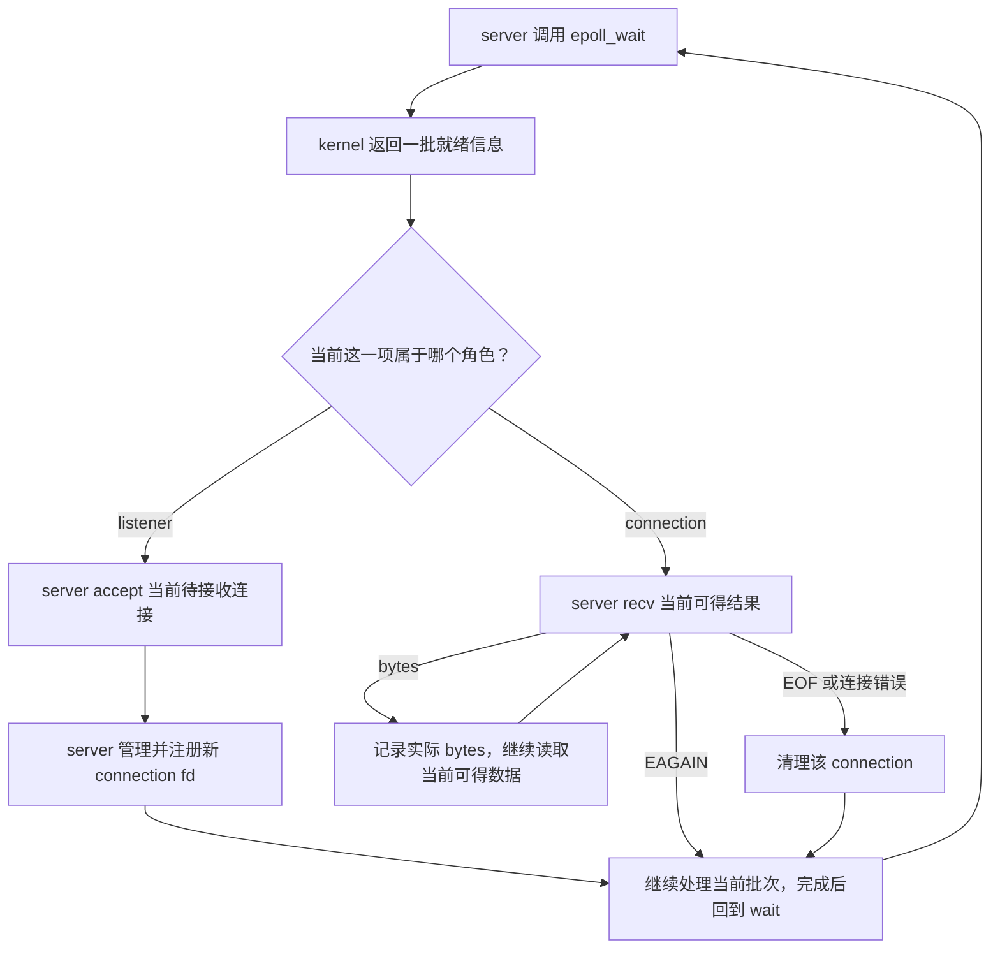
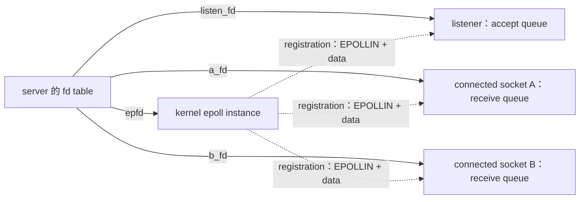

# Week9 Day3：一个 event loop 怎样接收多个 TCP connections

> 前置：Day2 已正式通过，94/100。你已经独立完成 epoll create/register/wait、LT 重复通知、non-blocking drain 和 fd 清理。
>
> 今日产出：`epoll_read_server.cpp`，一个单线程、多连接、只接收不回显的 TCP server。
>
> 核心问题：client A 连上后一直不发数据，怎样让同一个执行流仍能接收并读取 client B？
>
> 编译基线：Ubuntu Linux，`g++ -std=c++17 -Wall -Wextra -g`。

---

# Part 1：前情提要与必要术语

## 1. 今天接在你的哪一段代码后面

Day2 中，所有事情都由同一个 `main` 安排：

```text
创建 socketpair
-> 注册 receiver
-> 自己决定什么时候 send
-> wait 得到通知
-> recv 到 EAGAIN
-> 验证并退出
```

你已经理解：wait 没拿走 payload；两次 EPOLLIN 可以对应同一批 bytes；最后一次 non-blocking recv 让控制流回到 main。

今天把“自己制造全部时序”换成“外部 clients 随时来”：

- listener 等待新连接，不是等待业务 bytes。
- 每个已经接收的 connection，有自己的接收数据和结束状态。
- server 持续工作，不在处理完一个 client 后退出。

不重新写 Day2 的 probe，也不重新解释整套 epoll 术语。今天的增量是 **fd 的角色不同、数量动态变化、处理完一个对象之后要回到共同的等待点**。

你在 Day2 note 中补准的关系继续沿用：`epoll_ctl` 的 target fd 决定监视谁，`event.data` 是你另外附带的标记。Day3 存实际 fd 就够了，不引入 pointer/token 的 Reactor 设计。

## 2. listening socket：等新连接的 socket

`listen` 是“监听”；`listening socket` 是已经进入监听状态的 socket，下面简称 **listener**。

它的用途是让 server 接收新连接。它不是与所有 clients 共用的一条业务数据通道。

沿用 Week6 的 IPv4 TCP 模型：

```text
server listener：127.0.0.1:9090

client A：127.0.0.1:某个临时端口
client B：127.0.0.1:另一个临时端口
```

A/B 都找相同的 server 地址，但 server 后面使用的是不同的 connected sockets。

**记忆：listener 负责接人，connection socket 负责与某一个 peer 交换 bytes。**

这只是用途上的比喻，不表示 `accept` 会执行 TCP 三次握手的全部协议动作；握手主要由两端 kernel TCP 实现推进。

## 3. accept queue：已建立、待 application 接收的连接

`accept` 是“接收/接受”；`queue` 是队列。

这里说的 **accept queue**，是 listener 在 kernel 中关联的、等待 application 调用 `accept/accept4` 取得的连接队列。

先区分两种“排队”：

| 对象 | 等着被谁取走 | 取走的是什么 |
|---|---|---|
| listener 的 accept queue | `accept/accept4` | 一个待接收的连接 |
| connection 的 receive queue | `recv/read` | 这个连接已经收到的 bytes |

因此两个 fd 都可能报告 `EPOLLIN`，但不表示应该对它们做同一个操作。

`backlog` 是等待处理的积压量。Linux TCP 的 `listen(..., backlog)` 主要约束已建立、尚未 accept 的队列长度，**不是 server 一生最多能服务多少个 clients，也不是全部已 accept connections 的数量上限**。半连接队列和参数调优今天不展开。[Linux listen(2)](https://man7.org/linux/man-pages/man2/listen.2.html)

## 4. connected socket 与 accepted fd

`connected` 是“已经连接的”；`accepted fd` 指 `accept/accept4` 成功返回的 fd。

一次成功调用后，你手里多了一个资源：

```text
listen_fd：仍访问原来的 listener
client_fd：访问这次接收的 connected socket
```

原来的 listener 没有变成 client A，也没有被消耗。你可以继续用它接收 B、C。

这里“client_fd”是 **server 进程给自己那一端 socket 起的变量名**，不是 client 进程里的 fd 数字。两边各有自己的 fd table。

同样不要把 fd 当永久的连接编号：关闭 A 后，kernel 可能把同一个整数分配给后来接入的 C。今天按“一次 accept 到对应 close”识别连接的生命期就够了。

## 5. event loop、dispatch、handler

这三个词今天会反复用到：

- **event loop**：事件循环。一个持续等待通知、处理当前工作、再回到等待的执行循环，不是一种新线程。
- **dispatch**：分发。根据返回的 fd 及其角色，决定这次工作该由哪一段代码处理。
- **handler**：处理逻辑。可以是你写的函数，也可以是 main 里的一个分支；它不会因为名字叫 handler 就自动被 kernel 调用。

例如“read handler”只表示你自己负责读取连接数据的那段 C++ 代码。

今天不强制你定义 `handle_accept()`、`handle_read()` 等名字，更不要求 `EventLoop` class。先让实际行为正确。

**记忆：kernel 返回通知；你的程序决定调用哪段处理代码。**

## 6. single-threaded concurrency：交错推进，不是并行执行

`concurrency` 是并发，强调多个任务在同一时间段内都能推进；`parallelism` 是并行，强调同一时刻真的有多个执行单元工作。

Day3 server 只有一个 application thread：

```text
处理 B 当前到达的一些 bytes
-> 处理一个新连接
-> 处理 A 后来发来的 bytes
```

这些 handler 不同时执行。能服务多个 clients，是因为它没有在一个暂时无事可做的连接上一直等下去。

这不保证绝对公平：某个 client 持续大量发送，或者日志输出很慢，仍可能拖长其他 client 的等待。公平调度与 output backpressure 是后续问题，今天不把一个小型 read server 称为生产级高并发服务器。

## 7. 今天两个 non-blocking 标志的读法

你已经知道 `O_NONBLOCK`。本日会看到：

```text
SOCK_NONBLOCK：在 socket/accept4 的创建参数中，要求新 socket 使用 non-blocking
SOCK_CLOEXEC：在创建新 fd 时设置 close-on-exec
```

`SOCK` 表示 socket。`CLOEXEC` 可以按 close-on-exec 记忆：将来 exec 新程序时关闭这个 fd，不是当前函数返回时关闭。

尤其注意 `accept4` 的作用对象：

> 它的 `SOCK_NONBLOCK` 参数设置的是成功返回的新 connected socket，不是传进去的 listening socket。

listener 自己是否 non-blocking，仍要单独保证。这个是 API 的基本语义，必须在你动手前给清楚，不能留到后面才用它否定你的设计。

---

# Part 2：教程主体

# 教程开始：A 什么都不做，B 还能被服务吗

# Round 1：独立完成第一版 read server

## 8. 先说清楚这份程序是干什么的

你要写的是一个 **TCP bytes 接收器**：

```text
输入：外部 TCP clients 发来的 bytes
输出：server 终端上的连接、读取、关闭记录
网络返回：不发送任何 echo 或业务 response
```

默认监听 Ubuntu 自己的 `127.0.0.1:9090`。所有测试终端也都在这台 Ubuntu 上运行，即使这些终端是从 Windows VS Code SSH 打开的。

运行场景：

1. 启动 server，它等待 clients。
2. A 连接，保持打开，暂时不发送。
3. B 连接并发送 `B-data`，server 能读到，不必等 A 做任何事。
4. B 结束发送，server 读完 B 的数据、观察 EOF、关闭 B，继续运行。
5. A 后来发送 `A-data`，server 仍能读到。
6. C 后来接入，也能被服务。

这里的 A/B/C 是实验里的角色，不要求你把这些字母编码进 server。server 只看到 fds 和 bytes。

**不是**：先完整服务 A 到断开，再接 B；也不是读完 B 后向 B 回一句 `OK`。今天只接收，避免把还未学习的 non-blocking write 问题夹进来。

## 9. 文件、运行方式和输出

### 9.1 只新增一个主 source

在已有 Ubuntu 代码目录中新增：

```text
~/code/system-learning/cpp/week9/epoll_read_server.cpp
```

它有自己的 `main`。Day1/Day2 probe 保留，不把三份带 main 的 cpp 一起编译。

默认端口可使用一个命名常量，例如 `9090`。命令行解析不是本日训练点；你想支持可选 port 参数也可以。后面命令按默认端口写，换端口时同步调整 clients 和 `ss` 的过滤条件。

### 9.2 至少能区分三类记录

格式由你设计，但观察者应能知道：

```text
哪一次 accept 得到了哪个 fd
从哪个 fd 实际读到多少 bytes，内容是什么
哪一个连接结束并被清理
```

可以是下面这种形状，不要求逐字相同：

```text
LISTEN 127.0.0.1:9090
ACCEPT fd=5
ACCEPT fd=6
DATA fd=6 n=6: B-data
CLOSE fd=6
DATA fd=5 n=6: A-data
CLOSE fd=5
```

fd 数字、一次 recv 的分块长度、跨 client 的输出顺序都不是固定答案。只保证同一连接内按顺序重组后是原来的 bytes。

启动记录和数据记录需要及时可见。不要因 stdout 缓冲让你以为网络没进展；短实验可以在完整一条日志后 flush，不需要接入 AsyncLogger。

## 10. 第一版的行为边界

### 10.1 必须实现的行为

- 单个 application thread，使用一个 epoll instance，默认 LT。
- listener 与每个已接收的 connection 都是 non-blocking。
- A 保持连接且没有数据，不妨碍 B 被接收和读取。
- 每次只使用 `recv` 实际返回的那 `n` 个 bytes。
- 某连接暂时无数据时保持连接，不把 EAGAIN 当断开。
- 某连接 EOF 时结束的是该连接，不是整个 server；后续仍可接收新 client。
- 新获得的 fd 必须有可解释的关闭责任。启动失败或决定退出的错误路径也要清理已拥有的资源。

不规定你的容器类型、helper 名字、循环如何嵌套、哪个函数负责 dispatch。你先把第一版组织出来，R2 再对照实际流程分析。

### 10.2 返回状态与基本错误口径

本日正常没有“读完预定三个 clients 就 exit 0”的要求，server 是持续运行的。

| 情况 | 第一版对外行为 |
|---|---|
| 初始化失败，如 bind 端口已占用 | 输出原因，清理，non-zero exit |
| accept/recv 暂时无工作 | 不当成整个 server failure |
| EINTR | 重试被中断的那次操作，不丢已有连接 |
| 某 connection recv EOF | 正常结束该连接，server 继续 |
| 某 connection recv 真正失败 | 记录 errno，结束该连接，server 继续 |
| epoll instance/listener 的不可恢复错误 | 记录原因，清理，non-zero exit |

`EINTR` = interrupted system call，系统调用被信号中断；检查前提是该调用返回 `-1`。不要在一个成功调用后用旧 errno 判错。

`accept4` 除 EINTR、EAGAIN 外的错误，R1 可以先选择明确报错并清理退出，保留遇到的错误。R2 再区分“一个连接失败”和“基础设施失效”；第一版无需抄完整网络 errno 百科。

### 10.3 怎么停止 server

正常观察完成，在 server 前台终端按 `Ctrl+C` 即可。本日不要求新增 signal handler 或优雅退出 API。

默认 SIGINT 会终止进程，kernel 回收打开的 fds；这**不是**你的 C++ 析构函数一定执行，也不能用它证明 client 正常断开时你的清理正确。连接清理要在 server 仍活着时观察。

### 10.4 本日不做

不做 echo、换行协议解析、HTTP、per-connection input/output buffer、EPOLLOUT、ET 对照、Reactor class、ThreadPool 接入，也不升级 CMake。

Day2 已经证明的 epoll 创建、bit mask 检查、data.fd 回传，无需另写新 demo。

## 11. 开工需要的旧 API：只恢复调用位置

这里是语法回查，不是完整实现顺序。IPv4 address、byte order、socket/bind/listen 已在 Week6 学过。

| API | 头文件 | 本日用途与结果 |
|---|---|---|
| `socket(AF_INET, SOCK_STREAM, 0)` | `<sys/socket.h>` | 创建 TCP socket，成功返回新 fd，失败 -1 |
| `bind(fd, addr, len)` | `<sys/socket.h>` | 绑定本机 endpoint，成功 0，失败 -1 |
| `listen(fd, backlog)` | `<sys/socket.h>` | 令 socket 进入监听状态，成功 0，失败 -1 |
| `fcntl(fd, F_GETFL/F_SETFL, ...)` | `<fcntl.h>` | 查询/修改 file status flags，沿用你的 set_nonblocking |
| `epoll_create1 / epoll_ctl / epoll_wait` | `<sys/epoll.h>` | 直接复用 Day2 的接口认识 |
| `recv(fd, buf, size, 0)` | `<sys/socket.h>` | `>0` bytes，`0` EOF，`-1` 再看 errno |
| `close(fd)` | `<unistd.h>` | 关闭本进程的 fd 入口 |

需要的 C++ 直接头文件按用到的名字添加：`<cerrno>`、`<cstdio>`、`<cstddef>`、`<iostream>`，以及自己实际选择的容器头文件。

IPv4 地址初始化片段，只准备地址，不创建完整 server：

```cpp
sockaddr_in address{};
address.sin_family = AF_INET;
address.sin_port = htons(9090);
address.sin_addr.s_addr = htonl(INADDR_LOOPBACK);
```

依赖 `<netinet/in.h>` / `<arpa/inet.h>`。`INADDR_LOOPBACK` 是 loopback address 常量；这里仍需 host-to-network 转换。传给 bind 时沿用 Week6 的 `reinterpret_cast<const sockaddr*>(&address)` 与 `sizeof(address)`。

Linux 也允许在 `socket` 的 type 中写：

```cpp
const int fd = ::socket(
    AF_INET, SOCK_STREAM | SOCK_NONBLOCK | SOCK_CLOEXEC, 0);
```

这让新 socket 一开始就 non-blocking 且 close-on-exec。成功 fd 仍由 caller 负责 close。两种配置方式选一种即可，不需要为比较它们多写一份作业。[Linux socket(2)](https://man7.org/linux/man-pages/man2/socket.2.html)

重复启动时可保留 Week6 用过的 `SO_REUSEADDR` 设置；它不是允许你抢占另一台正在运行的 server。遇到 `EADDRINUSE`，先看谁占着端口。

## 12. 新 API：accept4

### 12.1 接口与返回值

`accept4` 是带 `flags` 参数的 accept 接口。这里的 4 不要解读成 IPv4：它也可用于其他支持的地址族。

```cpp
#include <sys/socket.h>

int accept4(int sockfd, struct sockaddr* addr,
            socklen_t* addrlen, int flags);
```

- `sockfd`：已经处于 listening 状态的 fd。
- `addr`：可选输出，填写 peer 的地址，不是你想连接的目标地址。
- `addrlen`：输入可用空间，输出实际地址长度；不需要 peer 地址时，与 addr 一起传 `nullptr`。
- `flags`：今天使用 `SOCK_NONBLOCK | SOCK_CLOEXEC`，设置返回的新 socket/fd。

成功返回 `>= 0` 的新 fd；失败返回 `-1` 并设置 errno。成功后 caller 多了一份需要关闭的资源，listener 保持有效。

最小调用形态，假设 `listen_fd` 已创建、bind、listen 且 non-blocking：

```cpp
const int client_fd = ::accept4(
    listen_fd, nullptr, nullptr, SOCK_NONBLOCK | SOCK_CLOEXEC);
```

这只展示一次调用。`client_fd == -1` 时先判断 errno，不能拿 -1 去注册或读取；成功后才拥有新的 fd。

**listener 的 non-blocking 决定“没有连接时这次 accept 是否等待”；flags 中的 non-blocking 决定“返回的新 socket 以后怎样做 I/O”。** 两者不是相互替代的配置。

Linux 上普通 `accept()` 返回的新 socket 不继承 listener 的 `O_NONBLOCK`。若选择 `accept + fcntl`，需要对新 fd 再设置一次；本日推荐 accept4。[Linux accept(2)](https://man7.org/linux/man-pages/man2/accept.2.html)

### 12.2 一个独立、不会等 client 的小例子

这不是主练习答案：它不使用 epoll，不接收多个 clients，只观察“空队列 + non-blocking listener”的一次 accept4 结果。可选文件名 `accept_empty_demo.cpp`，不计为额外必交产出。

```cpp
// Observe one accept4 on an empty non-blocking listener; no client is needed.
#ifndef _GNU_SOURCE
#define _GNU_SOURCE
#endif
#include <arpa/inet.h>
#include <sys/socket.h>
#include <unistd.h>

#include <cerrno>
#include <cstdio>

int main() {
    const int listener = ::socket(
        AF_INET, SOCK_STREAM | SOCK_NONBLOCK | SOCK_CLOEXEC, 0);
    if (listener == -1) {
        std::perror("socket");
        return 1;
    }

    sockaddr_in address{};
    address.sin_family = AF_INET;
    address.sin_port = htons(0);  // Kernel chooses an available local port.
    address.sin_addr.s_addr = htonl(INADDR_LOOPBACK);
    if (::bind(listener, reinterpret_cast<const sockaddr*>(&address),
               sizeof(address)) == -1) {
        std::perror("bind");
        ::close(listener);
        return 1;
    }
    if (::listen(listener, 8) == -1) {
        std::perror("listen");
        ::close(listener);
        return 1;
    }

    const int connection = ::accept4(
        listener, nullptr, nullptr, SOCK_NONBLOCK | SOCK_CLOEXEC);
    const int saved_errno = errno;
    const bool empty = connection == -1 &&
        (saved_errno == EAGAIN || saved_errno == EWOULDBLOCK);
    if (connection >= 0) {
        ::close(connection);
    } else if (!empty) {
        errno = saved_errno;
        std::perror("accept4");
    }
    const int close_result = ::close(listener);
    if (close_result == -1) {
        std::perror("close listener");
        return 1;
    }
    if (!empty) {
        std::fprintf(stderr, "expected an empty accept queue\n");
        return 1;
    }
    std::puts("PASS: empty accept queue -> would block");
    return 0;
}
```

```bash
g++ -std=c++17 -Wall -Wextra -g accept_empty_demo.cpp -o accept_empty_demo
./accept_empty_demo
```

预期输出：`PASS: empty accept queue -> would block`，exit 0。

这里的 `saved_errno` 只在 accept4 失败时有解释价值；保存它是为了避免后续函数调用覆盖诊断值。port 0 让 kernel 选择空闲端口，它只用于这份无需 client 的小例子；主 server 仍使用 clients 能知道的固定端口。

`_GNU_SOURCE` 是 glibc 的 feature-test macro，用于公开扩展接口声明，必须在系统头文件之前定义。当前 Ubuntu g++ 通常已定义它，所以例子用条件定义避免重复定义警告。它不是一个需链接的库，也不是 C++ 标准版本开关。

### 12.3 需要显示 peer 地址时，才使用输出参数

下面也是单次调用片段，依赖有效的 `listen_fd`，不是完整程序：

```cpp
sockaddr_in peer{};
socklen_t peer_length = sizeof(peer);
const int client_fd = ::accept4(
    listen_fd, reinterpret_cast<sockaddr*>(&peer), &peer_length,
    SOCK_NONBLOCK | SOCK_CLOEXEC);
```

成功后可以用 Week6 的 `inet_ntop`、`ntohs(peer.sin_port)` 打印地址；失败时不把 peer 当作有效结果。每次调用前重新设置 `peer_length` 为可用容量。

地址打印不是 R1 必须项。用 fd 和 accept/close 记录已经能够观察今天的关系。

## 13. 从单个 event 变成 event 数组

Day2 的输出 buffer 只有一个元素；Day3 可以准备一个小数组，例如 16 项。

只展示一次等待的语法，`epfd` 假定有效：

```cpp
constexpr int kMaxEvents = 16;
epoll_event events[kMaxEvents]{};
const int ready_count = ::epoll_wait(epfd, events, kMaxEvents, -1);
```

新变化只有：

```text
events：这次用来接收通知的 user-space buffer
kMaxEvents：本次最多交付多少条通知
ready_count：这次实际交付了多少条
```

`ready_count > 0` 时，只有 `[0, ready_count)` 范围属于这次有效结果。失败返回 -1，不能当成数组长度。`-1` timeout 表示这里允许等待，不是让随后某个 recv 也改回 blocking。

**16 不是最大连接数。** 注册 100 个 connections 不要求这个数组也有 100 项；一批装不完的就绪通知可以在后续 wait 中交付。[Linux epoll_wait(2)](https://man7.org/linux/man-pages/man2/epoll_wait.2.html)

这节不给 event 分发循环。你已经知道怎样使用数组，接下来由你决定如何识别 listener 与 connection。

## 14. 关闭一个连接时可用的 API

Day2 只实际使用了 ADD。今天至少要知道 DEL 的调用形态，即使第一版借助 close 的自动移除规则，也不能不知道它是什么：

```cpp
const int result = ::epoll_ctl(epfd, EPOLL_CTL_DEL, client_fd, nullptr);
```

这是 context-dependent 片段，依赖有效 epfd、仍打开且已注册的 client_fd。

`DEL` = delete，这里是删除 epoll registration；第四个参数被忽略，可以为 `nullptr`。成功返回 0，失败 -1 并设置 errno。

它不关闭 socket，不删除你在容器里保存的元素，也不释放任何你自己 new 的对象。反过来，close 关闭 fd，不会自动擦掉 C++ 容器里的整数。

Day3 不使用 dup/fork 共享这些 sockets：在这条限定下，最后关闭该 socket fd 会使相应 epoll registration 被移除。显式 DEL 有助于把“停止关注”和“关闭资源”区分开；精确的别名与 stale-event 生命周期问题仍留到 Day6/Week10。[Linux epoll(7)](https://man7.org/linux/man-pages/man7/epoll.7.html)

## 15. 数据显示只是观察，不是解析

沿用你 Day2 的原则：只处理 `n > 0` 时 buffer 的前 n 个 bytes。

你可以继续逐个输出字符。另一个按长度输出的接口是 `<iostream>` 中的 `ostream::write`：

```cpp
// Standalone example: output exactly three bytes, without requiring a NUL.
#include <iostream>

int main() {
    const char bytes[] = {'A', 'B', 'C'};
    std::cout.write(bytes, 3);
    std::cout << '\n' << std::flush;
    return std::cout ? 0 : 1;
}
```

例子文件可命名 `byte_output_demo.cpp`，使用同样的 g++ 参数编译；运行输出 `ABC`。这是工具语法，不要求另交 demo。

在 recv 场景中，先确认 `n > 0`，再使用 `std::cout.write(buffer, static_cast<std::streamsize>(n))`。`streamsize` 是 C++ stream 使用的计数类型。`write` 不寻找 `\0`，也不代表这 n bytes 是一条完整消息。

终端输出本身可能阻塞。本日只用小 payload 和有人读取的终端验证网络等待问题；不能据此宣称程序所有 I/O 都永不阻塞。

## 16. 第一条编译、运行与 client 命令

server 终端：

```bash
cd ~/code/system-learning/cpp/week9
g++ -std=c++17 -Wall -Wextra -g epoll_read_server.cpp -o epoll_read_server
./epoll_read_server
```

第二个 Ubuntu 终端，用系统 Python 作为现成 client 工具：

```bash
python3 -c 'import socket; s=socket.create_connection(("127.0.0.1",9090),5); s.sendall(b"hello-day3"); s.shutdown(socket.SHUT_WR); print("server returned:",s.recv(1)); s.close()'
```

你不需要为测试先写另一份 C++ client。Python 这条命令做的是：

```text
connect，最多等待 5 秒
-> sendall 固定 bytes
-> shutdown(SHUT_WR)，表示不再发送，但还可以接收
-> 等 server 结束这个只读连接
-> 看到 b''，即 EOF
```

server 应记录 `hello-day3` 共 10 bytes，然后在读到 EOF 后关闭这个 connection；client 输出 `server returned: b''`。`b''` 是空 bytes，不是 server 发回的字符串。

client 的 EOF 只证明它看到了对端关闭，**单独不能证明 server 确实读完 payload**；还要对应看 server 的实际字节记录。超时说明 client 没及时得到预期结果，先看 server 卡在哪一步，不要直接延长超时掩盖问题。

第一版再做一个 A-idle/B-active 场景：

```bash
python3 -c 'import socket; s=socket.create_connection(("127.0.0.1",9090),5); print("A connected; no payload sent"); input("Keep A open. Run B in another terminal, then press Enter: "); s.sendall(b"A-later"); s.shutdown(socket.SHUT_WR); print("A EOF:",s.recv(1)); s.close()'
```

停在 input 时不要按 Enter。先确认 server 已记录 A 的 accept，然后在另一终端运行上面的 `hello-day3` client。B 完成之后再按 Enter，A 才发送。

**input 阻塞的是测试 client，不是你的 server。** 这里用你的按键建立先后关系，不用 sleep 猜测 server 是否已经接收了 A。

## 17. Round1 阅读闸门

到这里停止阅读，先完成你的 `epoll_read_server.cpp`。

第一版要能展示：A 已被接收但不发送时，B 的接收、读取、结束仍能发生；之后 A 与新来的 C 仍能工作。保留真实编译/运行问题，不需要复制整份需求进 note。

你还没有看到完整 dispatch、accept drain 与清理排列。这些设计先由你决定。R1 检阅正式通过后，后面的 R2/R3 会根据你的代码、观察和问题再次定向调整。

---

# Round 2：完成 V1 后，沿实际 server 复盘

> 这是生成时的通用初版，不是对你尚未提交代码的评价。R1 通过后再按实际实现润色；如果某节只是重复你已经解释清楚的关系，可以快速对照，不为它另造一次实验。

## 18. 把一次正常运行从头串到底

先在你自己的代码里找到以下发生点，再对照解释。

server 启动后，listener 已经 bind/listen，并向 epoll 注册读就绪关注。此时 event loop 可以睡在 `epoll_wait` 上，因为还没有业务工作。

client A 调用 connect，kernel TCP 推进连接建立。当 server 端有可接收连接时，listener 的就绪信息可交付给 epoll。server 从 wait 返回，看到的是 listener 的关联 data，不是“新 client fd 已经在 events 里了”。

server 调用 accept4，才在 application 手中取得新的 `a_fd`。它把 a_fd 纳入自己的管理并注册关注。A 不发数据，所以对 A 当前不能读取到 bytes；server 不需要等 A，它回到共同的等待点。

B 到来时同样得到自己的 b_fd。B 发送数据后，b_fd 的读就绪被交付。server 根据这次返回的对象读取 B，把实际收到的 bytes 记录下来；当前数据读完而 B 仍 open 时，recv 以 EAGAIN 结束这一轮处理。

B 后来结束发送，server 在数据耗尽后看到 recv 0，清理 B；listener 和 A 仍然有效。下一次 wait 还可以接 C，也可以读取 A 后来的数据。

现在用图压缩已经走过的主线：



图里的 accept 分支同样需要考虑多个 pending connections，下一节单独展开。图不表示每次 wait 只有一个 event；你应该处理本次实际返回的所有有效项。

主语始终是：**kernel 提供通知，你的 server 调用 accept/recv 并修改自己管理的状态。**

## 19. listener 的 EPOLLIN 为什么不是让你 recv(listener)

设一次运行中：

```text
epfd = 3
listen_fd = 4
a_fd = 5
b_fd = 6
```

这是说明用数字，实际分配不固定。

| 返回关联的 fd | 这个对象的角色 | 当前尝试的操作 | 成功后得到什么 |
|---|---|---|---|
| 4 | listener | accept4 | 新的 connected fd |
| 5 | A 的 connected socket | recv | A 发来的 bytes，或 EOF 等结果 |
| 6 | B 的 connected socket | recv | B 发来的 bytes，或 EOF 等结果 |

所以 `EPOLLIN` 不是“无脑调用同一个 read 函数”的指令。它的意义要结合 **对象类型与角色**。

这也给 Day2 Q3 的措辞一个具体落点：`EPOLLIN` 表示读方向的就绪，不保证 `send` 可以推进；listener 则通过 accept 消费待接收连接。

静态对象图：



epoll 不拥有你的 C++ 连接记录，也不保存三份 socket payload。图上三条 registration 关联的是三个不同 I/O 对象。

## 20. 一次 listener 通知，可能对应几个 accept

假设 server 刚被调度回来时，A/B/C 都已经排在 accept queue：

```text
一次 listener EPOLLIN
-> accept4 成功，得到 a_fd
-> accept4 成功，得到 b_fd
-> accept4 成功，得到 c_fd
-> accept4 返回 -1/EAGAIN：此刻没有下一个可接收连接
```

不是每个 client 必须各配一条独立 notification。Day2 的“通知次数不等于 send 次数”在这里对应“通知次数不等于待接收连接数”。

这就是 **accept drain**：取走当前可得的待接收连接，直到 would-block，再回到外层 event loop。

default LT 下，一次只 accept 一个也可能正常工作，因为剩余 pending connection 会让 listener 继续 ready。不能说“一次不全部 accept 在 LT 下一定错误”。本周采用 drain，是为了清楚标识当前工作的边界，也为后面的 ET 对照建立一致基础。

listener 必须 non-blocking 的原因现在很具体：前三次都成功，第四次队列空了；如果这一调用进入 blocking wait，它可能把已经到手的 A/B/C 后续数据都晾在一边，直到又有 D 连接。

你应在 trace 中区分：

```text
accept4(..., SOCK_NONBLOCK)：新 connection 的模式
listener 自身 O_NONBLOCK：这次取下一个连接时是否可以等待
```

两层状态都正确，才能把这条 drain 链完整走完。

## 21. accepted socket 为什么需要单独注册

listener 的 registration 只关注 listener，不会自动扩展为“所有从它接收的连接”。

你拿到 `a_fd` 后，application 仍需明确让 epoll 关注它。注册时附带 `data.fd = a_fd`，以后收到通知才能映射回这份连接。

回查你的 V1：有没有已经 accept A，但忘记注册 A，于是以后只响应新连接、不读取旧连接？这类问题不是 TCP 没把数据送到，而是 **application 没订阅这个对象的后续状态**。

如果 A 在注册之前已经发送了 bytes，default LT 下注册时发现它已就绪，也可以在后续 wait 中返回。无需靠“先注册成功才允许 client 发数据”的人为协议来保证正确。

注册失败时，新 fd 已经存在。失败的 ADD 不会替 application close 它；它必须被当前错误处理路径接住。反过来，也不能把一个注册失败的 fd 当作已被 event loop 接管后就丢掉。

这里要解释的是所有权转移，不要求你写一套复杂异常安全框架。

## 22. connection 的 read drain 怎样结束

你 Day2 的 `receiver_work` 已经会读到 EAGAIN。迁移到 Day3，变的是返回后 server 如何对待这个连接：

| recv 结果 | 当前 connection 状态 | event loop 后续责任 |
|---|---|---|
| `n > 0` | 本次取得了 n bytes | 记录；继续处理当前可得的数据 |
| `-1 / EAGAIN` | 暂时不能再读，但连接还在 | 保持关注，处理其他对象或回到 wait |
| `0` | 对端发送方向已结束，之前数据已耗尽 | 本日无 response，结束并清理此连接 |
| `-1 / EINTR` | 本次调用被中断 | 重试当前 recv |
| 其他 `-1` | 真实连接错误 | 诊断并清理这一个连接 |

Day2 peer 被实验规定为一直 open，所以 EOF 被你当成实验失败。Day3 是外部 client 正常结束发送，EOF 是正常的连接生命期出口。**不要原样搬过去后让 `false` 一路导致 main 整体 return。** 你可以重新定义 helper 结果，也可以把分类留在调用处；类型和名字自由。

如果 B 发了 10 bytes 然后 shutdown，server 可能读到 4、4、2、0，也可能 10、0。前三种正数结果都要先消费，不能看到关闭相关通知就丢掉尚未读取的数据。[Linux recv(2)](https://man7.org/linux/man-pages/man2/recv.2.html)

handler 返回的意思是“这一轮交还执行权”，不是一定断开连接。EAGAIN 与 EOF 的差别从 Day1 延续到这里，直接决定 server 是否会误踢闲置 client。

## 23. 生命周期：清理连接，不是清理整个 server

回查你如何表示“当前还活着的 connections”。可以使用熟悉的容器，但记住容器中的整数不是 RAII owner：`erase(fd)` 不会调用 Linux close。

这次三层资源关系是：

```text
epoll registration：是否继续关注该 socket
server 的 C++ 记录：是否仍把它当作活跃连接
fd：是否仍持有访问 kernel socket 的入口
```

一个正常 EOF 的收尾必须让三层认识一致。若选择显式 DEL，应在 fd 仍有效时 DEL，再 close；同时移除对应 C++ 记录。DEL 失败也不能成为忘记 close 的理由，错误策略由你说明。

本日没有 dup/fork 别名，close 的自动 deregistration 也可用，不要求仅为调用 DEL 推倒一份正确实现。需要避免的是“C++ 记录还活着但 fd 已经关闭”，以及“记录删了却根本没 close”。

清理完 B 后：

```text
listen_fd：仍然有效
a_fd：仍然有效
epfd：仍然有效
b_fd：不再属于当前活跃连接
```

一份 returned event 是这次 wait 拷贝给你的信息，不是对象的存活保证。关闭一个连接后，不要继续执行同一个分支后面针对这个旧 fd 的操作。批次里移除其他对象、fd 快速复用等系统化处理，Day6/Week10 再加深。

## 24. 本日错误处理只补到这里

不要把每个 `-1` 都升级成 server 崩溃，也不要把每个 `-1` 都当成“继续循环”：

- `EAGAIN/EWOULDBLOCK` 是当前工作边界。
- `EINTR` 适合重试被中断的操作。
- `ECONNABORTED`（connection aborted，连接已中止）可让 accept 跳过这次失败，继续尝试其他 pending connections。
- `EMFILE/ENFILE` 是 fd 资源上限等问题，无条件紧密重试可能造成空转；Day3 可以报告并清理退出，不要求 reserve-fd 技巧。

Linux accept 还可能直接报告待接收连接上的网络错误。本日无需背下全部列表，真实遇到时对照 man page 决定恢复；生产实现应进一步区分暂态连接错误与 listener 失效。不能将 Day3 的简化退出策略写成“所有 server 的最佳实践”。

`EPOLLHUP`（hang up，挂断）与 `EPOLLERR`（error，错误）可能与 EPOLLIN 一起返回，即使你没显式订阅它们。至少使用 bit 检查，不用 `events == EPOLLIN` 排斥组合结果；关闭相关状态不能让你跳过已到达的数据。更完整的 HUP/ERR/RDHUP 分发与半关闭策略仍放在 Day6。[Linux epoll_ctl(2)](https://man7.org/linux/man-pages/man2/epoll_ctl.2.html)

R2 应优先改你这份 V1 实际存在的问题。没有遇到的极端故障，不为本日额外扩成十几套实验。

## 25. 为什么今天不保存一条“完整 message”

你的 server 当前只负责记录读取结果，不解析应用协议。

例如 client 分两次 send `hel`、`lo`，server 可能输出一次 `hello`，也可能分更多块。这不说明数据丢失或出现“多条 message”。

若你把每次 recv 的内容都直接当成一条请求，下一步才会遇到真正的问题：不完整后缀放哪里、下一次 bytes 怎么接上来？那正是 Day4 的 per-connection state。

因此 Day3 不需要无限累积所有历史数据，也不应继续使用一个混合所有 clients 的全局 `recv_data` 去与单一 payload 比较。展示每次读取的 fd、实际长度和内容即可；可选的 per-connection 总字节计数不等于协议 buffer。

---

# Round 3：用一个实验串起多连接、EOF 与继续服务

## 26. 这次要新增的证据是什么

Day2 的证据不用重新提交。今天最有价值的新证据是：

```text
A 已经 accept，保持连接但不发送
-> B 被接收，发送的数据被读取
-> B 结束，server 清理 B
-> A 才发送，并成功结束
-> C 后来接入，server 仍能工作
```

这里不是性能 benchmark，也不需要精确测微秒。A 在 B 完成前始终 idle/open，已经能暴露“整个执行流卡在 A”的错误。

client connect 成功不等于 server application 已经执行 accept，所以实验先看 server 的 A accept 记录再继续。不要只靠先创建 A、sleep 一下就宣称状态已经建立。

## 27. 提供一个现成 client 工具，不要求你再写测试框架

下面脚本只运行外部 clients，不给出 server 实现。可以保存为 `day3_clients.py`，也可以让 Codex 在验收时运行相同逻辑；它不是第二份必须独立设计的项目。

```python
"""Exercise an idle A, active B, later A, and a fresh C against a read-only server."""
import socket
import sys


def send_then_expect_eof(sock, payload):
    """Borrow sock; send bytes, end writing, and require server EOF without echo."""
    sock.sendall(payload)
    sock.shutdown(socket.SHUT_WR)
    result = sock.recv(1)
    if result != b"":
        raise RuntimeError("read-only server unexpectedly sent response bytes")


def main():
    port = int(sys.argv[1]) if len(sys.argv) > 1 else 9090
    endpoint = ("127.0.0.1", port)
    with socket.create_connection(endpoint, timeout=5) as a:
        print("A connected; no payload sent.", flush=True)
        input("Check server has ACCEPTed A, then press Enter: ")
        with socket.create_connection(endpoint, timeout=5) as b:
            send_then_expect_eof(b, b"B-data")
        print("B reached EOF while A remained open and idle.", flush=True)

        send_then_expect_eof(a, b"A-later")
        print("A later sent data and reached EOF.", flush=True)

    with socket.create_connection(endpoint, timeout=5) as c:
        send_then_expect_eof(c, b"C-new")
    print("CLIENT CHECK PASS: B, later A, and fresh C completed.")
    return 0


if __name__ == "__main__":
    try:
        raise SystemExit(main())
    except (OSError, ValueError, RuntimeError, EOFError) as error:
        print("CLIENT CHECK FAIL:", error, file=sys.stderr)
        raise SystemExit(1)
```

在 server 保持运行时执行：

```bash
python3 day3_clients.py 9090
echo $?
```

脚本在第一次 input 处停下；你确认 server 的 accept 记录后才按 Enter。之后 B 的 recv EOF 是进展检查：如果 server 卡在 A 的 blocking recv，它无法按约定处理 B，B 将超时，脚本以 non-zero exit 结束。

对照 server 记录，三个连接应分别收到：

| 角色 | payload | 总字节数 |
|---|---|---:|
| B | `B-data` | 6 |
| A 后来发送 | `A-later` | 7 |
| C | `C-new` | 5 |

数据可以跨多次 recv。不要断言恰好有三条 DATA 日志；按每个 accept/close 生命周期分别组合对应的记录。

CLIENT CHECK PASS 证明这条交错场景中的完成与无 response；**payload 完整性仍要结合 server 字节记录或 strace**。即使错误 server 直接 close 而没读数据，单看客户端也可能收到 EOF，所以不能让这个工具的 PASS 代替整个验收。

如果已经用 §16 的多个终端证明同样的链，不要求再跑一遍此脚本。两种方式选一组清楚证据。

## 28. strace：究竟睡在哪里

停止旧的前台 server 后，用下面命令启动新的观察运行，不要让两个 server 抢同一端口：

```bash
strace -tt -s 80 \
  -e trace=socket,setsockopt,bind,listen,fcntl,epoll_create1,epoll_ctl,epoll_wait,accept,accept4,recvfrom,close \
  -o day3.trace ./epoll_read_server
```

随后运行 clients。观察完按 Ctrl+C，再查看 trace。

- `-tt`：在每次 system call 前显示时间，帮助对应 clients 的动作。
- `-s 80`：最多显示 80 个字符串 bytes，够看本日小 payload；不是网络 buffer size。
- `-e trace=...`：只选相关 calls，避免淹没在全部运行时细节里。
- `-o day3.trace`：工具输出写进文件，server 的业务日志仍在原终端。
- C++ `recv` 在本机 strace 中通常显示为 `recvfrom`，所以过滤器包含后者。

不要照抄一个固定 fd 序列；找自己的对象对应关系：

```text
listener 变 non-blocking
-> epoll ADD listener
-> wait 返回 listener
-> accept4 返回一个新 fd，且 flags 指定 NONBLOCK
-> epoll ADD 新 fd
-> wait 返回 connection
-> recvfrom 返回正数，随后 EAGAIN 或 EOF
-> EOF 后该连接 close
-> server 仍在 epoll_wait / accept4 / recvfrom 间继续运行
```

重点判断三件事：

1. A 空闲时，server 是否回到了 epoll_wait，而不是长时间停在 recv(A)？
2. 接收当前已有连接后，accept4 是否到 EAGAIN 返回外层？
3. B 的 bytes 是否先被读取，再出现 EOF 与 close？

`strace` 展示 system call、参数和返回值，不直接展示 kernel accept queue 内部链表，也不能证明任意负载下都公平。当前实验小、同步关系清楚，足以校验今天这条机制链。

### 一处可选的针对性观察

若正常流已经清楚，不必额外制造队列积压。如果你确实想观察“一次通知取出多个连接”，可以在测试终端先用 `kill -STOP <server-pid>` 暂停这一个自己的 server，建立两个小 client connections，然后 `kill -CONT <server-pid>` 恢复它。

`STOP` 暂停 application 执行，不停止 kernel TCP；`CONT` 恢复执行。只针对你确认的测试 pid，务必恢复，不对其他进程发信号。随后看连续 accept4 的 trace，而不是要求 wait 必须恰好返回某个固定 count。这是选做机制观察，不加入必做 checklist。

## 29. ss 与存活中的 fd 清理

两个命令都在 Ubuntu 执行：

```bash
ss -lntp 'sport = :9090'
ss -ntp '( sport = :9090 or dport = :9090 )'
```

`-l` 只看 listening；`-n` 保留数字地址/端口；`-t` 选 TCP；`-p` 显示可见的 process 信息。`sport/dport` 是 source/destination port，分别为这条 socket 记录的本地/对端端口。loopback 测试中同一连接可能看到 client 和 server 两端的记录。

第一条应看到 listener，第二条帮助对照 A/B 是否同时存在。`ss` 看到 ESTABLISHED 不能单独证明 application 已 accept，更不能证明 handler 读到了数据。[Linux ss(8)](https://man7.org/linux/man-pages/man8/ss.8.html)

连接清理不必运行 100 次。可以在 server 空闲时、完成一组 clients 后各看一次。先在另一个终端找 pid；`-f` 按完整命令行匹配，避免依赖可能截断的进程短名称：

```bash
pgrep -af '[e]poll_read_server'
```

确认路径和命令，若在 strace 下运行，别把 strace 自身 pid 当 server。把真实 server pid 填进下面命令：

```bash
ls -l /proc/<server-pid>/fd
```

不要原样输入尖括号占位符。观察重点是 clients 结束后对应 socket fd 消失，而 listener/epfd 仍在；数字可以复用，不能要求某个 fd 永远不再出现。`ss` 里的 TIME-WAIT 是 TCP 协议状态，不等同于 server 仍持有那个 fd。

这份实验不用把所有输出都抄进 note，保留一组能解释的代表证据即可。

## 30. 什么时候需要再改 V1

R2/R3 不要求你每读一节都再改一遍代码。按观察决定：

| 真实问题 | 需要修什么 |
|---|---|
| A idle 时 B 不推进 | 定位 server 卡住的 system call 与对应 fd 模式 |
| accept 后有 fd，但后续 bytes 从不处理 | 查该新 socket 是否被注册、返回事件如何关联 |
| B 结束导致整个 server 退出 | 查 EOF/helper 结果如何传播到 main |
| B 关闭后反复收到同样通知、CPU 空转 | 查 EOF 后是否还保留无用关注或旧记录 |
| trace 有 bytes，终端迟迟看不到 | 查日志缓冲，不要先怀疑 TCP 丢数据 |

若现有实现和证据已经覆盖，直接进入收口。这里只检查本日新增的多连接行为，不重新跑 BlockingQueue、ThreadPool、TSan，也不要求 GoogleTest/README/interview 文件。

---

# Part 3：收尾、验证与验收

## 31. 今日通过标准

结合代码、真实观察和短解释判断，不按文件数量打分：

- `epoll_read_server.cpp` 在 C++17 + `-Wall -Wextra -g` 下零 warning。
- listener 与 accepted sockets 的 non-blocking 状态正确。
- 一个执行流能持续接收多个 clients，不在 idle connection 上阻塞其他工作。
- 只处理本次有效 events 和 recv 实际返回的 bytes；通知不当成完整消息。
- accept/read 正常推进到当前边界，EINTR、EAGAIN、EOF 能区分。
- 连接结束后的资源被清理；一个 client 结束不让整个 server 停止接客。
- 至少一组 A-idle/B-active、A-later、C-new 的证据；数据完整性与存活性分别核对。
- 能指出 trace 中等待、获得连接、消费数据、清理的实际位置。

整体 HUP/ERR/RDHUP 加固、输出缓冲与 ET 仍在后续规划；本日不因没写这些而扣分。

## 32. 六个收口问题

可以口述，或直接指向自己的代码与 trace，不用再抄六段标准答案。

1. 同样是 EPOLLIN，listener 与 connected socket 分别适合尝试哪个操作？为什么？
2. listener 已经 non-blocking，普通 accept 返回的新 socket 在 Linux 上能否默认依赖同一模式？accept4 的 flags 改谁？
3. 一次 listener 通知可能有三个待接收连接，你怎样知道当前这一轮 accept 工作结束了？
4. Day2 的 EOF 是实验失败，Day3 的 EOF 为什么通常只结束一个 connection？
5. event 数组容量 16 是否限制 server 只能持有 16 个 connections？本次哪些元素有效？
6. A idle/B-active 的实验直接证明了什么？为什么 client 的 EOF/PASS 还不能替代 server 的 payload 记录？

这些是本日新增关系，不重复要求你再背 epoll_create1 的参数。

## 33. 今天停在哪里，明天接什么

完成后，你已经把模型变成：

```text
一个 epoll instance
-> 关注 listener 与多个 connection sockets
-> 一个 execution flow 按角色分发
-> accept/recv 推进到当前边界
-> 清理结束的 connection
-> 回到共同等待点
```

但 server 还不知道 `hel`、`lo\n` 怎样拼成一条完整请求。

Day4 会在 user space 增加 per-connection state：保存尚不完整的数据，产生完整 message，再为 Day5 的 response/output buffer 铺路。今天先不要提前实现 parser 或 Echo Server。

MIT 6.S081 完整通关仍按总规划推进；本日是 Linux epoll 工程实践，不硬塞一节不对应 epoll API 的 xv6 视频。正文已经给齐当天所需内容，文中 man pages 用于核验，不是额外通读任务。

**今日一句话：同一个执行流集中等待多个对象，根据 fd 的角色做真实 I/O，在当前不能推进时把执行权交回事件循环。**
