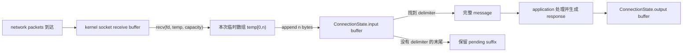
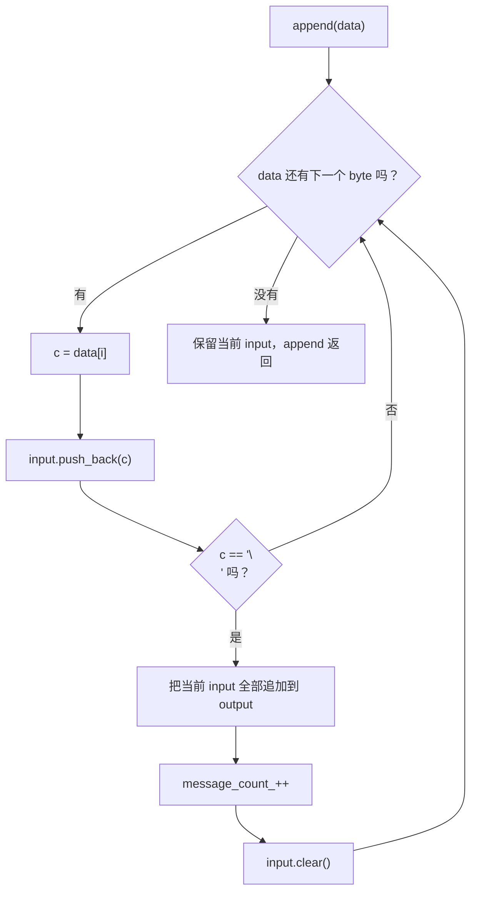
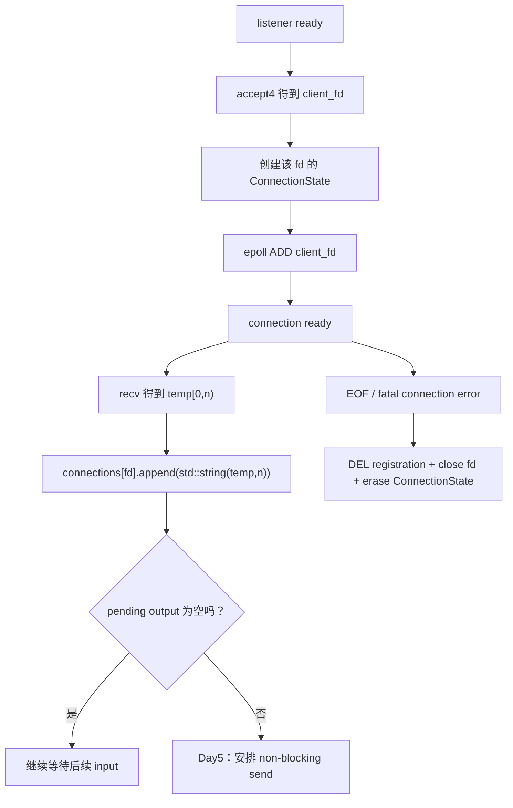

# Week9 Day4：TCP 没有消息边界，解析状态放在哪里

> 前置：Week9 Day3 已正式通过，93/100。你已经让一个 application thread 使用同一个 epoll instance 接收并读取多个 TCP connections。
>
> 今日产出：`connection_state_demo.cpp`，一个不依赖 socket/epoll 的 newline-delimited message state demo。
>
> 核心问题：一次 `recv` 不对应一条 message；一条 message 被拆开时，已经收到但尚未完整的 bytes 应该保存在哪里？
>
> 编译基线：Ubuntu Linux，`g++ -std=c++17 -Wall -Wextra -g`。

---

# Part 1：前情提要与必要术语

## 1. 今天接在 Day3 的哪一个位置

Day3 的 server 已经能完成：

```text
epoll_wait
-> listener ready：accept4 到 EAGAIN
-> connection ready：recv 到 EAGAIN / EOF / error
-> 清理结束的 connection
-> 回到 epoll_wait
```

但 Day3 只是把每次 `recv` 得到的前 `n` 个 bytes 打印出来。它没有回答：

```text
这 n 个 bytes 是一条完整请求吗？
如果只是一条请求的前半段，后半段下次才来，前半段放哪里？
如果这 n 个 bytes 里粘着三条请求，怎样逐条取出？
```

今天暂时拿掉 socket 和 epoll，只研究中间这一层：

```text
任意分块到达的 bytes
-> user-space connection state
-> 完整 messages
-> 等待 Day5 发送的 response bytes
```

这样 parser 出错时，你只需检查固定输入与内存状态，不必同时怀疑网络时序、readiness 和 fd 生命周期。

## 2. TCP byte stream：有顺序的 bytes，不是 message 列表

`stream` 是“流”。TCP 提供的是可靠、有序的 **byte stream**：接收方看到一串按顺序到达的 bytes。

Linux `tcp(7)` 明确说明 TCP 不保留 record boundaries。`record boundary` 是记录边界，也就是“发送方一次提交的数据块到这里结束”的边界。

假设 client 想发送两条文本消息：

```text
hello\n
world\n
```

发送方可能调用：

```text
send("hello\n")
send("world\n")
```

server 的 `recv` 仍可能观察到：

```text
recv 1: "he"
recv 2: "llo\nwor"
recv 3: "ld\n"
```

也可能一次得到：

```text
recv 1: "hello\nworld\n"
```

两种结果都不表示 TCP 出错。TCP 保证顺序，不替 application 保存“第几次 send”的边界。

反过来也一样：一次 `send` 的内容可能由多次 `recv` 才取完；多次 `send` 的内容也可能在一次 `recv` 中一起出现。

**记忆：TCP 保存 byte order，不保存 application message boundary。**

参考：[Linux tcp(7)](https://man7.org/linux/man-pages/man7/tcp.7.html)、[Linux recv(2)](https://man7.org/linux/man-pages/man2/recv.2.html)。

## 3. message 与 message boundary

`message` 是 application 自己定义的一条完整语义单位，例如：

```text
PING
SET key value
一条 HTTP request
一条 RESP command
```

`boundary` 是边界。**message boundary** 表示一条 message 在哪里结束、下一条从哪里开始。

这个边界不是 TCP 自动提供的，必须由 application protocol 规定。常见方法包括：

```text
delimiter：使用分隔符，例如每条消息以 '\n' 结束
length prefix：先发送长度，再发送指定数量的 payload bytes
fixed length：每条记录固定长度
self-describing grammar：由协议语法判断完整对象何时结束
connection close：读取到 EOF 代表整份内容结束，适用范围有限
```

今天只选择第一种：**newline-delimited messages**，即 newline `\n` 分隔的消息。

## 4. delimiter 与 framing

`delimiter` 来自 `delimit`，意思是“划定界限”；中文通常叫**分隔符**。

今天的 delimiter 是一个 byte：

```cpp
'\n'
```

`framing` 来自 `frame`，这里不是 Ethernet frame，而是“把连续 byte stream 划成一帧一帧 application messages”的过程。

今日协议规定：

```text
每遇到一个 '\n'，其前面的 bytes 构成一条完整 message
message 本身不包含 '\n'
生成 output 时重新补回 '\n'
没有遇到 '\n' 的末尾 bytes 是 incomplete suffix，必须保留
```

例如：

```text
当前 input bytes："hello\nworld\npar"

完整 message 1："hello"
完整 message 2："world"
pending suffix："par"
```

这里 `par` 不能提前当成 message，因为它可能只是以后 `partial\n` 的开头。

## 5. incremental parsing

`incremental` 是“增量的”；`parse` 是“按照协议规则解析”。

**incremental parsing** 指 parser 不要求一次拿到全部输入，而是每来一批 bytes 就推进当前状态：

```text
旧 pending suffix
+ 本次新 bytes
-> 提取现在已经完整的 messages
-> 保存新的 pending suffix
```

它不是“每次 recv 都重新假设拿到一条完整 message”，也不是把历史所有 bytes 永远保留。

今天的 newline parser 状态很小，只需要记住尚未形成完整 message 的 suffix。未来 HTTP、RESP 和 Transformer tokenizer 的状态会更复杂，但“输入不完整时保存进度，下次继续”这一思想相同。

## 6. connection state

`state` 是状态。**connection state** 是 application 为某一条 connection 跨多次 event 保存的信息。

Day4 先关注两个成员：

```text
input buffer：已经从 kernel 读入，但还没有全部消费的 bytes（存的是还没有形成完整 message 的 bytes）
output buffer：已经由 application 生成，但还没有全部发送的 bytes（已经是完整 message）
```

今天没有真实 socket，因此 output buffer 只用于观察生成结果；Day5 才会处理 partial write。

为什么它必须是 **per-connection**：

```text
A 当前收到 "hel"
B 当前收到 "world\n"

A.input = "hel"
B.input = ""
B.output = "world\n"
```

如果 A/B 共用一个全局 input string，可能拼出并不存在的 `helworld`。连接之间的 byte streams 相互独立，**解析状态也必须相互独立。**

## 7. 三种 buffer 不要混在一起

### 7.1 kernel receive buffer

这是 kernel socket state 的一部分。网络到达、尚未被 application `recv` 取走的 bytes 在这里等待。

你的 C++ parser 不能直接操作它，只能通过 `recv` 把 bytes 复制到 user-space memory。

### 7.2 本次 recv 的临时数组

例如 Day3 中：

```cpp
char buffer[1024];
const ssize_t n = ::recv(fd, buffer, sizeof(buffer), 0);
```

当 `recv` 返回 `n > 0` 时，只有 `[0, n)` 有效。这个数组只是一次 system call 的临时落点；handler 返回后，其中内容不会自动成为 connection 的长期协议状态。

### 7.3 user-space connection input buffer

这是你自己的 C++ object 保存的 bytes。它接收本次 `[0, n)`，提取完整 messages，并在 event loop 返回 `epoll_wait` 后继续存在。

完整数据流如下：



读图时抓住 ownership：kernel 管 socket receive buffer；`recv` 写入 caller 提供的临时数组；application 再把有效 bytes 纳入自己拥有的 `ConnectionState`。

## 8. consumed、pending 与 invariant

`consume` 是“消费”。在 parser 中，**consumed bytes** 是已经组成完整 frame、不会再参与下一轮解析的前缀。

`pending` 是“待处理的”。**pending bytes** 是暂时还不能组成完整 frame、必须等后续输入的 suffix。

`invariant` 是“不变量”：每次 public operation 完成后都应该成立的状态关系。

今天最重要的 invariant：

```text
on_bytes 返回后：
1. input buffer 只保存最后一个 incomplete suffix
2. input buffer 中不再存在尚未处理的 '\n'
3. output buffer 只由完整 messages 生成，顺序与输入一致
4. 每个输入 byte 要么已经被某个完整 frame 消费，要么仍在 pending input 中
5. bytes 不丢失、不重复、不跨 connection 混合
```

注意第 2 条依赖“每次都提取当前所有完整 messages”。如果你只取出第一条，后面还可能残留完整消息，此 invariant 就不同。

---

# Part 2：教程主体

# 教程开始：`hel` 到底应该放在哪里

# Round 1：独立实现 connection state V1

## 9. 先说清楚这份程序是干什么的

你要写 `connection_state_demo.cpp`。它不是 TCP server，也不创建 socket。

它模拟一个 connection 先后收到几批任意切分的 bytes，并验证：

```text
完整 newline-delimited message 才进入 output
不完整 suffix 跨调用保留
一次输入里的多个 messages 全部被处理
输出顺序与原始 byte stream 一致
```

把它看成 Day3 `recv` 与 Day5 `send` 之间的独立零件：

```text
Day3：recv 得到 bytes
Day4：ConnectionState 把 bytes 变成 framed output
Day5：send 推进 output buffer
```

## 10. Round1 协议契约

使用最小 echo-like line protocol：

```text
delimiter：'\n'
完整 message：delimiter 前面的 bytes，不包含 delimiter
response：原 message 后重新加 '\n'
incomplete suffix：保留在 input buffer
```

这里 response 与原 frame 相同，是为了把注意力放在 framing，不是为了设计业务协议。

例如收到：

```text
"hello\nworld\n"
```

output buffer 最终也是：

```text
"hello\nworld\n"
```

但这不是把本次 `recv` 原样复制到 output：只有已经遇到 delimiter 的完整前缀才能进入 output，末尾残片不能提前进入。

## 11. 文件与最小接口

在 Ubuntu 中新增：

```text
~/code/system-learning/cpp/week9/connection_state_demo.cpp
```

你可以使用 `struct`、`class`、free function，成员名和 helper 划分自由。为了让我能直接检阅，至少让代码中存在一个清楚表示单连接状态的类型，例如：

```cpp
class ConnectionState {
public:
    void on_bytes(const char* data, std::size_t size);

    const std::string& pending_input() const;
    const std::string& pending_output() const;
    std::size_t message_count() const;
};
```

这是一份 public contract，不是完整答案：

- `on_bytes` 借用 caller 的 `[data, data + size)`，在函数返回前处理，不取得这块外部数组的所有权。
- `pending_input` 返回当前 incomplete suffix。
- `pending_output` 返回已经生成、尚未发送的 response bytes。
- `message_count` 返回累计完成的 message 数量。

如果你的接口能表达同样状态，可以不用逐字照抄这些名字。今天不要返回内部可修改的 `char*`。

## 12. 固定输入与必须得到的状态

让同一个 `ConnectionState` 依次接收三批 bytes：

```text
feed 1: "hel"
feed 2: "lo\nworld\npar"
feed 3: "tial\n"
```

每一步的 observable state：

| 阶段 | pending input | pending output | message count |
|---|---|---|---:|
| 初始 | `""` | `""` | 0 |
| feed 1 后 | `"hel"` | `""` | 0 |
| feed 2 后 | `"par"` | `"hello\nworld\n"` | 2 |
| feed 3 后 | `""` | `"hello\nworld\npartial\n"` | 3 |

这些是协议结果，不规定你内部必须先 `substr` 还是先 `erase`，也不规定必须保存单独的 message vector。

请在程序中自动判断这些状态。判断失败时 non-zero exit；全部成立时输出：

```text
PASS: fragmented and coalesced messages preserved
```

这里 `coalesced` 是“合并在一起的”：feed 2 一次包含 `hello` 的后半段、完整 `world` 以及 `partial` 的前半段。

## 13. Round1 必要的 `std::string` API

这些接口以前见过，今天给出和 parser 直接相关的重载与最小例子。它们是工具，不替你排列完整 parsing loop。

### 13.1 `append`：按长度追加 bytes

`append` 是追加。

```cpp
#include <string>

std::string& append(const char* data, std::size_t count);
```

调用例子：

```cpp
const char chunk[] = {'A', '\0', 'B'};
std::string bytes;
bytes.append(chunk, sizeof(chunk));
```

结果 `bytes.size() == 3`。这个重载按明确长度追加，不在 `\0` 停止，适合接收 `recv` 的前 `n` 个 bytes。

不要写成：

```cpp
input += recv_buffer;
```

因为 `recv_buffer` 不保证在第 `n` 个有效 byte 后存在可供 C-string 接口寻找的 `\0`。

### 13.2 `find`：寻找 delimiter

```cpp
std::size_t find(char value, std::size_t position = 0) const noexcept;
```

最小例子：

```cpp
const std::string input = "abc\ndef";
const std::size_t newline = input.find('\n');
// newline == 3
```

没找到时返回 `std::string::npos`。你已经在 Week3 学过 `npos`；今天它表示“当前 input 中还没有完整 line 的结束标记”。

### 13.3 `substr`：复制一个子串

```cpp
std::string substr(std::size_t position = 0,
                   std::size_t count = std::string::npos) const;
```

最小例子：

```cpp
const std::string input = "hello\nrest";
const std::string message = input.substr(0, 5);
// message == "hello"
```

`substr` 返回新的 `std::string`。`position > size()` 会抛 `std::out_of_range`；本日 position 来自已经检查成功的 `find`，不应越界。

### 13.4 `erase`：删除已经消费的前缀

```cpp
std::string& erase(std::size_t position = 0,
                   std::size_t count = std::string::npos);
```

最小例子：

```cpp
std::string input = "hello\nrest";
input.erase(0, 6);
// input == "rest"
```

这里删除 6 bytes，是 5 个 message bytes 加一个 delimiter。`erase` 修改原 string，并返回 `*this`。

### 13.5 把四个接口单独跑通

下面程序只展示 API，不完成今日 parser：

```cpp
// 目标：单独验证 parser 会用到的四个 std::string API。
// 验证：所有 assertions 成立后打印 STRING API PASS；这里不实现今日 parser。
#include <cassert>
#include <cstddef>
#include <iostream>
#include <string>

int main() {
    const char chunk[] = {'h', 'i', '\n', 'x'};
    std::string input;
    input.append(chunk, sizeof(chunk));

    const std::size_t delimiter = input.find('\n');
    assert(delimiter == 2);

    const std::string message = input.substr(0, delimiter);
    assert(message == "hi");

    input.erase(0, delimiter + 1);
    assert(input == "x");

    std::cout << "STRING API PASS\n";
    return 0;
}
```

复制运行时可命名 `string_parser_api_demo.cpp`，但它不是必交文件。编译：

```bash
g++ -std=c++17 -Wall -Wextra -g string_parser_api_demo.cpp -o string_parser_api_demo
./string_parser_api_demo
```

预期输出 `STRING API PASS`，exit 0。

接口语义参考：[C++ draft: string operations](https://eel.is/c++draft/string.ops)、[C++ draft: string modifiers](https://eel.is/c++draft/string.replace)。

## 14. Round1 边界

今天的第一版只处理固定的小型文本输入：

```text
做：newline framing、fragmented input、multiple messages、pending suffix
不做：socket、epoll、send、partial write、EPOLLOUT
不做：最大 message 限制、转义 newline、UTF-8 字符语义
不做：HTTP/RESP parser、Reactor class、ThreadPool
```

`std::string` 的 size 是 bytes 数量；今天 delimiter 也是单 byte，因此无需把 UTF-8 code point 混进来。

## 15. 第一条编译与运行命令

```bash
cd ~/code/system-learning/cpp/week9
g++ -std=c++17 -Wall -Wextra -g connection_state_demo.cpp -o connection_state_demo
./connection_state_demo
echo $?
```

目标：零 warning、打印一次 PASS、exit code 为 0。

## 16. Round1 阅读闸门

到这里停止阅读，先独立完成 `connection_state_demo.cpp`。

你已经知道：

```text
程序要解决什么
协议怎样定义完整 message
三批固定输入
每一步 exact state
需要的独立 string API
怎样编译和判定成功
```

但还没有看到完整 extraction loop、状态接入 Day3 的顺序或复杂度改造。先用自己的设计把 V1 写出来；R1 正式检阅通过后，后面的 R2/R3 会根据你的真实代码、note 和遇到的问题重新润色。

---

# Round 2：完成 V1 后，把 parser 状态从头串清楚

> R1 已正式通过。下面不再假设你使用 `find + erase`，而是围绕你实际写出的逐 byte state machine 复盘。

## 17. 你的 V1 实际是怎样推进状态的

你的 `append(const std::string& data)` 没有先把整个 chunk 拼进 input 再搜索，而是逐个读取 `data[i]`：

```text
for each byte c in data
-> input.push_back(c)
-> c != '\n'
   -> 这条 message 还没结束，继续读下一个 byte
-> c == '\n'
   -> 此时 input 已包含完整 message 和 delimiter
   -> 把整个 input 追加到 output
   -> message_count_ + 1
   -> input.clear()
-> chunk 用完后返回
```

对应你的代码流程：



这里没有单独的 `find`，delimiter check 已经融入每个 byte 的推进过程。因此一次 chunk 中即使包含多个 `\n`，每次遇到一个都会完成一次 output/count/clear，后面的 bytes 随即开始下一条 message。

这与教程原先设想的“append 整块，再循环 `find + erase`”是两种合法实现。你的版本已经满足今天的 observable contract，不需要为了和教程长得一样而重写。

还有一个容易说错的细节：你的 input 在判断 delimiter 前已经执行了 `push_back('\n')`，所以复制到 output 的内容本来就带 `\n`。你的实现不是“去掉 delimiter 后再重新补回”，而是直接保留了同一个 delimiter byte；两者在今天的 echo-like protocol 下产生相同结果。

## 18. 用三批输入手推每次状态

### 18.1 feed 1：只有前缀

```text
old input = ""
new bytes = "hel"
逐 byte 经过 h、e、l
始终没有遇到 '\n'
```

因此：

```text
input = "hel"
output = ""
count = 0
```

关键不是“本次 recv 返回了 3”，而是协议上还没有 delimiter。

### 18.2 feed 2：补完一条、包含一条、留下半条

```text
old input = "hel"
new bytes = "lo\nworld\npar"
```

读到 `l`、`o` 时，input 先变成 `hello`；读到第一个 `\n` 后：

```text
input = "hello\n"
output += input
count = 1
input.clear()
```

接着读 `world\n`，第二次遇到 delimiter：

```text
input = "world\n"
output += input
count = 2
input.clear()
```

最后读入 `par`，没有 delimiter，因此 `append` 返回时：

```text
input = "par"
output = "hello\nworld\n"
count = 2
```

### 18.3 feed 3：完成 pending suffix

```text
old input = "par"
new bytes = "tial\n"
依次读入 t、i、a、l 后，input = "partial"
读到 '\n' 后，input = "partial\n"
```

这一刻第三次发布完整 frame，然后 clear input：

```text
input = ""
output = "hello\nworld\npartial\n"
count = 3
```

这三个阶段同时覆盖 fragmentation 与 coalescing，不需要再枚举十组近似字符串。

## 19. read bytes、message、consumed prefix 是三件事

假设本次 `recv` 返回：

```text
n = 12
bytes = "lo\nworld\npar"
```

这 12 bytes 是本次 transport input，不是一条 12-byte message。

与旧 `hel` 合并后，parser 识别出：

```text
message 1 = "hello"
message 2 = "world"
pending = "par"
```

`consumed prefix` 是：

```text
"hello\nworld\n"
```

它包括 delimiters，因为 delimiters 已经完成划界，不应残留到下一轮。`par` 尚未消费。

不要把以下数值混为一谈：

```text
recv 返回的 n
某一条 message.size()
本轮总共 consumed 的 bytes
函数返回后 input_buffer.size()
output_buffer.size()
```

## 20. 为什么状态属于 connection，不属于 fd integer 本身

fd 是进程访问 kernel object 的整数入口。整数 `5` 不会替 application 保存：

```text
已经收到了 "par"
已经生成多少 response bytes
下一次从 output 的哪个位置继续发送
```

这些是 user-space protocol state。

Day3 当前用 `std::set<int>` 表示 active fds。Day4 接入设计会逐渐变成类似：

```cpp
std::unordered_map<int, ConnectionState> connections;
```

这里不是要求你今天改 server，而是在表达 lookup 关系：event 返回 fd 后，application 用它找到对应 connection state。

对象关系：

```text
fd 5 -> kernel connected socket A
map[5] -> user-space ConnectionState A

fd 6 -> kernel connected socket B
map[6] -> user-space ConnectionState B
```

fd 被 close 后可能复用，所以旧 `map[5]` 不能继续存在到新 connection C 使用 fd 5 时。今天先建立“registration、fd、ConnectionState 同生共死”的方向；stale event 和 callback lifetime 放到 Day6/Week10。

## 21. output buffer 今天为什么存在

今天的 output string 保存已经生成的 response bytes：

```text
input message "hello"
-> application response "hello\n"
-> append 到 pending output
```

它不是 kernel send buffer，也不表示 peer 已收到。

当前 demo 没有 socket，因此：

```text
pending_output == all generated responses
```

Day5 接入 non-blocking send 后：

```text
pending_output == generated but not yet successfully handed to kernel bytes
```

如果 `send` 只接受前 4 bytes，就只消费 output 的前 4 bytes，未发送 suffix 必须继续保留。这是明天的主问题，今天不提前写 write loop。

## 22. EOF 时还有 incomplete suffix 怎么办

考虑 peer 发送：

```text
"unfinished"
```

随后关闭发送方向。因为没有 `\n`，按照今天的协议它不是完整 message。

application 必须选择并说明 policy：

```text
严格 line protocol：报告 truncated/incomplete frame，然后丢弃并关闭 connection
EOF 也作为 delimiter：把 suffix 当最后一条 message
```

本周选择第一种：只有 `\n` 才结束 message。EOF 不偷偷改变 framing rule。Day4 demo 没有 EOF API，因此把它记录为接入 Day3 时的 policy，不要求为此添加一套状态枚举。

`truncated` 是“被截断的”；这里表示 connection 已结束，但 application frame 尚未完成。

## 23. delimiter protocol 的能力边界

newline framing 很适合小型文本命令，但它有明确边界：

```text
payload 若要包含 newline，需要 escape/quoting 规则
malicious peer 一直不发 newline，pending input 可能持续增长
超长 message 需要最大长度限制
二进制协议通常更适合 length prefix 或结构化 grammar
```

今天固定输入很小，不要求实现 maximum frame size。要记住“不设上限”是当前 demo 的限制，不是生产协议的理所当然。

Mini Redis 后续会学习 RESP framing；HTTP 也会使用 request line、headers、Content-Length 等规则。它们都建立在今天的基本问题上：transport 给 bytes，protocol 自己决定何时完整。

## 24. 你的版本没有 front erase

教程初版讨论了 `erase(0, n)`，但你的实现不需要它：每个 byte 只 append 到当前 input；完整 frame 发布后直接 `clear()`。因此不存在“每提取一条 message，就把后面 pending bytes 整体向前搬”的问题。

你当前主要的数据移动是：

```text
每个新 byte：写入 input 一次
遇到 delimiter：把这一整条 input 再复制进 output
```

对于本日小型 line protocol，这个成本完全可接受。`for (auto c : input) output.push_back(c)` 也可以写成一次 `output.append(input)`，但只是表达和常数差异，不是 R1 正确性修复，更不要求你为了这一点重写。

## 25. 你的接口在 Day5 接 socket 时要怎样理解

`append(const std::string& data)` 在函数执行期间借用 caller 的 string，并把其中每个 byte 复制进自己的 input/output；函数返回后不依赖 caller 的生命周期，所以当前 ownership 是安全的。

Day5 的 `recv` 给出的却是：

```text
char temp[capacity]
有效范围 [temp, temp + n)
```

若保持当前接口，caller 需要先构造 `std::string(temp, n)`。它按明确长度保留包括 `\0` 在内的 bytes，但会多一个临时 string。接入 server 时可以再把入口演进成 `append(const char* data, std::size_t size)`；parser 内部逐 byte 主线不需要改变。今天不为了明天的接口预演反改已经通过的 V1。

另外，`pending_input()` 和 `pending_output()` 返回的是内部 string 的 const reference。caller 可以观察但不能修改；reference 也不能保存到 `ConnectionState` 被销毁之后。

## 26. R2 从你的真实证据收口

本次 R1 已经建立：

```text
message_count_ 从 0 开始
feed 1 后保留 "hel"
feed 2 后输出 hello/world 并保留 "par"
feed 3 后输出 partial，input 为空，count 为 3
最终 exact state 不符时 non-zero exit，正确时 PASS
Valgrind 不再报告 uninitialized read
```

因此 R2 不再要求你补一套 `find + erase` 实现，也不要求把中间打印机械改成更多 tests。现在真正需要带走的是：你的逐 byte loop 本身就是 incremental parser state machine，而不是“恰好拼字符串拼对了”。

---

# Round 3：把状态映射回 Day3 server

## 27. 每个 fd 对应自己的 ConnectionState

把 Day3 与 Day4 拼起来时，正常链条应是：



图中创建 state 与 epoll ADD 的具体先后可以有不同错误回滚写法，但最终必须满足：ADD 失败时不会留下 orphan fd/state，成功后 event 能找到仍存活的 state。

这张图按你当前接口写成 `append(std::string(temp, n))`；其中 `(temp, n)` 很重要，不能让构造函数把 recv buffer 当成依赖 `\0` 的 C string。若 Day5 把接口改为 pointer + length，图中的临时 string 就可以消失。

今天不把它真正接入 `epoll_read_server.cpp`，避免同时引入 Day5 output interest。你只需要能把自己的 V1 类型放进图中的 `connections[fd]` 位置。

## 28. 用两个 state 证明连接隔离

在同一个 `connection_state_demo.cpp` 末尾增加一个小场景即可，不新建测试框架：

```text
A feed "hel"       -> A pending input = "hel"
B feed "B\n"       -> B output = "B\n"，A 仍然是 "hel"
A feed "lo\n"      -> A output = "hello\n"
```

这组观察证明的是 parser state 没有跨 connection 混合。它不能证明 epoll map lookup 或 fd cleanup，因为 demo 根本没有 socket；证据边界要说实话。

若你的 R1 类型天然可创建多个实例，这只是几次调用与 assertion，不要求另写 GoogleTest。

## 29. 一个空 message 的协议决定

输入：

```text
"\n"
```

按照“delimiter 前面的 bytes 是 message”这一规则，它形成一条长度为 0 的完整 message，response 是 `"\n"`。

在你的逐 byte 实现中，这个 case 会先把 `\n` push 到空 input，立即复制到 output，然后 clear input；所以它不涉及 `find` 返回 position 0。补这个观察的目的，是确认 `"\n"` 也会让 count 前进一次，并且不会残留在 input。

这是一条高价值边界，因为它直接检验 parser 是否真的推进；不要求继续罗列十种普通字符串。

## 30. 最小回归集合

最终只需覆盖四种关系：

| 场景 | 证明什么 |
|---|---|
| 三批固定输入 | fragmentation、coalescing、order、pending suffix |
| A/B 两个 state | per-connection isolation |
| `"\n"` | empty message 与 parser progress |
| 输入末尾无 newline | incomplete suffix 被保留，不提前输出 |

前三批固定输入已经包含最后一种，不用再创建重复 case。

## 31. 今日证据能证明什么

若 assertions 与 PASS 成立，可以证明：

```text
在这些固定分块下，newline parser 不丢、不重、不乱序
完整与不完整输入的状态转移符合 contract
两个 ConnectionState 实例互不混合
```

不能证明：

```text
真实 TCP server 已经接入 parser
任意长度输入都不会消耗过多内存
non-blocking send 与 partial write 正确
EPOLLOUT interest 正确切换
HTTP/RESP framing 正确
```

今天的价值是把 parser 变成可独立运行的 deterministic component，而不是假装完成网络服务器。

## 32. 可选的 sanitizer

本日代码只使用标准容器且没有手写 owning raw pointer。正常编译和 exact assertions 已经是主要证据。

如果实际实现使用 index/pointer 边界，或者出现崩溃，再运行：

```bash
g++ -std=c++17 -Wall -Wextra -g \
  -fsanitize=address,undefined -fno-omit-frame-pointer \
  connection_state_demo.cpp -o connection_state_demo_san
./connection_state_demo_san
```

ASan/UBSan clean 不能证明 parser 语义正确；它只补充检查内存访问和部分 undefined behavior。单线程状态 demo 不需要 TSan。

---

# Part 3：收尾、验证与验收

## 33. 今日通过标准

结合代码、自动判断和解释验收：

- `connection_state_demo.cpp` 使用 C++17 + `-Wall -Wextra -g` 零 warning。
- 三批固定输入得到 exact pending input、pending output 和 message count。
- 一次输入中的多条 messages 被全部提取。
- incomplete suffix 跨 `on_bytes` 调用保留。
- 两个 ConnectionState 的状态互不混合。
- 空 message 不造成无限循环。
- 能区分 kernel receive buffer、recv 临时数组和 user-space input buffer。
- 能画出 Day3 fd 如何找到 ConnectionState、EOF 后三层状态如何一起清理。

不要求把 parser 接入 socket，不要求新建 GoogleTest/CMake/README，不要求 benchmark，也不要求重新运行 Day3 全套 clients。

## 34. 五个收口问题

可以口述，也可以直接指向代码和状态表，不用机械抄五段答案。

1. 为什么 client 的一次 `send` 不能对应 server 的一次 `recv`？TCP 保证了什么、没有保证什么？
2. kernel receive buffer、`char temp[1024]` 和 `ConnectionState.input` 分别由谁拥有，生命周期到哪里？
3. feed 2 为什么能产生两条 output，同时仍留下 `par`？
4. 为什么 EOF 时的 incomplete suffix 不能自动当成完整 message？这取决于哪一层 contract？
5. 为什么 Day3 的 `std::set<int>` 不足以承载 Day4 状态？fd 关闭并复用前要同步清理什么？

## 35. note 只记录真正新增的理解

`day4_note.md` 不需要复制教程。建议只保留：

```text
R1：你的状态设计、固定输入结果、遇到的问题
R2：你对 append -> extract -> retain 的一句完整因果链
R3：怎样映射回 Day3，以及当前明确没做什么
```

如果代码和输出已经直接证明某题，可以在 note 中引用对应函数/结果，不重复誊写。

## 36. 今天停在哪里

今天结束时，你应该得到：

```text
TCP byte stream
-> application 规定 newline framing
-> 每个 connection 保存自己的 input/output state
-> parser 消费完整前缀
-> incomplete suffix 跨 event 保留
-> output 等待后续发送
```

Day5 才把这份 state 接进 canonical `epoll_echo_server.cpp`，处理：

```text
send > 0 但只发送一部分
send 返回 EAGAIN
保留 unsent suffix
pending output 出现时监听 EPOLLOUT
pending output 清空时移除 EPOLLOUT
```

不要今天提前写完整 write handler。先把“消息完整性由 application state 维护”做成稳定零件。

**今日一句话：`recv` 只交付当前拿到的 bytes；每个 ConnectionState 负责把任意分块重新组织成完整 messages，并保存尚未完成的 suffix。**
