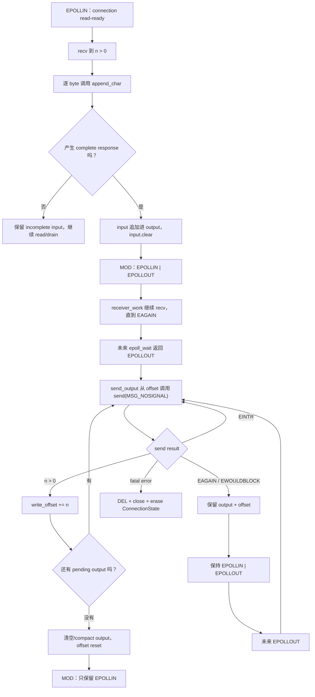

# Week9 Day5：response 一次写不完，剩余 bytes 放在哪里

> 前置：Week9 Day4 已正式通过，92/100。你已经用逐 byte parser 把任意切分的 TCP bytes 重新组织成 newline-delimited messages。
>
> 今日主产出：`epoll_echo_server.cpp` V1。它把 Day3 的 multi-connection epoll loop 与 Day4 的 per-connection state 合成一个真正会回显完整 message 的 server。
>
> 核心问题：application 已经生成 response，但一次 non-blocking `send` 只接受一部分，甚至立即返回 `EAGAIN`，剩余 bytes 由谁保存、之后靠什么继续发送？
>
> 编译基线：Ubuntu Linux，`g++ -std=c++17 -Wall -Wextra -g`。

---

# Part 1：前情提要与必要术语

## 1. 今天接在 Day4 的哪一个位置

Day4 已经跑通：

```text
recv 得到任意一批 bytes
-> ConnectionState 逐 byte append
-> 遇到 '\n' 才形成完整 message
-> 完整 response 进入 user-space output
-> incomplete suffix 留在 user-space input
```

但 Day4 没有真实 socket，因此它的 output 只会不断累积。真实 server 不能把：

```text
output 中已经生成
```

直接等同于：

```text
peer 已经收到
```

两者之间还隔着 non-blocking `send`、kernel socket send buffer、TCP 传输以及 peer 的读取。

今天补上的链条是：

```text
完整 message
-> 生成 response
-> append 到 application output buffer
-> send 尝试交给 kernel
-> 只消费 send 明确返回成功的前缀
-> 未发送 suffix 继续留在 ConnectionState
```

## 2. 三层“输出”不要混成一个对象

### 2.1 application output buffer

这是你的 C++ `ConnectionState` 成员，位于 user space。

它保存：

```text
application 已经生成
但还没有被 send 成功接受的 bytes
```

这才是今天由你负责维护的 pending output。

### 2.2 kernel socket send buffer

每个 TCP socket 在 kernel 中都有发送相关状态与缓冲空间。`send` 成功返回 `n > 0`，表示本次有 `n` bytes 被本机 kernel 接受。

它不表示：

```text
这些 bytes 已经到达 peer
这些 bytes 已经被 peer application recv
peer 已经完成业务处理
```

Linux `send(2)` 也明确说明，`send` 成功本身不隐含最终 delivery 成功证明。

### 2.3 peer receive side

数据经过 TCP 后进入 peer 的 kernel receive buffer，最后还需要 peer application 调用 `recv`。

完整对象关系：


今天只把 A 到 B 的状态推进做正确。不要用 `send` 的返回值冒充 E 已经发生。

## 3. partial write

`partial` 是“部分的”；`write` 在这里泛指向 socket 写 bytes。

**partial write** 指：

```text
application 请求发送 remaining 个 bytes
send 返回 n
并且 0 < n < remaining
```

例如：

```text
pending output = "abcdefghij"
write offset = 0
remaining = 10

send(..., 10, ...) 返回 4
```

这次只有前四个 bytes 被 kernel 接受：

```text
已发送前缀："abcd"
仍待发送 suffix："efghij"
新 write offset = 4
```

下一次不能再从 `a` 开始发送，否则 peer 会收到重复数据。

同样也不能直接清空 output，否则 `efghij` 会丢失。

## 4. pending output 与 write offset

`pending` 是“仍待处理的”。**pending output** 是还没有被 `send` 成功接受的 suffix。

`offset` 是“偏移量”。**write offset** 表示 output 前面已有多少 bytes 被成功消费。

若：

```text
output = "abcdefghij"
write_offset = 4
```

则：

```text
已消费范围：[0, 4)
待发送范围：[4, output.size())
remaining = output.size() - write_offset
```

今天允许两种状态表示：

```text
方案 A：保存完整 output + write_offset
方案 B：每次成功后 erase 已发送前缀，使 output 本身始终等于 pending suffix
```

你自己选择。方案 A 通常避免反复从 string 前端搬移剩余 bytes；方案 B 更直观。R1 不要求为了性能先写复杂 Buffer。

## 5. EPOLLOUT

`EPOLLOUT` 中的 `OUT` 是 output。它表示关联 fd 当前**可以推进 write operation 而不阻塞**。

它不保证：

```text
整个 output 一次写完
本次 send 必定返回 output.size()
peer 已经读取
连接以后不会出错
```

对 non-blocking socket，即使收到 `EPOLLOUT`，实际结果仍以随后 `send` 的返回值为准。

## 6. dynamic interest

`dynamic` 是“动态变化的”；`interest` 是注册给 epoll 的关注集合。

今天的 connected socket interest 不再永远只有 `EPOLLIN`，而要由 application state 决定：

```text
没有 pending output
-> 关注 EPOLLIN

存在 pending output
-> 关注 EPOLLIN | EPOLLOUT
```

为什么不从连接建立开始永久关注 `EPOLLOUT`？

TCP socket 大多数时间都是 writable。默认 LT 模式下，只要条件持续成立，`epoll_wait` 就可能不断返回它。若 application 根本没有 bytes 要写，这些 wakeups 没有业务进展，event loop 可能空转并浪费 CPU。

所以今天使用 **dynamic EPOLLOUT interest**：

```text
output 从 empty 变 non-empty，并且暂时没写完
-> MOD 加入 EPOLLOUT

output 被完全消费
-> MOD 移除 EPOLLOUT
```

## 7. backpressure 第一层

`backpressure` 由 `back` 和 `pressure` 组成，常译为**背压**。

今天先把它理解为：

> downstream 消费速度跟不上，压力沿数据路径返回到 upstream，使 upstream 不能无限假设“马上就能写完”。

在本日场景中：

```text
peer application 暂时不 recv
-> peer receive side 推进变慢
-> TCP 发送窗口与本机 socket send buffer 可用空间变少
-> non-blocking send partial / EAGAIN
-> server 的 application output 开始积压
```

今天只做到“积压时不丢 bytes，并等待 writable”。暂不实现：

```text
high-water mark
暂停读取 EPOLLIN
主动拒绝超慢 client
按连接/全局 memory quota
```

这些是后续生产级 backpressure policy，不要一次全塞进 V1。

## 8. SIGPIPE 与 MSG_NOSIGNAL

`SIGPIPE` 是 `signal + pipe`：向**已经没有有效读取端的 stream 写入**时，kernel 可能向进程发送的 signal。

signal 的默认处理可能直接终止整个进程。一个 client 出错不应该轻易杀死整个 server。

Linux `send` 支持：

```cpp
MSG_NOSIGNAL
```

`NO SIGNAL` 表示本次调用不生成 `SIGPIPE`。写入仍会通过 `-1` 和 `errno == EPIPE` 报错，application 仍要清理这条 connection。

`EPIPE` 可记成 `error: broken pipe`。在今天的 stream socket 场景里，它表示这条连接的本地 write direction 已经失效，当前 bytes 没有被本次 `send` 接受；它不是“某个 byte 写坏了”。

它不是：

```text
忽略所有 send errors
保证 peer 存活
让 EPIPE 变成成功
```

---

### 8.1 区分 EPIPE, EAGAIN

不是。你说的“现在塞不进 kernel socket send buffer”对应的是：

```text
send(...) == -1
errno == EAGAIN / EWOULDBLOCK
```

这时连接仍然可写，只是本机 socket send buffer 暂时没有足够空间。保留 pending bytes，等将来 `EPOLLOUT` 后重试。

而 `EPIPE` 是另一类情况：

```text
send(...) == -1
errno == EPIPE
```

它表示这条 stream 已经不能再写了，例如 peer 已关闭接收方向、连接已失效，或本地写方向已被关闭。不是“缓冲区暂时满”，等 `EPOLLOUT` 也不会把它救回来；应清理这条 connection。

可以这样记：

| `send` 结果 | 意义 | 下一步 |
|---|---|---|
| `n > 0` | kernel 收下了 `n` 个 bytes | offset 前进 `n` |
| `EAGAIN` | 暂时塞不进去 | 保留 suffix，等 `EPOLLOUT` |
| `EPIPE` | 这条连接不能写了 | 清理 connection |

`MSG_NOSIGNAL` 只改变 `EPIPE` 出现时的附带行为：

```text
没有 MSG_NOSIGNAL
-> 可能先收到 SIGPIPE
-> 默认可能杀死整个 server

有 MSG_NOSIGNAL
-> 不发 SIGPIPE
-> send 正常返回 -1 / EPIPE
-> 你的代码自己清理该 client
```

所以它不是让发送成功，而是把“可能杀整个进程的 signal”变成你能正常处理的一次错误返回。

---

### 8.2 今天怎么处理 EPIPE

对，你这个判断是对的，而且刚好点中了 TCP 的“双向独立”本质。

```text
A 的 send  -> B 的 recv    （A -> B 方向）
B 的 send  -> A 的 recv    （B -> A 方向）
```

`EPIPE` 直接说明的是：

```text
A -> B 这个方向不能继续 send
```

它本身不必然逻辑推出：

```text
B -> A 方向已经没有数据
```

例如最明确的一种情况是：你自己曾调用过

```cpp
shutdown(fd, SHUT_WR);
```

这会关闭本地的发送方向。之后再 `send`，可能得到 `EPIPE`；但 peer 仍然完全可以继续 `send` 数据给你，而你仍可 `recv`。

所以更精确地说：

```text
EPIPE：
不能再依赖这条 fd 的 write direction。

不是：
recv direction 必然立刻失效。
```

但在今天这个 echo server 里，教程让你对 fatal `send` error 直接清理 connection，是一个 application policy：既然 server 已无法可靠地把 response 回给 client，继续读新的 request 通常没有业务意义。

底层上，`EPIPE` 后若你硬要 `recv`，可能仍读到 peer 之前已经发来的 bytes；也可能读到 EOF，或收到例如 `ECONNRESET` 之类的错误。单凭一次 `EPIPE`，不能精确判断反向 byte stream 的最终状态。

## 9. 今天最重要的 state invariant

`invariant` 是每次 public operation 或 event handler 完成后都必须成立的状态关系。

每条 connection 今天至少维持：

```text
1. input 只保存尚未形成完整 message 的 suffix
2. output 中 [0, write_offset) 已被 send 成功接受
3. output 中 [write_offset, size) 仍待发送
4. write_offset 不超过 output.size()
5. 没有 pending output 时，不关注 EPOLLOUT
6. 有 pending output 且当前 send 到 EAGAIN 时，关注 EPOLLOUT
7. send 成功多少，只前进多少，不丢失、不重复
8. 每个 fd 只访问自己的 ConnectionState
```

把第 2、3 条合起来：

$$
0 \le \text{write\_offset} \le \text{output.size()}
$$

$$
\text{pending\_bytes}
=
\text{output.size()}-\text{write\_offset}
$$

---

# Part 2：教程主体

# 教程开始：kernel 只收下 4 bytes，剩下 6 bytes 谁负责

# Round 1：独立完成 epoll echo server V1

## 10. 先说清楚这份程序是干什么的

在 Ubuntu 中新增：

```text
~/code/system-learning/cpp/week9/epoll_echo_server.cpp
```

它是 Day3 server 的持续演进版，不是另开一个无关练习。

程序职责：

```text
一个 epoll instance 管理 listener 和多个 connected sockets
-> non-blocking accept/read
-> 每个 connection 独立解析 newline-delimited messages
-> 每条完整 message 原样 echo
-> non-blocking send 只消费成功部分
-> 未发送 output 留在对应 ConnectionState
-> 根据 pending output 动态切换 EPOLLOUT
```

默认 endpoint：

```text
127.0.0.1:9091
```

使用 9091 是为了不和你此前可能仍在运行的 Day3 9090 server 冲突。

## 11. application protocol

继续沿用 Day4 的最小 line protocol：

```text
delimiter = '\n'
一条完整 request = delimiter 前的 bytes
response = 原 request + '\n'
EOF 不能替代 delimiter
```

例子：

```text
client 分两次发送：
"hel"
"lo\nworld\n"

server 最终回：
"hello\nworld\n"
```

一次 `recv`、一条 request、一次 `send` 之间都没有一一对应关系。

## 12. Round1 必须满足的 observable contract

### 12.1 listener 与 connection

```text
listener 和所有 connected sockets 都是 non-blocking
listener ready 时 accept4 到 EAGAIN
connection readable 时 recv 到 EAGAIN / EOF / fatal error
一个 connection 结束不能杀死其他 connections 或 listener
```

这是复用 Day3 已通过的机制，不要求重新发明。

### 12.2 per-connection state

每个 connected fd 必须有独立 state，至少能表达：

```text
incomplete input
generated output
output 已经成功发送到哪里
当前是否还有 pending output
```

容器与成员名自由。你可以把 Day4 `ConnectionState` 合并进同一 source，也可以在当前阶段保留一个小 class。

### 12.3 read、parse、generate

收到 `n > 0` bytes 后：

```text
只处理 temp[0,n)
-> 喂给该 fd 的 parser
-> 每遇到完整 newline message，生成同样的 response
-> incomplete suffix 留在这条 connection
```

### 12.4 write progress

只要这条 connection 有 pending output，就允许尝试 `send`。

必须满足：

```text
send 返回 n > 0
-> 只消费前 n 个 pending bytes

send 返回 -1 且 errno 是 EAGAIN/EWOULDBLOCK
-> 本次没有消费 bytes
-> 保存当前 write progress
-> 等待未来 EPOLLOUT

send 返回 -1 且 errno 是 EINTR
-> 当前调用未发送 bytes
-> 重试

其他错误
-> 只清理当前 connection
```

调用 `send` 时使用 `MSG_NOSIGNAL`。

### 12.5 dynamic EPOLLOUT

```text
pending output == 0
-> connected fd interest 不包含 EPOLLOUT

pending output > 0，且当前不能继续写
-> interest 包含 EPOLLOUT

收到 EPOLLOUT 后继续推进
-> 全部写完
-> MOD 移除 EPOLLOUT
```

不要用第二次 `EPOLL_CTL_ADD` 改 mask。已经注册的 fd 应使用 `EPOLL_CTL_MOD`。

## 13. 今天允许你自己决定的设计

以下都不规定唯一答案：

```text
ConnectionState 的成员名
output 使用 erase-prefix 还是 write_offset
read handler / write handler / update_interest 怎样拆函数
收到完整 response 后立刻尝试 send，还是统一交给同轮 write stage
connections 使用 unordered_map 还是 map
日志具体格式
```

但 observable state 不能变：

```text
pending bytes 必须有 owner
send 成功多少才消费多少
interest mask 必须与 pending output 一致
```

## 14. Round1 必要 API

### 14.1 `send`：向 connected socket 提交 bytes

头文件与签名：

```cpp
#include <sys/socket.h>

ssize_t send(int socket_fd,
             const void* buffer,
             std::size_t length,
             int flags);
```

参数：

```text
socket_fd：connected socket fd
buffer：待发送 bytes 的起点
length：本次请求发送多少 bytes
flags：本次调用选项；今天使用 MSG_NOSIGNAL
```

返回值：

```text
> 0：本次成功接受的 bytes 数量，可能小于 length
-1：失败，检查 errno
```

最小例子只展示一次调用，不替你写完整 loop：

```cpp
const std::string output = "hello\n";
const std::size_t offset = 2;
const std::size_t remaining = output.size() - offset;

const ssize_t n = ::send(
    socket_fd,
    output.data() + offset,
    remaining,
    MSG_NOSIGNAL);
```

这里本次尝试从 `output[2]` 开始，也就是发送 `"llo\n"`。只有 `n > 0` 时才允许把 offset 增加 `n`。

官方语义核验：[Linux `send(2)`](https://man7.org/linux/man-pages/man2/send.2.html)。重点只看 `RETURN VALUE`、`EAGAIN/EWOULDBLOCK`、`EPIPE` 与 `MSG_NOSIGNAL`。

### 14.2 `EPOLL_CTL_MOD`：修改既有 registration

你已经用过 `epoll_ctl` 的 ADD/DEL。今天新增 MOD：

```cpp
#include <sys/epoll.h>

int epoll_ctl(int epoll_fd,
              int operation,
              int target_fd,
              epoll_event* event);
```

隔离 API 例子：

```cpp
#include <cstdio>

epoll_event interest{};
interest.events = EPOLLIN | EPOLLOUT;
interest.data.fd = connection_fd;

if (::epoll_ctl(
        epoll_fd,
        EPOLL_CTL_MOD,
        connection_fd,
        &interest) == -1) {
    std::perror("epoll_ctl MOD");
}
```

MOD 会用 `event` 中的新设置替换该 fd 的 registration settings。不要只想到“加一个 bit”：

```text
仍然需要 EPOLLIN
需要时再 OR EPOLLOUT
data.fd 也重新填成当前 connection_fd
```

成功返回 0，失败返回 -1 并设置 `errno`。

官方语义核验：[Linux `epoll_ctl(2)`](https://man7.org/linux/man-pages/man2/epoll_ctl.2.html)。今天只查 `EPOLL_CTL_MOD`；LT ready-list 模型可对照 [Linux `epoll(7)`](https://man7.org/linux/man-pages/man7/epoll.7.html)。

### 14.3 从 output + offset 得到 pending range

这不是新库 API，只是今天最重要的范围计算：

```cpp
const std::size_t remaining = output.size() - write_offset;
const char* pending_begin = output.data() + write_offset;
```

前提必须是：

$$
\text{write\_offset} \le \text{output.size()}
$$

不要在 `remaining == 0` 时继续为了“试试看”调用 send。

## 15. R1 的最小 client

下面 client 只负责验证协议结果，不泄露 server 实现。保存为可选的 `echo_client.py`，也可以让我在验收时替你运行。

```python
# 目标：分两批发送 hello/world，并验证 server 返回完全相同的两条 lines。
# 验证：收到 exact bytes 后打印 CLIENT PASS；EOF/timeout/内容错误都会失败。
import socket


def recv_exact(sock: socket.socket, expected_size: int) -> bytes:
    received = bytearray()
    while len(received) < expected_size:
        chunk = sock.recv(expected_size - len(received))
        if not chunk:
            raise RuntimeError("unexpected EOF before complete response")
        received.extend(chunk)
    return bytes(received)


expected = b"hello\nworld\n"

with socket.create_connection(("127.0.0.1", 9091), timeout=3.0) as sock:
    sock.settimeout(3.0)
    sock.sendall(b"hel")
    sock.sendall(b"lo\nworld\n")
    actual = recv_exact(sock, len(expected))

if actual != expected:
    raise RuntimeError(f"unexpected response: {actual!r}")

print("CLIENT PASS")
```

运行结果必须是：

```text
CLIENT PASS
```

注意：这个小响应通常会被一次 `send` 写完。它先证明正常 echo 主线，不证明 partial-write path 已经真实发生。

## 16. 编译与运行

server：

```bash
cd ~/code/system-learning/cpp/week9
g++ -std=c++17 -Wall -Wextra -g epoll_echo_server.cpp -o epoll_echo_server
./epoll_echo_server
```

另一个终端：

```bash
cd ~/code/system-learning/cpp/week9
python3 echo_client.py
```

至少确认：

```text
server 零 warning 启动
client 输出 CLIENT PASS
client 结束后 server 仍然存活
第二次运行 client 仍然 PASS
```

server 前台按 `Ctrl+C` 停止即可。今天不要求为演示程序增加 signal-based graceful shutdown。

## 17. Round1 阅读闸门

到这里停止阅读，先独立完成 `epoll_echo_server.cpp` V1。

你已经拿到：

```text
程序用途与端口
line protocol
per-connection observable state
send 的完整返回分类
dynamic EPOLLOUT contract
必要 API 独立小例子
编译命令与 normal-path client
```

你还没有看到：

```text
read/parse/write 的完整事件因果链
send loop 的组织顺序
interest mask 的集中维护方法
slow-reader 如何扩大 partial write
```

先按自己的理解组合 Day3 与 Day4。R1 正式检阅通过后，Round2/Round3 会根据你的实际 state 表示、函数划分、日志和问题重新润色。

---

# Round 2：完成 V1 后，把 write state 从头串清楚

> R1 已于 2026-09-05 正式通过，评分 92/100。下面只针对你的真实实现复盘：`std::map<int, ConnectionState>` 保存每连接 state，`output + offset` 表示 write progress，parser 产生完整 message 后先 MOD 加入 `EPOLLOUT`，再由后续 event 调用 `sender_work`。

你的 R1 已经跑通的主线是：

```text
EPOLLIN
-> receiver_work recv 到 EAGAIN
-> connection_state[fd].append_char
-> 遇到 '\n'，input 追加到 output
-> EPOLL_CTL_MOD：EPOLLIN | EPOLLOUT
-> 后续 EPOLLOUT
-> sender_work
-> send_output 从 offset 继续 send
```

这一轮不重写已经正确的 parser、accept drain 或 normal client，只处理真实实现里仍值得打磨的 write-state 与 connection-lifetime 边界。

## 18. 一条 response 的完整因果链

正常路径：



这条链的核心不是函数名，而是每个状态变化都有明确证据：

```text
send 返回 n > 0 才消费 n
send 返回 EAGAIN 不消费
pending 决定 EPOLLOUT interest
future EPOLLOUT 只让你再试，仍以 send result 为准
```

## 19. `send` 的三类结果分别修改什么

| 结果 | 本次有多少 bytes 被接受 | user output 怎么变 | 下一步 |
|---|---:|---|---|
| `n > 0` | `n` | offset 前进 `n` | 若还有 pending，继续尝试 |
| `-1 + EINTR` | 0 | 不变 | 立即重试 |
| `-1 + EAGAIN/EWOULDBLOCK` | 0 | 不变 | 保留状态，关注 `EPOLLOUT` |
| 其他 `-1` | 0 | connection 进入失败清理 | DEL、close、erase |

partial write 不是 error。它是一次有进展但没有完成的正常返回。

## 20. 为什么只更新 offset，不重建 response

假设：

```text
output = "hello\nworld\n"
write_offset = 0
```

第一次 `send` 返回 5：

```text
kernel 已接受 "hello"
write_offset = 5
pending = "\nworld\n"
```

第二次必须从：

```cpp
output.data() + write_offset
```

继续。

不要重新解析 input，也不要重新生成整份 response。解析完成与发送完成是两个独立进度：

```text
parse progress：哪些 input 已经形成 message
write progress：哪些 output 已经被 send 接受
```

## 21. output 什么时候可以清空

只有：

$$
\text{write\_offset}=\text{output.size()}
$$

时，output 才没有 pending suffix。

此时可以：

```text
output.clear()
write_offset = 0
MOD 移除 EPOLLOUT
```

如果 output 后面又 append 新 response：

```text
旧 output 已全部消费
-> clear/reset
-> 新 response 从 offset 0 开始
```

如果选择 erase-prefix 方案，则 invariant 改成：

```text
output 本身始终只保存 pending suffix
```

两种方案不要混用，否则很容易既 erase 又增加旧 offset，跳过一段数据。

你的 R1 当前属于“完整 output + offset”方案，但写完后只移除了 `EPOLLOUT`，没有执行 `output.clear()` 与 `offset = 0`。短期 echo 结果仍正确，因为下一条 response 会追加在旧 string 后面，offset 也从旧末尾继续；但这会让已经发送的前缀一直占用 user-space memory。R2 应在 `offset == output.size()` 时回收这段已完成数据。

## 22. kernel send buffer 满时，谁在等待

不是 kernel 替你保存尚未成功提交的 application suffix。

```text
send 已成功返回的前缀
-> local kernel 已接管

send 尚未接受的 suffix
-> 仍由 ConnectionState.output 持有
```

non-blocking server 本身也不应该睡在 `send` 里：

```text
send EAGAIN
-> 保存 write state
-> 注册 EPOLLOUT
-> event loop 继续服务其他 fd
-> kernel 以后报告 writable
-> 回来继续这条 connection
```

这正是 event-driven server 能处理 slow client 的关键。

## 23. dynamic interest 的唯一判断源

最稳的判断源不是“刚才收到过 EPOLLOUT”，而是当前 application state：

```text
wants_write = pending_output_size > 0
```

interest mask 可以从状态重新计算：

```text
events = EPOLLIN
if wants_write:
    events |= EPOLLOUT
```

再用 `EPOLL_CTL_MOD` 提交整份新 mask。

你在 R1 note 里写了“发送完毕后 DEL”。这里应改成：

```text
EPOLL_CTL_MOD：从 interest mask 中移除 EPOLLOUT
```

`EPOLL_CTL_DEL` 的含义是把整个 fd 从 epoll instance 注销，只在 connection cleanup 时使用，不是删除某一个 event bit。

为什么强调“重新计算”：

```text
避免只会加 EPOLLOUT，却忘记发送完后移除
避免 MOD 时漏掉原有 EPOLLIN
避免 event mask 与 output state 分裂
```

当前 `append_char` 与 `send_output` 会调用 `modify_epoll_info`，但忽略它返回的 `false`。一旦 MOD 失败，application state 已认为“以后会收到 OUT”或“已经停止关注 OUT”，kernel registration 却没有完成相同变化。R2 不要求复杂恢复，只要让 MOD failure 明确进入当前 connection 的清理路径，不能只 `perror` 后继续假装状态一致。

## 24. 为什么永久监听 EPOLLOUT 可能空转

默认 LT 模式下，只要 socket 仍 writable，`epoll_wait` 可以继续返回 `EPOLLOUT`。

如果：

```text
pending output = 0
interest 仍包含 EPOLLOUT
```

handler 每次被叫醒后都没有 bytes 可写：

```text
epoll_wait 返回
-> 看见 EPOLLOUT
-> output empty
-> 什么也没做
-> 再次 epoll_wait
-> socket 仍 writable
-> 很快再次返回
```

这不是 TCP 在“疯狂发送”，而是 application 注册了一个长期成立、却没有业务工作的 interest。

## 25. 为什么生成 response 后可以先主动 send

一种简单实现是：

```text
只要 output 变 non-empty
-> 先主动调用 send
-> 写完就不注册 EPOLLOUT
-> EAGAIN 才注册 EPOLLOUT
```

这样正常的小响应通常当场完成，不需要额外经历一次 `epoll_wait`。

另一种实现是 output 变 non-empty 后直接注册 `EPOLLOUT`，等下一轮通知再写。你的 R1 正在使用这一种：`append_char` 负责 MOD，`sender_work` 在后续 event 才发送。它是正确方案，只比“先主动 send”多一次 event-loop 往返，不需要为了形式重写。

## 26. 同一个 returned event 同时有 IN 和 OUT 怎么办

`epoll_event.events` 是 bit mask，一次可能同时包含多个 bits。

因此不要写成互斥世界观：

```text
if EPOLLIN:
    ...
else if EPOLLOUT:
    ...
```

否则同一 event 同时有 IN/OUT 时，只会执行一个方向。

更准确的模型：

```text
先记录 connection 当前仍存活
-> 若有 EPOLLIN，推进 read/parse
-> read 可能生成 output，也可能关闭 connection
-> 若 connection 仍存活且有 pending output，推进 write
-> 若 returned mask 有 EPOLLOUT，也表示本轮适合继续 write
-> 最后根据新 state 更新 interest
```

具体先读还是先写不是今天唯一答案，但 connection 一旦在前一个分支被清理，后续不能继续使用它的 fd/state。

这正好对应你当前 dispatch 的真实风险：

```cpp
if (events & EPOLLIN) {
    receiver_work(...);  // 这里可能 clear_connection
}
if (events & EPOLLOUT) {
    sender_work(...);    // 仍可能继续
}
```

若同一个 event 同时包含 IN/OUT，而 `receiver_work` 因 EOF/error 执行了 DEL + close + erase，第二个 `if` 仍会运行。随后 `connection_state[fd]` 不是“找到旧对象”，而是可能默认插入一个新的空 `ConnectionState`。R2 需要让 handler 把“connection 是否仍存活”反馈给 dispatch，或在进入第二阶段前重新确认 map 中仍存在该 fd；不要用 `operator[]` 把 stale access 静默变成新对象。

## 27. MSG_NOSIGNAL 解决什么，不解决什么

调用：

```cpp
::send(fd, data, size, MSG_NOSIGNAL);
```

若写端已经失效：

```text
没有 MSG_NOSIGNAL
-> 可能收到 SIGPIPE
-> 默认动作可能终止整个 process

使用 MSG_NOSIGNAL
-> 不生成本次 SIGPIPE
-> send 仍返回 -1
-> errno 仍可能是 EPIPE
-> application 仍清理该 connection
```

所以它保护的是“错误通过普通返回值进入你的控制流”，不是把坏连接修好。

## 28. Day5 与 Day6 的错误边界

Day5 必须处理：

```text
send > 0
EINTR
EAGAIN / EWOULDBLOCK
明显 fatal send error
MSG_NOSIGNAL
```

Day6 再系统整理：

```text
EPOLLERR / EPOLLHUP / EPOLLRDHUP
LT 与 ET 对照
同轮 read/write/close 的完整优先级
fd close、registration 与 stale event lifecycle
```

今天遇到 fatal error 时能安全结束当前 connection 即可，不要求提前写完整 state enum。

## 29. R2 完成后的自检

只检查今天新增的关系：

```text
send 成功多少，是否只消费多少
EAGAIN 时 output/offset 是否保持
pending output 是否决定 EPOLLOUT
写空后是否移除 EPOLLOUT
MOD 时是否保留 EPOLLIN 与 data.fd
EPIPE 是否通过 MSG_NOSIGNAL 进入普通错误分支
```

不重新验收 Day3 全部 accept/read 分支，也不要求把 Day4 parser 改成另一种算法。

---

# Round 3：用一个 slow reader 观察 pending output

## 30. 为什么普通 hello 很难看到 partial write

本机 loopback 很快，小 response 往往能完整进入 socket send buffer：

```text
remaining = 12
send 返回 12
```

这只能证明 normal path，不能证明 partial/EAGAIN path 不会发生。

为了扩大观察概率，需要同时制造：

```text
更大的 response
更小的 server socket send buffer
client 暂时不 recv
```

## 31. `SO_SNDBUF`：调整 socket send buffer

`SO_SNDBUF` 是 `socket send buffer`。

接口：

```cpp
#include <sys/socket.h>

int setsockopt(int socket_fd,
               int level,
               int option_name,
               const void* option_value,
               socklen_t option_length);
```

实验用法：

```cpp
const int send_buffer_size = 4096;
if (::setsockopt(
        connection_fd,
        SOL_SOCKET,
        SO_SNDBUF,
        &send_buffer_size,
        sizeof(send_buffer_size)) == -1) {
    std::perror("setsockopt SO_SNDBUF");
}
```

参数：

```text
connection_fd：刚 accept 的 connected socket
SOL_SOCKET：操作 socket layer option
SO_SNDBUF：设置发送缓冲区大小
send_buffer_size：请求值
```

Linux 会为 bookkeeping 对设置值做调整，`getsockopt` 读回值可能是请求值的两倍，并且存在最小值与系统上限。因此 4096 是实验施压手段，不是“kernel buffer 一定精确等于 4096”的证明。

官方语义核验：[Linux `socket(7)` 的 `SO_SNDBUF`](https://man7.org/linux/man-pages/man7/socket.7.html)。

这个设置只用于 Round3 观察。最终代码是否保留，由实验后决定。

## 32. slow reader client

保存为 `slow_echo_client.py`，或者在验收时让我代跑：

```python
# 目标：发送 4 MiB newline message，暂停读取，再验证完整 echo。
# 验证：server 不能丢失或重复任何 byte；成功时打印 SLOW CLIENT PASS。
import socket
import time


def recv_exact(sock: socket.socket, expected_size: int) -> bytes:
    received = bytearray()
    while len(received) < expected_size:
        chunk = sock.recv(min(65536, expected_size - len(received)))
        if not chunk:
            raise RuntimeError(
                f"unexpected EOF: got {len(received)} of {expected_size} bytes"
            )
        received.extend(chunk)
    return bytes(received)


payload = b"x" * (4 * 1024 * 1024) + b"\n"

with socket.create_connection(("127.0.0.1", 9091), timeout=5.0) as sock:
    sock.settimeout(15.0)
    sock.sendall(payload)

    # 暂停 application recv，让 server 更容易积累 pending output。
    time.sleep(1.0)

    response = recv_exact(sock, len(payload))

if response != payload:
    raise RuntimeError("echo payload mismatch")

print(f"SLOW CLIENT PASS bytes={len(response)}")
```

先运行 server，再运行：

```bash
python3 slow_echo_client.py
```

在 slow client 的 1 秒暂停窗口内，用第三个终端再运行一次 `echo_client.py`。它仍应及时输出 `CLIENT PASS`；这才是“一个 slow connection 没把唯一 event-loop thread 卡住”的直接证据。

## 33. server 只加五个观测计数

不要为观察写日志框架。五个 counter 足够：

```text
send_call_count
partial_send_count
send_eagain_count
epollout_enable_count / epollout_disable_count
```

定义：

```text
partial send：0 < n < 本次调用前 remaining
EAGAIN：本次 n == -1 且 errno 为 EAGAIN/EWOULDBLOCK
enable：interest 从不含 EPOLLOUT 变成包含
disable：interest 从包含 EPOLLOUT 变成不含
```

日志只需在状态变化时打印，例如：

```text
WRITE fd=7 accepted=32768 remaining=1048576
WRITE fd=7 EAGAIN pending=1015808
INTEREST fd=7 +EPOLLOUT
INTEREST fd=7 -EPOLLOUT
```

不要每个 byte 打一行，否则 console I/O 会反过来扰动实验。

你的 R1 目前会把每次 `recv` 的全部 payload 输出到 `std::cout`。对 4 MiB slow-reader 实验，这会产生数 MB console I/O，明显改变 event-loop 时序。进入 R3 前先关闭 payload dump，只保留 fd、`n` 和上面的 write/interest counters。

## 34. 什么算通过

正确性证据：

```text
normal client exact response PASS
slow client exact 4 MiB + newline response PASS
server 在 slow client 暂停读取时仍能服务另一个 small client
client 结束后 server 仍能接受新连接
```

机制观察最好看到：

```text
partial_send_count > 0
或 send_eagain_count > 0
以及对应 EPOLLOUT enable -> later disable
```

但是 `SO_SNDBUF`、loopback、TCP autotuning 和 scheduler 都会影响具体结果。一次没看到 partial/EAGAIN，不等于实现可删除该分支，也不立刻判整个 Day5 失败。

合理顺序：

```text
先确认 payload equality
-> 再把 accepted socket SO_SNDBUF 调小
-> 增大 payload 或延长 client 暂停时间
-> 重跑少量代表实验
```

不要求 100 次压力运行。

## 35. 这组 evidence 能证明什么

能证明：

```text
固定 slow-reader workload 下 response 不丢、不重
event loop 没被一个 blocked send 卡死
observed partial/EAGAIN 后能够借 EPOLLOUT 恢复推进
output 清空后 interest 能回到 read-only
```

不能证明：

```text
任意 client 数量下都无内存风险
生产级 backpressure 已完成
peer application 已处理业务
所有 HUP/ERR/RDHUP interleavings 都正确
ET 模式已经正确
```

---

# Part 3：收尾、验收与 Day6 接口

## 36. 今日通过标准

结合 source、运行输出和必要解释：

```text
1. epoll_echo_server.cpp 使用 C++17 + Wall/Wextra 零 warning
2. 一个 epoll instance 服务 listener 与多个 connections
3. newline fragmentation/coalescing 后 echo exact
4. 每个 connection 有独立 input/output/write progress
5. send success/partial/EAGAIN/EINTR/fatal error 状态分类正确
6. pending output 决定是否关注 EPOLLOUT
7. output 全部消费后移除 EPOLLOUT
8. MSG_NOSIGNAL 防止单连接 EPIPE 默认杀死 process
9. normal client 与 slow client 的 exact response 验证通过
10. 能说明本次是否真实观察到 partial/EAGAIN，不伪造证据
```

不要求：

```text
GoogleTest / CMake / README
完整 Reactor class
ET 模式
high-water mark
100 次压力测试
优雅停机
```

## 37. 六个收口问题

可以口述，也可以直接指向代码与真实日志，不用机械抄六段答案。

1. `send` 返回 4，而 remaining 是 10，哪 4 bytes 由 kernel 接管？下一次从哪里继续？
2. `send == -1 && errno == EAGAIN` 时，为什么不能清空 output，也不能在 while 中持续空转重试？
3. application output、kernel socket send buffer、peer receive buffer 分别由谁拥有？
4. 为什么 pending output 为空时仍监听 `EPOLLOUT` 可能让 LT event loop 空转？
5. `EPOLL_CTL_MOD` 增加 `EPOLLOUT` 时为什么还要保留 `EPOLLIN` 并重新设置 `data.fd`？
6. `MSG_NOSIGNAL` 阻止了什么？为什么 `EPIPE` 分支仍然必须处理？

## 38. note 只记录真正新增的东西

`day5_note.md` 可以保持短：

```text
R1：你的 ConnectionState/write-progress 设计与第一次跑通结果
R2：一次 partial/EAGAIN 的完整 state transition
R3：slow client 的 payload equality、counter 与 EPOLLOUT 变化
Questions：真正卡住的点
```

代码和日志已经明确证明的内容可以直接引用，不重复誊写验收题。

## 39. 今天停在哪里

Day5 结束时主线应是：

```text
EPOLLIN
-> recv bytes
-> per-connection incremental parse
-> generate response
-> application output buffer
-> non-blocking send
-> partial/EAGAIN 保存 progress
-> dynamic +EPOLLOUT
-> future writable event
-> output drained
-> dynamic -EPOLLOUT
```

Day6 再把已经跑通的 server 加固：

```text
LT / ET 对照
EPOLLERR / EPOLLHUP / EPOLLRDHUP
read/write/close 同轮事件
fd、epoll registration、ConnectionState 生命周期
错误状态与 stale event 边界
```

**今日一句话：`send` 成功多少才消费多少；未发送 suffix 留在 per-connection output，`EPOLLOUT` 只在有 pending output 时动态关注。**
