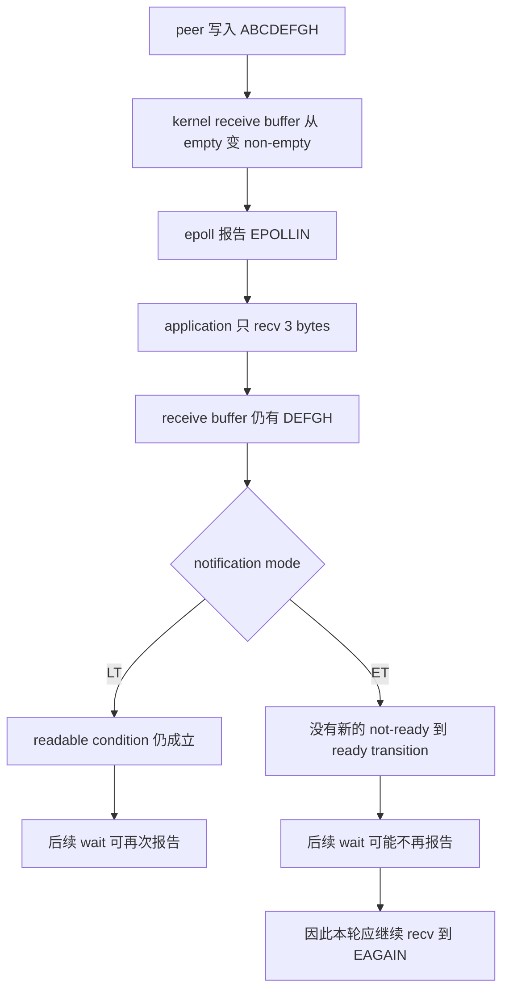
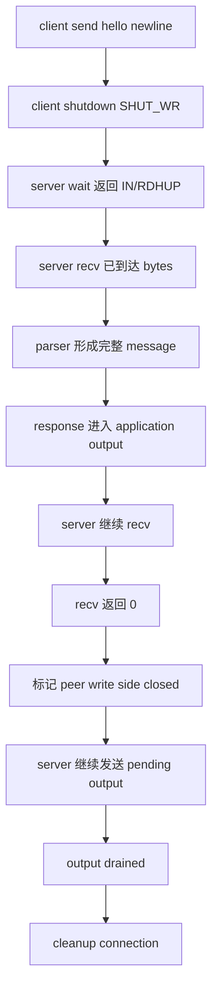

# Week9 Day6：LT、ET 与 connection lifecycle

> 今日定位：继续加固 Day5 已经跑通的 `epoll_echo_server.cpp`，不另起炉灶重写服务器。
>
> 今日主问题：如果一次 readiness event 只推进了一部分 I/O，LT 与 ET 为什么会表现不同？peer 关闭一半连接、同一轮返回多个 event bits、fd 被关闭时，程序怎样保证旧 connection 不会继续被使用？
>
> 今日主要产出：一个用于亲眼比较 LT/ET 的 `lt_et_probe.cpp`，以及经过 close/error/lifecycle 加固的 canonical `epoll_echo_server.cpp`。

---

# Part 1：前情提要与必要术语

## 1. 今天接在 Day5 的哪一个位置

Day5 已经正式通过。你现在的 server 已经跑通：

```text
EPOLLIN
-> recv bytes
-> per-connection incremental parsing
-> append response to application output
-> non-blocking send
-> partial/EAGAIN 时保存 offset
-> dynamic +EPOLLOUT
-> future writable event 继续发送
-> output drained
-> dynamic -EPOLLOUT
```

真实证据也已经存在：

```text
normal fragmented client：exact echo PASS
4 MiB slow reader：exact echo PASS
slow client 尚未读完时，另一个 small client 仍能完成
server 真实观察到 pending output 与未来 EPOLLOUT 恢复
C++17 + Wall/Wextra：零 warning
```

因此今天不再重复解释 partial write，也不要求再写一套 echo server。

Day5 最后暴露出来的真正问题是：

```text
一个 returned event 可能同时包含多个 bits
某个 handler 可能在处理中关闭 connection
后面的 handler 不能继续使用旧 fd/state

peer 停止发送，不等于 server 也不能继续发送
HUP/RDHUP 到达时，kernel receive buffer 里可能仍有数据

把 EPOLLET 加进 mask 很容易
但 handler 的推进边界是否需要改变，要用今天的实验回答
```

Day6 就集中解决这三组状态关系。

## 2. LT：Level-Triggered

`LT` 是 `Level-Triggered`，中文常译为“水平触发”或“电平触发”。

今天不要把 `level` 理解成音量高低。这个名字来自对 readiness condition 当前状态的观察。

以可读为例：

```text
kernel receive buffer 中仍有 bytes
-> readable condition 仍为 true
```

它不表示：

```text
每个 byte 对应一个 event
一次 event 对应一条 application message
handler 可以使用 blocking fd
```

LT 是 Linux epoll 的默认模式；registration 中不加 `EPOLLET` 就是 LT。

## 3. ET：Edge-Triggered

`ET` 是 `Edge-Triggered`，中文常译为“边沿触发”。

这里的 `edge` 指 readiness condition 发生一次状态变化，例如：

```text
当前没有数据可读
-> 新数据到达
-> 变成有数据可读
```

先只记住：ET 改变的是 readiness notification behavior，不改变 `recv`、`send` 或 TCP byte stream 本身。partial consume 后第二次 `epoll_wait` 会怎样，留给 Round1 先预测、再实测。

它不是：

```text
ET 自动比 LT 快
一种新的 read/write API
application message boundary
```

## 4. readiness condition 与 readiness transition

这两个词是今天理解 LT/ET 的核心。

`condition`：条件；当前是否有机会执行某类 I/O。

`transition`：转变；condition 从一种状态变到另一种状态。

这两个词只是理解名称所需的最小词汇。它们怎样影响 partial read 后的下一次 wait，现在不要继续向下推答案：先把自己的预测写进 Round1。完整因果链放在闸门之后。

## 5. `EPOLLET`

`EPOLLET` 是 epoll event mask 中的 input flag，用来请求 Edge-Triggered behavior。

```cpp
epoll_event interest{};
interest.events = EPOLLIN | EPOLLRDHUP | EPOLLET;
interest.data.fd = connection_fd;
```

它不是一个独立 API，也不是“手动触发 event”的函数。它只是 registration behavior 的一部分。

若后续使用 `EPOLL_CTL_MOD`，提交的是一份新的完整 mask，因此仍要保留需要的 `EPOLLIN`、`EPOLLRDHUP`、`EPOLLET` 和可能存在的 `EPOLLOUT`。

## 6. half-close

`half-close`：半关闭。

TCP connection 有两个相对独立的数据方向：

```text
client -> server
server -> client
```

client 调用：

```cpp
::shutdown(socket_fd, SHUT_WR);
```

表示 client 不会再发送新 bytes，但它仍然可以接收 server 发来的 bytes。

因此：

```text
server 最终 recv == 0
```

只证明 peer 的发送方向已经结束，不证明 server 的输出方向也必须立刻结束。

`shutdown` 的英文就是“关闭、停止”。`SHUT_WR` 中 `WR` 来自 `write`，表示关闭本端 write direction。

## 7. `EPOLLRDHUP`

`RDHUP` 可以拆成 `Read Hang Up`。

对 stream socket，它表示 peer 已经关闭 connection，或者至少关闭了自己的 write half。这个 flag 对 ET 下及时观察 peer shutdown 尤其有用。

但 `EPOLLRDHUP` 是一个提示，不是 unread-byte count：

```text
收到 EPOLLRDHUP
不等于 kernel receive buffer 已经为空
不等于本次不能同时出现 EPOLLIN
不等于 server 必须立即丢弃 pending output
```

程序仍要调用 `recv`，由真实返回值判断读方向推进到了哪里。

## 8. `EPOLLHUP`

`HUP` 来自 `Hang Up`，历史上有“挂断连接”的含义。

对 stream channel，`EPOLLHUP` 可以和 `EPOLLIN` 同时出现。即使 peer 已关闭，之前到达的 bytes 仍可能留在 kernel buffer 中；把这些 bytes 读完后，后续 `recv` 才返回 `0`。

所以不能写成：

```text
只要看见 HUP
-> 不处理 IN
-> 立即 close
```

否则可能丢掉已经到达的数据。

## 9. `EPOLLERR`

`ERR` 来自 `Error`，表示 fd 对应对象出现 error condition。

`EPOLLERR` 与 `EPOLLHUP` 会由 `epoll_wait` 报告，即使 registration mask 没有显式写入这两个 bits。因此它们不能被理解成“只有我订阅才可能出现的普通业务 event”。

对 socket，可以使用 `getsockopt(..., SO_ERROR, ...)` 读取 pending socket error。Day6 的 V1 policy 可以把确认过的 socket error 当作 connection-local fatal error，记录后清理这一个 connection，不杀死 listener。

## 10. fd reuse

`reuse`：重新使用。

fd 只是当前进程 fd table 中一个可用整数槽位。关闭 `fd=7` 后，kernel 之后完全可能把整数 `7` 分配给一个新 connection。

```text
old connection A -> fd 7 -> close
new connection B -> accept -> fd 7
```

因此：

```text
整数相同
不等于还是同一个 connection
```

Day6 先建立这层风险意识。Week10 抽象 Reactor components 时，再系统处理 callback、object lifetime 与 registration identity。

## 11. stale event

`stale`：陈旧的、已经过期的。

`stale event` 指 user space 手里保存的某个 event，描述的是已经失效的旧 connection 状态。

例如一次 `epoll_wait` 返回多个 event 后：

```text
处理前一个 event
-> 某条路径关闭 fd 并删除 state
-> 后面仍尝试按旧 event 使用该 fd/state
```

这和“kernel 一定错误地通知了一个不存在的对象”不是一回事。event 可能在返回时完全有效，只是在你处理 event batch 的过程中对应对象被别的处理路径移除了。

## 12. 今天四个对象仍要分开

```text
fd integer
    当前进程访问 kernel object 的编号

kernel socket/open file description
    TCP state、receive/send queues 与 file status flags 所在层

epoll registration
    关注哪个 fd/open-file-description identity、哪些 event bits

ConnectionState
    application input/output、write offset、协议进度与 half-close 状态
```

Day6 的正确性不是“所有东西都还在 `std::map` 里”这么简单，而是这四层的创建、修改和销毁顺序必须一致。

---

# Part 2：教程主体

# 教程开始：只读 3 bytes 后，第二次 wait 会发生什么

# Round 1：先亲眼比较 LT 与 ET

## 13. 先说清楚这份程序是干什么的

新建：

```text
~/code/system-learning/cpp/week9/lt_et_probe.cpp
```

它不是新的 server，也不是简历项目。它只回答一个问题：

```text
同一批 bytes 已经到达后，receiver 故意只读一部分，
下一次 epoll_wait 在 LT 与 ET 下分别会观察到什么？
```

选择 local stream endpoints，是为了把 TCP handshake、port、listener 和网络时延从实验中拿掉，只保留：

```text
stream bytes
non-blocking recv
epoll readiness
LT / ET mode
```

程序通过命令行选择模式：

```bash
./lt_et_probe lt
./lt_et_probe et
```

## 14. Round1 observable contract

程序按以下场景运行：

```text
1. 创建一对已经连通的 local stream endpoints
2. receiver endpoint 使用 non-blocking mode
3. 把 receiver 注册进 epoll
4. lt 模式注册 EPOLLIN
5. et 模式注册 EPOLLIN | EPOLLET
6. peer 一次写入 8 bytes：ABCDEFGH
7. 第一次 epoll_wait 必须报告 receiver readable
8. receiver 故意只 recv 3 bytes，本次得到 ABC
9. 调用第二次 wait 前，分别写下 LT/ET 结果预测和一句理由
10. 不再写入新数据，进行第二次有限超时 epoll_wait
11. 原样记录第二次 wait 返回 ready、timeout 还是 error，不按预期篡改输出
12. 把当前剩余 bytes drain 到 EAGAIN，并记录实际得到的 bytes
13. peer 再写入 IJ
14. 第三次 wait 前再次预测，然后记录 event 与最终读取结果
```

这里第二次 wait 必须使用有限 timeout，例如 `300 ms`，不能用 `-1` 把实验永远挂住。

预测可以先写进 `day6_note.md`：

```text
LT WAIT2 prediction：...
原因：...

ET WAIT2 prediction：...
原因：...

new write 后 WAIT3 prediction：...
原因：...
```

程序输出只需要提供可核对的原始事实，不在 label 里预埋正确答案：

```text
MODE <LT-or-ET>
WAIT1 count=<actual> events=<actual mask>
READ1 bytes=<actual> data=<actual>
WAIT2 count=<actual>
DRAIN data=<actual> end=<actual recv result>
WAIT3 count=<actual> events=<actual mask>
READ3 data=<actual>
```

Round1 的任务是取得 observation，不是根据教程里预写的 LT/ET 答案打印 `PASS`。哪些结果符合 Linux LT/ET 模型，进入 Round2 后再对照。

## 15. 你自己决定的设计

Round1 不规定：

```text
使用 class 还是 free functions
用 array、string 还是 vector<char> 保存观察结果
怎样格式化 event mask
怎样组织 cleanup
是否把两种模式放在同一进程连续运行
```

只要求：

```text
同一份 source 能选择 LT/ET
第二次 wait 前没有新 write
第一次只消费 3 bytes
最终确实 drain 到 EAGAIN
错误路径 non-zero exit
```

## 16. Round1 必要接口

### 16.1 `socketpair`：创建一对已连接的 local sockets

`socketpair` 可以理解为“创建一对彼此已经连接的 sockets”。

```cpp
#include <sys/socket.h>

int socketpair(int domain, int type, int protocol, int socket_vector[2]);
```

最小使用例：

```cpp
int sockets[2]{};
if (::socketpair(AF_UNIX,
                 SOCK_STREAM | SOCK_NONBLOCK | SOCK_CLOEXEC,
                 0,
                 sockets) == -1) {
    std::perror("socketpair");
    return 1;
}

// sockets[0] 与 sockets[1] 已经连通。
// 向 sockets[0] send 的 bytes，可从 sockets[1] recv。
```

参数：

```text
AF_UNIX：使用本机 Unix-domain socket
SOCK_STREAM：提供 byte-stream 语义
SOCK_NONBLOCK：两个 endpoints 创建时直接是 non-blocking
SOCK_CLOEXEC：exec 成功后自动关闭这些 fds
protocol=0：选择该 domain/type 的默认 protocol
socket_vector：接收两个新 fds
```

返回 `0` 表示成功，`-1` 表示失败并设置 `errno`。

### 16.2 `EPOLLET`：只改变 notification behavior

```cpp
epoll_event interest{};
interest.events = EPOLLIN;
if (edge_triggered) {
    interest.events |= EPOLLET;
}
interest.data.fd = receiver_fd;
```

然后仍通过已经学过的：

```cpp
::epoll_ctl(epfd, EPOLL_CTL_ADD, receiver_fd, &interest);
```

把 registration 加进 interest list。

### 16.3 `epoll_wait` 的 timeout

接口不变：

```cpp
int epoll_wait(int epfd,
               epoll_event* events,
               int max_events,
               int timeout_ms);
```

今天只区分：

```text
timeout_ms = -1：没有 event 就一直等待
timeout_ms = 0：立即检查，不等待
timeout_ms > 0：最多等待指定毫秒数
```

小例子：

```cpp
epoll_event returned{};
const int count = ::epoll_wait(epfd, &returned, 1, 300);
if (count == 0) {
    std::cout << "WAIT2 timeout\n";
}
```

返回值：

```text
> 0：返回的 events 数量
= 0：timeout 到期
= -1：失败；EINTR 表示等待被 signal 打断
```

### 16.4 drain 的终点仍由 `recv` 返回值决定

Round1 的 drain loop 必须分类：

```text
n > 0：消费这 n bytes，继续
n == 0：peer write side 到达 EOF
EINTR：重试本次 recv
EAGAIN/EWOULDBLOCK：当前已 drain，结束本轮
其他 error：失败，non-zero exit
```

不要拿“这次 `n < sizeof(buffer)`”替代 EAGAIN 作为本实验唯一终点。你今天要亲眼看到 would-block boundary。

## 17. 编译与运行

```bash
g++ -std=c++17 -Wall -Wextra -g lt_et_probe.cpp -o lt_et_probe

./lt_et_probe lt
./lt_et_probe et
```

可选观察：

```bash
strace -e trace=epoll_create1,epoll_ctl,epoll_wait,sendto,recvfrom,close \
  ./lt_et_probe et
```

在这台 Linux 上，C++ `send`/`recv` wrapper 在 `strace` 中常显示为 `sendto`/`recvfrom`，不是你的 source 偷换了 API。

## 18. Round1 阅读闸门

先停在这里。

在继续 Round2 前，至少拿到：

```text
运行前保存了 LT WAIT2、ET WAIT2 与 new-write WAIT3 的预测
LT/ET 两次运行都原样记录 WAIT1/WAIT2/WAIT3 返回值
第一次只读到 ABC，之后记录了剩余 bytes
drain 的终点真实是 EAGAIN/EWOULDBLOCK
C++17 + Wall/Wextra 零 warning
```

如果实验结果不同，先保留完整 output 和关键 syscall trace，不要通过多加 sleep 猜测修复。

---

# Round 2：把 LT/ET、half-close 与复合 event 串成一条线

## 19. LT/ET 差异的完整因果链

现在才展开结果对照。在本机受控实验中，典型输出应为：

```text
LT：WAIT2 ready=1
ET：WAIT2 timeout
两种模式 drain data=DEFGH，end=EAGAIN
peer 新写入 IJ 后，两种模式 WAIT3 ready=1
```

先对照你在 Round1 写下的预测，再看下面的原因。这个实验说明的是当前受控 Linux stream 场景，不要把具体 event count 扩张成所有 kernel 与并发时序的逐次排队保证。



按执行主体再读一次：

```text
peer application 调用 send
-> peer kernel 接收 user bytes
-> transport/local delivery 让 receiver kernel buffer 变为 non-empty
-> kernel 把 receiver fd 变成 readable
-> epoll_wait 把 event 返回给你的 event-loop thread
-> 你的 handler 调用 recv，只取走 3 bytes
-> 剩余 DEFGH 仍在 receiver kernel buffer
```

到这里，LT 与 ET 的分歧才出现：

```text
LT：readable 这个 level 还在
ET：让你醒来的那次 empty -> non-empty edge 已经发生过
```

所以 ET 的关键不是“更少调用一次 epoll_wait”，而是 application 必须主动把当前可推进工作做到明确边界。

## 20. ET 为什么要求 non-blocking fd

假设 ET handler 采用 drain loop：

```text
recv
-> recv
-> recv
-> 直到 EAGAIN
```

如果 fd 是 blocking：

```text
前面的 bytes 已读完
-> 下一次 recv 等待未来数据
-> 唯一 event-loop thread 睡眠
-> 其他 ready connections 无人处理
```

non-blocking fd 让“当前工作已做完”变成可观察返回：

```text
recv == -1 && errno == EAGAIN/EWOULDBLOCK
```

因此完整关系是：

```text
ET notification
+ non-blocking fd
+ drain until EAGAIN
= handler 不遗漏当前 ready work，也不会等待未来 work
```

## 21. 三种 drain loop 各自在榨干什么

### 21.1 listener

```text
EPOLLIN on listener
-> accept4 一个 connection
-> 再 accept4
-> 直到 EAGAIN
```

榨干的是当前 accept queue 中能够立即取出的 pending connections。

### 21.2 readable connection

```text
EPOLLIN/RDHUP/HUP
-> recv bytes
-> 更新 input/parser/output state
-> 再 recv
-> 直到 EAGAIN、EOF 或 fatal error
```

榨干的是当前 kernel receive buffer 中能立即取出的 bytes。

### 21.3 writable connection

```text
有 pending output
-> send suffix
-> 按 n 推进 offset
-> 再 send
-> 直到 output empty、EAGAIN 或 fatal error
```

推进的是 application pending output。Day5 已经完成这部分，今天只确认它满足 ET 的边界要求。

## 22. LT 也建议 drain，但理由不完全相同

LT 下只处理一次通常仍能再次收到通知，因此未必立刻卡死。但 drain loop 仍有价值：

```text
减少同一个 fd 反复进入 epoll_wait/handler 的次数
及时清空当前 kernel work
让 LT/ET 共用同一套正确 handler
```

但也要知道停止边界：某个 fd 持续有海量数据时，无限制 drain 可能延迟其他 fds。fairness、per-event budget 与 ready queue 属于后续性能加固，不在 Day6 展开。

## 23. 一个 returned mask 可以同时表达多个事实

`epoll_event.events` 是 bit mask，不是单选 enum。

一次可能得到：

```text
EPOLLIN | EPOLLOUT | EPOLLRDHUP
```

它表示当前观察到了多个相关条件，不表示 kernel 要替你决定唯一 handler 顺序。

因此这类结构有风险：

```cpp
if (events & EPOLLIN) {
    // read path 可能 close/erase
}
if (events & EPOLLOUT) {
    // 若不重新检查，可能继续使用旧 state
}
```

你的 Day5 最终修复已经建立了一个正确原则：

```text
会关闭 connection 的下层操作必须把结果反馈给上层
上层一旦得知 dead，就立即停止当前 event 的后续 state access
```

Day6 要把这个原则扩展到 `RDHUP/HUP/ERR`。

## 24. RDHUP/HUP 到来时为什么仍要 recv

考虑 client：

```text
send("hello\n")
-> shutdown(SHUT_WR)
```

server 可能一次看到：

```text
EPOLLIN | EPOLLRDHUP
```

此时 kernel receive buffer 中仍有 `hello\n`。

正确主线是：



这里 `RDHUP` 是“应该检查 read side”的通知；`recv` 返回的 bytes/0/EAGAIN 才决定真实读进度。

## 25. `shutdown` API：只关闭某个方向

```cpp
#include <sys/socket.h>

int shutdown(int socket_fd, int how);
```

参数：

```text
socket_fd：connected socket
SHUT_RD：本端不再接收
SHUT_WR：本端不再发送
SHUT_RDWR：两个方向都关闭
```

最小 client 例子：

```cpp
const char request[] = "hello\n";
if (::send(fd, request, sizeof(request) - 1, MSG_NOSIGNAL) == -1) {
    std::perror("send");
}

// 告诉 peer：本端不会再发送新 bytes。
// fd 仍然存在，本端之后仍可 recv peer response。
if (::shutdown(fd, SHUT_WR) == -1) {
    std::perror("shutdown SHUT_WR");
}
```

返回 `0` 表示成功，`-1` 表示失败并设置 `errno`。

`shutdown` 不等于 `close`：

```text
shutdown：改变 socket communication direction 的状态
close：释放当前 fd reference
```

## 26. `SO_ERROR`：读取 pending socket error

接口：

```cpp
#include <sys/socket.h>

int getsockopt(int socket_fd,
               int level,
               int option_name,
               void* option_value,
               socklen_t* option_length);
```

Day6 的小例子：

```cpp
int socket_error = 0;
socklen_t length = sizeof(socket_error);

if (::getsockopt(fd,
                 SOL_SOCKET,
                 SO_ERROR,
                 &socket_error,
                 &length) == -1) {
    std::perror("getsockopt SO_ERROR");
} else if (socket_error != 0) {
    std::cerr << "socket error: " << std::strerror(socket_error) << '\n';
}
```

含义：

```text
SOL_SOCKET：查询 socket layer option
SO_ERROR：读取并清除 pending socket error
socket_error == 0：当前没有 pending socket error
socket_error != 0：它本身是一个 errno value
```

注意：`getsockopt` 自己失败时看当前 `errno`；调用成功但 `socket_error != 0` 时，真正的 socket error 在 `socket_error` 中。

## 27. Day6 的 half-close policy

为了让行为可解释，newline echo server 采用下面的 V1 policy：

```text
recv n > 0
-> 正常解析完整 newline messages

recv 0
-> peer 不会再发送
-> 标记 peer_write_closed
-> 不再等待未来 input

已经形成的 output 非空
-> 继续 non-blocking send

peer_write_closed && output empty
-> cleanup connection
```

若 EOF 到达时 input 里只剩没有 newline 的 suffix：

```text
它不构成当前协议的一条完整 message
-> 记录 dropped incomplete suffix size
-> 清空或随 connection state 一起销毁
```

这是一条 application protocol policy，不是 TCP 自动替你决定的 message boundary。

## 28. 建议的 event 处理顺序

下面是职责顺序，不是要求你逐字复制的实现：

```text
拿到 fd/event mask
-> 确认它仍对应 active ConnectionState
-> 若有 EPOLLERR，读取 SO_ERROR 并进入 fatal cleanup policy
-> 若有 EPOLLIN/RDHUP/HUP，推进 recv 到 bytes/EAGAIN/EOF/fatal boundary
-> connection 若已 fatal，停止
-> 若仍有 pending output 且本轮适合写，推进 send
-> connection 若已 fatal，停止
-> 根据 peer_write_closed 与 pending output 决定 interest 或 cleanup
```

其中两个边界要刻意保留：

```text
HUP/RDHUP 不抢在 recv 前丢弃 buffered input
任何 cleanup 后不再访问本次 ConnectionState
```

不要求今天引入复杂 state enum。一个 `peer_write_closed` boolean 加明确的 alive/dead return status 已足够表达 V1。

## 29. centralized cleanup 为什么重要

`centralized`：集中化的。

集中 cleanup 不是为了让所有错误看起来整齐，而是让三层状态一起结束：

```text
epoll registration
fd ownership
ConnectionState ownership
```

建议因果链：

```text
handler 发现 fatal/finished
-> 返回 outcome 给 event-loop owner
-> owner 执行 EPOLL_CTL_DEL
-> close fd
-> erase active-fd/state records
-> 当前 event 后续分支立即停止
```

Linux 在指向同一个 open file description 的最后一个 fd 被关闭后，会把它从 epoll interest list 移除；但当前过程式 server 仍显式 DEL，目的是让 application registration state 与 cleanup path 一眼可见，也避免未来出现 duplicated fd 时产生误判。

你的 Day5 修复已经证明一个重要边界：

```text
member function 若触发 erase 自己所属的 object
caller 就必须在 cleanup 后立即停止
```

Day6 不再列一长串“不要这样做”。只检查每个 cleanup call site 后面是否还有 state access。

## 30. fd reuse 为什么让 active set 不是终极身份系统

假设：

```text
old fd 7 被 close
-> active set 删除 7
-> accept 新 connection
-> kernel 再次返回 7
-> active set 又包含 7
```

此时只问：

```cpp
active_fds.count(7) != 0
```

只能证明“现在有一个 fd 7”，不能证明手里的旧 event 属于新的还是旧的 connection generation。

你当前 server 每次 `epoll_wait` 只取一个 event，处理完才重新 wait，因此没有 user-space event batch 中剩余旧条目的主要风险。Day6 只需要：

```text
关闭后立即停止当前 event
明确 DEL/close/erase 顺序
不缓存 fd 供未来无条件使用
```

Day7 若扩大 event array，Week10 若把 fd 放进 callback/object pointer，再考虑 generation token、deferred destruction 或其他 identity/lifetime strategy。

## 31. 默认选择 LT，ET 作为可切换实验

Day6 不以“用了 ET”作为高级证明。

推荐 canonical server：

```text
默认 LT
可通过一个清楚的 mode switch 加 EPOLLET
LT/ET 共用 non-blocking accept/recv/send drain handlers
```

这样做的价值：

```text
LT 保持更容易观察和调试的默认行为
ET 验证你的 drain boundaries 是否真的成立
同一套 state machine 在两种 notification policy 下都能完成业务
```

如果 ET 模式卡住，先查哪一个 handler 没有推进到 EAGAIN，而不是先怀疑 epoll 丢 event。

## 32. Round2 自检

读完后能直接说清以下关系即可：

```text
LT 为什么可能再次提醒 unread bytes
ET 为什么要求 non-blocking + drain to EAGAIN
RDHUP/HUP 为什么不能直接等价成“没有数据了”
recv 0 为什么只关闭 peer -> local 方向
同一 mask 的前一个 handler cleanup 后，后一个 handler 为什么必须停止
fd number 为什么不是永久 connection identity
```

---

# Round 3：加固 canonical `epoll_echo_server.cpp`

## 33. 这轮具体改什么

继续修改：

```text
~/code/system-learning/cpp/week9/epoll_echo_server.cpp
```

不要复制 `epoll_echo_server_et_final.cpp`。同一个 canonical source 增加可选择的 LT/ET mode。

本轮只需要让以下状态关系落地：

```text
1. listener 与 connections 在 ET mode 下都带 EPOLLET
2. connection registration 增加 EPOLLRDHUP
3. 每个 ConnectionState 能表示 peer write side 是否已经结束
4. HUP/RDHUP 到达后仍先 drain readable bytes
5. 已形成的 pending output 在 half-close 后仍能发送完成
6. fatal/finished cleanup 后，本轮不再访问旧 state
7. interest mask 始终由 mode、read-side state 和 pending output 共同决定
```

你可以自己决定：

```text
mode 参数格式
alive/dead/outcome 的返回类型
peer_write_closed 放在 ConnectionState 还是外层 record
是否把 interest 计算拆成 helper
```

不要为了 Day6 先抽象正式 `EventLoop`、`Channel`、`Acceptor` class。那是 Week10 的工作。

## 34. 根据你的当前 source 定向整理两处

这不是新的边界百科，只是当前代码已经存在的两处 ownership 小问题：

```text
accept 成功分支初始化 vis_epollout 时，应使用新 connection fd，
不是 listener branch 里的 fd。

fatal epoll_wait cleanup 时，active set 已包含 listener；
不要在遍历 close 后又单独 close 同一个 listener。
```

它们都不要求重构，只要求“谁拥有哪个 fd”在 cleanup 中保持一致。

## 35. interest mask 的状态来源

每次 ADD/MOD 前，先从当前 state 回答：

```text
mode 是 LT 还是 ET？
read side 是否仍 open？
是否还有 pending output？
是否需要观察 peer half-close？
```

对应关系：

```text
ET mode                  -> EPOLLET
read side 仍需推进       -> EPOLLIN
需要观察 peer half-close -> EPOLLRDHUP
pending output 非空      -> EPOLLOUT
```

`EPOLLERR/HUP` 不需要显式加入才能被报告。

如果 `peer_write_closed == true` 且 output 仍有 pending：

```text
不需要等待新的 EPOLLIN
仍需要 EPOLLOUT
```

如果：

```text
peer_write_closed == true
&& output empty
```

则 connection 已经完成当前 protocol policy，可以 cleanup，不需要提交一个空意义的 MOD。

## 36. half-close exact client

这个 client 只验证一种高价值状态：client 先结束发送，server 是否仍把已形成的 echo 发完。

保存为：

```text
half_close_client.py
```

```python
# 目标：发送两条完整 newline messages，关闭 client write half，
# 然后继续读取，验证 server 没有因为 RDHUP/recv==0 丢掉 pending echo。
import socket


payload = b"hello\nworld\n"

with socket.create_connection(("127.0.0.1", 9091), timeout=5.0) as sock:
    sock.settimeout(5.0)
    sock.sendall(payload)

    # 本端不再发送，但仍保留 read direction 接收 server response。
    sock.shutdown(socket.SHUT_WR)

    received = bytearray()
    while True:
        chunk = sock.recv(4096)
        if not chunk:
            break
        received.extend(chunk)

if bytes(received) != payload:
    raise RuntimeError(
        f"echo mismatch: expected={payload!r}, actual={bytes(received)!r}"
    )

print(f"HALF CLOSE PASS bytes={len(received)}")
```

这个 test 的 oracle 是 exact payload equality，不是“server 没崩”。

## 37. 最小代表验证

不重新写大批 tests，只保留四组：

### 37.1 LT normal

```text
LT server
-> 现有 echo_client.py
-> CLIENT PASS
```

### 37.2 ET normal

```text
ET server
-> 同一个 echo_client.py
-> CLIENT PASS
```

### 37.3 ET half-close

```text
ET server
-> half_close_client.py
-> HALF CLOSE PASS bytes=12
-> server 之后仍能接受一个 normal client
```

### 37.4 ET write-side transition

Day5 已经证明 LT 下 partial/EAGAIN state 能恢复，但这不能直接证明 ET write side 也能恢复。Day6 需要补一组直接证据，不过不再新写一套 server 或大量同义 cases。

在 **ET mode** 下复用 slow-reader 思路，同一 connection 连续完成两轮大消息：

```text
Round A：send large newline message
-> 暂停 client recv
-> exact recv first echo

Round B：在同一 connection 再 send large newline message
-> 再次暂停 client recv
-> exact recv second echo
```

两轮而不是一轮，是为了直接观察：

```text
第一轮 output 从 empty 变 non-empty
-> +EPOLLOUT
-> send partial/EAGAIN，保留 pending
-> future EPOLLOUT
-> output drained
-> -EPOLLOUT

第二轮产生新 output
-> 再次 +EPOLLOUT
-> 再次推进到 drained
-> 再次 -EPOLLOUT
```

可以把下面脚本保存为 `et_write_cycle_client.py`，也可以在验收时让我代跑：

```python
# 目标：在同一 connection 上制造两轮 large response，验证 ET 模式下
# EPOLLOUT 被移除后，可以在新 output 到来时重新加入并继续推进。
import socket
import time


def recv_exact(sock: socket.socket, expected_size: int) -> bytes:
    received = bytearray()
    while len(received) < expected_size:
        chunk = sock.recv(min(65536, expected_size - len(received)))
        if not chunk:
            raise RuntimeError(
                f"unexpected EOF: got {len(received)} of {expected_size} bytes"
            )
        received.extend(chunk)
    return bytes(received)


payloads = [
    b"a" * (4 * 1024 * 1024) + b"\n",
    b"b" * (4 * 1024 * 1024) + b"\n",
]

with socket.create_connection(("127.0.0.1", 9091), timeout=5.0) as sock:
    sock.settimeout(20.0)

    for round_index, payload in enumerate(payloads, start=1):
        sock.sendall(payload)

        # 暂停 application recv，让 server send buffer 更容易到达 EAGAIN。
        time.sleep(1.0)

        response = recv_exact(sock, len(payload))
        if response != payload:
            raise RuntimeError(f"round {round_index}: echo payload mismatch")

        print(f"ROUND {round_index} PASS bytes={len(response)}")

print("ET WRITE CYCLE PASS")
```

server 仍只保留状态变化日志，不打印 8 MiB payload：

```text
INTEREST fd=... +EPOLLOUT
WRITE fd=... EAGAIN pending=...
WRITE fd=... accepted=... remaining=0
INTEREST fd=... -EPOLLOUT
```

通过要求：

```text
两轮 payload 都 exact PASS
至少真实观察一次 send EAGAIN 或 partial send
观察到第一轮 drained 后 -EPOLLOUT
观察到第二轮新 output 后再次 +EPOLLOUT
第二轮最终再次 -EPOLLOUT
```

若当前机器一次写完，可以沿用 Day5 的实验手段：临时调小 accepted socket 的 `SO_SNDBUF`，或延长 client 暂停读取时间。不要用伪造 counter 代替真实返回值。

## 38. 用 `strace` 回答一个问题

建议只追踪：

```bash
strace -f \
  -e trace=epoll_wait,epoll_ctl,accept4,recvfrom,sendto,getsockopt,shutdown,close \
  ./epoll_echo_server et
```

只回答两条：

```text
half-close client 到来后，server 是否先 recv 到已有 bytes，
再观察 recv==0，并在 pending output 发完后才 DEL/close？

ET write cycle 中，第一次 -EPOLLOUT 之后，
第二批 output 是否通过 MOD 重新 +EPOLLOUT，并由未来 writable event 推进？
```

不要把整页 trace 全部复制进 note。保留 8~15 行能串起因果链的代表片段即可。

## 39. 证据分别能证明什么

`lt_et_probe` 能证明：

```text
在受控 local stream 实验中，partial consume 后 LT/ET 的第二次 wait 表现不同
ET 在新一批数据到达后会再次报告
drain 确实推进到了 EAGAIN
```

half-close client 能证明：

```text
peer shutdown write half 后，server 没丢已形成的 output
server 最终按当前 policy 关闭 connection
```

ET write-cycle client 与状态日志能证明：

```text
send buffer 施压后，ET write handler 能从 partial/EAGAIN 保存进度
未来 EPOLLOUT 能继续推进 pending suffix
output drained 后会移除 EPOLLOUT
同一 connection 的新 output 能再次加入 EPOLLOUT 并完成第二轮 exact echo
```

active-fd/state 静态检查能证明：

```text
当前明确 cleanup 分支后不会继续访问 map state
```

今天不能证明：

```text
任意 event batch 下绝无 stale identity risk
生产级 fairness/backpressure
multi-threaded Reactor lifetime
所有 TCP reset timing 都覆盖
```

这些边界留给 Day7 evidence review 和 Week10 Reactor ownership。

---

# Part 3：收尾、验收与 Day7 接口

## 40. 今日通过标准

结合代码、运行结果和必要口述：

```text
1. lt_et_probe.cpp 使用 C++17 + Wall/Wextra 零 warning
2. 同一批 bytes 只消费一部分后，真实观察 LT/ET 差异
3. 能解释 ET 为什么需要 non-blocking + drain to EAGAIN
4. canonical server 默认 LT，并可切换 ET
5. listener/recv/send 在 ET 下都有明确 drain boundary
6. registration 能观察 EPOLLRDHUP
7. HUP/RDHUP 不会抢在 recv 前丢弃 buffered bytes
8. half-close 后 pending echo 能完整发出
9. cleanup 后不再访问旧 ConnectionState
10. normal LT、normal ET、ET half-close 三组 exact evidence 通过
11. ET write cycle 两轮 payload exact，且观察到 EPOLLOUT remove -> re-add
```

不要求：

```text
重跑 Day5 全部 slow-client cases；只补一组 ET write-cycle 证据
GoogleTest / CMake / README
完整 fd-generation framework
EPOLLONESHOT
fairness scheduler
正式 Reactor class hierarchy
```

## 41. 六个收口问题

可以口述，也可以直接指向 probe output、server code 和 trace，不机械抄长答案。

1. peer 一次写入 8 bytes，你只读 3 bytes：LT 和 ET 下下一次 wait 为什么可能不同？
2. `EPOLLRDHUP` 与 `recv==0` 分别提供什么信息？为什么看到 RDHUP 后仍要 recv？
3. client `shutdown(SHUT_WR)` 后，为什么 server 仍然可以把 echo 发给 client？
4. 同一个 event 同时有 IN/OUT，IN path 关闭 connection 后，OUT path 应怎样知道必须停止？
5. old connection 和 new connection 都曾使用整数 fd 7，为什么不能据此认定它们是同一个对象？
6. ET 下 output drained 后为什么要移除 EPOLLOUT？后来产生新 output 时，什么操作让 kernel 重新检查 writable condition？

## 42. note 只写今天真正新增的东西

建议 `day6_note.md` 保持短而有因果：

```text
R1：LT/ET partial-consume 的真实输出与你的解释
R2：half-close 从 RDHUP -> recv bytes -> recv 0 -> flush output -> cleanup
R3：canonical server 的 mode/lifecycle 改动、half-close 与 ET write-cycle 证据
Questions：真正卡住的概念
```

Day5 已经写过的 `send/EAGAIN/offset` 不重复誊写。

## 43. 今天停在哪里

Day6 结束时，你应能完整串起：

```text
kernel readiness condition changes
-> epoll returns combined event mask
-> event-loop validates current connection
-> accept/read/write handler drains current work
-> recv 0 records peer write-side close
-> pending output continues under EPOLLOUT
-> finished/fatal outcome reaches owner
-> DEL + close + erase
-> no later access to old state
```

Day7 不再添加新的 I/O mechanism，而是整合 Week9 证据：

```text
multi-client
fragmentation/coalescing
slow reader
LT/ET
half-close
repeated connect/disconnect
fd count / strace
known limitations
```

已经有可靠证据的场景直接复用，不要求重新制造 dirty work。

**今日一句话：LT 看 condition 是否仍成立，ET 要求你把当前工作推进到 EAGAIN；无论 event mask 多复杂，connection 一旦 cleanup，本轮就不能再碰旧 fd/state。**

---

## 44. 技术核验资料

正文已经给出今天所需内容，不要求先跳去读完整 manual。需要核对边界时再查：

- [Linux `epoll(7)`](https://man7.org/linux/man-pages/man7/epoll.7.html)：LT/ET 对照、ET 使用 non-blocking fd 并推进到 EAGAIN、event-cache stale entry 风险。
- [Linux `epoll_ctl(2)`](https://man7.org/linux/man-pages/man2/epoll_ctl.2.html)：`EPOLLET`、`EPOLLRDHUP`、`EPOLLERR` 与 `EPOLLHUP` 的语义。
- [Linux `recv(2)`](https://man7.org/linux/man-pages/man2/recv.2.html)：bytes、EOF、EAGAIN、EINTR 与其他 error 的返回边界。
- [Linux `shutdown(2)`](https://man7.org/linux/man-pages/man2/shutdown.2.html)：`SHUT_RD`、`SHUT_WR` 与 `SHUT_RDWR`。
