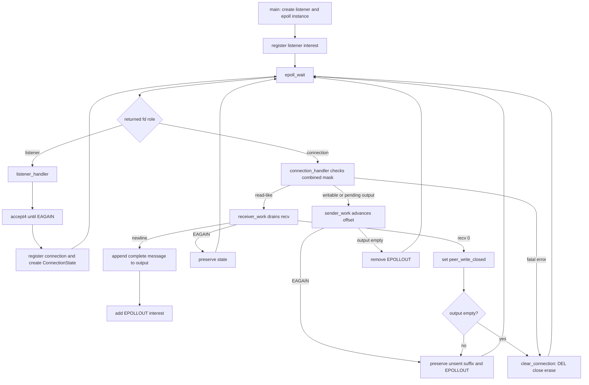
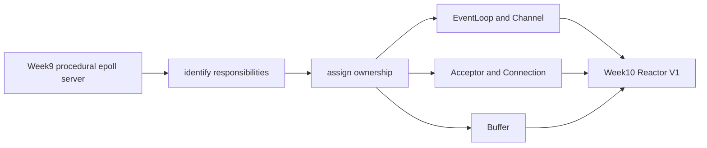

# Week9 Day7：用证据收口 Epoll Echo Server

> 日期：2026-09-07
> 主线：non-blocking I/O + epoll -> integrated evidence -> Week10 Reactor V1
> 今日定位：Week9 exit review，不引入新的 I/O mechanism
> 今日主要产出：`day7_note.md` 中的一张运行流程图、一份 evidence ledger，以及一次 repeated-connect fd observation
> 今日不重写：`epoll_echo_server.cpp`、已有 clients、Day1~Day6 已经通过的同义测试

---

# Part 1：前情提要与必要术语

## 1. 今天接在 Day6 的哪里

Week9 前六天已经沿着同一条主线推进：

```text
Day1：non-blocking recv 的 EAGAIN、bytes、EOF
-> Day2：epoll registration、wait 与 consume
-> Day3：一个 event loop 服务 listener 和多个 connections
-> Day4：TCP byte stream 上保存 per-connection parsing state
-> Day5：partial write、output offset 与 dynamic EPOLLOUT
-> Day6：LT/ET、half-close、combined event 与 cleanup lifetime
```

Day6 最终已经取得这些真实结果：

```text
lt_et_probe：LT/ET partial-consume 现象与预测一致
normal echo：CLIENT PASS
ET write cycle：两轮 4 MiB exact PASS
large half-close：4,194,305 / 4,194,305 bytes exact PASS
large half-close 后 normal client：CLIENT PASS
C++17 + Wall/Wextra：零 warning
```

所以 Day7 不再问“怎样实现 `recv` loop”或“怎样保存 output offset”。今天的问题变成：

> 这些结果分别证明了什么？Week9 的关键 claim 是否都有与它匹配的 evidence？

## 2. 今天为什么不能只说“代码能跑”

一个 client 成功 echo，只能证明一条很窄的路径：

```text
这个 client
在这次 timing 下
发送这组 bytes
得到了正确 response
```

它不能自动推出：

```text
慢 client 不会挡住快 client
partial send 后 suffix 不会丢
half-close 后 pending output 不会丢
连续连接和断开不会泄漏 fd
ET 下 handler 一定 drain 到 EAGAIN
```

系统代码的结论必须和证据一一对应。今天不是增加证据数量，而是检查每条关键结论有没有合适的观察方式。

## 3. 今日术语

### 3.1 claim

`claim`：主张、待证明的结论。

例如：

```text
slow reader does not block fast client
```

这是一条 claim，不是证据。它需要一个 slow client 与 fast client 真正发生时间重叠，并观察 fast client 在 slow client 尚未结束时完成。

### 3.2 evidence

`evidence`：证据。

今天主要使用三类 evidence：

```text
source inspection：从控制流和状态字段检查设计
program oracle：client 自动比较 expected/actual，并用 exit code 表示结果
program oracle 就是：程序里用来自动判断“结果对不对”的规则。
system observation：strace、ss、/proc 等工具观察 kernel-facing behavior
```

三类证据回答的问题不同，不要把其中一种冒充全部。

### 3.3 oracle

`oracle`：判定结果正确与否的规则或机制。

例如：

```python
if response != payload:
    raise RuntimeError("echo payload mismatch")
```

这里的 exact byte equality 就是 oracle。只打印 `server still alive` 不能证明 payload 没丢、没重、没乱序。

### 3.4 evidence ledger

`ledger`：台账、账本。

`evidence ledger` 不是新的测试框架，而是一张很短的对应表：

```text
claim
-> 使用哪份已有程序或观察
-> 实际结果
-> 它能证明什么
-> 它不能证明什么
```

它的价值是防止出现两种情况：

```text
做了很多测试，却说不清每个测试的作用
写了很强的结论，却没有真正对应的观察
```

### 3.5 baseline

`baseline`：基线、对照起点。

例如观察 fd 数量时，不能看到 server 有 6 个 fd 就说“泄漏了”。server 本来就会持有 stdin/stdout/stderr、listener、epoll instance 等 fd。

正确比较是：

```text
clients 开始前的 stable fd count
vs
一批 clients 全部退出、server 完成 cleanup 后的 stable fd count
```

### 3.6 leak

`leak`：资源泄漏。

fd leak 指程序已经不再需要某个 fd，却一直没有 `close`，使进程 fd table 中的 entry 持续累积。

今天的 observation 能排除的是：

```text
当前 repeated-connect 场景下存在明显、持续增长的 fd 数量
```

它不能证明所有 error path 永远不存在任何 leak。

### 3.7 known limitation

`known limitation`：已知限制。

它不是“项目失败”，而是明确说明当前版本没有承诺什么。例如 Week9 允许：

```text
过程式 event loop
maxevents == 1
没有正式 EventLoop/Channel classes
没有 multi-threaded Reactor
没有生产级 fairness 与 backpressure
```

明确限制比把学习版本包装成生产级 server 更可信。

## 4. 四个对象最后再分一次

Day7 汇总证据时，仍然不要把这四个对象混在一起：

```text
fd integer
-> 当前进程 fd table 的一个索引

kernel socket object
-> TCP receive/send state 与 buffers 所在的 kernel object

epoll registration
-> epoll instance 对某个 fd/open file description 的 interest 记录

ConnectionState
-> application 保存的 input/output/offset/peer_write_closed 等状态
```

正常 cleanup 要让四层关系一起结束：

```text
停止继续 dispatch 旧 connection
-> EPOLL_CTL_DEL registration
-> close fd
-> erase ConnectionState / active-fd record
```

这也是 Week10 要重新整理 ownership 的直接原因。

## 5. 前六天已经拥有的 evidence inventory

以下是已经验收过的事实，不要求今天重新运行：

| Claim | 已有 evidence | 已观察结果 |
|---|---|---|
| empty non-blocking stream 不应阻塞 | Day1 `nonblocking_stream_probe.cpp` | empty/open -> EAGAIN；payload -> bytes；drain 后 -> EAGAIN；peer close -> EOF |
| epoll wait 与实际 consume 是两步 | Day2 `epoll_stream_probe.cpp` + strace | wait `0 -> 1 -> 1`，drain 到 EAGAIN 后回到 0 |
| idle connection 不挡住 active connection | Day3 A-idle/B-active/A-later/C-new | active clients 能推进，idle client 不占住 event-loop execution flow |
| message boundary 不等于一次 recv | Day4 `connection_state_demo.cpp` | fragmented/coalesced chunks 最终形成三条 exact newline messages |
| partial write 会保存 suffix | Day5 slow-reader evidence | 首次发送 2,588,672 bytes，剩余 1,605,633 bytes 后续由 EPOLLOUT 完成 |
| slow client 不挡住 fast client | Day5 slow + normal concurrent run | slow client 尚未结束时 normal client 已 `CLIENT PASS` |
| LT/ET partial consume 行为不同 | Day6 `lt_et_probe.cpp` | LT WAIT2 ready；ET WAIT2 timeout；新写入后两者 WAIT3 ready |
| ET write interest 能 remove/re-add | Day6 two-round write cycle | 两轮 4 MiB exact PASS，output drained 后移除、产生新 output 后重新加入 EPOLLOUT |
| half-close 不应丢 pending output | Day6 large half-close | `4,194,305 / 4,194,305` exact PASS，之后 normal client 继续 PASS |

今天先把这些当作 evidence inventory，不要把表格直接当成 Week9 结论。Round1 要由你自己判断它们分别能支撑哪些 claim，以及还有没有关键 claim 没有直接证据。

---

# Part 2：教程主体

# 教程开始：怎样从“跑过很多程序”得到一份可信的 Week9 结论

# Round 1：先独立做 evidence audit

## 6. Round1 是干什么的

今天不创建新的 server，也不改 `epoll_echo_server.cpp`。

Round1 只创建或补充：

```text
week9/day7/day7_note.md
```

你需要做两个小产出：

```text
1. 用真实函数名画出 canonical server 的完整运行链
2. 审计 Week9 最终 claims 与已有 evidence，找出仍缺直接证据的一项
```

这不是让你抄六道问答。目标是确认你已经能从“代码结构”切换到“系统 claim 与证据”的视角。

## 7. 产出一：画真实运行链

只使用当前 source 里真实存在的函数名，例如：

```text
main
init
register_to_epoll
epoll_wait
listener_handler
connection_handler
receiver_work
sender_work
update_epoll_status
clear_connection
```

在 `day7_note.md` 写一张 Mermaid `flowchart`。要求覆盖：

```text
listener ready
connection read-like event
newline 形成 output
EPOLLOUT 加入/移除
recv == 0
pending output after half-close
finished/fatal cleanup
回到 epoll_wait
```

不要照抄通用 Reactor 图；图中的每个节点都应能指向当前 `epoll_echo_server.cpp` 的具体 function 或 state。

## 8. 产出二：做一张最小 evidence ledger

在 note 中填写下面六行，不增加更多 checklist：

含义是：

- `Claim`：你想证明的结论。
- `Evidence artifact`：哪一个具体程序、client、trace 或命令提供证据。不能写“我测试过”。
- `它实际观察了什么`：真实发生了什么、输出了什么。
- `还不能推出什么`：这份证据的边界，防止结论说过头。

| Claim | Evidence artifact | 它实际观察了什么 | 还不能推出什么 |
|---|---|---|---|
| idle client 不阻塞 active client |  |  |  |
| fragmented/coalesced input 不破坏 message boundary |  |  |  |
| partial write 后 response 不丢失/重复 |  |  |  |
| slow reader 不阻塞 fast client |  |  |  |
| ET output drained 后可以 remove/re-add EPOLLOUT |  |  |  |
| half-close 后 pending output 仍完整发送 |  |  |  |

填写时只需一句话，不写长篇解释。

然后对照 Week9 最终标准：

```text
multi-client
slow reader
fragmented message
large response / pending output
peer close
repeated connect/disconnect 后无明显 fd growth
zero warning
```

写下你认为仍缺 direct evidence 的一项，并说明为什么前六天的其他测试不能自动替代它。


## 9. Round1 只做一次 build sanity check

```bash
cd ~/code/system-learning/cpp/week9

g++ -std=c++17 -Wall -Wextra -g \
    epoll_echo_server.cpp \
    -o epoll_echo_server
```

今天只确认最终 canonical source 仍然零 warning，不重复运行 R1 probe、slow client 和 4 MiB write cycle。

`sanity check`：快速确认当前版本没有明显破坏已有基础，不等于完整 regression suite。

## 10. Round1 阅读闸门

完成下面三件事后再继续：

```text
[ ] 用当前函数名画出完整 event-loop/state/cleanup flowchart
[ ] 填完六行最小 evidence ledger
[ ] 找出一个仍缺 direct evidence 的 Week9 claim
```

完成后先让我检阅 R1。我会基于你的流程图和判断，定向润色 Round2/Round3，同时保留你已经写入 `day7.md` 与 note 的内容。

---

# Round 2：把 claim、oracle 与 system observation 对齐

## 11. 当前 server 的完整主线

先对照你自己的图，再看下面这张 reference flow。它不是要求你重画一次，而是帮助检查有没有漏掉状态变化：



这张图最重要的不是框的数量，而是三个可恢复状态：

```text
recv -> EAGAIN：input/state 还活着，回 epoll_wait
send -> EAGAIN：output suffix/offset 还活着，回 epoll_wait
recv -> 0 且 output 非空：peer_write_closed，但写方向仍要推进
```

### 11.1 根据你的 R1 流程图补三条边

你的手绘图和 Mermaid 已经把 `main`、listener path、connection path 与 `receiver_work` 主干串起来。下面只修三处会改变程序语义的省略，不要求重画全部图片。

第一，进入 event loop 前还有两步：

```text
init listener
-> epoll_create1 创建 epoll instance
-> register_to_epoll 注册 listener interest
-> event loop / epoll_wait
```

第二，`recv > 0` 后不是无条件加入 `EPOLLOUT`：

```text
append_char(byte)
-> 只有遇到 newline、形成完整 output 时返回 true
-> 此时才 update_epoll_status(..., EPOLLOUT, ADD_FLAG)
```

如果只有 incomplete suffix 留在 input 中，当前还没有 response，因此不需要监听 writable。

第三，combined event 的 cleanup 分支要明确真假出口：

```text
EPOLLERR
-> getsockopt(SO_ERROR)
-> clear_connection
-> return，不再处理同一 mask 的其他 bits

peer_write_closed && output.empty()
-> clear_connection

peer_write_closed && output 仍有 pending
-> 不 close，保留 EPOLLOUT 等未来 writable event
```

你最终的 C++ source 已经按第三条正确工作；这里修的是流程图表达，不是让你再次修改 server。

## 12. 一条 evidence 为什么只能支撑有限 claim

你不需要重新记住 Day1~Day4 每份 probe 的实现细节。它们已经完成并验收，可以作为 archived evidence；今天只需要理解“某条 claim 为什么要由某种 observation 支撑”。下面的 ledger 是现成索引，不要求你再凭记忆抄写一份。

以 Day5 slow-reader 为例：

```text
server 第一次 send 2,588,672 bytes
-> 遇到 EAGAIN，保留 remaining 1,605,633 bytes
-> fast client 在这段时间完成 exact echo
-> future EPOLLOUT 发送剩余 suffix
-> slow client 最终 exact match
```

这组 evidence 同时支撑：

```text
partial write progression 正确
unsent suffix 没丢、没重
dynamic EPOLLOUT 能恢复 pending output
一个 slow reader 没有阻塞另一个 fast client
```

但它不能单独支撑：

```text
ET read-side partial consume 的通知差异
half-close 后仍能 flush output
连续 100 次连接后 fd 不增长
```

原因不是它“不够大”，而是实验中没有建立这些状态。

## 13. 前六天没有直接覆盖的出口证据

对照 Week9 规划，前六天唯一值得今天新补的 observation 是：

```text
repeated connect/disconnect 后，server process 的 fd count 是否回到 baseline
```

这不是因为当前 source 已经被怀疑必然泄漏，而是 Week9 exit 需要把：

```text
EPOLL_CTL_DEL
close(connection_fd)
erase application state
```

与真实 process fd table 对照一次。

## 14. `/proc/<pid>/fd` 是什么

`proc` 来自 process。Linux 的 `/proc` 是一个由 kernel 提供的 pseudo-filesystem，也就是“伪文件系统”：里面的文件不是普通磁盘文件，而是 kernel 暴露的运行时信息视图。

对一个 PID，例如 `1234`：

```text
/proc/1234/fd/
```

表示该进程当前打开的 file descriptors。目录项通常是 symbolic links：

```text
0 -> /dev/pts/1
1 -> /tmp/week9_server.log
2 -> /tmp/week9_server.log
3 -> socket:[...]
4 -> anon_inode:[eventpoll]
```

这里：

```text
socket:[...]           -> 某个 socket fd
anon_inode:[eventpoll] -> epoll instance 对应的 fd
```

`/proc/<pid>/fd` 能观察 process fd table 中还剩多少 entry；它不直接告诉你 user-space `std::map` 是否有 ghost state，所以它仍要和 source inspection 配合。

## 15. 唯一的新观察：repeated connections 前后 fd count

### 15.1 启动并保存 PID

```bash
cd ~/code/system-learning/cpp/week9

./epoll_echo_server et > /tmp/week9_server.log 2>&1 &
server_pid=$!

echo "server pid=$server_pid"
```

这里：

```text
&   ：让命令在当前 shell 的后台运行
$!  ：最近一个后台 process 的 PID
```

把 PID 保存在 `server_pid`，比重新猜测进程名更可靠。

---

这条命令的意思是：以 `ET` 模式在后台启动 server，并把它的输出写进日志文件。

```bash
./epoll_echo_server et > /tmp/week9_server.log 2>&1 &
```

拆开看：

```text
./epoll_echo_server et
```

运行当前目录下的 server，命令行参数是 `et`，选择 edge-triggered 模式。

```text
> /tmp/week9_server.log
```

把原本要打印到终端的标准输出 `stdout` 重定向到 `/tmp/week9_server.log`。

```text
2>&1
```

把标准错误 `stderr` 也重定向到和标准输出相同的位置，也就是同一份 log。这里：

```text
1 = stdout
2 = stderr
```

```text
&
```

让整个 server 在后台运行。这样终端立刻返回，你可以继续执行 `echo_client.py`、查看 `/proc/<pid>/fd` 等命令。

运行后通常紧接着写：

```bash
server_pid=$!
```

`$!` 就是刚刚这个后台 server 的 PID。

### 15.2 记录 baseline

```bash
find "/proc/$server_pid/fd" -maxdepth 1 -type l

baseline=$(find "/proc/$server_pid/fd" -maxdepth 1 -type l | wc -l)
echo "baseline fd count=$baseline"
```

参数含义：

```text
find PATH       ：从 PATH 枚举目录项
-maxdepth 1     ：把搜索范围明确限制在 `/proc/<pid>/fd` 这一层。这里的 fd entries 是 symbolic links；`find` 默认不会跟随它们进入目标路径，因此该参数主要用于收紧并说明本次统计边界
-type l         ：只选择 symbolic link；/proc/<pid>/fd 的 fd entries 是 symlinks
wc -l           ：统计输出行数
$(command)      ：执行 command，并把 stdout 结果赋给 shell variable
```

不要预设 baseline 必须等于某个固定数字。重定向 log、terminal 和运行环境都会影响它。

---

#### -maxdepth 1

对 `/proc/<pid>/fd` 这个特定目录来说，`-maxdepth 1` 实际上几乎没有额外效果。

```bash
find "/proc/$server_pid/fd" -maxdepth 1 -type l
```

目录层级是：

```text
/proc/1234/fd          depth 0，是目录本身
/proc/1234/fd/0        depth 1，是一个符号链接
/proc/1234/fd/1        depth 1，是一个符号链接
/proc/1234/fd/3        depth 1，是一个符号链接
```

默认的 `find` 不会跟随这些符号链接进入它们指向的地方，所以即使不写 `-maxdepth 1`，它也不会顺着：

```text
/proc/1234/fd/0 -> /dev/pts/...
/proc/1234/fd/3 -> socket:[...]
```

继续搜下去。

因此这里的 `-maxdepth 1` 主要是：

```text
表达意图：我只关心 fd 目录这一层的条目
防御性限制：以后目录结构或命令选项变化时，也不意外向下遍历
```

但当前命令确实可以简化成：

```bash
find "/proc/$server_pid/fd" -type l | wc -l
```

结果通常一样。这里真正决定“只统计 fd entry”的关键是 `-type l`；`-maxdepth 1` 更多是写得更明确，不是这次统计必须依赖的条件。

### 15.3 顺序完成 100 次已有 client

```bash
for i in $(seq 1 100); do
    python3 echo_client.py > /dev/null || {
        echo "client failed at iteration $i"
        break
    }
done
```

这里复用已经有 exact oracle 的 `echo_client.py`。循环只是重复连接/断开，不要求你再写新的 client source。

### 15.4 等 server 处理完最后的 close，再比较

```bash
sleep 1

after=$(find "/proc/$server_pid/fd" -maxdepth 1 -type l | wc -l)
echo "after fd count=$after"

find "/proc/$server_pid/fd" -maxdepth 1 -type l
```

这里的 `sleep 1` 只是让异步 event loop 有时间处理最后一个 peer EOF，再取稳定 snapshot；它不是 server 正确性的同步机制。

结果判断：

```text
after 回到 baseline
-> 当前 repeated-connect 场景没有观察到 connection fd 持续累积

after 比 baseline 多，并且稍后重复观察仍不下降
-> 需要结合 /proc symlink 与 server log 查哪类 fd 没有 close
```

不要只写“差不多”。在 note 中保留两个数字：

```text
baseline = ?
after 100 clients = ?
```

### 15.5 结束本次观察

```bash
kill "$server_pid"
wait "$server_pid" 2>/dev/null
```

`kill` 默认发送 `SIGTERM`。`wait` 让当前 shell 回收这个 background child 的退出状态。

当前 server 还没有 graceful shutdown mechanism，所以这个 `SIGTERM` 主要用于结束学习实验；它不是生产级 shutdown evidence。

---

这两行是实验结束后，停止后台 server，并把它从当前 shell 的后台任务列表里收干净。

```bash
kill "$server_pid"
```

向这个 PID 发送默认信号 `SIGTERM`，请求 server 退出。

```bash
wait "$server_pid"
```

等待这个后台 server 真正退出，并让当前 shell 回收它的退出状态。否则 shell 会留下一个“已经结束、但还没被 wait 回收”的后台任务记录。

```bash
2>/dev/null
```

只重定向 `wait` 自己可能打印的标准错误。

例如 server 已经自行退出了，或者 PID 已不再是当前 shell 管理的后台 child，`wait` 可能报错：

```text
wait: pid ... is not a child of this shell
```

这条报错对“结束实验”没有额外价值，所以把它丢到 `/dev/null`。`/dev/null` 可以理解为 Linux 的黑洞设备：写进去的数据直接被丢弃。

注意它不是把 server 的错误日志丢掉。server 的 stdout/stderr 早已在启动时写进：

```text
/tmp/week9_server.log
```

这里丢掉的只是 `wait` 命令本身可能产生的提示。

## 16. `ss` 与 `strace` 怎样放进 ledger

今天不要求重跑整页 trace。

### `ss`

`ss` 来自 socket statistics，用于观察系统中的 socket state。

```bash
ss -tanp | grep ':9091'
```

```text
-t：TCP sockets
-a：包含 listening 与 non-listening sockets
-n：直接显示 numeric address/port
-p：尽量显示关联 process
```

它适合证明“观察时有哪些 TCP states/connections”，不证明 application payload exact。

### `strace`

`strace` 来自 system call trace，用于观察 process 实际进入了哪些 system calls，以及返回值是什么。

Day2 已经有 `epoll_wait -> recv -> EAGAIN` 的真实 trace，可以直接复用。如果你没有保存任何 canonical server trace，只补一次最短观察：

```bash
strace -ff \
  -o /tmp/week9_epoll.trace \
  -e trace=epoll_wait,epoll_ctl,accept4,recvfrom,sendto,close \
  ./epoll_echo_server et
```

另一个 terminal 只运行一次 `echo_client.py`，然后结束 server。note 最多摘 8~15 行，能串出：

```text
epoll_wait
-> accept4
-> epoll_ctl ADD
-> recvfrom
-> epoll_ctl MOD
-> sendto
-> epoll_ctl DEL
-> close
```

没有保存 trace 也不要求为了 Day7 重做 Day2~Day6；source、client oracle 与已有动态输出仍是主要证据。

## 17. Round2 自检

读完后能说清即可：

```text
为什么 CLIENT PASS 不能证明无 fd leak
为什么 /proc fd count 不能证明 payload exact
为什么 slow + fast 必须真正 overlap 才能支撑 non-blocking claim
为什么 half-close 的 oracle 必须在 shutdown(SHUT_WR) 后继续 exact recv
为什么 evidence ledger 要同时写“能证明”和“不能证明”
```

---

# Round 3：完成 Week9 evidence ledger，并把真实代码交给 Week10

## 18. Week9 最终 evidence ledger

这张表作为 Week9 的 evidence archive 直接保留在教程里。你不需要重写前九行，只把 Day7 的两个 fd count 填进最后缺数字的那一行：

| Week9 claim | Evidence | Result | Evidence boundary |
|---|---|---|---|
| non-blocking 能区分 EAGAIN、bytes、EOF | Day1 stream probe | PASS | 不涉及 epoll/TCP listener |
| epoll readiness 与 consume 分离 | Day2 probe + strace | `0 -> 1 -> 1 -> drain -> 0` | 受控 local stream 场景 |
| idle client 不挡住 active client | Day3 A/B/C + burst clients | PASS | 证明功能推进，不是吞吐 benchmark |
| fragmented/coalesced input 正确成帧 | Day4 parser + Day5 client | exact PASS | 仅 newline protocol，无 frame-size limit |
| partial write suffix 能恢复 | Day5 4 MiB slow reader | exact PASS | 当前单 event-loop implementation |
| slow reader 不挡住 fast client | Day5 concurrent slow/normal | fast client 在 slow pending 时 PASS | 不等于 fairness guarantee |
| LT/ET read-side 差异 | Day6 partial-consume probe | prediction 与 output 一致 | 不推广成所有 kernel timing 的 event-count 保证 |
| ET write-side remove/re-add | Day6 two-round 4 MiB cycle | exact PASS | 不等于生产级 backpressure |
| half-close 后 pending output 完整 | Day6 4 MiB + shutdown write | `4,194,305 / 4,194,305` | 当前 echo policy |
| repeated connections 后无明显 fd growth | Day7 `/proc/<pid>/fd` | baseline `?` -> after `?` | 只覆盖本次正常连接/断开路径 |
| final source 可正常构建 | Day7 g++ | zero warning | 不替代 runtime evidence |

## 19. 代表性命令清单

Week9 最终只保留下面这些入口，不再收集十份同义命令：

```bash
# build
g++ -std=c++17 -Wall -Wextra -g \
    epoll_echo_server.cpp \
    -o epoll_echo_server

# run modes
./epoll_echo_server lt
./epoll_echo_server et

# representative exact clients
python3 echo_client.py
python3 slow_echo_client.py
python3 et_write_cycle_client.py

# process fd observation
find "/proc/$server_pid/fd" -maxdepth 1 -type l
```

这里没有把 Day1~Day6 的每个 probe 都重新执行。它们保留在学习目录中，ledger 指向它们即可。

## 20. 当前 canonical server 的已知限制

只记录最能解释 Week10 动机的四项：

```text
1. epfd、active-fd set、ConnectionState map 与 close responsibility 分散
2. combined event dispatch 中 read/write/close control flow 仍然较长
3. registration update 与 connection lifetime 还没有统一 owner object
4. 当前只有 newline echo policy，没有 frame-size limit、graceful shutdown 与生产级 backpressure
```

另外两个当前实现细节值得保留在代码 review 记录中，但不阻塞 Week9：

```text
connection ADD failure 时，helper 不应擅自关闭共享 epfd
RDHUP/HUP/IN 可以归一成一次 read-like action，减少重复 handler call
```

不要为了清理这两项而在 Day7 临时发明完整 class hierarchy。Week10 会以 ownership 为中心处理。

## 21. Week10 不是重写，而是重新分配职责

当前过程式代码已经暴露出自然边界：

| Week9 真实职责 | Week10 可能的 owner |
|---|---|
| 创建 epoll、wait、dispatch | `EventLoop` |
| 保存 fd、interest mask、回调关系 | `Channel` |
| listener 的 accept drain | `Acceptor` |
| socket fd、input/output、offset、half-close state | `Connection` |
| input/output bytes 的追加与消费 | `Buffer` |

这张表不是 Week10 的最终 API 答案。它只表达：

```text
抽象来自已经存在并验证过的 responsibility
而不是先写五个 class，再猜它们应该干什么
```

完整迁移链：



---

# Part 3：收尾、验收与 Week10 接口

## 22. Day7 通过标准

今天不按“新代码行数”验收。满足以下六项即可：

```text
1. final epoll_echo_server.cpp 使用 C++17 + Wall/Wextra 零 warning
2. 用当前真实函数名画出 event -> handler -> state -> cleanup 流程图
3. 能根据 R2 指出流程图中三条需要补准的语义边，不要求重画全部图片
4. repeated-connect observation 记录 baseline 与 after 两个 fd count
5. 旧 evidence ledger 直接复用，不要求回忆并誊写 Day1~Day4
6. 能从当前 ownership/control-flow 问题自然说明 Week10 为什么需要 Reactor objects
```

不要求：

```text
重写任何 client/server
补 GoogleTest / CTest
重新运行 Day1~Day6 全部 probes
写 README、简历描述或 interview 文档
给出吞吐 QPS
修完所有 non-core error paths
提前实现 EventLoop/Channel/Acceptor/Connection
```

## 23. 五个收口问题

可以口述、画图或直接指向 evidence，不机械誊写长答案：

1. non-blocking 解决了什么，epoll 又解决了什么？
2. readiness event 为什么不是“这次 recv/send 一定完成”的承诺？
3. partial read、partial write、EAGAIN 与 EOF 分别怎样改变 `ConnectionState`？
4. 哪条 evidence 证明 slow reader 没有挡住 fast client？它为什么必须建立 overlap？
5. 为什么 Week10 的 Reactor 应从当前职责和 ownership 中提炼，而不是从 class 名字开始？

## 24. `day7_note.md` 建议结构

```markdown
# R1

## Actual server flowchart

# R2

## Three corrected edges

## Repeated-connect fd observation

baseline =
after 100 clients =

# R3

## Week9 conclusion

## Known limitations carried into Week10
```

你的四张手绘图和四张 Mermaid 已经是 R1 的主要回答。旧 evidence ledger 由教程保存，不要求补抄；流程图修正、两个 fd count 和 Week10 handoff 就是剩余内容，也不要求再复制五个收口问题。

## 25. Week9 的最终一句话

```text
non-blocking 让一次暂时不能推进的 I/O 返回；
epoll 让一个 event loop 等待可能推进的 fd；
真正的正确性来自 drain loop、per-connection state、pending output、interest update 与 lifetime cleanup；
可信结论则来自与每条 claim 匹配的 exact oracle 和 system evidence。
```

## 26. 今天停在哪里

Day7 结束后，Week9 应留下：

```text
一份持续演进的 canonical epoll_echo_server.cpp
一组已验证而不重复堆叠的 probes/clients
一张真实 event-loop flowchart
一份有边界的 evidence ledger
一次 repeated-connect fd observation
一组明确交给 Week10 的 ownership/control-flow 问题
```

下一步进入 Week10 Reactor V1。Week10 的第一个问题不是“Reactor 这个词怎么背”，而是：

> 当前 `epfd`、fd registration、callbacks、ConnectionState 和 cleanup，分别应该由谁拥有？

## 27. 技术核验入口

本日不要求通读，只在需要确认命令或 kernel interface 时查：

```bash
man 7 epoll
man 5 proc_pid_fd
man 2 close
man 8 ss
man 1 strace
```

阅读目标：

```text
epoll：interest/ready 与 LT/ET 基本语义
proc_pid_fd：/proc/<pid>/fd 暴露什么
close：关闭 fd reference 的语义
ss：socket state observation
strace：system call observation
```
