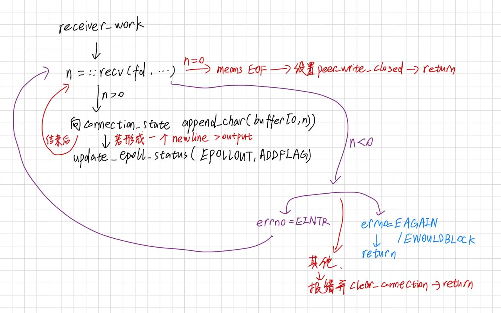
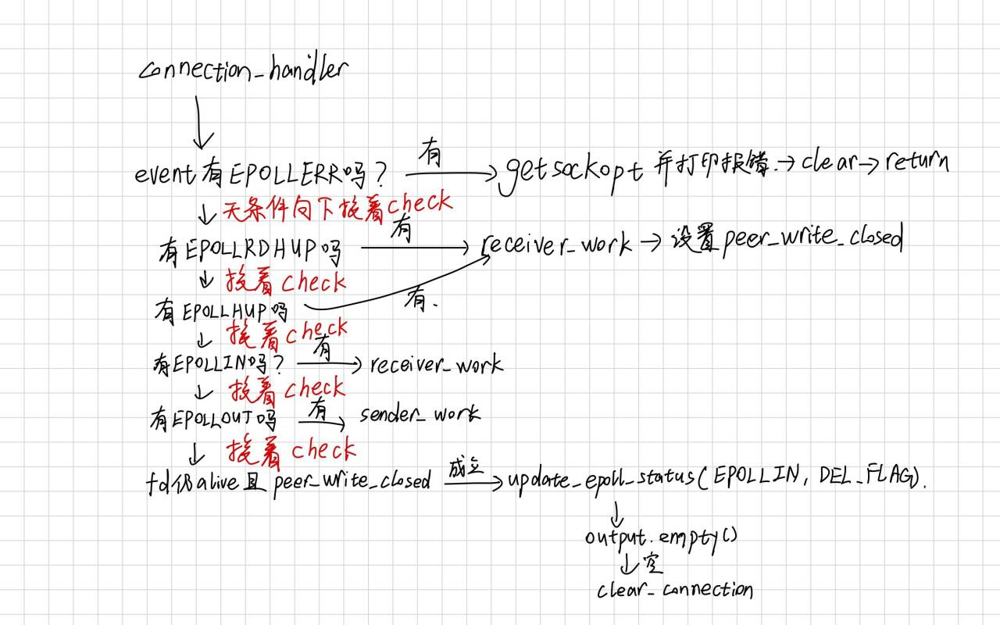
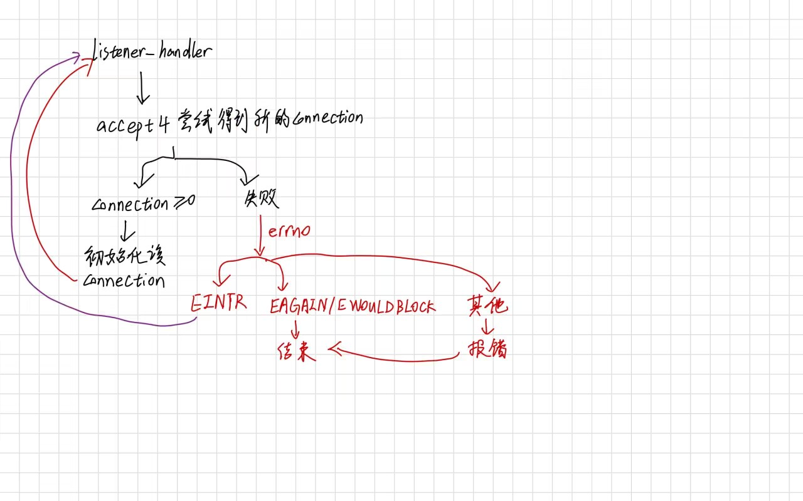
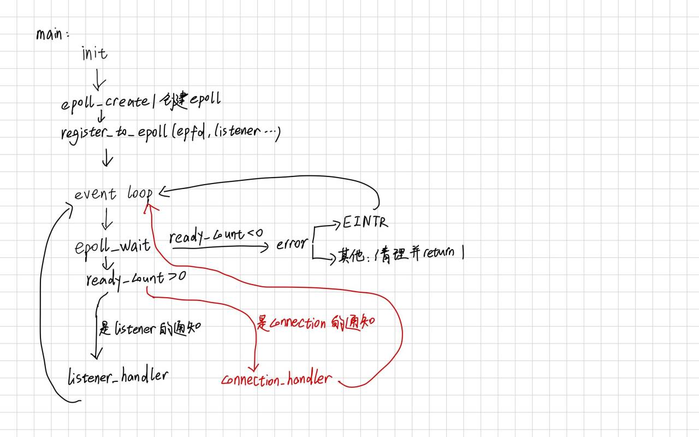
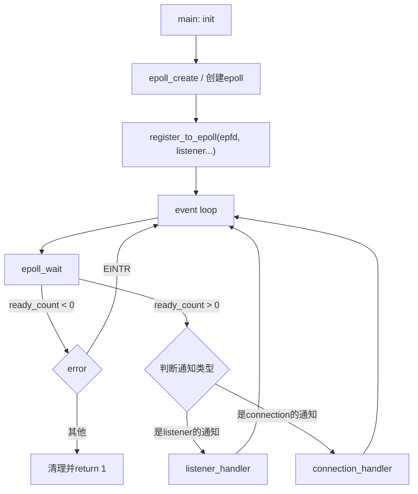
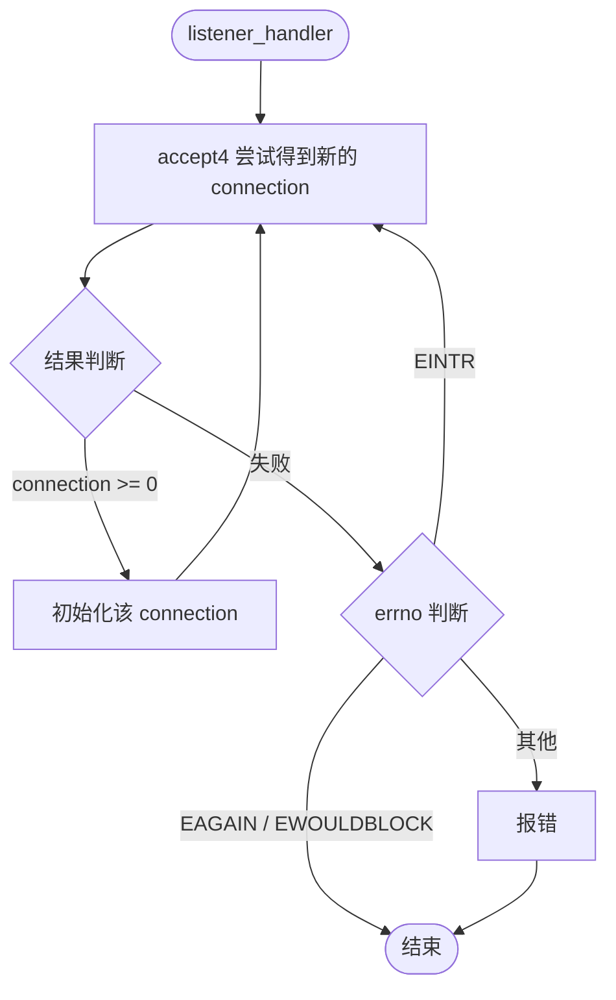
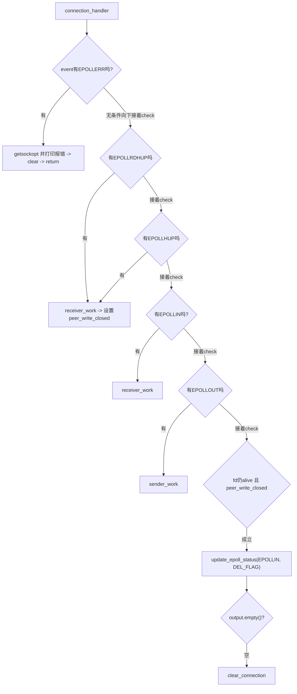
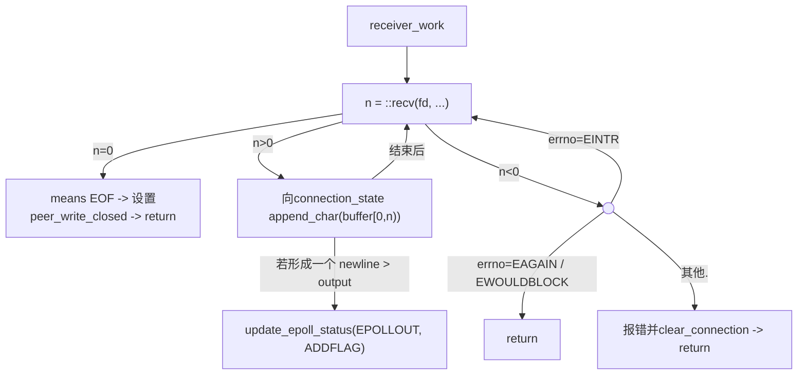

# R1

## 手绘

### receiver_work



### connection_handler



### listener_handler



### main



## flowchart

### main




### listener_handler



### connection_handler



### receiver_work




# R2

```text
baseline = 5
after 100 clients = 5
```

