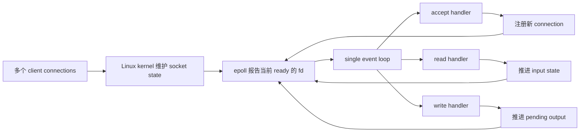

# Week9 总规划：从 blocking socket 到 Epoll Echo Server

> 本周定位：系统主线 Milestone A。
>
> 当前进度：Week1 ~ Week8 已完成；已经具备 C++17、RAII、Linux fd、process/thread、TCP socket、BlockingQueue、ThreadPool 与 AsyncLogger 基础。
>
> 本周核心问题：为什么 blocking socket 不适合让一个 execution flow 同时服务许多连接，Linux 的 readiness notification 又到底承诺了什么？
>
> 本周最终产出：一个不用“每连接一个 thread”的 **Epoll Echo Server**，以及能复现其正确性、资源生命周期和关键系统调用行为的实验记录。

---

# 1. Week9 在总路线中的位置

当前主线：

```text
C++ 基础与资源管理
-> Linux / OS / fd / system call
-> TCP socket programming
-> concurrency components
-> Week9 non-blocking I/O + epoll
-> Week10 Reactor V1
-> Week11 HTTP Server
-> Week12~16 Mini Redis
```

Week6 已经让你从 application 视角使用过：

```text
socket -> bind -> listen -> accept
connect -> read/write -> shutdown/close
TCP byte stream、三次握手、关闭状态
```

Week7、Week8 又补上了：

```text
mutex / condition_variable
BlockingQueue
ThreadPool
AsyncLogger
bounded queue 与 backpressure
lifecycle、shutdown、join、测试和 benchmark
```

Week9 不继续堆线程，而是换一个角度：

```text
一个 execution flow
怎样只处理“当前有机会推进”的 fd
并在一次系统调用不能完成全部工作时保存连接状态
```

这一步是从“会写 TCP client/server”进入“会写 event-driven server”的关键转换。

---

# 2. 本周最终要建立的模型

本周结束时，你应该能把服务器理解为下面这条主线：



这里有四个必须分开的对象：

```text
fd：当前进程访问 kernel socket object 的整数入口
socket state：kernel 中的 TCP、接收队列、发送队列等状态
epoll interest：程序告诉 epoll 自己关心哪些 fd/event
connection state：程序自己保存的 input/output buffer 与协议进度
```

`epoll` 不替你：

```text
accept connection
读取全部数据
保存半包
处理 partial write
组织 application protocol
管理 Connection object lifetime
```

它只提供 readiness notification，也就是“当前执行某类 I/O 有机会取得进展”的通知。

---

# 3. 本周目标

## 3.1 机制目标

理解并能解释：

```text
blocking read 为什么会让当前 execution flow 睡眠
O_NONBLOCK 改变的是哪一次 system call 的等待行为
EAGAIN / EWOULDBLOCK 与 EOF 的区别
为什么 TCP read/write 可能只完成一部分
readiness 为什么不等于“一次调用完成全部业务”
epoll interest list 与 ready list 的第一层关系
LT 与 ET 的通知方式和 drain requirement
为什么 listening socket 也要循环 accept 到 EAGAIN
为什么 input/output state 必须跨 event 保存
为什么不能永久监听每个 connection 的 EPOLLOUT
fd close、epoll registration 与 user-space state 的生命周期关系
```

## 3.2 编码目标

逐步完成：

```text
nonblocking_stream_probe.cpp
epoll_stream_probe.cpp
epoll_read_server.cpp
connection_state_demo.cpp
epoll_echo_server.cpp
multi-client / slow-client verification
```

这些名字表示学习阶段，不要求复制多份相同 server。`epoll_echo_server.cpp` 出现后应作为 canonical source 持续演进。

## 3.3 工程目标

最终证据至少覆盖：

```text
多个 clients 同时连接和收发
一个慢 client 不阻塞其他 clients
拆分发送的一条 message 能被正确处理
partial write 不会导致 response 丢失或重复
peer close 后 fd 与 connection state 被清理
pending output 为空时不继续监听 EPOLLOUT
连续连接/断开后 fd 数量没有明显增长
g++ -std=c++17 -Wall -Wextra -g 零 warning
ss / strace 能解释关键行为
```

---

# 4. 本周范围与停止边界

## 4.1 本周必须完成

```text
Linux non-blocking fd
EAGAIN / EWOULDBLOCK / EINTR / EOF
epoll_create1 / epoll_ctl / epoll_wait
EPOLLIN / EPOLLOUT
LT / ET 第一层
accept/read/write drain loop
per-connection input/output state
dynamic writable interest
peer close 与 fd cleanup
Epoll Echo Server V1
```

## 4.2 本周只到第一层

```text
epoll kernel implementation
TCP congestion control 内核细节
socket send/receive buffer 调参
fairness 与 starvation
load test 数字优化
stale event 的系统化 object-lifetime abstraction
```

这些内容只在真实现象影响本周正确性时解释，不扩成额外课程。

## 4.3 本周明确不做

```text
select / poll 的完整实现练习
完整 Reactor class hierarchy
Channel / EventLoop / Acceptor 正式抽象
multi-threaded Reactor
one loop per thread
io_uring
lock-free connection table
HTTP parser
TLS
Mini Redis command layer
```

Week9 允许过程式 event loop。Week10 才把已经跑通的机制拆成 ownership 清楚的 Reactor components。

---

# 5. 七天总览

| Day | 核心问题 | 当日主要产出 | 为下一天留下什么 |
|---|---|---|---|
| Day1 | blocking 与 non-blocking 到底差在哪里？ | `nonblocking_stream_probe.cpp` | 看懂 `EAGAIN`、EOF 和 drain boundary |
| Day2 | epoll 报告的 readiness 到底是什么？ | `epoll_stream_probe.cpp` | 掌握 create/register/wait/consume/rearm mental model |
| Day3 | 怎样用一个 event loop 接收并读取多个 TCP connections？ | `epoll_read_server.cpp` | 跑通 non-blocking accept/read 主循环 |
| Day4 | 一次 read 不对应一条 message，状态放在哪里？ | `connection_state_demo.cpp` | 建立 per-connection input/output state |
| Day5 | response 一次写不完时怎样继续？ | `epoll_echo_server.cpp` V1 | output buffer 与 dynamic EPOLLOUT |
| Day6 | LT、ET、close/error 与 fd lifecycle 怎样落到代码？ | hardened `epoll_echo_server.cpp` | 完整 correctness 边界与模式对照 |
| Day7 | 怎样证明它真的能服务多个 clients？ | integration evidence + Week9 exit review | 为 Week10 Reactor 抽象提供真实代码 |

每日不是七个互不相关的 demo。主线是：

```text
non-blocking return semantics
-> readiness notification
-> TCP accept/read event loop
-> connection state
-> buffered write
-> LT/ET 与 lifecycle hardening
-> integrated evidence
```

---

# 6. Day1 规划：blocking 与 non-blocking

## 今日问题

```text
当 socket 暂时没有数据时，read 为什么可能卡住当前 execution flow？
如果不允许它等待，程序怎样区分“现在没数据”和“peer 已关闭”？
```

## 新知识

```text
blocking operation
non-blocking mode
file status flags
fcntl / F_GETFL / F_SETFL / O_NONBLOCK
EAGAIN / EWOULDBLOCK
EOF
EINTR 第一层
partial I/O
drain until would-block
```

## Round1

独立实现 `nonblocking_stream_probe.cpp`：使用一对已连接的 local stream endpoints，构造并验证三种不同状态：

```text
当前没有数据，但 peer 仍然存在 -> would block
peer 已发送数据 -> 读到一个或多个 bytes
peer 关闭且数据已读完 -> EOF
```

Round1 只规定 observable behavior，不提前给出 drain loop、helper 划分或状态机答案。

## Round2

拿真实 V1 对照：

```text
O_NONBLOCK 属于哪个 open file description state
为什么必须保留已有 file status flags
read/recv 的四类结果怎样分类
为什么 EAGAIN 不是 failure，也不是 EOF
为什么 byte stream 不能假设一次读到完整 payload
```

## Round3

补最小高价值证据：

```text
deterministic observable output
零 warning
多次运行
明确当前 demo 能证明什么、不能证明什么
```

Day1 不使用 epoll，也不写 TCP server。先把 non-blocking system call 的返回语义理解干净。

---

# 7. Day2 规划：epoll readiness

## 今日问题

```text
如果不允许 read 阻塞，程序难道要一直轮询每个 fd 吗？
epoll_wait 返回一个 fd 时，kernel 到底承诺了什么？
```

## 新知识

```text
I/O multiplexing
readiness notification
epoll instance
interest list
ready list 第一层
epoll_create1
epoll_ctl: ADD / MOD / DEL
epoll_wait
epoll_event
EPOLLIN
timeout
```

## Round1

实现 `epoll_stream_probe.cpp`：

```text
注册一个 non-blocking stream endpoint
数据到达前 wait 不报告 readable event
peer 写入后 wait 返回 EPOLLIN
程序消费数据并说明何时重新进入等待
```

重点是观察 `event -> system call -> fd state`，不是先写 server。

## Round2

解释并复检：

```text
epoll object 和 watched fd 是不同 kernel objects
registration 保存什么，不保存什么
readable 不是 byte count，也不是 message boundary
readiness 与实际 read 之间为什么仍可能出现 EAGAIN
LT 的重复通知条件
```

## Round3

用 `strace` 观察：

```text
epoll_create1
epoll_ctl
epoll_wait
read/recv
close
```

只追踪回答问题所需的 calls，不做工具清单打卡。

---

# 8. Day3 规划：non-blocking TCP accept/read loop

## 今日问题

```text
怎样让一个 execution flow 接受并读取多个 TCP connections，
而不在某一个 client 上睡眠？
```

## 新知识

```text
listening socket readiness
accept queue
accept4 / SOCK_NONBLOCK
accept loop
connection fd registration
read loop
EINTR retry
peer close cleanup
event dispatch
```

## Round1

实现 `epoll_read_server.cpp`：

```text
监听一个 loopback TCP port
使用 epoll 等待 listening socket 和 connection fds
接受多个 clients
读取并记录 client bytes
peer 关闭后清理对应 fd
```

V1 是 read server，不要求 echo response。这样可以先把 accept/read event loop 独立跑通，不在同一天混入 output buffering。

## Round2

根据 V1 解释：

```text
为什么 listening fd 也必须 non-blocking
为什么一次 readable event 可能对应多个 pending connections
为什么 accept/read 都要推进到 EAGAIN
谁注册 fd、谁拥有 fd、谁 close
event array 中的数字为何不能代替完整 connection lifetime
```

## Round3

至少用两个 clients 建立：

```text
同时连接
交错发送
分别关闭
server 仍可继续接受新连接
```

---

# 9. Day4 规划：connection state 与 message boundary

## 今日问题

```text
TCP 只提供 byte stream。
如果一条以换行结尾的 message 被拆成多次 read，解析进度保存在哪里？
```

## 新知识

```text
connection state
input buffer
output buffer
message framing
delimiter
incremental parsing
consumed bytes
pending bytes
state invariant
```

## Round1

实现 `connection_state_demo.cpp`，独立验证：

```text
分三次喂入一条或多条 newline-delimited messages
完整 message 才产生 response
不完整 suffix 保留到下一次 input
多个 messages 粘在一次 input 中也不会丢失
```

这是 user-space state 演练，不先把 parser、socket 和 epoll 混成一个难以定位问题的大程序。

## Round2

拿 V1 串清：

```text
kernel receive buffer 与 user-space input buffer 的区别
read bytes、parsed message 和 consumed prefix 的区别
为什么 fd 本身不保存 application protocol progress
为什么 connection state 的 lifetime 必须覆盖 socket registration
```

## Round3

把该状态接入 Day3 server 的设计图，但不要求当天完成全部 write path。

---

# 10. Day5 规划：partial write 与 dynamic EPOLLOUT

## 今日问题

```text
server 已经生成 response，但 non-blocking send 只写出一部分，
或者立刻返回 EAGAIN，剩余 bytes 去哪里？
```

## 新知识

```text
partial write
pending output
write offset
socket send buffer 第一层
EPOLLOUT
dynamic interest
backpressure 第一层
SIGPIPE / MSG_NOSIGNAL 第一层
```

## Round1

把 Day3 与 Day4 的机制合成 `epoll_echo_server.cpp` V1：

```text
read bytes -> parse complete messages
-> append responses to per-connection output buffer
-> attempt non-blocking send
-> preserve unsent suffix
```

## Round2

围绕真实 V1 解释：

```text
send > 0、send == -1/EAGAIN 和 fatal error 分别改变什么 state
为什么不能丢掉 unsent suffix
pending output 从 empty 变 non-empty 时为何 MOD 加 EPOLLOUT
pending output 清空时为何 MOD 去掉 EPOLLOUT
永久监听 writable 为什么可能产生重复 wakeup 和 CPU 空转
```

## Round3

用小 socket send buffer 或慢读 client 扩大 partial write 出现概率，并通过完整 response validation 判断是否丢失/重复。

不把“本机这次 send 全写完”当作实现可以忽略 partial write 的证据。

---

# 11. Day6 规划：LT / ET、错误与 fd lifecycle

## 今日问题

```text
LT 与 ET 的差别只是一个 flag 吗？
peer close、error 和同一轮多个 events 出现时，怎样避免继续使用已经关闭的 fd？
```

## 新知识

```text
LT = level-triggered
ET = edge-triggered
EPOLLET
EPOLLRDHUP
EPOLLHUP / EPOLLERR
half-close 第一层
fd reuse risk 第一层
registration cleanup
```

## Round1

先对同一组输入做受控 LT/ET 观察：

```text
故意只读取一部分数据
再次 epoll_wait
比较 LT 与 ET 是否再次报告
```

## Round2

根据实验串清：

```text
LT：只要 condition 仍为 ready，后续 wait 可以继续报告
ET：关注 not-ready -> ready 的变化，必须 drain 到 EAGAIN
read 0 与 RDHUP/HUP 的关系和区别
close 前后怎样删除 user-space connection state
为什么 fd integer 可能被 kernel 很快复用
```

## Round3

加固 canonical server：

```text
一种模式作为默认正确实现
另一种模式作为可切换实验
centralized cleanup path
close/error 后不再继续处理旧 connection
```

Week10 会进一步处理 callback 中 remove/close 与 object lifetime；Week9 只把过程式版本做正确并能解释。

---

# 12. Day7 规划：整合、证据与出口复盘

## 今日问题

```text
怎样证明 Epoll Echo Server 不是“单 client 看起来能跑”，
而是真的满足 Week9 的 concurrency、partial I/O 和 lifecycle contract？
```

## Round1

整理 canonical server 的完整运行链：

```text
create listening socket
-> register interest
-> epoll_wait
-> accept/read/write dispatch
-> update connection state and interests
-> close and erase
-> continue waiting
```

## Round2

只补尚未被前六天证据覆盖的关键场景：

```text
multi-client interleaving
slow reader does not block fast client
fragmented message
large response / pending output
peer close
repeated connect/disconnect
```

不要求为了形式重写一整套重复 tests。若某一场景已由可靠的程序输出、client validation 或前一天 test 覆盖，可以复用证据。

## Round3

完成 Week9 evidence ledger：

```text
build/run commands
代表性 test output
ss 连接状态观察
strace 关键 system calls
fd count before/after repeated connections
event -> handler -> state change 流程图
known limitations
```

最后进行 4~6 个代表问题的口述复盘，不机械抄答案：

```text
blocking 与 non-blocking 的差别
readiness 承诺什么、不承诺什么
EAGAIN 与 EOF
LT / ET 与 drain loop
partial write 与 EPOLLOUT interest
fd、kernel socket、connection state 的 lifetime
```

---

# 13. 建议目录

Windows 教程与笔记：

```text
C:\Users\FxorG\Desktop\gpt_infra\week9\
├── week9.md
├── day1\
│   ├── day1.md
│   └── day1_note.md
...
└── day7\
    ├── day7.md
    └── day7_note.md
```

Ubuntu canonical code 建议：

```text
~/code/system-learning/cpp/week9/
├── nonblocking_stream_probe.cpp
├── epoll_stream_probe.cpp
├── epoll_read_server.cpp
├── connection_state_demo.cpp
├── epoll_echo_server.cpp
├── echo_client.cpp
├── tests/
└── evidence/
```

目录只是建议。真正进入 `epoll_echo_server.cpp` 后应持续演进同一 canonical source，不复制 `final2_really_final.cpp`。

---

# 14. Daily 教程生成规则

每份 `dayN.md` 固定按以下顺序：

```text
Part 1：前情提要与必要术语
Part 2：教程主体，明确标出“教程开始”
Part 3：收尾、验证与验收
```

新程序继续使用 Round1 / Round2 / Round3：

```text
Round1：用途、输入输出、最小 contract、必要 API、首条编译运行命令
-> 停止阅读，用户独立完成 V1

Round2：根据真实 V1 解释 mechanism、state、lifetime 与真正相关的边界

Round3：只补高价值 tests、工具证据与工程收口
```

生成 daily 时三个 Round 都要存在，但 Round1 必须单独可开工；Round2/3 在 R1 正式验收后，要根据用户真实代码、note、设计和对话定向润色。

本周尤其避免：

```text
在 R1 前给出完整 event loop
把 accept/read/write handler 伪代码写到只剩语法填空
同一条 EAGAIN 提醒在十个小节重复
为了怕出错，提前列完整 error encyclopedia
把 select/poll/io_uring/Reactor 全塞进 epoll 入门
把每个实验都包装成简历项目
让验收题重复用户代码已经证明的内容
```

本周教程必须做到：

```text
第一次出现 API 时给 header、signature、参数、返回值、errno、状态变化和独立小例子
第一次出现术语时解释英文、中文、当前作用和不是什么
主流程明确写出谁调用谁、kernel/user state 怎样变化
流程图之后逐步读图，不能只丢一张图
练习开始前先说清这个文件到底干什么
代码与命令必须能在 Ubuntu C++17 环境验证
```

---

# 15. 编译与工具约定

默认编译：

```bash
g++ -std=c++17 -Wall -Wextra -g source.cpp -o program
```

本周按需使用：

```text
ss：观察 listening/established/close states 与 endpoint
strace：观察 epoll、accept、read/write、close system calls
lsof 或 /proc/<pid>/fd：观察 fd 数量和指向
timeout：给可能挂住的 integration run 设置外部上限
```

工具使用必须回答具体问题。例如：

```text
strace 证明 event loop 在等什么，而不是为了保存一大段 syscall 文本
/proc/<pid>/fd 证明重复连接后是否留下 fd，而不是只截图目录
```

本周不是 shared-memory concurrency 主课，TSan 不是默认打卡项。若代码没有多个 user threads，TSan clean 也不能证明 epoll state machine 正确。

---

# 16. Week9 最终通过标准

## 核心通过

```text
能解释 blocking operation 为什么阻塞当前 execution flow
能正确分类 recv/read 的 bytes、EOF、EAGAIN 和 fatal error
理解 TCP byte stream 与 partial I/O
能使用 epoll_create1 / epoll_ctl / epoll_wait
listening socket 与 connection sockets 都使用 non-blocking mode
accept/read 在需要时推进到 EAGAIN
每个 connection 有跨 event 保存的 input/output state
partial write 后保留 unsent bytes
只在 pending output 时监听 EPOLLOUT
peer close/error 后清理 registration、fd 和 user-space state
多 client 可同时通信
慢 client 不阻塞其他 client
代码零 warning、无明显 fd leak
能用 ss/strace 和自己的流程图解释行为
```

## 不阻塞 Week9

```text
没有正式 Reactor classes
没有 multi-threaded EventLoop
没有生产级 buffer abstraction
没有 TLS/HTTP
没有 io_uring
没有精确性能数字
没有复杂 benchmark framework
没有为每一个 syscall error 写恢复策略
```

## 真正不能通过的情况

```text
把 EAGAIN 当 EOF 或 fatal error
把 readable 理解成一次能读完整 message
忽略 partial write 并丢弃 unsent bytes
永久监听所有 connection 的 EPOLLOUT，造成空转
一个 client 没数据时仍阻塞整个 event loop
peer close 后 connection state 或 fd 泄漏
close 后仍继续处理同一旧 fd 的 event
只能单 client 演示，无法说明 multi-client 行为
```

---

# 17. 与 Week10 的连接

Week9 的过程式 server 会自然暴露这些问题：

```text
event dispatch 分支越来越长
fd、interest 与 connection state 的 ownership 分散
read/write/close 路径重复修改相同状态
callback 或 handler 期间删除 connection 容易破坏 lifetime
```

Week10 不会重新发明 epoll，而是把 Week9 已验证的机制拆成：

```text
EventLoop
Channel
Acceptor
Connection
Buffer
```

因此 Week9 最重要的不是提前写漂亮 classes，而是得到一份行为正确、状态可观察、问题真实存在的 canonical event loop。先把机器跑明白，再抽象它。

---

# 18. 本周一句话

```text
non-blocking 让一次 I/O 在不能立即推进时返回；
epoll 帮 event loop 找到当前可能推进的 fd；
真正的正确性仍由 drain loop、connection state、output buffer 和 lifecycle 管理完成。
```
